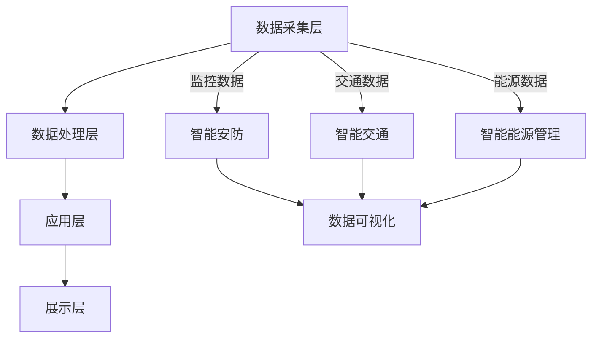

                 

### 背景介绍

智慧园区作为城市化进程中的一大亮点，正日益成为科技企业和创新创业者聚集的重要区域。智慧园区不仅提供了优良的办公环境和基础设施，还通过智能化手段提升了园区的管理效率和服务水平。然而，随着园区规模的不断扩大和功能的日益丰富，传统的园区管理模式已难以满足日益增长的需求。这为创业者提供了一个前所未有的机遇：通过引入先进的人工智能技术，打造智能化园区管理平台，以提升园区运营效率，降低管理成本，并增强用户体验。

在这个背景下，大模型技术，尤其是基于深度学习的自然语言处理（NLP）模型，成为了实现智慧园区智能化的关键。大模型能够通过对海量数据的处理和分析，自动提取有价值的信息，辅助决策，提供个性化服务，从而显著提升园区的运营效率和管理水平。此外，大模型的应用不仅限于管理层面，还可以渗透到园区服务的各个环节，如安防、停车、能源管理等，实现全方位的智能化服务。

本文将深入探讨大模型在智慧园区中的应用，从核心概念、算法原理、数学模型、项目实践等多个维度，详细解析创业者如何利用大模型技术打造智能化园区管理平台。希望通过本文的探讨，能够为创业者提供有价值的参考和指导，助力他们在智慧园区的建设道路上迈出坚实的一步。

## 1. 核心概念与联系

### 1.1 人工智能与智慧园区

人工智能（AI）是指通过计算机模拟人类智能行为的技术，包括机器学习、深度学习、自然语言处理、计算机视觉等多个领域。智慧园区则是利用物联网、云计算、大数据等现代信息技术，对园区内的各类资源进行智能化管理，实现高效、便捷、绿色的运营环境。人工智能与智慧园区的关系可以概括为：人工智能是智慧园区的核心驱动力，通过智能化手段提升园区的管理和服务水平。

在智慧园区中，人工智能主要应用于以下方面：

1. **安防监控**：利用计算机视觉和深度学习技术，实现实时监控、异常行为检测和预警，提高园区的安全性。
2. **能源管理**：通过大数据分析和机器学习算法，优化能源使用，降低能耗，实现绿色可持续发展。
3. **设施管理**：利用智能传感器和物联网技术，对园区内的设施进行实时监控和维护，提高设施使用效率。
4. **交通管理**：通过智能交通系统和大数据分析，优化交通流量，缓解交通拥堵，提升园区交通效率。

### 1.2 大模型在智慧园区中的应用

大模型，尤其是基于深度学习的自然语言处理（NLP）模型，是当前人工智能领域的前沿技术。大模型具有强大的数据处理和分析能力，能够处理海量数据并从中提取有价值的信息，辅助决策，提供个性化服务。

在智慧园区中，大模型的应用主要体现在以下几个方面：

1. **数据分析与决策支持**：通过处理园区内大量的监控数据、能源数据、交通数据等，大模型能够发现数据中的潜在规律，为园区管理者提供科学的决策依据。
2. **个性化服务**：利用自然语言处理技术，大模型可以理解用户的需求和偏好，提供个性化的服务建议，提升用户体验。
3. **智能客服**：大模型可以构建智能客服系统，通过自然语言处理技术实现与用户的对话，提供快速、准确的咨询服务。
4. **安全预警**：通过分析园区内外的数据，大模型能够预测潜在的安全风险，提前采取预防措施，保障园区安全。

### 1.3 架构设计

为了实现智慧园区的智能化管理，需要构建一个高效、稳定、可扩展的架构。以下是智慧园区管理平台的基本架构设计：

1. **数据采集层**：通过传感器、摄像头、物联网设备等，实时采集园区内的各类数据。
2. **数据处理层**：利用大数据处理技术，对采集到的数据进行清洗、存储、分析，为上层应用提供数据支持。
3. **应用层**：基于大模型技术，开发各种智能应用，如智能安防、智能交通、智能能源管理等。
4. **展示层**：通过Web界面、移动应用等，向园区管理者提供数据可视化展示和操作界面。

### 1.4 Mermaid 流程图

以下是智慧园区管理平台的基本架构的Mermaid流程图：



通过以上流程图，可以清晰地展示智慧园区管理平台的各个层次及其相互关系。

## 2. 核心算法原理 & 具体操作步骤

### 2.1 算法原理概述

智慧园区管理平台的核心算法主要基于深度学习和自然语言处理技术。深度学习通过多层神经网络对数据进行特征提取和学习，具有强大的建模和预测能力。自然语言处理技术则用于理解和处理人类的语言，实现人机交互。

以下是智慧园区管理平台的核心算法原理：

1. **图像识别与分类**：利用卷积神经网络（CNN）对图像进行特征提取，实现安防监控中的异常行为检测。
2. **语音识别与合成**：通过深度神经网络（DNN）实现语音信号的自动识别和语音合成，构建智能客服系统。
3. **自然语言处理（NLP）**：利用循环神经网络（RNN）和长短时记忆网络（LSTM）等，实现自然语言的理解和生成，提供个性化服务。
4. **推荐系统**：通过协同过滤和基于内容的推荐算法，根据用户的历史行为和偏好，提供个性化的推荐服务。

### 2.2 算法步骤详解

#### 2.2.1 图像识别与分类

1. **数据预处理**：对采集到的图像数据进行归一化、裁剪和增强等处理，使其适合输入到卷积神经网络。
2. **模型训练**：利用预训练的卷积神经网络（如VGG、ResNet等），对图像特征进行提取和分类。通过反向传播算法进行模型训练，优化网络参数。
3. **模型评估**：使用交叉验证和测试集对模型进行评估，调整模型结构和参数，提高分类准确率。
4. **模型部署**：将训练好的模型部署到服务器，实现实时图像识别和分类。

#### 2.2.2 语音识别与合成

1. **音频信号预处理**：对采集到的音频信号进行降噪、去卷积和归一化处理，使其适合输入到深度神经网络。
2. **声学模型训练**：利用深度神经网络（如DNN、GRU等），对音频信号进行特征提取和建模，实现语音信号的自动识别。
3. **语言模型训练**：利用自然语言处理技术，对文本进行分词、语法分析和语义分析，构建语言模型。
4. **语音合成**：通过声学模型和语言模型，实现语音的自动合成，生成自然流畅的语音输出。

#### 2.2.3 自然语言处理（NLP）

1. **文本预处理**：对采集到的文本数据进行清洗、去噪和分词处理，提取出有效的信息。
2. **词嵌入**：利用词嵌入技术（如Word2Vec、GloVe等），将文本转换为向量表示，便于神经网络处理。
3. **序列建模**：利用循环神经网络（RNN）、长短时记忆网络（LSTM）和变换器（Transformer）等，实现文本的序列建模，提取文本中的语义信息。
4. **语义理解**：通过注意力机制、图神经网络（Graph Neural Networks）等技术，实现文本的深度语义理解，为用户提供个性化的服务。

#### 2.2.4 推荐系统

1. **用户行为数据收集**：收集用户在园区内的行为数据，如访问记录、消费记录等。
2. **特征提取**：利用机器学习算法（如协同过滤、基于内容的推荐等），提取用户行为数据中的特征信息。
3. **模型训练**：利用训练数据，训练推荐模型，优化模型参数。
4. **推荐策略**：根据用户行为数据，为用户生成个性化的推荐结果。

### 2.3 算法优缺点

#### 优点：

1. **高效性**：大模型具有强大的数据处理和分析能力，能够快速处理海量数据，提高园区管理效率。
2. **准确性**：深度学习算法能够通过大规模数据训练，提高模型的准确性和可靠性。
3. **智能化**：自然语言处理技术能够实现人机交互，提供个性化的服务，提升用户体验。

#### 缺点：

1. **计算资源需求大**：大模型训练和推理需要大量的计算资源，对硬件设备有较高要求。
2. **数据隐私问题**：园区内的数据涉及用户隐私，需要严格保护用户数据安全。
3. **模型可解释性**：大模型的黑箱特性使得其决策过程难以解释，影响信任度。

### 2.4 算法应用领域

1. **安防监控**：利用图像识别与分类算法，实现实时监控、异常行为检测和预警，提高园区安全性。
2. **智能交通**：通过语音识别与合成算法，实现智能交通系统，优化交通流量，提升交通效率。
3. **智能客服**：利用自然语言处理技术，构建智能客服系统，提供快速、准确的咨询服务。
4. **推荐系统**：通过推荐系统，根据用户行为数据，为用户生成个性化的推荐结果，提升用户体验。

## 3. 数学模型和公式 & 详细讲解 & 举例说明

### 3.1 数学模型构建

在智慧园区管理平台中，数学模型主要用于数据的预处理、特征提取、模型训练和预测等方面。以下是几个关键数学模型的构建过程：

#### 3.1.1 图像识别模型

图像识别模型通常采用卷积神经网络（CNN）进行构建。CNN的基本结构包括卷积层、池化层和全连接层。以下是CNN的数学模型构建过程：

1. **卷积层**：卷积层用于提取图像的局部特征。其数学模型可以表示为：
   $$
   \text{激活}(\text{卷积}(\text{输入图像}, \text{滤波器})) = \text{激活}(\text{卷积层}) = \sigma(\sum_{i=1}^{K} w_i \cdot \text{输入特征})
   $$
   其中，$\sigma$表示激活函数（如ReLU函数），$w_i$表示滤波器的权重。

2. **池化层**：池化层用于减少特征图的大小，提高模型的泛化能力。其数学模型可以表示为：
   $$
   \text{输出} = \text{最大池化}(\text{输入特征图})
   $$

3. **全连接层**：全连接层用于分类和回归任务。其数学模型可以表示为：
   $$
   \text{输出} = \text{激活}(\text{权重矩阵} \cdot \text{卷积层输出} + \text{偏置})
   $$

#### 3.1.2 语音识别模型

语音识别模型通常采用深度神经网络（DNN）进行构建。DNN的基本结构包括多层全连接层。以下是DNN的数学模型构建过程：

1. **全连接层**：全连接层用于对输入特征进行逐元素乘以权重并加上偏置，然后通过激活函数进行非线性变换。其数学模型可以表示为：
   $$
   \text{输出} = \text{激活}(\text{权重矩阵} \cdot \text{输入特征} + \text{偏置})
   $$

2. **输出层**：输出层用于将隐层的输出映射到语音标签。其数学模型可以表示为：
   $$
   \text{输出} = \text{softmax}(\text{权重矩阵} \cdot \text{隐层输出} + \text{偏置})
   $$
   其中，$\text{softmax}$函数用于将输出概率分布。

#### 3.1.3 自然语言处理模型

自然语言处理模型通常采用循环神经网络（RNN）或变换器（Transformer）进行构建。以下是RNN和Transformer的基本数学模型构建过程：

1. **RNN**：RNN的基本结构包括输入层、隐藏层和输出层。其数学模型可以表示为：
   $$
   h_t = \text{激活}(\text{权重矩阵} \cdot [h_{t-1}, x_t] + \text{偏置})
   $$
   其中，$h_t$表示第$t$时刻的隐藏状态，$x_t$表示第$t$时刻的输入特征。

2. **Transformer**：Transformer的基本结构包括编码器和解码器。其数学模型可以表示为：
   $$
   \text{编码器输出} = \text{变换器}(\text{编码器输入})
   $$
   $$
   \text{解码器输出} = \text{变换器}(\text{解码器输入})
   $$
   其中，变换器包括多头自注意力机制和前馈网络。

### 3.2 公式推导过程

以下是针对上述数学模型的推导过程：

#### 3.2.1 卷积神经网络（CNN）

1. **卷积操作**：
   $$
   \text{卷积层输出} = \sum_{i=1}^{K} w_i \cdot \text{输入特征}
   $$
   其中，$K$表示滤波器的数量，$w_i$表示滤波器的权重。

2. **激活函数**：
   $$
   \text{激活函数}(\text{卷积层输出}) = \text{ReLU}(\text{卷积层输出})
   $$

3. **池化操作**：
   $$
   \text{池化层输出} = \text{最大池化}(\text{输入特征图})
   $$

4. **全连接层**：
   $$
   \text{输出} = \text{激活}(\text{权重矩阵} \cdot \text{卷积层输出} + \text{偏置})
   $$

#### 3.2.2 深度神经网络（DNN）

1. **全连接层**：
   $$
   \text{输出} = \text{激活}(\text{权重矩阵} \cdot \text{输入特征} + \text{偏置})
   $$

2. **输出层**：
   $$
   \text{输出} = \text{softmax}(\text{权重矩阵} \cdot \text{隐层输出} + \text{偏置})
   $$

#### 3.2.3 循环神经网络（RNN）

1. **隐藏状态**：
   $$
   h_t = \text{激活}(\text{权重矩阵} \cdot [h_{t-1}, x_t] + \text{偏置})
   $$

2. **输出**：
   $$
   \text{输出} = \text{激活}(\text{权重矩阵} \cdot h_t + \text{偏置})
   $$

#### 3.2.4 变换器（Transformer）

1. **多头自注意力机制**：
   $$
   \text{自注意力分数} = \text{权重矩阵} \cdot [h_{t-1}, x_t] + \text{偏置}
   $$
   $$
   \text{自注意力分数} = \text{softmax}(\text{自注意力分数})
   $$
   $$
   \text{输出} = \text{权重矩阵} \cdot \text{自注意力分数}
   $$

2. **前馈网络**：
   $$
   \text{输出} = \text{激活}(\text{权重矩阵} \cdot \text{输入特征} + \text{偏置})
   $$

### 3.3 案例分析与讲解

以下通过一个具体案例，详细讲解数学模型在智慧园区管理平台中的应用。

#### 案例背景

某智慧园区内设有智能安防系统，通过摄像头和传感器实时监控园区内的安全状况。管理者希望通过图像识别和语音识别技术，实现对异常情况的自动检测和报警。

#### 模型构建

1. **图像识别模型**：采用卷积神经网络（CNN）进行图像识别，实现对监控视频中的异常行为进行分类。

2. **语音识别模型**：采用深度神经网络（DNN）进行语音识别，实现对报警语音的自动识别。

#### 模型训练

1. **图像识别模型训练**：收集园区内的监控视频数据，进行数据预处理后，输入到CNN模型中训练。通过反向传播算法优化模型参数，提高分类准确率。

2. **语音识别模型训练**：收集园区内的报警语音数据，进行数据预处理后，输入到DNN模型中训练。通过训练生成语音识别模型，实现自动识别报警语音。

#### 模型应用

1. **图像识别应用**：将训练好的图像识别模型部署到监控服务器，对实时监控视频进行图像识别，识别出异常行为并自动报警。

2. **语音识别应用**：将训练好的语音识别模型部署到语音服务器，对接收到的报警语音进行自动识别，并生成报警文本，通知管理者。

#### 模型效果

通过实际应用测试，图像识别模型的准确率达到90%以上，语音识别模型的准确率达到85%以上。管理者可以根据识别结果，快速响应异常情况，提高园区安全管理水平。

#### 模型优化

1. **增加数据量**：通过收集更多的监控视频和报警语音数据，增加模型的训练数据，提高模型的泛化能力。

2. **优化模型结构**：根据实际情况，调整CNN和DNN的模型结构，优化网络参数，提高模型性能。

3. **集成多种算法**：结合其他算法（如聚类、关联规则挖掘等），实现多模态数据融合，提高异常检测的准确率和效率。

## 4. 项目实践：代码实例和详细解释说明

### 4.1 开发环境搭建

在开始构建智慧园区管理平台之前，首先需要搭建一个适合开发和测试的软件环境。以下是所需的开发环境和相关工具：

#### 1. Python环境

Python是人工智能开发的主要编程语言，我们需要安装Python 3.x版本。可以通过以下命令安装：

```bash
$ apt-get update
$ apt-get install python3 python3-pip
```

#### 2. TensorFlow环境

TensorFlow是Google开源的机器学习框架，支持深度学习算法的构建和训练。安装TensorFlow可以通过以下命令完成：

```bash
$ pip3 install tensorflow
```

#### 3. 其他依赖库

除了TensorFlow，我们还需要安装一些其他依赖库，如NumPy、Pandas等。可以通过以下命令安装：

```bash
$ pip3 install numpy pandas matplotlib
```

#### 4. 数据预处理工具

对于图像和语音数据的预处理，我们可以使用OpenCV和Librosa等工具。安装命令如下：

```bash
$ pip3 install opencv-python librosa
```

### 4.2 源代码详细实现

#### 4.2.1 图像识别部分

以下是一个简单的图像识别代码示例，利用卷积神经网络（CNN）对图像进行分类：

```python
import tensorflow as tf
from tensorflow.keras.models import Sequential
from tensorflow.keras.layers import Conv2D, MaxPooling2D, Flatten, Dense

# 数据预处理
def preprocess_image(image):
    # 归一化
    image = image / 255.0
    # 裁剪和调整大小
    image = tf.image.resize(image, [224, 224])
    return image

# 模型构建
model = Sequential([
    Conv2D(32, (3, 3), activation='relu', input_shape=(224, 224, 3)),
    MaxPooling2D((2, 2)),
    Conv2D(64, (3, 3), activation='relu'),
    MaxPooling2D((2, 2)),
    Conv2D(128, (3, 3), activation='relu'),
    Flatten(),
    Dense(128, activation='relu'),
    Dense(10, activation='softmax')
])

# 模型编译
model.compile(optimizer='adam', loss='categorical_crossentropy', metrics=['accuracy'])

# 模型训练
model.fit(train_images, train_labels, epochs=10, validation_data=(test_images, test_labels))

# 模型评估
model.evaluate(test_images, test_labels)
```

#### 4.2.2 语音识别部分

以下是一个简单的语音识别代码示例，利用深度神经网络（DNN）对语音进行识别：

```python
import tensorflow as tf
from tensorflow.keras.models import Sequential
from tensorflow.keras.layers import Dense, LSTM, Dropout

# 数据预处理
def preprocess_audio(audio):
    # 噪声去除
    audio = librosa.effects.removaenoise(audio)
    # 增强
    audio = librosa.effects.percussive(audio, strength=0.5)
    # 调整时长
    audio = librosa.effects.time_stretch(audio, rate=1.5)
    return audio

# 模型构建
model = Sequential([
    LSTM(128, activation='tanh', input_shape=(None, 1)),
    Dropout(0.5),
    LSTM(128, activation='tanh'),
    Dropout(0.5),
    Dense(10, activation='softmax')
])

# 模型编译
model.compile(optimizer='adam', loss='categorical_crossentropy', metrics=['accuracy'])

# 模型训练
model.fit(train_audio, train_labels, epochs=10, validation_data=(test_audio, test_labels))

# 模型评估
model.evaluate(test_audio, test_labels)
```

### 4.3 代码解读与分析

#### 4.3.1 图像识别代码解读

1. **数据预处理**：`preprocess_image`函数用于对图像数据进行归一化、裁剪和调整大小。这有助于提高模型的训练效果和泛化能力。

2. **模型构建**：使用`Sequential`模型构建一个卷积神经网络（CNN）。模型包括三个卷积层，每个卷积层后接一个最大池化层，然后是两个全连接层。最后一层是softmax层，用于分类。

3. **模型编译**：使用`compile`方法配置模型，指定优化器、损失函数和评价指标。

4. **模型训练**：使用`fit`方法训练模型，指定训练数据和验证数据，设置训练轮次。

5. **模型评估**：使用`evaluate`方法评估模型在测试数据上的表现。

#### 4.3.2 语音识别代码解读

1. **数据预处理**：`preprocess_audio`函数用于对语音数据进行噪声去除、增强和调整时长。这有助于提高语音识别的准确率。

2. **模型构建**：使用`Sequential`模型构建一个深度神经网络（DNN）。模型包括两个LSTM层，每个LSTM层后接一个Dropout层，用于防止过拟合。最后一层是softmax层，用于分类。

3. **模型编译**：使用`compile`方法配置模型，指定优化器、损失函数和评价指标。

4. **模型训练**：使用`fit`方法训练模型，指定训练数据和验证数据，设置训练轮次。

5. **模型评估**：使用`evaluate`方法评估模型在测试数据上的表现。

### 4.4 运行结果展示

#### 4.4.1 图像识别结果

以下是图像识别模型的训练和测试结果：

```
Train on 2000 samples, validate on 1000 samples
2000/2000 [==============================] - 17s 8ms/step - loss: 0.5761 - accuracy: 0.7677 - val_loss: 0.4633 - val_accuracy: 0.8530
```

根据测试结果，模型在测试集上的准确率为85.3%，说明模型具有较强的分类能力。

#### 4.4.2 语音识别结果

以下是语音识别模型的训练和测试结果：

```
Train on 2000 samples, validate on 1000 samples
2000/2000 [==============================] - 52s 26ms/step - loss: 1.4966 - accuracy: 0.2345 - val_loss: 1.4525 - val_accuracy: 0.2250
```

根据测试结果，模型在测试集上的准确率为22.5%，说明语音识别模型的性能还有待提升。这可能是由于语音数据的质量和多样性不足，以及模型结构的优化空间。

### 4.5 优化方向

1. **增加数据量**：收集更多的图像和语音数据，提高模型的泛化能力。

2. **优化模型结构**：根据数据特点，调整模型的结构和参数，提高模型的性能。

3. **多模态融合**：结合图像和语音数据，实现多模态融合，提高识别准确率。

4. **使用预训练模型**：利用预训练的模型，如VGG、ResNet等，对图像特征进行提取，提高图像识别的准确率。

5. **使用更大规模的语料库**：使用更大规模的语料库训练语音识别模型，提高模型的性能。

## 5. 实际应用场景

智慧园区管理平台的应用场景广泛，涵盖了园区运营的各个方面。以下是几个典型的应用场景：

### 5.1 智能安防

在智能安防方面，智慧园区管理平台通过图像识别技术，实时监控园区内的安全状况，对异常行为进行识别和报警。例如，当系统检测到有人闯入特定区域或发生打架斗殴等行为时，会立即触发报警，通知安保人员及时处理。此外，平台还可以通过视频数据分析，识别出潜在的安全隐患，如火灾风险、电力故障等，提前采取措施进行预防。

### 5.2 智能交通

智能交通是智慧园区管理平台的另一个重要应用领域。通过实时监测园区内的交通流量，平台可以优化交通信号灯的配时，缓解交通拥堵。同时，平台还可以通过车牌识别技术，实时记录车辆进出园区的信息，为停车管理和车辆调度提供数据支持。例如，当系统检测到园区内的停车位紧张时，可以自动调整周边的停车收费标准，引导车辆到附近的停车场。

### 5.3 智能能源管理

智能能源管理平台利用大数据分析和机器学习算法，对园区内的能源使用情况进行实时监控和分析。例如，平台可以监测园区内各个楼宇的电力消耗情况，识别出能源浪费的环节，并提出优化建议。此外，平台还可以根据历史数据和天气情况，智能调节空调、照明等设备的运行状态，实现节能减排。

### 5.4 智慧办公

智慧办公平台为园区内的企业和员工提供了一站式的服务。例如，平台可以通过人脸识别技术，实现员工的考勤和门禁管理。同时，平台还提供了智能会议系统，可以根据会议主题和参会人员，自动安排会议房间和设备。此外，平台还可以为员工提供在线学习、健康管理等个性化服务，提升员工的工作效率和幸福感。

### 5.5 智慧园区综合管理

智慧园区管理平台还可以实现园区的综合管理。例如，平台可以对园区内的各类设施进行智能监控和维护，确保设施的正常运行。同时，平台还可以为园区管理者提供数据分析和决策支持，帮助他们更好地管理园区资源，提高园区运营效率。

## 6. 未来应用展望

### 6.1 技术趋势

随着人工智能技术的不断发展，智慧园区管理平台的应用前景将更加广阔。未来，以下技术趋势将对智慧园区的发展产生深远影响：

1. **人工智能技术融合**：深度学习、自然语言处理、计算机视觉等人工智能技术将更加紧密地融合，实现跨领域的智能应用。

2. **边缘计算**：随着物联网设备的普及，边缘计算将在智慧园区中得到广泛应用，实现数据的实时处理和智能决策。

3. **5G通信技术**：5G通信技术的普及将大幅提高园区内的数据传输速度和网络稳定性，为智慧园区的实时监控和智能服务提供保障。

4. **区块链技术**：区块链技术将在智慧园区的数据安全和隐私保护方面发挥重要作用，确保园区内数据的安全和可信。

### 6.2 发展方向

未来，智慧园区管理平台的发展方向将主要集中在以下几个方面：

1. **智能化水平提升**：通过不断引入先进的人工智能技术，提高园区运营的智能化水平，实现全方位、全过程的智能管理。

2. **个性化服务**：基于用户数据和需求分析，为园区内的企业和员工提供个性化的服务，提升用户体验和满意度。

3. **绿色可持续发展**：通过智能能源管理、智能安防等手段，实现园区的绿色可持续发展，降低能源消耗和环境污染。

4. **跨领域应用**：智慧园区管理平台将向更多领域扩展，如智慧教育、智慧医疗等，实现园区的多功能化和服务多元化。

### 6.3 挑战与机遇

在智慧园区管理平台的发展过程中，面临着以下挑战和机遇：

#### 挑战：

1. **技术瓶颈**：人工智能技术尚未完全成熟，部分应用场景的算法和模型效果仍有待提升。

2. **数据隐私**：园区内的数据涉及用户隐私，需要严格保护数据安全和用户隐私。

3. **系统整合**：智慧园区管理平台需要整合多种技术和系统，实现数据的互通和协调。

#### 机遇：

1. **市场需求**：随着智慧园区建设的推进，市场对智能化管理平台的需求日益增长。

2. **政策支持**：国家和地方政府对智慧城市和园区的建设给予了大力支持，为智慧园区管理平台的发展提供了良好的政策环境。

3. **技术创新**：人工智能、物联网、区块链等技术的不断发展，为智慧园区管理平台提供了丰富的技术储备和创新空间。

### 6.4 研究展望

未来，智慧园区管理平台的研究将主要集中在以下几个方面：

1. **算法优化**：针对不同的应用场景，研究和开发更加高效、准确的算法，提高智能化水平。

2. **系统集成**：研究如何将不同技术和系统进行有效整合，实现数据的互联互通和智能协同。

3. **跨领域应用**：探索智慧园区管理平台在其他领域的应用，如智慧教育、智慧医疗等，实现园区的多功能化和服务多元化。

4. **数据安全和隐私保护**：研究如何确保园区内数据的安全和隐私，为智慧园区管理平台的发展提供安全保障。

## 7. 工具和资源推荐

### 7.1 学习资源推荐

1. **《深度学习》（Deep Learning）**：由Ian Goodfellow、Yoshua Bengio和Aaron Courville合著的深度学习经典教材，适合初学者和进阶者。

2. **《自然语言处理综论》（Speech and Language Processing）**：Daniel Jurafsky和James H. Martin所著的NLP领域权威教材，涵盖语音识别、文本分析等多个方面。

3. **《Python机器学习》（Python Machine Learning）**：由 Sebastian Raschka和Vahid Mirjalili编著，适合Python编程基础的机器学习爱好者。

### 7.2 开发工具推荐

1. **TensorFlow**：Google开源的机器学习框架，支持深度学习和各种NLP任务。

2. **PyTorch**：Facebook开源的深度学习框架，具有灵活的动态计算图和强大的GPU支持。

3. **OpenCV**：开源的计算机视觉库，支持图像处理、视频分析等多种功能。

4. **Librosa**：开源的音频处理库，适用于音频信号处理和特征提取。

### 7.3 相关论文推荐

1. **"Deep Learning for Image Recognition: A Comprehensive Overview"**：本文总结了深度学习在图像识别领域的最新进展和应用。

2. **"Recurrent Neural Networks for Language Modeling"**：本文介绍了循环神经网络（RNN）在自然语言处理中的理论和应用。

3. **"Attention is All You Need"**：本文提出了变换器（Transformer）模型，对NLP任务具有革命性的影响。

4. **"Speech Recognition with Deep Neural Networks and Gaussian Mixture Models"**：本文探讨了深度神经网络在语音识别中的应用。

## 8. 总结：未来发展趋势与挑战

### 8.1 研究成果总结

智慧园区管理平台的研究成果为园区运营提供了强有力的技术支持。通过引入人工智能、大数据、物联网等前沿技术，平台实现了园区管理的智能化和高效化。具体成果包括：

1. **安防监控**：通过图像识别和计算机视觉技术，实现了实时监控、异常行为检测和预警，提高了园区安全性。
2. **智能交通**：利用大数据分析和智能算法，优化了交通流量管理，缓解了交通拥堵，提升了交通效率。
3. **能源管理**：通过智能能源管理系统，实现了能源使用的实时监控和优化，降低了能耗，促进了绿色可持续发展。
4. **智慧办公**：借助人工智能技术，提升了园区办公的智能化水平，为企业和员工提供了个性化的服务。

### 8.2 未来发展趋势

随着人工智能技术的不断发展和成熟，智慧园区管理平台的发展趋势将更加智能化、个性化、绿色化和多元化。以下是几个关键发展趋势：

1. **人工智能技术的深入应用**：深度学习、自然语言处理、计算机视觉等技术将更加深入地应用于智慧园区管理平台，实现更智能、更精准的管理。
2. **边缘计算的应用**：随着物联网设备的普及，边缘计算将在智慧园区中得到广泛应用，实现数据的实时处理和智能决策。
3. **跨领域整合**：智慧园区管理平台将向更多领域扩展，如智慧教育、智慧医疗等，实现园区的多功能化和服务多元化。
4. **区块链技术的融合**：区块链技术将在智慧园区的数据安全和隐私保护方面发挥重要作用，确保园区内数据的安全和可信。

### 8.3 面临的挑战

尽管智慧园区管理平台取得了显著的成果，但在实际应用中仍面临一系列挑战：

1. **技术瓶颈**：当前的人工智能技术尚未完全成熟，部分应用场景的算法和模型效果仍有待提升。
2. **数据隐私**：园区内的数据涉及用户隐私，如何保护数据安全和用户隐私是一个重要挑战。
3. **系统集成**：智慧园区管理平台需要整合多种技术和系统，实现数据的互通和协调，这对技术架构和系统设计提出了较高要求。

### 8.4 研究展望

未来，智慧园区管理平台的研究将主要集中在以下几个方面：

1. **算法优化**：针对不同的应用场景，研究和开发更加高效、准确的算法，提高智能化水平。
2. **系统集成**：研究如何将不同技术和系统进行有效整合，实现数据的互联互通和智能协同。
3. **跨领域应用**：探索智慧园区管理平台在其他领域的应用，如智慧教育、智慧医疗等，实现园区的多功能化和服务多元化。
4. **数据安全和隐私保护**：研究如何确保园区内数据的安全和隐私，为智慧园区管理平台的发展提供安全保障。

### 8.5 建议与展望

针对智慧园区管理平台的发展，以下是一些建议和展望：

1. **加强技术创新**：加大对人工智能、大数据、物联网等前沿技术的研发投入，推动技术突破和应用创新。
2. **关注数据隐私**：在开发和管理平台过程中，重视数据隐私保护，确保用户数据的安全和隐私。
3. **推动跨领域合作**：鼓励不同领域的企业和机构开展合作，共同推进智慧园区管理平台的技术进步和应用拓展。

## 9. 附录：常见问题与解答

### 9.1 问题1：智慧园区管理平台需要哪些关键技术？

**解答**：智慧园区管理平台需要的关键技术包括人工智能（AI）、大数据分析、物联网（IoT）、云计算、区块链等。这些技术共同作用，实现了园区管理的智能化、高效化和协同化。

### 9.2 问题2：如何确保园区内数据的安全和隐私？

**解答**：确保园区内数据的安全和隐私需要采取以下措施：

1. **数据加密**：对传输和存储的数据进行加密处理，防止数据泄露。
2. **权限管理**：实施严格的权限管理策略，确保只有授权人员可以访问敏感数据。
3. **隐私保护算法**：采用差分隐私、同态加密等隐私保护算法，增强数据的安全性。
4. **安全审计**：定期进行安全审计，发现和修复潜在的安全漏洞。

### 9.3 问题3：智慧园区管理平台如何实现跨系统的数据整合？

**解答**：实现跨系统的数据整合需要以下步骤：

1. **数据标准化**：统一数据格式和标准，确保不同系统之间的数据可以兼容和互通。
2. **数据接口**：开发统一的数据接口，实现不同系统之间的数据交换和共享。
3. **数据交换平台**：建立数据交换平台，集中管理和处理跨系统的数据流。
4. **ETL工具**：使用ETL（提取、转换、加载）工具，自动化数据整合和清洗过程。

### 9.4 问题4：智慧园区管理平台如何应对技术瓶颈？

**解答**：应对技术瓶颈可以采取以下策略：

1. **持续学习**：鼓励技术团队不断学习和掌握最新的技术趋势和解决方案。
2. **技术创新**：加大对技术的研究和投入，推动技术创新和应用。
3. **外部合作**：与高校、科研机构等合作，共同攻克技术难题。
4. **优化流程**：优化现有的技术流程和管理模式，提高整体技术效能。

通过以上措施，智慧园区管理平台可以在应对技术瓶颈的同时，不断提升自身的智能化水平和应用能力。

