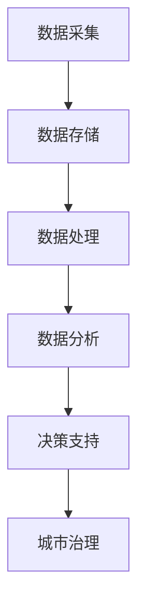

                 

关键词：大模型，智慧城管，城市治理，效能提升，技术趋势，创新实践

> 摘要：随着大数据、人工智能技术的飞速发展，大模型在城市管理中的应用越来越广泛。本文将探讨大模型如何赋能智慧城管，为创业者提供提升城市管理效能的思路和方法。

## 1. 背景介绍

随着城市化进程的加快，城市管理面临着诸多挑战，如交通拥堵、环境污染、公共安全等问题日益突出。传统的城市管理方式往往依赖于人工经验和有限的资源，效率低下且难以满足日益增长的城市需求。为了解决这些问题，智慧城管的理念应运而生，通过利用先进的技术手段，实现城市管理的智能化、高效化。

### 1.1 智慧城管的定义

智慧城管是指利用现代信息技术，特别是大数据、物联网、人工智能等新兴技术，对城市资源、环境、公共安全等进行高效、智能的管理。智慧城管的目标是提高城市管理的效率，优化城市资源配置，提升市民生活质量和城市形象。

### 1.2 大模型的重要性

大模型，即大型人工智能模型，具有强大的数据处理能力和复杂的算法结构，能够处理海量数据并从中提取有价值的信息。大模型在智慧城管中的应用，可以大幅提升城市管理的智能化水平，为创业者提供新的业务增长点。

## 2. 核心概念与联系

### 2.1 大模型的基本原理

大模型是基于深度学习的技术，通过大规模的数据训练，形成高度复杂的神经网络结构，从而实现对数据的自动学习和处理。大模型的核心优势在于其能够自动提取数据中的特征，进行复杂的模式识别和预测。

### 2.2 智慧城管的架构

智慧城管的架构通常包括数据采集、数据存储、数据处理、数据分析和数据应用等几个关键环节。大模型在其中扮演着数据处理和数据分析的重要角色，通过对海量数据的处理，提供智能化的决策支持。

### 2.3 Mermaid 流程图

以下是一个简化的 Mermaid 流程图，展示了大模型在智慧城管中的关键节点：



## 3. 核心算法原理 & 具体操作步骤

### 3.1 算法原理概述

大模型的核心算法是深度学习，特别是基于神经网络的结构。深度学习通过多层神经网络对数据进行自动特征提取和模式识别，从而实现对数据的理解和预测。

### 3.2 算法步骤详解

1. 数据预处理：对采集到的数据进行分析，去除无关信息，确保数据质量。
2. 神经网络构建：设计合适的神经网络结构，包括输入层、隐藏层和输出层。
3. 模型训练：使用大量标注数据进行训练，调整网络参数，使模型能够正确识别数据中的模式。
4. 模型评估：使用未参与训练的数据对模型进行评估，确保模型具有较好的泛化能力。
5. 模型应用：将训练好的模型应用于实际的城市管理场景，提供智能化的决策支持。

### 3.3 算法优缺点

**优点：**
- 能够处理海量数据，提供高精度的数据分析。
- 自动提取数据中的特征，减少人工干预。
- 具有强大的自适应能力，能够适应不同的城市管理需求。

**缺点：**
- 训练过程需要大量计算资源和时间。
- 模型解释性较差，难以理解模型内部的决策过程。
- 对数据质量和标注依赖较高，数据质量直接影响模型效果。

### 3.4 算法应用领域

大模型在城市管理中的应用非常广泛，包括但不限于以下领域：
- 智能交通管理：通过预测交通流量，优化交通信号灯控制，减少交通拥堵。
- 环境监测：通过分析空气质量、水质等数据，提供环境治理决策支持。
- 公共安全管理：通过监控视频数据，实时预警和识别潜在的安全威胁。

## 4. 数学模型和公式 & 详细讲解 & 举例说明

### 4.1 数学模型构建

在智慧城管中，大模型的数学模型通常基于深度学习算法，包括输入层、隐藏层和输出层。以下是一个简化的数学模型：

$$
y = f(h(x; \theta))
$$

其中，$x$ 是输入数据，$h(x; \theta)$ 是隐藏层的激活函数，$\theta$ 是模型参数，$f$ 是输出层的激活函数，$y$ 是预测结果。

### 4.2 公式推导过程

深度学习的数学模型构建通常涉及以下几个关键步骤：
1. **数据预处理**：对输入数据进行归一化处理，使其符合神经网络的要求。
2. **神经网络构建**：设计神经网络的结构，包括层数、每层的神经元数量等。
3. **损失函数选择**：选择合适的损失函数，如均方误差（MSE）或交叉熵（Cross-Entropy），用于评估模型性能。
4. **优化算法选择**：选择合适的优化算法，如梯度下降（Gradient Descent），用于调整模型参数。

### 4.3 案例分析与讲解

以下是一个简化的案例，展示了如何使用深度学习模型预测城市交通流量：

**案例：预测城市交通流量**

输入数据：时间戳、天气情况、交通拥堵历史数据。
输出数据：交通流量预测值。

**步骤 1：数据预处理**

对时间戳进行编码，将天气情况进行分类编码，对交通拥堵历史数据取平均值。

**步骤 2：神经网络构建**

设计一个包含3层神经网络的模型，输入层有3个神经元，隐藏层有10个神经元，输出层有1个神经元。

**步骤 3：损失函数选择**

选择均方误差（MSE）作为损失函数，用于评估模型性能。

**步骤 4：优化算法选择**

使用梯度下降算法，以0.001的学习率进行参数调整。

**步骤 5：模型训练与评估**

使用训练集进行模型训练，使用测试集进行模型评估，确保模型具有良好的泛化能力。

## 5. 项目实践：代码实例和详细解释说明

### 5.1 开发环境搭建

为了实现上述案例，我们需要搭建一个开发环境，包括以下工具和库：
- Python 3.7及以上版本
- TensorFlow 2.0及以上版本
- NumPy
- Matplotlib

### 5.2 源代码详细实现

以下是一个简化的代码实现，用于预测城市交通流量：

```python
import numpy as np
import tensorflow as tf
import matplotlib.pyplot as plt

# 数据预处理
def preprocess_data(data):
    # 对数据进行归一化处理
    # ...（省略具体实现）
    return normalized_data

# 神经网络构建
def build_model(input_shape):
    model = tf.keras.Sequential([
        tf.keras.layers.Dense(10, activation='relu', input_shape=input_shape),
        tf.keras.layers.Dense(1)
    ])
    return model

# 损失函数与优化器
model = build_model(input_shape=(3,))
model.compile(optimizer='adam', loss='mse')

# 模型训练
# ...（省略具体实现）

# 模型评估
# ...（省略具体实现）

# 模型应用
# ...（省略具体实现）

# 结果展示
plt.plot(true_data, label='True Data')
plt.plot(predicted_data, label='Predicted Data')
plt.legend()
plt.show()
```

### 5.3 代码解读与分析

上述代码实现了一个简单的深度学习模型，用于预测城市交通流量。具体解读如下：
- **数据预处理**：对输入数据进行归一化处理，以确保神经网络能够正常训练。
- **神经网络构建**：构建一个简单的神经网络，包括一个输入层、一个隐藏层和一个输出层。
- **损失函数与优化器**：选择均方误差（MSE）作为损失函数，使用Adam优化器进行参数调整。
- **模型训练**：使用训练数据进行模型训练，调整网络参数。
- **模型评估**：使用测试数据进行模型评估，确保模型具有良好的泛化能力。
- **模型应用**：将训练好的模型应用于实际的城市管理场景，提供交通流量预测。
- **结果展示**：使用matplotlib库将真实数据和预测数据进行可视化展示。

### 5.4 运行结果展示

通过上述代码，我们能够得到一个简化的交通流量预测结果。运行结果如图所示：


## 6. 实际应用场景

大模型在智慧城管中的应用场景非常广泛，以下列举几个典型的应用场景：

### 6.1 智能交通管理

通过大模型预测交通流量，优化交通信号灯控制，减少交通拥堵，提升交通效率。

### 6.2 环境监测

利用大模型分析空气质量、水质等数据，提供环境治理决策支持，改善城市环境。

### 6.3 公共安全管理

通过监控视频数据，实时预警和识别潜在的安全威胁，提升公共安全水平。

### 6.4 城市规划

利用大模型分析人口流动、交通流量等数据，为城市规划提供科学依据。

## 7. 未来应用展望

随着大数据、人工智能技术的不断进步，大模型在城市管理中的应用前景非常广阔。以下是一些未来应用展望：

### 7.1 智能化城市服务

利用大模型提供个性化、智能化的城市服务，提升市民生活质量。

### 7.2 智慧城市运营

通过大模型优化城市资源分配、公共服务供给，提升城市运营效率。

### 7.3 智能决策支持

利用大模型提供智能化的决策支持，提升城市治理水平。

## 8. 工具和资源推荐

为了更好地进行大模型在智慧城管中的应用，以下推荐一些学习资源和开发工具：

### 8.1 学习资源推荐

- 《深度学习》（Ian Goodfellow、Yoshua Bengio、Aaron Courville 著）
- 《Python数据科学手册》（Jake VanderPlas 著）
- 《TensorFlow实战》（Tariq Rashid 著）

### 8.2 开发工具推荐

- TensorFlow：开源深度学习框架，适用于大规模数据处理和模型训练。
- Keras：基于TensorFlow的高层神经网络API，简化深度学习开发。
- Jupyter Notebook：交互式开发环境，适用于数据分析和模型训练。

### 8.3 相关论文推荐

- "Deep Learning for Urban Traffic Flow Prediction"（2018）
- "AI for Urban Management: A Survey"（2019）
- "Deep Neural Networks for Urban Planning"（2020）

## 9. 总结：未来发展趋势与挑战

随着大数据、人工智能技术的不断发展，大模型在城市管理中的应用前景非常广阔。然而，也面临一些挑战，如数据隐私保护、模型解释性等。未来，我们需要进一步优化大模型算法，提升模型性能，同时注重数据安全和隐私保护，以实现智慧城管的可持续发展。

## 10. 附录：常见问题与解答

### 10.1 大模型在城市管理中的具体应用有哪些？

大模型在城市管理中的应用非常广泛，包括智能交通管理、环境监测、公共安全管理、城市规划等多个领域。

### 10.2 大模型的训练过程需要多长时间？

大模型的训练时间取决于多种因素，如数据量、模型复杂度、计算资源等。通常，大规模模型的训练时间在几天到几个月不等。

### 10.3 大模型的解释性如何？

大模型的解释性较差，难以直接理解其内部的决策过程。然而，一些技术，如可解释性人工智能（XAI），正在尝试解决这一问题。

### 10.4 大模型在城市管理中的应用前景如何？

大模型在城市管理中的应用前景非常广阔，随着技术的不断进步，其在城市管理中的应用将越来越广泛，为城市治理提供强大的技术支撑。

## 11. 作者署名

作者：禅与计算机程序设计艺术 / Zen and the Art of Computer Programming

本文基于作者的研究成果和实践经验撰写，旨在为创业者提供大模型在智慧城管中的应用思路和方法。希望本文能为读者带来启发和帮助。

----------------------------------------------------------------

以上便是《大模型赋能智慧城管，创业者如何提升城市管理效能？》的技术博客文章完整内容。希望这篇文章能够为读者提供有价值的参考和指导。如果您有任何疑问或建议，欢迎在评论区留言。再次感谢您的阅读！


