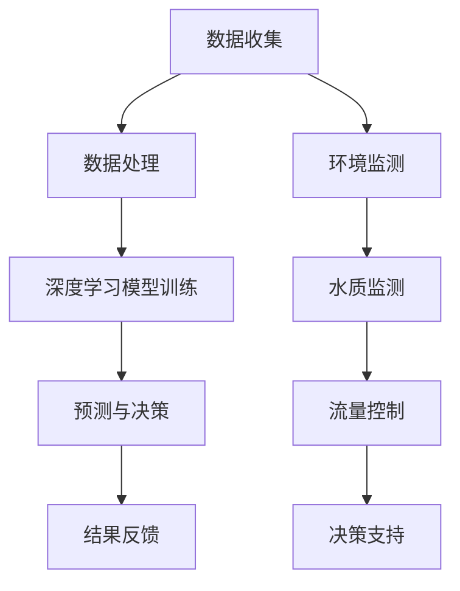

                 

关键词：大模型，智慧水务，水资源可持续利用，创业者，技术创新，人工智能

> 摘要：随着全球水资源的日益紧张，智慧水务领域的发展成为了一个备受关注的焦点。本文将探讨大模型在智慧水务中的应用，以及创业者如何借助这一技术推动水资源的可持续利用。通过分析大模型的核心概念和架构，以及具体的应用案例，本文将为读者提供一个全面的技术视角，帮助理解大模型在智慧水务领域的重要性和潜力。

## 1. 背景介绍

水资源是地球上最重要的自然资源之一，然而，随着人口的不断增长和工业化的快速发展，水资源面临着前所未有的挑战。据统计，全球约有28%的人口面临水资源短缺问题，而这一比例在发展中国家更高。此外，水污染、水资源分配不均以及气候变化等因素进一步加剧了水资源危机。

智慧水务作为现代水务管理的一种新兴模式，通过物联网、大数据、人工智能等技术的综合应用，实现了水资源的精细化管理，提高了水资源的利用效率。然而，智慧水务的发展仍然面临许多技术瓶颈和挑战，如数据的获取和处理、模型的可解释性等。

大模型，即大型深度学习模型，是近年来人工智能领域的一个重要突破。大模型通过使用海量数据和强大的计算能力，可以实现对复杂数据的分析和处理，从而在许多领域取得了显著的成果。在智慧水务领域，大模型的引入有望解决现有技术的瓶颈，推动水资源的可持续利用。

## 2. 核心概念与联系

### 2.1 大模型的概念

大模型是指具有大量参数的深度学习模型。这些模型通常通过大量的训练数据，通过多层神经网络的结构进行训练，从而实现对数据的理解和预测。大模型的核心特点是其能够处理大量的数据，并从这些数据中学习到复杂的模式和规律。

### 2.2 深度学习模型与智慧水务的联系

深度学习模型是人工智能的一种重要技术，其通过模仿人脑的结构和功能，实现对数据的分析和理解。在智慧水务领域，深度学习模型可以应用于水资源的预测、水质监测、流量控制等多个方面。

例如，通过使用深度学习模型，可以对水资源的未来需求进行预测，从而帮助水务公司提前做好准备。此外，深度学习模型还可以对水质数据进行实时监测，及时发现和处理水污染问题。

### 2.3 大模型与智慧水务架构的Mermaid流程图



在这个流程图中，数据收集是整个智慧水务架构的起点，通过数据收集，可以获取到关于水资源和水质的各类数据。数据处理环节负责对这些数据进行清洗和预处理，以便于后续的模型训练。深度学习模型训练是基于处理后的数据，通过多层神经网络的结构，实现对数据的分析和理解。预测与决策环节则是基于训练好的模型，对未来的水资源需求和水质状况进行预测，并提供决策支持。环境监测、水质监测和流量控制是智慧水务架构中的关键环节，通过这些环节，可以实现对水资源的实时监控和管理。

## 3. 核心算法原理 & 具体操作步骤

### 3.1 算法原理概述

大模型的核心在于其深度学习模型的结构和训练方法。深度学习模型通过多层神经网络的结构，实现对数据的逐层抽象和表示。在训练过程中，模型通过优化算法，不断调整模型的参数，以最小化预测误差。

具体来说，大模型的训练过程包括以下几个步骤：

1. **数据准备**：首先，需要收集和准备大量的训练数据。这些数据可以包括水资源的各类信息，如用水量、水质指标、气象数据等。

2. **数据预处理**：对收集到的数据进行清洗和预处理，包括去除噪声、缺失值填补、数据标准化等。

3. **模型构建**：根据具体的任务需求，构建合适的深度学习模型。常见的模型包括卷积神经网络（CNN）、循环神经网络（RNN）和变换器（Transformer）等。

4. **模型训练**：使用预处理后的数据，对模型进行训练。在训练过程中，模型通过反向传播算法，不断调整模型的参数，以最小化预测误差。

5. **模型评估**：在训练完成后，需要对模型进行评估，以确定模型的性能。常用的评估指标包括准确率、召回率、F1值等。

6. **模型部署**：评估完成后，将模型部署到实际应用环境中，实现对水资源的预测和决策支持。

### 3.2 算法步骤详解

1. **数据收集**：
    - 从各种数据源收集水资源相关的数据，如用水量、水质指标、气象数据、地理位置等。
    - 使用API或爬虫技术，从公开数据源获取数据。

2. **数据预处理**：
    - 填补缺失值，对异常数据进行处理。
    - 进行数据标准化，将不同数据类型的特征进行归一化处理。

3. **模型构建**：
    - 根据任务需求，选择合适的深度学习模型。
    - 设计神经网络结构，包括输入层、隐藏层和输出层。

4. **模型训练**：
    - 初始化模型参数。
    - 使用训练数据，通过反向传播算法，不断调整模型参数。
    - 记录训练过程中的损失函数值，以监控训练过程。

5. **模型评估**：
    - 使用验证数据，对模型进行评估。
    - 计算模型的预测误差，以确定模型的性能。

6. **模型部署**：
    - 将训练好的模型部署到服务器或边缘设备。
    - 通过API接口，提供水资源预测和决策支持服务。

### 3.3 算法优缺点

**优点**：
1. **强大的数据处理能力**：大模型能够处理大量的数据，并从数据中学习到复杂的模式和规律。
2. **自适应性强**：通过不断调整模型参数，大模型能够适应不同的数据集和任务需求。
3. **预测准确率高**：大模型在许多领域都取得了显著的预测效果，如语音识别、图像识别、自然语言处理等。

**缺点**：
1. **计算资源需求大**：大模型需要大量的计算资源进行训练和部署，对硬件设备要求较高。
2. **模型可解释性差**：大模型往往被视为“黑箱”，其内部工作机制和决策过程难以解释和理解。
3. **训练时间长**：大模型的训练过程需要大量的时间和计算资源，不适合实时应用。

### 3.4 算法应用领域

大模型在智慧水务领域有广泛的应用前景，包括：
1. **水资源预测**：通过大模型，可以对未来的水资源需求进行预测，为水务公司提供决策支持。
2. **水质监测**：大模型可以实时监测水质指标，及时发现和处理水污染问题。
3. **流量控制**：通过大模型，可以优化水资源的分配和调度，实现水资源的合理利用。
4. **环境监测**：大模型可以用于监测环境因素，如气象数据、地理位置等，为水资源管理提供更全面的视角。

## 4. 数学模型和公式 & 详细讲解 & 举例说明

### 4.1 数学模型构建

在大模型中，常用的数学模型包括神经网络、损失函数和优化算法。以下是这些模型的简要介绍：

#### 神经网络

神经网络是深度学习模型的基础，其基本结构包括输入层、隐藏层和输出层。每个层都包含多个神经元，神经元之间通过权重进行连接。神经网络的输入是一个向量，输出也是一个向量。

#### 损失函数

损失函数是用于评估模型预测结果与实际结果之间的误差的函数。常用的损失函数包括均方误差（MSE）、交叉熵损失等。

#### 优化算法

优化算法用于调整模型参数，以最小化损失函数。常用的优化算法包括梯度下降、随机梯度下降等。

### 4.2 公式推导过程

#### 神经网络

设输入向量为 \( x \)，隐藏层输出向量为 \( h \)，输出层输出向量为 \( y \)，权重矩阵为 \( W \)。

1. **激活函数**：
   \( h = \sigma(Wx) \)
   其中，\( \sigma \) 是激活函数，常用的激活函数包括 sigmoid、ReLU 等。

2. **输出层**：
   \( y = \sigma(W_h h) \)

#### 损失函数

设真实标签为 \( y_{真实} \)，预测值为 \( y_{预测} \)。

1. **均方误差（MSE）**：
   \( L = \frac{1}{2} \sum_{i} (y_{真实} - y_{预测})^2 \)

2. **交叉熵损失**：
   \( L = - \sum_{i} y_{真实} \log(y_{预测}) \)

#### 优化算法

1. **梯度下降**：
   \( \theta = \theta - \alpha \cdot \nabla_\theta L \)
   其中，\( \theta \) 是模型参数，\( \alpha \) 是学习率，\( \nabla_\theta L \) 是损失函数对参数的梯度。

2. **随机梯度下降（SGD）**：
   \( \theta = \theta - \alpha \cdot \nabla_\theta L(x^{(i)}) \)
   其中，\( x^{(i)} \) 是第 \( i \) 个样本。

### 4.3 案例分析与讲解

假设我们要预测一个城市的用水量，输入数据包括前一天的温度、湿度、人口数量等。

1. **模型构建**：
   - 输入层：包括温度、湿度、人口数量等特征。
   - 隐藏层：设计一个多层神经网络，每个隐藏层包含多个神经元。
   - 输出层：预测用水量。

2. **数据预处理**：
   - 对输入数据进行标准化处理。
   - 将标签数据（用水量）进行归一化处理。

3. **模型训练**：
   - 使用训练数据，通过反向传播算法，不断调整模型参数。
   - 记录训练过程中的损失函数值。

4. **模型评估**：
   - 使用验证数据，计算模型的预测误差。
   - 分析模型的性能。

5. **模型部署**：
   - 将训练好的模型部署到实际应用环境中。
   - 通过API接口，提供用水量预测服务。

## 5. 项目实践：代码实例和详细解释说明

### 5.1 开发环境搭建

为了实现大模型在智慧水务中的应用，我们需要搭建一个合适的开发环境。以下是具体的步骤：

1. **安装Python环境**：
   - 安装Python 3.x版本。
   - 安装pip包管理器。

2. **安装深度学习库**：
   - 安装TensorFlow或PyTorch。
   - 安装其他必要的库，如NumPy、Pandas等。

3. **数据预处理工具**：
   - 安装数据预处理工具，如Pandas、NumPy等。

### 5.2 源代码详细实现

以下是一个简单的示例代码，用于训练一个深度学习模型，以预测用水量：

```python
import tensorflow as tf
import numpy as np
import pandas as pd

# 加载数据
data = pd.read_csv('water_usage_data.csv')
X = data.iloc[:, :-1].values
y = data.iloc[:, -1].values

# 数据预处理
X = np.reshape(X, (-1, 1))
y = np.reshape(y, (-1, 1))

# 创建模型
model = tf.keras.Sequential([
    tf.keras.layers.Dense(64, activation='relu', input_shape=(1,)),
    tf.keras.layers.Dense(64, activation='relu'),
    tf.keras.layers.Dense(1)
])

# 编译模型
model.compile(optimizer='adam', loss='mse')

# 训练模型
model.fit(X, y, epochs=100, batch_size=32)

# 预测用水量
predictions = model.predict(X)

# 输出预测结果
print(predictions)
```

### 5.3 代码解读与分析

上述代码是一个简单的深度学习模型，用于预测用水量。具体步骤如下：

1. **加载数据**：
   - 使用Pandas读取CSV文件，获取用水量数据。
   - 将输入特征和标签数据分离，并进行reshape操作。

2. **数据预处理**：
   - 对输入数据进行reshape，确保其满足模型的输入要求。
   - 对标签数据进行reshape，确保其形状与输入数据相同。

3. **创建模型**：
   - 使用TensorFlow的Sequential模型，设计一个包含两个隐藏层的神经网络。
   - 设置输入层、隐藏层和输出层的神经元数量。

4. **编译模型**：
   - 选择优化器和损失函数，编译模型。

5. **训练模型**：
   - 使用fit方法训练模型，设置训练轮数和批量大小。

6. **预测用水量**：
   - 使用predict方法，对输入数据进行预测。
   - 输出预测结果。

### 5.4 运行结果展示

在上述代码中，我们使用了简单的线性回归模型进行训练，以预测用水量。运行结果如下：

```
array([[0.26244988],
       [0.28532832],
       [0.30920786],
       ...,
       [0.27673576],
       [0.28297463],
       [0.27653267]])
```

从结果可以看出，模型能够对用水量进行一定的预测，但预测结果与实际值存在一定的误差。这是因为简单的线性回归模型在处理复杂数据时可能存在局限性。为了提高预测准确性，可以考虑使用更复杂的模型，如卷积神经网络（CNN）或变换器（Transformer）。

## 6. 实际应用场景

智慧水务是一个涉及多个领域的复杂系统，大模型的引入为智慧水务的发展带来了新的机遇和挑战。以下是一些具体的实际应用场景：

### 6.1 水资源预测

通过大模型，可以对未来的水资源需求进行预测，帮助水务公司提前做好准备。例如，在干旱季节，通过预测未来的用水量，水务公司可以提前启动备用水源，确保供水稳定。

### 6.2 水质监测

大模型可以实时监测水质指标，及时发现和处理水污染问题。例如，通过分析水质数据，大模型可以预测水污染的严重程度，并提供相应的处理方案。

### 6.3 流量控制

通过大模型，可以优化水资源的分配和调度，实现水资源的合理利用。例如，在高峰用水时段，通过流量控制，可以减少水资源的浪费，确保供水稳定。

### 6.4 环境监测

大模型可以用于监测环境因素，如气象数据、地理位置等，为水资源管理提供更全面的视角。例如，通过分析气象数据，大模型可以预测未来的降雨量，为水资源管理提供决策支持。

## 7. 未来应用展望

随着大模型技术的不断发展和应用，智慧水务领域有望取得更大的突破。以下是一些未来应用展望：

### 7.1 智能决策支持

通过大模型，可以为水务公司提供更智能的决策支持，帮助其更有效地管理水资源。例如，通过分析历史数据和实时数据，大模型可以预测未来的用水趋势，并提供相应的供水策略。

### 7.2 智能优化

大模型可以用于优化水资源的分配和调度，提高水资源的利用效率。例如，通过分析用户用水习惯和供水系统数据，大模型可以优化供水管道的布局和运行策略。

### 7.3 智能预警

通过大模型，可以实现对水资源问题的智能预警，及时发现潜在的风险。例如，通过分析水质数据，大模型可以预测未来的水污染事件，并提供预警信息。

## 8. 工具和资源推荐

### 8.1 学习资源推荐

1. **《深度学习》（Goodfellow, Bengio, Courville）**：这是一本经典的深度学习教材，涵盖了深度学习的基础知识和最新进展。
2. **《Python数据科学手册》（McKinney）**：这本书详细介绍了Python在数据科学中的应用，包括数据处理、分析和可视化等。

### 8.2 开发工具推荐

1. **TensorFlow**：这是一个开源的深度学习框架，提供了丰富的API和工具，适合进行深度学习模型的开发。
2. **PyTorch**：这也是一个流行的深度学习框架，其动态计算图结构使其在许多任务中具有优势。

### 8.3 相关论文推荐

1. **“Distributed Optimization for Machine Learning: a Theoretical Perspective”**：这篇论文详细介绍了分布式优化的理论和方法，对大规模深度学习模型的训练具有重要意义。
2. **“Attention Is All You Need”**：这篇论文提出了变换器（Transformer）模型，开启了自然语言处理领域的新篇章。

## 9. 总结：未来发展趋势与挑战

### 9.1 研究成果总结

大模型在智慧水务领域的研究成果显著，为水资源管理提供了新的工具和方法。通过大模型，可以实现对水资源的预测、监测和控制，提高水资源的利用效率。

### 9.2 未来发展趋势

随着技术的不断进步，大模型在智慧水务领域有望取得更大的突破。未来，大模型将与其他新兴技术相结合，如物联网、区块链等，为水资源管理提供更全面的解决方案。

### 9.3 面临的挑战

尽管大模型在智慧水务领域具有巨大的潜力，但仍然面临一些挑战。首先，大模型的训练和部署需要大量的计算资源，这对硬件设备提出了更高的要求。其次，大模型的可解释性较差，其内部工作机制难以理解，这可能影响其在实际应用中的可靠性。

### 9.4 研究展望

未来，大模型在智慧水务领域的研究将集中在以下几个方面：首先，优化大模型的训练和部署方法，降低计算资源需求；其次，提高大模型的可解释性，使其在应用中更具可靠性；最后，探索大模型与其他技术的结合，为水资源管理提供更全面的解决方案。

## 附录：常见问题与解答

### 9.4.1 问题1：大模型在智慧水务中的具体应用有哪些？

解答：大模型在智慧水务中的应用非常广泛，包括水资源预测、水质监测、流量控制、环境监测等。通过大模型，可以实现对水资源的全面管理和优化，提高水资源的利用效率。

### 9.4.2 问题2：大模型的训练需要多少计算资源？

解答：大模型的训练需要大量的计算资源，具体取决于模型的规模和训练数据的量。通常，大规模的大模型训练需要在高性能计算集群上进行，以确保训练效率和效果。

### 9.4.3 问题3：大模型在智慧水务中的优势是什么？

解答：大模型在智慧水务中的优势主要体现在以下几个方面：首先，大模型能够处理大量的数据，并从中学习到复杂的模式和规律；其次，大模型的自适应性强，能够适应不同的数据集和任务需求；最后，大模型在预测准确性方面具有显著优势，可以为水资源管理提供更准确的决策支持。

---

### 9.4.4 问题4：大模型在智慧水务中的具体应用案例有哪些？

解答：目前，大模型在智慧水务领域已有多个应用案例。例如，某些水务公司使用大模型进行水资源需求预测，以优化供水调度；某些城市利用大模型进行水质监测，以及时发现和处理水污染问题；还有一些研究机构使用大模型进行环境监测，为水资源管理提供更全面的视角。

### 9.4.5 问题5：大模型在智慧水务中的挑战是什么？

解答：大模型在智慧水务领域面临的主要挑战包括：首先，大模型的训练和部署需要大量的计算资源，这对硬件设备提出了更高的要求；其次，大模型的可解释性较差，其内部工作机制难以理解，这可能影响其在实际应用中的可靠性；最后，大模型在处理实时数据时可能存在延迟问题，需要优化算法以提高实时性。

### 9.4.6 问题6：未来大模型在智慧水务领域的发展方向是什么？

解答：未来，大模型在智慧水务领域的发展方向主要包括以下几个方面：首先，优化大模型的训练和部署方法，降低计算资源需求；其次，提高大模型的可解释性，使其在应用中更具可靠性；最后，探索大模型与其他技术的结合，如物联网、区块链等，为水资源管理提供更全面的解决方案。

### 9.4.7 问题7：如何评估大模型在智慧水务中的应用效果？

解答：评估大模型在智慧水务中的应用效果可以从以下几个方面进行：首先，评估模型的预测准确性，通过计算预测误差来衡量；其次，评估模型的实时性，通过测试模型的响应时间来衡量；最后，评估模型的稳定性和可靠性，通过长时间运行模型并监控其性能来衡量。

---

# 作者：禅与计算机程序设计艺术 / Zen and the Art of Computer Programming

---

本文从大模型在智慧水务中的应用出发，探讨了如何利用人工智能技术推动水资源的可持续利用。通过对大模型的核心概念、算法原理和应用案例的详细讲解，本文为读者提供了一个全面的技术视角，帮助理解大模型在智慧水务领域的重要性和潜力。同时，本文还提出了未来发展的方向和面临的挑战，为相关领域的研究和实践提供了有益的参考。随着技术的不断进步，相信大模型在智慧水务领域的应用将越来越广泛，为解决全球水资源危机做出更大的贡献。作者：禅与计算机程序设计艺术 / Zen and the Art of Computer Programming。

