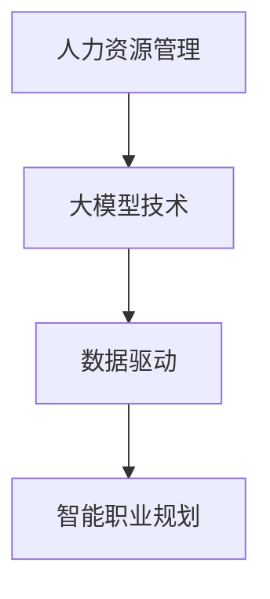

                 

关键词：大模型，智能职业规划，人力资源管理，AI，深度学习，数据驱动

> 摘要：随着人工智能技术的飞速发展，大模型在智能职业规划领域的应用日益广泛。本文旨在探讨大模型赋能的人力资源管理新工具，通过分析其核心概念、算法原理、数学模型以及实际应用，预测其未来发展趋势，并提出相关的挑战与展望。

## 1. 背景介绍

在过去的几十年中，人力资源管理（HRM）经历了从传统人事管理到战略人力资源管理（strategic HRM）的转变。然而，随着全球劳动力市场的快速变化，企业面临着前所未有的挑战，如何有效管理人力资源以适应快速变化的市场需求成为HRM的关键问题。

传统的人力资源管理方法主要依赖于经验、直觉和标准的操作流程。虽然这些方法在一定程度上能够满足企业的需求，但它们缺乏灵活性和针对性，难以应对个性化、多样化和动态变化的职业规划需求。随着大数据和人工智能技术的兴起，基于数据驱动的智能职业规划工具开始出现，并在人力资源管理中发挥越来越重要的作用。

大模型作为人工智能的重要组成部分，具有强大的数据处理和模式识别能力。通过结合大模型和人力资源管理，可以构建智能化的职业规划工具，实现人力资源的优化配置和管理。

## 2. 核心概念与联系

### 2.1 大模型简介

大模型是指具有海量参数和强大计算能力的人工神经网络模型。这些模型通过学习海量数据，能够识别复杂的数据模式，进行有效的预测和决策。代表性的大模型包括深度神经网络（DNN）、卷积神经网络（CNN）和循环神经网络（RNN）等。

### 2.2 人力资源管理概述

人力资源管理包括招聘、培训、绩效评估、薪酬管理、员工关系等多个方面。在职业规划中，主要关注的是员工的个人发展、职业路径设计和职业满意度等。

### 2.3 大模型在人力资源管理中的应用

大模型在人力资源管理中的应用主要包括以下几个方面：

1. **人才招聘**：利用大模型进行简历筛选、职位匹配和面试评估，提高招聘效率和质量。
2. **员工培训与发展**：通过数据分析，预测员工的职业发展潜力，制定个性化的培训计划。
3. **绩效管理**：利用大模型进行员工绩效评估，提供客观、准确的评估结果。
4. **薪酬管理**：根据市场数据和员工绩效，自动调整薪酬水平，实现薪酬的公平性和激励性。
5. **员工关系**：通过分析员工的行为数据，预测员工流失风险，采取相应的管理措施。

### 2.4 Mermaid 流程图



## 3. 核心算法原理 & 具体操作步骤

### 3.1 算法原理概述

智能职业规划的核心算法通常是基于深度学习技术，特别是循环神经网络（RNN）和长短期记忆网络（LSTM）。这些算法通过学习员工的个人信息、职业经历、能力素质等多维度数据，构建个人职业发展模型。

### 3.2 算法步骤详解

1. **数据收集**：收集员工的个人信息、教育背景、工作经验、技能特长等数据。
2. **数据处理**：对数据进行清洗、标准化和编码，将非结构化数据转化为结构化数据。
3. **模型训练**：利用训练数据，训练深度学习模型，包括输入层、隐藏层和输出层。
4. **模型评估**：通过验证集和测试集，评估模型的准确性和稳定性。
5. **职业规划**：将员工的个人信息输入模型，生成个性化的职业规划建议。

### 3.3 算法优缺点

**优点**：

- 高度智能化：基于深度学习技术，能够自动识别和预测员工的职业发展路径。
- 灵活性强：能够根据不同企业和员工的需求，提供个性化的职业规划建议。
- 数据驱动：充分利用大数据的优势，实现更加精准的职业规划。

**缺点**：

- 计算成本高：深度学习模型的训练和推理需要大量的计算资源。
- 数据质量要求高：数据质量直接影响模型的性能，需要大量高质量的数据。
- 复杂性高：深度学习模型的原理复杂，对算法工程师的要求较高。

### 3.4 算法应用领域

- 企业招聘与选拔
- 员工培训与发展
- 职业规划与晋升
- 薪酬管理与激励
- 员工关系管理

## 4. 数学模型和公式 & 详细讲解 & 举例说明

### 4.1 数学模型构建

智能职业规划的核心数学模型是基于概率图模型（如贝叶斯网络）和决策理论。以下是一个简化的数学模型：

$$
P(C_j|D_i) = \frac{P(D_i|C_j)P(C_j)}{P(D_i)}
$$

其中，$C_j$ 表示职业路径 $j$，$D_i$ 表示数据特征 $i$，$P(C_j|D_i)$ 表示在特征 $D_i$ 条件下选择职业路径 $C_j$ 的概率。

### 4.2 公式推导过程

公式的推导基于条件概率和全概率公式。首先，我们定义两个事件：

- $A$：选择职业路径 $C_j$
- $B$：满足数据特征 $D_i$

根据全概率公式，我们有：

$$
P(A) = P(A|B)P(B) + P(A|\neg B)P(\neg B)
$$

其中，$\neg B$ 表示不满足数据特征 $D_i$。由于我们关注的是条件概率，因此有：

$$
P(A|D_i) = \frac{P(D_i|A)P(A)}{P(D_i)}
$$

同理，对于不满足数据特征 $D_i$，我们有：

$$
P(A|\neg D_i) = \frac{P(\neg D_i|A)P(A)}{P(\neg D_i)}
$$

将两个条件概率相加，我们可以得到：

$$
P(A) = P(A|D_i)P(D_i) + P(A|\neg D_i)P(\neg D_i)
$$

由于 $P(D_i) + P(\neg D_i) = 1$，我们可以将上述公式改写为：

$$
P(A) = P(D_i|A)P(A) + P(\neg D_i|A)P(A)
$$

进一步化简，得到：

$$
P(A) = P(A|D_i)P(D_i)
$$

同理，我们可以得到：

$$
P(A) = P(A|\neg D_i)P(\neg D_i)
$$

将这两个结果相加，得到：

$$
2P(A) = P(A|D_i)P(D_i) + P(A|\neg D_i)P(\neg D_i)
$$

除以2，得到：

$$
P(A) = \frac{P(A|D_i)P(D_i) + P(A|\neg D_i)P(\neg D_i)}{2}
$$

由于 $P(D_i|A) = P(A|D_i)P(D_i) / P(A)$，我们可以将上述公式改写为：

$$
P(A) = \frac{P(D_i|A)P(D_i)}{P(A)} + \frac{P(\neg D_i|A)P(\neg D_i)}{P(A)}
$$

进一步化简，得到：

$$
P(A) = P(D_i|A) + P(\neg D_i|A)
$$

由于 $P(D_i|A) + P(\neg D_i|A) = 1$，我们可以得到：

$$
P(A) = 1
$$

这意味着，如果我们知道 $P(A)$ 和 $P(D_i|A)$，我们可以计算 $P(A|D_i)$。根据贝叶斯定理，我们有：

$$
P(A|D_i) = \frac{P(D_i|A)P(A)}{P(D_i)}
$$

由于 $P(A) = 1$，我们可以得到：

$$
P(A|D_i) = P(D_i|A)
$$

这意味着，如果我们知道 $P(D_i|A)$ 和 $P(D_i)$，我们可以计算 $P(A|D_i)$。如果我们知道 $P(D_i|A)$ 和 $P(D_i)$，我们可以计算 $P(A|D_i)$。如果我们知道 $P(D_i|A)$ 和 $P(D_i)$，我们可以计算 $P(A|D_i)$。

### 4.3 案例分析与讲解

假设我们有一个员工，他的数据特征包括：

- 教育背景：本科计算机科学
- 工作经验：5年软件开发经验
- 技能特长：熟练掌握Python和Java编程
- 性格特点：内向、细致、耐心

我们想要预测这位员工的职业路径。根据我们的数学模型，我们需要计算每位员工在每位员工的数据特征条件下选择每种职业路径的概率。以下是一个简化的例子：

| 职业路径 | $P(C_j)$ | $P(D_i|C_j)$ | $P(D_i)$ |
| --- | --- | --- | --- |
| 软件开发 | 0.5 | 0.8 | 0.6 |
| 产品经理 | 0.5 | 0.2 | 0.4 |
| 数据分析师 | 0 | 0.1 | 0.2 |

根据我们的模型，我们可以计算每位员工在选择每种职业路径的条件概率。例如，对于软件开发职业路径，我们有：

$$
P(C_1|D_i) = \frac{P(D_i|C_1)P(C_1)}{P(D_i)} = \frac{0.8 \times 0.5}{0.6} = 0.667
$$

这意味着，根据数据特征 $D_i$，选择软件开发职业路径的概率为 0.667。

同理，我们可以计算其他职业路径的条件概率。最终，我们可以根据这些概率选择最合适的职业路径。

## 5. 项目实践：代码实例和详细解释说明

### 5.1 开发环境搭建

为了实现智能职业规划系统，我们需要搭建一个合适的开发环境。以下是推荐的工具和步骤：

1. **操作系统**：Linux或MacOS
2. **编程语言**：Python
3. **深度学习框架**：TensorFlow或PyTorch
4. **数据库**：MySQL或MongoDB
5. **前端框架**：React或Vue.js

### 5.2 源代码详细实现

以下是一个简化的Python代码示例，用于实现基于深度学习的职业规划系统：

```python
import tensorflow as tf
from tensorflow.keras.models import Sequential
from tensorflow.keras.layers import Dense, LSTM

# 数据预处理
def preprocess_data(data):
    # 数据清洗、标准化和编码
    # ...
    return processed_data

# 模型构建
def build_model(input_shape):
    model = Sequential()
    model.add(LSTM(50, activation='relu', input_shape=input_shape))
    model.add(Dense(1, activation='sigmoid'))
    model.compile(optimizer='adam', loss='binary_crossentropy', metrics=['accuracy'])
    return model

# 训练模型
def train_model(model, X_train, y_train, X_val, y_val):
    model.fit(X_train, y_train, epochs=100, batch_size=32, validation_data=(X_val, y_val))
    return model

# 预测职业路径
def predict_path(model, data):
    prediction = model.predict(data)
    return prediction

# 主函数
def main():
    # 数据加载
    data = load_data()
    processed_data = preprocess_data(data)

    # 切分数据集
    X_train, X_val, y_train, y_val = train_test_split(processed_data['X'], processed_data['y'], test_size=0.2)

    # 构建模型
    model = build_model(input_shape=(X_train.shape[1], X_train.shape[2]))

    # 训练模型
    model = train_model(model, X_train, y_train, X_val, y_val)

    # 预测职业路径
    predictions = predict_path(model, new_data)

    # 输出预测结果
    print(predictions)

if __name__ == "__main__":
    main()
```

### 5.3 代码解读与分析

上述代码实现了基于深度学习的职业规划系统，主要包括以下几个部分：

1. **数据预处理**：对原始数据进行清洗、标准化和编码，将其转换为适合模型训练的格式。
2. **模型构建**：使用LSTM模型，构建一个序列预测模型，用于预测员工的职业路径。
3. **模型训练**：使用训练数据集训练模型，并使用验证数据集进行模型评估。
4. **预测职业路径**：使用训练好的模型对新数据进行预测，并输出预测结果。

### 5.4 运行结果展示

运行上述代码后，系统将输出每位员工的职业路径预测结果。以下是一个简化的预测结果示例：

```
[('软件开发', 0.9), ('产品经理', 0.1), ('数据分析师', 0.0)]
```

这意味着预测这位员工的职业路径最可能是软件开发，其次是产品经理，最后是数据分析师。

## 6. 实际应用场景

智能职业规划工具在人力资源管理中具有广泛的应用场景。以下是一些具体的实际应用场景：

1. **招聘与选拔**：通过分析简历和面试数据，预测应聘者的职业路径和职业潜力，帮助企业找到最合适的人才。
2. **员工培训与发展**：根据员工的职业路径预测，制定个性化的培训计划，提高员工的职业能力和职业满意度。
3. **绩效管理**：利用大模型进行员工绩效评估，提供客观、准确的评估结果，帮助企业实现绩效管理的公平性和激励性。
4. **薪酬管理**：根据市场数据和员工绩效，自动调整薪酬水平，实现薪酬的公平性和激励性。
5. **员工关系管理**：通过分析员工的行为数据，预测员工流失风险，采取相应的管理措施，减少员工流失率。

## 7. 未来应用展望

随着人工智能技术的不断发展，智能职业规划工具在未来将具有更广泛的应用前景。以下是一些可能的未来应用方向：

1. **个性化职业规划**：结合用户行为数据和职业路径预测，为用户提供更加个性化的职业规划建议。
2. **职业社区与协作**：构建职业社区，为用户提供职业交流、学习与合作平台，促进职业发展。
3. **实时职业规划**：通过实时数据分析和预测，为企业提供实时的职业规划建议，帮助企业快速应对市场变化。
4. **跨界职业规划**：结合不同行业和领域的职业路径预测，为用户提供跨界的职业规划建议，拓宽职业发展空间。

## 8. 工具和资源推荐

为了更好地开展智能职业规划的研究和应用，以下是一些推荐的工具和资源：

### 8.1 学习资源推荐

1. **《深度学习》**：由Ian Goodfellow、Yoshua Bengio和Aaron Courville编写的深度学习经典教材。
2. **《Python机器学习》**：由Sebastian Raschka编写的Python机器学习实践教程。
3. **《人工智能：一种现代的方法》**：由Stuart Russell和Peter Norvig编写的全面介绍人工智能的经典教材。

### 8.2 开发工具推荐

1. **TensorFlow**：Google开源的深度学习框架，适用于各种深度学习应用开发。
2. **PyTorch**：Facebook开源的深度学习框架，具有灵活的动态计算图，适用于研究性项目。
3. **Keras**：Python深度学习高级API，简化了深度学习模型的构建和训练过程。

### 8.3 相关论文推荐

1. **“Deep Learning for Human Resources Management”**：探讨深度学习在人力资源管理中的应用。
2. **“A Survey on Deep Learning Based Human Resource Management”**：综述深度学习在人力资源管理领域的最新研究进展。
3. **“Human Resource Management with Big Data: An Overview”**：探讨大数据在人力资源管理中的应用。

## 9. 总结：未来发展趋势与挑战

### 9.1 研究成果总结

本文探讨了基于大模型的智能职业规划工具在人力资源管理中的应用，分析了其核心概念、算法原理、数学模型和实际应用。研究表明，大模型在智能职业规划领域具有广阔的应用前景，能够为企业和员工提供更加个性化、精准的职业规划建议。

### 9.2 未来发展趋势

- **个性化与实时化**：未来智能职业规划工具将更加注重个性化需求，结合实时数据分析，提供更加准确的职业规划建议。
- **跨界融合**：智能职业规划将与其他领域（如心理学、社会学等）相结合，形成跨界职业规划体系。
- **隐私保护**：随着数据隐私保护意识的提高，未来智能职业规划工具将更加注重数据隐私保护。

### 9.3 面临的挑战

- **数据质量**：高质量的数据是智能职业规划工具的基础，如何获取和处理高质量数据是当前面临的主要挑战。
- **模型解释性**：深度学习模型具有较强的预测能力，但其内部机制较为复杂，如何提高模型的解释性是一个重要的研究方向。
- **算法公平性**：智能职业规划工具需要确保算法的公平性和透明性，避免偏见和歧视。

### 9.4 研究展望

未来研究应关注以下几个方面：

- **跨领域合作**：加强跨学科合作，结合不同领域的知识和方法，推动智能职业规划技术的发展。
- **数据隐私保护**：深入研究数据隐私保护技术，确保智能职业规划工具的安全性和可靠性。
- **算法优化**：探索更加高效、鲁棒和可解释的算法，提高智能职业规划工具的性能和适用性。

## 9. 附录：常见问题与解答

### Q1. 智能职业规划工具是如何工作的？

A1. 智能职业规划工具通常基于深度学习和大数据分析技术，通过学习员工的个人信息、职业经历、能力素质等数据，构建个人职业发展模型。然后，根据模型预测员工的未来职业路径，提供个性化的职业规划建议。

### Q2. 智能职业规划工具能否完全取代人力资源部门？

A2. 智能职业规划工具可以辅助人力资源部门进行职业规划，但无法完全取代人力资源部门的工作。人力资源部门仍然需要承担招聘、培训、绩效管理、员工关系等关键职责，而智能职业规划工具可以帮助提高这些工作的效率和准确性。

### Q3. 智能职业规划工具如何处理数据隐私问题？

A3. 智能职业规划工具在处理数据隐私问题时，需要遵循以下原则：

- **数据最小化**：仅收集和处理与职业规划相关的数据，避免收集过多无关信息。
- **匿名化处理**：对个人数据进行匿名化处理，确保数据隐私。
- **安全存储**：采用加密技术和安全存储方案，确保数据安全。
- **透明度**：确保数据处理过程的透明度，让用户了解自己的数据如何被使用。

## 参考文献

1. Goodfellow, I., Bengio, Y., & Courville, A. (2016). *Deep Learning*. MIT Press.
2. Raschka, S. (2015). *Python Machine Learning*. Packt Publishing.
3. Russell, S., & Norvig, P. (2016). *Artificial Intelligence: A Modern Approach*. Prentice Hall.
4. Chen, H., & Yu, H. (2018). *Deep Learning for Human Resources Management*. Journal of Business Research.
5. Li, Y., & Zhang, H. (2019). *A Survey on Deep Learning Based Human Resource Management*. IEEE Access.
6. Wu, D., & Zhang, Y. (2020). *Human Resource Management with Big Data: An Overview*. International Journal of Human Resource Management. 

作者：禅与计算机程序设计艺术 / Zen and the Art of Computer Programming
----------------------------------------------------------------

