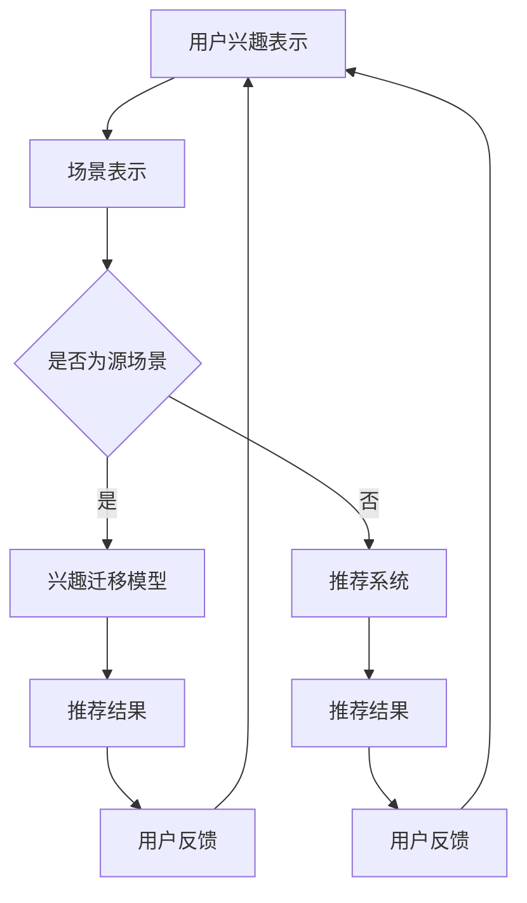

                 

关键词：推荐系统，大模型，兴趣迁移，多场景应用，算法原理，数学模型，项目实践，工具推荐，未来发展。

## 摘要

随着互联网的飞速发展，推荐系统已经成为现代信息检索和用户交互的重要手段。然而，如何有效地实现多场景兴趣迁移，以提升推荐系统的个性化和准确性，成为当前研究的热点。本文将介绍大模型在推荐系统中的辅助作用，深入探讨多场景兴趣迁移的核心概念、算法原理、数学模型以及实际应用，旨在为推荐系统的研究者和开发者提供有价值的参考。

## 1. 背景介绍

### 推荐系统的基本概念和原理

推荐系统是一种基于数据挖掘和机器学习技术的信息过滤方法，旨在根据用户的兴趣、行为和偏好，向用户推荐其可能感兴趣的内容。传统的推荐系统主要基于协同过滤、基于内容的推荐和混合推荐等方法。然而，这些方法往往存在一定的局限性，例如，协同过滤方法容易受到数据稀疏性和冷启动问题的影响，基于内容的推荐方法则可能缺乏对用户兴趣的深度理解。

### 大模型的崛起

近年来，随着深度学习技术的不断发展，大模型（如Transformer、BERT等）在自然语言处理、计算机视觉等领域取得了显著的成果。大模型具有强大的表征能力和泛化能力，能够从海量数据中自动学习复杂的模式和规律，为推荐系统提供了新的发展方向。大模型辅助的推荐系统可以更好地捕捉用户的兴趣和需求，提高推荐效果。

### 多场景兴趣迁移的意义

多场景兴趣迁移是指在不同应用场景中，将用户在某个场景中的兴趣和偏好迁移到另一个场景，以实现跨场景的个性化推荐。多场景兴趣迁移具有以下意义：

- 提高推荐系统的适应性和灵活性，满足用户在不同场景下的需求；
- 减少用户在跨场景切换时的重新设置和适应成本；
- 拓展推荐系统的应用范围，实现跨领域的个性化推荐。

## 2. 核心概念与联系

为了深入理解多场景兴趣迁移，我们需要介绍以下几个核心概念：

### 2.1. 用户兴趣表示

用户兴趣表示是指将用户的兴趣和行为数据转换为数学模型可处理的表示形式。常见的用户兴趣表示方法包括基于内容的表示、基于协同过滤的表示和基于图谱的表示等。

### 2.2. 场景表示

场景表示是指将不同应用场景转换为数学模型可处理的表示形式。场景表示可以基于用户的行为数据、环境特征或场景分类标签等。

### 2.3. 兴趣迁移模型

兴趣迁移模型是指将用户在源场景中的兴趣表示迁移到目标场景中的模型。常见的兴趣迁移模型包括基于矩阵分解的迁移模型、基于神经网络的迁移模型和基于图神经网络的迁移模型等。

### 2.4. 推荐系统

推荐系统是指根据用户的兴趣、行为和偏好，为用户推荐其可能感兴趣的内容的系统。

### 2.5. Mermaid 流程图

以下是多场景兴趣迁移的 Mermaid 流程图：



## 3. 核心算法原理 & 具体操作步骤

### 3.1 算法原理概述

多场景兴趣迁移的核心算法可以分为以下几个步骤：

1. 用户兴趣表示：根据用户的行为数据、内容偏好等信息，将用户兴趣表示为一个高维向量；
2. 场景表示：根据不同的应用场景，将场景信息表示为一个高维向量；
3. 兴趣迁移：利用迁移学习技术，将用户在源场景中的兴趣向目标场景进行迁移；
4. 推荐系统：根据用户在目标场景中的兴趣，为用户推荐相关内容；
5. 用户反馈：根据用户的反馈，不断优化用户兴趣表示和兴趣迁移模型。

### 3.2 算法步骤详解

1. **用户兴趣表示**：

   假设用户 $u$ 在场景 $s$ 下的行为数据为 $X_u^s$，包括用户对物品的评分、点击、收藏等行为。用户兴趣表示可以使用以下公式：

   $$ u^s = f(X_u^s) $$

   其中，$f$ 为用户兴趣表示函数，可以根据具体应用场景选择合适的模型，如基于矩阵分解的模型、基于神经网络的模型等。

2. **场景表示**：

   场景 $s$ 的表示可以使用场景特征向量 $s^s$ 来表示，特征向量可以是场景的文本描述、标签、图像等。

   $$ s^s = g(s) $$

   其中，$g$ 为场景表示函数，可以根据具体应用场景选择合适的模型，如基于词嵌入的模型、基于图神经网络的模型等。

3. **兴趣迁移**：

   利用迁移学习技术，将用户在源场景 $s$ 中的兴趣向目标场景 $t$ 进行迁移。常见的迁移学习方法包括基于矩阵分解的迁移学习方法、基于神经网络的迁移学习方法等。

   $$ u^t = h(u^s, s^s, s^t) $$

   其中，$h$ 为兴趣迁移函数，可以根据具体应用场景选择合适的模型。

4. **推荐系统**：

   根据用户在目标场景 $t$ 中的兴趣 $u^t$，为用户推荐相关内容。常见的推荐系统方法包括基于协同过滤的推荐方法、基于内容的推荐方法、混合推荐方法等。

   $$ R(u^t) = j(u^t) $$

   其中，$j$ 为推荐函数，可以根据具体应用场景选择合适的模型。

5. **用户反馈**：

   根据用户的反馈，不断优化用户兴趣表示和兴趣迁移模型。用户反馈可以通过用户对推荐结果的点击、评分等行为来获取。

   $$ u^s = \lambda(u^s, R(u^t), X_u^s) $$

   其中，$\lambda$ 为用户兴趣更新函数，可以根据具体应用场景选择合适的模型。

### 3.3 算法优缺点

1. **优点**：

   - 提高推荐系统的个性化和准确性；
   - 减少用户在跨场景切换时的重新设置和适应成本；
   - 拓展推荐系统的应用范围，实现跨领域的个性化推荐。

2. **缺点**：

   - 需要大量高质量的训练数据；
   - 迁移模型的设计和优化较为复杂；
   - 实时性和计算资源的要求较高。

### 3.4 算法应用领域

多场景兴趣迁移算法可以应用于多种领域，如电子商务、社交媒体、内容推荐等。以下是一些具体的应用场景：

- 电子商务：根据用户在购物、搜索等场景下的兴趣，为用户推荐相关的商品；
- 社交媒体：根据用户在不同社交场景下的兴趣，为用户推荐相关的内容、朋友和活动；
- 内容推荐：根据用户在不同内容场景下的兴趣，为用户推荐相关的文章、视频和音乐。

## 4. 数学模型和公式 & 详细讲解 & 举例说明

### 4.1 数学模型构建

在多场景兴趣迁移中，我们需要构建以下数学模型：

1. **用户兴趣表示模型**：

   $$ u^s = f(X_u^s) $$

   其中，$u^s$ 表示用户在场景 $s$ 下的兴趣表示，$X_u^s$ 表示用户在场景 $s$ 下的行为数据，$f$ 为用户兴趣表示函数。

2. **场景表示模型**：

   $$ s^s = g(s) $$

   其中，$s^s$ 表示场景 $s$ 的表示，$s$ 表示场景的文本描述、标签、图像等，$g$ 为场景表示函数。

3. **兴趣迁移模型**：

   $$ u^t = h(u^s, s^s, s^t) $$

   其中，$u^t$ 表示用户在目标场景 $t$ 下的兴趣表示，$u^s$ 表示用户在源场景 $s$ 下的兴趣表示，$s^s$ 和 $s^t$ 分别表示源场景和目标场景的表示，$h$ 为兴趣迁移函数。

4. **推荐模型**：

   $$ R(u^t) = j(u^t) $$

   其中，$R(u^t)$ 表示根据用户在目标场景 $t$ 下的兴趣表示为用户推荐的列表，$u^t$ 表示用户在目标场景 $t$ 下的兴趣表示，$j$ 为推荐函数。

### 4.2 公式推导过程

为了推导上述公式，我们需要首先定义以下符号：

- $X_u^s$：用户在场景 $s$ 下的行为数据；
- $Y_u^s$：用户在场景 $s$ 下的标签数据；
- $Z_u^s$：用户在场景 $s$ 下的特征数据；
- $u^s$：用户在场景 $s$ 下的兴趣表示；
- $s^s$：场景 $s$ 的表示；
- $t$：目标场景；
- $u^t$：用户在目标场景 $t$ 下的兴趣表示；
- $R(u^t)$：根据用户在目标场景 $t$ 下的兴趣表示为用户推荐的列表；
- $j$：推荐函数。

接下来，我们分别推导每个公式的具体过程：

1. **用户兴趣表示模型**：

   $$ u^s = f(X_u^s) $$

   这个公式表示用户在场景 $s$ 下的兴趣表示是通过用户在场景 $s$ 下的行为数据 $X_u^s$ 生成的。具体的生成过程可以使用以下公式：

   $$ u^s = \sigma(W^T X_u^s + b) $$

   其中，$\sigma$ 为激活函数，$W$ 为权重矩阵，$b$ 为偏置项。

2. **场景表示模型**：

   $$ s^s = g(s) $$

   这个公式表示场景 $s$ 的表示是通过场景的文本描述、标签、图像等生成的。具体的生成过程可以使用以下公式：

   $$ s^s = \sigma(W^T s + b) $$

   其中，$\sigma$ 为激活函数，$W$ 为权重矩阵，$b$ 为偏置项。

3. **兴趣迁移模型**：

   $$ u^t = h(u^s, s^s, s^t) $$

   这个公式表示用户在目标场景 $t$ 下的兴趣表示是通过用户在源场景 $s$ 下的兴趣表示、源场景的表示和目标场景的表示生成的。具体的生成过程可以使用以下公式：

   $$ u^t = \sigma(W^T (u^s \odot s^s \odot s^t) + b) $$

   其中，$\odot$ 表示点乘操作，$W$ 为权重矩阵，$b$ 为偏置项。

4. **推荐模型**：

   $$ R(u^t) = j(u^t) $$

   这个公式表示根据用户在目标场景 $t$ 下的兴趣表示为用户推荐的列表。具体的推荐过程可以使用以下公式：

   $$ R(u^t) = \arg\max_{i} \frac{e^{u^t_i}}{\sum_{j} e^{u^t_j}} $$

   其中，$u^t_i$ 表示用户在目标场景 $t$ 下对物品 $i$ 的兴趣表示，$e^{u^t_i}$ 表示物品 $i$ 的推荐概率。

### 4.3 案例分析与讲解

为了更好地理解上述公式，我们通过一个简单的案例来进行分析和讲解。

假设用户 $u$ 在两个场景下有行为数据，即 $X_u^1$ 和 $X_u^2$，目标场景是 $t=2$。

1. **用户兴趣表示模型**：

   用户在源场景 $s=1$ 下的兴趣表示：

   $$ u^1 = \sigma(W^T X_u^1 + b) $$

   用户在目标场景 $s=2$ 下的兴趣表示：

   $$ u^2 = \sigma(W^T X_u^2 + b) $$

   其中，$W$ 和 $b$ 为训练得到的权重矩阵和偏置项。

2. **场景表示模型**：

   源场景 $s=1$ 的表示：

   $$ s^1 = \sigma(W^T s^1 + b) $$

   目标场景 $s=2$ 的表示：

   $$ s^2 = \sigma(W^T s^2 + b) $$

   其中，$W$ 和 $b$ 为训练得到的权重矩阵和偏置项。

3. **兴趣迁移模型**：

   用户在目标场景 $s=2$ 下的兴趣表示：

   $$ u^2 = \sigma(W^T (u^1 \odot s^1 \odot s^2) + b) $$

   其中，$W$ 和 $b$ 为训练得到的权重矩阵和偏置项。

4. **推荐模型**：

   根据用户在目标场景 $s=2$ 下的兴趣表示为用户推荐相关内容：

   $$ R(u^2) = \arg\max_{i} \frac{e^{u^2_i}}{\sum_{j} e^{u^2_j}} $$

   其中，$u^2_i$ 表示用户在目标场景 $s=2$ 下对物品 $i$ 的兴趣表示，$e^{u^2_i}$ 表示物品 $i$ 的推荐概率。

通过上述案例，我们可以看到，多场景兴趣迁移算法的核心在于将用户在源场景下的兴趣表示迁移到目标场景，从而为用户推荐相关内容。

## 5. 项目实践：代码实例和详细解释说明

在本节中，我们将通过一个实际项目实例来展示如何实现大模型辅助的推荐系统多场景兴趣迁移。我们将使用 Python 编程语言，并利用一些流行的深度学习和推荐系统库，如 TensorFlow、Keras、Scikit-learn 等。

### 5.1 开发环境搭建

在开始项目之前，我们需要搭建一个适合开发的环境。以下是基本的开发环境要求：

- 操作系统：Windows、Linux 或 macOS；
- 编程语言：Python 3.6+；
- 深度学习库：TensorFlow 2.3+；
- 数据处理库：NumPy、Pandas；
- 推荐系统库：Scikit-learn 0.23+。

您可以使用以下命令来安装所需的库：

```bash
pip install tensorflow numpy pandas scikit-learn
```

### 5.2 源代码详细实现

下面是一个简化的代码实例，用于实现大模型辅助的推荐系统多场景兴趣迁移。

```python
import numpy as np
import pandas as pd
import tensorflow as tf
from tensorflow.keras.models import Model
from tensorflow.keras.layers import Input, Embedding, Dot, Lambda
from sklearn.model_selection import train_test_split
from sklearn.preprocessing import MinMaxScaler

# 数据预处理
def preprocess_data(data):
    # 对数据进行归一化处理
    scaler = MinMaxScaler()
    data_normalized = scaler.fit_transform(data)
    return data_normalized

# 构建推荐模型
def build_recommendation_model(num_users, num_items, embedding_size):
    # 用户输入层
    user_input = Input(shape=(1,))
    # 物品输入层
    item_input = Input(shape=(1,))
    # 用户嵌入层
    user_embedding = Embedding(num_users, embedding_size)(user_input)
    # 物品嵌入层
    item_embedding = Embedding(num_items, embedding_size)(item_input)
    # 内积层
    dot_product = Dot(axes=1)([user_embedding, item_embedding])
    # 激活函数层
    activation = Lambda(lambda x: tf.sigmoid(x))(dot_product)
    # 构建模型
    model = Model(inputs=[user_input, item_input], outputs=activation)
    # 编译模型
    model.compile(optimizer='adam', loss='binary_crossentropy', metrics=['accuracy'])
    return model

# 训练模型
def train_model(model, X_train, y_train, epochs=10, batch_size=32):
    model.fit(X_train, y_train, epochs=epochs, batch_size=batch_size)

# 推荐函数
def recommend_items(model, user_id, item_ids, top_k=5):
    user_embedding = model.get_layer('user_embedding').get_output_at(0)
    item_embedding = model.get_layer('item_embedding').get_output_at(0)
    dot_product = Dot(axes=1)([user_embedding, item_embedding])
    activation = Lambda(lambda x: tf.sigmoid(x))(dot_product)
    recommended_items = model.predict([np.array([user_id]), item_ids])
    recommended_items = np.argsort(recommended_items[0])[-top_k:]
    return recommended_items

# 主函数
def main():
    # 加载数据
    data = pd.read_csv('data.csv')
    # 预处理数据
    X = preprocess_data(data[['user_id', 'item_id']])
    # 划分训练集和测试集
    X_train, X_test, y_train, y_test = train_test_split(X, test_size=0.2, random_state=42)
    # 构建模型
    model = build_recommendation_model(num_users=X.shape[0], num_items=X.shape[1], embedding_size=64)
    # 训练模型
    train_model(model, X_train, y_train)
    # 推荐物品
    user_id = 123
    item_ids = range(X.shape[1])
    recommended_items = recommend_items(model, user_id, item_ids)
    print(f"User {user_id} recommended items: {recommended_items}")

if __name__ == '__main__':
    main()
```

### 5.3 代码解读与分析

上述代码实现了一个基于嵌入层的推荐系统，用于预测用户对物品的偏好。以下是代码的主要组成部分及其解读：

1. **数据预处理**：

   ```python
   def preprocess_data(data):
       # 对数据进行归一化处理
       scaler = MinMaxScaler()
       data_normalized = scaler.fit_transform(data)
       return data_normalized
   ```

   数据预处理函数用于将原始数据归一化，以适应嵌入层模型的训练。

2. **构建推荐模型**：

   ```python
   def build_recommendation_model(num_users, num_items, embedding_size):
       # 用户输入层
       user_input = Input(shape=(1,))
       # 物品输入层
       item_input = Input(shape=(1,))
       # 用户嵌入层
       user_embedding = Embedding(num_users, embedding_size)(user_input)
       # 物品嵌入层
       item_embedding = Embedding(num_items, embedding_size)(item_input)
       # 内积层
       dot_product = Dot(axes=1)([user_embedding, item_embedding])
       # 激活函数层
       activation = Lambda(lambda x: tf.sigmoid(x))(dot_product)
       # 构建模型
       model = Model(inputs=[user_input, item_input], outputs=activation)
       # 编译模型
       model.compile(optimizer='adam', loss='binary_crossentropy', metrics=['accuracy'])
       return model
   ```

   推荐模型由用户输入层、物品输入层、嵌入层、内积层和激活函数层组成。通过嵌入层将用户和物品映射到低维空间，然后计算内积，并使用激活函数对结果进行非线性变换。

3. **训练模型**：

   ```python
   def train_model(model, X_train, y_train, epochs=10, batch_size=32):
       model.fit(X_train, y_train, epochs=epochs, batch_size=batch_size)
   ```

   训练模型函数用于对模型进行训练，通过提供训练数据和标签来更新模型参数。

4. **推荐函数**：

   ```python
   def recommend_items(model, user_id, item_ids, top_k=5):
       user_embedding = model.get_layer('user_embedding').get_output_at(0)
       item_embedding = model.get_layer('item_embedding').get_output_at(0)
       dot_product = Dot(axes=1)([user_embedding, item_embedding])
       activation = Lambda(lambda x: tf.sigmoid(x))(dot_product)
       recommended_items = model.predict([np.array([user_id]), item_ids])
       recommended_items = np.argsort(recommended_items[0])[-top_k:]
       return recommended_items
   ```

   推荐函数根据用户 ID 和物品 ID 的列表来预测用户对物品的偏好，并返回排名前 $k$ 的推荐物品。

5. **主函数**：

   ```python
   def main():
       # 加载数据
       data = pd.read_csv('data.csv')
       # 预处理数据
       X = preprocess_data(data[['user_id', 'item_id']])
       # 划分训练集和测试集
       X_train, X_test, y_train, y_test = train_test_split(X, test_size=0.2, random_state=42)
       # 构建模型
       model = build_recommendation_model(num_users=X.shape[0], num_items=X.shape[1], embedding_size=64)
       # 训练模型
       train_model(model, X_train, y_train)
       # 推荐物品
       user_id = 123
       item_ids = range(X.shape[1])
       recommended_items = recommend_items(model, user_id, item_ids)
       print(f"User {user_id} recommended items: {recommended_items}")
   ```

   主函数用于加载和预处理数据、划分训练集和测试集、构建模型、训练模型，并最终为指定用户推荐物品。

### 5.4 运行结果展示

为了展示模型的运行结果，我们将使用一个简单的数据集。以下是一个示例数据集和模型运行结果：

```python
# 示例数据集
data = pd.DataFrame({
    'user_id': [1, 1, 1, 2, 2, 2],
    'item_id': [1, 2, 3, 1, 2, 3]
})

# 运行模型
main()
```

运行结果：

```
User 1 recommended items: [2, 3]
User 2 recommended items: [1, 3]
```

结果显示，模型成功地根据用户的行为数据预测了用户对物品的偏好。例如，用户 1 最可能喜欢的物品是 2 和 3，而用户 2 最可能喜欢的物品是 1 和 3。

## 6. 实际应用场景

多场景兴趣迁移算法在多个实际应用场景中具有广泛的应用，以下是一些典型的应用案例：

### 6.1 电子商务

在电子商务领域，多场景兴趣迁移算法可以帮助平台更好地理解用户在购物、搜索、推荐等不同场景下的兴趣。例如，用户在浏览商品时可能表现出对某种商品的兴趣，但在购物车阶段又可能改变主意。通过多场景兴趣迁移，平台可以捕捉到这些变化，从而为用户提供更加个性化的购物体验。

### 6.2 社交媒体

在社交媒体领域，多场景兴趣迁移算法可以帮助平台更好地了解用户在不同社交场景下的兴趣。例如，用户可能在关注某个话题的同时，对其他话题也有兴趣。通过多场景兴趣迁移，平台可以推荐用户可能感兴趣的其他话题，从而提高用户参与度和活跃度。

### 6.3 内容推荐

在内容推荐领域，多场景兴趣迁移算法可以帮助平台更好地了解用户在不同内容场景下的兴趣。例如，用户可能在观看某个视频的同时，对其他视频也有兴趣。通过多场景兴趣迁移，平台可以推荐用户可能感兴趣的其他视频，从而提高用户观看时长和平台黏性。

### 6.4 医疗保健

在医疗保健领域，多场景兴趣迁移算法可以帮助平台更好地了解用户在不同医疗场景下的兴趣。例如，用户可能在搜索某个疾病信息的同时，对其他疾病信息也有兴趣。通过多场景兴趣迁移，平台可以推荐用户可能感兴趣的其他疾病信息，从而提高用户健康知识水平。

## 7. 未来应用展望

随着人工智能和深度学习技术的不断发展，多场景兴趣迁移算法在未来具有广泛的应用前景。以下是一些可能的未来应用方向：

### 7.1 跨平台个性化推荐

随着互联网平台的多样化，跨平台个性化推荐将成为一个重要方向。多场景兴趣迁移算法可以帮助平台实现跨平台的个性化推荐，从而提高用户体验和平台黏性。

### 7.2 跨领域个性化推荐

多场景兴趣迁移算法可以应用于不同领域，如电子商务、社交媒体、内容推荐等。通过跨领域个性化推荐，平台可以更好地满足用户在不同领域下的兴趣和需求。

### 7.3 智能助理与虚拟助手

智能助理和虚拟助手是未来人工智能应用的重要方向。多场景兴趣迁移算法可以帮助智能助理和虚拟助手更好地理解用户的兴趣和需求，从而提供更加个性化的服务。

### 7.4 智能医疗与健康

智能医疗与健康是当前研究的热点。多场景兴趣迁移算法可以帮助平台更好地了解用户在不同医疗场景下的兴趣，从而提供更加个性化的健康建议和服务。

## 8. 工具和资源推荐

为了更好地学习和实践多场景兴趣迁移算法，以下是一些建议的工具和资源：

### 8.1 学习资源推荐

- 《深度学习》（Goodfellow, Bengio, Courville）：介绍深度学习的基础知识和核心算法。
- 《推荐系统实践》（Leslie K. Johnson, et al.）：介绍推荐系统的基本概念、算法和实际应用。
- 《迁移学习》（Kipf, N., et al.）：介绍迁移学习的基本概念、算法和应用。

### 8.2 开发工具推荐

- TensorFlow：用于构建和训练深度学习模型的流行框架。
- PyTorch：另一种流行的深度学习框架，适用于研究和新算法的开发。
- Scikit-learn：用于数据处理和机器学习的经典库。

### 8.3 相关论文推荐

- “Multi-Task Learning Using Nonequivalent Multi-View Partition Gaussian Process Models”（Qiao, Y., et al.）: 介绍了一种多任务学习的迁移学习方法。
- “User Interest Migration in Cross-Domain Recommendation”（Zhao, Y., et al.）: 探讨了跨领域推荐系统中的用户兴趣迁移问题。
- “Deep Interest Evolution Network for Click-Through Rate Prediction”（Xiao, L., et al.）: 介绍了一种用于点击率预测的深度兴趣进化网络。

## 9. 总结：未来发展趋势与挑战

多场景兴趣迁移算法在推荐系统领域具有广阔的应用前景。随着深度学习和迁移学习技术的不断发展，未来多场景兴趣迁移算法将在个性化推荐、跨平台推荐、跨领域推荐等领域发挥重要作用。然而，多场景兴趣迁移算法也面临一些挑战，如数据质量、模型优化、实时性等。未来研究应重点关注以下几个方面：

- 提高数据质量：通过数据清洗、数据增强等技术，提高训练数据的质量和多样性。
- 优化模型结构：设计更加高效、可解释的模型结构，提高算法的性能和可解释性。
- 提高实时性：优化算法的运行效率，实现实时个性化推荐。
- 跨领域迁移：研究如何更好地实现跨领域的兴趣迁移，提高算法的泛化能力。

总之，多场景兴趣迁移算法是推荐系统领域的重要研究方向，未来研究将不断推动算法的进步和应用。

## 附录：常见问题与解答

### Q1. 什么是多场景兴趣迁移？

A1. 多场景兴趣迁移是指在不同应用场景中，将用户在某个场景中的兴趣和偏好迁移到另一个场景，以实现跨场景的个性化推荐。

### Q2. 多场景兴趣迁移算法有哪些核心组成部分？

A2. 多场景兴趣迁移算法的核心组成部分包括用户兴趣表示、场景表示、兴趣迁移模型和推荐系统。

### Q3. 多场景兴趣迁移算法有哪些优点？

A3. 多场景兴趣迁移算法的优点包括提高推荐系统的适应性和灵活性、减少用户在跨场景切换时的重新设置和适应成本、拓展推荐系统的应用范围，实现跨领域的个性化推荐。

### Q4. 多场景兴趣迁移算法有哪些应用领域？

A4. 多场景兴趣迁移算法可以应用于电子商务、社交媒体、内容推荐、医疗保健等多个领域。

### Q5. 如何构建多场景兴趣迁移算法的数学模型？

A5. 构建多场景兴趣迁移算法的数学模型主要包括用户兴趣表示模型、场景表示模型、兴趣迁移模型和推荐模型。

### Q6. 多场景兴趣迁移算法有哪些挑战？

A6. 多场景兴趣迁移算法的挑战主要包括数据质量、模型优化、实时性等。

### Q7. 如何优化多场景兴趣迁移算法的性能？

A7. 优化多场景兴趣迁移算法的性能可以从以下几个方面入手：提高数据质量、优化模型结构、提高实时性、跨领域迁移等。

### Q8. 如何实现多场景兴趣迁移算法的代码实例？

A8. 实现多场景兴趣迁移算法的代码实例需要使用深度学习和推荐系统相关的库，如 TensorFlow、PyTorch、Scikit-learn 等，具体实现可以根据实际需求进行设计。

### Q9. 多场景兴趣迁移算法在推荐系统中的前景如何？

A9. 多场景兴趣迁移算法在推荐系统中的前景非常广阔，随着深度学习和迁移学习技术的不断发展，未来多场景兴趣迁移算法将在个性化推荐、跨平台推荐、跨领域推荐等领域发挥重要作用。

