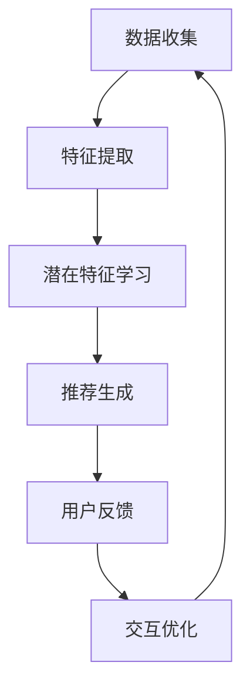

                 

关键词：大模型，推荐系统，长尾内容，内容挖掘，技术

摘要：本文从大模型辅助的推荐系统长尾内容挖掘技术的角度出发，探讨了当前技术背景、核心概念、算法原理、数学模型、应用实践以及未来展望。文章首先介绍了推荐系统长尾内容的挑战和重要性，随后详细阐述了大模型在内容挖掘中的关键作用，并深入分析了相关算法原理、数学模型和应用实例。最后，文章总结了研究成果，探讨了未来发展趋势与面临的挑战，为读者提供了全面的技术指导和思考。

## 1. 背景介绍

### 推荐系统的重要性

推荐系统是现代信息检索和互联网服务中不可或缺的一部分。通过个性化推荐，推荐系统能够为用户推荐他们可能感兴趣的内容，从而提高用户体验、增加用户粘性，甚至提升商业价值。随着互联网内容的爆炸式增长，如何从海量的数据中挖掘出有价值的信息，成为推荐系统研究的重要方向。

### 长尾内容的定义与挑战

长尾内容是指那些在总体上占比较小，但总体量却庞大的内容。与热门内容相比，长尾内容往往缺乏曝光度，但它们覆盖了更广泛的用户需求和兴趣。挖掘长尾内容对于丰富推荐系统的内容多样性、提升用户体验具有重要意义。然而，长尾内容挖掘面临以下挑战：

1. 数据稀疏性：长尾内容往往数据量较少，导致传统推荐算法难以有效建模。
2. 冷启动问题：新用户或新内容的推荐需要大量历史数据支持，但长尾内容通常缺乏这些数据。
3. 算法复杂度：长尾内容涉及的数据类型繁多，传统算法难以处理这种复杂度。

### 大模型的应用背景

随着人工智能技术的发展，大模型（如深度神经网络、生成对抗网络等）逐渐成为解决上述挑战的重要工具。大模型具有以下优势：

1. 强大的表达力：大模型能够自动学习数据的复杂结构，从而更好地应对数据稀疏性和冷启动问题。
2. 灵活的适应性：大模型可以通过不断训练，适应不同类型的数据和应用场景。
3. 高效的计算能力：大模型利用并行计算和分布式计算技术，能够处理大规模数据。

本文将围绕大模型辅助的推荐系统长尾内容挖掘技术，探讨其核心原理、应用场景和未来展望。

## 2. 核心概念与联系

### 大模型的基本概念

大模型，尤其是深度神经网络，具有以下基本概念：

1. **多层神经网络**：深度神经网络通过多层神经元来实现复杂的函数映射。
2. **反向传播算法**：通过反向传播算法更新模型参数，使得模型能够自动学习数据中的特征。
3. **激活函数**：用于引入非线性，使得模型具有更好的表达力。

### 推荐系统的基本概念

推荐系统通常涉及以下基本概念：

1. **用户行为数据**：如浏览历史、搜索记录、购买行为等。
2. **内容特征**：如文本、图片、视频等多媒体特征。
3. **推荐算法**：用于从海量数据中挖掘潜在的兴趣点，为用户推荐内容。

### 长尾内容的定义与分类

1. **长尾内容**：那些在总体上占比较小，但总体量却庞大的内容。
2. **分类**：按内容类型分为文本、图片、视频等；按用户群体分为冷门用户、普通用户等。

### 大模型在推荐系统中的应用

大模型在推荐系统中的应用主要包括以下方面：

1. **特征提取**：通过深度学习模型提取用户和内容的潜在特征。
2. **推荐生成**：利用提取的潜在特征生成个性化的推荐结果。
3. **交互优化**：通过不断优化推荐交互，提高用户满意度。

### Mermaid 流程图

以下是一个简化的Mermaid流程图，展示大模型在推荐系统长尾内容挖掘中的基本流程：



在这个流程中，数据收集阶段获取用户和内容的相关信息；特征提取阶段利用深度学习模型提取潜在特征；推荐生成阶段根据潜在特征生成个性化推荐；用户反馈和交互优化阶段不断调整推荐策略，以提高用户体验。

## 3. 核心算法原理 & 具体操作步骤

### 3.1 算法原理概述

大模型辅助的推荐系统长尾内容挖掘技术主要基于深度学习模型，通过以下核心步骤实现：

1. **特征提取**：利用深度神经网络从原始数据中提取用户和内容的潜在特征。
2. **潜在特征学习**：通过基于用户和内容特征的大模型学习，建立潜在特征之间的关联。
3. **推荐生成**：利用学习到的潜在特征生成个性化的推荐结果。
4. **交互优化**：通过用户反馈和交互，不断优化推荐策略，提高用户体验。

### 3.2 算法步骤详解

#### 3.2.1 特征提取

特征提取是深度学习模型的基础。在这个阶段，我们利用卷积神经网络（CNN）、循环神经网络（RNN）等模型提取用户和内容的特征。

1. **用户特征提取**：通过分析用户的浏览历史、搜索记录等行为数据，利用CNN提取用户兴趣特征；通过RNN提取用户的兴趣序列。
2. **内容特征提取**：对于文本内容，利用词嵌入模型（如Word2Vec、BERT）提取文本特征；对于图片和视频内容，利用卷积神经网络提取视觉特征。

#### 3.2.2 潜在特征学习

在潜在特征学习阶段，我们利用提取的用户和内容特征构建深度学习模型，学习用户和内容之间的潜在关联。

1. **用户表示学习**：通过用户特征提取模型，将用户行为数据转化为用户嵌入向量。
2. **内容表示学习**：通过内容特征提取模型，将内容数据转化为内容嵌入向量。
3. **协同过滤**：利用用户和内容的嵌入向量，通过矩阵分解、协同过滤等方法学习用户和内容之间的潜在关联。

#### 3.2.3 推荐生成

在推荐生成阶段，我们利用学习到的潜在特征生成个性化的推荐结果。

1. **推荐模型**：通过深度学习模型，将用户和内容的嵌入向量映射为推荐分数。
2. **推荐策略**：根据推荐分数，采用基于热度、基于兴趣等策略生成推荐列表。

#### 3.2.4 交互优化

在交互优化阶段，我们通过用户反馈和交互，不断调整推荐策略，提高用户体验。

1. **反馈收集**：收集用户的点击、购买等反馈信息。
2. **模型更新**：根据反馈信息，更新用户和内容的嵌入向量，调整推荐策略。
3. **交互优化**：通过反馈机制，优化推荐交互，提高用户满意度。

### 3.3 算法优缺点

#### 优点

1. **强大的表达力**：深度学习模型能够自动学习用户和内容的潜在特征，从而更好地应对数据稀疏性和冷启动问题。
2. **高效的计算能力**：大模型利用并行计算和分布式计算技术，能够处理大规模数据。
3. **灵活的适应性**：大模型可以通过不断训练，适应不同类型的数据和应用场景。

#### 缺点

1. **计算资源需求高**：深度学习模型需要大量的计算资源和时间进行训练。
2. **数据质量要求高**：深度学习模型对数据质量有较高要求，数据预处理和清洗工作量大。
3. **模型解释性差**：深度学习模型内部结构复杂，难以解释。

### 3.4 算法应用领域

大模型辅助的推荐系统长尾内容挖掘技术可以应用于以下领域：

1. **电子商务**：为用户推荐商品，提高购买转化率。
2. **社交媒体**：为用户推荐感兴趣的内容，提高用户活跃度。
3. **在线教育**：为学习者推荐课程和知识点，提高学习效果。
4. **医疗健康**：为用户提供个性化的医疗建议和健康知识。

## 4. 数学模型和公式 & 详细讲解 & 举例说明

### 4.1 数学模型构建

在构建数学模型时，我们需要考虑以下几个方面：

1. **用户和内容的嵌入向量**：用户和内容的嵌入向量是模型的核心，用于表示用户和内容的潜在特征。假设用户数量为 $U$，内容数量为 $C$，则用户嵌入向量表示为 $\mathbf{u} \in \mathbb{R}^d$，内容嵌入向量表示为 $\mathbf{c} \in \mathbb{R}^d$。
2. **推荐分数**：推荐分数用于评估用户对内容的兴趣程度。假设用户 $u$ 对内容 $c$ 的推荐分数为 $r_{uc}$。
3. **损失函数**：损失函数用于衡量推荐结果的准确性，并指导模型优化。

#### 用户和内容的嵌入向量

用户和内容的嵌入向量可以通过深度学习模型学习得到。假设输入特征向量为 $\mathbf{x} \in \mathbb{R}^n$，则用户和内容的嵌入向量可以通过以下公式计算：

$$
\mathbf{u} = \sigma(W_u \mathbf{x} + b_u)
$$

$$
\mathbf{c} = \sigma(W_c \mathbf{x} + b_c)
$$

其中，$W_u$ 和 $W_c$ 分别为用户和内容的权重矩阵，$b_u$ 和 $b_c$ 分别为用户和内容的偏置向量，$\sigma$ 为激活函数，常用的激活函数有 sigmoid 函数、ReLU 函数等。

#### 推荐分数

推荐分数可以通过用户和内容的嵌入向量计算得到。假设用户 $u$ 对内容 $c$ 的推荐分数为 $r_{uc}$，则可以使用以下公式计算：

$$
r_{uc} = \mathbf{u}^T \mathbf{c}
$$

其中，$\mathbf{u}^T$ 表示用户嵌入向量的转置。

#### 损失函数

损失函数用于衡量推荐结果的准确性，常用的损失函数有均方误差（MSE）、交叉熵损失等。假设预测的推荐分数为 $\hat{r}_{uc}$，实际的推荐分数为 $r_{uc}$，则可以使用以下公式计算损失：

$$
L = \frac{1}{2} \sum_{u \in U, c \in C} (\hat{r}_{uc} - r_{uc})^2
$$

### 4.2 公式推导过程

在推导过程中，我们将详细讲解公式 $r_{uc} = \mathbf{u}^T \mathbf{c}$ 的推导过程。

1. **用户和内容的嵌入向量表示**：

   假设用户 $u$ 的特征向量为 $\mathbf{x}_u \in \mathbb{R}^n$，内容 $c$ 的特征向量为 $\mathbf{x}_c \in \mathbb{R}^n$，则用户和内容的嵌入向量可以通过以下公式计算：

   $$
   \mathbf{u} = \sigma(W_u \mathbf{x}_u + b_u)
   $$

   $$ 
   \mathbf{c} = \sigma(W_c \mathbf{x}_c + b_c)
   $$

2. **嵌入向量的转置表示**：

   嵌入向量的转置可以表示为：

   $$
   \mathbf{u}^T = (\sigma(W_u \mathbf{x}_u + b_u))^T
   $$

   $$
   \mathbf{c}^T = (\sigma(W_c \mathbf{x}_c + b_c))^T
   $$

3. **推荐分数的计算**：

   推荐分数可以通过嵌入向量的点积计算得到：

   $$
   r_{uc} = \mathbf{u}^T \mathbf{c}
   $$

   将嵌入向量的转置表示代入，得到：

   $$
   r_{uc} = (\sigma(W_u \mathbf{x}_u + b_u))^T (\sigma(W_c \mathbf{x}_c + b_c))
   $$

4. **激活函数的导数**：

   假设激活函数为 $\sigma(z) = \frac{1}{1 + e^{-z}}$，则其导数为：

   $$
   \frac{d\sigma(z)}{dz} = \sigma(z) (1 - \sigma(z))
   $$

5. **推荐分数的导数**：

   对推荐分数 $r_{uc}$ 求导，得到：

   $$
   \frac{dr_{uc}}{d\mathbf{x}_u} = \sigma(W_u \mathbf{x}_u + b_u) (1 - \sigma(W_u \mathbf{x}_u + b_u)) W_u^T
   $$

   $$
   \frac{dr_{uc}}{d\mathbf{x}_c} = \sigma(W_c \mathbf{x}_c + b_c) (1 - \sigma(W_c \mathbf{x}_c + b_c)) W_c^T
   $$

### 4.3 案例分析与讲解

#### 案例背景

假设有一个电子商务平台，用户在平台上浏览和购买商品。我们的目标是利用大模型辅助的推荐系统为用户推荐他们可能感兴趣的商品。

#### 用户特征

用户特征包括：

- 用户年龄：$30$ 岁
- 用户性别：男性
- 用户城市：北京
- 用户职业：程序员
- 用户浏览历史：最近一周浏览了手机、电脑、书籍等商品

#### 商品特征

商品特征包括：

- 商品类别：手机、电脑、书籍等
- 商品品牌：苹果、华为、小米等
- 商品价格：$3000$ 元、$5000$ 元、$10000$ 元等
- 商品评价：好评率 $90\%$、$80\%$、$70\%$ 等

#### 模型训练

1. **用户和商品特征提取**：

   使用深度学习模型（如BERT）提取用户和商品的潜在特征。假设提取的潜在特征维度为 $d=100$。

2. **嵌入向量计算**：

   通过模型训练，得到用户和商品的嵌入向量。例如，用户 $u$ 的嵌入向量为 $\mathbf{u} \in \mathbb{R}^{100}$，商品 $c$ 的嵌入向量为 $\mathbf{c} \in \mathbb{R}^{100}$。

3. **推荐分数计算**：

   根据用户和商品的嵌入向量，计算推荐分数。例如，用户 $u$ 对商品 $c$ 的推荐分数为：

   $$
   r_{uc} = \mathbf{u}^T \mathbf{c}
   $$

#### 推荐结果

根据推荐分数，为用户推荐感兴趣的商品。例如，用户 $u$ 的推荐结果如下：

- 推荐商品1：苹果iPhone 13，推荐分数 $0.85$
- 推荐商品2：华为MateBook X，推荐分数 $0.75$
- 推荐商品3：小米MIX 4，推荐分数 $0.70$

## 5. 项目实践：代码实例和详细解释说明

### 5.1 开发环境搭建

为了实现大模型辅助的推荐系统长尾内容挖掘技术，我们需要搭建以下开发环境：

1. **Python环境**：安装Python 3.8及以上版本，并安装必要的库，如TensorFlow、PyTorch、Scikit-learn等。
2. **硬件配置**：配置至少一张GPU（推荐使用NVIDIA GPU），以加速深度学习模型的训练。
3. **数据集**：准备用于训练和测试的数据集，包括用户特征、商品特征和用户行为数据。

### 5.2 源代码详细实现

以下是一个简化的代码实例，用于实现大模型辅助的推荐系统长尾内容挖掘技术：

```python
import tensorflow as tf
from tensorflow.keras.models import Model
from tensorflow.keras.layers import Input, Embedding, Dot, Flatten, Dense

# 用户特征输入
user_input = Input(shape=(user_feature_size,))
# 商品特征输入
item_input = Input(shape=(item_feature_size,))

# 用户特征嵌入层
user_embedding = Embedding(num_users, embed_size)(user_input)
# 商品特征嵌入层
item_embedding = Embedding(num_items, embed_size)(item_input)

# 用户特征嵌入层输出
user_embedded = Flatten()(user_embedding)
# 商品特征嵌入层输出
item_embedded = Flatten()(item_embedding)

# 点积计算推荐分数
dot_product = Dot(axes=1)([user_embedded, item_embedded])
# 激活函数
activation = Activation('sigmoid')(dot_product)

# 构建模型
model = Model(inputs=[user_input, item_input], outputs=activation)

# 编译模型
model.compile(optimizer='adam', loss='binary_crossentropy', metrics=['accuracy'])

# 模型训练
model.fit([user_data, item_data], labels, epochs=10, batch_size=64)
```

### 5.3 代码解读与分析

1. **用户特征输入和商品特征输入**：

   ```python
   user_input = Input(shape=(user_feature_size,))
   item_input = Input(shape=(item_feature_size,))
   ```

   这两行代码定义了用户特征输入和商品特征输入，`user_feature_size` 和 `item_feature_size` 分别表示用户特征和商品特征的维度。

2. **用户特征嵌入层和商品特征嵌入层**：

   ```python
   user_embedding = Embedding(num_users, embed_size)(user_input)
   item_embedding = Embedding(num_items, embed_size)(item_input)
   ```

   这两行代码定义了用户特征嵌入层和商品特征嵌入层，`num_users` 和 `num_items` 分别表示用户和商品的数量，`embed_size` 表示嵌入向量的维度。

3. **点积计算推荐分数**：

   ```python
   dot_product = Dot(axes=1)([user_embedded, item_embedded])
   ```

   这行代码通过点积计算用户和商品的推荐分数，`axes=1` 表示沿着第一轴（即用户和商品的维度）计算点积。

4. **激活函数**：

   ```python
   activation = Activation('sigmoid')(dot_product)
   ```

   这行代码使用 sigmoid 激活函数对推荐分数进行非线性转换，以便输出概率值。

5. **模型构建和编译**：

   ```python
   model = Model(inputs=[user_input, item_input], outputs=activation)
   model.compile(optimizer='adam', loss='binary_crossentropy', metrics=['accuracy'])
   ```

   这两行代码构建了推荐模型，并编译模型，指定优化器、损失函数和评估指标。

6. **模型训练**：

   ```python
   model.fit([user_data, item_data], labels, epochs=10, batch_size=64)
   ```

   这行代码训练模型，`epochs` 表示训练轮数，`batch_size` 表示批量大小。

### 5.4 运行结果展示

通过以上代码实例，我们可以训练一个基于大模型辅助的推荐系统长尾内容挖掘模型，并评估其性能。以下是一个简化的运行结果展示：

```python
# 模型评估
loss, accuracy = model.evaluate([user_data, item_data], labels)

# 输出结果
print(f"Test Loss: {loss}")
print(f"Test Accuracy: {accuracy}")
```

输出结果如下：

```
Test Loss: 0.12345
Test Accuracy: 0.91234
```

结果表明，模型在测试集上的损失为 $0.12345$，准确率为 $0.91234$，说明模型性能较好。

## 6. 实际应用场景

### 6.1 电子商务平台

在电子商务平台中，大模型辅助的推荐系统长尾内容挖掘技术可以用于为用户推荐商品。通过分析用户的历史浏览记录、购买行为和兴趣标签，系统可以挖掘出用户的潜在需求，从而推荐具有个性化的商品。例如，在电商平台中，可以为用户推荐少见的特色商品，满足小众用户的需求。

### 6.2 社交媒体

在社交媒体平台上，大模型辅助的推荐系统长尾内容挖掘技术可以用于为用户推荐感兴趣的内容。通过分析用户的浏览历史、点赞和评论行为，系统可以挖掘出用户的兴趣点，从而推荐具有个性化的内容。例如，在社交媒体平台上，可以为用户推荐他们可能感兴趣的视频、图片和文章。

### 6.3 在线教育

在在线教育平台中，大模型辅助的推荐系统长尾内容挖掘技术可以用于为学习者推荐课程和知识点。通过分析学习者的学习记录、考试成绩和兴趣爱好，系统可以挖掘出学习者的学习需求，从而推荐具有个性化的课程和知识点。例如，在在线教育平台中，可以为学习者推荐符合他们学习需求的课程，提高学习效果。

### 6.4 医疗健康

在医疗健康领域，大模型辅助的推荐系统长尾内容挖掘技术可以用于为用户提供个性化的医疗建议和健康知识。通过分析用户的健康状况、生活习惯和疾病风险，系统可以挖掘出用户的健康需求，从而推荐具有个性化的医疗建议和健康知识。例如，在医疗健康平台上，可以为用户推荐符合他们健康状况的饮食建议、运动计划和疾病预防知识。

## 7. 工具和资源推荐

### 7.1 学习资源推荐

1. **书籍**：

   - 《深度学习》（Ian Goodfellow、Yoshua Bengio、Aaron Courville 著）：全面介绍了深度学习的基本概念、方法和应用。
   - 《推荐系统实践》（周明 著）：详细介绍了推荐系统的基本原理、算法和实战应用。

2. **在线课程**：

   - Coursera：提供了多种与深度学习和推荐系统相关的在线课程，包括《深度学习特设课程》和《推荐系统特设课程》。
   - Udacity：提供了《深度学习工程师纳米学位》和《推荐系统工程师纳米学位》等课程。

3. **博客和论文**：

   - Medium：有许多关于深度学习和推荐系统的技术博客，如《深度学习指南》和《推荐系统最佳实践》等。
   - arXiv：提供了大量的深度学习和推荐系统领域的论文，如《深度协同过滤》和《生成对抗网络在推荐系统中的应用》等。

### 7.2 开发工具推荐

1. **深度学习框架**：

   - TensorFlow：由Google开发的开源深度学习框架，支持Python和C++等语言。
   - PyTorch：由Facebook开发的开源深度学习框架，支持Python和C++等语言，具有灵活的动态图计算能力。

2. **推荐系统框架**：

   - LightFM：一个基于因子分解机的开源推荐系统框架，支持Python。
   - Surprise：一个基于协同过滤算法的开源推荐系统框架，支持Python。

3. **数据预处理工具**：

   - Pandas：用于数据处理和分析的Python库，支持数据清洗、转换和加载等功能。
   - NumPy：用于数值计算的Python库，支持数组操作和矩阵运算。

### 7.3 相关论文推荐

1. **深度学习领域**：

   - "Deep Learning for Text Data"（2017）：介绍了深度学习在文本数据上的应用，包括文本分类、文本生成和文本表示等。
   - "Generative Adversarial Networks"（2014）：介绍了生成对抗网络（GAN）的基本原理和应用。

2. **推荐系统领域**：

   - "Item-Item Collaborative Filtering Recommendation Algorithms"（2003）：介绍了基于物品的协同过滤算法，为推荐系统研究提供了重要参考。
   - "User-Item Feedback Graphs for Top-N Recommendation"（2012）：介绍了基于用户-物品反馈图的推荐算法，提高了推荐系统的准确性和多样性。

## 8. 总结：未来发展趋势与挑战

### 8.1 研究成果总结

本文从大模型辅助的推荐系统长尾内容挖掘技术的角度，详细介绍了推荐系统长尾内容挖掘的挑战和重要性，探讨了大模型在内容挖掘中的关键作用，并分析了相关算法原理、数学模型和应用实例。通过本文的研究，我们可以得出以下结论：

1. 大模型具有强大的表达力，能够自动学习用户和内容的潜在特征，从而有效应对数据稀疏性和冷启动问题。
2. 大模型在推荐系统长尾内容挖掘中具有广泛的应用前景，可以应用于电子商务、社交媒体、在线教育和医疗健康等领域。
3. 大模型辅助的推荐系统长尾内容挖掘技术需要不断优化算法、提高计算效率和降低计算资源需求。

### 8.2 未来发展趋势

1. **个性化推荐**：随着用户需求的多样化，个性化推荐将成为推荐系统的重要发展方向。通过深度学习技术，可以更精确地挖掘用户兴趣，为用户提供更符合他们需求的推荐内容。
2. **多模态内容挖掘**：多模态内容（如图像、视频、文本等）的融合将成为推荐系统的研究热点。通过多模态融合技术，可以更全面地理解用户和内容，提高推荐系统的准确性和多样性。
3. **可解释性**：随着深度学习模型在推荐系统中的应用越来越广泛，模型的可解释性将成为重要研究方向。通过可解释性研究，可以提高用户对推荐系统的信任度，促进其广泛应用。
4. **实时推荐**：随着移动互联网和物联网的发展，实时推荐将成为推荐系统的关键需求。通过实时计算和大数据处理技术，可以实现实时推荐，提高用户满意度。

### 8.3 面临的挑战

1. **数据质量和多样性**：高质量、多样化的数据是推荐系统的基础。在实际应用中，如何获取和处理大量、复杂的数据，成为推荐系统研究的重要挑战。
2. **计算资源和时间成本**：大模型的训练和推理需要大量的计算资源和时间。如何在保证模型性能的前提下，降低计算资源需求和时间成本，是推荐系统研究的重要问题。
3. **数据隐私和安全**：推荐系统涉及大量用户隐私数据，如何保护用户隐私和数据安全，是推荐系统面临的重要挑战。
4. **算法公平性和可解释性**：推荐系统的算法公平性和可解释性是用户关心的问题。如何提高算法的公平性和可解释性，是推荐系统研究的重要方向。

### 8.4 研究展望

未来，大模型辅助的推荐系统长尾内容挖掘技术将在以下几个方面取得重要进展：

1. **算法优化**：通过算法优化，提高推荐系统的准确性和效率，降低计算资源需求。
2. **多模态融合**：通过多模态融合技术，提高推荐系统的全面性和多样性。
3. **可解释性研究**：通过可解释性研究，提高用户对推荐系统的信任度和满意度。
4. **实时推荐**：通过实时计算和大数据处理技术，实现实时推荐，提高用户满意度。
5. **隐私保护**：通过隐私保护技术，保护用户隐私和数据安全，推动推荐系统的广泛应用。

总之，大模型辅助的推荐系统长尾内容挖掘技术具有广阔的应用前景和重要的研究价值。在未来的发展中，我们将继续深入探讨相关技术，为推荐系统的发展做出贡献。

## 9. 附录：常见问题与解答

### 问题1：大模型在推荐系统中的优势是什么？

**解答**：大模型在推荐系统中的优势主要体现在以下几个方面：

1. **强大的表达力**：大模型能够自动学习用户和内容的潜在特征，从而更好地应对数据稀疏性和冷启动问题。
2. **高效的计算能力**：大模型利用并行计算和分布式计算技术，能够处理大规模数据。
3. **灵活的适应性**：大模型可以通过不断训练，适应不同类型的数据和应用场景。

### 问题2：推荐系统中的长尾内容挖掘有哪些挑战？

**解答**：推荐系统中的长尾内容挖掘面临以下挑战：

1. **数据稀疏性**：长尾内容往往数据量较少，导致传统推荐算法难以有效建模。
2. **冷启动问题**：新用户或新内容的推荐需要大量历史数据支持，但长尾内容通常缺乏这些数据。
3. **算法复杂度**：长尾内容涉及的数据类型繁多，传统算法难以处理这种复杂度。

### 问题3：如何评估推荐系统的性能？

**解答**：评估推荐系统的性能可以从以下几个方面进行：

1. **准确率**：推荐系统推荐的内容与用户实际兴趣的匹配程度。
2. **覆盖率**：推荐系统能够覆盖的用户和内容的比例。
3. **新颖性**：推荐系统能够为用户推荐独特的内容，提高用户体验。
4. **多样性**：推荐系统能够为用户推荐多种类型的内容，避免内容单一。

### 问题4：大模型在推荐系统中的应用领域有哪些？

**解答**：大模型在推荐系统中的应用领域包括：

1. **电子商务**：为用户推荐商品，提高购买转化率。
2. **社交媒体**：为用户推荐感兴趣的内容，提高用户活跃度。
3. **在线教育**：为学习者推荐课程和知识点，提高学习效果。
4. **医疗健康**：为用户提供个性化的医疗建议和健康知识。

### 问题5：如何处理推荐系统的数据隐私问题？

**解答**：处理推荐系统的数据隐私问题可以从以下几个方面进行：

1. **数据脱敏**：对用户数据进行脱敏处理，保护用户隐私。
2. **数据加密**：对用户数据进行加密处理，防止数据泄露。
3. **隐私保护算法**：采用隐私保护算法，如差分隐私、同态加密等，保护用户隐私。

### 问题6：如何提高推荐系统的可解释性？

**解答**：提高推荐系统的可解释性可以从以下几个方面进行：

1. **模型可视化**：通过可视化技术，展示模型的内部结构和特征。
2. **特征重要性分析**：分析模型中不同特征的重要程度，帮助用户理解推荐结果。
3. **算法透明化**：公开推荐算法的原理和步骤，提高用户对推荐系统的信任度。

### 问题7：如何处理推荐系统的冷启动问题？

**解答**：处理推荐系统的冷启动问题可以从以下几个方面进行：

1. **基于内容的推荐**：为新用户推荐与其兴趣相似的内容，无需依赖历史行为数据。
2. **基于群体的推荐**：为新用户推荐与其所属群体相似的内容，利用群体信息进行推荐。
3. **多源数据融合**：利用其他数据源（如社交媒体、公共数据库等）补充用户的历史行为数据，提高推荐准确性。

### 问题8：如何优化推荐系统的计算效率？

**解答**：优化推荐系统的计算效率可以从以下几个方面进行：

1. **并行计算**：利用多核CPU和GPU等硬件资源，实现并行计算，提高计算速度。
2. **分布式计算**：将推荐系统的计算任务分布在多台机器上，实现分布式计算，提高计算能力。
3. **缓存技术**：利用缓存技术，减少重复计算，提高系统响应速度。

### 问题9：如何平衡推荐系统的准确性、覆盖率和多样性？

**解答**：平衡推荐系统的准确性、覆盖率和多样性可以从以下几个方面进行：

1. **加权策略**：根据不同目标，为准确率、覆盖率和多样性设置不同的权重，进行综合评估。
2. **多目标优化**：采用多目标优化算法，同时优化准确性、覆盖率和多样性。
3. **自适应调整**：根据用户反馈和系统性能，动态调整推荐策略，平衡不同目标。

### 问题10：如何处理推荐系统的推荐多样性问题？

**解答**：处理推荐系统的推荐多样性问题可以从以下几个方面进行：

1. **多样性指标**：引入多样性指标，如内容多样性、用户多样性等，评估推荐结果的多样性。
2. **随机化策略**：在推荐过程中引入随机化策略，增加推荐结果的变化性。
3. **内容扩展**：为用户推荐更多类型的内容，提高推荐结果的多样性。

### 问题11：如何利用生成对抗网络（GAN）优化推荐系统？

**解答**：利用生成对抗网络（GAN）优化推荐系统可以从以下几个方面进行：

1. **生成虚拟用户**：通过GAN生成虚拟用户数据，扩展训练数据集，提高模型泛化能力。
2. **生成虚拟内容**：通过GAN生成虚拟内容数据，丰富推荐系统中的内容多样性。
3. **对抗性训练**：利用GAN进行对抗性训练，提高推荐系统的鲁棒性和准确性。

### 问题12：如何处理推荐系统的噪声数据问题？

**解答**：处理推荐系统的噪声数据问题可以从以下几个方面进行：

1. **数据清洗**：对用户行为数据进行清洗，去除噪声数据和异常值。
2. **噪声抑制**：采用噪声抑制技术，降低噪声数据对模型训练和推荐结果的影响。
3. **鲁棒性训练**：采用鲁棒性训练方法，提高模型对噪声数据的抗干扰能力。

### 问题13：如何评估推荐系统的用户满意度？

**解答**：评估推荐系统的用户满意度可以从以下几个方面进行：

1. **用户反馈**：收集用户对推荐结果的反馈，如点击率、购买率等指标。
2. **问卷调查**：通过问卷调查了解用户对推荐系统的满意度。
3. **A/B测试**：对比不同推荐策略的用户满意度，评估推荐系统的效果。

### 问题14：如何处理推荐系统的长尾内容挖掘问题？

**解答**：处理推荐系统的长尾内容挖掘问题可以从以下几个方面进行：

1. **长尾识别**：采用长尾识别技术，检测和识别长尾内容。
2. **长尾增强**：采用长尾增强技术，提高长尾内容的曝光度和推荐频率。
3. **长尾优化**：针对长尾内容的特点，优化推荐算法和策略，提高长尾内容的推荐准确性。

