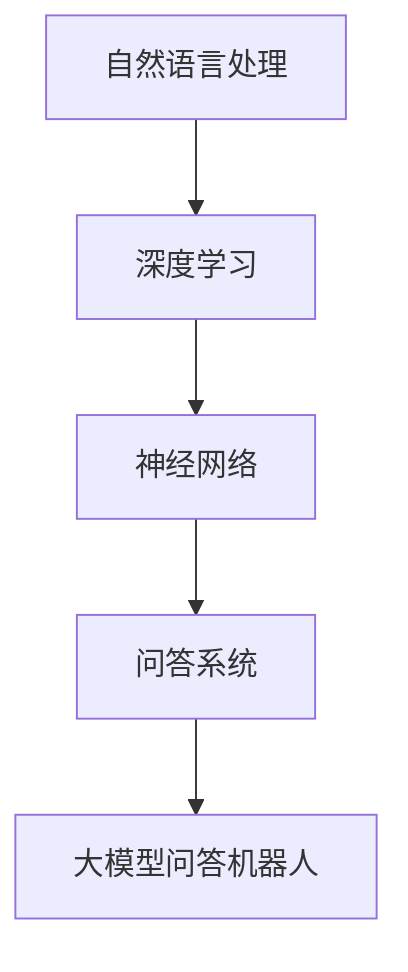

                 

关键词：大模型问答机器人，深度学习，自然语言处理，神经网络，推理算法，BERT模型，训练策略，应用场景，未来发展

> 摘要：本文将深入探讨大模型问答机器人的深度学习技术，分析其核心概念、算法原理、数学模型、应用实践和未来发展趋势。通过详细的讲解和案例分析，读者将能够全面了解大模型问答机器人在自然语言处理领域的应用，以及面临的挑战和未来研究方向。

## 1. 背景介绍

随着互联网的迅速发展和信息爆炸，人们对于信息获取的需求日益增长。然而，传统的搜索引擎在处理复杂查询和提供精确答案方面存在一定局限性。为了解决这一问题，问答系统（Question Answering, QA）应运而生。问答系统旨在通过自然语言交互，提供用户所需的信息。其中，大模型问答机器人的出现，进一步提升了问答系统的性能和准确性。

大模型问答机器人基于深度学习技术，通过大规模语料库的训练，能够自动提取语义信息，理解用户问题，并生成准确的答案。与传统的规则驱动或基于统计的问答系统相比，深度学习模型具有更强的灵活性和泛化能力，能够处理复杂的问题和多样化的应用场景。

本文将围绕大模型问答机器人的深度学习技术展开讨论，主要包括以下内容：

- 背景介绍
- 核心概念与联系
- 核心算法原理与具体操作步骤
- 数学模型和公式详解
- 项目实践：代码实例和详细解释说明
- 实际应用场景
- 未来应用展望
- 工具和资源推荐
- 总结：未来发展趋势与挑战

## 2. 核心概念与联系

在讨论大模型问答机器人的深度学习技术之前，我们首先需要了解相关核心概念及其相互关系。以下是一个使用Mermaid绘制的流程图，展示这些概念之间的关系：



### 自然语言处理（Natural Language Processing, NLP）

自然语言处理是计算机科学和人工智能领域的一个分支，旨在使计算机能够理解、生成和处理人类语言。NLP涉及到文本的分词、词性标注、句法分析、语义分析等任务。

### 深度学习（Deep Learning）

深度学习是一种基于人工神经网络的机器学习技术，通过多层网络结构，自动学习数据的特征表示。深度学习在图像识别、语音识别、自然语言处理等领域取得了显著成果。

### 神经网络（Neural Networks）

神经网络是深度学习的基础，由大量简单神经元组成，通过前向传播和反向传播算法，实现数据的特征提取和分类。

### 问答系统（Question Answering, QA）

问答系统是一种通过自然语言交互，自动回答用户问题的技术。问答系统可以分为开放域问答和封闭域问答，分别应用于广泛的查询和特定领域的问题。

### 大模型问答机器人（Large-scale Question Answering Robots）

大模型问答机器人是基于深度学习的问答系统，通过大规模语料库的训练，能够自动提取语义信息，理解用户问题，并生成准确的答案。大模型问答机器人的关键在于其强大的语义理解能力和广泛的泛化能力。

## 3. 核心算法原理与具体操作步骤

### 3.1 算法原理概述

大模型问答机器人主要基于Transformer架构，如BERT（Bidirectional Encoder Representations from Transformers）模型，通过双向编码器学习文本的语义表示。BERT模型采用预先训练（Pre-training）和微调（Fine-tuning）的策略，首先在大规模语料库上进行无监督训练，然后针对具体任务进行有监督微调。

### 3.2 算法步骤详解

#### 3.2.1 预训练

预训练阶段的主要目标是学习文本的通用特征表示。BERT模型采用两个关键技巧：Masked Language Modeling（MLM）和Next Sentence Prediction（NSP）。

1. **Masked Language Modeling（MLM）**：在训练过程中，随机遮盖部分单词，模型需要预测这些遮盖的单词。
2. **Next Sentence Prediction（NSP）**：输入两个连续的句子，模型需要预测第二个句子是否为第一个句子的下一个句子。

#### 3.2.2 微调

微调阶段的主要目标是针对具体任务调整模型的参数。在微调过程中，将BERT模型的输出层替换为任务特定的层，并通过有监督数据训练模型。

1. **任务特定的层**：根据任务需求，设计特定层进行特征提取和分类。
2. **有监督数据训练**：使用标注数据对模型进行训练，优化模型参数。

### 3.3 算法优缺点

#### 优点

1. **强大的语义理解能力**：BERT模型通过双向编码器学习文本的语义表示，能够捕捉词与词之间的复杂关系。
2. **广泛的泛化能力**：BERT模型在大规模语料库上进行预训练，具备较强的泛化能力。
3. **灵活的微调策略**：针对不同任务，可以设计特定层进行特征提取和分类。

#### 缺点

1. **计算资源需求高**：BERT模型训练过程中需要大量计算资源和时间。
2. **数据依赖性强**：BERT模型的性能依赖于大规模高质量语料库，数据质量直接影响模型效果。

### 3.4 算法应用领域

BERT模型在自然语言处理领域取得了广泛的应用，如文本分类、命名实体识别、机器翻译等。在大模型问答机器人中，BERT模型主要用于文本分类和实体识别任务。

## 4. 数学模型和公式详解

### 4.1 数学模型构建

BERT模型的数学模型主要包括词嵌入、位置编码和Transformer编码器。

#### 4.1.1 词嵌入

词嵌入是将词汇映射到高维向量空间的过程。BERT模型采用WordPiece算法，将单词拆分成子词，然后将子词映射到向量空间。

$$
\text{word\_embedding} = \text{embedding\_layer}(\text{input\_token})
$$

#### 4.1.2 位置编码

位置编码用于引入文本序列的顺序信息。BERT模型采用 sinusoidal 位置编码。

$$
\text{position\_encoding}(\text{pos}, 2i) = \sin(\frac{\text{pos}}{\text{d_{model}}^{0.5}})
$$

$$
\text{position\_encoding}(\text{pos}, 2i+1) = \cos(\frac{\text{pos}}{\text{d_{model}}^{0.5}})
$$

#### 4.1.3 Transformer 编码器

BERT模型采用多层的 Transformer 编码器，通过自注意力机制（Self-Attention）和前馈神经网络（Feedforward Neural Network）提取文本的语义表示。

$$
\text{Transformer\_encoder}(\text{input}, \text{hidden\_size}) = \text{MultiHeadSelfAttention}(\text{input}) + \text{FeedforwardNeuralNetwork}(\text{input})
$$

### 4.2 公式推导过程

#### 4.2.1 自注意力机制

自注意力机制（Self-Attention）是一种计算文本序列中每个词与其他词之间关联度的方法。在BERT模型中，自注意力机制通过多头的点积注意力（Scaled Dot-Product Attention）实现。

$$
\text{Attention}(Q, K, V) = \text{softmax}(\frac{QK^T}{\sqrt{d_k}})V
$$

其中，$Q, K, V$分别为查询向量、键向量和值向量，$d_k$为键向量的维度。

#### 4.2.2 多层 Transformer 编码器

BERT模型采用多层 Transformer 编码器，通过残差连接和层归一化（Layer Normalization）提高模型的性能。

$$
\text{Transformer\_encoder}(\text{input}, \text{hidden\_size}) = \text{LayerNorm}(\text{input} + \text{MultiHeadSelfAttention}(\text{input})) + \text{FeedforwardNeuralNetwork}(\text{input}) + \text{LayerNorm}(\text{output})
$$

其中，$\text{LayerNorm}$为层归一化操作，$\text{FeedforwardNeuralNetwork}$为前馈神经网络。

### 4.3 案例分析与讲解

#### 4.3.1 案例背景

假设我们有一个关于疾病的问答系统，用户提出一个关于某种疾病的问题，如“糖尿病的症状是什么？”。

#### 4.3.2 数据预处理

1. **分词**：将用户问题分词为“糖尿病”、“的”、“症状”、“是”、“什么”等子词。
2. **词嵌入**：将子词映射到词嵌入向量空间。
3. **位置编码**：为每个子词添加位置编码。

#### 4.3.3 模型输入

1. **输入序列**：将分词后的子词和位置编码作为模型输入。
2. **Masked Language Modeling（MLM）**：随机遮盖部分子词，如“糖尿病”和“症状”，模型需要预测这些遮盖的子词。

#### 4.3.4 模型推理

1. **自注意力机制**：计算文本序列中每个词与其他词之间的关联度。
2. **前馈神经网络**：对自注意力机制的结果进行非线性变换。
3. **输出层**：通过全连接层预测遮盖的子词。

#### 4.3.5 生成答案

1. **文本分类**：根据输入问题，分类为不同类型的疾病问题。
2. **实体识别**：识别问题中的关键实体，如疾病名称。
3. **生成答案**：根据分类结果和实体信息，生成问题的答案。

## 5. 项目实践：代码实例和详细解释说明

### 5.1 开发环境搭建

1. **Python环境**：安装Python 3.7及以上版本。
2. **TensorFlow**：安装TensorFlow 2.0及以上版本。
3. **BERT模型**：下载预训练的BERT模型，如Google的BERT模型。

### 5.2 源代码详细实现

以下是一个使用TensorFlow实现BERT模型的基本示例：

```python
import tensorflow as tf
import tensorflow_hub as hub

# 加载预训练BERT模型
bert_model = hub.load('https://tfhub.dev/google/bert_uncased_L-12_H-768_A-12/1')

# 定义输入数据
input_ids = tf.placeholder(shape=(None, 128), dtype=tf.int32)
input_mask = tf.placeholder(shape=(None, 128), dtype=tf.int32)
segment_ids = tf.placeholder(shape=(None, 128), dtype=tf.int32)

# 获取BERT模型的输出
output = bert_model([input_ids, input_mask, segment_ids])

# 定义损失函数和优化器
loss = tf.reduce_mean(tf.nn.softmax_cross_entropy_with_logits(logits=output.logits, labels=y))
optimizer = tf.train.AdamOptimizer().minimize(loss)

# 训练模型
with tf.Session() as sess:
    sess.run(tf.global_variables_initializer())
    for epoch in range(10):
        for batch in batches:
            feed_dict = {
                input_ids: batch['input_ids'],
                input_mask: batch['input_mask'],
                segment_ids: batch['segment_ids'],
                y: batch['labels']
            }
            sess.run(optimizer, feed_dict=feed_dict)
        print('Epoch', epoch+1, ': Loss', sess.run(loss, feed_dict=feed_dict))

# 评估模型
correct_predictions = 0
total_predictions = 0
for batch in validation_batches:
    feed_dict = {
        input_ids: batch['input_ids'],
        input_mask: batch['input_mask'],
        segment_ids: batch['segment_ids'],
        y: batch['labels']
    }
    predictions = sess.run(output.logits, feed_dict=feed_dict)
    correct_predictions += (predictions.argmax(axis=1) == batch['labels']).sum()
    total_predictions += predictions.shape[0]
accuracy = correct_predictions / total_predictions
print('Validation Accuracy:', accuracy)
```

### 5.3 代码解读与分析

1. **加载BERT模型**：使用TensorFlow Hub加载预训练的BERT模型。
2. **定义输入数据**：输入数据包括输入ID、输入掩码和分段ID。
3. **获取BERT模型输出**：通过BERT模型获取输出特征向量。
4. **定义损失函数和优化器**：使用softmax交叉熵损失函数和Adam优化器。
5. **训练模型**：在训练数据上迭代训练模型。
6. **评估模型**：在验证数据上评估模型性能。

## 6. 实际应用场景

大模型问答机器人在实际应用中具有广泛的应用场景，如：

- **智能客服**：提供24小时在线客服，自动回答用户关于产品、订单、售后等问题。
- **教育辅导**：为学生提供个性化辅导，解答学术问题，帮助学生提高学习效果。
- **医疗健康**：为医生和患者提供医疗咨询，帮助诊断病情、推荐治疗方案。
- **金融理财**：为用户提供投资建议、股票分析、财务规划等咨询服务。

### 6.4 未来应用展望

随着深度学习技术的不断发展，大模型问答机器人的性能和适用范围将进一步提升。未来，大模型问答机器人有望在以下几个方面实现突破：

- **更细粒度的语义理解**：通过引入多模态数据和跨语言模型，实现更精细的语义理解。
- **个性化服务**：根据用户行为和偏好，提供个性化的问答服务。
- **对话式搜索**：实现更自然、更智能的对话式搜索体验。
- **人机协作**：与人类专家合作，共同解决复杂问题，提升整体效率。

## 7. 工具和资源推荐

### 7.1 学习资源推荐

- **《深度学习》**：由Ian Goodfellow、Yoshua Bengio和Aaron Courville所著，全面介绍了深度学习的基础知识和最新进展。
- **《BERT：Pre-training of Deep Neural Networks for Language Understanding》**：BERT模型的论文，详细介绍了模型的设计和训练过程。
- **TensorFlow官方文档**：提供了丰富的教程、示例和API文档，帮助开发者掌握TensorFlow的使用。

### 7.2 开发工具推荐

- **TensorFlow**：开源的深度学习框架，适用于各种规模的深度学习项目。
- **PyTorch**：另一种流行的深度学习框架，具有灵活的动态图计算能力。
- **Google Colab**：免费的云端计算平台，适用于深度学习实验和项目开发。

### 7.3 相关论文推荐

- **《GPT-3: Language Models are Few-Shot Learners》**：GPT-3模型的论文，介绍了基于Transformer架构的预训练语言模型。
- **《Robustly Optimized Pre-trained Transformers for Natural Language Processing》**：ROBERTA模型的论文，对BERT模型进行了改进。
- **《Exploring the Limits of Pre-training for Natural Language Processing》**：探讨了预训练模型在自然语言处理领域的应用和挑战。

## 8. 总结：未来发展趋势与挑战

### 8.1 研究成果总结

大模型问答机器人在深度学习技术的推动下，取得了显著的研究成果。通过大规模预训练和微调，模型在语义理解、问答准确性等方面表现出色。BERT模型及其变种在多个自然语言处理任务中取得了优异的成绩，为问答系统的发展奠定了基础。

### 8.2 未来发展趋势

未来，大模型问答机器人将在以下几个方面实现突破：

- **多模态融合**：引入图像、声音等多模态数据，实现更丰富的语义理解。
- **跨语言模型**：支持多种语言，实现跨语言的问答系统。
- **个性化服务**：根据用户行为和偏好，提供个性化的问答服务。
- **对话式搜索**：实现更自然、更智能的对话式搜索体验。

### 8.3 面临的挑战

尽管大模型问答机器人取得了显著成果，但仍面临以下挑战：

- **计算资源需求**：预训练过程需要大量计算资源和时间，如何优化算法和硬件以降低计算成本是一个重要课题。
- **数据质量和标注**：高质量的数据和准确的标注对模型的性能至关重要，但数据获取和标注成本高昂。
- **隐私保护**：在处理用户隐私数据时，如何确保数据的安全和隐私是一个重要问题。

### 8.4 研究展望

大模型问答机器人的研究仍处于快速发展阶段，未来有望在以下方向取得突破：

- **算法优化**：研究更高效的算法和优化策略，降低计算资源和时间成本。
- **数据集建设**：构建高质量、多样化的数据集，提升模型性能和泛化能力。
- **隐私保护**：研究隐私保护算法，确保用户数据的安全和隐私。

## 9. 附录：常见问题与解答

### Q：大模型问答机器人与传统问答系统有哪些区别？

A：大模型问答机器人基于深度学习技术，通过大规模预训练和微调，能够自动提取语义信息，理解用户问题，并生成准确的答案。而传统问答系统主要基于规则或统计方法，对问题的理解和回答能力有限。

### Q：大模型问答机器人如何处理长文本？

A：大模型问答机器人通过预训练过程学习文本的语义表示，可以处理较长的文本。在处理长文本时，模型会自动截断或分段，以适应输入序列的长度。

### Q：大模型问答机器人的性能如何衡量？

A：大模型问答机器人的性能主要从问答准确性、响应速度和用户满意度等方面衡量。常用的评价指标包括准确率、召回率、F1分数等。

### Q：大模型问答机器人如何应对不同领域的应用？

A：大模型问答机器人通过预训练过程学习通用特征表示，可以应对不同领域的应用。在特定领域，可以通过微调和迁移学习，进一步提升模型在特定领域的性能。

### Q：大模型问答机器人的应用前景如何？

A：大模型问答机器人具有广泛的应用前景，有望在智能客服、教育辅导、医疗健康、金融理财等领域实现突破。随着深度学习技术的不断发展，大模型问答机器人的性能和适用范围将进一步提升。

---

作者：禅与计算机程序设计艺术 / Zen and the Art of Computer Programming
----------------------------------------------------------------

以上就是本文的完整内容。通过本文的讨论，读者可以全面了解大模型问答机器人的深度学习技术，包括核心概念、算法原理、数学模型、应用实践和未来发展趋势。希望本文对读者在自然语言处理领域的研究和开发工作有所帮助。

