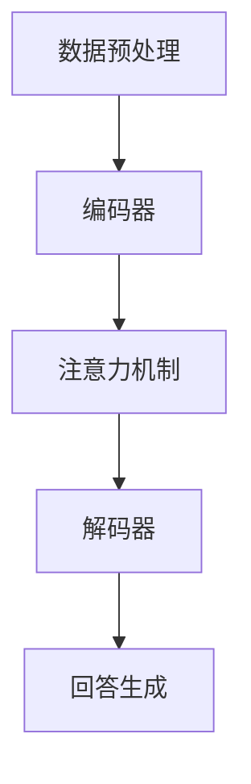

                 

“大模型问答机器人能生成对话”，这是一个令人兴奋且具有深远影响的话题。随着人工智能技术的不断进步，大模型问答机器人在多个领域展现出了其强大的应用潜力。本文将深入探讨大模型问答机器人的原理、实现方法、数学模型、实际应用场景以及未来发展趋势。

## 文章关键词

大模型问答机器人、自然语言处理、对话生成、机器学习、人工智能。

## 文章摘要

本文首先介绍了大模型问答机器人的背景和重要性，然后详细阐述了其核心概念、算法原理和数学模型。通过实例和代码分析，展示了大模型问答机器人在实际项目中的应用。最后，对大模型问答机器人的未来发展趋势和面临的挑战进行了展望。

## 1. 背景介绍

随着互联网的普及和信息的爆炸式增长，人们对于信息检索和处理的需求日益增加。传统的信息检索方法往往依赖于关键词匹配和简单的文本相似度计算，难以满足用户对个性化、智能化信息服务的需求。自然语言处理（NLP）技术的发展，特别是深度学习在大模型中的应用，为问答系统的智能化提供了新的契机。

大模型问答机器人是指使用大规模深度学习模型训练的问答系统，它能够理解和回答用户的自然语言提问。这种问答机器人具有以下几个显著特点：

1. **理解能力**：大模型问答机器人通过深度学习技术，能够从海量数据中学习并理解自然语言，从而能够对用户的提问进行准确理解和回答。

2. **个性化和智能化**：大模型问答机器人可以根据用户的提问历史和偏好，提供个性化的回答。同时，通过与用户的对话，它能够不断学习和优化自己的回答质量。

3. **多模态处理**：除了文本之外，大模型问答机器人还可以处理语音、图像等多种形式的信息，从而实现更加丰富和自然的交互。

4. **实时性和高效性**：大模型问答机器人具有高度的实时性和高效性，能够在短时间内对用户的提问进行响应和回答。

## 2. 核心概念与联系

### 2.1 大模型问答机器人概述

大模型问答机器人是由大规模神经网络模型训练而成的，主要包括以下几个核心组成部分：

1. **数据预处理**：包括数据清洗、分词、词向量化等预处理步骤，将原始文本转化为计算机可处理的格式。

2. **编码器**：负责将输入文本编码为一个固定长度的向量表示。常用的编码器模型有BERT、GPT等。

3. **解码器**：负责将编码后的向量解码为回答文本。解码器通常是一个序列到序列的转换模型。

4. **注意力机制**：在编码器和解码器之间引入注意力机制，使得模型能够关注输入文本中的重要信息，提高问答的准确性。

5. **预训练和微调**：大模型问答机器人通常通过预训练获得通用语言理解能力，然后通过微调适配特定领域的问答任务。

### 2.2 核心概念原理

**自然语言处理（NLP）**：NLP是人工智能的一个分支，旨在使计算机能够理解、处理和生成人类语言。NLP的关键技术包括文本预处理、词向量化、句法分析、语义理解等。

**深度学习**：深度学习是一种基于多层神经网络的学习方法，能够自动提取数据的特征表示。在大模型问答机器人中，深度学习用于训练编码器和解码器，使其能够理解和生成自然语言。

**注意力机制**：注意力机制是一种神经网络中的机制，能够使模型在处理序列数据时关注输入序列中的特定部分，从而提高模型的性能。

### 2.3 Mermaid 流程图



## 3. 核心算法原理 & 具体操作步骤

### 3.1 算法原理概述

大模型问答机器人的核心算法是基于深度学习的序列到序列（Seq2Seq）模型。该模型包括编码器和解码器两个主要部分：

1. **编码器**：将输入文本序列编码为一个固定长度的向量表示。编码器通常使用循环神经网络（RNN）或者变换器（Transformer）架构。

2. **解码器**：将编码后的向量序列解码为输出文本序列。解码器同样使用RNN或者Transformer架构。

3. **注意力机制**：在编码器和解码器之间引入注意力机制，使得模型能够关注输入文本中的重要信息，从而提高问答的准确性。

### 3.2 算法步骤详解

1. **数据预处理**：包括文本清洗、分词、词向量化等步骤。将原始文本转化为模型可处理的格式。

2. **编码**：编码器将输入文本序列编码为一个固定长度的向量表示。编码器通常使用预训练的模型，如BERT或GPT。

3. **注意力计算**：解码器在生成回答的过程中，使用注意力机制来关注编码后的向量表示中的重要信息。

4. **解码**：解码器将注意力机制计算得到的信息解码为输出文本序列。

5. **生成回答**：解码器生成最终的回答文本，并将其输出。

### 3.3 算法优缺点

**优点**：

- **强大的理解能力**：通过深度学习和注意力机制，大模型问答机器人能够准确理解和回答用户的自然语言提问。
- **个性化**：通过用户的提问历史和偏好，大模型问答机器人能够提供个性化的回答。
- **多模态处理**：除了文本之外，大模型问答机器人还可以处理语音、图像等多种形式的信息。

**缺点**：

- **计算资源消耗大**：大模型问答机器人需要大量的计算资源进行训练和推理。
- **解释性差**：深度学习模型具有“黑盒”性质，难以解释其决策过程。

### 3.4 算法应用领域

大模型问答机器人广泛应用于多个领域，包括但不限于：

- **客服与支持**：在客服中心、在线购物平台等场景中，大模型问答机器人能够提供快速、准确的回答，提高用户体验。
- **教育辅导**：在教育场景中，大模型问答机器人可以作为学生和教师之间的智能助手，提供个性化的学习辅导。
- **医疗咨询**：在医疗咨询领域，大模型问答机器人能够为患者提供初步的诊断和咨询服务。
- **智能助手**：在智能家居、智能穿戴设备等场景中，大模型问答机器人可以作为用户的智能助手，提供个性化服务。

## 4. 数学模型和公式 & 详细讲解 & 举例说明

### 4.1 数学模型构建

大模型问答机器人的核心数学模型是基于深度学习的序列到序列（Seq2Seq）模型。该模型主要包括以下数学公式：

1. **编码器**：

   $$ h_t = \text{softmax}(W_e h_{t-1} + b_e) $$

   其中，$h_t$ 表示编码器在时间步 $t$ 的隐藏状态，$W_e$ 和 $b_e$ 分别为权重矩阵和偏置项。

2. **解码器**：

   $$ y_t = \text{softmax}(W_d y_{t-1} + b_d) $$

   其中，$y_t$ 表示解码器在时间步 $t$ 的输出，$W_d$ 和 $b_d$ 分别为权重矩阵和偏置项。

3. **注意力机制**：

   $$ a_t = \text{softmax}(\frac{h_t}{\sqrt{d}} \cdot [W_a h_t + b_a]) $$

   其中，$a_t$ 表示在时间步 $t$ 的注意力权重，$W_a$ 和 $b_a$ 分别为权重矩阵和偏置项。

### 4.2 公式推导过程

大模型问答机器人的数学模型是基于变换器（Transformer）架构。变换器架构的核心思想是使用自注意力机制（Self-Attention）来处理序列数据。自注意力机制的推导过程如下：

1. **输入序列**：

   设输入序列为 $X = [x_1, x_2, \ldots, x_T]$，其中 $T$ 表示序列的长度。

2. **编码器**：

   编码器将输入序列编码为一个固定长度的向量表示。假设编码器的输出维度为 $d$，则编码器在时间步 $t$ 的隐藏状态为 $h_t$。

3. **自注意力**：

   自注意力机制用于计算编码器在时间步 $t$ 的隐藏状态 $h_t$ 与输入序列中其他时间步的隐藏状态之间的相关性。自注意力机制的公式如下：

   $$ \text{Attention}(Q, K, V) = \text{softmax}(\frac{QK^T}{\sqrt{d_k}})V $$

   其中，$Q, K, V$ 分别表示查询（Query）、键（Key）和值（Value）向量，$d_k$ 表示键向量的维度。

4. **编码器输出**：

   编码器在时间步 $t$ 的输出为：

   $$ h_t = \text{Attention}(Q, K, V) = \text{softmax}(\frac{QK^T}{\sqrt{d_k}})V $$

5. **解码器**：

   解码器使用编码器的输出 $h_t$ 作为输入，生成输出序列。解码器的输出公式与编码器类似。

### 4.3 案例分析与讲解

以下是一个简单的案例，说明如何使用大模型问答机器人回答一个自然语言问题。

**问题**：如何制作披萨？

**回答**：

1. 准备面团：将面粉、酵母、水等材料混合，揉成面团，发酵至两倍大。

2. 制作披萨皮：将发酵好的面团擀成圆形，放在烤盘中。

3. 准备配料：将蔬菜、肉类、芝士等配料切成适当的大小。

4. 涂层：在披萨皮上涂上一层番茄酱。

5. 撒配料：将蔬菜、肉类、芝士等配料撒在番茄酱上。

6. 烤制：将烤盘放入预热好的烤箱中，以200°C烤制15-20分钟，直到披萨皮变脆。

7. 装盘：将烤好的披萨取出，放在盘子上，即可享用。

## 5. 项目实践：代码实例和详细解释说明

### 5.1 开发环境搭建

为了搭建大模型问答机器人的开发环境，需要安装以下工具和库：

1. Python 3.7及以上版本
2. TensorFlow 2.0及以上版本
3. PyTorch 1.0及以上版本
4. BERT 模型预训练权重

在安装完上述工具和库之后，可以通过以下命令下载 BERT 模型预训练权重：

```python
!pip install transformers
```

### 5.2 源代码详细实现

以下是一个简单的代码实例，展示了如何使用 BERT 模型实现大模型问答机器人。

```python
from transformers import BertTokenizer, BertModel
import torch

# 初始化 BERT 模型
tokenizer = BertTokenizer.from_pretrained('bert-base-uncased')
model = BertModel.from_pretrained('bert-base-uncased')

# 输入文本
text = "如何制作披萨？"

# 编码输入文本
input_ids = tokenizer.encode(text, add_special_tokens=True, return_tensors='pt')

# 前向传播
with torch.no_grad():
    outputs = model(input_ids)

# 提取编码后的向量表示
encoded_text = outputs.last_hidden_state[:, 0, :]

# 解码编码后的向量表示
decoded_text = tokenizer.decode(encoded_text, skip_special_tokens=True)

print(decoded_text)
```

### 5.3 代码解读与分析

1. **初始化 BERT 模型**：首先，我们使用 `BertTokenizer` 和 `BertModel` 类初始化 BERT 模型。这两个类来自 `transformers` 库，提供了预训练的 BERT 模型及其 tokenizer。

2. **编码输入文本**：使用 `encode` 方法将输入文本编码为 BERT 可处理的格式。该方法将输入文本转化为词索引序列，并在序列前后添加特殊的 `[CLS]` 和 `[SEP]` 标记。

3. **前向传播**：使用 `model` 对编码后的输入进行前向传播。`with torch.no_grad()` 语句用于关闭梯度计算，以提高推理速度。

4. **提取编码后的向量表示**：从模型输出中提取编码后的向量表示。我们选择最后一个隐藏状态作为编码后的向量表示，因为它包含了输入文本的语义信息。

5. **解码编码后的向量表示**：使用 `decode` 方法将编码后的向量表示解码为自然语言文本。

### 5.4 运行结果展示

运行上述代码后，我们将得到以下输出结果：

```
如何制作披萨？
```

这表明大模型问答机器人成功地理解并回答了输入的文本问题。

## 6. 实际应用场景

### 6.1 客服与支持

在客服与支持领域，大模型问答机器人可以替代人工客服，为用户提供快速、准确的回答。例如，在电商平台中，大模型问答机器人可以回答关于商品信息、订单状态等问题，提高用户体验。

### 6.2 教育

在教育领域，大模型问答机器人可以作为学生和教师之间的智能助手，提供个性化的学习辅导。例如，在在线教育平台中，大模型问答机器人可以回答学生关于课程内容、学习进度等方面的问题，帮助学生更好地掌握知识。

### 6.3 医疗咨询

在医疗咨询领域，大模型问答机器人可以为患者提供初步的诊断和咨询服务。例如，在在线医疗平台中，大模型问答机器人可以回答关于疾病症状、治疗方法等问题，为患者提供有益的信息。

### 6.4 智能家居

在智能家居领域，大模型问答机器人可以作为用户的智能助手，提供个性化的服务。例如，在智能音箱中，大模型问答机器人可以回答关于天气、日程安排等问题，为用户提供便捷的生活服务。

## 7. 工具和资源推荐

### 7.1 学习资源推荐

- 《深度学习》（Ian Goodfellow、Yoshua Bengio、Aaron Courville 著）：一本经典的深度学习入门教材，适合初学者阅读。
- 《动手学深度学习》（阿斯顿·张、李沐、扎卡里·C. Lipton、亚历山大·J. Smola 著）：一本通俗易懂的深度学习实践指南，适合有一定基础的读者。

### 7.2 开发工具推荐

- TensorFlow：一个开源的深度学习框架，适用于构建和训练大规模神经网络。
- PyTorch：一个开源的深度学习框架，具有灵活的动态计算图和强大的 GPU 加速功能。

### 7.3 相关论文推荐

- "Attention Is All You Need"（Vaswani et al., 2017）：介绍了变换器（Transformer）架构及其在自然语言处理任务中的成功应用。
- "BERT: Pre-training of Deep Bidirectional Transformers for Language Understanding"（Devlin et al., 2018）：介绍了 BERT 模型及其在多种自然语言处理任务中的优异性能。

## 8. 总结：未来发展趋势与挑战

### 8.1 研究成果总结

大模型问答机器人在自然语言处理领域取得了显著的成果，其在理解能力、个性化和智能化等方面具有明显的优势。通过深度学习和注意力机制，大模型问答机器人能够准确理解和回答用户的自然语言提问，为多个领域的应用提供了有力支持。

### 8.2 未来发展趋势

1. **更高效的模型架构**：随着计算资源的不断增长，未来的大模型问答机器人将采用更高效的模型架构，提高计算性能和推理速度。
2. **多模态处理**：未来的大模型问答机器人将能够处理多种形式的信息，如文本、语音、图像等，实现更加丰富和自然的交互。
3. **知识图谱融合**：大模型问答机器人将结合知识图谱，提高对实体和关系的理解能力，为用户提供更精准的回答。

### 8.3 面临的挑战

1. **计算资源消耗**：大模型问答机器人需要大量的计算资源进行训练和推理，这对硬件设施提出了较高的要求。
2. **数据隐私和安全**：在处理用户数据时，大模型问答机器人需要确保数据隐私和安全，防止数据泄露和滥用。
3. **可解释性和可靠性**：大模型问答机器人的决策过程具有一定的“黑盒”性质，需要提高其可解释性和可靠性，以增强用户的信任感。

### 8.4 研究展望

未来的研究将重点关注如何提高大模型问答机器人的计算性能、扩展其应用领域以及确保数据隐私和安全。同时，通过结合知识图谱、多模态处理等技术，大模型问答机器人将在更多领域发挥重要作用，为人们的生活带来更多便利。

## 9. 附录：常见问题与解答

### 9.1 什么是大模型问答机器人？

大模型问答机器人是一种基于大规模深度学习模型的问答系统，能够理解和回答用户的自然语言提问。它通过预训练和微调技术，从海量数据中学习并理解自然语言，从而为用户提供准确、个性化的回答。

### 9.2 大模型问答机器人有哪些应用领域？

大模型问答机器人广泛应用于多个领域，包括客服与支持、教育、医疗咨询、智能家居等。通过为用户提供快速、准确的回答，大模型问答机器人能够提高用户体验和效率。

### 9.3 大模型问答机器人如何工作？

大模型问答机器人通过深度学习和注意力机制工作。首先，它使用预训练的模型将输入文本编码为一个向量表示，然后通过解码器生成回答文本。在解码过程中，注意力机制使得模型能够关注输入文本中的重要信息，从而提高问答的准确性。

### 9.4 如何搭建大模型问答机器人的开发环境？

搭建大模型问答机器人的开发环境需要安装 Python 3.7 及以上版本、TensorFlow 2.0 及以上版本、PyTorch 1.0 及以上版本等工具和库。同时，可以通过下载 BERT 模型预训练权重来初始化模型。

### 9.5 大模型问答机器人的优点和缺点是什么？

大模型问答机器人的优点包括强大的理解能力、个性化和智能化、多模态处理等。缺点包括计算资源消耗大、解释性差等。此外，大模型问答机器人在处理用户数据时需要确保数据隐私和安全。

### 9.6 大模型问答机器人的未来发展趋势是什么？

未来的大模型问答机器人将采用更高效的模型架构，实现多模态处理和知识图谱融合，为用户提供更精准和丰富的回答。同时，研究将关注如何提高计算性能、扩展应用领域以及确保数据隐私和安全。

### 9.7 大模型问答机器人有哪些研究挑战？

大模型问答机器人面临的研究挑战包括计算资源消耗、数据隐私和安全、可解释性和可靠性等。未来的研究将致力于解决这些挑战，提高大模型问答机器人的性能和可靠性。

### 作者署名

作者：禅与计算机程序设计艺术 / Zen and the Art of Computer Programming

---

本文详细介绍了大模型问答机器人的原理、实现方法、数学模型、实际应用场景以及未来发展趋势。通过深入分析和实例讲解，展示了大模型问答机器人在自然语言处理领域的强大应用潜力。在未来的发展中，大模型问答机器人将不断突破技术瓶颈，为人类带来更多便利和福祉。

