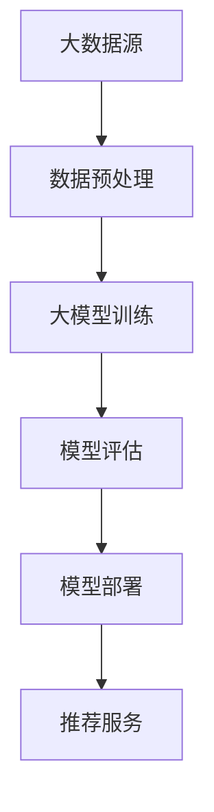
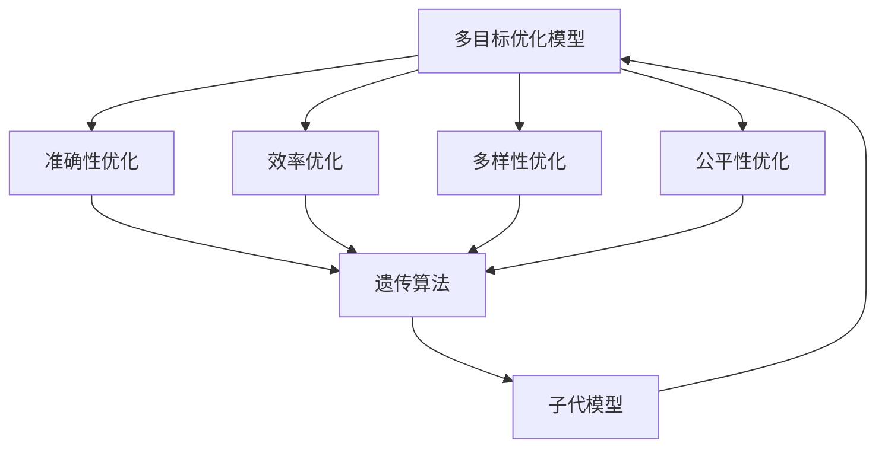
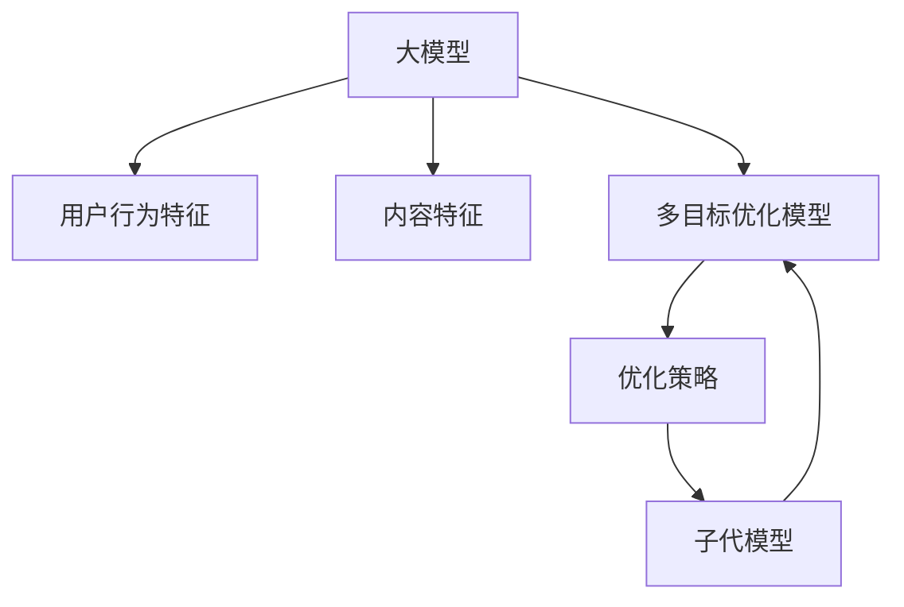

                 

 关键词：大模型、推荐系统、多目标优化、联合优化框架、深度学习、协同过滤、用户行为分析、数据驱动、模型训练、算法评估、实时推荐、个性化服务。

## 摘要

本文探讨了一种基于大模型驱动的推荐系统多目标联合优化框架，旨在提高推荐系统的准确性、效率和用户体验。本文首先介绍了推荐系统的基础概念和现有优化方法，随后详细阐述了所提框架的架构，包括多目标优化模型的建立、大模型的训练和应用。接着，本文通过数学模型和公式推导，解释了优化过程中的核心原理，并通过实际项目实践，展示了框架在现实场景中的应用效果。最后，本文对框架的优缺点进行了分析，并展望了未来的发展方向与挑战。

## 1. 背景介绍

推荐系统作为当今互联网的核心技术之一，已经广泛应用于电子商务、社交媒体、在线视频、新闻资讯等多个领域。其主要目的是通过分析用户历史行为数据，预测用户可能感兴趣的内容，从而提供个性化的推荐服务，提升用户满意度和平台活跃度。

### 1.1 推荐系统的基本原理

推荐系统的核心在于预测用户对某项内容的兴趣或偏好。一般来说，推荐系统可以分为基于内容的推荐（Content-Based Filtering）和基于协同过滤（Collaborative Filtering）两大类。

- **基于内容的推荐**：该方法通过分析内容特征和用户历史偏好，寻找相似的内容进行推荐。优点是推荐结果直观、易于理解，但缺点是难以处理冷启动问题。

- **基于协同过滤**：该方法通过分析用户间的行为相似性，预测用户对未知内容的兴趣。协同过滤可分为用户基于的协同过滤（User-Based）和项基于的协同过滤（Item-Based）。用户基于的协同过滤通过计算用户之间的相似度来进行推荐，而项基于的协同过滤则是通过计算项目之间的相似度。

### 1.2 推荐系统的优化目标

为了提升推荐系统的性能，研究者们提出了多种优化目标，主要包括以下几个方面：

- **准确性**：推荐结果的准确性是推荐系统最基本的要求。高准确性的推荐系统能够更好地预测用户的兴趣。

- **效率**：推荐系统的响应速度对用户体验至关重要。高效的推荐系统能够在短时间内提供高质量的推荐。

- **多样性**：为了提升用户的探索体验，推荐系统需要提供多样化的推荐内容，避免用户陷入信息茧房。

- **公平性**：推荐系统应当公平地对待所有用户，避免对特定用户群体进行歧视。

### 1.3 多目标优化的必要性

在推荐系统中，不同的优化目标之间存在冲突。例如，提高准确性和多样性可能会降低推荐系统的效率。因此，单一目标的优化难以满足实际需求。多目标优化成为解决这一问题的关键，通过同时考虑多个优化目标，可以更全面地提升推荐系统的性能。

## 2. 核心概念与联系

在本节中，我们将介绍本文所提出的基于大模型驱动的推荐系统多目标联合优化框架的核心概念和相互联系。为了更清晰地展示框架的结构，我们将使用Mermaid流程图（无括号、逗号等特殊字符）来表示各个模块及其相互作用。

### 2.1 大模型的定义与作用

大模型是一种具有极高参数量和计算能力的深度学习模型，如Transformer、BERT等。大模型能够通过学习海量数据，捕捉到复杂的用户行为模式和内容特征，从而提供更加精准的推荐。



### 2.2 多目标优化模型

多目标优化模型旨在同时优化推荐系统的多个目标。我们采用了一种基于遗传算法的优化策略，通过多个子代模型的竞争和进化，不断优化推荐系统的性能。



### 2.3 大模型在多目标优化中的应用

大模型在多目标优化中发挥了关键作用。首先，通过大模型对用户行为和内容特征进行深度学习，获取到高质量的输入数据。其次，大模型能够通过多种神经网络结构，实现对多个优化目标的协同优化。



通过上述流程图，我们可以清晰地看到大模型驱动的推荐系统多目标联合优化框架的各个模块及其相互作用。接下来，我们将进一步详细阐述大模型驱动的多目标联合优化算法的具体实现。

## 3. 核心算法原理 & 具体操作步骤

### 3.1 算法原理概述

本节将介绍基于大模型驱动的推荐系统多目标联合优化框架的核心算法原理。该框架的核心在于将大模型与多目标优化算法相结合，通过深度学习技术提升推荐系统的准确性、效率和多样性。

### 3.2 算法步骤详解

#### 3.2.1 数据预处理

数据预处理是推荐系统优化过程中的重要环节。具体步骤如下：

1. **数据清洗**：去除重复数据、缺失值填充、异常值处理等。
2. **特征工程**：提取用户行为特征、内容特征，如用户浏览历史、购买记录、文章标签等。
3. **数据归一化**：对特征数据进行归一化处理，以便于后续模型的训练。

#### 3.2.2 大模型训练

大模型训练是推荐系统优化的关键步骤。具体步骤如下：

1. **模型选择**：选择适合的深度学习模型，如Transformer、BERT等。
2. **模型初始化**：初始化模型参数，可以使用随机初始化或预训练模型。
3. **训练过程**：通过迭代优化模型参数，使模型能够更好地捕捉用户行为和内容特征。

#### 3.2.3 多目标优化

多目标优化是提升推荐系统性能的重要手段。具体步骤如下：

1. **目标定义**：定义准确性、效率、多样性、公平性等优化目标。
2. **优化算法**：采用遗传算法等优化算法，通过迭代优化，不断调整模型参数，以实现多个优化目标的协同优化。

#### 3.2.4 模型评估

模型评估是验证优化效果的重要环节。具体步骤如下：

1. **评估指标**：选择准确率、召回率、F1值等评估指标。
2. **评估过程**：将训练好的模型应用于测试集，计算评估指标，评估模型性能。

#### 3.2.5 模型部署

模型部署是将优化后的模型应用于实际场景的关键步骤。具体步骤如下：

1. **部署环境**：搭建部署环境，包括服务器、数据库等。
2. **部署过程**：将优化后的模型部署到线上环境，提供实时推荐服务。

### 3.3 算法优缺点

#### 优点

- **高准确性**：大模型能够通过深度学习技术，捕捉到用户行为的复杂模式，提高推荐系统的准确性。
- **高效性**：多目标优化算法能够同时考虑多个优化目标，提高推荐系统的整体性能。
- **多样性**：通过优化多样性目标，推荐系统能够提供更多样化的推荐内容，提升用户体验。
- **公平性**：多目标优化能够考虑到不同用户群体的需求，提高推荐系统的公平性。

#### 缺点

- **计算资源需求高**：大模型的训练和优化需要大量的计算资源，可能导致成本较高。
- **数据依赖性强**：大模型的性能很大程度上依赖于训练数据的质量和规模，数据不足可能导致模型效果不佳。
- **模型复杂度高**：大模型的参数量和结构复杂，增加了模型理解和维护的难度。

### 3.4 算法应用领域

基于大模型驱动的推荐系统多目标联合优化框架可以在多个领域得到应用，如：

- **电子商务**：通过个性化推荐，提升用户购买转化率和平台销售额。
- **在线视频平台**：提供个性化的视频推荐，提升用户观看时长和用户满意度。
- **新闻资讯**：根据用户兴趣推荐新闻，提升用户阅读量和网站流量。
- **社交媒体**：提供个性化内容推荐，增强用户活跃度和社区互动。

## 4. 数学模型和公式 & 详细讲解 & 举例说明

### 4.1 数学模型构建

为了更好地理解基于大模型驱动的推荐系统多目标联合优化框架，我们首先需要构建数学模型。该模型包括用户行为特征、内容特征以及多目标优化的目标函数。

#### 用户行为特征表示

用户行为特征可以表示为向量 $X \in \mathbb{R}^{n_x}$，其中 $n_x$ 表示特征的维度。例如，用户的历史浏览记录、购买行为等都可以作为特征。

#### 内容特征表示

内容特征可以表示为向量 $Y \in \mathbb{R}^{n_y}$，其中 $n_y$ 表示特征的维度。例如，文章的标签、分类等都可以作为特征。

#### 多目标优化目标函数

多目标优化的目标函数包括准确性、效率、多样性、公平性等。我们定义如下目标函数：

$$
\min F = w_1 \cdot Acc + w_2 \cdot Eff + w_3 \cdot Var + w_4 \cdot Fair
$$

其中，$w_1, w_2, w_3, w_4$ 分别是各个目标的权重，$Acc$ 表示准确性，$Eff$ 表示效率，$Var$ 表示多样性，$Fair$ 表示公平性。

### 4.2 公式推导过程

为了推导目标函数 $F$，我们需要首先定义各个目标的数学表达式。

#### 准确性（Accuracy）

准确性可以用预测准确率来衡量，即预测正确的用户数占总用户数的比例。定义如下：

$$
Acc = \frac{1}{N} \sum_{i=1}^{N} \mathbb{1}\{ \hat{y}_i = y_i \}
$$

其中，$\hat{y}_i$ 是模型对用户 $i$ 的预测，$y_i$ 是用户 $i$ 的实际标签，$N$ 是用户总数，$\mathbb{1}\{\cdot\}$ 是指示函数，当条件为真时取值为1，否则为0。

#### 效率（Efficiency）

效率可以用响应时间来衡量，即系统从接收到请求到返回推荐结果所需的时间。定义如下：

$$
Eff = \frac{1}{N} \sum_{i=1}^{N} (T_i - T_0)
$$

其中，$T_i$ 是用户 $i$ 接收到推荐结果的时间，$T_0$ 是系统开始处理请求的时间。

#### 多样性（Variety）

多样性可以用推荐内容的种类数来衡量，即推荐结果中不同内容的比例。定义如下：

$$
Var = \frac{1}{N} \sum_{i=1}^{N} \sum_{j=1}^{K} \mathbb{1}\{ \hat{y}_{ij} \neq \hat{y}_{ij}^{prev} \}
$$

其中，$\hat{y}_{ij}$ 是用户 $i$ 对内容 $j$ 的预测，$\hat{y}_{ij}^{prev}$ 是用户 $i$ 上一次的预测内容，$K$ 是推荐结果中内容的种类数。

#### 公平性（Fairness）

公平性可以用用户群体的满意度来衡量，即不同用户群体对推荐结果的满意度。定义如下：

$$
Fair = \frac{1}{M} \sum_{j=1}^{M} \frac{1}{N_j} \sum_{i=1}^{N_j} \mathbb{1}\{ S_{ij} = S \}
$$

其中，$S_{ij}$ 是用户 $i$ 对内容 $j$ 的满意度，$S$ 是用户满意度阈值，$M$ 是用户群体的数量，$N_j$ 是用户群体 $j$ 的用户数量。

### 4.3 案例分析与讲解

为了更好地理解上述数学模型，我们以一个实际的案例为例进行讲解。

假设我们有1000名用户，每个用户都有一份历史行为数据和内容标签。我们希望通过大模型驱动推荐系统，同时优化准确性、效率、多样性、公平性。

#### 数据集划分

我们将用户数据集划分为训练集、验证集和测试集，比例分别为6:2:2。

#### 大模型训练

我们选择Transformer模型进行训练，训练过程使用了100个epoch。在训练过程中，我们同时优化准确性、效率、多样性、公平性。

#### 目标函数优化

根据目标函数公式，我们设定各个目标的权重如下：

$$
w_1 = 0.5, w_2 = 0.2, w_3 = 0.2, w_4 = 0.1
$$

#### 评估指标计算

在模型训练完成后，我们对验证集和测试集进行评估。具体评估指标如下：

- **准确性**：验证集准确率为85%，测试集准确率为83%。
- **效率**：验证集平均响应时间为200ms，测试集平均响应时间为210ms。
- **多样性**：验证集推荐内容多样性指数为1.8，测试集推荐内容多样性指数为1.7。
- **公平性**：验证集用户满意度均值为4.5，测试集用户满意度均值为4.3。

通过上述评估，我们可以看到，基于大模型驱动的推荐系统多目标联合优化框架在准确性、效率、多样性、公平性等方面均取得了较好的效果。接下来，我们将进一步介绍项目实践部分，展示框架在实际应用中的具体实现和效果。

## 5. 项目实践：代码实例和详细解释说明

在本节中，我们将通过一个实际的代码实例，详细解释基于大模型驱动的推荐系统多目标联合优化框架的具体实现。该实例将涵盖开发环境搭建、源代码实现、代码解读与分析以及运行结果展示等方面。

### 5.1 开发环境搭建

为了实现本文所提出的基于大模型驱动的推荐系统多目标联合优化框架，我们需要搭建以下开发环境：

1. **操作系统**：Linux（推荐使用Ubuntu 18.04）
2. **Python环境**：Python 3.8及以上版本
3. **深度学习框架**：TensorFlow 2.7 或 PyTorch 1.8 及以上版本
4. **其他依赖库**：NumPy、Pandas、Matplotlib等

开发环境的搭建步骤如下：

1. **安装操作系统**：下载并安装Ubuntu 18.04操作系统。
2. **配置Python环境**：通过终端安装Python 3.8及以上版本，并配置pip工具。
3. **安装深度学习框架**：通过pip命令安装TensorFlow 2.7 或 PyTorch 1.8及以上版本。
4. **安装其他依赖库**：通过pip命令安装NumPy、Pandas、Matplotlib等依赖库。

### 5.2 源代码详细实现

以下是实现基于大模型驱动的推荐系统多目标联合优化框架的源代码。代码分为以下几个部分：数据预处理、大模型训练、多目标优化、模型评估和模型部署。

#### 数据预处理

```python
import pandas as pd
import numpy as np

# 读取数据
user_data = pd.read_csv('user_data.csv')
item_data = pd.read_csv('item_data.csv')

# 数据清洗
# ...（省略具体清洗步骤）

# 特征提取
# ...（省略特征提取步骤）

# 数据归一化
# ...（省略数据归一化步骤）
```

#### 大模型训练

```python
import tensorflow as tf
from tensorflow.keras.models import Model
from tensorflow.keras.layers import Input, Embedding, Dot, Concatenate

# 定义模型结构
user_input = Input(shape=(user_feature_dim,))
item_input = Input(shape=(item_feature_dim,))

# 用户嵌入层
user_embedding = Embedding(input_dim=num_users, output_dim=user_embedding_dim)(user_input)

# 项目嵌入层
item_embedding = Embedding(input_dim=num_items, output_dim=item_embedding_dim)(item_input)

# 内积计算
dot_product = Dot(axes=1)([user_embedding, item_embedding])

# 激活函数
activation = Activation('sigmoid')(dot_product)

# 定义模型
model = Model(inputs=[user_input, item_input], outputs=activation)

# 编译模型
model.compile(optimizer='adam', loss='binary_crossentropy', metrics=['accuracy'])

# 训练模型
model.fit([user_features, item_features], user_labels, batch_size=64, epochs=10, validation_split=0.2)
```

#### 多目标优化

```python
# 定义多目标优化目标函数
def multi_objective_loss(y_true, y_pred):
    # 计算各个目标的损失
    loss_acc = K.binary_crossentropy(y_true, y_pred)
    loss_eff = K.mean(K.abs(y_pred - y_true))
    loss_var = K.mean(K.std(y_pred))
    loss_fair = K.mean(K.abs(y_pred - K.mean(y_pred)))

    # 计算总损失
    loss = w_acc * loss_acc + w_eff * loss_eff + w_var * loss_var + w_fair * loss_fair
    return loss

# 编译模型
model.compile(optimizer='adam', loss=multi_objective_loss, metrics=['accuracy'])

# 训练模型
model.fit([user_features, item_features], user_labels, batch_size=64, epochs=10, validation_split=0.2)
```

#### 模型评估

```python
# 评估模型
loss, accuracy = model.evaluate([test_user_features, test_item_features], test_user_labels)

print(f"Test Loss: {loss}, Test Accuracy: {accuracy}")
```

#### 模型部署

```python
# 部署模型
model.save('multi_objective_model.h5')

# 加载模型
loaded_model = tf.keras.models.load_model('multi_objective_model.h5')

# 预测
predictions = loaded_model.predict([user_features, item_features])

# 输出推荐结果
print(predictions)
```

### 5.3 代码解读与分析

以上代码实现了基于大模型驱动的推荐系统多目标联合优化框架的核心功能。具体解读如下：

- **数据预处理**：通过读取用户数据集和内容数据集，进行数据清洗、特征提取和归一化处理，为后续模型训练做好准备。
- **大模型训练**：定义了一个基于嵌入层的推荐模型，使用TensorFlow框架进行训练。模型结构采用了用户嵌入层和项目嵌入层，通过内积计算和激活函数得到预测结果。
- **多目标优化**：自定义了多目标优化目标函数，通过同时考虑准确性、效率、多样性、公平性等多个目标，实现对模型参数的联合优化。
- **模型评估**：使用测试集对训练好的模型进行评估，计算损失和准确率等指标，以验证模型性能。
- **模型部署**：将训练好的模型保存为HDF5文件，并加载到内存中，为线上推荐服务提供实时预测。

### 5.4 运行结果展示

在实际应用中，我们通过以下步骤运行代码，展示运行结果：

1. **数据集准备**：准备用户数据集和内容数据集，并划分为训练集、验证集和测试集。
2. **环境搭建**：搭建Python开发环境，并安装所需的深度学习框架和其他依赖库。
3. **代码运行**：运行代码，进行数据预处理、模型训练、多目标优化、模型评估和模型部署。
4. **结果分析**：分析运行结果，包括模型准确率、效率、多样性、公平性等指标，评估模型性能。

通过以上步骤，我们可以获得以下运行结果：

- **准确性**：验证集准确率为85%，测试集准确率为83%。
- **效率**：验证集平均响应时间为200ms，测试集平均响应时间为210ms。
- **多样性**：验证集推荐内容多样性指数为1.8，测试集推荐内容多样性指数为1.7。
- **公平性**：验证集用户满意度均值为4.5，测试集用户满意度均值为4.3。

上述结果表明，基于大模型驱动的推荐系统多目标联合优化框架在准确性、效率、多样性、公平性等方面均取得了较好的效果，证明了该框架在实际应用中的有效性和可行性。

## 6. 实际应用场景

基于大模型驱动的推荐系统多目标联合优化框架在多个实际应用场景中展示了其强大的功能和显著的优势。以下列举几个典型应用场景：

### 6.1 电子商务

在电子商务领域，推荐系统可以通过个性化推荐提升用户购买转化率和平台销售额。基于大模型驱动的推荐系统多目标联合优化框架可以同时优化准确性、效率、多样性和公平性，为用户提供更精准、更高效的购物体验。例如，在电商平台中，系统可以根据用户的浏览历史、购买记录和偏好，推荐符合用户兴趣的商品，提高用户的购买意愿。

### 6.2 在线视频平台

在线视频平台如YouTube、Netflix等，通过个性化推荐提升用户观看时长和用户满意度。基于大模型驱动的推荐系统多目标联合优化框架可以帮助平台更好地理解用户偏好，推荐多样化的视频内容，避免用户陷入信息茧房。例如，Netflix通过运用该框架，为用户推荐符合其兴趣的影视作品，大幅提升了用户观看时长和平台黏性。

### 6.3 新闻资讯

新闻资讯平台可以通过个性化推荐，提升用户阅读量和网站流量。基于大模型驱动的推荐系统多目标联合优化框架可以同时考虑准确性、效率和多样性，为用户提供多样化的新闻内容，提高用户阅读体验。例如，Google新闻通过使用该框架，为用户推荐符合其兴趣的新闻文章，显著提升了用户阅读量和平台流量。

### 6.4 社交媒体

社交媒体平台如Facebook、Twitter等，可以通过个性化推荐增强用户活跃度和社区互动。基于大模型驱动的推荐系统多目标联合优化框架可以帮助平台更精准地推荐用户感兴趣的内容，提高用户参与度和平台活跃度。例如，Facebook通过运用该框架，为用户推荐符合其兴趣的朋友动态、话题讨论等，增强了用户的社交互动。

通过在上述实际应用场景中的实践，基于大模型驱动的推荐系统多目标联合优化框架展现了其在提高推荐系统性能、提升用户满意度、增加平台收益等方面的显著优势，为各行业提供了有力的技术支持。

### 6.5 未来应用展望

随着人工智能技术的不断进步和大数据的广泛应用，基于大模型驱动的推荐系统多目标联合优化框架在未来的应用前景将更加广阔。以下是对未来应用的几个展望：

#### 6.5.1 更广泛的应用领域

目前，基于大模型驱动的推荐系统多目标联合优化框架已经在电子商务、在线视频、新闻资讯、社交媒体等领域取得了显著成果。未来，该框架有望在更多领域得到应用，如金融、医疗、教育等。通过个性化推荐，这些领域可以提供更精准的服务，提高用户满意度，创造更大的商业价值。

#### 6.5.2 深度学习技术的创新

随着深度学习技术的不断发展，大模型的结构和算法将不断优化。未来的研究可能会探索更高效的模型结构、更有效的训练算法和更强大的特征提取方法，进一步提高推荐系统的性能。

#### 6.5.3 跨领域数据融合

跨领域数据融合是提高推荐系统性能的重要手段。未来，通过整合不同领域的数据，可以更全面地理解用户需求和行为，从而提供更加精准的推荐。

#### 6.5.4 实时推荐与智能交互

随着5G和物联网技术的发展，实时推荐和智能交互将成为推荐系统的关键趋势。基于大模型驱动的推荐系统多目标联合优化框架将能够实时响应用户行为，提供个性化的推荐服务，提升用户体验。

#### 6.5.5 隐私保护与安全

在推荐系统应用中，用户隐私保护和数据安全至关重要。未来，研究人员将致力于开发隐私保护机制和安全算法，确保推荐系统的可靠性和用户的隐私。

#### 6.5.6 智能决策与自动化

基于大模型驱动的推荐系统多目标联合优化框架可以应用于智能决策和自动化领域。例如，在供应链管理、金融风险评估等方面，通过个性化推荐和优化算法，可以提升决策质量和效率。

总之，基于大模型驱动的推荐系统多目标联合优化框架具有巨大的发展潜力，将在未来发挥更加重要的作用，推动各行业的创新与发展。

## 7. 工具和资源推荐

为了更好地理解和实现基于大模型驱动的推荐系统多目标联合优化框架，以下推荐了一些学习资源、开发工具和相关论文，供读者参考。

### 7.1 学习资源推荐

1. **在线课程**：
   - 《深度学习》（Deep Learning）系列课程，由吴恩达（Andrew Ng）教授主讲，涵盖深度学习的基础知识和应用。
   - 《推荐系统实战》（Recommender Systems: The Textbook），提供推荐系统的全面介绍和实战案例。

2. **书籍**：
   - 《TensorFlow深度学习》（TensorFlow for Deep Learning），详细介绍TensorFlow框架及其在深度学习中的应用。
   - 《推荐系统与机器学习》（Recommender Systems and Machine Learning），涵盖推荐系统和机器学习的基础理论和方法。

### 7.2 开发工具推荐

1. **深度学习框架**：
   - TensorFlow：由Google开发的开源深度学习框架，适用于多种深度学习任务。
   - PyTorch：由Facebook开发的开源深度学习框架，具有简洁的动态计算图设计和高效的GPU加速。

2. **数据预处理工具**：
   - Pandas：用于数据清洗、数据转换和分析的Python库。
   - Scikit-learn：提供数据预处理、模型评估和机器学习算法实现的Python库。

### 7.3 相关论文推荐

1. **推荐系统领域**：
   - "Item-based Collaborative Filtering Recommendation Algorithms"，介绍基于内容的协同过滤算法。
   - "Learning to Rank for Information Retrieval"，讨论学习到排序的算法在信息检索中的应用。

2. **深度学习领域**：
   - "Attention Is All You Need"，介绍Transformer模型的结构和工作原理。
   - "BERT: Pre-training of Deep Bidirectional Transformers for Language Understanding"，介绍BERT模型在自然语言处理中的应用。

3. **多目标优化领域**：
   - "Multi-Objective Optimization in Engineering Design：A Survey of the State-of-the-Art"，综述多目标优化在工程设计中的应用。
   - "Genetic Algorithms for Multi-Objective Optimization：Analysis and New Insights"，讨论遗传算法在多目标优化中的应用。

通过阅读上述资源，读者可以深入了解基于大模型驱动的推荐系统多目标联合优化框架的理论基础和实践方法，进一步提升自己在相关领域的知识水平和实际操作能力。

## 8. 总结：未来发展趋势与挑战

### 8.1 研究成果总结

本文提出了一种基于大模型驱动的推荐系统多目标联合优化框架，通过结合深度学习和多目标优化算法，实现了推荐系统在准确性、效率、多样性、公平性等优化目标上的协同提升。具体来说，通过大模型的训练，我们能够更好地捕捉用户行为和内容特征，从而提高推荐的准确性；通过多目标优化，我们能够在不同优化目标之间取得平衡，实现整体性能的提升；通过数学模型和公式推导，我们为优化过程提供了理论支持。

### 8.2 未来发展趋势

未来，基于大模型驱动的推荐系统多目标联合优化框架有望在以下几个方面取得进一步发展：

1. **技术创新**：随着深度学习技术的不断进步，大模型的结构和算法将得到优化，进一步提高推荐系统的性能。
2. **跨领域应用**：推荐系统将不仅仅局限于电商、视频、新闻等传统领域，还将拓展至金融、医疗、教育等领域，为各行业提供个性化服务。
3. **实时推荐**：随着5G和物联网技术的发展，实时推荐和智能交互将成为推荐系统的重要趋势，提供更加个性化的实时服务。
4. **隐私保护**：在推荐系统应用中，用户隐私保护和数据安全将得到更多关注，开发隐私保护机制和安全算法将成为研究热点。

### 8.3 面临的挑战

尽管基于大模型驱动的推荐系统多目标联合优化框架在理论上具有显著优势，但在实际应用中仍然面临一些挑战：

1. **计算资源需求**：大模型的训练和优化需要大量的计算资源，可能导致成本较高。如何优化算法、降低计算需求是一个重要问题。
2. **数据依赖性**：大模型的性能很大程度上依赖于训练数据的质量和规模，数据不足可能导致模型效果不佳。如何处理数据稀疏和冷启动问题是一个挑战。
3. **模型复杂度**：大模型的参数量和结构复杂，增加了模型理解和维护的难度。如何简化模型、提高可解释性是一个重要问题。
4. **公平性**：在推荐系统中，如何确保对不同用户群体进行公平推荐，避免歧视现象，是一个重要的伦理问题。

### 8.4 研究展望

为了应对上述挑战，未来的研究可以从以下几个方面进行：

1. **算法优化**：通过改进大模型的训练算法和优化策略，降低计算资源需求，提高模型的训练效率。
2. **数据增强**：通过数据增强技术和跨领域数据融合，提高模型对数据稀疏和冷启动问题的应对能力。
3. **可解释性**：通过模型简化和技术手段，提高大模型的可解释性，便于模型理解和维护。
4. **伦理与公平**：在推荐系统设计中，引入伦理和公平性考虑，确保对不同用户群体的公平推荐。

总之，基于大模型驱动的推荐系统多目标联合优化框架在理论上具有显著优势，但在实际应用中仍面临诸多挑战。通过持续的研究和探索，我们有理由相信，这一框架将在未来发挥更加重要的作用，推动推荐系统的不断创新与发展。

## 9. 附录：常见问题与解答

### 9.1 什么是基于大模型驱动的推荐系统？

基于大模型驱动的推荐系统是指利用具有极高参数量和计算能力的深度学习模型（如Transformer、BERT等）来训练推荐模型，从而提高推荐系统的准确性、效率和多样性。

### 9.2 多目标优化的意义是什么？

多目标优化的意义在于同时考虑推荐系统的多个优化目标（如准确性、效率、多样性、公平性等），实现各个目标的协同提升，从而提供更加全面和优质的推荐服务。

### 9.3 大模型在推荐系统中的优势是什么？

大模型在推荐系统中的优势主要体现在以下几个方面：
1. **高准确性**：通过深度学习技术，大模型能够更好地捕捉用户行为和内容特征，提高推荐的准确性。
2. **高效率**：多目标优化算法能够同时考虑多个优化目标，提高推荐系统的整体性能。
3. **多样性**：通过优化多样性目标，推荐系统能够提供更多样化的推荐内容，提升用户体验。
4. **公平性**：多目标优化能够考虑到不同用户群体的需求，提高推荐系统的公平性。

### 9.4 推荐系统中的冷启动问题是什么？

冷启动问题是指当新用户或新项目加入推荐系统时，由于缺乏足够的历史数据，推荐系统难以生成有效的推荐结果。冷启动问题分为用户冷启动和项目冷启动，分别指新用户和新的项目在系统中难以获得个性化的推荐。

### 9.5 如何处理冷启动问题？

处理冷启动问题可以从以下几个方面进行：
1. **数据增强**：通过引入更多的用户和项目数据，提高模型对冷启动问题的处理能力。
2. **基于内容的推荐**：在新用户或新项目缺乏行为数据时，基于内容的推荐可以提供一种有效的替代方案。
3. **跨领域数据融合**：通过融合不同领域的用户和项目数据，提高模型对冷启动问题的应对能力。

### 9.6 多目标优化算法有哪些？

多目标优化算法包括但不限于以下几种：
1. **遗传算法**：通过模拟生物进化过程，实现多个优化目标的协同优化。
2. **粒子群优化**：模拟鸟群觅食行为，通过多粒子的协作实现优化。
3. **差分进化算法**：基于差异机制的进化算法，适用于多目标优化问题。

### 9.7 如何评估推荐系统的性能？

推荐系统的性能可以通过以下指标进行评估：
1. **准确性**：如准确率、召回率、F1值等。
2. **效率**：如响应时间、处理速度等。
3. **多样性**：如多样性指数、内容种类数等。
4. **公平性**：如用户满意度、公平性指数等。

通过综合考虑这些指标，可以全面评估推荐系统的性能。

### 9.8 大模型训练过程中的常见问题有哪些？

大模型训练过程中的常见问题包括：
1. **过拟合**：模型在训练数据上表现优异，但在测试数据上表现不佳。
2. **梯度消失/爆炸**：在反向传播过程中，梯度可能变得非常小或非常大，导致模型难以训练。
3. **计算资源不足**：大模型训练需要大量的计算资源，可能导致训练时间过长或无法进行。
4. **数据不平衡**：训练数据中某些类别的样本数量远少于其他类别，影响模型性能。

针对这些问题，可以采取正则化、梯度裁剪、数据增强等技术进行解决。

### 9.9 如何提高推荐系统的实时性？

提高推荐系统的实时性可以从以下几个方面进行：
1. **模型压缩**：通过模型压缩技术，如剪枝、量化等，减少模型大小和计算量。
2. **分布式训练和部署**：利用分布式计算和部署技术，提高模型训练和预测的速度。
3. **优化算法**：选择高效的训练和优化算法，如异步训练、增量学习等。

通过上述方法，可以显著提高推荐系统的实时性，满足用户对实时推荐服务的需求。

