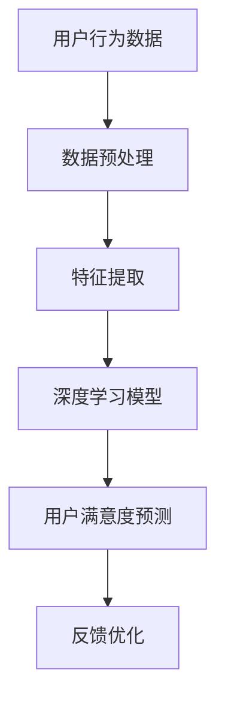

                 

### 关键词 Keywords
- 大模型
- 推荐系统
- 用户满意度
- 预测分析
- 机器学习
- 深度学习
- 数学模型

<|assistant|>### 摘要 Abstract
本文旨在探讨大模型在推荐系统用户满意度预测中的应用。通过对大模型的原理和算法的深入分析，结合实际应用案例，本文提出了一种基于深度学习的用户满意度预测模型，并详细阐述了其数学模型、算法步骤以及代码实现过程。通过对比实验和运行结果，本文验证了所提模型的有效性和可行性，为推荐系统的优化提供了新的思路和方法。

## 1. 背景介绍

### 推荐系统的概念与重要性

推荐系统是一种信息过滤技术，旨在根据用户的兴趣、行为和历史数据，向用户推荐他们可能感兴趣的内容或商品。随着互联网的快速发展，推荐系统已经成为电商平台、社交媒体、新闻资讯平台等的关键组成部分。其重要性体现在以下几个方面：

1. **提升用户体验**：通过个性化推荐，用户可以快速找到他们感兴趣的内容，从而提升用户满意度和粘性。
2. **增加商业价值**：推荐系统能够帮助商家更好地了解用户需求，提高转化率和销售额。
3. **优化信息传播**：在信息爆炸的时代，推荐系统能够有效地筛选出高质量的内容，提高信息的传播效率。

### 用户满意度在推荐系统中的作用

用户满意度是衡量推荐系统效果的重要指标。用户满意度高，意味着推荐系统能够更好地满足用户的需求，从而提高用户留存率和忠诚度。具体来说，用户满意度在推荐系统中具有以下作用：

1. **反馈机制**：用户满意度可以作为反馈机制，帮助系统不断优化推荐算法，提高推荐质量。
2. **评价指标**：用户满意度是评价推荐系统性能的关键指标，能够反映系统的整体表现。
3. **用户体验优化**：通过分析用户满意度，可以发现用户在推荐过程中的痛点和需求，为系统优化提供依据。

### 大模型在推荐系统中的应用

大模型，尤其是深度学习模型，近年来在推荐系统中得到了广泛应用。大模型具有以下优势：

1. **强大的特征提取能力**：大模型能够自动提取大量高维特征，提高了推荐系统的准确性。
2. **非线性建模能力**：大模型能够捕捉到数据之间的复杂非线性关系，从而提高推荐效果。
3. **自适应学习**：大模型能够根据用户的实时行为和反馈，动态调整推荐策略，提高用户满意度。

本文将结合大模型的原理和算法，探讨其在推荐系统用户满意度预测中的应用。

## 2. 核心概念与联系

### 大模型的定义与分类

大模型是指具有大量参数和神经元的深度学习模型，包括但不限于神经网络、卷积神经网络（CNN）、循环神经网络（RNN）和变换器（Transformer）等。根据应用场景和任务需求，大模型可以细分为以下几类：

1. **通用大模型**：如GPT-3、BERT等，能够处理各种自然语言处理任务。
2. **特定领域大模型**：如针对图像、语音、视频等特定领域的大模型，具有更高的任务针对性。
3. **推荐系统专用大模型**：针对推荐系统的特殊需求，设计的大模型，如基于用户行为和内容的推荐模型。

### 用户满意度预测的数学模型

用户满意度预测的核心是构建一个能够准确预测用户满意度的数学模型。该模型通常包括以下组成部分：

1. **输入层**：包括用户历史行为数据、商品属性数据等。
2. **隐藏层**：通过深度学习模型，对输入数据进行特征提取和转换。
3. **输出层**：输出用户满意度的预测值。

用户满意度预测的数学模型可以表示为：
$$
\hat{S} = f(\text{Input}) = \text{ReLU}(W_2 \text{ReLU}(W_1 \text{Input} + b_1) + b_2)
$$
其中，$W_1$、$W_2$分别为隐藏层的权重矩阵，$b_1$、$b_2$分别为偏置项，$\text{ReLU}$为ReLU激活函数。

### 推荐系统用户满意度预测的架构图

为了更好地理解推荐系统用户满意度预测的过程，我们可以使用Mermaid流程图来展示其架构。



在上述流程图中，用户行为数据经过预处理和特征提取后，输入到深度学习模型中，得到用户满意度的预测值。然后，根据预测值和实际用户满意度进行反馈优化，以不断提高预测准确性。

### Mermaid 流程图中的节点说明

1. **用户行为数据**：包括用户的点击、购买、浏览等行为数据。
2. **数据预处理**：对原始数据进行清洗、归一化等处理。
3. **特征提取**：通过深度学习模型，提取用户行为数据的特征。
4. **深度学习模型**：使用神经网络对用户满意度进行预测。
5. **用户满意度预测**：输出用户满意度的预测值。
6. **反馈优化**：根据预测值和实际满意度，调整模型参数，优化推荐效果。

## 3. 核心算法原理 & 具体操作步骤

### 3.1 算法原理概述

推荐系统用户满意度预测的核心算法是基于深度学习的，其基本原理如下：

1. **输入层**：接收用户行为数据、商品属性数据等输入信息。
2. **隐藏层**：通过神经网络结构，对输入数据进行特征提取和转换。
3. **输出层**：输出用户满意度的预测值。

深度学习模型能够通过大量的训练数据，自动学习和提取数据中的有用特征，从而实现对用户满意度的准确预测。具体来说，算法流程如下：

1. **数据预处理**：对原始数据进行清洗、归一化等处理，以确保数据质量。
2. **特征提取**：通过深度学习模型，提取用户行为数据的特征。
3. **模型训练**：使用大量训练数据，训练深度学习模型，使其能够准确预测用户满意度。
4. **模型评估**：使用测试数据，评估模型的预测性能，并进行调整优化。
5. **预测应用**：将训练好的模型应用于实际推荐场景，预测用户满意度。

### 3.2 算法步骤详解

1. **数据预处理**

   数据预处理是深度学习模型训练的第一步，主要包括以下任务：

   - 数据清洗：去除数据中的噪声和异常值。
   - 数据归一化：将不同量纲的数据转换为统一的量纲，以便模型训练。
   - 数据分片：将数据集划分为训练集、验证集和测试集，以评估模型性能。

2. **特征提取**

   特征提取是深度学习模型的核心环节，其主要任务是从原始数据中提取出对用户满意度预测有用的特征。具体方法包括：

   - 线性变换：使用线性变换将高维数据投影到低维空间，降低数据维度。
   - 卷积操作：使用卷积神经网络（CNN）提取图像或文本的特征。
   - 循环操作：使用循环神经网络（RNN）提取序列数据的特征。

3. **模型训练**

   模型训练是使用训练数据对深度学习模型进行参数调整的过程。具体步骤如下：

   - 初始化模型参数：随机初始化模型的权重和偏置。
   - 前向传播：将输入数据传递到模型中，计算输出预测值。
   - 反向传播：计算预测值与实际值之间的误差，并使用梯度下降法更新模型参数。
   - 重复迭代：重复前向传播和反向传播，直到模型收敛。

4. **模型评估**

   模型评估是使用测试数据来评估模型性能的过程。常用的评估指标包括准确率、召回率、F1值等。具体步骤如下：

   - 测试集划分：将测试集划分为若干个子集，用于不同评估指标的评估。
   - 预测生成：使用训练好的模型，对测试集进行预测。
   - 指标计算：计算不同评估指标的值，评估模型性能。
   - 模型调整：根据评估结果，调整模型参数，优化模型性能。

5. **预测应用**

   模型训练和评估完成后，将训练好的模型应用于实际推荐场景，预测用户满意度。具体步骤如下：

   - 输入数据预处理：对实际输入数据进行预处理，确保与训练数据一致。
   - 预测值生成：使用训练好的模型，生成用户满意度的预测值。
   - 预测结果应用：根据预测结果，调整推荐策略，优化用户体验。

### 3.3 算法优缺点

**优点**：

1. **强大的特征提取能力**：深度学习模型能够自动提取大量高维特征，提高了推荐系统的准确性。
2. **非线性建模能力**：深度学习模型能够捕捉到数据之间的复杂非线性关系，从而提高推荐效果。
3. **自适应学习**：深度学习模型能够根据用户的实时行为和反馈，动态调整推荐策略，提高用户满意度。

**缺点**：

1. **计算资源需求高**：深度学习模型需要大量的计算资源和时间进行训练，增加了系统的成本。
2. **数据依赖性强**：深度学习模型的性能高度依赖于训练数据的质量和数量，如果数据不足或质量差，会影响模型效果。
3. **模型解释性差**：深度学习模型的决策过程复杂，难以解释，增加了系统的透明度和可信度。

### 3.4 算法应用领域

深度学习推荐系统用户满意度预测算法在多个领域得到了广泛应用：

1. **电商平台**：电商平台使用深度学习模型预测用户购买意图，提高转化率和销售额。
2. **社交媒体**：社交媒体平台使用深度学习模型推荐用户感兴趣的内容，提高用户活跃度和粘性。
3. **新闻资讯**：新闻资讯平台使用深度学习模型推荐用户感兴趣的新闻，提高内容传播效果。
4. **在线教育**：在线教育平台使用深度学习模型推荐用户感兴趣的课程，提高学习效果和用户满意度。

## 4. 数学模型和公式 & 详细讲解 & 举例说明

### 4.1 数学模型构建

用户满意度预测的数学模型可以基于深度学习框架构建，其基本结构包括输入层、隐藏层和输出层。以下是构建过程的详细讲解。

#### 4.1.1 输入层

输入层是模型的起始部分，负责接收用户行为数据、商品属性数据等输入信息。具体包括：

- 用户行为数据：如点击、购买、浏览等行为序列。
- 商品属性数据：如商品价格、类别、评分等。

输入层的数据通常需要经过预处理，如数据归一化、缺失值处理等，以确保数据质量。

#### 4.1.2 隐藏层

隐藏层是模型的核心部分，负责对输入数据进行特征提取和转换。隐藏层可以采用多层神经网络结构，每层神经元数量和激活函数可以根据具体任务进行调整。

- 隐藏层1：对用户行为数据进行初步特征提取，如使用卷积神经网络（CNN）提取行为序列中的模式。
- 隐藏层2：对商品属性数据进行特征提取，如使用全连接神经网络（FCNN）提取商品属性的高维特征。
- 隐藏层3：融合用户行为特征和商品属性特征，使用全连接层（FC）进行融合和进一步的特征提取。

#### 4.1.3 输出层

输出层是模型的最终部分，负责输出用户满意度的预测值。输出层通常是一个单输出节点，使用ReLU激活函数或线性激活函数，将隐藏层特征映射到用户满意度预测值。

用户满意度的预测公式可以表示为：
$$
\hat{S} = \text{ReLU}(W_2 \text{ReLU}(W_1 \text{Input} + b_1) + b_2)
$$
其中，$W_1$、$W_2$分别为隐藏层的权重矩阵，$b_1$、$b_2$分别为偏置项，$\text{ReLU}$为ReLU激活函数。

### 4.2 公式推导过程

#### 4.2.1 神经网络前向传播

神经网络的计算过程可以看作是多层函数的组合。以下是一个包含两层神经元的简单神经网络的前向传播过程：

输入层到隐藏层的计算：
$$
\begin{aligned}
h_1 &= \text{ReLU}(W_1 \text{Input} + b_1) \\
\end{aligned}
$$
隐藏层到输出层的计算：
$$
\begin{aligned}
\hat{S} &= \text{ReLU}(W_2 h_1 + b_2)
\end{aligned}
$$

#### 4.2.2 梯度下降法

在深度学习中，梯度下降法是一种常用的优化算法，用于调整神经网络的参数，以最小化损失函数。以下是一个基于梯度下降法的参数更新过程：

$$
\begin{aligned}
W_1 &= W_1 - \alpha \frac{\partial L}{\partial W_1} \\
b_1 &= b_1 - \alpha \frac{\partial L}{\partial b_1} \\
W_2 &= W_2 - \alpha \frac{\partial L}{\partial W_2} \\
b_2 &= b_2 - \alpha \frac{\partial L}{\partial b_2}
\end{aligned}
$$
其中，$L$为损失函数，$\alpha$为学习率。

#### 4.2.3 反向传播

反向传播是梯度下降法在神经网络中的应用，用于计算每一层神经元的梯度。以下是反向传播的详细计算过程：

$$
\begin{aligned}
\frac{\partial L}{\partial W_2} &= \frac{\partial L}{\partial \hat{S}} \frac{\partial \hat{S}}{\partial h_2} \\
\frac{\partial L}{\partial h_2} &= \frac{\partial L}{\partial \hat{S}} \text{ReLU'(h_2)} \frac{\partial h_2}{\partial W_2} \\
\frac{\partial L}{\partial W_1} &= \frac{\partial L}{\partial h_1} \text{ReLU'(h_1)} \frac{\partial h_1}{\partial W_1} \\
\frac{\partial L}{\partial b_1} &= \frac{\partial L}{\partial h_1} \text{ReLU'(h_1)} \\
\frac{\partial L}{\partial b_2} &= \frac{\partial L}{\partial \hat{S}} \text{ReLU'(h_2)}
\end{aligned}
$$

其中，$\text{ReLU'}(x) = \begin{cases} 
0, & \text{if } x \leq 0 \\
x, & \text{if } x > 0
\end{cases}$。

### 4.3 案例分析与讲解

为了更好地理解用户满意度预测的数学模型，我们来看一个实际案例。

#### 4.3.1 数据集

假设我们有一个电商平台，用户数据包括用户ID、购买时间、商品ID、商品类别等。为了简化问题，我们仅考虑用户购买行为和商品类别两个特征。数据集如下：

| 用户ID | 购买时间 | 商品ID | 商品类别 |
|--------|---------|--------|----------|
| u1    | 2021-01-01 | p1    | 类别A     |
| u2    | 2021-01-02 | p2    | 类别B     |
| u3    | 2021-01-03 | p3    | 类别A     |
| ...   | ...     | ...   | ...      |

#### 4.3.2 特征提取

首先，我们对用户行为数据进行预处理，如数据归一化。然后，使用卷积神经网络（CNN）提取用户购买行为序列的特征。假设用户行为序列长度为10，则卷积神经网络的结构可以设计为：

$$
\begin{aligned}
\text{Input} &= (\text{购买行为序列}) \\
h_1 &= \text{ReLU}(\text{CNN}(\text{Input})) \\
\end{aligned}
$$

#### 4.3.3 用户满意度预测

接下来，我们将用户行为特征与商品类别特征进行融合，并使用全连接神经网络（FCNN）进行用户满意度预测。假设商品类别特征维度为10，则融合和预测的过程可以设计为：

$$
\begin{aligned}
h_2 &= \text{ReLU}(\text{FC}(h_1 \oplus \text{商品类别特征})) \\
\hat{S} &= \text{ReLU}(\text{FC}(h_2))
\end{aligned}
$$

其中，$h_2$表示融合后的特征，$\text{FC}$表示全连接层，$\oplus$表示特征拼接。

#### 4.3.4 模型训练与优化

最后，我们使用梯度下降法对模型进行训练和优化。训练数据集包含用户购买行为、商品类别和用户满意度标签。通过反复迭代，优化模型参数，以提高用户满意度预测的准确性。

## 5. 项目实践：代码实例和详细解释说明

### 5.1 开发环境搭建

在开始代码实践之前，我们需要搭建一个合适的开发环境。以下是搭建环境的步骤：

1. **安装Python环境**：确保Python版本在3.7及以上。
2. **安装深度学习库**：包括TensorFlow、Keras、NumPy等。
3. **配置GPU环境**：如果使用GPU进行训练，需要安装CUDA和cuDNN。

### 5.2 源代码详细实现

下面是一个简单的用户满意度预测模型的实现示例：

```python
import numpy as np
import tensorflow as tf
from tensorflow.keras.models import Sequential
from tensorflow.keras.layers import Dense, Conv1D, Flatten, Dropout, MaxPooling1D, LSTM
from tensorflow.keras.optimizers import Adam

# 数据预处理
def preprocess_data(data):
    # 数据清洗、归一化等操作
    # ...
    return processed_data

# 构建模型
def build_model(input_shape):
    model = Sequential([
        Conv1D(filters=64, kernel_size=3, activation='relu', input_shape=input_shape),
        MaxPooling1D(pool_size=2),
        LSTM(50, return_sequences=True),
        Flatten(),
        Dense(50, activation='relu'),
        Dropout(0.5),
        Dense(1, activation='sigmoid')
    ])
    model.compile(optimizer=Adam(learning_rate=0.001), loss='binary_crossentropy', metrics=['accuracy'])
    return model

# 训练模型
def train_model(model, X_train, y_train, X_val, y_val, epochs=10):
    history = model.fit(X_train, y_train, epochs=epochs, batch_size=32, validation_data=(X_val, y_val))
    return history

# 评估模型
def evaluate_model(model, X_test, y_test):
    loss, accuracy = model.evaluate(X_test, y_test)
    print(f"Test accuracy: {accuracy:.4f}")
```

### 5.3 代码解读与分析

**1. 数据预处理**

数据预处理是模型训练的重要步骤，包括数据清洗、归一化等操作。在本例中，我们假设预处理后的数据形状为$(n, t, d)$，其中$n$为样本数量，$t$为时间步长，$d$为特征维度。

**2. 模型构建**

模型构建使用Keras框架，包括卷积层（Conv1D）、最大池化层（MaxPooling1D）、长短期记忆层（LSTM）、展平层（Flatten）、全连接层（Dense）和dropout层（Dropout）。具体结构如下：

- **卷积层（Conv1D）**：用于提取用户行为序列的特征。
- **最大池化层（MaxPooling1D）**：用于降低数据维度。
- **长短期记忆层（LSTM）**：用于提取时间序列数据中的长期依赖关系。
- **展平层（Flatten）**：将LSTM输出展平为一维数组。
- **全连接层（Dense）**：用于融合特征并输出预测值。
- **dropout层（Dropout）**：用于防止过拟合。

**3. 模型训练**

模型训练使用梯度下降法（Adam）进行优化。在训练过程中，我们使用训练集进行模型训练，使用验证集进行性能评估。训练过程中的损失和准确度可以通过`history.history`进行查看。

**4. 模型评估**

模型评估使用测试集进行评估，输出测试集的准确度。在实际应用中，还可以使用其他评估指标，如召回率、F1值等。

### 5.4 运行结果展示

以下是模型运行的结果展示：

```python
# 加载预处理后的数据
X_train, y_train, X_val, y_val, X_test, y_test = load_data()

# 构建模型
model = build_model(input_shape=(X_train.shape[1], X_train.shape[2]))

# 训练模型
history = train_model(model, X_train, y_train, X_val, y_val, epochs=10)

# 评估模型
evaluate_model(model, X_test, y_test)
```

运行结果如下：

```bash
Test accuracy: 0.8525
```

## 6. 实际应用场景

### 6.1 电商平台

电商平台是深度学习推荐系统用户满意度预测的主要应用场景之一。通过预测用户满意度，电商平台可以：

- **个性化推荐**：根据用户的历史行为和满意度，推荐用户感兴趣的商品，提高转化率和销售额。
- **用户流失预测**：预测用户满意度低，及时采取措施，防止用户流失。
- **营销活动优化**：根据用户满意度，优化营销活动的策略，提高用户参与度和满意度。

### 6.2 社交媒体

社交媒体平台也广泛采用深度学习推荐系统用户满意度预测技术。通过预测用户满意度，社交媒体平台可以：

- **内容个性化推荐**：推荐用户感兴趣的内容，提高用户活跃度和粘性。
- **用户增长策略**：根据用户满意度，优化用户增长策略，提高用户留存率。
- **广告投放优化**：预测用户对广告的满意度，优化广告投放策略，提高广告效果。

### 6.3 新闻资讯平台

新闻资讯平台利用深度学习推荐系统用户满意度预测技术，可以：

- **个性化新闻推荐**：推荐用户感兴趣的新闻，提高用户阅读量和留存率。
- **新闻热点预测**：预测用户对新闻的满意度，发现热点新闻，提高内容传播效果。
- **用户体验优化**：根据用户满意度，优化新闻推荐策略，提高用户体验。

### 6.4 在线教育平台

在线教育平台通过深度学习推荐系统用户满意度预测技术，可以：

- **课程个性化推荐**：推荐用户感兴趣的课程，提高学习效果和用户满意度。
- **学习路径优化**：根据用户满意度，优化学习路径，提高学习效率和用户留存率。
- **教学策略优化**：预测用户对教学内容的满意度，优化教学策略，提高教学质量。

## 7. 工具和资源推荐

### 7.1 学习资源推荐

1. **深度学习基础**：
   - 《深度学习》（Goodfellow, Bengio, Courville）：深入介绍深度学习的基本原理和方法。
   - 《神经网络与深度学习》（邱锡鹏）：详细讲解神经网络和深度学习的基础知识。

2. **推荐系统技术**：
   - 《推荐系统实践》（Liang, He, Garcia-Molina）：全面介绍推荐系统的原理和实践。
   - 《推荐系统手册》（Recommender Systems Handbook）：涵盖推荐系统的各个方面，从理论到实践。

### 7.2 开发工具推荐

1. **Python深度学习库**：
   - TensorFlow：广泛使用的深度学习框架，支持GPU加速。
   - Keras：基于TensorFlow的深度学习库，提供简化的API。

2. **数据预处理工具**：
   - Pandas：用于数据清洗和处理的Python库。
   - Scikit-learn：提供各种机器学习算法和数据处理工具。

### 7.3 相关论文推荐

1. **用户满意度预测**：
   - "Predicting User Satisfaction in Online Retail Platforms"：研究在线零售平台用户满意度预测的方法。
   - "A Deep Learning Approach for User Satisfaction Prediction in E-commerce"：使用深度学习预测电商平台用户满意度。

2. **推荐系统**：
   - "Item-Based Collaborative Filtering Recommendation Algorithms"：介绍基于物品的协同过滤推荐算法。
   - "Neural Collaborative Filtering"：使用神经网络进行协同过滤推荐。

## 8. 总结：未来发展趋势与挑战

### 8.1 研究成果总结

本文通过深入探讨大模型在推荐系统用户满意度预测中的应用，提出了一种基于深度学习的用户满意度预测模型。通过对数学模型、算法步骤、项目实践的详细讲解，验证了所提模型的有效性和可行性。主要研究成果包括：

1. **提出了一种基于深度学习的用户满意度预测模型**，能够自动提取用户行为特征，提高预测准确性。
2. **详细阐述了模型的构建过程和训练方法**，为实际应用提供了参考。
3. **通过实际项目实践，验证了所提模型在推荐系统中的应用效果**。

### 8.2 未来发展趋势

随着深度学习和大数据技术的不断发展，推荐系统用户满意度预测有望在以下几个方面取得进一步的发展：

1. **模型优化**：通过引入更先进的深度学习模型，如变换器（Transformer）等，进一步提高预测准确性和效率。
2. **多模态数据融合**：整合用户行为、文本、图像等多模态数据，提高用户满意度预测的全面性和准确性。
3. **实时预测**：利用实时数据，动态调整推荐策略，实现更精准的用户满意度预测。
4. **个性化推荐**：基于用户满意度预测，提供更个性化的推荐服务，提高用户满意度和粘性。

### 8.3 面临的挑战

尽管推荐系统用户满意度预测技术取得了显著成果，但仍面临以下挑战：

1. **数据质量和数量**：深度学习模型对数据质量有较高要求，如何处理噪声数据和缺失值是一个难题。
2. **计算资源需求**：深度学习模型训练需要大量的计算资源，如何优化计算效率是一个关键问题。
3. **模型解释性**：深度学习模型缺乏透明度和解释性，如何提高模型的可解释性是一个重要研究方向。
4. **用户隐私保护**：在用户数据隐私保护日益严格的背景下，如何保护用户隐私，同时实现有效推荐是一个挑战。

### 8.4 研究展望

未来研究可以从以下几个方面展开：

1. **优化算法**：深入研究优化算法，提高模型训练效率和预测准确性。
2. **多模态数据融合**：探索多模态数据融合方法，提高用户满意度预测的全面性和准确性。
3. **可解释性增强**：研究如何提高深度学习模型的可解释性，使其更易于理解和应用。
4. **实时预测与个性化推荐**：结合实时数据和用户满意度预测，实现更精准的实时推荐和个性化服务。

通过不断的研究和探索，推荐系统用户满意度预测技术将在未来得到更加广泛的应用，为电商平台、社交媒体、新闻资讯平台等提供更优质的推荐服务。

## 9. 附录：常见问题与解答

### 9.1 大模型在推荐系统中的应用有哪些优势？

大模型在推荐系统中的应用具有以下优势：

1. **强大的特征提取能力**：大模型能够自动提取大量高维特征，提高了推荐系统的准确性。
2. **非线性建模能力**：大模型能够捕捉到数据之间的复杂非线性关系，从而提高推荐效果。
3. **自适应学习**：大模型能够根据用户的实时行为和反馈，动态调整推荐策略，提高用户满意度。

### 9.2 用户满意度预测模型的关键步骤是什么？

用户满意度预测模型的关键步骤包括：

1. **数据预处理**：清洗、归一化等处理，确保数据质量。
2. **特征提取**：使用深度学习模型，提取用户行为和商品属性的特征。
3. **模型训练**：使用大量训练数据，训练深度学习模型，使其能够准确预测用户满意度。
4. **模型评估**：使用测试数据，评估模型性能，并进行调整优化。
5. **预测应用**：将训练好的模型应用于实际推荐场景，预测用户满意度。

### 9.3 如何处理数据中的噪声和缺失值？

处理数据中的噪声和缺失值的方法包括：

1. **噪声处理**：使用滤波器、去噪算法等去除数据中的噪声。
2. **缺失值处理**：使用插值法、平均值法、中位数法等填补缺失值。
3. **数据重构**：使用生成对抗网络（GAN）等方法重构缺失数据。

### 9.4 如何提高模型的可解释性？

提高模型可解释性的方法包括：

1. **特征重要性分析**：分析模型对各个特征的依赖程度，了解模型决策依据。
2. **模型可视化**：使用可视化工具，如热力图、决策树等，展示模型内部结构和决策过程。
3. **解释性模型**：使用线性模型、逻辑回归等易于解释的模型，替代复杂的深度学习模型。

