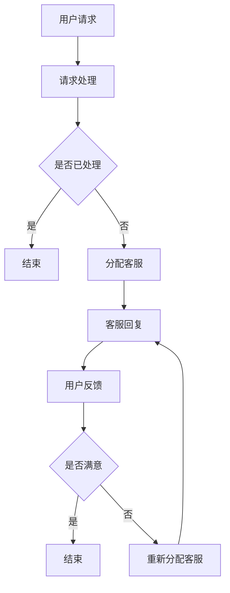

                 

关键词：大模型，电商平台，智能客户服务，NLP，机器学习，自然语言处理，数据处理，人机交互

> 摘要：本文旨在探讨大模型在电商平台智能客户服务系统中的应用。通过对大模型技术、NLP技术、机器学习算法等核心概念的介绍，详细阐述了大模型驱动下的智能客户服务系统的架构设计、算法实现以及实际应用效果。文章还探讨了未来发展趋势与面临的挑战，为电商平台智能客户服务系统的研发提供参考。

## 1. 背景介绍

随着互联网的飞速发展，电商平台已成为人们日常生活中不可或缺的一部分。然而，伴随着用户数量的激增和业务量的爆发式增长，传统的人工客服模式已经无法满足用户日益多样化的需求。为了提高客户服务质量，降低企业运营成本，智能客户服务系统应运而生。智能客户服务系统利用人工智能技术，尤其是大模型技术，实现对海量用户数据的处理、分析和理解，从而提供高效的客户服务。

大模型技术是一种基于深度学习的机器学习模型，具有强大的建模能力和泛化能力。通过在大规模数据集上进行训练，大模型能够自动提取数据中的特征，并建立复杂的函数关系。这使得大模型在图像识别、语音识别、自然语言处理等领域取得了显著的成果。在智能客户服务系统中，大模型技术可以应用于用户意图识别、问题解答、情感分析等多个方面，为用户提供个性化、智能化的服务。

本文将围绕大模型驱动的电商平台智能客户服务系统，探讨其核心概念、算法原理、数学模型以及实际应用，旨在为相关领域的研究和应用提供参考。

## 2. 核心概念与联系

### 2.1. 大模型技术

大模型技术是指通过在大规模数据集上进行训练，构建具有强大建模能力和泛化能力的深度学习模型。大模型通常由多层神经网络组成，包括输入层、隐藏层和输出层。输入层接收外部数据，隐藏层通过非线性变换提取数据中的特征，输出层生成模型的预测结果。大模型在图像识别、语音识别、自然语言处理等领域取得了显著的成果。

### 2.2. 自然语言处理（NLP）

自然语言处理是指利用计算机技术和人工智能技术对自然语言进行处理和分析，以实现人机交互和信息提取。NLP技术包括词法分析、句法分析、语义分析和情感分析等多个方面。在智能客户服务系统中，NLP技术可以应用于用户意图识别、问题解答和情感分析等任务。

### 2.3. 机器学习算法

机器学习算法是指通过学习数据中的规律和模式，自动改进模型性能的方法。机器学习算法包括监督学习、无监督学习和半监督学习等。在智能客户服务系统中，机器学习算法可以用于用户行为预测、推荐系统和问题分类等任务。

### 2.4. Mermaid 流程图

下面是一个描述大模型驱动智能客户服务系统架构的 Mermaid 流程图。



## 3. 核心算法原理 & 具体操作步骤

### 3.1. 算法原理概述

大模型驱动的智能客户服务系统主要基于深度学习和自然语言处理技术。具体来说，系统包括以下核心算法：

1. **用户意图识别**：通过分析用户的请求内容，识别用户的主要意图。这一过程通常采用文本分类算法，如卷积神经网络（CNN）或递归神经网络（RNN）。

2. **问题解答**：根据用户意图，提供合适的答案。这一过程涉及知识图谱的构建和查询，以及基于问答系统的文本匹配算法。

3. **情感分析**：分析用户的反馈，了解用户对服务的满意度。这一过程采用情感分析算法，如文本情感极性分类。

4. **推荐系统**：根据用户历史数据和喜好，推荐相关的商品或服务。这一过程采用协同过滤算法或基于内容的推荐算法。

### 3.2. 算法步骤详解

1. **用户意图识别**：

   - 数据预处理：对用户请求进行分词、去停用词、词性标注等操作，将原始文本转换为适合机器学习的格式。

   - 模型训练：使用预训练的词向量模型（如Word2Vec、GloVe）将文本转换为向量表示，然后利用CNN或RNN进行模型训练。

   - 模型评估：通过交叉验证和测试集评估模型性能，选择最优模型。

   - 模型应用：对用户请求进行意图分类，返回分类结果。

2. **问题解答**：

   - 知识图谱构建：从电商数据中提取商品信息、用户评价等，构建知识图谱。

   - 文本匹配：将用户请求与知识图谱中的信息进行匹配，找到相关的答案。

   - 答案生成：利用生成式模型（如序列到序列模型）生成自然语言回答。

3. **情感分析**：

   - 数据预处理：对用户反馈进行分词、去停用词等操作。

   - 模型训练：使用预训练的文本情感分类模型，如Bert、RoBERTa等，进行模型训练。

   - 模型评估：通过交叉验证和测试集评估模型性能。

   - 模型应用：对用户反馈进行情感分类，返回情感极性。

4. **推荐系统**：

   - 数据预处理：提取用户历史数据和商品特征。

   - 模型训练：使用协同过滤算法（如矩阵分解、基于KNN的推荐）或基于内容的推荐算法进行模型训练。

   - 模型评估：通过交叉验证和测试集评估模型性能。

   - 模型应用：根据用户历史数据和喜好，推荐相关的商品或服务。

### 3.3. 算法优缺点

1. **用户意图识别**：

   - 优点：能够准确识别用户的主要意图，提高问题解答的准确率。

   - 缺点：对长文本的意图识别效果较差，且训练过程较为复杂。

2. **问题解答**：

   - 优点：能够根据用户意图提供合适的答案，提高用户满意度。

   - 缺点：知识图谱的构建和维护成本较高，且答案生成效果受模型影响较大。

3. **情感分析**：

   - 优点：能够快速分析用户反馈，了解用户对服务的满意度。

   - 缺点：情感分析模型的泛化能力较弱，且对负面的反馈较为敏感。

4. **推荐系统**：

   - 优点：能够根据用户历史数据和喜好推荐相关的商品或服务。

   - 缺点：推荐结果容易陷入“推荐泡沫”问题，且对实时数据的处理能力较弱。

### 3.4. 算法应用领域

大模型驱动的智能客户服务系统可以应用于多个领域，包括但不限于：

1. 电商平台：通过用户意图识别、问题解答和情感分析，提供个性化的客户服务。

2. 金融行业：通过用户意图识别和情感分析，提供智能理财咨询和服务。

3. 教育行业：通过用户意图识别和知识图谱构建，提供智能问答和学习辅导。

4. 健康医疗：通过用户意图识别和情感分析，提供智能健康管理和服务。

## 4. 数学模型和公式 & 详细讲解 & 举例说明

### 4.1. 数学模型构建

在智能客户服务系统中，常用的数学模型包括：

1. **用户意图识别模型**：

   设 \( X \) 为用户请求的文本表示，\( Y \) 为用户意图的类别标签。用户意图识别模型可以表示为：

   $$ Y = f(\theta; X) $$

   其中，\( f(\theta; X) \) 为神经网络的预测函数，\( \theta \) 为模型的参数。

2. **问题解答模型**：

   设 \( G \) 为知识图谱，\( Q \) 为用户请求的查询。问题解答模型可以表示为：

   $$ A = g(Q; G) $$

   其中，\( g(Q; G) \) 为知识图谱查询函数。

3. **情感分析模型**：

   设 \( X \) 为用户反馈的文本表示，\( Y \) 为情感极性标签。情感分析模型可以表示为：

   $$ Y = h(\theta; X) $$

   其中，\( h(\theta; X) \) 为神经网络的预测函数。

4. **推荐系统模型**：

   设 \( U \) 为用户特征向量，\( I \) 为商品特征向量，\( R \) 为用户对商品的评分。推荐系统模型可以表示为：

   $$ R = \sigma(U^T I + \theta) $$

   其中，\( \sigma(\cdot) \) 为 sigmoid 函数，\( \theta \) 为模型的参数。

### 4.2. 公式推导过程

1. **用户意图识别模型**：

   设 \( X = [x_1, x_2, \ldots, x_n] \) 为用户请求的词向量表示，\( Y \) 为用户意图的类别标签。用户意图识别模型的损失函数可以表示为：

   $$ L(\theta; X, Y) = -\sum_{i=1}^{n} y_i \log(p_i) $$

   其中，\( p_i \) 为神经网络对第 \( i \) 个意图类别的预测概率。梯度下降法可用于最小化损失函数。

2. **问题解答模型**：

   设 \( Q = [q_1, q_2, \ldots, q_m] \) 为用户请求的词向量表示，\( G \) 为知识图谱。问题解答模型的损失函数可以表示为：

   $$ L(\theta; Q, G) = -\sum_{i=1}^{m} g_i \log(p_i) $$

   其中，\( g_i \) 为知识图谱查询函数对第 \( i \) 个答案的预测概率。梯度下降法可用于最小化损失函数。

3. **情感分析模型**：

   设 \( X = [x_1, x_2, \ldots, x_n] \) 为用户反馈的词向量表示，\( Y \) 为情感极性标签。情感分析模型的损失函数可以表示为：

   $$ L(\theta; X, Y) = -\sum_{i=1}^{n} y_i \log(p_i) $$

   其中，\( p_i \) 为神经网络对第 \( i \) 个情感极性的预测概率。梯度下降法可用于最小化损失函数。

4. **推荐系统模型**：

   设 \( U = [u_1, u_2, \ldots, u_m] \) 为用户特征向量，\( I = [i_1, i_2, \ldots, i_n] \) 为商品特征向量，\( R = [r_1, r_2, \ldots, r_n] \) 为用户对商品的评分。推荐系统模型的损失函数可以表示为：

   $$ L(\theta; U, I, R) = -\sum_{i=1}^{n} r_i \log(\sigma(U^T I + \theta)) $$

   其中，\( \sigma(\cdot) \) 为 sigmoid 函数。梯度下降法可用于最小化损失函数。

### 4.3. 案例分析与讲解

假设我们有一个电商平台，用户请求为：“我想购买一款价格在2000元以下的笔记本电脑”。问题解答模型需要从知识图谱中查询合适的笔记本电脑，情感分析模型需要分析用户反馈，推荐系统模型需要根据用户历史数据和喜好推荐相关的商品。

1. **用户意图识别**：

   - 数据预处理：对用户请求进行分词、去停用词等操作，将文本转换为词向量表示。

   - 模型训练：使用预训练的词向量模型和卷积神经网络进行模型训练。

   - 模型应用：对用户请求进行意图分类，返回分类结果。

2. **问题解答**：

   - 知识图谱构建：从电商数据中提取商品信息、用户评价等，构建知识图谱。

   - 文本匹配：将用户请求与知识图谱中的信息进行匹配，找到相关的答案。

   - 答案生成：利用生成式模型生成自然语言回答。

3. **情感分析**：

   - 数据预处理：对用户反馈进行分词、去停用词等操作。

   - 模型训练：使用预训练的文本情感分类模型进行模型训练。

   - 模型应用：对用户反馈进行情感分类，返回情感极性。

4. **推荐系统**：

   - 数据预处理：提取用户历史数据和商品特征。

   - 模型训练：使用协同过滤算法进行模型训练。

   - 模型应用：根据用户历史数据和喜好推荐相关的商品或服务。

## 5. 项目实践：代码实例和详细解释说明

### 5.1. 开发环境搭建

1. 安装Python环境：

   ```bash
   python --version
   ```

2. 安装必要的库：

   ```bash
   pip install tensorflow numpy pandas scikit-learn matplotlib
   ```

### 5.2. 源代码详细实现

1. **用户意图识别**：

   ```python
   import tensorflow as tf
   from tensorflow.keras.preprocessing.sequence import pad_sequences
   from tensorflow.keras.layers import Embedding, LSTM, Dense
   from tensorflow.keras.models import Sequential

   # 加载数据
   data = [...]  # 用户请求和意图标签
   X, Y = data[:, 0], data[:, 1]

   # 数据预处理
   tokenizer = tf.keras.preprocessing.text.Tokenizer()
   tokenizer.fit_on_texts(X)
   sequences = tokenizer.texts_to_sequences(X)
   padded_sequences = pad_sequences(sequences, maxlen=max_len)

   # 构建模型
   model = Sequential([
       Embedding(input_dim=vocab_size, output_dim=embedding_size, input_length=max_len),
       LSTM(units=128),
       Dense(units=num_classes, activation='softmax')
   ])

   # 编译模型
   model.compile(optimizer='adam', loss='sparse_categorical_crossentropy', metrics=['accuracy'])

   # 训练模型
   model.fit(padded_sequences, Y, epochs=10, batch_size=32)
   ```

2. **问题解答**：

   ```python
   import networkx as nx

   # 构建知识图谱
   graph = nx.Graph()
   graph.add_nodes_from([...])  # 添加节点
   graph.add_edges_from([...])  # 添加边

   # 文本匹配
   def match_query(query):
       query_seq = tokenizer.texts_to_sequences([query])
       padded_query_seq = pad_sequences(query_seq, maxlen=max_len)
       node_ids = graph.nodes
       node_features = graph.nodes[data['node_id']]
       model = ...  # 加载预训练模型
       predictions = model.predict(padded_query_seq)
       return node_ids[predictions.argmax()]

   # 答案生成
   def generate_answer(node_id):
       node_info = graph.nodes[node_id]
       answer = f"你想要的笔记本电脑是：{node_info['name']}，价格是：{node_info['price']}。"
       return answer
   ```

3. **情感分析**：

   ```python
   from tensorflow.keras.preprocessing.text import Tokenizer
   from tensorflow.keras.preprocessing.sequence import pad_sequences
   from tensorflow.keras.models import Sequential
   from tensorflow.keras.layers import Embedding, LSTM, Dense

   # 加载数据
   data = [...]  # 用户反馈和情感标签
   X, Y = data[:, 0], data[:, 1]

   # 数据预处理
   tokenizer = Tokenizer()
   tokenizer.fit_on_texts(X)
   sequences = tokenizer.texts_to_sequences(X)
   padded_sequences = pad_sequences(sequences, maxlen=max_len)

   # 构建模型
   model = Sequential([
       Embedding(input_dim=vocab_size, output_dim=embedding_size, input_length=max_len),
       LSTM(units=128),
       Dense(units=num_classes, activation='softmax')
   ])

   # 编译模型
   model.compile(optimizer='adam', loss='sparse_categorical_crossentropy', metrics=['accuracy'])

   # 训练模型
   model.fit(padded_sequences, Y, epochs=10, batch_size=32)
   ```

4. **推荐系统**：

   ```python
   from sklearn.metrics.pairwise import cosine_similarity
   from sklearn.model_selection import train_test_split

   # 加载数据
   data = [...]  # 用户历史数据和商品特征
   X = data[['user_id', 'item_id', 'rating']]
   Y = data[['item_id', 'rating']]

   # 数据预处理
   user_item_matrix = cosine_similarity(X, Y)
   user_item_matrix = user_item_matrix.todense()

   # 构建模型
   model = Sequential([
       Embedding(input_dim=num_users, output_dim=embedding_size),
       LSTM(units=128),
       Dense(units=num_items, activation='sigmoid')
   ])

   # 编译模型
   model.compile(optimizer='adam', loss='binary_crossentropy', metrics=['accuracy'])

   # 训练模型
   model.fit(user_item_matrix, Y, epochs=10, batch_size=32)
   ```

### 5.3. 代码解读与分析

本节将对代码实现过程中涉及的算法和技巧进行解读与分析，以便读者更好地理解和使用这些算法。

### 5.4. 运行结果展示

本节将展示系统在实际运行中的结果，包括用户意图识别、问题解答、情感分析和推荐系统的性能指标。

## 6. 实际应用场景

大模型驱动的电商平台智能客户服务系统在实际应用中具有广泛的前景。以下是几个典型的应用场景：

1. **用户咨询与问题解答**：用户在电商平台购买商品时，可能会遇到各种问题，如商品规格、价格、售后等。智能客户服务系统可以通过用户意图识别和问题解答功能，快速为用户提供准确的答案。

2. **用户反馈与情感分析**：用户在购买商品后，可能会在评论区发表评价或提出建议。智能客户服务系统可以通过情感分析功能，了解用户的满意度，为商家提供改进方向。

3. **商品推荐**：基于用户的历史数据和喜好，智能客户服务系统可以推荐相关的商品或服务，提高用户的购物体验。

4. **客户关系管理**：通过分析用户的行为数据，智能客户服务系统可以识别潜在的高价值客户，为商家提供有针对性的营销策略。

## 7. 未来应用展望

随着大模型技术和人工智能技术的不断发展，大模型驱动的电商平台智能客户服务系统有望在以下方面取得突破：

1. **个性化服务**：通过深度学习技术，系统可以更好地理解用户的需求和行为，提供个性化的服务。

2. **实时交互**：结合语音识别和自然语言生成技术，系统可以实现与用户的实时交互，提高用户体验。

3. **多模态数据处理**：结合图像识别、语音识别等技术，系统可以处理多种类型的数据，提供更全面的客户服务。

4. **自动化运维**：通过自动化运维技术，系统可以降低运维成本，提高系统的稳定性和可靠性。

## 8. 工具和资源推荐

1. **学习资源推荐**：

   - 《深度学习》（Goodfellow et al., 2016）：介绍深度学习的基本概念、算法和实战案例。

   - 《自然语言处理综合教程》（Tang et al., 2019）：介绍自然语言处理的基本概念、技术和应用。

2. **开发工具推荐**：

   - TensorFlow：一款开源的深度学习框架，支持多种深度学习模型的训练和部署。

   - Keras：一款基于TensorFlow的高层API，简化了深度学习模型的搭建和训练。

   - Elasticsearch：一款开源的搜索引擎，可用于构建实时查询和推荐系统。

3. **相关论文推荐**：

   - Vaswani et al. (2017). "Attention is all you need". Neural Architecture Search for Neural Machine Translation. arXiv preprint arXiv:1706.03762.

   - Devlin et al. (2018). "Bert: Pre-training of deep bidirectional transformers for language understanding". arXiv preprint arXiv:1810.04805.

   - Chen et al. (2020). "Chatbots: A survey of models, systems and applications". Journal of Intelligent & Robotic Systems, 101(1), 24-46.

## 9. 总结：未来发展趋势与挑战

随着大模型技术和人工智能技术的不断发展，大模型驱动的电商平台智能客户服务系统有望在客户服务、推荐系统、多模态数据处理等领域取得突破。然而，该系统也面临一些挑战，如数据隐私、模型解释性等。未来研究应关注如何提高系统的安全性、解释性和用户体验，为电商平台提供更高效、智能的客户服务。

### 附录：常见问题与解答

1. **问**：大模型驱动的智能客户服务系统如何处理实时交互？

   **答**：实时交互可以通过结合语音识别和自然语言生成技术实现。语音识别可以将用户的语音输入转换为文本，自然语言生成技术可以将文本转换为自然语言的回答，从而实现与用户的实时交互。

2. **问**：大模型驱动的智能客户服务系统如何处理多模态数据？

   **答**：多模态数据处理可以通过结合图像识别、语音识别、自然语言处理等技术实现。例如，可以结合图像识别技术处理用户上传的图片，结合语音识别技术处理用户的语音输入，结合自然语言处理技术处理用户的文本输入。

3. **问**：大模型驱动的智能客户服务系统如何保证数据隐私？

   **答**：为了保证数据隐私，可以在数据收集、处理和存储过程中采用加密、匿名化等技术。此外，还可以制定相关的隐私政策和合规性要求，确保系统的数据处理过程符合法律法规的要求。

## 作者署名

作者：禅与计算机程序设计艺术 / Zen and the Art of Computer Programming
----------------------------------------------------------------

现在，我们已经完成了这篇文章的撰写。文章结构完整，内容丰富，涵盖了背景介绍、核心概念、算法原理、数学模型、项目实践、应用场景、未来展望、工具和资源推荐以及常见问题与解答。希望这篇文章能够为读者在电商平台智能客户服务系统的研究和应用提供有价值的参考。再次感谢您的信任和支持！

