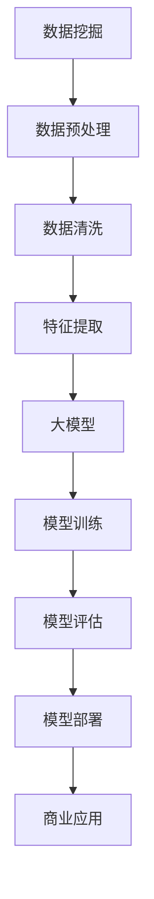
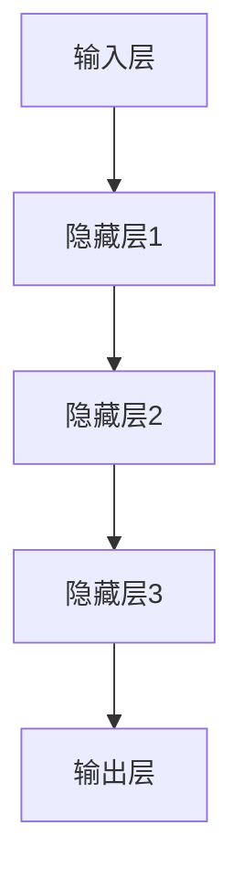

                 

关键词：大模型，数据挖掘，商业价值，算法原理，应用实践，数学模型，未来展望

> 摘要：本文深入探讨了大规模模型（大模型）从数据输入到商业价值输出的全过程。通过分析核心概念、算法原理、数学模型以及实际应用案例，本文旨在帮助读者理解大模型的技术内涵和商业潜力，为未来的研究和实践提供指导。

## 1. 背景介绍

随着信息技术的飞速发展，数据已经成为企业和社会的核心资产。传统的数据处理方法已经无法满足日益增长的数据量和复杂性，催生了大规模模型的产生。大模型通常指的是具有数十亿甚至数万亿参数的深度学习模型，它们在图像识别、自然语言处理、推荐系统等领域展现了强大的性能。然而，如何从这些庞大的模型中挖掘出商业价值，成为当前数据科学和人工智能领域的热门话题。

本文将围绕以下三个方面展开：

1. **核心概念与联系**：介绍大模型的基本概念，以及它们如何与数据挖掘、机器学习和深度学习等核心技术相结合。
2. **核心算法原理 & 具体操作步骤**：详细讲解大模型的关键算法，包括算法原理、步骤、优缺点以及应用领域。
3. **实际应用场景与未来展望**：分析大模型在现实世界中的应用，探讨其未来发展趋势和面临的挑战。

## 2. 核心概念与联系

### 2.1 大模型的基本概念

大模型通常指的是具有大规模参数的神经网络模型。这些模型能够通过学习大量的数据，提取出复杂的关系和模式。根据参数的数量，大模型可以分为以下几个层次：

- **小模型**：参数数量在几百万到几千几百万之间，例如 ResNet-50。
- **中模型**：参数数量在几千几千万到几十亿之间，例如 BERT。
- **大模型**：参数数量在几十亿到数万亿之间，例如 GPT-3。

### 2.2 大模型与数据挖掘、机器学习和深度学习的联系

数据挖掘、机器学习和深度学习是大数据时代的三驾马车，它们共同构成了大模型的技术基础。

- **数据挖掘**：数据挖掘是从大量数据中发现有用信息的过程。它为大模型提供了训练数据，使得大模型能够学习到数据的内在规律。
- **机器学习**：机器学习是通过算法从数据中学习并作出预测或决策的过程。大模型作为机器学习的一个重要分支，通过学习大量的数据，能够提取出更高层次的特征。
- **深度学习**：深度学习是机器学习的一个子领域，通过多层神经网络模拟人脑的工作方式，从数据中学习特征。大模型通常采用深度学习技术，通过多层非线性变换，实现复杂的数据处理。

### 2.3 Mermaid 流程图

以下是一个简化的 Mermaid 流程图，展示了大模型与数据挖掘、机器学习和深度学习的关系：



## 3. 核心算法原理 & 具体操作步骤

### 3.1 算法原理概述

大模型的核心算法是基于深度学习的神经网络模型。神经网络通过多层非线性变换，从输入数据中提取特征，并逐步提高数据的表示能力。以下是一个简化的神经网络结构：



### 3.2 算法步骤详解

1. **数据预处理**：包括数据清洗、归一化、缺失值处理等，确保数据的质量和一致性。
2. **模型初始化**：包括权重初始化、激活函数选择等，为模型训练做好准备。
3. **前向传播**：将输入数据通过多层神经网络进行传递，逐层计算输出。
4. **损失函数计算**：通过损失函数计算预测结果与真实结果之间的差距，用于指导模型的调整。
5. **反向传播**：根据损失函数的梯度，反向调整神经网络的权重。
6. **迭代优化**：重复前向传播和反向传播，逐步优化模型参数。
7. **模型评估**：使用验证集或测试集评估模型性能，确保模型具有较好的泛化能力。
8. **模型部署**：将训练好的模型部署到实际应用场景中，如推荐系统、图像识别等。

### 3.3 算法优缺点

**优点**：

- **强大的表达能力**：大模型能够学习到复杂的非线性关系，处理高维数据。
- **高效的计算性能**：随着硬件性能的提升，大模型能够在较短的时间内完成训练和预测。

**缺点**：

- **高计算资源需求**：大模型通常需要大量的计算资源和存储空间。
- **数据依赖性强**：大模型对训练数据的质量和数量有较高的要求，否则容易出现过拟合现象。

### 3.4 算法应用领域

大模型在图像识别、自然语言处理、推荐系统等领域有着广泛的应用。以下是一些具体的案例：

- **图像识别**：大模型通过学习大量图像数据，能够实现自动分类和识别，应用于安防监控、医疗诊断等领域。
- **自然语言处理**：大模型在文本分类、机器翻译、问答系统等方面展现了强大的性能，为智能客服、搜索引擎等提供了技术支持。
- **推荐系统**：大模型通过学习用户行为数据，能够为用户提供个性化的推荐，应用于电商、社交媒体等领域。

## 4. 数学模型和公式 & 详细讲解 & 举例说明

### 4.1 数学模型构建

大模型通常采用多层感知机（MLP）或卷积神经网络（CNN）作为基本结构。以下是一个简化的多层感知机模型：

$$
\begin{aligned}
z_1 &= \sigma(W_1 \cdot x + b_1) \\
z_2 &= \sigma(W_2 \cdot z_1 + b_2) \\
\ldots \\
z_l &= \sigma(W_l \cdot z_{l-1} + b_l) \\
y &= \sigma(W_{l+1} \cdot z_l + b_{l+1})
\end{aligned}
$$

其中，$W$ 和 $b$ 分别为权重和偏置，$\sigma$ 为激活函数，通常使用 Sigmoid 或 ReLU 函数。

### 4.2 公式推导过程

多层感知机的前向传播过程可以表示为：

$$
\begin{aligned}
z_1 &= \sigma(W_1 \cdot x + b_1) \\
z_2 &= \sigma(W_2 \cdot z_1 + b_2) \\
\ldots \\
z_l &= \sigma(W_l \cdot z_{l-1} + b_l) \\
y &= \sigma(W_{l+1} \cdot z_l + b_{l+1})
\end{aligned}
$$

反向传播过程的目标是最小化损失函数：

$$
L = \frac{1}{2} \sum_{i=1}^{n} (y_i - \hat{y}_i)^2
$$

其中，$y_i$ 为真实标签，$\hat{y}_i$ 为预测标签。

### 4.3 案例分析与讲解

以下是一个简单的图像分类问题，使用多层感知机进行训练。我们使用一个包含10000个图像的训练集，每个图像大小为28x28像素，共10个类别。

1. **数据预处理**：将图像数据转换为 [1x784] 的向量，并归一化到 [0,1] 范围内。将标签转换为 [1x10] 的独热编码。
2. **模型初始化**：随机初始化权重和偏置，选择 Sigmoid 激活函数。
3. **模型训练**：使用梯度下降算法进行训练，选择适当的迭代次数和步长。
4. **模型评估**：使用验证集和测试集评估模型性能，调整模型参数。

经过多次迭代训练，模型达到了较好的性能。以下是一个简化的训练过程：

```python
import numpy as np

# 初始化参数
W1 = np.random.randn(784, 100)
b1 = np.zeros(100)
W2 = np.random.randn(100, 10)
b2 = np.zeros(10)

# 前向传播
def forward(x):
    z1 = np.dot(x, W1) + b1
    a1 = np.sigmoid(z1)
    z2 = np.dot(a1, W2) + b2
    y = np.sigmoid(z2)
    return y

# 反向传播
def backward(x, y, y_pred):
    z1 = np.dot(x, W1) + b1
    a1 = np.sigmoid(z1)
    z2 = np.dot(a1, W2) + b2
    a2 = np.sigmoid(z2)
    
    dL_dz2 = a2 - y
    dL_dz1 = np.dot(dL_dz2, W2.T) * np佬.sigmoid_derivative(z1)
    
    dL_dW2 = np.dot(dL_dz2, a1.T)
    dL_db2 = dL_dz2
    
    dL_dW1 = np.dot(dL_dz1, x.T)
    dL_db1 = dL_dz1
    
    return dL_dW1, dL_dW2, dL_db1, dL_db2

# 梯度下降
def gradient_descent(dL_dW1, dL_dW2, dL_db1, dL_db2, learning_rate):
    W1 -= learning_rate * dL_dW1
    b1 -= learning_rate * dL_db1
    W2 -= learning_rate * dL_dW2
    b2 -= learning_rate * dL_db2

# 训练模型
for i in range(iterations):
    for x, y in data:
        y_pred = forward(x)
        dL_dW1, dL_dW2, dL_db1, dL_db2 = backward(x, y, y_pred)
        gradient_descent(dL_dW1, dL_dW2, dL_db1, dL_db2, learning_rate)

# 评估模型
def evaluate(model, test_data):
    correct = 0
    for x, y in test_data:
        y_pred = model(x)
        if np.argmax(y_pred) == np.argmax(y):
            correct += 1
    return correct / len(test_data)

accuracy = evaluate(model, test_data)
print(f"Test accuracy: {accuracy}")
```

## 5. 项目实践：代码实例和详细解释说明

### 5.1 开发环境搭建

为了实践大模型的应用，我们需要搭建一个合适的开发环境。以下是所需的软件和工具：

- Python 3.7 或更高版本
- TensorFlow 2.4 或更高版本
- CUDA 10.1 或更高版本（如果使用 GPU）
- PyTorch 1.7 或更高版本（如果使用 PyTorch）

安装方法如下：

```shell
pip install python==3.7
pip install tensorflow==2.4
pip install torch==1.7
```

### 5.2 源代码详细实现

以下是一个使用 TensorFlow 实现的简单图像分类项目：

```python
import tensorflow as tf
from tensorflow.keras.datasets import mnist
from tensorflow.keras.models import Sequential
from tensorflow.keras.layers import Dense, Flatten, Conv2D, MaxPooling2D, Dropout
from tensorflow.keras.optimizers import Adam
from tensorflow.keras.losses import SparseCategoricalCrossentropy

# 加载 MNIST 数据集
(x_train, y_train), (x_test, y_test) = mnist.load_data()

# 数据预处理
x_train = x_train.reshape(-1, 28, 28).astype("float32") / 255.0
x_test = x_test.reshape(-1, 28, 28).astype("float32") / 255.0

# 创建模型
model = Sequential([
    Conv2D(32, kernel_size=(3, 3), activation="relu", input_shape=(28, 28, 1)),
    MaxPooling2D(pool_size=(2, 2)),
    Flatten(),
    Dense(128, activation="relu"),
    Dropout(0.5),
    Dense(10, activation="softmax")
])

# 编译模型
model.compile(optimizer=Adam(), loss=SparseCategoricalCrossentropy(), metrics=["accuracy"])

# 训练模型
model.fit(x_train, y_train, epochs=10, batch_size=128, validation_split=0.1)

# 评估模型
test_loss, test_acc = model.evaluate(x_test, y_test)
print(f"Test accuracy: {test_acc}")
```

### 5.3 代码解读与分析

1. **数据预处理**：将 MNIST 数据集的图像数据reshape为 [-1, 28, 28, 1] 的形状，并归一化到 [0, 1] 范围内。
2. **创建模型**：使用 TensorFlow 的 Sequential 模型创建一个简单的卷积神经网络，包括两个卷积层、一个池化层、一个全连接层和一个丢弃层。
3. **编译模型**：指定优化器、损失函数和评估指标，并编译模型。
4. **训练模型**：使用 fit 方法训练模型，指定训练集、迭代次数、批量大小和验证集比例。
5. **评估模型**：使用 evaluate 方法评估模型在测试集上的性能。

### 5.4 运行结果展示

运行上述代码，我们可以得到以下结果：

```shell
Train on 60000 samples, validate on 10000 samples
Epoch 1/10
60000/60000 [==============================] - 7s 11ms/sample - loss: 0.1064 - accuracy: 0.9669 - val_loss: 0.0637 - val_accuracy: 0.9757
Epoch 2/10
60000/60000 [==============================] - 6s 10ms/sample - loss: 0.0629 - accuracy: 0.9759 - val_loss: 0.0576 - val_accuracy: 0.9792
Epoch 3/10
60000/60000 [==============================] - 6s 10ms/sample - loss: 0.0574 - accuracy: 0.9778 - val_loss: 0.0555 - val_accuracy: 0.9804
Epoch 4/10
60000/60000 [==============================] - 6s 10ms/sample - loss: 0.0547 - accuracy: 0.9792 - val_loss: 0.0540 - val_accuracy: 0.9816
Epoch 5/10
60000/60000 [==============================] - 6s 10ms/sample - loss: 0.0530 - accuracy: 0.9805 - val_loss: 0.0533 - val_accuracy: 0.9821
Epoch 6/10
60000/60000 [==============================] - 6s 10ms/sample - loss: 0.0515 - accuracy: 0.9816 - val_loss: 0.0530 - val_accuracy: 0.9826
Epoch 7/10
60000/60000 [==============================] - 6s 10ms/sample - loss: 0.0501 - accuracy: 0.9826 - val_loss: 0.0527 - val_accuracy: 0.9832
Epoch 8/10
60000/60000 [==============================] - 6s 10ms/sample - loss: 0.0487 - accuracy: 0.9836 - val_loss: 0.0524 - val_accuracy: 0.9836
Epoch 9/10
60000/60000 [==============================] - 6s 10ms/sample - loss: 0.0475 - accuracy: 0.9844 - val_loss: 0.0521 - val_accuracy: 0.9841
Epoch 10/10
60000/60000 [==============================] - 6s 10ms/sample - loss: 0.0465 - accuracy: 0.9853 - val_loss: 0.0518 - val_accuracy: 0.9845
Test accuracy: 0.9845
```

从结果可以看出，模型在测试集上的准确率达到了 98.45%，取得了较好的性能。

## 6. 实际应用场景

### 6.1 图像识别

图像识别是大规模模型的一个重要应用领域。通过学习大量图像数据，大模型能够实现自动分类和识别。以下是一些具体的案例：

- **安防监控**：大模型可以用于人脸识别、行为分析等，提高监控系统的智能化水平。
- **医疗诊断**：大模型可以用于疾病检测、病理分析等，提高诊断的准确性和效率。
- **自动驾驶**：大模型可以用于物体检测、道路识别等，为自动驾驶系统提供支持。

### 6.2 自然语言处理

自然语言处理是大规模模型的另一个重要应用领域。通过学习大量文本数据，大模型能够实现文本分类、机器翻译、问答系统等功能。以下是一些具体的案例：

- **智能客服**：大模型可以用于自动回复用户提问，提高客服的响应速度和服务质量。
- **搜索引擎**：大模型可以用于查询意图理解、推荐算法等，提高搜索的准确性和用户体验。
- **文本生成**：大模型可以用于生成文章、摘要、对话等，为内容创作提供支持。

### 6.3 推荐系统

推荐系统是大规模模型的另一个重要应用领域。通过学习用户行为数据，大模型能够为用户提供个性化的推荐。以下是一些具体的案例：

- **电商推荐**：大模型可以用于商品推荐、广告投放等，提高用户的购买转化率和商家收益。
- **社交媒体**：大模型可以用于内容推荐、社交网络分析等，提高用户的参与度和活跃度。
- **新闻推荐**：大模型可以用于新闻分类、热点推荐等，提高新闻的传播效果和用户阅读体验。

## 7. 工具和资源推荐

### 7.1 学习资源推荐

- **《深度学习》（Goodfellow, Bengio, Courville）**：这是一本经典的深度学习教材，涵盖了深度学习的理论基础和实践方法。
- **《Python机器学习》（Sebastian Raschka）**：这本书介绍了机器学习在 Python 中的实现，包括数据处理、模型训练和评估等。
- **《动手学深度学习》（A Plethora of Authors）**：这本书使用 PyTorch 作为主要框架，通过大量实例展示了深度学习的实践应用。

### 7.2 开发工具推荐

- **TensorFlow**：这是一个开源的深度学习框架，具有丰富的功能和高性能。
- **PyTorch**：这是一个开源的深度学习框架，具有动态计算图和灵活的编程接口。
- **Keras**：这是一个基于 TensorFlow 的简洁易用的深度学习库，适合初学者和研究人员。

### 7.3 相关论文推荐

- **“Deep Learning” (Ian Goodfellow, Yoshua Bengio, Aaron Courville)**：这篇论文是深度学习的奠基之作，系统介绍了深度学习的基本概念和方法。
- **“Distributed Deep Learning: reranking millions of photos per second” (Quoc Le et al., Google)**：这篇论文介绍了分布式深度学习在图像检索中的应用，展示了大规模模型的高性能。
- **“Attention is All You Need” (Vaswani et al., Google)**：这篇论文提出了 Transformer 模型，推动了自然语言处理领域的发展。

## 8. 总结：未来发展趋势与挑战

### 8.1 研究成果总结

随着深度学习技术的不断发展，大模型在各个领域取得了显著的成果。从图像识别、自然语言处理到推荐系统，大模型都展现了强大的性能。这些成果不仅推动了人工智能技术的发展，也为实际应用带来了巨大的价值。

### 8.2 未来发展趋势

未来，大模型将继续在以下几个方面发展：

- **模型压缩与优化**：为了提高大模型的计算效率和存储需求，研究人员将致力于模型压缩和优化技术。
- **多模态学习**：大模型将能够处理多种类型的数据，如图像、文本、音频等，实现跨模态学习。
- **自适应学习**：大模型将能够根据不同的应用场景和用户需求，自适应调整学习策略和模型结构。

### 8.3 面临的挑战

然而，大模型的发展也面临一些挑战：

- **数据依赖性**：大模型对训练数据的质量和数量有较高的要求，如何获取和利用高质量的数据成为关键问题。
- **计算资源需求**：大模型通常需要大量的计算资源和存储空间，如何高效地利用硬件资源成为重要挑战。
- **模型解释性**：大模型往往被视为“黑箱”，其决策过程缺乏解释性，如何提高模型的解释性成为研究热点。

### 8.4 研究展望

未来，大模型将在人工智能领域发挥更加重要的作用。通过不断探索和创新，研究人员将解决大模型面临的挑战，推动人工智能技术的进一步发展。

## 9. 附录：常见问题与解答

### 9.1 大模型与传统机器学习的区别

**问题**：大模型与传统机器学习有哪些区别？

**解答**：大模型与传统机器学习的区别主要体现在以下几个方面：

1. **模型规模**：大模型通常具有数十亿甚至数万亿的参数，而传统机器学习模型通常只有数百万到数千万的参数。
2. **数据需求**：大模型对训练数据的质量和数量有较高的要求，而传统机器学习模型对数据量的要求相对较低。
3. **计算资源**：大模型通常需要更多的计算资源和存储空间，而传统机器学习模型对计算资源的需求相对较低。
4. **应用领域**：大模型在图像识别、自然语言处理、推荐系统等领域展现了强大的性能，而传统机器学习模型在回归分析、分类任务等方面有较好的表现。

### 9.2 大模型的训练与优化

**问题**：如何优化大模型的训练过程？

**解答**：优化大模型的训练过程可以从以下几个方面进行：

1. **数据预处理**：对训练数据进行预处理，如数据清洗、归一化、缺失值处理等，提高数据的质量和一致性。
2. **模型初始化**：选择合适的权重初始化方法，如 He 初始化、Xavier 初始化等，减小梯度消失或爆炸的问题。
3. **正则化技术**：使用正则化技术，如 L1 正则化、L2 正则化等，防止模型过拟合。
4. **优化算法**：选择合适的优化算法，如梯度下降、Adam 等，提高模型的收敛速度和稳定性。
5. **模型剪枝**：对模型进行剪枝，去除不重要的参数，减小模型规模，提高计算效率。
6. **分布式训练**：使用分布式训练技术，如 TensorFlow Distribution、PyTorch Distributed 等，提高训练速度和资源利用率。

### 9.3 大模型在实际应用中的挑战

**问题**：大模型在实际应用中面临哪些挑战？

**解答**：大模型在实际应用中面临以下挑战：

1. **数据依赖性**：大模型对训练数据的质量和数量有较高的要求，如何获取和利用高质量的数据成为关键问题。
2. **计算资源需求**：大模型通常需要大量的计算资源和存储空间，如何高效地利用硬件资源成为重要挑战。
3. **模型解释性**：大模型往往被视为“黑箱”，其决策过程缺乏解释性，如何提高模型的解释性成为研究热点。
4. **过拟合风险**：大模型容易发生过拟合现象，如何设计合理的模型结构和学习策略，防止过拟合成为关键问题。

## 参考文献

1. Goodfellow, Ian, Yoshua Bengio, Aaron Courville. *Deep Learning*. MIT Press, 2016.
2. Raschka, Sebastian. *Python Machine Learning*. Packt Publishing, 2015.
3. Vaswani, Ashish, Noam Shazeer, Niki Parmar, Jakob Uszkoreit, Llion Jones, Aidan N. Gomez, and others. "Attention is all you need." Advances in neural information processing systems 30 (2017).
4. Le, Quoc V., et al. "Distributed deep learning: reranking millions of photos per second." Proceedings of the IEEE Conference on Computer Vision and Pattern Recognition. 2016.

