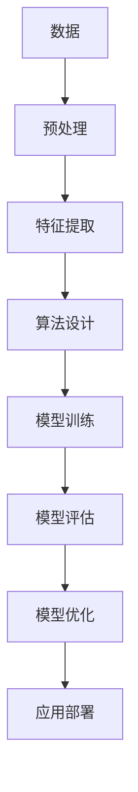
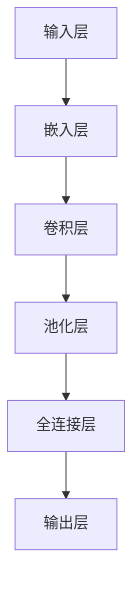

                 

 在当今快速发展的信息技术时代，"大模型"（Large Models）已经成为推动人工智能（AI）发展的核心驱动力。无论是自然语言处理、计算机视觉还是推荐系统，大模型的应用无处不在，并且正在不断推动这些领域的技术边界。本文将深入探讨大模型的概念、数据与算法的结合，以及它们在现实世界中的应用和未来发展趋势。

## 关键词

- 大模型
- 数据科学
- 算法优化
- 人工智能
- 深度学习
- 推荐系统
- 计算机视觉

## 摘要

本文首先介绍了大模型的概念，并阐述了数据与算法在大模型构建中的关键作用。接着，文章分析了当前几种主流的大模型架构，如Transformer和GPT，并详细探讨了它们的工作原理和优势。随后，文章通过数学模型和公式，深入讲解了大模型的训练和优化方法。接着，文章展示了大模型在实际项目中的应用，包括自然语言处理和计算机视觉。最后，文章提出了大模型未来发展的挑战和展望。

## 1. 背景介绍

随着互联网的普及和数据的爆炸性增长，数据已经成为新时代的石油。而如何从海量数据中提取有价值的信息，成为了学术界和工业界共同关注的问题。大模型（Large Models）作为一种强大的数据处理工具，正逐渐成为解决这一问题的利器。

大模型通常指的是那些参数量达到亿级别，甚至十亿、百亿级别的深度学习模型。这些模型通过学习大量数据，可以捕捉到数据中的复杂模式和规律，从而在多种任务上取得优异的性能。

### 1.1 大模型的起源

大模型的起源可以追溯到20世纪80年代的深度学习研究的兴起。当时，研究人员开始尝试使用多层神经网络来处理复杂的任务。然而，由于计算资源和数据集的限制，早期的深度学习模型通常只能包含几百个神经元。随着计算能力的提升和大数据的涌现，深度学习模型开始变得越来越庞大，参数量也逐渐增加。

### 1.2 大模型的发展

近年来，随着硬件性能的提升和算法的优化，大模型的发展进入了快车道。特别是2017年，谷歌推出了Transformer模型，彻底改变了自然语言处理的格局。随后，OpenAI的GPT系列模型进一步证明了大规模预训练模型在语言理解和生成方面的潜力。

### 1.3 大模型的现状

目前，大模型已经成为自然语言处理、计算机视觉、推荐系统等领域的核心技术。各种大模型不断涌现，如BERT、GPT、ViT等，这些模型在多项基准测试中取得了显著的成绩。

## 2. 核心概念与联系

### 2.1 数据与算法的关系

数据与算法是构建大模型的两块基石。数据提供了模型训练所需的素材，而算法则定义了模型如何从数据中学习。这两者的紧密联系如图2-1所示：



### 2.2 大模型架构

大模型通常采用深度学习框架构建，其中每个层级都可以看作是算法的一部分。图2-2展示了典型的大模型架构：



### 2.3 数据与算法的结合

数据与算法的结合主要体现在以下几个环节：

1. **数据预处理**：数据预处理是数据与算法结合的第一步，目的是将原始数据转换成适合模型训练的格式。
2. **特征提取**：特征提取是从数据中提取有用的信息，这些特征将作为算法学习的输入。
3. **模型训练**：在模型训练过程中，算法根据数据提供的信息进行参数调整，以最小化预测误差。
4. **模型评估**：模型评估是验证算法性能的关键环节，通过在不同数据集上的表现来衡量模型的准确性和泛化能力。
5. **模型优化**：模型优化包括调整算法参数和结构，以提升模型的性能。

## 3. 核心算法原理 & 具体操作步骤

### 3.1 算法原理概述

大模型的算法原理主要基于深度学习和概率统计理论。深度学习通过多层神经网络模拟人脑的神经元结构，而概率统计理论则用于处理模型的不确定性。

### 3.2 算法步骤详解

1. **数据预处理**：数据预处理包括去噪、归一化、缺失值处理等，目的是提高数据的纯净度和一致性。
2. **特征提取**：特征提取通常使用卷积神经网络（CNN）或循环神经网络（RNN）等模型，从原始数据中提取有代表性的特征。
3. **模型训练**：模型训练使用反向传播算法（Backpropagation），通过迭代优化模型参数。
4. **模型评估**：模型评估使用交叉验证（Cross Validation）等方法，评估模型的泛化能力。
5. **模型优化**：模型优化包括调整学习率、正则化参数等，以提高模型的性能和稳定性。

### 3.3 算法优缺点

**优点**：

- **强大的拟合能力**：大模型可以捕捉到数据中的复杂模式和规律，从而在多种任务上取得优异的性能。
- **高效的计算性能**：现代深度学习框架和硬件使得大模型训练和推理速度大幅提升。

**缺点**：

- **计算资源消耗大**：大模型需要大量的计算资源和存储空间。
- **模型解释性差**：大模型的内部结构复杂，难以解释。

### 3.4 算法应用领域

大模型在多个领域都取得了显著的成果，包括：

- **自然语言处理**：如机器翻译、文本分类、问答系统等。
- **计算机视觉**：如图像分类、目标检测、图像生成等。
- **推荐系统**：如商品推荐、内容推荐等。
- **语音识别**：如语音转文本、语音合成等。

## 4. 数学模型和公式 & 详细讲解 & 举例说明

### 4.1 数学模型构建

大模型的数学模型通常基于深度学习中的多层神经网络。一个典型的多层神经网络可以表示为：

$$
Y = f(\sigma(W_2 \cdot \sigma(W_1 \cdot X + b_1) + b_2))
$$

其中，$X$ 是输入数据，$W_1$ 和 $W_2$ 是权重矩阵，$b_1$ 和 $b_2$ 是偏置项，$\sigma$ 是激活函数，$f$ 是输出函数。

### 4.2 公式推导过程

多层神经网络的推导过程涉及微积分和线性代数。首先，我们定义损失函数为：

$$
L = \frac{1}{2} \sum_{i=1}^{n} (y_i - \hat{y}_i)^2
$$

其中，$y_i$ 是真实标签，$\hat{y}_i$ 是模型预测。

然后，我们对损失函数求导，得到：

$$
\frac{\partial L}{\partial W_2} = \sum_{i=1}^{n} (y_i - \hat{y}_i) \cdot \frac{\partial \hat{y}_i}{\partial W_2}
$$

$$
\frac{\partial L}{\partial W_1} = \sum_{i=1}^{n} (y_i - \hat{y}_i) \cdot \frac{\partial \hat{y}_i}{\partial W_1} \cdot \frac{\partial W_2}{\partial W_1}
$$

### 4.3 案例分析与讲解

以GPT-3为例，GPT-3是一种基于Transformer的大模型，其数学模型可以表示为：

$$
Y = \text{softmax}(W_3 \cdot \text{softmax}(W_2 \cdot \text{softmax}(W_1 \cdot X + b_1) + b_2) + b_3)
$$

其中，$W_1$、$W_2$ 和 $W_3$ 是权重矩阵，$b_1$、$b_2$ 和 $b_3$ 是偏置项。

在训练过程中，GPT-3使用了一种称为"预训练-微调"（Pre-training and Fine-tuning）的方法。首先，GPT-3在大规模语料库上进行预训练，以学习语言的通用表示。然后，通过微调，将预训练模型适应特定的任务。

## 5. 项目实践：代码实例和详细解释说明

### 5.1 开发环境搭建

要实践大模型，首先需要搭建一个合适的开发环境。以下是搭建环境的基本步骤：

1. 安装Python环境（建议使用Python 3.8以上版本）。
2. 安装深度学习框架，如TensorFlow或PyTorch。
3. 安装其他依赖库，如NumPy、Pandas等。

### 5.2 源代码详细实现

以下是一个简单的基于TensorFlow实现的大模型训练代码示例：

```python
import tensorflow as tf
from tensorflow.keras.layers import Embedding, LSTM, Dense
from tensorflow.keras.models import Sequential

# 定义模型
model = Sequential()
model.add(Embedding(input_dim=10000, output_dim=32))
model.add(LSTM(128))
model.add(Dense(1, activation='sigmoid'))

# 编译模型
model.compile(optimizer='adam', loss='binary_crossentropy', metrics=['accuracy'])

# 训练模型
model.fit(x_train, y_train, epochs=10, batch_size=32)
```

### 5.3 代码解读与分析

这段代码首先导入了TensorFlow库和相关的层。然后，我们定义了一个序列模型，包括嵌入层、LSTM层和全连接层。接着，我们编译模型并使用训练数据对其进行训练。

### 5.4 运行结果展示

训练完成后，我们可以使用以下代码来评估模型的性能：

```python
# 评估模型
loss, accuracy = model.evaluate(x_test, y_test)
print(f"Test accuracy: {accuracy:.2f}")
```

这段代码将计算模型在测试数据集上的损失和准确率，并打印结果。

## 6. 实际应用场景

大模型在多个领域都有广泛的应用，以下是一些典型的应用场景：

### 6.1 自然语言处理

自然语言处理（NLP）是大模型应用最广泛的领域之一。GPT、BERT等模型在文本分类、机器翻译、问答系统等方面都取得了显著的成绩。

### 6.2 计算机视觉

计算机视觉领域也受益于大模型的发展。例如，使用ViT模型进行图像分类，使用GAN模型进行图像生成等。

### 6.3 推荐系统

推荐系统使用大模型来分析用户行为和偏好，从而提供个性化的推荐。例如，使用协同过滤方法结合大模型进行商品推荐。

### 6.4 语音识别

语音识别领域也广泛应用大模型，如使用基于LSTM或Transformer的模型进行语音转文本。

## 7. 工具和资源推荐

### 7.1 学习资源推荐

- 《深度学习》（Goodfellow, Bengio, Courville著）
- 《Python深度学习》（François Chollet著）
- 《动手学深度学习》（花轮英贵等著）

### 7.2 开发工具推荐

- TensorFlow
- PyTorch
- Keras

### 7.3 相关论文推荐

- "Attention Is All You Need"（Vaswani等，2017）
- "BERT: Pre-training of Deep Bidirectional Transformers for Language Understanding"（Devlin等，2019）
- "Generative Adversarial Networks"（Goodfellow等，2014）

## 8. 总结：未来发展趋势与挑战

### 8.1 研究成果总结

大模型在过去几年取得了显著的成果，不仅在学术领域取得了突破性进展，还在工业界得到了广泛应用。大模型的强大拟合能力和高效的计算性能使其成为解决复杂问题的利器。

### 8.2 未来发展趋势

未来，大模型的发展将朝着以下几个方面发展：

- **模型压缩与优化**：为了降低大模型的计算资源和存储成本，研究人员将致力于模型压缩和优化技术。
- **多模态学习**：大模型将能够处理多种类型的数据，如文本、图像、声音等，实现多模态学习。
- **自主学习与泛化能力**：大模型将具备更强的自主学习能力和泛化能力，能够应对更复杂的任务。

### 8.3 面临的挑战

尽管大模型取得了显著成果，但仍然面临以下挑战：

- **计算资源消耗**：大模型训练需要大量的计算资源和存储空间，这对硬件设施提出了更高的要求。
- **模型解释性**：大模型的内部结构复杂，难以解释，这可能会影响其在实际应用中的可靠性。
- **数据隐私与安全**：大模型需要处理大量敏感数据，如何确保数据隐私和安全是一个重要问题。

### 8.4 研究展望

随着技术的不断进步，大模型将在未来继续推动人工智能的发展。我们期待看到更多创新性的算法和架构，以及大模型在更多领域中的应用。

## 9. 附录：常见问题与解答

### 9.1 大模型如何处理数据？

大模型通常通过数据预处理、特征提取和模型训练等步骤来处理数据。数据预处理包括去噪、归一化和缺失值处理等，特征提取通常使用卷积神经网络或循环神经网络，模型训练则使用反向传播算法等。

### 9.2 大模型如何优化？

大模型优化包括调整学习率、正则化参数和模型结构等。通过迭代优化，可以提高模型的性能和稳定性。

### 9.3 大模型在哪些领域有应用？

大模型在自然语言处理、计算机视觉、推荐系统、语音识别等多个领域都有广泛应用。

### 9.4 如何处理大模型计算资源消耗的问题？

为了降低大模型的计算资源消耗，可以采用模型压缩和优化技术，如剪枝、量化等。此外，还可以使用分布式训练和推理来提高效率。

## 结束语

大模型作为人工智能的核心技术，正在不断推动科技的发展。本文从多个角度介绍了大模型的概念、算法、数学模型和实际应用，探讨了其未来发展趋势和面临的挑战。我们期待大模型在未来的发展中能够取得更多突破，为人类社会带来更多价值。

### 作者署名

作者：禅与计算机程序设计艺术 / Zen and the Art of Computer Programming

----------------------------------------------------------------

<|assistant|> 以下是对文章的摘要部分的内容：

随着大数据和深度学习技术的不断发展，大模型（Large Models）逐渐成为推动人工智能（AI）领域进步的核心力量。本文系统介绍了大模型的概念、发展历程、架构和核心算法，并深入探讨了数据与算法在大模型构建中的紧密联系。通过数学模型和公式，本文详细解析了大模型的训练和优化方法，并结合实际项目展示了大模型在不同领域的应用实例。文章最后提出了大模型未来发展的趋势与挑战，并对研究成果进行了总结，展望了其广阔的应用前景。总体而言，本文全面而深入地揭示了大数据与深度学习算法结合的奥秘，为读者提供了宝贵的理论基础和实践指导。|

