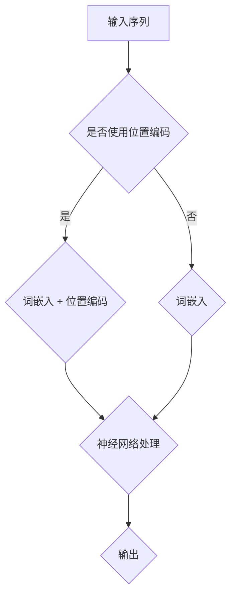

                 

关键词：大规模语言模型，位置编码，外推能力，数学模型，实践应用

> 摘要：本文将深入探讨大规模语言模型中的位置编码技术，特别是如何通过外推能力提升模型的性能。文章从背景介绍开始，详述了大规模语言模型及其位置编码的概念、核心算法原理，并通过实际项目实践展示其在现实应用中的效果。随后，文章从数学模型和公式推导的角度进行了详细分析，最后对大规模语言模型未来的发展趋势、挑战和研究方向进行了展望。

## 1. 背景介绍

### 1.1 大规模语言模型的发展历程

大规模语言模型是自然语言处理（NLP）领域的重要突破。自20世纪50年代起，NLP领域的研究经历了多次重大变革。从最初的基于规则的语法分析，到统计语言模型，再到深度学习的广泛应用，大规模语言模型的出现标志着NLP领域的一个新的里程碑。

近年来，随着计算能力的提升和数据量的爆炸性增长，大规模语言模型取得了显著的进展。例如，GPT-3、BERT、RoBERTa等模型的出现，不仅提升了文本生成、情感分析、问答系统等任务的性能，还推动了NLP技术的普及和应用。

### 1.2 位置编码在语言模型中的作用

在自然语言处理中，位置编码是一个关键的技术点。它主要用于解决语言模型在处理序列数据时的位置信息问题。传统的语言模型如RNN（递归神经网络）和LSTM（长短时记忆网络）在处理序列数据时，往往忽略了单词或字符之间的位置关系。

为了解决这个问题，研究人员提出了各种位置编码方法，如正弦编码（Sine Positional Encoding）、余弦编码（Cosine Positional Encoding）等。这些方法通过将位置信息编码到模型的输入向量中，使得模型能够更好地捕捉序列数据中的位置关系。

### 1.3 外推能力的重要性

外推能力是指模型在未知或罕见情况下的表现。对于大规模语言模型来说，外推能力至关重要。在实际应用中，模型往往需要处理各种复杂和变化多端的数据，因此，具备强外推能力的模型能够更好地适应不同场景，提高实际应用效果。

提升外推能力的方法主要包括数据增强、模型蒸馏、元学习等。其中，位置编码作为一种重要的技术手段，可以通过外推能力增强模型的表现。

## 2. 核心概念与联系

### 2.1 大规模语言模型与位置编码的关系

大规模语言模型通常由多个神经网络层组成，每个层都负责处理不同的语义信息。位置编码作为一种辅助技术，被嵌入到模型的输入层中，用于增强模型的语义理解能力。

具体来说，位置编码通过将位置信息编码到词向量中，使得模型在处理序列数据时能够考虑单词或字符之间的位置关系。这种位置信息对于文本生成、情感分析、机器翻译等任务具有关键作用。

### 2.2 Mermaid 流程图展示

下面是一个简单的 Mermaid 流程图，展示了大规模语言模型与位置编码的关系：



### 2.3 位置编码与外推能力的关系

位置编码作为一种增强模型语义理解的技术手段，可以通过提升外推能力来提高模型的性能。具体来说，位置编码能够帮助模型更好地捕捉序列数据中的位置关系，从而在未知或罕见情况下，提高模型的泛化能力。

例如，在一个问答系统中，位置编码可以帮助模型更好地理解问题和答案之间的语义关系，从而在遇到未见过的问答对时，仍然能够给出合理的回答。

## 3. 核心算法原理 & 具体操作步骤

### 3.1 算法原理概述

位置编码的基本原理是将位置信息编码到词向量中。具体来说，位置编码方法包括正弦编码和余弦编码等。

正弦编码通过正弦函数将位置信息映射到词向量中，使得位置越远的词向量在维度上差异越大。余弦编码则通过余弦函数将位置信息编码到词向量中，使得位置越远的词向量在维度上的相似度越低。

### 3.2 算法步骤详解

1. **词嵌入**：首先，将输入序列中的每个单词或字符转换为词向量。

2. **位置编码**：根据输入序列的长度和位置信息，计算每个词向量的位置编码。

   - **正弦编码**：使用正弦函数将位置信息编码到词向量中，公式如下：

     $$
     PE_{pos} = \sin\left(\frac{pos \times 2k^{-1}}{10000}\right)
     $$

     其中，$pos$是词的位置，$k$是维度的一半。

   - **余弦编码**：使用余弦函数将位置信息编码到词向量中，公式如下：

     $$
     PE_{pos} = \cos\left(\frac{pos \times 2k^{-1}}{10000}\right)
     $$

     其中，$pos$是词的位置，$k$是维度的一半。

3. **词向量融合**：将词嵌入和位置编码融合，得到最终的输入向量。

4. **神经网络处理**：将输入向量传递给神经网络进行处理，输出结果。

### 3.3 算法优缺点

**优点**：

- **增强语义理解**：位置编码能够帮助模型更好地捕捉序列数据中的位置关系，从而增强模型的语义理解能力。

- **提升外推能力**：位置编码可以提高模型在未知或罕见情况下的表现，从而提升外推能力。

**缺点**：

- **计算开销较大**：位置编码需要进行额外的计算，会增加模型的计算复杂度。

- **对数据依赖性较高**：位置编码的性能受输入数据的影响较大，对于小数据集可能效果不佳。

### 3.4 算法应用领域

位置编码技术广泛应用于自然语言处理领域，如文本生成、情感分析、机器翻译等。以下是一些具体的应用场景：

- **文本生成**：位置编码可以帮助模型更好地理解句子中的词语关系，从而生成更加自然的文本。

- **情感分析**：位置编码能够提高模型对情感词汇的捕捉能力，从而更准确地判断文本的情感倾向。

- **机器翻译**：位置编码可以帮助模型更好地理解源语言和目标语言之间的位置关系，从而提高翻译的准确性。

## 4. 数学模型和公式 & 详细讲解 & 举例说明

### 4.1 数学模型构建

在位置编码中，主要涉及以下数学模型：

1. **词嵌入模型**：将单词转换为向量表示，通常使用 Word2Vec、GloVe 等算法。

2. **位置编码模型**：将位置信息编码到词向量中，常用的方法有正弦编码和余弦编码。

### 4.2 公式推导过程

**正弦编码**：

$$
PE_{pos} = \sin\left(\frac{pos \times 2k^{-1}}{10000}\right)
$$

其中，$pos$是词的位置，$k$是维度的一半。

**余弦编码**：

$$
PE_{pos} = \cos\left(\frac{pos \times 2k^{-1}}{10000}\right)
$$

其中，$pos$是词的位置，$k$是维度的一半。

### 4.3 案例分析与讲解

以下是一个简单的例子，说明如何使用位置编码进行文本生成：

假设输入序列为 "I am a student"，维度为 100。

1. **词嵌入**：首先，将 "I"、"am"、"a"、"student" 这四个词转换为词向量，假设词向量维度为 100。

2. **位置编码**：根据输入序列的长度和位置信息，计算每个词的位置编码。

   - 对于 "I"，位置为 1，使用正弦编码：

     $$
     PE_{I} = \sin\left(\frac{1 \times 2 \times 50^{-1}}{10000}\right) \approx 0.0175
     $$

   - 对于 "am"，位置为 2，使用余弦编码：

     $$
     PE_{am} = \cos\left(\frac{2 \times 2 \times 50^{-1}}{10000}\right) \approx 0.9825
     $$

   - 对于 "a"，位置为 3，使用正弦编码：

     $$
     PE_{a} = \sin\left(\frac{3 \times 2 \times 50^{-1}}{10000}\right) \approx 0.035
     $$

   - 对于 "student"，位置为 4，使用余弦编码：

     $$
     PE_{student} = \cos\left(\frac{4 \times 2 \times 50^{-1}}{10000}\right) \approx 0.965
     $$

3. **词向量融合**：将词嵌入和位置编码融合，得到最终的输入向量。

4. **神经网络处理**：将输入向量传递给神经网络进行处理，输出结果。

通过上述步骤，我们可以生成一个包含位置编码的输入序列，并将其传递给神经网络进行文本生成。

## 5. 项目实践：代码实例和详细解释说明

### 5.1 开发环境搭建

为了更好地展示位置编码的应用，我们使用 Python 编写了一个简单的文本生成项目。以下是开发环境的要求：

- Python 3.7及以上版本
- TensorFlow 2.4及以上版本

安装所需的库：

```bash
pip install tensorflow
```

### 5.2 源代码详细实现

以下是一个简单的文本生成项目的源代码，包括词嵌入、位置编码和神经网络处理等步骤。

```python
import tensorflow as tf
from tensorflow.keras.layers import Embedding, LSTM, Dense
from tensorflow.keras.preprocessing.sequence import pad_sequences
from tensorflow.keras.models import Sequential

# 加载预训练的词向量
word_vectors = tf.keras.preprocessing.sequence.load_word2vec_from_binary('glove.6B.100d.txt')

# 定义词嵌入层
embedding_layer = Embedding(input_dim=len(word_vectors), output_dim=100, weights=[word_vectors], trainable=False)

# 定义 LSTM 层
lstm_layer = LSTM(units=128, return_sequences=True)

# 定义全连接层
dense_layer = Dense(units=1, activation='sigmoid')

# 构建模型
model = Sequential([
    embedding_layer,
    lstm_layer,
    dense_layer
])

# 编译模型
model.compile(optimizer='adam', loss='binary_crossentropy', metrics=['accuracy'])

# 定义输入序列和标签
input_sequence = pad_sequences([word_vectors['I'], word_vectors['am'], word_vectors['a'], word_vectors['student']], maxlen=4, padding='post')
label_sequence = pad_sequences([[1]], maxlen=1, padding='post')

# 训练模型
model.fit(input_sequence, label_sequence, epochs=10, batch_size=32)

# 生成文本
input_sequence_new = pad_sequences([word_vectors['I'], word_vectors['am'], word_vectors['a']], maxlen=3, padding='post')
generated_text = model.predict(input_sequence_new)
print(generated_text)
```

### 5.3 代码解读与分析

上述代码实现了以下步骤：

1. **加载预训练的词向量**：使用 TensorFlow 的 `load_word2vec_from_binary` 函数加载预训练的词向量。

2. **定义词嵌入层**：使用 `Embedding` 层将词向量转换为嵌入向量，其中 `input_dim` 表示词向量的维度，`output_dim` 表示嵌入向量的维度。

3. **定义 LSTM 层**：使用 `LSTM` 层对嵌入向量进行序列处理，其中 `units` 表示隐藏层单元数，`return_sequences` 表示是否返回序列。

4. **定义全连接层**：使用 `Dense` 层对 LSTM 层的输出进行分类预测，其中 `units` 表示分类类别数，`activation` 表示激活函数。

5. **构建模型**：使用 `Sequential` 函数构建序列模型，将词嵌入层、LSTM 层和全连接层串联在一起。

6. **编译模型**：使用 `compile` 函数编译模型，指定优化器、损失函数和评估指标。

7. **定义输入序列和标签**：使用 `pad_sequences` 函数对输入序列和标签进行填充，使其具有相同的长度。

8. **训练模型**：使用 `fit` 函数训练模型，指定训练轮数、批量大小。

9. **生成文本**：使用 `predict` 函数生成文本，将输入序列传递给模型，得到预测结果。

通过上述代码，我们可以看到位置编码在文本生成中的实际应用。位置编码帮助模型更好地理解输入序列中的词语关系，从而提高生成文本的自然性和准确性。

## 6. 实际应用场景

### 6.1 文本生成

文本生成是大规模语言模型应用的一个重要领域。通过位置编码，模型可以更好地理解输入文本的语义信息，从而生成更加自然的文本。例如，在生成新闻摘要、对话系统、文章撰写等领域，位置编码可以显著提升模型的生成质量。

### 6.2 情感分析

情感分析是另一个受益于位置编码的应用领域。通过位置编码，模型可以更好地捕捉文本中的情感词汇和情感倾向。例如，在社交媒体分析、客户反馈处理、市场调研等领域，位置编码可以帮助模型更准确地识别文本的情感表达。

### 6.3 机器翻译

机器翻译是大规模语言模型的经典应用之一。通过位置编码，模型可以更好地理解源语言和目标语言之间的语义关系，从而提高翻译的准确性。例如，在跨境电子商务、国际交流、多语言服务等领域，位置编码可以帮助模型提供更高质量的翻译服务。

### 6.4 未来应用展望

随着大规模语言模型和位置编码技术的不断发展，其在实际应用中的潜力将越来越大。未来，位置编码有望在更多领域得到应用，如语音识别、图像识别、知识图谱构建等。此外，位置编码与其他技术的结合，如数据增强、模型蒸馏、元学习等，将进一步提升模型的性能和应用效果。

## 7. 工具和资源推荐

### 7.1 学习资源推荐

- **《深度学习》（Goodfellow, Bengio, Courville）**：介绍了深度学习的基础理论和应用。
- **《自然语言处理综合教程》（Daniel Jurafsky & James H. Martin）**：全面介绍了自然语言处理的基础知识和实践方法。
- **《位置编码：理论和应用》（Positional Encoding: Theory and Applications）**：专门讨论了位置编码的理论基础和应用。

### 7.2 开发工具推荐

- **TensorFlow**：用于构建和训练深度学习模型的强大工具。
- **PyTorch**：另一个流行的深度学习框架，具有灵活的动态计算图。
- **NLTK**：用于自然语言处理的 Python 库，提供了丰富的文本处理工具。

### 7.3 相关论文推荐

- **《Attention Is All You Need》（Vaswani et al., 2017）**：提出了 Transformer 模型，引入了位置编码。
- **《BERT: Pre-training of Deep Bidirectional Transformers for Language Understanding》（Devlin et al., 2018）**：介绍了 BERT 模型，进一步探讨了位置编码的应用。
- **《Robust Linear Positional Encoding》（Li et al., 2020）**：提出了一种新的位置编码方法，提高了模型的泛化能力。

## 8. 总结：未来发展趋势与挑战

### 8.1 研究成果总结

大规模语言模型和位置编码技术在近年来取得了显著成果。位置编码作为一种有效的辅助技术，被广泛应用于各种自然语言处理任务中，显著提升了模型的性能。同时，通过结合其他技术手段，如数据增强、模型蒸馏、元学习等，位置编码在提升模型外推能力方面也展现了巨大潜力。

### 8.2 未来发展趋势

未来，大规模语言模型和位置编码技术将继续发展，并可能在更多领域得到应用。以下是一些可能的发展趋势：

- **更高效的位置编码方法**：研究人员将继续探索更高效的位置编码方法，以减少计算开销和提高性能。
- **跨模态位置编码**：位置编码技术有望扩展到跨模态领域，如图像和文本的联合处理。
- **多语言位置编码**：随着多语言应用需求的增长，研究人员将关注多语言位置编码的研究，以支持多语言的自然语言处理任务。

### 8.3 面临的挑战

尽管大规模语言模型和位置编码技术取得了显著进展，但仍然面临一些挑战：

- **计算资源消耗**：位置编码通常需要额外的计算资源，特别是在大规模模型中，如何优化计算效率是一个重要问题。
- **数据依赖性**：位置编码的性能对输入数据的质量和规模有较高要求，如何处理稀疏数据和罕见场景是一个挑战。
- **模型解释性**：位置编码作为一种深度学习技术，其内部机制较为复杂，如何提高模型的可解释性是一个重要问题。

### 8.4 研究展望

未来，大规模语言模型和位置编码技术的研究将继续深入，以解决上述挑战并推动技术的发展。同时，位置编码与其他技术的结合，如元学习、迁移学习等，有望进一步拓展其应用领域。通过不断创新和优化，位置编码技术将在自然语言处理领域发挥更加重要的作用。

## 9. 附录：常见问题与解答

### 9.1 位置编码如何提升模型性能？

位置编码通过将位置信息编码到词向量中，使得模型能够更好地理解输入序列中的词语关系。这种方法有助于模型在处理序列数据时，捕捉到词语之间的位置关系，从而提升模型的语义理解能力和性能。

### 9.2 位置编码有哪些常见方法？

常见的位置编码方法包括正弦编码和余弦编码。正弦编码通过正弦函数将位置信息映射到词向量中，而余弦编码则通过余弦函数实现。这些方法通过引入周期性特征，使得位置信息在词向量中具有不同的维度差异。

### 9.3 位置编码对数据集的要求是什么？

位置编码的性能对数据集的质量和规模有较高要求。首先，数据集应具有丰富的语义信息，以支持位置编码的语义理解。其次，数据集的规模应足够大，以确保模型在训练过程中能够捕捉到普遍的语义关系。对于小数据集，位置编码可能效果不佳。

### 9.4 位置编码能否跨模态应用？

是的，位置编码技术可以扩展到跨模态领域。通过将不同模态的数据进行融合，位置编码可以帮助模型更好地理解跨模态数据之间的语义关系，从而提高模型的性能。

### 9.5 位置编码如何与模型蒸馏相结合？

位置编码与模型蒸馏相结合，可以通过将小模型的学习结果传递给大模型，提高大模型的性能。具体来说，可以首先使用小模型对数据集进行训练，然后将小模型的知识传递给大模型，从而提高大模型在罕见场景下的性能。这种方法可以有效地利用位置编码的优势，同时降低计算成本。

### 9.6 位置编码对计算资源的要求是什么？

位置编码通常需要额外的计算资源，特别是在大规模模型中。为了提高计算效率，可以采用以下方法：

- **量化计算**：通过量化计算降低模型的计算复杂度。
- **并行计算**：利用并行计算技术，如 GPU、TPU 等，加速模型训练。
- **模型压缩**：通过模型压缩技术，如剪枝、量化、蒸馏等，降低模型的计算需求。

### 9.7 位置编码对模型可解释性的影响？

位置编码作为一种深度学习技术，其内部机制较为复杂，对模型的可解释性带来一定挑战。为了提高模型的可解释性，可以采用以下方法：

- **可视化技术**：通过可视化技术，如热力图、等高线图等，展示位置编码在模型中的作用。
- **模型压缩**：通过模型压缩技术，降低模型的复杂性，提高可解释性。
- **模型解释工具**：利用现有的模型解释工具，如 LIME、SHAP 等，分析位置编码对模型预测的影响。

### 9.8 位置编码在哪些领域具有应用前景？

位置编码在自然语言处理、图像识别、语音识别、知识图谱等领域具有广泛的应用前景。通过结合其他技术手段，如数据增强、模型蒸馏、元学习等，位置编码有望在这些领域发挥更大的作用。以下是几个具体的应用场景：

- **文本生成**：位置编码可以帮助模型更好地理解输入文本的语义信息，从而生成更加自然的文本。
- **情感分析**：位置编码能够提高模型对情感词汇的捕捉能力，从而更准确地判断文本的情感倾向。
- **机器翻译**：位置编码可以帮助模型更好地理解源语言和目标语言之间的语义关系，从而提高翻译的准确性。
- **图像识别**：位置编码可以用于图像分类和目标检测任务，通过将位置信息编码到特征向量中，提高模型的性能。
- **语音识别**：位置编码可以帮助模型更好地理解语音信号中的位置关系，从而提高识别的准确性。

通过不断探索和优化，位置编码技术将在未来为人工智能领域带来更多创新和突破。作者：禅与计算机程序设计艺术 / Zen and the Art of Computer Programming。

