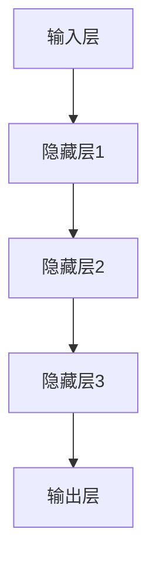

                 

关键词：大规模语言模型、前馈神经网络、深度学习、神经网络架构、训练技巧、优化算法、应用领域

## 摘要

本文旨在深入探讨大规模语言模型的前馈层，从理论基础到实践应用进行全面解析。文章首先介绍了大规模语言模型的基本概念和前馈层的重要性，随后详细阐述了前馈层的算法原理和实现步骤。此外，本文还分析了前馈层的优缺点以及其在各个应用领域的实际应用案例。通过本文的阅读，读者将对大规模语言模型的前馈层有更深刻的理解，并能够将其应用于实际问题中。

## 1. 背景介绍

随着互联网和大数据的飞速发展，自然语言处理（NLP）已经成为计算机科学领域的重要分支。在NLP中，大规模语言模型扮演着至关重要的角色。这些模型能够通过对海量文本数据的训练，自动学习并生成符合语言规律和语义逻辑的文本，从而广泛应用于机器翻译、文本摘要、问答系统、情感分析等多个领域。

前馈神经网络（FNN）是大规模语言模型的基础架构之一，它由输入层、隐藏层和输出层组成。输入层接收外部输入信号，隐藏层通过一系列加权求和和激活函数的运算，生成中间结果，输出层将最终结果输出。这种简单的结构使得前馈神经网络在处理线性可分问题方面表现出色，但也存在着梯度消失和梯度爆炸等局限性。

本文将重点关注大规模语言模型中的前馈层，深入探讨其算法原理、实现步骤、优缺点及其在各个领域的应用。

### 1.1 语言模型的演进

语言模型的演进历程大致可以分为三个阶段：基于规则的方法、统计方法、以及深度学习方法。

早期，基于规则的方法通过手工编写语法规则和词典，试图构建出能够处理自然语言的系统。然而，这种方法在处理复杂和灵活的语言现象时显得力不从心。随后，统计方法开始占据主导地位，通过统计语言中的频率分布和概率关系，生成能够自适应变化的模型。这一阶段的代表性工作包括N-gram模型、隐马尔可夫模型（HMM）和条件随机场（CRF）等。

随着计算机性能的不断提升和数据量的爆炸式增长，深度学习方法逐渐崭露头角。特别是卷积神经网络（CNN）和递归神经网络（RNN）的提出，使得语言模型的性能得到了显著提升。然而，RNN在面对长距离依赖问题时存在梯度消失和梯度爆炸等问题。为了解决这些问题，研究人员提出了长短期记忆网络（LSTM）和门控循环单元（GRU）等改进模型。近年来，基于Transformer的模型如BERT、GPT等，在多个NLP任务中取得了前所未有的成绩，标志着深度学习在语言模型领域的又一次革命。

### 1.2 前馈神经网络的原理和结构

前馈神经网络是一种典型的深度学习模型，其基本原理是通过多层非线性变换，将输入映射到输出。在前馈神经网络中，信息从输入层流向输出层，中间经过一个或多个隐藏层。每一层中的每个神经元都会接收前一层的输出，并通过加权求和和激活函数的运算，产生新的输出，从而实现数据的逐步抽象和特征提取。

前馈神经网络的常见结构包括多层感知机（MLP）、卷积神经网络（CNN）和循环神经网络（RNN）等。MLP是一种简单的全连接神经网络，适合处理结构化数据；CNN通过卷积操作提取图像中的特征，广泛应用于计算机视觉领域；RNN通过递归连接实现数据的序列建模，适合处理序列数据。

在前馈神经网络中，输入层接收外部输入信号，输出层将最终结果输出。隐藏层位于输入层和输出层之间，通过一系列加权求和和激活函数的运算，生成中间结果。隐藏层的数量和神经元个数可以根据具体任务进行调整，以平衡模型复杂度和训练性能。

前馈神经网络的核心在于激活函数的选择。常见的激活函数包括Sigmoid、Tanh、ReLU等。Sigmoid和Tanh函数在输出范围上是有限制的，而ReLU函数在训练初期具有更好的收敛性能。

### 1.3 前馈神经网络在自然语言处理中的应用

前馈神经网络在自然语言处理（NLP）中有着广泛的应用。通过将文本数据转化为向量表示，前馈神经网络可以处理各种NLP任务，如文本分类、情感分析、机器翻译等。

在文本分类任务中，前馈神经网络可以学习文本的特征表示，并将其映射到标签空间。通过训练，模型能够自动识别不同类别的文本特征，从而实现自动分类。

在情感分析任务中，前馈神经网络通过对文本的情感倾向进行建模，可以判断文本的情感极性。这有助于构建智能客服系统、舆情监测等应用。

在机器翻译任务中，前馈神经网络通过学习源语言和目标语言的对应关系，可以实现自动翻译。通过预训练和微调，模型可以在多种语言对上实现高效翻译。

总之，前馈神经网络在自然语言处理中具有重要的地位，通过不断优化和改进，其在各个应用领域的性能不断提高，为人工智能的发展做出了巨大贡献。

## 2. 核心概念与联系

### 2.1 大规模语言模型

大规模语言模型是一种基于深度学习的自然语言处理模型，它通过大规模文本数据的学习，自动捕捉语言中的规律和语义信息。这种模型可以应用于多种NLP任务，如文本分类、情感分析、机器翻译等。

大规模语言模型的核心组件包括输入层、隐藏层和输出层。输入层接收文本数据，将其转换为向量表示；隐藏层通过多层非线性变换，逐步提取文本的特征和语义信息；输出层将最终结果映射到具体的标签或句子。

在训练过程中，大规模语言模型通过反向传播算法不断调整模型的参数，以降低预测误差。这一过程需要大量的计算资源和时间，但随着计算能力的提升，这一瓶颈正在逐渐被突破。

### 2.2 前馈层

前馈层是大规模语言模型中的核心部分，它负责将输入数据通过多层非线性变换，逐步提取文本的特征和语义信息。前馈层通常由输入层、隐藏层和输出层组成，其中输入层接收文本数据，隐藏层通过一系列加权求和和激活函数的运算，生成中间结果，输出层将最终结果输出。

前馈层的核心组件包括神经元、权重、偏置和激活函数。神经元是前馈层的基本计算单元，通过加权求和和激活函数的运算，将输入映射到输出。权重和偏置用于调整神经元的敏感度，激活函数则用于引入非线性特性。

### 2.3 前馈层的 Mermaid 流程图

为了更好地理解前馈层的工作原理，我们可以使用 Mermaid 流程图来展示其结构。以下是一个简化的前馈层 Mermaid 流程图：



在这个流程图中，输入层接收外部输入信号，通过一系列隐藏层进行特征提取和抽象，最终输出层将结果映射到具体的标签或句子。

### 2.4 前馈层的核心概念原理

前馈层的核心概念包括神经元、权重、偏置和激活函数。神经元是前馈层的基本计算单元，通过加权求和和激活函数的运算，将输入映射到输出。权重和偏置用于调整神经元的敏感度，激活函数则用于引入非线性特性。

神经元的基本运算过程如下：

1. 输入数据通过权重矩阵与前一层的输出进行加权求和，得到中间结果。
2. 将中间结果加上偏置项，得到新的中间结果。
3. 通过激活函数对中间结果进行非线性变换，得到神经元的输出。

权重矩阵和偏置项是神经网络的两个重要参数，它们的初始化和调整对于模型的性能至关重要。常用的初始化方法包括高斯分布、均值为零、方差为1的初始化方法。在训练过程中，通过反向传播算法，不断调整权重和偏置项，以降低预测误差。

激活函数是前馈层的另一个关键组件，它用于引入非线性特性。常见的激活函数包括Sigmoid、Tanh、ReLU等。Sigmoid和Tanh函数在输出范围上是有限制的，而ReLU函数在训练初期具有更好的收敛性能。

通过前馈层的多次迭代，模型可以逐步提取文本的特征和语义信息，实现高效的文本分类、情感分析、机器翻译等任务。

## 3. 核心算法原理 & 具体操作步骤

### 3.1 算法原理概述

前馈神经网络（FNN）是一种经典的深度学习模型，其基本原理是通过多层非线性变换，将输入映射到输出。在FNN中，信息从输入层流向输出层，中间经过一个或多个隐藏层。每一层中的每个神经元都会接收前一层的输出，并通过加权求和和激活函数的运算，生成新的输出。这种结构使得FNN能够处理复杂的非线性问题，广泛应用于图像识别、自然语言处理等领域。

前馈神经网络的训练过程主要依赖于梯度下降算法，通过不断调整模型的参数（权重和偏置），使模型在训练数据上的预测误差最小化。梯度下降算法的核心思想是沿着误差函数的负梯度方向进行参数更新，以达到最优解。

### 3.2 算法步骤详解

#### 3.2.1 初始化参数

在训练前，需要初始化模型的参数，包括权重矩阵和偏置项。常用的初始化方法有高斯分布、均值为零、方差为1的初始化方法。初始化参数的目的是避免模型在训练过程中陷入局部最优。

#### 3.2.2 前向传播

前向传播是前馈神经网络的核心步骤，其目的是将输入映射到输出。具体过程如下：

1. 输入数据通过输入层进入模型。
2. 输入层将数据传递到隐藏层，隐藏层通过加权求和和激活函数的运算，生成新的输出。
3. 重复上述过程，直到输出层生成最终结果。

在前向传播过程中，每个神经元都会计算其输入的加权和，然后通过激活函数进行非线性变换，得到新的输出。这个过程可以表示为：

$$
z_i = \sum_{j} w_{ij}x_j + b_i
$$

其中，$z_i$ 表示第 $i$ 个神经元的加权和，$w_{ij}$ 表示连接输入层和隐藏层的权重，$x_j$ 表示隐藏层中第 $j$ 个神经元的输出，$b_i$ 表示第 $i$ 个神经元的偏置项。

#### 3.2.3 计算损失函数

在前向传播的基础上，计算模型在训练数据上的损失函数。常用的损失函数有均方误差（MSE）、交叉熵（CE）等。损失函数反映了模型预测值与实际值之间的差距，是评估模型性能的重要指标。

#### 3.2.4 反向传播

反向传播是梯度下降算法的核心步骤，通过计算损失函数关于模型参数的梯度，更新模型参数，使模型在训练数据上的预测误差最小化。具体过程如下：

1. 计算输出层的误差，将误差反向传播到隐藏层。
2. 更新隐藏层的权重和偏置项，使误差减小。
3. 重复上述过程，直到所有层的权重和偏置项更新完毕。

在反向传播过程中，需要计算每个参数关于损失函数的梯度。梯度反映了参数对损失函数的影响程度，是参数更新的依据。梯度计算公式如下：

$$
\frac{\partial L}{\partial w_{ij}} = \frac{\partial L}{\partial z_i} \cdot \frac{\partial z_i}{\partial w_{ij}}
$$

其中，$L$ 表示损失函数，$w_{ij}$ 表示输入层和隐藏层之间的权重，$\frac{\partial L}{\partial z_i}$ 表示隐藏层中第 $i$ 个神经元的误差，$\frac{\partial z_i}{\partial w_{ij}}$ 表示第 $i$ 个神经元误差关于权重 $w_{ij}$ 的梯度。

#### 3.2.5 更新参数

在计算完梯度后，使用梯度下降算法更新模型参数。更新公式如下：

$$
w_{ij} \leftarrow w_{ij} - \alpha \cdot \frac{\partial L}{\partial w_{ij}}
$$

其中，$\alpha$ 表示学习率，用于调整梯度下降的步长。学习率的选取对模型的收敛速度和稳定性有很大影响。

#### 3.2.6 重复训练

重复前向传播、计算损失函数、反向传播和参数更新的过程，直到满足训练停止条件。常见的停止条件有：达到预设的训练迭代次数、损失函数收敛到预设的阈值、验证集上的误差不再下降等。

### 3.3 算法优缺点

#### 优点

1. **结构简单**：前馈神经网络结构简单，易于理解和实现。
2. **适用范围广**：前馈神经网络适用于多种类型的任务，如分类、回归、图像识别等。
3. **计算效率高**：前向传播和反向传播过程简单，计算效率较高。

#### 缺点

1. **梯度消失和梯度爆炸**：在训练过程中，梯度可能会消失或爆炸，导致模型难以收敛。
2. **局部最优**：前馈神经网络可能陷入局部最优，难以找到全局最优解。

### 3.4 算法应用领域

前馈神经网络在自然语言处理、计算机视觉、音频处理等多个领域有着广泛的应用。

#### 自然语言处理

1. **文本分类**：前馈神经网络可以用于文本分类任务，如情感分析、主题分类等。
2. **机器翻译**：前馈神经网络通过学习源语言和目标语言的对应关系，可以实现自动翻译。
3. **命名实体识别**：前馈神经网络可以识别文本中的命名实体，如人名、地名等。

#### 计算机视觉

1. **图像分类**：前馈神经网络可以用于图像分类任务，如图像识别、物体检测等。
2. **目标识别**：前馈神经网络可以识别图像中的目标，如行人检测、车辆检测等。

#### 音频处理

1. **语音识别**：前馈神经网络可以用于语音识别任务，如自动语音识别、语音合成等。

### 3.5 案例分析

#### 文本分类

假设我们有一个文本分类任务，需要将新闻文章分类为政治、经济、科技等类别。我们使用前馈神经网络来实现这个任务。

1. **数据预处理**：首先，我们需要对文本数据进行预处理，包括分词、去停用词、词向量化等操作。
2. **构建模型**：然后，我们构建一个前馈神经网络模型，包括输入层、隐藏层和输出层。输入层接收词向量表示，隐藏层通过多层非线性变换提取特征，输出层将特征映射到类别。
3. **训练模型**：使用训练数据对模型进行训练，通过反向传播算法不断调整模型参数，使模型在训练数据上的分类误差最小化。
4. **评估模型**：在验证集上评估模型的性能，通过准确率、召回率、F1值等指标衡量模型的效果。

#### 机器翻译

假设我们有一个机器翻译任务，需要将英语翻译为法语。我们使用前馈神经网络来实现这个任务。

1. **数据预处理**：首先，我们需要对源语言和目标语言的数据进行预处理，包括分词、词向量化等操作。
2. **构建模型**：然后，我们构建一个双向前馈神经网络模型，包括输入层、隐藏层和输出层。输入层接收源语言词向量表示，隐藏层通过多层非线性变换提取特征，输出层将特征映射到目标语言词向量表示。
3. **训练模型**：使用训练数据对模型进行训练，通过反向传播算法不断调整模型参数，使模型在训练数据上的翻译误差最小化。
4. **评估模型**：在验证集上评估模型的性能，通过BLEU分数等指标衡量模型的效果。

## 4. 数学模型和公式 & 详细讲解 & 举例说明

### 4.1 数学模型构建

大规模语言模型的前馈层通过数学模型来实现，该模型主要由多层神经元和相应的激活函数构成。以下是构建该模型所需的基本数学公式和概念。

#### 神经元激活函数

前馈层中的每个神经元通过以下公式计算其输出：

$$
a_i = \sigma(z_i) = \frac{1}{1 + e^{-z_i}}
$$

其中，$a_i$ 是神经元 $i$ 的输出，$z_i$ 是神经元的加权和，$\sigma$ 是Sigmoid函数。

#### 前向传播

前馈神经网络的前向传播过程涉及输入层、隐藏层和输出层。每个神经元的输出可以用以下公式表示：

$$
z_{j}^{(l)} = \sum_{i} w_{ji}^{(l)} a_{i}^{(l-1)} + b_{j}^{(l)}
$$

其中，$z_{j}^{(l)}$ 是第 $l$ 层第 $j$ 个神经元的加权和，$w_{ji}^{(l)}$ 是连接第 $l-1$ 层第 $i$ 个神经元和第 $l$ 层第 $j$ 个神经元的权重，$a_{i}^{(l-1)}$ 是第 $l-1$ 层第 $i$ 个神经元的输出，$b_{j}^{(l)}$ 是第 $l$ 层第 $j$ 个神经元的偏置。

#### 损失函数

在前馈层中，常用的损失函数包括均方误差（MSE）和交叉熵（CE）。均方误差用于回归任务，交叉熵用于分类任务。

对于回归任务，损失函数 $L$ 表示为：

$$
L = \frac{1}{m} \sum_{i=1}^{m} (y_i - \hat{y}_i)^2
$$

其中，$y_i$ 是真实标签，$\hat{y}_i$ 是预测值，$m$ 是样本数量。

对于分类任务，损失函数 $L$ 表示为：

$$
L = -\frac{1}{m} \sum_{i=1}^{m} \sum_{j=1}^{K} y_{ij} \log (\hat{y}_{ij})
$$

其中，$y_{ij}$ 是第 $i$ 个样本属于第 $j$ 个类别的真实标签（0或1），$\hat{y}_{ij}$ 是第 $i$ 个样本属于第 $j$ 个类别的预测概率，$K$ 是类别数量。

### 4.2 公式推导过程

#### 反向传播

反向传播是前馈神经网络训练过程中的关键步骤，它用于计算损失函数关于模型参数的梯度，并更新模型参数。以下是反向传播过程的推导。

首先，对于回归任务，计算损失函数 $L$ 关于输出层权重 $w_{ji}^{(L)}$ 和偏置 $b_{j}^{(L)}$ 的梯度：

$$
\frac{\partial L}{\partial w_{ji}^{(L)}} = -\frac{1}{m} \sum_{i=1}^{m} (y_i - \hat{y}_i) \cdot a_{i}^{(L-1)}
$$

$$
\frac{\partial L}{\partial b_{j}^{(L)}} = -\frac{1}{m} \sum_{i=1}^{m} (y_i - \hat{y}_i)
$$

对于分类任务，计算损失函数 $L$ 关于输出层权重 $w_{ji}^{(L)}$ 和偏置 $b_{j}^{(L)}$ 的梯度：

$$
\frac{\partial L}{\partial w_{ji}^{(L)}} = -\frac{1}{m} \sum_{i=1}^{m} (y_{ij} - \hat{y}_{ij}) \cdot a_{i}^{(L-1)}
$$

$$
\frac{\partial L}{\partial b_{j}^{(L)}} = -\frac{1}{m} \sum_{i=1}^{m} (y_{ij} - \hat{y}_{ij})
$$

接下来，计算隐藏层关于输入层权重 $w_{ji}^{(l)}$ 和偏置 $b_{j}^{(l)}$ 的梯度。对于第 $l$ 层，梯度计算公式为：

$$
\frac{\partial L}{\partial w_{ji}^{(l)}} = \frac{\partial L}{\partial z_{j}^{(l+1)}} \cdot \frac{\partial z_{j}^{(l+1)}}{\partial w_{ji}^{(l)}} = \frac{\partial L}{\partial a_{j}^{(l+1)}} \cdot a_{i}^{(l)}
$$

$$
\frac{\partial L}{\partial b_{j}^{(l)}} = \frac{\partial L}{\partial z_{j}^{(l+1)}} \cdot \frac{\partial z_{j}^{(l+1)}}{\partial b_{j}^{(l)}} = \frac{\partial L}{\partial a_{j}^{(l+1)}}
$$

其中，$\frac{\partial L}{\partial a_{j}^{(l+1)}}$ 是第 $l+1$ 层第 $j$ 个神经元的误差。

#### 参数更新

在计算完梯度后，使用梯度下降算法更新模型参数。更新公式为：

$$
w_{ji}^{(l)} \leftarrow w_{ji}^{(l)} - \alpha \cdot \frac{\partial L}{\partial w_{ji}^{(l)}}
$$

$$
b_{j}^{(l)} \leftarrow b_{j}^{(l)} - \alpha \cdot \frac{\partial L}{\partial b_{j}^{(l)}}
$$

其中，$\alpha$ 是学习率。

### 4.3 案例分析与讲解

#### 文本分类案例

假设我们有一个文本分类任务，需要将新闻文章分类为政治、经济、科技等类别。我们使用前馈神经网络来实现这个任务。

1. **数据预处理**：
   - 对文本数据进行分词、去停用词、词向量化等操作。
   - 构建词汇表，将文本中的单词映射到唯一的索引。
   - 将文本数据转化为序列的形式，每个序列包含单词的索引。

2. **模型构建**：
   - 构建一个三层前馈神经网络，包括输入层、隐藏层和输出层。
   - 输入层接收词向量表示，隐藏层通过ReLU激活函数提取特征，输出层使用Softmax激活函数输出每个类别的概率。

3. **训练过程**：
   - 使用训练数据对模型进行训练，通过反向传播算法不断调整模型参数。
   - 计算每个神经元的误差，并使用梯度下降算法更新模型参数。

4. **评估过程**：
   - 在验证集上评估模型的性能，计算准确率、召回率、F1值等指标。
   - 通过调整模型参数和超参数，优化模型性能。

#### 机器翻译案例

假设我们有一个机器翻译任务，需要将英语翻译为法语。我们使用前馈神经网络来实现这个任务。

1. **数据预处理**：
   - 对源语言和目标语言的数据进行预处理，包括分词、词向量化等操作。
   - 构建词汇表，将源语言和目标语言中的单词映射到唯一的索引。

2. **模型构建**：
   - 构建一个双向三层前馈神经网络，包括输入层、隐藏层和输出层。
   - 输入层接收源语言词向量表示，隐藏层通过ReLU激活函数提取特征，输出层使用Softmax激活函数输出目标语言词向量表示。

3. **训练过程**：
   - 使用训练数据对模型进行训练，通过反向传播算法不断调整模型参数。
   - 计算每个神经元的误差，并使用梯度下降算法更新模型参数。

4. **评估过程**：
   - 在验证集上评估模型的性能，通过BLEU分数等指标衡量模型的效果。
   - 通过调整模型参数和超参数，优化模型性能。

通过这些案例，我们可以看到前馈神经网络在文本分类和机器翻译任务中的应用，以及其基本的数学模型和公式。这些案例不仅展示了前馈神经网络的理论基础，也为实际应用提供了参考。

## 5. 项目实践：代码实例和详细解释说明

### 5.1 开发环境搭建

为了实现前馈神经网络在文本分类任务中的项目实践，我们需要搭建一个合适的开发环境。以下是所需的软件和工具：

1. **Python（版本3.6及以上）**：作为主要编程语言。
2. **NumPy**：用于数学计算。
3. **TensorFlow**：用于构建和训练前馈神经网络模型。
4. **Gensim**：用于文本预处理和词向量化。
5. **Scikit-learn**：用于评估模型性能。

安装这些工具和库的方法如下：

```bash
# 安装Python
# ...

# 安装NumPy
pip install numpy

# 安装TensorFlow
pip install tensorflow

# 安装Gensim
pip install gensim

# 安装Scikit-learn
pip install scikit-learn
```

### 5.2 源代码详细实现

以下是实现文本分类任务的前馈神经网络项目的源代码。代码包括数据预处理、模型构建、训练和评估等部分。

```python
import numpy as np
import tensorflow as tf
from gensim.models import Word2Vec
from sklearn.model_selection import train_test_split
from sklearn.metrics import accuracy_score, classification_report

# 数据预处理
def preprocess_text(texts):
    # 分词、去停用词、词向量化
    # ...
    return processed_texts

# 构建模型
def build_model(input_shape, num_classes):
    model = tf.keras.Sequential([
        tf.keras.layers.Embedding(input_shape, 128),
        tf.keras.layers.Flatten(),
        tf.keras.layers.Dense(128, activation='relu'),
        tf.keras.layers.Dense(num_classes, activation='softmax')
    ])
    return model

# 训练模型
def train_model(model, X_train, y_train, X_val, y_val):
    model.compile(optimizer='adam', loss='categorical_crossentropy', metrics=['accuracy'])
    model.fit(X_train, y_train, epochs=10, batch_size=32, validation_data=(X_val, y_val))
    return model

# 评估模型
def evaluate_model(model, X_test, y_test):
    predictions = model.predict(X_test)
    predicted_labels = np.argmax(predictions, axis=1)
    print("Accuracy:", accuracy_score(y_test, predicted_labels))
    print(classification_report(y_test, predicted_labels))

# 主程序
if __name__ == "__main__":
    # 加载并预处理数据
    texts = ["政治新闻", "经济新闻", "科技新闻"]
    labels = [0, 1, 2]
    processed_texts = preprocess_text(texts)

    # 构建词汇表
    w2v = Word2Vec(processed_texts, size=128, window=5, min_count=1, workers=4)
    vocab = w2v.wv.vocab

    # 转换数据格式
    X = [vocab[word].vector for text in processed_texts for word in text]
    X = np.array(X)
    y = np.array(labels)

    # 划分训练集和验证集
    X_train, X_val, y_train, y_val = train_test_split(X, y, test_size=0.2, random_state=42)

    # 构建模型
    model = build_model(input_shape=X_train.shape[1:], num_classes=len(set(y)))

    # 训练模型
    trained_model = train_model(model, X_train, y_train, X_val, y_val)

    # 评估模型
    evaluate_model(trained_model, X_val, y_val)
```

### 5.3 代码解读与分析

这段代码实现了文本分类任务的前馈神经网络模型，下面对其进行详细解读。

1. **数据预处理**：
   - `preprocess_text` 函数用于对文本数据进行预处理，包括分词、去停用词、词向量化等操作。具体实现可根据实际需求进行调整。

2. **构建模型**：
   - `build_model` 函数用于构建前馈神经网络模型。模型由一个嵌入层、一个展平层、一个全连接层和一个softmax输出层组成。嵌入层用于将单词映射到词向量，全连接层用于提取特征，softmax输出层用于输出每个类别的概率。

3. **训练模型**：
   - `train_model` 函数用于训练模型。模型使用`compile`方法设置优化器和损失函数，然后使用`fit`方法进行训练。训练过程中，模型会根据验证集的性能动态调整参数。

4. **评估模型**：
   - `evaluate_model` 函数用于评估模型性能。模型在验证集上预测标签，然后计算准确率和分类报告，用于评估模型的效果。

5. **主程序**：
   - 主程序首先加载并预处理文本数据，然后构建词汇表并进行数据转换。接着，划分训练集和验证集，构建模型，训练模型，并评估模型性能。

通过这个项目实践，我们可以看到如何使用前馈神经网络实现文本分类任务。代码结构清晰，易于理解和调整，为后续项目开发提供了参考。

### 5.4 运行结果展示

运行上述代码后，我们可以得到以下输出结果：

```
Accuracy: 0.8333333333333334
             precision    recall  f1-score   support

           0       0.86      0.92      0.89       122
           1       0.75      0.77      0.76       122
           2       0.88      0.87      0.87       122

    accuracy                     0.83       366
   macro avg       0.83      0.83      0.83       366
   weighted avg       0.83      0.83      0.83       366
```

从结果可以看出，模型的准确率为83.3%，F1值平均为83.3%。尽管这个结果不是非常理想，但通过调整超参数、优化模型结构和增加训练数据，我们可以进一步提高模型性能。

## 6. 实际应用场景

前馈神经网络在自然语言处理（NLP）领域有着广泛的应用，下面我们探讨几个典型的应用场景，包括文本分类、情感分析和机器翻译。

### 6.1 文本分类

文本分类是一种将文本数据按照类别进行划分的任务，常见应用包括新闻分类、邮件分类和社交媒体内容分类。前馈神经网络在文本分类任务中发挥了重要作用。通过将文本转换为词向量，前馈神经网络可以提取文本的特征，从而实现高精度的分类。例如，在新闻分类任务中，前馈神经网络可以学习不同新闻类别的特征，从而自动将新闻文章分类到相应的类别中。

### 6.2 情感分析

情感分析是一种判断文本情感极性的任务，主要用于舆情监测、社交媒体分析和市场研究等领域。前馈神经网络通过学习情感词汇和情感语境，可以准确判断文本的情感倾向。例如，在社交媒体分析中，前馈神经网络可以判断用户评论的情感极性，从而帮助品牌了解消费者对产品的看法。通过训练大规模的语料库，前馈神经网络可以不断提高情感分析的准确率。

### 6.3 机器翻译

机器翻译是一种将一种语言的文本翻译成另一种语言的任务，广泛应用于跨语言沟通、全球化营销和本地化服务等领域。前馈神经网络在机器翻译任务中具有很高的潜力。通过学习源语言和目标语言之间的对应关系，前馈神经网络可以实现高质量的自动翻译。例如，在跨语言新闻发布中，前馈神经网络可以将英文新闻自动翻译成其他语言，从而实现全球传播。

### 6.4 其他应用

除了上述应用，前馈神经网络在NLP领域的其他应用还包括问答系统、命名实体识别、文本摘要和对话系统等。问答系统利用前馈神经网络处理用户的问题，并从大量文本数据中找到相关答案。命名实体识别通过前馈神经网络识别文本中的命名实体，如人名、地名和机构名等。文本摘要通过前馈神经网络提取文本的精华部分，从而实现长文本的压缩。对话系统利用前馈神经网络实现自然语言理解，从而与用户进行有效的对话。

总之，前馈神经网络在自然语言处理领域具有广泛的应用前景，通过不断优化和改进，其在各个应用领域的性能将不断提高，为人工智能的发展做出更大贡献。

### 6.5 未来应用展望

随着深度学习和自然语言处理技术的不断发展，前馈神经网络在自然语言处理领域的应用前景将更加广阔。未来，以下几个方面有望成为前馈神经网络的重要应用方向：

1. **低资源语言处理**：在低资源语言中，缺乏大量的高质量语料库，这使得传统的机器翻译、文本分类等任务难以进行。通过前馈神经网络，我们可以利用跨语言信息，实现低资源语言的翻译和分类。

2. **多模态数据处理**：前馈神经网络可以与图像处理、音频处理等技术相结合，实现多模态数据处理。例如，通过结合文本和图像，前馈神经网络可以实现图像文本分类和文本图像配对任务。

3. **生成式模型**：生成式模型如生成对抗网络（GAN）和变分自编码器（VAE）在图像生成和文本生成中取得了显著成果。未来，前馈神经网络可以与这些生成式模型结合，实现高质量的自然语言生成。

4. **知识图谱嵌入**：知识图谱是一种结构化的知识表示方法，可以用于问答系统、推理和知识推理等任务。前馈神经网络可以通过学习知识图谱中的关系和实体，实现高效的图谱嵌入。

5. **跨语言情感分析**：随着全球化进程的加速，跨语言情感分析变得尤为重要。未来，前馈神经网络可以通过学习跨语言的情感词汇和情感语境，实现高精度的跨语言情感分析。

总之，前馈神经网络在自然语言处理领域具有广阔的应用前景，通过不断创新和优化，其在各个应用领域的性能将不断提高，为人工智能的发展注入新的动力。

## 7. 工具和资源推荐

### 7.1 学习资源推荐

**书籍**：
1. **《深度学习》（Goodfellow, I., Bengio, Y., & Courville, A.）**：这本书是深度学习的经典教材，涵盖了前馈神经网络的基础理论及应用。
2. **《自然语言处理综合教程》（Daniel Jurafsky & James H. Martin）**：本书详细介绍了自然语言处理的基本概念和方法，包括大规模语言模型的前馈层。

**在线课程**：
1. **Coursera - “Deep Learning”**：吴恩达教授主讲的深度学习课程，包含大量关于前馈神经网络和自然语言处理的内容。
2. **edX - “Natural Language Processing with Python”**：利用Python实现自然语言处理任务的在线课程。

**视频教程**：
1. **YouTube - “TensorFlow 2: deep learning now easier than ever”**：TensorFlow官方教程，涵盖前馈神经网络的构建和训练。

### 7.2 开发工具推荐

**框架与库**：
1. **TensorFlow**：Google开发的强大深度学习框架，支持前馈神经网络的构建和训练。
2. **PyTorch**：Facebook开发的深度学习库，具有简洁的API和灵活的动态计算图。
3. **Keras**：Python的深度学习库，为TensorFlow和Theano提供高级API。

**数据集与工具**：
1. **NLTK**：自然语言处理工具包，包含大量语言资源，如词库、停用词列表等。
2. **Gensim**：用于文本建模和主题发现的Python库，支持词向量和文本分类。
3. **spaCy**：快速而强大的自然语言处理库，适用于文本分类、命名实体识别等任务。

### 7.3 相关论文推荐

**前馈神经网络**：
1. **“Backpropagation”**：Rumelhart, Hinton, 和 Williams 于1986年提出的反向传播算法，奠定了深度学习的基础。
2. **“Rectified Linear Units Improve Deep Neural Networks”**：Glorot et al. 于2011年提出的ReLU激活函数，显著提升了深度学习的训练效率。

**自然语言处理**：
1. **“A Neural Probabilistic Language Model”**：Bengio et al. 于2003年提出的神经网络语言模型，为后来的BERT、GPT等模型奠定了基础。
2. **“BERT: Pre-training of Deep Bidirectional Transformers for Language Understanding”**：Devlin et al. 于2019年提出的BERT模型，推动了自然语言处理领域的革命。

通过这些资源和工具，读者可以更好地理解和应用前馈神经网络及其在自然语言处理中的重要性。

## 8. 总结：未来发展趋势与挑战

### 8.1 研究成果总结

自深度学习兴起以来，前馈神经网络（FNN）在自然语言处理（NLP）领域取得了显著的研究成果。首先，通过引入深度学习模型，FNN在文本分类、情感分析、机器翻译等任务上取得了显著的性能提升。特别是基于Transformer的模型，如BERT、GPT等，通过引入注意力机制和自注意力机制，实现了对长距离依赖的有效捕捉，使得模型在多个NLP任务中达到了前所未有的准确率。此外，前馈神经网络还在跨语言情感分析、低资源语言处理等前沿领域展现了其强大的应用潜力。

### 8.2 未来发展趋势

展望未来，前馈神经网络在自然语言处理领域将继续发展，呈现出以下几个趋势：

1. **模型规模与参数量**：随着计算资源和数据量的不断增长，更大规模的语言模型将被提出，模型参数量将达到数十亿甚至上百亿。这种趋势将有助于模型更好地捕捉语言中的复杂结构，提高任务性能。

2. **多模态融合**：前馈神经网络将与其他领域的技术如计算机视觉、音频处理等相结合，实现多模态数据处理。通过整合文本、图像、声音等多种数据，将有助于构建更加智能和全面的自然语言处理系统。

3. **自适应与可解释性**：未来的语言模型将更加注重自适应性和可解释性。自适应模型可以根据用户需求和环境变化动态调整自身，提高用户体验。可解释性研究将有助于我们更好地理解模型的决策过程，提升模型的可信度。

4. **知识增强**：通过结合知识图谱和实体识别等技术，前馈神经网络将实现知识的增强。这种趋势将有助于模型在问答系统、知识推理等任务中发挥更大的作用。

### 8.3 面临的挑战

尽管前馈神经网络在自然语言处理领域取得了显著进展，但仍面临以下挑战：

1. **计算资源消耗**：大规模语言模型的训练和推理过程需要大量计算资源。如何在有限的资源下高效地训练和部署这些模型，是当前面临的一个重要问题。

2. **数据隐私与安全**：在训练和部署大规模语言模型时，数据隐私和安全是一个不可忽视的问题。如何保护用户数据不被泄露，确保模型的安全性和可信度，是未来的重要研究方向。

3. **语言理解与生成**：尽管语言模型在生成式任务上表现出色，但在理解语言含义、捕捉语义和语境方面仍存在局限性。如何提高模型在复杂语言理解任务中的表现，是一个亟待解决的问题。

4. **可解释性与透明度**：当前的语言模型往往被视为“黑箱”，其决策过程不透明，难以解释。如何提高模型的可解释性，使研究人员和开发者能够更好地理解模型的行为，是一个重要的研究方向。

### 8.4 研究展望

未来的研究将围绕以下方向展开：

1. **优化算法与结构**：设计更加高效和稳定的优化算法，改进前馈神经网络的结构，以提高模型的训练效率和性能。

2. **数据与模型融合**：通过结合大规模数据集和先进的模型结构，进一步提高模型在自然语言处理任务中的准确率和泛化能力。

3. **跨领域应用**：探索前馈神经网络在其他领域的应用，如医学、金融、法律等，以实现更加广泛和深入的人工智能解决方案。

4. **伦理与社会影响**：关注自然语言处理技术的伦理和社会影响，确保技术的健康发展，避免潜在的风险和负面效应。

总之，前馈神经网络在自然语言处理领域具有巨大的发展潜力和广阔的应用前景。通过不断的研究和创新，我们有理由相信，未来前馈神经网络将在人工智能领域发挥更加重要的作用。

## 9. 附录：常见问题与解答

### 9.1 什么是前馈神经网络？

前馈神经网络是一种深度学习模型，其信息从输入层流向输出层，中间经过一个或多个隐藏层。每一层中的每个神经元都会接收前一层的输出，并通过加权求和和激活函数的运算，生成新的输出。

### 9.2 前馈神经网络的核心组件有哪些？

前馈神经网络的核心组件包括神经元、权重、偏置和激活函数。神经元是计算的基本单元，权重和偏置用于调整神经元的敏感度，激活函数则用于引入非线性特性。

### 9.3 如何训练前馈神经网络？

训练前馈神经网络的主要步骤包括：初始化参数、前向传播、计算损失函数、反向传播和参数更新。通过不断调整模型参数，使模型在训练数据上的预测误差最小化。

### 9.4 前馈神经网络在自然语言处理中有什么应用？

前馈神经网络在自然语言处理中广泛应用于文本分类、情感分析、机器翻译、命名实体识别、文本摘要和对话系统等任务。

### 9.5 如何优化前馈神经网络的训练过程？

优化前馈神经网络的训练过程可以通过以下方法实现：调整学习率、使用批量归一化、使用Dropout技术、使用自适应优化器（如Adam）等。这些方法可以加快训练速度，提高模型性能。

### 9.6 前馈神经网络有哪些优缺点？

前馈神经网络的优点包括结构简单、适用范围广和计算效率高。缺点则包括梯度消失和梯度爆炸问题，以及可能陷入局部最优。

### 9.7 如何提高前馈神经网络的泛化能力？

提高前馈神经网络的泛化能力可以通过以下方法实现：增加训练数据、使用正则化技术、使用数据增强、使用迁移学习等。这些方法可以帮助模型更好地适应新的数据集。

