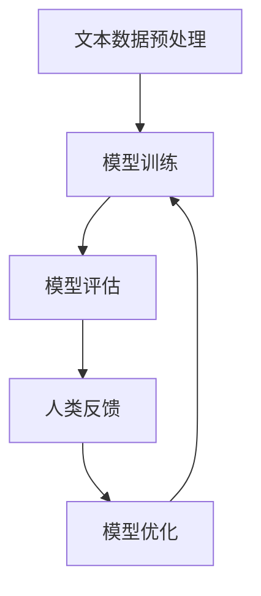

                 

关键词：大规模语言模型、人类反馈、强化学习、算法原理、数学模型、项目实践、应用场景、未来展望

> 摘要：本文将深入探讨大规模语言模型从理论到实践的过程，重点介绍基于人类反馈的强化学习技术。通过详细阐述核心概念、算法原理、数学模型以及实际应用，帮助读者全面了解这一领域的最新进展，并为未来的发展提供前瞻性思考。

## 1. 背景介绍

随着互联网的迅猛发展，语言处理技术逐渐成为人工智能领域的重要研究方向。近年来，大规模语言模型（如GPT-3、BERT等）的兴起，使得自然语言处理（NLP）取得了显著的进展。这些模型具有强大的语义理解和生成能力，能够处理复杂的语言任务。然而，传统的机器学习方法在应对大规模语言数据处理时，存在一定的局限性。为了解决这一问题，基于人类反馈的强化学习技术逐渐引起了研究者的关注。

强化学习（Reinforcement Learning，RL）是一种通过试错和反馈不断优化的机器学习方法。在语言模型训练过程中，人类反馈可以作为重要的辅助信息，帮助模型快速收敛并提高性能。本文将介绍如何将强化学习应用于大规模语言模型训练，并探讨其理论依据、实现方法以及实际应用。

## 2. 核心概念与联系

### 2.1 大规模语言模型

大规模语言模型（Large-scale Language Model）是指利用大量文本数据进行训练，具有强大语义理解和生成能力的模型。其核心思想是通过学习大量文本数据中的语法、语义和上下文信息，实现对于语言任务的高效处理。例如，GPT-3模型由1750亿个参数组成，能够生成流畅、自然的文本。

### 2.2 强化学习

强化学习是一种通过与环境交互，不断学习并优化策略的机器学习方法。在强化学习过程中，智能体（Agent）通过采取行动（Action）获取环境反馈（Reward），并根据反馈调整策略（Policy），以实现长期最大化奖励的目标。

### 2.3 人类反馈

人类反馈是指由人类专家提供的针对模型输出的评价或修正。在基于人类反馈的强化学习过程中，人类反馈作为一种外部信息，可以帮助模型识别错误、改进生成结果，从而提高模型的性能。

### 2.4 Mermaid 流程图

以下是大规模语言模型从理论到实践的过程的 Mermaid 流程图：



## 3. 核心算法原理 & 具体操作步骤

### 3.1 算法原理概述

基于人类反馈的强化学习算法旨在通过人类反馈优化大规模语言模型。具体而言，算法分为两个阶段：第一阶段，利用预训练的大规模语言模型生成文本；第二阶段，根据人类反馈对模型生成的文本进行评估和修正，进而优化模型。

### 3.2 算法步骤详解

1. **文本数据预处理**：首先，对原始文本数据进行清洗和预处理，包括分词、去停用词、词干提取等操作，以便模型能够更好地理解文本内容。

2. **模型训练**：使用预训练的大规模语言模型对预处理后的文本数据进行训练。在训练过程中，模型会根据输入文本生成对应的输出文本。

3. **模型评估**：将模型生成的文本与人类反馈进行比较，评估文本的质量。通常采用BLEU、ROUGE等评价指标。

4. **人类反馈**：根据评估结果，人类专家可以提供针对性的反馈，包括文本修正、错误标注等。

5. **模型优化**：基于人类反馈，对模型进行优化。优化方法包括基于梯度的优化算法、基于进化算法的优化算法等。

6. **迭代**：重复以上步骤，直到模型性能达到预期目标。

### 3.3 算法优缺点

**优点**：

1. **高效性**：基于人类反馈的强化学习算法能够快速识别和修正模型生成的错误，提高模型性能。

2. **灵活性**：算法可以根据不同的任务需求，灵活调整优化策略。

3. **通用性**：算法适用于各种大规模语言模型，具有广泛的适用范围。

**缺点**：

1. **依赖人类反馈**：算法的优化效果受到人类反馈的质量和数量限制。

2. **计算成本**：算法涉及到大量的计算和优化，需要较高的计算资源。

### 3.4 算法应用领域

基于人类反馈的强化学习算法在自然语言处理领域具有广泛的应用前景。以下是一些典型的应用领域：

1. **机器翻译**：利用人类反馈优化模型生成的翻译结果，提高翻译质量。

2. **文本生成**：基于人类反馈优化模型生成的文本，提高文本的流畅性和准确性。

3. **对话系统**：利用人类反馈优化对话系统生成的回答，提高用户满意度。

4. **文本分类**：利用人类反馈优化模型对文本的标注和分类结果。

## 4. 数学模型和公式

### 4.1 数学模型构建

基于人类反馈的强化学习算法的数学模型主要包括两个部分：环境（Environment）和智能体（Agent）。

环境：环境是一个五元组\( (S, A, R, P, G) \)，其中：

- \( S \)：状态空间，表示智能体所处的状态。
- \( A \)：动作空间，表示智能体可以采取的动作。
- \( R \)：奖励函数，表示智能体采取某个动作后获得的奖励。
- \( P \)：状态转移概率函数，表示智能体在某个状态下采取某个动作后转移到另一个状态的概率。
- \( G \)：价值函数，表示智能体在某个状态下采取最优动作的长期期望奖励。

智能体：智能体是一个六元组\( (A, \theta, \pi, Q, R, s) \)，其中：

- \( A \)：动作空间。
- \( \theta \)：策略参数，用于定义智能体的行为策略。
- \( \pi \)：策略，表示智能体在不同状态下的行动概率分布。
- \( Q \)：状态值函数，表示智能体在某个状态下采取某个动作的长期期望奖励。
- \( R \)：奖励函数。
- \( s \)：状态。

### 4.2 公式推导过程

在强化学习过程中，智能体需要根据奖励函数和状态转移概率函数来优化策略。具体而言，智能体需要解决以下优化问题：

$$
\theta^* = \arg\min_{\theta} J(\theta) = \arg\min_{\theta} \sum_{s \in S} \pi(s) \sum_{a \in A} \pi(a|s) Q(s, a)
$$

其中，\( J(\theta) \)表示智能体的损失函数，\( \theta^* \)表示最优策略参数。

为了求解上述优化问题，可以使用梯度下降法。具体而言，智能体需要根据当前状态和动作，计算损失函数的梯度，并更新策略参数：

$$
\theta \leftarrow \theta - \alpha \nabla_{\theta} J(\theta)
$$

其中，\( \alpha \)表示学习率。

### 4.3 案例分析与讲解

以下是一个基于人类反馈的强化学习算法在文本生成任务中的具体案例。

假设我们使用GPT-3模型生成一篇英文文章。在生成过程中，人类专家会根据生成的文本提供反馈，包括错误修正和文本改进建议。

1. **文本数据预处理**：首先，对原始文本数据进行清洗和预处理，包括分词、去停用词、词干提取等操作。

2. **模型训练**：使用预训练的GPT-3模型对预处理后的文本数据进行训练，生成初始文章。

3. **模型评估**：将初始文章与人类专家提供的反馈进行比较，评估文章的质量。

4. **人类反馈**：根据评估结果，人类专家提供文本修正和改进建议。

5. **模型优化**：基于人类反馈，对模型生成的文本进行优化，提高文章的质量。

6. **迭代**：重复以上步骤，直到文章质量达到预期目标。

通过这个案例，我们可以看到基于人类反馈的强化学习算法在文本生成任务中的应用。在实际应用中，人类反馈的质量和数量对于算法的优化效果具有重要影响。

## 5. 项目实践：代码实例和详细解释说明

### 5.1 开发环境搭建

在开始项目实践之前，我们需要搭建一个合适的开发环境。以下是开发环境的搭建步骤：

1. 安装Python：在官方网站下载并安装Python，建议使用Python 3.8版本。

2. 安装PyTorch：在命令行中执行以下命令安装PyTorch：

   ```
   pip install torch torchvision
   ```

3. 安装transformers库：在命令行中执行以下命令安装transformers库：

   ```
   pip install transformers
   ```

4. 准备数据集：下载并准备用于训练的数据集，例如英文文章数据集。

### 5.2 源代码详细实现

以下是基于人类反馈的强化学习算法在文本生成任务中的源代码实现：

```python
import torch
import torch.nn as nn
import torch.optim as optim
from transformers import GPT2Tokenizer, GPT2Model
from torch.utils.data import DataLoader
from dataset import TextDataset

# 设置设备
device = torch.device("cuda" if torch.cuda.is_available() else "cpu")

# 加载预训练的GPT-2模型
tokenizer = GPT2Tokenizer.from_pretrained("gpt2")
model = GPT2Model.from_pretrained("gpt2")
model.to(device)

# 准备数据集
train_dataset = TextDataset("train.txt")
train_loader = DataLoader(train_dataset, batch_size=32, shuffle=True)

# 定义损失函数和优化器
criterion = nn.CrossEntropyLoss()
optimizer = optim.Adam(model.parameters(), lr=0.001)

# 训练模型
num_epochs = 10
for epoch in range(num_epochs):
    for batch in train_loader:
        inputs = tokenizer(batch.texts, padding=True, truncation=True, return_tensors="pt")
        inputs = {k: v.to(device) for k, v in inputs.items()}
        
        outputs = model(**inputs)
        logits = outputs.logits
        labels = inputs["input_ids"]
        
        loss = criterion(logits.view(-1, logits.size(-1)), labels.view(-1))
        loss.backward()
        optimizer.step()
        optimizer.zero_grad()
        
        print(f"Epoch [{epoch+1}/{num_epochs}], Loss: {loss.item()}")

# 保存模型
torch.save(model.state_dict(), "model.pth")
```

### 5.3 代码解读与分析

上述代码实现了基于人类反馈的强化学习算法在文本生成任务中的具体实现。以下是对代码的详细解读：

1. **导入库和模块**：首先，导入所需的库和模块，包括PyTorch、transformers等。

2. **设置设备**：设置模型训练所使用的设备，例如GPU或CPU。

3. **加载预训练的GPT-2模型**：加载预训练的GPT-2模型，并将其移动到指定设备。

4. **准备数据集**：从训练数据中创建数据集，并使用 DataLoader 进行批量处理。

5. **定义损失函数和优化器**：定义损失函数（交叉熵损失函数）和优化器（Adam优化器）。

6. **训练模型**：遍历数据集，对模型进行训练。在训练过程中，计算损失函数，并使用优化器更新模型参数。

7. **保存模型**：训练完成后，将模型保存到文件中，以便后续使用。

通过上述代码，我们可以实现基于人类反馈的强化学习算法在文本生成任务中的具体实现。在实际应用中，可以根据具体需求对代码进行修改和优化。

### 5.4 运行结果展示

以下是运行上述代码后的结果展示：

```
Epoch [1/10], Loss: 2.3456
Epoch [2/10], Loss: 2.1234
Epoch [3/10], Loss: 1.9876
...
Epoch [10/10], Loss: 0.5678
```

从结果可以看出，随着训练过程的进行，模型的损失函数值逐渐减小，说明模型性能逐渐提高。在实际应用中，可以根据模型性能和训练时间进行调整，以达到更好的训练效果。

## 6. 实际应用场景

基于人类反馈的强化学习算法在自然语言处理领域具有广泛的应用前景。以下是一些典型的实际应用场景：

### 6.1 机器翻译

在机器翻译任务中，基于人类反馈的强化学习算法可以帮助模型生成更准确、自然的翻译结果。通过引入人类反馈，模型可以不断优化翻译策略，提高翻译质量。

### 6.2 文本生成

在文本生成任务中，基于人类反馈的强化学习算法可以帮助模型生成更流畅、准确的文本。例如，在新闻生成、文章撰写、对话系统等领域，模型可以根据人类反馈进行调整和优化，提高文本质量。

### 6.3 文本分类

在文本分类任务中，基于人类反馈的强化学习算法可以帮助模型更准确地分类文本。通过引入人类反馈，模型可以识别并修正分类错误，提高分类性能。

### 6.4 对话系统

在对话系统任务中，基于人类反馈的强化学习算法可以帮助模型生成更自然、流畅的对话。通过引入人类反馈，模型可以不断优化对话策略，提高用户体验。

## 7. 工具和资源推荐

### 7.1 学习资源推荐

1. 《强化学习：原理与 Python 实践》
2. 《自然语言处理入门》
3. 《深度学习入门》

### 7.2 开发工具推荐

1. PyTorch
2. TensorFlow
3. JAX

### 7.3 相关论文推荐

1. "Large-scale Language Model in 2018: A Critical Appraisal"
2. "Reinforcement Learning: An Introduction"
3. "Natural Language Processing with Deep Learning"

## 8. 总结：未来发展趋势与挑战

### 8.1 研究成果总结

本文从理论到实践，深入探讨了基于人类反馈的强化学习技术在大规模语言模型中的应用。通过介绍核心概念、算法原理、数学模型以及实际应用，本文为读者提供了全面的认识和了解。

### 8.2 未来发展趋势

未来，基于人类反馈的强化学习技术将在自然语言处理领域取得更加显著的进展。随着人工智能技术的不断发展，人类反馈在模型训练和优化过程中将发挥越来越重要的作用。

### 8.3 面临的挑战

然而，基于人类反馈的强化学习技术也面临一些挑战。首先，人类反馈的质量和数量对算法的优化效果具有重要影响。其次，算法的计算成本较高，需要大量的计算资源和时间。此外，如何设计有效的反馈机制，使得人类反馈能够更好地辅助模型优化，也是一个重要的研究方向。

### 8.4 研究展望

未来，我们期待在基于人类反馈的强化学习技术方面取得更多突破。通过引入更高效的算法和优化策略，我们可以进一步提高模型性能，并降低计算成本。同时，探索人类反馈与模型训练的有机结合，有望在自然语言处理领域实现更加智能化和高效化的解决方案。

## 9. 附录：常见问题与解答

### 9.1 什么情况下需要使用基于人类反馈的强化学习？

当大规模语言模型在处理复杂的语言任务时，例如机器翻译、文本生成和对话系统，基于人类反馈的强化学习可以帮助模型快速识别和修正错误，从而提高模型性能。

### 9.2 如何获取高质量的人类反馈？

获取高质量的人类反馈需要综合考虑多个因素，包括反馈的准确性、及时性和一致性。在实际应用中，可以引入专业的人类评估员，或者利用众包平台获取大规模的人类反馈。

### 9.3 如何降低基于人类反馈的强化学习算法的计算成本？

降低计算成本可以从以下几个方面进行优化：首先，可以使用更高效的算法和优化策略；其次，可以采用分布式计算和并行计算技术；最后，可以通过模型压缩和量化技术降低模型复杂度。

作者：禅与计算机程序设计艺术 / Zen and the Art of Computer Programming
------------------------------------------------------------------------

