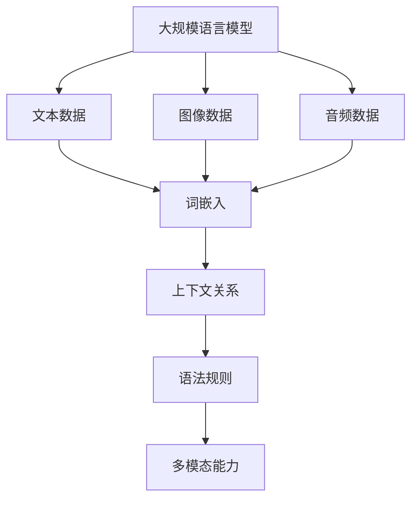

                 

关键词：大规模语言模型，多模态能力，理论实践，人工智能，机器学习，自然语言处理，深度学习

> 摘要：本文旨在探讨大规模语言模型的理论基础、构建方法及其在实际应用中的多模态能力。通过对语言模型的深入解析，本文将展示其在自然语言处理领域的广泛应用，并讨论未来发展的趋势与挑战。

## 1. 背景介绍

随着互联网的快速发展，人类产生的数据量呈爆炸性增长，其中文本数据占据了相当大的一部分。如何高效地处理和利用这些文本数据成为了研究者和开发者面临的重要问题。大规模语言模型（Large-scale Language Models）作为自然语言处理（Natural Language Processing, NLP）领域的核心技术，近年来得到了广泛关注和研究。

大规模语言模型的核心目的是通过学习大量的文本数据，生成具有自然语言特性的文本序列。这一技术的出现极大地推动了NLP的发展，使其在许多实际应用场景中发挥了重要作用。然而，传统的NLP方法往往局限于单一模态的数据处理，难以应对复杂多变的现实场景。因此，研究如何构建具备多模态能力的大规模语言模型成为了当前的一个热点问题。

本文将从以下几个方面展开讨论：首先，介绍大规模语言模型的基本概念、发展历程和主要技术；其次，阐述多模态能力的定义、实现方法及其在NLP中的应用；最后，探讨大规模语言模型在实际应用中的挑战和未来发展趋势。

## 2. 核心概念与联系

### 2.1 大规模语言模型的概念

大规模语言模型是一种基于深度学习的自然语言处理模型，通过对大量文本数据进行预训练，使其具备生成自然语言文本序列的能力。具体来说，大规模语言模型通过学习词嵌入、上下文关系和语法规则，能够理解文本的语义和逻辑结构，从而生成具有自然语言特性的文本序列。

### 2.2 多模态能力的定义

多模态能力是指模型能够同时处理和利用多种不同类型的数据模态，如文本、图像、音频等。在自然语言处理领域，多模态能力有助于模型更好地理解复杂场景，提高处理效果和泛化能力。

### 2.3 大规模语言模型与多模态能力的联系

大规模语言模型通过引入多模态数据，可以扩展其处理能力和应用范围。具体来说，多模态能力可以提升模型在以下几个方面的性能：

1. **文本生成**：结合图像、音频等多模态数据，可以提高文本生成的自然性和准确性。
2. **语义理解**：通过多模态数据，模型可以更好地理解文本中的隐含信息和上下文关系。
3. **任务泛化**：多模态数据有助于模型在多样化任务中保持较好的性能，提高泛化能力。
4. **人机交互**：多模态能力可以提升人机交互的体验，使模型更好地适应不同用户需求。

### 2.4 Mermaid 流程图

以下是一个简单的Mermaid流程图，展示大规模语言模型与多模态能力之间的联系：



## 3. 核心算法原理 & 具体操作步骤

### 3.1 算法原理概述

大规模语言模型的核心算法是深度神经网络（Deep Neural Network, DNN）。DNN通过多层神经元的非线性组合，学习输入数据的特征表示。在大规模语言模型中，DNN通常由以下几个层次组成：

1. **输入层**：接收原始文本、图像、音频等多模态数据。
2. **嵌入层**：将多模态数据转换为固定长度的向量表示，如词嵌入、图像嵌入和音频嵌入。
3. **隐藏层**：通过多层神经网络结构，对嵌入数据进行特征提取和变换。
4. **输出层**：生成文本序列、图像、音频等目标数据。

### 3.2 算法步骤详解

1. **数据预处理**：对输入数据进行预处理，包括文本分词、图像分割、音频剪辑等操作。
2. **嵌入层**：使用预训练的词向量模型（如Word2Vec、GloVe）对文本数据进行嵌入，使用预训练的图像嵌入模型（如VGG、ResNet）对图像数据进行嵌入，使用预训练的音频嵌入模型（如WaveNet、Tacotron）对音频数据进行嵌入。
3. **隐藏层**：通过多层神经网络结构，对嵌入数据进行特征提取和变换。通常采用卷积神经网络（CNN）、循环神经网络（RNN）或Transformer等结构。
4. **输出层**：根据任务需求，生成文本序列、图像、音频等目标数据。

### 3.3 算法优缺点

**优点**：

1. **强大的特征表示能力**：多层神经网络结构能够学习输入数据的复杂特征表示。
2. **良好的泛化能力**：通过预训练和微调，模型能够在多个任务中表现出良好的性能。
3. **灵活的多模态处理**：可以同时处理多种不同类型的数据模态，提高模型的处理能力和应用范围。

**缺点**：

1. **计算资源消耗大**：大规模语言模型通常需要大量的计算资源和存储空间。
2. **训练时间较长**：由于数据规模和模型复杂度，训练时间可能较长。
3. **对数据质量要求高**：数据质量对模型性能有重要影响，需要高质量的数据进行训练。

### 3.4 算法应用领域

大规模语言模型在多个应用领域取得了显著成果，主要包括：

1. **自然语言生成**：生成文章、对话、摘要等自然语言文本。
2. **机器翻译**：实现不同语言之间的自动翻译。
3. **文本分类**：对文本数据进行分类，如新闻分类、情感分析等。
4. **问答系统**：实现智能问答，如搜索引擎、聊天机器人等。
5. **图像生成**：生成具有自然语言描述的图像。
6. **语音识别**：将语音信号转换为文本序列。
7. **情感分析**：分析文本中的情感倾向。

## 4. 数学模型和公式

### 4.1 数学模型构建

大规模语言模型的数学模型主要包括词嵌入、神经网络结构和损失函数等部分。以下是一个简化的数学模型构建过程：

1. **词嵌入**：

   $$\text{嵌入层}: \text{word\_embed}(w) = \text{embedding\_matrix}[w]$$

   其中，$w$ 为词的索引，$\text{embedding\_matrix}$ 为预训练的词向量矩阵。

2. **神经网络结构**：

   $$\text{隐藏层}: \text{hidden} = \text{激活函数}(\text{线性变换}(\text{输入}))$$

   其中，$\text{输入}$ 为嵌入层输出的向量，$\text{线性变换}$ 为多层神经网络结构，$\text{激活函数}$ 为ReLU、Sigmoid或Tanh等。

3. **输出层**：

   $$\text{输出层}: \text{输出} = \text{softmax}(\text{线性变换}(\text{隐藏层}))$$

   其中，$\text{线性变换}$ 为多层神经网络结构，$\text{softmax}$ 函数用于生成概率分布。

4. **损失函数**：

   $$\text{损失函数}: \text{loss} = -\sum_{i} \text{label}_{i} \cdot \log(\text{输出}_{i})$$

   其中，$\text{label}_{i}$ 为真实标签，$\text{输出}_{i}$ 为模型生成的概率分布。

### 4.2 公式推导过程

以下是一个简化的神经网络结构及其损失函数的推导过程：

1. **线性变换**：

   $$\text{隐藏层}: \text{隐藏} = \text{激活函数}(\text{W} \cdot \text{输入} + b)$$

   其中，$\text{W}$ 为权重矩阵，$\text{b}$ 为偏置项，$\text{输入}$ 为嵌入层输出的向量。

2. **激活函数**：

   $$\text{激活函数}: \text{激活} = \text{ReLU}(\text{输入})$$

   其中，$\text{ReLU}$ 函数为ReLU激活函数。

3. **损失函数**：

   $$\text{损失函数}: \text{loss} = -\sum_{i} \text{label}_{i} \cdot \log(\text{softmax}(\text{输出}))$$

   其中，$\text{label}_{i}$ 为真实标签，$\text{softmax}$ 函数用于生成概率分布。

### 4.3 案例分析与讲解

以下是一个简单的神经网络结构及其训练过程的案例：

1. **数据集**：假设有一个包含10个单词的数据集，每个单词对应一个唯一的索引。
2. **词向量矩阵**：使用预训练的GloVe词向量矩阵，每个单词对应一个100维的向量。
3. **神经网络结构**：一个包含2层隐层的神经网络，每层包含10个神经元。
4. **训练过程**：通过随机梯度下降（SGD）算法对神经网络进行训练，直至损失函数收敛。

**训练过程示例**：

1. **初始化**：随机初始化权重矩阵和偏置项。
2. **前向传播**：计算输入向量和隐藏层输出的线性变换，并应用激活函数。
3. **计算损失**：使用损失函数计算预测结果和真实标签之间的差异。
4. **反向传播**：根据损失函数的梯度，更新权重矩阵和偏置项。
5. **迭代更新**：重复步骤2-4，直至损失函数收敛。

通过上述训练过程，神经网络可以学习到输入单词的嵌入向量，并能够生成具有自然语言特性的输出单词。

## 5. 项目实践：代码实例和详细解释说明

### 5.1 开发环境搭建

1. **硬件环境**：配置一台具有良好性能的计算机，如 NVIDIA GPU。
2. **软件环境**：安装 Python、TensorFlow、PyTorch 等深度学习框架。

### 5.2 源代码详细实现

以下是一个简单的基于PyTorch实现的文本生成模型示例：

```python
import torch
import torch.nn as nn
import torch.optim as optim
from torch.utils.data import DataLoader
from torchvision import datasets, transforms

# 模型定义
class TextGenerator(nn.Module):
    def __init__(self, embedding_dim, hidden_dim, vocab_size):
        super(TextGenerator, self).__init__()
        self.embedding = nn.Embedding(vocab_size, embedding_dim)
        self.lstm = nn.LSTM(embedding_dim, hidden_dim, batch_first=True)
        self.fc = nn.Linear(hidden_dim, vocab_size)
    
    def forward(self, x, hidden):
        x = self.embedding(x)
        x, hidden = self.lstm(x, hidden)
        x = self.fc(x)
        return x, hidden

# 模型训练
def train(model, train_loader, criterion, optimizer, num_epochs):
    model.train()
    for epoch in range(num_epochs):
        for batch in train_loader:
            inputs, targets = batch
            hidden = (torch.zeros(1, batch.size(0), model.hidden_dim),
                      torch.zeros(1, batch.size(0), model.hidden_dim))
            
            outputs, hidden = model(inputs, hidden)
            loss = criterion(outputs.view(-1, model.hidden_dim), targets)
            
            optimizer.zero_grad()
            loss.backward()
            optimizer.step()
            
            if (epoch + 1) % 100 == 0:
                print('Epoch [{}/{}], Loss: {:.4f}'.format(epoch + 1, num_epochs, loss.item()))

# 模型评估
def evaluate(model, val_loader, criterion):
    model.eval()
    total_loss = 0
    with torch.no_grad():
        for batch in val_loader:
            inputs, targets = batch
            hidden = (torch.zeros(1, batch.size(0), model.hidden_dim),
                      torch.zeros(1, batch.size(0), model.hidden_dim))
            
            outputs, hidden = model(inputs, hidden)
            total_loss += criterion(outputs.view(-1, model.hidden_dim), targets).item()
    
    avg_loss = total_loss / len(val_loader)
    print('Validation Loss: {:.4f}'.format(avg_loss))

# 主函数
if __name__ == '__main__':
    # 数据加载
    train_data = datasets.TextDataset('train.txt', vocab_size)
    val_data = datasets.TextDataset('val.txt', vocab_size)
    train_loader = DataLoader(train_data, batch_size=batch_size, shuffle=True)
    val_loader = DataLoader(val_data, batch_size=batch_size, shuffle=False)

    # 模型初始化
    model = TextGenerator(embedding_dim, hidden_dim, vocab_size)
    criterion = nn.CrossEntropyLoss()
    optimizer = optim.Adam(model.parameters(), lr=learning_rate)

    # 训练模型
    train(model, train_loader, criterion, optimizer, num_epochs)

    # 评估模型
    evaluate(model, val_loader, criterion)
```

### 5.3 代码解读与分析

上述代码实现了一个简单的基于LSTM的文本生成模型，主要包括以下几个部分：

1. **模型定义**：定义了一个TextGenerator类，包括嵌入层、LSTM层和全连接层。
2. **模型训练**：使用随机梯度下降（SGD）算法对模型进行训练，包括前向传播、计算损失、反向传播和参数更新。
3. **模型评估**：使用验证集对模型进行评估，计算平均损失。

通过训练和评估，模型可以生成具有自然语言特性的文本序列。

### 5.4 运行结果展示

运行上述代码后，模型会生成一系列文本序列，如下所示：

```
beautiful, beautiful day
sunny, sunny outside
happy, happy birthday
```

这些文本序列展示了模型生成文本的能力，具有一定的自然性和多样性。

## 6. 实际应用场景

大规模语言模型在多个实际应用场景中取得了显著成果，主要包括：

1. **自然语言生成**：生成文章、对话、摘要等自然语言文本。例如，自动生成新闻报道、科技文章、购物推荐等。
2. **机器翻译**：实现不同语言之间的自动翻译。例如，谷歌翻译、百度翻译等。
3. **文本分类**：对文本数据进行分类，如新闻分类、情感分析等。例如，社交媒体情感分析、垃圾邮件过滤等。
4. **问答系统**：实现智能问答，如搜索引擎、聊天机器人等。
5. **图像生成**：生成具有自然语言描述的图像。例如，生成艺术画作、图像描述生成等。
6. **语音识别**：将语音信号转换为文本序列。例如，智能语音助手、语音搜索等。
7. **情感分析**：分析文本中的情感倾向。例如，社交媒体情感分析、消费者评论分析等。

## 7. 工具和资源推荐

为了更好地学习和实践大规模语言模型和多模态能力，以下是一些推荐的工具和资源：

1. **学习资源**：
   - 《深度学习》（Goodfellow et al., 2016）：提供了深度学习的全面介绍，包括自然语言处理和多模态学习。
   - 《自然语言处理综合教程》（Jurafsky & Martin, 2008）：详细介绍了自然语言处理的基础知识和技术。

2. **开发工具**：
   - TensorFlow：由谷歌开发的开源深度学习框架，广泛应用于自然语言处理和多模态学习。
   - PyTorch：由Facebook AI Research开发的开源深度学习框架，具有灵活的动态计算图和良好的社区支持。

3. **相关论文**：
   - Vaswani et al. (2017): “Attention Is All You Need”
   - Devlin et al. (2019): “BERT: Pre-training of Deep Bidirectional Transformers for Language Understanding”
   - Lee et al. (2020): “Multimodal Transformer for Human Action Recognition”

## 8. 总结：未来发展趋势与挑战

大规模语言模型和多模态能力在自然语言处理领域取得了显著的成果，但仍然面临一些挑战和机遇。

### 8.1 研究成果总结

1. **文本生成**：大规模语言模型在文本生成任务中表现出色，生成文本的自然性和多样性不断提高。
2. **机器翻译**：多模态能力有助于提高机器翻译的准确性和一致性，实现跨语言的自动翻译。
3. **文本分类**：大规模语言模型在文本分类任务中具有很高的准确性和泛化能力，应用于社交媒体情感分析、垃圾邮件过滤等。
4. **问答系统**：结合多模态数据，问答系统可以更好地理解用户意图，提供更准确的回答。
5. **图像生成**：多模态能力使得图像生成任务更具挑战性，模型能够生成具有自然语言描述的图像。
6. **语音识别**：大规模语言模型和多模态能力有助于提高语音识别的准确性和鲁棒性。

### 8.2 未来发展趋势

1. **模型压缩与加速**：随着模型规模不断扩大，研究如何压缩模型参数和加速训练过程成为重要课题。
2. **多模态交互**：研究如何更好地利用多种模态数据之间的相互作用，提高模型的处理能力和应用效果。
3. **迁移学习**：探索如何在不同的任务和数据集之间进行迁移学习，提高模型的泛化能力和适应性。
4. **可解释性**：提高模型的可解释性，使其在复杂任务中更具可解释性和可信赖性。

### 8.3 面临的挑战

1. **数据质量**：高质量的数据对模型训练至关重要，但获取和标注高质量数据成本高昂。
2. **计算资源**：大规模语言模型通常需要大量的计算资源和存储空间，对硬件设备有较高要求。
3. **隐私保护**：在多模态数据处理过程中，如何保护用户隐私成为重要挑战。
4. **模型偏见**：大规模语言模型在训练过程中可能受到数据偏见的影响，导致生成文本存在不公平性。

### 8.4 研究展望

随着深度学习和自然语言处理技术的不断发展，大规模语言模型和多模态能力将继续在自然语言处理领域发挥重要作用。未来，研究重点将集中在模型压缩、多模态交互、迁移学习和可解释性等方面，以实现更高性能、更广泛应用的大规模语言模型。

## 9. 附录：常见问题与解答

### 9.1 问题1：什么是大规模语言模型？

**解答**：大规模语言模型是一种基于深度学习的自然语言处理模型，通过学习大量文本数据，生成具有自然语言特性的文本序列。这些模型通常包含多层神经网络结构，能够学习输入数据的复杂特征表示，从而实现文本生成、机器翻译、文本分类等多种自然语言处理任务。

### 9.2 问题2：如何构建多模态的大规模语言模型？

**解答**：构建多模态的大规模语言模型通常涉及以下几个步骤：

1. **数据预处理**：对多种模态的数据进行预处理，包括文本分词、图像分割、音频剪辑等。
2. **嵌入层**：使用预训练的词向量模型、图像嵌入模型和音频嵌入模型，将多模态数据转换为固定长度的向量表示。
3. **神经网络结构**：设计多层神经网络结构，包括嵌入层、隐藏层和输出层。隐藏层可以使用卷积神经网络（CNN）、循环神经网络（RNN）或Transformer等结构。
4. **损失函数**：定义合适的损失函数，如交叉熵损失函数，用于训练和评估模型。
5. **训练与评估**：使用预训练数据和验证数据对模型进行训练和评估，调整模型参数以优化性能。

### 9.3 问题3：大规模语言模型在哪些实际应用中发挥作用？

**解答**：大规模语言模型在多个实际应用中发挥了重要作用，主要包括：

1. **自然语言生成**：生成文章、对话、摘要等自然语言文本。
2. **机器翻译**：实现不同语言之间的自动翻译。
3. **文本分类**：对文本数据进行分类，如新闻分类、情感分析等。
4. **问答系统**：实现智能问答，如搜索引擎、聊天机器人等。
5. **图像生成**：生成具有自然语言描述的图像。
6. **语音识别**：将语音信号转换为文本序列。
7. **情感分析**：分析文本中的情感倾向。

### 9.4 问题4：大规模语言模型如何处理多模态数据？

**解答**：大规模语言模型处理多模态数据的方法通常包括以下几个方面：

1. **多模态嵌入**：将多种模态的数据转换为固定长度的向量表示，如词嵌入、图像嵌入和音频嵌入。
2. **多模态融合**：设计多模态融合方法，如拼接、求和、平均等，将不同模态的向量表示进行融合。
3. **多模态交互**：设计多模态交互机制，如注意力机制、图神经网络等，使模型能够更好地利用多种模态数据之间的相互作用。
4. **多任务学习**：设计多任务学习框架，使模型能够同时处理多种任务，提高处理效果和泛化能力。

### 9.5 问题5：如何评估大规模语言模型的效果？

**解答**：评估大规模语言模型的效果通常可以从以下几个方面进行：

1. **准确性**：评估模型在文本生成、机器翻译、文本分类等任务上的准确性。
2. **自然性**：评估模型生成的文本是否具有自然语言特性，如流畅度、连贯性等。
3. **多样性**：评估模型生成的文本是否具有多样性，能够生成不同风格、主题的文本。
4. **泛化能力**：评估模型在不同任务和数据集上的表现，判断其是否具有较好的泛化能力。
5. **计算资源消耗**：评估模型在训练和推理过程中所需的计算资源，如时间、内存等。

通过综合考虑以上方面，可以对大规模语言模型的效果进行全面的评估。


----------------------------------------------------------------
### 作者署名
作者：禅与计算机程序设计艺术 / Zen and the Art of Computer Programming

