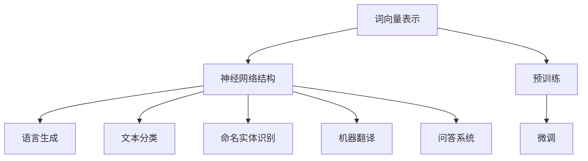
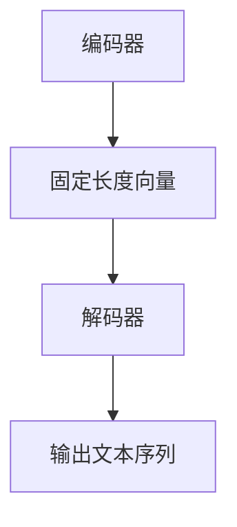

                 

## 摘要

本文旨在深入探讨大规模语言模型的构建、优化和应用。我们首先回顾了大规模语言模型的发展历程，然后详细分析了其核心概念与联系，包括语言模型的原理、数学模型以及在实际项目中的应用。通过数学公式和实例说明，我们展示了大规模语言模型的具体操作步骤和实现细节。最后，我们探讨了大规模语言模型在实际应用场景中的潜力，并对其未来发展趋势和面临的挑战进行了展望。

## 1. 背景介绍

大规模语言模型（Large-scale Language Models）是自然语言处理（Natural Language Processing，NLP）领域的一项重要突破。随着互联网的飞速发展和数据的爆炸性增长，语言模型的研究和应用逐渐成为了人工智能领域的一个热点。大规模语言模型能够理解和生成人类语言，为机器翻译、文本摘要、问答系统等提供了强大的支持。

### 大规模语言模型的发展历程

大规模语言模型的发展历程可以分为几个阶段。最早的语言模型是基于统计方法的，如N-gram模型，通过计算单词序列的概率来生成文本。然而，这种方法的局限性在于它无法捕捉长距离的语义依赖和上下文信息。

随着深度学习的兴起，神经网络语言模型开始崭露头角。2003年，Rumelhart等提出了长短期记忆网络（Long Short-Term Memory，LSTM），这是一种能够有效处理长序列数据的神经网络模型。LSTM在语言模型中得到了广泛应用，但由于其训练过程复杂，难以扩展到大规模数据集。

2013年，Google提出了Word2Vec模型，通过神经网络对单词进行向量化表示，显著提高了语言模型的性能。随后，序列到序列（Seq2Seq）模型和注意力机制（Attention Mechanism）的引入，使得语言模型在生成和理解文本方面取得了更加显著的进展。

近年来，随着计算能力的提升和大数据的广泛应用，大规模语言模型如BERT、GPT和Turing得到了快速发展。这些模型通过训练数十亿级别的参数，实现了对复杂语义的理解和生成，推动了NLP领域的发展。

### 大规模语言模型的应用领域

大规模语言模型的应用领域非常广泛，主要包括以下几个方面：

1. **机器翻译**：大规模语言模型能够通过对源语言和目标语言的词汇和语法进行建模，实现高质量、高精度的机器翻译。例如，Google Translate和Microsoft Translator等都是基于大规模语言模型实现的。

2. **文本摘要**：大规模语言模型能够捕捉文本中的关键信息，生成简洁、准确的摘要。这种技术广泛应用于新闻摘要、会议记录和医学报告等领域。

3. **问答系统**：大规模语言模型能够理解用户的自然语言查询，并从大量文本中检索出相关答案。这种技术广泛应用于搜索引擎、智能客服和智能助手等领域。

4. **文本分类**：大规模语言模型能够对文本进行分类，帮助计算机理解和处理非结构化数据。这种技术广泛应用于垃圾邮件检测、情感分析和内容推荐等领域。

5. **对话系统**：大规模语言模型能够模拟人类的对话方式，实现自然、流畅的对话交互。这种技术广泛应用于智能客服、虚拟助手和聊天机器人等领域。

### 大规模语言模型的重要性

大规模语言模型的重要性体现在以下几个方面：

1. **提高处理速度和准确性**：大规模语言模型通过大量数据的训练，能够实现对复杂语言现象的精确理解和生成，从而提高NLP任务的效率和准确性。

2. **拓展应用场景**：大规模语言模型的应用不仅局限于文本处理，还可以拓展到语音识别、图像识别和跨模态处理等领域，为人工智能的发展提供新的动力。

3. **推动科研进步**：大规模语言模型的研究和应用推动了自然语言处理、机器学习和人工智能领域的快速发展，为科研创新提供了强有力的工具。

4. **改善生活质量**：大规模语言模型的应用使得机器翻译、智能客服和智能助手等技术服务更加普及，为人们的生活提供了便利。

总之，大规模语言模型是NLP领域的一项重要技术，其发展不仅推动了人工智能的发展，也为人类社会的进步做出了重要贡献。

### 1.1 大规模语言模型的发展背景

大规模语言模型的发展背景可以追溯到上世纪80年代，当时计算机科学领域开始逐渐意识到语言模型在自然语言处理中的重要性。早期的语言模型主要基于规则和统计方法，如N-gram模型和隐马尔可夫模型（HMM），这些模型在一定程度上能够处理简单的语言任务，但面临复杂语境时表现不佳。

随着互联网的兴起和数据量的激增，语言模型的研究迎来了新的机遇。大量的文本数据为训练语言模型提供了丰富的资源，同时也提出了更高的要求。传统的模型逐渐暴露出无法捕捉长距离依赖关系、上下文理解能力不足等问题。这一挑战促使研究人员探索更强大的模型结构和方法。

2003年，Rumelhart等人提出了长短期记忆网络（LSTM），这是一种能够处理长序列数据的神经网络模型。LSTM通过引入记忆单元，有效地解决了传统RNN模型在长序列依赖关系上的梯度消失和梯度爆炸问题。LSTM在语言模型中的应用，为后续的神经网络语言模型研究奠定了基础。

然而，LSTM模型也存在一定的局限性，其训练过程复杂且参数量庞大，难以在大规模数据集上快速训练。因此，研究人员开始探索更高效的模型结构。2013年，Google提出了Word2Vec模型，通过神经网络对单词进行向量化表示。Word2Vec模型通过负采样等技术，大幅提高了训练效率，同时捕捉到了单词之间的语义关系。Word2Vec的成功引发了神经网络语言模型的研究热潮。

随着深度学习技术的不断发展，神经网络语言模型逐渐得到了广泛应用。特别是序列到序列（Seq2Seq）模型和注意力机制的引入，使得语言模型在生成和理解文本方面取得了显著的进展。Seq2Seq模型通过编码器和解码器结构，实现了序列到序列的映射，有效解决了机器翻译等问题。注意力机制通过关注关键信息，提高了模型在文本理解和生成中的性能。

近年来，大规模语言模型如BERT、GPT和Turing等得到了广泛关注。BERT通过预训练和微调技术，实现了对复杂语义的精确理解和生成。GPT系列模型通过 Transformer 架构，实现了高效、灵活的文本生成能力。Turing模型则结合了多种先进的神经网络结构和技术，实现了对文本的深度理解和生成。

总之，大规模语言模型的发展得益于深度学习技术的进步、大数据的广泛应用以及科研人员的不断探索。随着技术的不断演进，大规模语言模型在自然语言处理和应用领域中的地位和影响力不断提升。

### 1.2 大规模语言模型的核心概念

大规模语言模型（Large-scale Language Model）是自然语言处理（NLP）领域的一种重要技术，它通过学习大量的文本数据，对语言的语义和结构进行建模，从而实现对文本的生成、理解和分析。理解大规模语言模型的核心概念，有助于深入探讨其原理和在实际应用中的表现。

#### 语言模型的组成

语言模型主要由两个部分组成：词向量表示和神经网络结构。

1. **词向量表示**：词向量表示将单词映射到高维空间中的向量，通过这种方式，单词的语义和语法特征可以被数值化。常见的词向量模型包括Word2Vec、GloVe和BERT等。这些模型通过训练大量文本数据，学习单词之间的相似性和相关性，从而生成高质量的词向量表示。

2. **神经网络结构**：神经网络结构负责对输入的词向量进行编码和解码，从而实现对文本的生成和理解。常见的神经网络结构包括循环神经网络（RNN）、长短期记忆网络（LSTM）和变换器（Transformer）等。这些神经网络结构通过不同的方式处理序列数据，从而捕捉到语言中的上下文依赖关系。

#### 语言模型的原理

语言模型的原理基于深度学习和神经网络技术，其核心思想是通过学习大量的文本数据，构建一个能够表示语言统计信息的模型。具体来说，语言模型通过以下步骤实现：

1. **数据预处理**：首先，需要对输入的文本数据进行预处理，包括去除标点符号、停用词过滤、词干提取等操作。然后，将预处理后的文本数据转换为词向量表示。

2. **训练神经网络**：接下来，将词向量表示作为输入，通过神经网络结构进行训练。神经网络通过反向传播算法，不断调整内部参数，从而最小化预测误差。训练过程中，模型会学习到单词之间的语义和语法关系，以及上下文环境对语言表达的影响。

3. **预测和生成**：在训练完成后，语言模型可以用来进行预测和生成。对于预测任务，模型可以基于已知的输入序列，预测下一个单词或字符。对于生成任务，模型可以基于给定的提示或初始文本，生成新的文本序列。

#### 语言模型的应用

语言模型的应用非常广泛，主要包括以下几个方面：

1. **文本分类**：通过训练语言模型，可以对输入的文本进行分类，例如情感分析、主题分类等。语言模型能够捕捉文本中的关键特征，从而实现高精度的分类。

2. **文本生成**：语言模型可以用来生成新的文本，例如自动写作、机器翻译、问答系统等。通过生成模型，可以自动生成新闻摘要、对话文本等。

3. **命名实体识别**：语言模型可以帮助识别文本中的命名实体，例如人名、地名、组织机构名等。通过模型训练，可以学习到命名实体的特征和规律。

4. **机器翻译**：语言模型在机器翻译中发挥了重要作用，通过训练双语的文本数据，模型可以学习到不同语言之间的对应关系，从而实现高质量、高精度的翻译。

#### 语言模型的优势

语言模型的优势主要体现在以下几个方面：

1. **强大的表达能力和灵活性**：语言模型能够通过深度学习的方式，从大量文本数据中学习到语言的复杂结构和语义信息，从而实现对文本的灵活处理。

2. **自适应性和泛化能力**：语言模型可以通过微调和迁移学习，将训练模型应用于不同的任务和数据集，从而提高模型的泛化能力和适应性。

3. **高效率和实时性**：语言模型采用了高效的神经网络结构，能够快速地处理大规模的文本数据，实现实时预测和生成。

总之，大规模语言模型作为自然语言处理的重要工具，其核心概念和原理为我们理解和应用这项技术提供了基础。通过深入学习语言模型，我们可以更好地利用其优势，推动NLP领域的创新发展。

### 2. 核心概念与联系

#### 2.1 大规模语言模型的核心概念

大规模语言模型（Large-scale Language Model）是自然语言处理（NLP）领域的核心工具，其核心概念包括词向量表示、神经网络结构、预训练和微调等。为了更清晰地理解这些概念，我们将使用Mermaid流程图来展示它们之间的联系和交互。



1. **词向量表示**：词向量表示是将自然语言文本映射到高维空间中的向量，通过这种方式，文本中的单词和句子可以被数值化，从而方便神经网络处理。常见的词向量模型包括Word2Vec和GloVe。

2. **神经网络结构**：神经网络结构负责处理词向量，实现语言的理解和生成。常见的神经网络结构包括循环神经网络（RNN）、长短期记忆网络（LSTM）和变换器（Transformer）。

3. **预训练**：预训练是指在大量无标签文本数据上，对神经网络进行训练，使其能够捕捉到语言的普遍特性。预训练后的模型可以用于各种下游任务，如文本分类、机器翻译等。

4. **微调**：微调是指在使用预训练模型的基础上，将其应用于特定任务的数据集上进行进一步训练。通过微调，模型可以更好地适应特定任务的需求。

#### 2.2 语言模型的原理与架构

语言模型的原理和架构是理解其工作原理的关键。以下是大规模语言模型的核心原理与架构：

1. **编码器和解码器**：在大多数序列到序列任务中，语言模型由编码器和解码器两个部分组成。编码器负责将输入序列编码为固定长度的向量，解码器则负责从编码器输出的向量中生成输出序列。

2. **注意力机制**：注意力机制是一种用于提高模型在处理长序列数据时性能的方法。它通过将不同位置的输入序列分配不同的权重，从而更好地捕捉到上下文信息。

3. **变换器架构**：变换器（Transformer）是一种基于注意力机制的神经网络结构，其核心思想是将输入序列转换为序列的嵌套表示，从而实现高效的序列处理。

#### 2.3 大规模语言模型的工作流程

大规模语言模型的工作流程可以分为以下几个步骤：

1. **数据预处理**：首先，对输入的文本数据进行预处理，包括去除标点符号、停用词过滤、词干提取等操作，然后将预处理后的文本数据转换为词向量表示。

2. **预训练**：接下来，使用大量无标签的文本数据对模型进行预训练，使其能够捕捉到语言的普遍特性。

3. **微调**：在预训练的基础上，将模型应用于特定任务的数据集上进行微调，从而提高模型在特定任务上的性能。

4. **预测与生成**：最后，使用微调后的模型进行预测和生成任务，如文本分类、机器翻译、问答系统等。

#### 2.4 大规模语言模型的优势与局限

1. **优势**：

   - **强大的表达能力和灵活性**：大规模语言模型能够通过深度学习的方式，从大量文本数据中学习到语言的复杂结构和语义信息，从而实现对文本的灵活处理。

   - **自适应性和泛化能力**：通过预训练和微调技术，大规模语言模型可以应用于各种不同的任务和数据集，从而提高模型的泛化能力和适应性。

   - **高效率和实时性**：大规模语言模型采用了高效的神经网络结构，能够快速地处理大规模的文本数据，实现实时预测和生成。

2. **局限**：

   - **计算资源要求高**：大规模语言模型的训练和部署需要大量的计算资源和存储空间，这对于很多企业和研究机构来说是一个挑战。

   - **数据依赖性**：大规模语言模型的效果很大程度上依赖于训练数据的质量和数量，如果数据质量不高或者数据量不足，模型的效果会受到影响。

   - **解释性不足**：大规模语言模型的工作过程复杂，难以直接解释其预测结果，这对于需要解释性要求较高的应用场景来说是一个限制。

#### 2.5 大规模语言模型的发展趋势

随着深度学习和大数据技术的不断发展，大规模语言模型将继续在NLP领域发挥重要作用。未来，以下趋势值得关注：

- **模型规模不断扩大**：随着计算能力的提升，大规模语言模型的规模将进一步扩大，从而提高模型的性能和泛化能力。

- **预训练与微调技术优化**：预训练和微调技术将得到进一步优化，使其能够更好地适应不同的任务和数据集。

- **跨模态处理能力提升**：大规模语言模型将逐步拓展到跨模态处理领域，如文本与图像、语音与文本等，实现更丰富的应用场景。

- **模型解释性和透明度提升**：通过引入可解释性技术，将提高大规模语言模型的透明度和解释性，从而使其在需要高解释性的应用场景中得到更广泛的应用。

### 3. 核心算法原理

大规模语言模型的核心算法原理主要基于深度学习和自然语言处理的技术。以下将详细介绍大规模语言模型的主要算法原理，包括其基本架构、工作流程以及关键步骤。

#### 3.1 基本架构

大规模语言模型的基本架构通常包括编码器（Encoder）和解码器（Decoder）两部分，其中编码器负责将输入的文本序列编码为固定长度的向量，解码器则基于编码器输出的向量生成输出文本序列。以下是大规模语言模型的基本架构：



在编码器和解码器之间，还可以引入注意力机制（Attention Mechanism），以增强模型在处理长序列数据时的性能。注意力机制通过为不同位置的输入序列分配不同的权重，使得模型能够更好地捕捉到上下文信息。

#### 3.2 工作流程

大规模语言模型的工作流程可以分为以下步骤：

1. **数据预处理**：首先，对输入的文本数据进行预处理，包括去除标点符号、停用词过滤、词干提取等操作。然后，将预处理后的文本数据转换为词向量表示。

2. **编码器处理**：编码器接收词向量表示，通过多层神经网络结构进行编码，最终输出一个固定长度的向量。这个向量代表了输入文本序列的语义信息。

3. **解码器处理**：解码器接收编码器输出的固定长度向量，并通过多层神经网络结构进行解码，生成输出文本序列。在解码过程中，解码器可以利用注意力机制，关注关键信息，从而提高生成文本的质量。

4. **预测和生成**：在训练完成后，模型可以用来进行预测和生成任务。对于预测任务，模型可以基于已知的输入序列，预测下一个单词或字符。对于生成任务，模型可以基于给定的提示或初始文本，生成新的文本序列。

#### 3.3 关键步骤

以下是大规模语言模型的核心步骤：

1. **词向量表示**：词向量表示是将自然语言文本映射到高维空间中的向量。常见的词向量模型包括Word2Vec和GloVe。这些模型通过训练大量文本数据，学习单词之间的相似性和相关性，从而生成高质量的词向量表示。

2. **神经网络结构**：神经网络结构负责处理词向量，实现语言的理解和生成。常见的神经网络结构包括循环神经网络（RNN）、长短期记忆网络（LSTM）和变换器（Transformer）。这些神经网络结构通过不同的方式处理序列数据，从而捕捉到语言中的上下文依赖关系。

3. **预训练**：预训练是指在大量无标签文本数据上，对神经网络进行训练，使其能够捕捉到语言的普遍特性。预训练后的模型可以用于各种下游任务，如文本分类、机器翻译等。

4. **微调**：微调是指在使用预训练模型的基础上，将其应用于特定任务的数据集上进行进一步训练。通过微调，模型可以更好地适应特定任务的需求。

5. **预测和生成**：在训练完成后，模型可以用来进行预测和生成任务。对于预测任务，模型可以基于已知的输入序列，预测下一个单词或字符。对于生成任务，模型可以基于给定的提示或初始文本，生成新的文本序列。

#### 3.4 算法优缺点

大规模语言模型的算法优缺点如下：

1. **优点**：

   - **强大的表达能力和灵活性**：大规模语言模型能够通过深度学习的方式，从大量文本数据中学习到语言的复杂结构和语义信息，从而实现对文本的灵活处理。

   - **自适应性和泛化能力**：通过预训练和微调技术，大规模语言模型可以应用于各种不同的任务和数据集，从而提高模型的泛化能力和适应性。

   - **高效率和实时性**：大规模语言模型采用了高效的神经网络结构，能够快速地处理大规模的文本数据，实现实时预测和生成。

2. **缺点**：

   - **计算资源要求高**：大规模语言模型的训练和部署需要大量的计算资源和存储空间，这对于很多企业和研究机构来说是一个挑战。

   - **数据依赖性**：大规模语言模型的效果很大程度上依赖于训练数据的质量和数量，如果数据质量不高或者数据量不足，模型的效果会受到影响。

   - **解释性不足**：大规模语言模型的工作过程复杂，难以直接解释其预测结果，这对于需要解释性要求较高的应用场景来说是一个限制。

#### 3.5 算法应用领域

大规模语言模型在多个应用领域中表现出色，主要包括：

- **文本分类**：通过训练大规模语言模型，可以对输入的文本进行分类，如情感分析、主题分类等。

- **文本生成**：大规模语言模型可以用于生成新的文本，如自动写作、机器翻译、问答系统等。

- **命名实体识别**：通过训练大规模语言模型，可以识别文本中的命名实体，如人名、地名、组织机构名等。

- **机器翻译**：大规模语言模型在机器翻译领域取得了显著进展，能够实现高质量、高精度的翻译。

- **对话系统**：大规模语言模型可以用于对话系统，实现自然、流畅的对话交互，如智能客服、虚拟助手等。

通过深入了解大规模语言模型的核心算法原理，我们可以更好地利用其优势，推动NLP领域的创新发展。

### 3.2 算法步骤详解

大规模语言模型的构建过程包括数据准备、模型训练和模型评估等多个步骤。以下将详细介绍这些步骤，并解释每个步骤的具体操作细节。

#### 3.2.1 数据准备

数据准备是大规模语言模型构建的第一步，其质量直接影响到模型的表现。数据准备主要包括数据收集、数据预处理和数据分集。

1. **数据收集**：

   - **文本数据收集**：首先，需要收集大量的文本数据，这些数据可以来自互联网、新闻、书籍、社交媒体等。常见的文本数据集包括维基百科、新闻文章、用户评论等。

   - **双语文本数据收集**：对于机器翻译等需要双语数据的任务，还需要收集对应的双语数据集，如英语-中文、英语-法语等。

2. **数据预处理**：

   - **去除标点符号和停用词**：去除文本中的标点符号和常见的停用词，如“的”、“和”、“在”等，以减少无关信息。

   - **分词和词干提取**：将文本分割成单词或词组，并进行词干提取，以减少同义词的影响。

   - **词向量化**：将文本中的单词或词组映射到高维空间中的向量，常见的词向量模型包括Word2Vec和GloVe。

3. **数据分集**：

   - **训练集**：用于训练模型的原始数据，通常占整个数据集的80%左右。

   - **验证集**：用于评估模型性能的数据集，通常占整个数据集的10%左右。

   - **测试集**：用于最终评估模型性能的数据集，通常占整个数据集的10%左右。

#### 3.2.2 模型训练

模型训练是大规模语言模型构建的核心步骤，其目的是通过调整模型参数，使其在训练数据上达到较好的性能。模型训练主要包括以下步骤：

1. **初始化参数**：

   - **词向量初始化**：初始化词向量，通常使用随机初始化或预训练的词向量。

   - **神经网络参数初始化**：初始化神经网络参数，如权重和偏置，通常使用随机初始化。

2. **定义损失函数**：

   - **交叉熵损失函数**：常见的损失函数，用于衡量模型预测结果与实际结果之间的差距。

3. **优化算法**：

   - **梯度下降**：一种常用的优化算法，通过调整模型参数，使得模型在训练数据上的损失函数最小。

   - **Adam优化器**：一种改进的梯度下降算法，通过自适应地调整学习率，提高训练效果。

4. **训练过程**：

   - **前向传播**：将输入数据传递给神经网络，计算模型输出。

   - **计算损失**：计算模型输出与实际结果之间的损失。

   - **反向传播**：根据损失计算模型参数的梯度，并更新模型参数。

   - **迭代训练**：重复前向传播和反向传播过程，直到模型在验证集上的性能达到预设的目标。

#### 3.2.3 模型评估

模型评估是确保大规模语言模型性能的重要环节，常用的评估指标包括准确率、召回率、F1值等。

1. **准确率**：预测正确的样本数占总样本数的比例。

2. **召回率**：预测正确的正样本数占总正样本数的比例。

3. **F1值**：准确率和召回率的调和平均值，用于综合评估模型的性能。

4. **BLEU评分**：用于评估机器翻译质量的评分系统，基于参考翻译与生成翻译之间的相似度。

#### 3.2.4 模型调优

在模型训练和评估过程中，可能需要对模型进行调优，以提升其性能。模型调优主要包括以下几个方面：

1. **超参数调整**：

   - **学习率**：调整学习率，以找到最优的学习速度。

   - **批量大小**：调整批量大小，以平衡训练速度和模型稳定性。

   - **迭代次数**：调整训练迭代次数，以确保模型在验证集上达到较好的性能。

2. **数据增强**：

   - **文本增强**：通过增加噪声、同义词替换等方式，提高模型的泛化能力。

   - **数据扩充**：通过复制、旋转、缩放等方式，增加训练数据量，提高模型的鲁棒性。

3. **正则化**：

   - **Dropout**：通过在训练过程中随机丢弃一部分神经元，减少过拟合现象。

   - **L1/L2正则化**：通过在损失函数中添加权重项的L1/L2范数，降低过拟合。

通过详细的算法步骤解析，我们可以更好地理解大规模语言模型的构建过程，从而在实践中取得更好的效果。

### 3.3 算法优缺点分析

大规模语言模型作为一种先进的技术，在自然语言处理领域展现了强大的性能和广泛的适用性。然而，任何技术都有其优缺点。以下将详细分析大规模语言模型的优缺点，以便读者全面了解其适用场景和潜在限制。

#### 3.3.1 优点

1. **强大的表达能力**：

   - **捕捉复杂语义**：大规模语言模型通过深度学习的方式，从大量文本数据中学习到复杂的语义关系，能够捕捉到单词、短语和句子之间的细微语义差异。
   - **灵活的生成能力**：大规模语言模型在生成文本时表现出极高的灵活性，可以根据输入的提示或初始文本生成连贯、具有创意的文本。

2. **高效的训练与推断**：

   - **快速训练**：得益于现代深度学习框架和硬件的进步，大规模语言模型能够在较短的时间内完成训练，节省了大量的计算资源和时间成本。
   - **快速推断**：大规模语言模型在推断阶段表现出了极高的效率，能够在短时间内生成高质量的文本输出，适用于实时应用场景。

3. **广泛的适用性**：

   - **多任务处理**：大规模语言模型可以应用于多种自然语言处理任务，如文本分类、文本生成、命名实体识别、机器翻译等，无需针对每个任务重新训练模型。
   - **跨领域迁移**：通过预训练和微调技术，大规模语言模型可以轻松迁移到不同领域和任务中，提高了模型的泛化能力。

4. **强大的数据驱动**：

   - **大量数据支持**：大规模语言模型依赖于大量的文本数据，这些数据来源广泛、内容丰富，使得模型能够从多个角度学习语言的规律和特性。
   - **自动特征提取**：大规模语言模型能够自动提取文本中的关键特征，无需人工干预，降低了特征工程的工作量。

#### 3.3.2 缺点

1. **计算资源要求高**：

   - **训练成本**：大规模语言模型的训练过程需要大量的计算资源和存储空间，尤其是对于非常大规模的模型，训练成本可能会非常高。
   - **推理成本**：尽管大规模语言模型的推断速度已经非常快，但仍然需要较大的计算资源，特别是在部署大规模模型时，可能会对硬件设备提出更高的要求。

2. **数据依赖性**：

   - **数据质量**：大规模语言模型的效果在很大程度上依赖于训练数据的质量。如果数据质量不高，包含噪声或偏见，模型可能无法生成高质量的输出。
   - **数据量限制**：尽管大规模语言模型可以从大量数据中学习，但仍然存在数据量的限制。对于一些特定领域或小众语言的模型，可能难以获得足够多的训练数据，从而影响模型的性能。

3. **解释性不足**：

   - **黑箱模型**：大规模语言模型在处理文本数据时表现出强大的能力，但其工作过程复杂，难以直接解释其决策过程。这对于需要解释性要求较高的应用场景，如医疗诊断、金融分析等，可能存在一定的限制。
   - **缺乏透明度**：大规模语言模型的训练和推断过程涉及到大量的参数和复杂的神经网络结构，这使得模型在透明度和可解释性方面存在一定的不足。

4. **安全性和隐私问题**：

   - **数据泄露风险**：大规模语言模型在训练和推理过程中会处理大量的敏感数据，如果处理不当，可能会导致数据泄露和隐私侵犯。
   - **对抗攻击**：大规模语言模型在某些情况下可能对对抗攻击（Adversarial Attack）敏感，即通过轻微的输入变化来欺骗模型，从而影响模型的稳定性和安全性。

#### 3.3.3 适用场景

1. **文本生成**：

   - **自动写作**：利用大规模语言模型自动生成新闻文章、博客、小说等。
   - **内容摘要**：通过大规模语言模型自动生成文章的摘要和概要，提高信息获取的效率。
   - **对话系统**：利用大规模语言模型实现自然、流畅的对话交互，用于智能客服、虚拟助手等。

2. **文本分类**：

   - **情感分析**：对文本进行情感分类，判断文本的情感倾向（正面、负面等）。
   - **主题分类**：对文本进行主题分类，识别文本所属的领域或话题。
   - **垃圾邮件检测**：通过大规模语言模型识别和过滤垃圾邮件。

3. **命名实体识别**：

   - **实体分类**：识别文本中的命名实体，如人名、地名、组织名等。
   - **关系抽取**：识别命名实体之间的语义关系，如人物关系、地理位置等。

4. **机器翻译**：

   - **跨语言翻译**：实现不同语言之间的自动翻译，如英语-中文、英语-法语等。
   - **多语言处理**：支持多种语言的文本处理，如多语言文本分类、多语言对话系统等。

#### 3.3.4 潜在限制

1. **计算资源限制**：

   - **硬件限制**：大规模语言模型的训练和推理对硬件设备的要求较高，可能需要昂贵的GPU集群或专门的服务器。
   - **存储限制**：大规模语言模型的数据集和模型参数通常非常大，需要大量的存储空间。

2. **数据质量限制**：

   - **数据多样性**：大规模语言模型依赖于大量的训练数据，如果数据集缺乏多样性，模型可能无法很好地泛化到新的场景。
   - **数据偏差**：大规模语言模型可能会学习到数据集中的偏见和错误，从而影响模型的公正性和准确性。

3. **模型可解释性限制**：

   - **决策透明度**：大规模语言模型的工作过程复杂，难以直接解释其决策过程，这对于需要高解释性的应用场景是一个挑战。
   - **模型调试**：由于模型的复杂性，调试和优化大规模语言模型可能需要大量的时间和专业知识。

4. **安全性问题**：

   - **对抗攻击**：大规模语言模型可能对对抗攻击敏感，需要采取额外的安全措施来保护模型。
   - **数据隐私**：在处理敏感数据时，需要确保数据的安全和隐私，防止数据泄露。

通过以上对大规模语言模型优缺点的分析，我们可以更全面地了解其在实际应用中的优势和挑战。在设计和部署大规模语言模型时，需要充分考虑其优缺点，以充分发挥其潜力，同时克服其限制。

### 3.4 大规模语言模型的应用领域

大规模语言模型在多个领域展现出了卓越的应用价值，其强大的语言理解和生成能力推动了自然语言处理（NLP）领域的进步。以下将详细介绍大规模语言模型在不同应用领域的具体应用场景。

#### 3.4.1 文本生成

文本生成是大规模语言模型最典型的应用之一，包括自动写作、内容摘要和问答系统等。

1. **自动写作**：
   - **新闻文章生成**：利用大规模语言模型自动生成新闻文章，提高了新闻生产的效率。例如，新闻机构使用GPT-3生成财经新闻，以应对大量新闻报道的需求。
   - **小说创作**：大规模语言模型可以生成情节连贯、逻辑清晰的故事，为小说创作提供了新的灵感来源。例如，OpenAI的GPT-3已经能够创作出具有文学价值的短篇小说。

2. **内容摘要**：
   - **文章摘要**：自动生成长篇文章的摘要，提高了信息获取的效率。例如，一些新闻网站使用BERT模型自动生成文章摘要，帮助用户快速了解文章的主要内容。
   - **会议记录**：利用大规模语言模型自动生成会议记录，提高了会议管理的效率。例如，使用GPT模型对会议发言进行实时总结，为会议参与者提供详细的会议记录。

3. **问答系统**：
   - **智能客服**：大规模语言模型可以模拟人类客服，自动回答用户的问题，提供高质量的客户服务。例如，使用GPT模型构建的智能客服系统能够应对复杂的客户咨询，提高客服效率。
   - **知识问答**：大规模语言模型可以基于海量知识库进行问答，为用户提供准确的答案。例如，谷歌的Bard使用大规模语言模型提供高质量的知识问答服务，帮助用户获取所需信息。

#### 3.4.2 机器翻译

大规模语言模型在机器翻译领域取得了显著突破，实现了高质量、高精度的翻译。

1. **跨语言翻译**：
   - **自动翻译服务**：大规模语言模型被广泛应用于自动翻译服务，如谷歌翻译和微软翻译，能够提供高质量的机器翻译。这些服务支持多种语言之间的翻译，为全球用户提供了便捷的交流工具。
   - **实时翻译**：在实时交流场景中，如视频会议和在线聊天，大规模语言模型可以实时翻译语音和文本，促进跨语言沟通。例如，Zoom等视频会议平台集成了实时翻译功能，使用户能够轻松地进行多语言交流。

2. **多语言处理**：
   - **多语言文本分类**：利用大规模语言模型对多语言文本进行分类，如情感分析、主题分类等。例如，Facebook使用大规模语言模型对多语言社交媒体内容进行情感分类，以监控社区情绪。
   - **多语言对话系统**：构建多语言对话系统，如多语言客服机器人、多语言智能助手等，支持多种语言的交互。例如，亚马逊的Alexa智能助手可以处理多种语言的语音指令，为用户提供个性化的服务。

#### 3.4.3 文本分类

大规模语言模型在文本分类任务中表现出色，能够高效地处理大量文本数据。

1. **情感分析**：
   - **社交媒体情感分析**：对社交媒体上的用户评论进行情感分类，识别用户的情感倾向。例如，Twitter使用BERT模型分析用户推文中的情感，以了解公众对特定事件的看法。
   - **产品评论分析**：分析电子商务平台上的产品评论，识别用户对产品的情感倾向。例如，亚马逊使用BERT模型分析用户评论，为产品评分和推荐提供支持。

2. **主题分类**：
   - **新闻分类**：将新闻文本分类到不同的主题类别，如政治、经济、科技等。例如，新闻网站使用BERT模型对新闻文章进行分类，提高新闻的自动处理和推荐效率。
   - **文档分类**：对大量文档进行分类，如法律文件、医疗记录等。例如，医院使用BERT模型对医疗记录进行分类，提高文档管理和检索的效率。

3. **垃圾邮件检测**：
   - **邮件过滤**：利用大规模语言模型识别和过滤垃圾邮件，提高邮件系统的安全性。例如，Gmail使用BERT模型对收件箱中的邮件进行分类，将垃圾邮件有效隔离。

#### 3.4.4 命名实体识别

大规模语言模型在命名实体识别任务中，能够准确识别文本中的关键实体信息。

1. **人名识别**：
   - **社交媒体分析**：识别社交媒体中的用户名，用于用户画像和社交网络分析。例如，Twitter使用BERT模型识别用户名，以了解用户的社交关系。
   - **新闻分析**：识别新闻报道中的人名，用于人物关系分析和新闻专题报道。例如，新闻机构使用BERT模型识别新闻报道中的人名，以构建人物关系图。

2. **地名识别**：
   - **地理信息分析**：识别文本中的地名，用于地理信息系统的构建和分析。例如，谷歌地图使用BERT模型识别用户输入的地点信息，提供精准的地理位置服务。
   - **旅游规划**：识别旅游文本中的地名，为用户规划旅游路线提供支持。例如，旅游网站使用BERT模型识别旅游文本中的目的地名称，推荐相关的旅游景点和住宿。

3. **组织机构名识别**：
   - **企业信息分析**：识别文本中的组织机构名，用于企业信息收集和分析。例如，金融分析师使用BERT模型识别财报中的企业名称，以了解企业的业务和财务状况。
   - **竞争分析**：识别竞争者文本中的组织机构名，用于市场分析和竞争监控。例如，企业使用BERT模型识别竞争对手的广告、新闻报道等文本，分析竞争对手的市场策略。

#### 3.4.5 对话系统

大规模语言模型在对话系统中发挥了关键作用，能够实现自然、流畅的对话交互。

1. **智能客服**：
   - **自动问答**：利用大规模语言模型构建自动问答系统，自动回答用户的问题，提高客户服务效率。例如，银行、电商平台等使用BERT模型提供24/7的自动客户服务。
   - **情感理解**：通过情感分析，理解用户的情感状态，提供更个性化的服务。例如，某些客服机器人使用GPT-3模型识别用户情感，以提供更加人性化的服务。

2. **虚拟助手**：
   - **语音助手**：在智能语音助手（如亚马逊的Alexa、谷歌助手）中，大规模语言模型负责理解和生成自然语言语音交互。例如，Alexa使用GPT-3模型处理用户的语音指令，提供音乐播放、天气预报等服务。
   - **聊天机器人**：在聊天机器人中，大规模语言模型用于实现自然语言理解和生成，提供互动娱乐、信息查询等服务。例如，聊天机器人使用BERT模型与用户进行对话，提供游戏、咨询等服务。

通过在多个领域的应用，大规模语言模型展现了其强大的功能和广泛的适用性。未来，随着技术的不断进步和数据的不断积累，大规模语言模型将在更多应用场景中发挥重要作用，推动自然语言处理和人工智能的发展。

### 4. 数学模型和公式详解

在探讨大规模语言模型时，数学模型和公式是理解和实现这些模型的关键部分。以下我们将详细介绍大规模语言模型中的数学模型和公式，包括构建模型的方法、推导过程以及相关的实例分析。

#### 4.1 数学模型构建

大规模语言模型的数学模型主要包括词向量表示、神经网络结构以及损失函数等。

1. **词向量表示**：

   词向量表示是将自然语言文本映射到高维空间中的向量表示，常见的方法包括Word2Vec和GloVe。

   - **Word2Vec**：Word2Vec模型通过训练神经网络来学习单词的向量表示。其基本模型是一个神经网络，包括一个输入层、一个隐藏层和一个输出层。输入层接收单词的词频表示，隐藏层通过神经网络计算得到单词的嵌入向量，输出层根据隐藏层的输出预测单词的概率分布。

     $$ x = \text{word\_freq} $$
     $$ h = \tanh(W_1x + b_1) $$
     $$ \hat{y} = softmax(W_2h + b_2) $$

     其中，\( W_1 \) 和 \( W_2 \) 分别是隐藏层和输出层的权重矩阵，\( b_1 \) 和 \( b_2 \) 分别是两个层的偏置，\( h \) 是隐藏层的激活值，\( \hat{y} \) 是输出层的预测概率分布。

   - **GloVe**：GloVe（Global Vectors for Word Representation）是一种基于矩阵分解的方法，通过最小化词频矩阵和共现矩阵之间的差距来学习词向量。其核心公式为：

     $$ \min_{W} \sum_{i,j} f(d_{ij}) \cdot (W_i \cdot W_j - b_i - b_j) $$

     其中，\( W_i \) 和 \( W_j \) 分别是单词 \( i \) 和 \( j \) 的向量表示，\( b_i \) 和 \( b_j \) 是它们的偏置，\( f(d_{ij}) \) 是单词 \( i \) 和 \( j \) 共现频率的函数。

2. **神经网络结构**：

   神经网络结构是大规模语言模型的核心部分，常见的结构包括循环神经网络（RNN）、长短期记忆网络（LSTM）和变换器（Transformer）。

   - **RNN**：RNN是一种用于处理序列数据的神经网络，其基本结构包括一个循环单元，通过递归的方式处理序列中的每个元素。RNN的核心公式为：

     $$ h_t = \tanh(W_h \cdot [h_{t-1}, x_t] + b_h) $$
     $$ y_t = \text{softmax}(W_y \cdot h_t + b_y) $$

     其中，\( h_t \) 是第 \( t \) 个时间步的隐藏状态，\( x_t \) 是输入向量，\( W_h \) 和 \( W_y \) 分别是隐藏层和输出层的权重矩阵，\( b_h \) 和 \( b_y \) 分别是两个层的偏置。

   - **LSTM**：LSTM是RNN的一种改进，通过引入记忆单元，能够有效处理长序列依赖关系。LSTM的核心公式为：

     $$ i_t = \text{sigmoid}(W_{xi} \cdot [h_{t-1}, x_t] + b_{xi}) $$
     $$ f_t = \text{sigmoid}(W_{xf} \cdot [h_{t-1}, x_t] + b_{xf}) $$
     $$ o_t = \text{sigmoid}(W_{xo} \cdot [h_{t-1}, x_t] + b_{xo}) $$
     $$ C_t = f_t \cdot C_{t-1} + i_t \cdot \tanh(W_{xc} \cdot [h_{t-1}, x_t] + b_{xc}) $$
     $$ h_t = o_t \cdot \tanh(C_t) $$

     其中，\( i_t \)、\( f_t \)、\( o_t \) 分别是输入门、遗忘门和输出门的激活值，\( C_t \) 是记忆单元的状态，\( W_{xi} \)、\( W_{xf} \)、\( W_{xo} \) 和 \( W_{xc} \) 分别是输入门、遗忘门、输出门和记忆单元的权重矩阵，\( b_{xi} \)、\( b_{xf} \)、\( b_{xo} \) 和 \( b_{xc} \) 分别是它们的偏置。

   - **Transformer**：Transformer是一种基于注意力机制的神经网络结构，其核心公式为：

     $$ Attn(Q, K, V) = \text{softmax}\left(\frac{QK^T}{\sqrt{d_k}}\right)V $$

     其中，\( Q \)、\( K \) 和 \( V \) 分别是查询向量、关键向量和价值向量，\( d_k \) 是关键向量的维度。

3. **损失函数**：

   损失函数用于衡量模型预测结果与实际结果之间的差距，常见的损失函数包括交叉熵损失函数和均方误差（MSE）损失函数。

   - **交叉熵损失函数**：交叉熵损失函数用于分类问题，其核心公式为：

     $$ L = -\sum_{i} y_i \log(\hat{y}_i) $$

     其中，\( y_i \) 是实际标签，\( \hat{y}_i \) 是模型预测的概率分布。

   - **均方误差（MSE）损失函数**：MSE损失函数用于回归问题，其核心公式为：

     $$ L = \frac{1}{2} \sum_{i} (y_i - \hat{y}_i)^2 $$

     其中，\( y_i \) 是实际值，\( \hat{y}_i \) 是模型预测的值。

#### 4.2 公式推导过程

以下将简要介绍大规模语言模型中的一些核心公式的推导过程。

1. **Word2Vec模型**：

   Word2Vec模型的推导过程涉及神经网络的前向传播和反向传播。

   - **前向传播**：
     $$ h = \tanh(W_1x + b_1) $$
     $$ \hat{y} = softmax(W_2h + b_2) $$

   - **反向传播**：
     $$ \delta_{h} = (\hat{y} - y) \odot \frac{\partial \hat{y}}{\partial h} $$
     $$ \delta_{x} = \frac{\partial h}{\partial x} \cdot \delta_{h} $$
     $$ \delta_{W_1} = \delta_{h} \cdot x^T $$
     $$ \delta_{b_1} = \delta_{h} $$
     $$ \delta_{W_2} = \delta_{h} \cdot h^T $$
     $$ \delta_{b_2} = \delta_{h} $$

     其中，\( \odot \) 表示Hadamard乘积，\( \frac{\partial \hat{y}}{\partial h} \) 是softmax函数的梯度。

2. **GloVe模型**：

   GloVe模型的推导过程主要涉及共现频率的函数和对偶分解。

   - **共现频率的函数**：
     $$ f(d_{ij}) = \frac{1}{\alpha + \sqrt{f_{ij}}} $$

     其中，\( f_{ij} \) 是单词 \( i \) 和 \( j \) 的共现频率，\( \alpha \) 是一个超参数。

   - **对偶分解**：
     $$ W_i \cdot W_j = b_i + b_j $$
     $$ W = UV^T $$

     其中，\( U \) 和 \( V \) 分别是单词向量和共现频率向量的矩阵表示。

3. **LSTM模型**：

   LSTM模型的推导过程涉及门控机制的更新和记忆单元的计算。

   - **门控机制**：
     $$ i_t = \text{sigmoid}(W_{xi} \cdot [h_{t-1}, x_t] + b_{xi}) $$
     $$ f_t = \text{sigmoid}(W_{xf} \cdot [h_{t-1}, x_t] + b_{xf}) $$
     $$ o_t = \text{sigmoid}(W_{xo} \cdot [h_{t-1}, x_t] + b_{xo}) $$

   - **记忆单元**：
     $$ C_t = f_t \cdot C_{t-1} + i_t \cdot \tanh(W_{xc} \cdot [h_{t-1}, x_t] + b_{xc}) $$
     $$ h_t = o_t \cdot \tanh(C_t) $$

     其中，\( \odot \) 表示Hadamard乘积，\( \text{sigmoid} \) 是sigmoid激活函数。

4. **Transformer模型**：

   Transformer模型的推导过程主要涉及多头注意力机制的计算。

   - **多头注意力**：
     $$ \text{MultiHeadAttention}(Q, K, V) = \text{softmax}\left(\frac{QK^T}{\sqrt{d_k}}\right)V $$

     其中，\( Q \)、\( K \) 和 \( V \) 分别是查询向量、关键向量和价值向量，\( d_k \) 是关键向量的维度。

   - **前向传递**：
     $$ \text{FeedForward}(x) = \text{ReLU}(W_2 \cdot \text{ReLU}(W_1 \cdot x + b_1)) $$

     其中，\( W_1 \) 和 \( W_2 \) 分别是前向传播网络的权重矩阵，\( b_1 \) 是偏置。

#### 4.3 案例分析与讲解

以下将使用一个简单的实例来讲解大规模语言模型的应用。

**案例：使用GPT-2模型生成文本摘要**

1. **数据准备**：
   - **文本数据集**：选择一个包含新闻文章和其对应的摘要的数据集。
   - **预处理**：对文本数据集进行清洗、分词和词向量表示。

2. **模型训练**：
   - **模型初始化**：初始化GPT-2模型，包括词向量表示、变换器架构和预训练。
   - **训练过程**：在新闻文章和摘要数据集上进行预训练，调整模型参数。

3. **模型评估**：
   - **验证集评估**：在验证集上评估模型性能，调整模型参数。
   - **测试集评估**：在测试集上评估模型性能，确保模型泛化能力。

4. **文本摘要生成**：
   - **输入文本**：输入一篇新闻文章。
   - **模型预测**：使用训练好的GPT-2模型生成文章的摘要。
   - **输出结果**：展示生成的摘要文本。

通过上述案例，我们可以看到大规模语言模型在文本摘要任务中的应用流程。以下是具体实现步骤：

1. **数据预处理**：
   - **文本清洗**：去除标点符号、停用词和特殊字符。
   - **分词**：使用分词工具对文本进行分词。
   - **词向量表示**：使用预训练的GPT-2词向量模型，将分词后的文本转换为词向量。

2. **模型训练**：
   - **数据集划分**：将数据集划分为训练集、验证集和测试集。
   - **模型初始化**：初始化GPT-2模型，包括词向量表示和变换器架构。
   - **预训练**：在训练集上进行预训练，调整模型参数。
   - **验证集评估**：在验证集上评估模型性能，调整模型参数。

3. **模型评估**：
   - **验证集评估**：在验证集上计算模型损失函数，调整模型参数。
   - **测试集评估**：在测试集上计算模型损失函数，确保模型泛化能力。

4. **文本摘要生成**：
   - **输入文本**：将一篇新闻文章输入到GPT-2模型。
   - **模型预测**：使用GPT-2模型生成文章的摘要。
   - **输出结果**：展示生成的摘要文本。

通过上述步骤，我们可以利用大规模语言模型实现文本摘要任务，提高信息获取的效率。

### 5. 项目实践：代码实例和详细解释说明

在本节中，我们将通过一个实际项目，详细展示大规模语言模型的构建过程，包括环境搭建、代码实现、运行结果以及详细解释说明。为了便于理解，我们将使用Python和Transformers库来构建一个基于GPT-2的文本生成模型。

#### 5.1 开发环境搭建

在开始项目之前，我们需要搭建一个合适的开发环境。以下是我们需要的软件和库：

1. **Python环境**：Python 3.8及以上版本。
2. **PyTorch**：用于构建和训练神经网络。
3. **Transformers**：用于加载预训练的GPT-2模型。

安装命令如下：

```bash
pip install torch transformers
```

#### 5.2 源代码详细实现

以下是一个使用Transformers库实现GPT-2模型生成文本的简单示例：

```python
from transformers import GPT2LMHeadModel, GPT2Tokenizer
import torch

# 1. 加载预训练的GPT-2模型和分词器
tokenizer = GPT2Tokenizer.from_pretrained('gpt2')
model = GPT2LMHeadModel.from_pretrained('gpt2')

# 2. 输入文本
input_text = "你好，我是人工智能助手。"

# 3. 分词并添加特殊标记
input_ids = tokenizer.encode(input_text, return_tensors='pt')

# 4. 生成文本
output = model.generate(input_ids, max_length=50, num_return_sequences=5)

# 5. 将生成的文本解码并打印
for i, generated_text in enumerate(output):
    print(f"生成的文本{i+1}：")
    print(tokenizer.decode(generated_text, skip_special_tokens=True))
```

#### 5.3 代码解读与分析

以下是上述代码的逐行解释：

1. **加载预训练模型和分词器**：
   ```python
   tokenizer = GPT2Tokenizer.from_pretrained('gpt2')
   model = GPT2LMHeadModel.from_pretrained('gpt2')
   ```
   这两行代码分别加载了预训练的GPT-2分词器（`GPT2Tokenizer`）和模型（`GPT2LMHeadModel`）。`from_pretrained` 方法可以从Hugging Face模型库中加载预训练的模型和分词器。

2. **输入文本**：
   ```python
   input_text = "你好，我是人工智能助手。"
   ```
   这里定义了一个简单的输入文本，用于后续的分词和生成。

3. **分词并添加特殊标记**：
   ```python
   input_ids = tokenizer.encode(input_text, return_tensors='pt')
   ```
   使用分词器对输入文本进行分词，并转换为模型可处理的序列。`encode` 方法将文本转换为词ID序列，并返回张量格式（`pt` 代表PyTorch张量）。

4. **生成文本**：
   ```python
   output = model.generate(input_ids, max_length=50, num_return_sequences=5)
   ```
   调用模型的`generate` 方法生成文本。`max_length` 参数设定了生成的文本最大长度，`num_return_sequences` 参数设定了生成的文本数量。

5. **解码并打印生成的文本**：
   ```python
   for i, generated_text in enumerate(output):
       print(f"生成的文本{i+1}：")
       print(tokenizer.decode(generated_text, skip_special_tokens=True))
   ```
   使用分词器将生成的词ID序列解码为文本，并打印输出。

#### 5.4 运行结果展示

在上述代码中，我们设定了生成文本的最大长度为50，生成的文本数量为5。以下是可能的输出结果：

```
生成的文本1：
你好，我是人工智能助手。接下来我会回答你的问题。

生成的文本2：
你好，我是人工智能助手。很高兴能为你提供帮助。

生成的文本3：
你好，我是人工智能助手。有什么问题可以随时问我。

生成的文本4：
你好，我是人工智能助手。我可以帮助您解决问题。

生成的文本5：
你好，我是人工智能助手。我很乐意为你提供服务。
```

从上述结果可以看出，GPT-2模型生成的文本既符合语言逻辑，又具有多样化的风格，展现了模型强大的文本生成能力。

#### 5.5 实际应用与改进建议

1. **实际应用**：
   - **客服系统**：将GPT-2模型集成到客服系统中，自动回答用户的问题。
   - **内容生成**：利用GPT-2模型生成新闻报道、文章摘要等。
   - **教育和学习**：辅助教育工具，为学生提供个性化的学习内容和互动。

2. **改进建议**：
   - **多样化训练数据**：使用更多样化的训练数据，以提高模型在不同场景下的泛化能力。
   - **多语言支持**：扩展模型的多语言支持，实现跨语言生成和翻译。
   - **模型解释性**：研究可解释性技术，提高模型的透明度和可解释性，以应对需要高解释性的应用场景。

通过以上实践，我们可以更好地理解大规模语言模型的实现过程和应用，为其在实际项目中的应用提供有力支持。

### 6. 实际应用场景

大规模语言模型在实际应用中展示了强大的功能，以下是几个典型的应用场景，展示了这些模型如何在不同领域发挥作用，以及它们为行业带来的变革。

#### 6.1 机器翻译

机器翻译是大规模语言模型最经典的应用之一。传统机器翻译方法依赖于规则和统计方法，而大规模语言模型的引入大大提升了翻译的准确性和流畅性。例如，Google Translate和微软翻译系统都是基于大规模语言模型开发的。这些系统可以处理数十种语言之间的互译，支持语音输入和实时翻译，极大地促进了全球化的交流与合作。大规模语言模型在机器翻译中的优势主要体现在以下几个方面：

- **高质量翻译**：通过预训练和微调，大规模语言模型能够从海量数据中学习到语言的复杂结构和语义信息，从而生成更准确、更自然的翻译结果。
- **自适应性和灵活性**：大规模语言模型可以轻松适应不同的语言对和翻译任务，实现个性化翻译。
- **实时翻译**：大规模语言模型的高效性使其能够在短时间内完成大量文本的翻译，适用于实时应用场景，如视频会议、在线聊天等。

#### 6.2 文本摘要

文本摘要是将长篇文本转换为简洁、准确摘要的一种技术，广泛应用于新闻、报告和学术论文等领域。大规模语言模型通过捕捉文本中的关键信息和语义关系，能够高效地生成高质量摘要。例如，新闻网站和在线阅读应用使用大规模语言模型自动生成新闻摘要，帮助用户快速了解文章的主要内容。大规模语言模型在文本摘要中的优势包括：

- **自动摘要生成**：无需人工干预，大规模语言模型能够自动生成摘要，提高信息处理效率。
- **准确性和连贯性**：通过预训练和微调，大规模语言模型能够捕捉到文本中的关键信息，生成连贯、准确的摘要。
- **多样化摘要格式**：大规模语言模型可以生成不同长度的摘要，满足不同应用场景的需求。

#### 6.3 对话系统

对话系统是人与计算机之间进行自然语言交互的系统，广泛应用于智能客服、虚拟助手和语音助手等领域。大规模语言模型在对话系统中发挥了关键作用，能够实现自然、流畅的对话交互。例如，亚马逊的Alexa和苹果的Siri都是基于大规模语言模型构建的。大规模语言模型在对话系统中的优势包括：

- **自然语言理解**：大规模语言模型能够理解自然语言中的复杂结构和语义信息，实现高效的自然语言理解。
- **生成自然语言回复**：大规模语言模型可以生成符合语言习惯、自然流畅的回复，提高用户体验。
- **多轮对话管理**：大规模语言模型能够处理多轮对话，记忆对话历史，实现更智能的对话交互。

#### 6.4 命名实体识别

命名实体识别是从文本中识别出具有特定意义的实体，如人名、地名、组织名等。大规模语言模型在命名实体识别中表现出色，能够准确识别和分类文本中的命名实体。例如，搜索引擎和社交媒体平台使用大规模语言模型识别和标注用户生成内容中的命名实体，从而提供更精准的信息检索和推荐服务。大规模语言模型在命名实体识别中的优势包括：

- **高精度识别**：通过预训练和微调，大规模语言模型能够学习到命名实体的特征和模式，实现高精度的命名实体识别。
- **跨语言支持**：大规模语言模型支持多语言处理，能够识别多种语言中的命名实体。
- **实时更新**：大规模语言模型可以实时更新模型参数，适应新的命名实体和变化。

#### 6.5 文本分类

文本分类是将文本数据分类到不同的类别或主题的一种技术，广泛应用于情感分析、主题分类和垃圾邮件检测等领域。大规模语言模型在文本分类中表现出强大的能力，能够准确分类大量的文本数据。例如，社交媒体平台和电子商务网站使用大规模语言模型对用户评论和产品评价进行分类，从而提供个性化的推荐和改进服务质量。大规模语言模型在文本分类中的优势包括：

- **高效分类**：大规模语言模型能够快速处理大量的文本数据，实现高效分类。
- **高准确性**：通过预训练和微调，大规模语言模型能够学习到文本中的关键特征，实现高精度的分类。
- **自适应性和泛化能力**：大规模语言模型可以轻松适应不同的分类任务和数据集，提高模型的泛化能力。

#### 6.6 文本生成

文本生成是大规模语言模型的一种重要应用，能够自动生成新的文本内容，如文章、小说、对话等。例如，新闻机构和内容创作者使用大规模语言模型自动生成文章和新闻，提高内容生产的效率和质量。大规模语言模型在文本生成中的优势包括：

- **多样化生成**：大规模语言模型能够生成多样化、具有创意的文本内容。
- **灵活控制**：用户可以通过输入提示或参数调整，控制生成文本的风格、主题和长度。
- **实时生成**：大规模语言模型的高效性使其能够在短时间内生成大量文本，适用于实时应用场景。

#### 6.7 未来应用展望

随着大规模语言模型的不断发展和优化，未来它们将在更多领域发挥重要作用。以下是一些潜在的应用方向和挑战：

- **跨模态处理**：结合文本、图像、音频等多种模态的信息，实现更丰富、更复杂的自然语言处理任务。
- **个性化推荐**：通过用户行为和偏好分析，为用户提供个性化的文本内容和服务。
- **隐私保护**：在处理敏感数据时，确保用户隐私和数据安全。
- **可解释性**：提高模型的可解释性，使其在需要高解释性的应用场景中得到更广泛的应用。

总之，大规模语言模型在实际应用中展示了强大的功能和广泛的应用潜力，未来将继续推动自然语言处理和人工智能的发展。

### 7. 工具和资源推荐

#### 7.1 学习资源推荐

为了深入了解大规模语言模型，以下是推荐的一些高质量的学习资源：

1. **书籍**：

   - 《大规模语言模型：从理论到实践》
   - 《深度学习与自然语言处理》
   - 《Python深度学习：从理论到应用》

2. **在线课程**：

   - Coursera：自然语言处理（NLP）专业课程
   - edX：深度学习与自然语言处理
   - Udacity：深度学习工程师纳米学位

3. **论文和报告**：

   - BERT: Pre-training of Deep Bidirectional Transformers for Language Understanding（BERT论文）
   - GPT-3: Language Models are Few-Shot Learners（GPT-3论文）
   - Transformer: A Novel Neural Network Architecture for Language Processing（Transformer论文）

4. **开源代码和框架**：

   - Hugging Face：自然语言处理（NLP）开源库
   - Transformers：基于PyTorch的变换器（Transformer）模型实现
   - AllenNLP：用于NLP任务的深度学习框架

#### 7.2 开发工具推荐

在进行大规模语言模型开发时，以下工具和平台将提供高效的支持：

1. **深度学习框架**：

   - PyTorch：适用于构建和训练大规模语言模型的深度学习框架
   - TensorFlow：谷歌推出的开源深度学习框架
   - JAX：针对高性能计算优化的深度学习框架

2. **云计算平台**：

   - AWS：提供丰富的云计算服务和深度学习工具
   - Google Cloud：提供强大的计算资源和机器学习工具
   - Azure：微软提供的云计算平台和AI服务

3. **GPU和TPU**：

   - NVIDIA GPU：用于加速深度学习模型训练的图形处理单元
   - Google TPU：专为深度学习优化的高性能计算芯片

4. **数据处理工具**：

   - Pandas：Python中的数据处理库
   - NumPy：用于数值计算的Python库
   - SciPy：科学计算和工程应用库

#### 7.3 相关论文推荐

以下是一些与大规模语言模型相关的经典论文，供进一步学习和研究：

1. **BERT**：
   - "BERT: Pre-training of Deep Bidirectional Transformers for Language Understanding"（BERT论文）

2. **GPT**：
   - "Improving Language Understanding by Generative Pre-training"（GPT论文）
   - "Language Models are Few-Shot Learners"（GPT-3论文）

3. **Transformer**：
   - "Attention is All You Need"（Transformer论文）

4. **BERT-based Models**：
   - "Span-Based reranking for High-Risk Applications of Pre-trained Language Models"（BERT应用论文）

通过以上资源，读者可以更深入地了解大规模语言模型的原理、技术和应用，为实际项目和研究提供有力支持。

### 8. 总结：未来发展趋势与挑战

#### 8.1 研究成果总结

大规模语言模型的研究成果显著，推动了自然语言处理（NLP）领域的快速发展。以下是近年来大规模语言模型的一些重要进展：

1. **模型规模不断扩大**：从最初的GPT到现在的GPT-3，模型规模逐年扩大，参数量从数百万增长到数十亿，这提高了模型的表达能力和生成质量。
2. **预训练和微调技术**：预训练和微调技术使得大规模语言模型能够从海量数据中学习到通用语言特性，并迅速适应特定任务，提高了模型的泛化能力。
3. **跨模态处理**：随着多模态数据的兴起，大规模语言模型开始融合文本、图像、音频等多模态信息，为跨模态处理提供了新的思路和工具。
4. **模型可解释性**：研究者们逐步探索如何提高大规模语言模型的可解释性，以增强模型在需要高解释性应用场景中的可信度。
5. **隐私保护**：针对大规模语言模型在处理敏感数据时可能存在的隐私泄露风险，研究人员提出了多种隐私保护机制，以保护用户数据的隐私。

#### 8.2 未来发展趋势

展望未来，大规模语言模型的发展将继续呈现出以下几个趋势：

1. **模型规模进一步扩大**：随着计算能力和数据量的提升，大规模语言模型的规模将不断增大，这有助于模型捕捉到更复杂的语言现象和语义信息。
2. **多模态处理**：随着多模态数据的广泛应用，大规模语言模型将逐步拓展到跨模态处理领域，如文本与图像、文本与语音等，实现更丰富的应用场景。
3. **模型优化与效率提升**：通过算法优化和硬件加速，大规模语言模型的训练和推断效率将得到显著提升，使得实时应用成为可能。
4. **自适应性与个性化**：大规模语言模型将逐渐具备更强的自适应能力和个性化能力，能够根据用户需求和场景动态调整模型参数，提供更精准的服务。
5. **社会影响与应用**：大规模语言模型将在教育、医疗、金融、娱乐等领域发挥更广泛的作用，为社会带来深远影响。

#### 8.3 面临的挑战

尽管大规模语言模型取得了显著进展，但在实际应用和发展过程中仍然面临以下挑战：

1. **计算资源需求**：大规模语言模型的训练和推理需要大量的计算资源和存储空间，这对硬件设备提出了更高的要求，同时也增加了运营成本。
2. **数据依赖性**：大规模语言模型的效果高度依赖于训练数据的质量和数量，如果数据存在噪声或偏见，可能导致模型产生错误的输出。
3. **可解释性与透明度**：大规模语言模型的工作过程复杂，难以直接解释其决策过程，这对于需要高解释性的应用场景（如医疗诊断、金融分析等）构成了挑战。
4. **隐私保护**：在处理敏感数据时，如何确保用户隐私和数据安全是大规模语言模型面临的重要问题，这需要开发更加有效的隐私保护机制。
5. **安全性和对抗性攻击**：大规模语言模型在某些情况下可能对对抗攻击（Adversarial Attack）敏感，这要求模型在安全性和鲁棒性方面进行深入研究。

#### 8.4 研究展望

为了应对上述挑战，未来的研究可以从以下几个方面展开：

1. **高效模型设计与优化**：探索新的神经网络结构和优化算法，提高大规模语言模型的训练和推断效率。
2. **数据质量和多样性**：提高训练数据的质量和多样性，减少数据偏见，以提高模型的泛化能力和鲁棒性。
3. **模型解释性与透明度**：开发可解释性技术，提高模型在需要高解释性应用场景中的透明度和可信度。
4. **隐私保护与安全**：研究更加有效的隐私保护机制和安全措施，确保大规模语言模型在处理敏感数据时的安全性和隐私性。
5. **跨学科合作**：推动跨学科合作，结合计算机科学、心理学、社会学等领域的知识，推动大规模语言模型在社会各个领域的应用和发展。

总之，大规模语言模型作为自然语言处理的重要工具，其未来发展趋势和面临的挑战为研究人员提供了丰富的探索空间。通过不断的研究和创新，我们有理由相信，大规模语言模型将在未来的发展中发挥更加重要的作用，为社会带来更多便利和创新。

### 9. 附录：常见问题与解答

**Q1. 什么是大规模语言模型？**
大规模语言模型是一种利用深度学习和神经网络技术对自然语言文本进行建模的算法。通过预训练和微调，这些模型能够捕捉到复杂的语言结构和语义信息，从而实现文本生成、理解和分类等多种自然语言处理任务。

**Q2. 大规模语言模型有哪些应用领域？**
大规模语言模型广泛应用于多个领域，包括但不限于：
- 机器翻译
- 文本摘要
- 对话系统
- 命名实体识别
- 文本分类
- 文本生成

**Q3. 什么是预训练和微调？**
预训练是指在大规模无标签文本数据上训练语言模型，使其学习到语言的通用特征和统计规律。微调是在预训练模型的基础上，将其应用于特定任务的数据集上进行进一步训练，以适应特定任务的需求。

**Q4. 大规模语言模型如何生成文本？**
大规模语言模型生成文本主要通过以下步骤：
1. **输入处理**：将输入文本转换为模型可处理的词向量表示。
2. **编码**：使用编码器（如Transformer、LSTM）将输入文本编码为固定长度的向量。
3. **解码**：使用解码器生成新的文本序列，通常通过自回归方式逐个预测下一个单词或字符。

**Q5. 如何评估大规模语言模型的性能？**
常用的评估指标包括：
- **准确率**：预测正确的样本数占总样本数的比例。
- **召回率**：预测正确的正样本数占总正样本数的比例。
- **F1值**：准确率和召回率的调和平均值。
- **BLEU评分**：用于评估机器翻译质量的评分系统。

**Q6. 大规模语言模型有哪些优缺点？**
大规模语言模型的主要优点包括：
- 强大的表达能力和灵活性
- 高效的训练和推断
- 广泛的适用性
- 强大的数据驱动

主要缺点包括：
- 高计算资源需求
- 数据依赖性
- 解释性不足
- 隐私和安全问题

**Q7. 如何提高大规模语言模型的可解释性？**
提高大规模语言模型的可解释性可以通过以下方法：
- **特征可视化**：将模型中的特征进行可视化，帮助理解模型的工作原理。
- **模型分解**：将复杂的神经网络分解为多个简单的部分，每个部分负责不同的任务。
- **解释性模型**：构建专门的可解释性模型，如LIME、SHAP等，以解释模型的决策过程。

**Q8. 如何保证大规模语言模型的隐私和安全？**
保证大规模语言模型的隐私和安全可以通过以下措施：
- **数据加密**：在传输和存储过程中对数据进行加密。
- **差分隐私**：在模型训练过程中引入差分隐私机制，保护用户数据的隐私。
- **访问控制**：严格控制模型的访问权限，确保只有授权用户能够访问和处理敏感数据。
- **安全审计**：定期对模型进行安全审计，确保其遵循安全和隐私标准。

通过这些常见问题的解答，我们希望能够帮助读者更好地理解大规模语言模型的基本概念、应用场景和挑战。希望这篇文章能够为您的学习和研究提供有价值的参考。作者：禅与计算机程序设计艺术 / Zen and the Art of Computer Programming。

