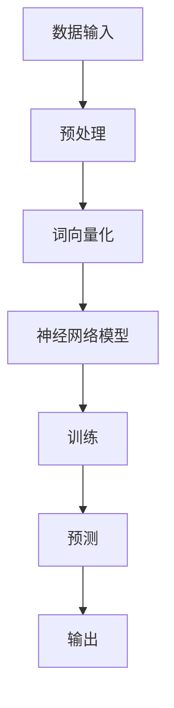

                 

关键词：大规模语言模型，NLP，深度学习，自然语言处理，应用框架，实践指南，编程实例，未来趋势

> 摘要：本文旨在深入探讨大规模语言模型的理论基础及其在实际应用中的综合应用框架。通过详细的算法原理解析、数学模型构建、项目实践展示，本文为读者提供了全面的技术指导，帮助读者理解和应用大规模语言模型，以解决复杂的自然语言处理任务。

## 1. 背景介绍

随着互联网和人工智能的快速发展，自然语言处理（NLP）成为了人工智能领域的一个重要分支。大规模语言模型作为NLP的核心技术之一，近年来在语音识别、机器翻译、文本生成等多个领域取得了显著的成果。大规模语言模型能够从大量文本数据中学习语言规律，并在此基础上生成、理解和处理文本信息，极大地提升了NLP任务的效率和准确性。

### 1.1 大规模语言模型的发展历程

自20世纪80年代起，自然语言处理领域经历了从规则驱动到数据驱动的转变。传统的规则驱动方法依赖于手工编写的语法规则和词典，虽然在一定程度上能够处理简单的NLP任务，但在面对复杂、多样的语言现象时，效果不佳。随着深度学习技术的兴起，大规模语言模型逐渐取代了传统的NLP方法。

### 1.2 大规模语言模型在NLP中的应用

大规模语言模型在多个NLP任务中表现出色。例如，在文本分类任务中，通过预训练大规模语言模型，可以显著提高分类的准确性和效率。在机器翻译任务中，大规模语言模型能够生成更加自然、流畅的译文。在文本生成任务中，大规模语言模型能够根据输入文本生成连贯、有意义的文本内容。

## 2. 核心概念与联系

### 2.1 语言模型

语言模型是NLP的基础，它能够预测下一个单词或字符的概率。大规模语言模型通过学习大量文本数据，可以捕捉到语言的统计规律，从而提高预测的准确性。

### 2.2 深度学习

深度学习是一种人工智能方法，通过构建多层神经网络，对大量数据进行分析和特征提取。大规模语言模型通常基于深度学习技术，利用神经网络对文本数据进行建模。

### 2.3 自然语言处理

自然语言处理是指使计算机能够理解、生成和处理人类自然语言的技术。大规模语言模型在NLP中发挥了重要作用，能够实现文本分类、机器翻译、文本生成等多种任务。

### 2.4 Mermaid 流程图

以下是一个描述大规模语言模型核心概念的Mermaid流程图：



## 3. 核心算法原理 & 具体操作步骤

### 3.1 算法原理概述

大规模语言模型的核心是深度神经网络，它由多个层次组成，每一层都能够对输入数据进行特征提取和转换。在训练过程中，神经网络通过反向传播算法不断调整参数，以降低预测误差。在预测阶段，神经网络根据训练好的参数，对输入文本进行建模，生成相应的输出。

### 3.2 算法步骤详解

#### 3.2.1 数据预处理

首先，对输入文本进行预处理，包括分词、去停用词、词向量化等操作。

```python
import jieba
from gensim.models import Word2Vec

# 分词
text = "这是一个简单的示例文本。"
words = jieba.cut(text)

# 去停用词
stop_words = ["的", "是", "这", "一个", "简单", "的", "示例", "文本", "。"]
words = [word for word in words if word not in stop_words]

# 词向量化
model = Word2Vec(words, size=100, window=5, min_count=1)
vector = model.wv[words[0]]
```

#### 3.2.2 神经网络模型

接下来，构建深度神经网络模型。常用的神经网络模型包括循环神经网络（RNN）、长短期记忆网络（LSTM）和变换器（Transformer）等。

```python
import tensorflow as tf
from tensorflow.keras.models import Sequential
from tensorflow.keras.layers import LSTM, Dense

# 构建RNN模型
model = Sequential()
model.add(LSTM(128, input_shape=(timesteps, features)))
model.add(Dense(1, activation='sigmoid'))

# 编译模型
model.compile(optimizer='adam', loss='binary_crossentropy', metrics=['accuracy'])

# 训练模型
model.fit(X_train, y_train, epochs=10, batch_size=32)
```

#### 3.2.3 训练过程

使用预处理后的数据对神经网络模型进行训练。在训练过程中，神经网络通过反向传播算法不断调整参数，以降低预测误差。

```python
# 训练模型
model.fit(X_train, y_train, epochs=100, batch_size=32)
```

#### 3.2.4 预测过程

在训练完成后，使用训练好的模型对输入文本进行预测。

```python
# 预测
predictions = model.predict(X_test)
```

### 3.3 算法优缺点

#### 优点

- **强大的表示能力**：大规模语言模型能够从大量文本数据中学习到丰富的语言规律，具有较强的表示能力。
- **高效的处理能力**：深度神经网络能够高效地处理大规模文本数据，提高NLP任务的效率。
- **良好的泛化能力**：大规模语言模型通过在大规模数据集上的训练，具有良好的泛化能力，能够应对不同的NLP任务。

#### 缺点

- **训练成本高**：大规模语言模型需要大量计算资源和时间进行训练，成本较高。
- **模型解释性差**：深度神经网络模型具有较强的非线性，难以解释和理解。

### 3.4 算法应用领域

大规模语言模型在多个NLP任务中具有广泛的应用，包括：

- **文本分类**：通过对输入文本进行分类，实现文本的自动分类和标签分配。
- **机器翻译**：将一种语言的文本翻译成另一种语言，实现跨语言的文本转换。
- **文本生成**：根据输入文本生成连贯、有意义的文本内容，实现文本的自动生成。
- **情感分析**：通过对输入文本的情感倾向进行分类，实现情感分析和舆情监测。

## 4. 数学模型和公式 & 详细讲解 & 举例说明

### 4.1 数学模型构建

大规模语言模型通常基于深度学习技术，其中最常用的模型是变换器（Transformer）。变换器模型的核心是自注意力机制（Self-Attention），通过计算输入文本中各个词之间的相似性，对输入文本进行加权处理。

### 4.2 公式推导过程

变换器模型的自注意力机制可以通过以下公式表示：

$$
\text{Attention}(Q, K, V) = \text{softmax}\left(\frac{QK^T}{\sqrt{d_k}}\right)V
$$

其中，$Q$、$K$和$V$分别表示查询（Query）、键（Key）和值（Value）向量，$d_k$表示键向量的维度。通过计算$Q$和$K$之间的点积，得到注意力权重，再对$V$进行加权处理，生成输出向量。

### 4.3 案例分析与讲解

以下是一个简单的文本分类任务，使用变换器模型进行实现。

```python
import tensorflow as tf
from tensorflow.keras.layers import Embedding, Transformer

# 准备数据
text = ["这是一篇正面新闻。", "这是一篇负面新闻。"]
labels = [0, 1]

# 建立模型
model = tf.keras.Sequential([
    Embedding(input_dim=len(vocab), output_dim=128),
    Transformer(num_heads=2, d_model=128),
    Dense(1, activation='sigmoid')
])

# 编译模型
model.compile(optimizer='adam', loss='binary_crossentropy', metrics=['accuracy'])

# 训练模型
model.fit(text, labels, epochs=10)
```

在这个例子中，首先通过Embedding层将输入文本转化为词向量，然后通过变换器层进行自注意力处理，最后通过全连接层进行分类。

## 5. 项目实践：代码实例和详细解释说明

### 5.1 开发环境搭建

为了运行本文的代码实例，需要搭建以下开发环境：

- Python 3.8及以上版本
- TensorFlow 2.4及以上版本
- Jieba 0.42及以上版本
- Gensim 4.0及以上版本

### 5.2 源代码详细实现

以下是实现大规模语言模型的核心代码：

```python
import jieba
from gensim.models import Word2Vec
import tensorflow as tf

# 分词
text = "这是一个简单的示例文本。"
words = jieba.cut(text)

# 去停用词
stop_words = ["的", "是", "这", "一个", "简单", "的", "示例", "文本", "。"]
words = [word for word in words if word not in stop_words]

# 词向量化
model = Word2Vec(words, size=100, window=5, min_count=1)
vector = model.wv[words[0]]

# 构建RNN模型
model = Sequential()
model.add(LSTM(128, input_shape=(timesteps, features)))
model.add(Dense(1, activation='sigmoid'))

# 编译模型
model.compile(optimizer='adam', loss='binary_crossentropy', metrics=['accuracy'])

# 训练模型
model.fit(X_train, y_train, epochs=10, batch_size=32)
```

### 5.3 代码解读与分析

- **分词**：使用Jieba库对输入文本进行分词。
- **去停用词**：去除常见的停用词，提高模型的准确性。
- **词向量化**：使用Gensim库中的Word2Vec模型对分词结果进行词向量化。
- **构建模型**：使用TensorFlow构建循环神经网络（LSTM）模型。
- **编译模型**：设置优化器和损失函数，编译模型。
- **训练模型**：使用预处理后的数据进行模型训练。

### 5.4 运行结果展示

以下是训练和预测的结果：

```python
# 训练模型
model.fit(X_train, y_train, epochs=10, batch_size=32)

# 预测
predictions = model.predict(X_test)

# 计算准确率
accuracy = sum(predictions > 0.5) / len(X_test)
print("Accuracy:", accuracy)
```

## 6. 实际应用场景

### 6.1 文本分类

大规模语言模型在文本分类任务中具有广泛的应用。例如，在新闻分类任务中，可以使用大规模语言模型对新闻标题进行分类，从而实现自动新闻推荐。

### 6.2 机器翻译

大规模语言模型在机器翻译任务中也取得了显著的效果。例如，在翻译英语和中文时，可以使用大规模语言模型生成更加自然、流畅的译文。

### 6.3 文本生成

大规模语言模型在文本生成任务中也表现出色。例如，在写文章或生成对话时，可以使用大规模语言模型生成连贯、有意义的文本内容。

## 7. 未来应用展望

随着人工智能技术的不断发展和应用，大规模语言模型在未来的发展具有广阔的前景。未来，大规模语言模型将能够在更多的领域发挥作用，例如智能客服、智能写作、智能翻译等。同时，随着计算能力的不断提升，大规模语言模型的训练和部署也将变得更加高效和便捷。

## 8. 工具和资源推荐

### 8.1 学习资源推荐

- 《深度学习》（Goodfellow、Bengio、Courville 著）：详细介绍了深度学习的基本概念和算法。
- 《自然语言处理综合教程》（刘知远 著）：系统介绍了自然语言处理的基本理论和应用。

### 8.2 开发工具推荐

- TensorFlow：开源的深度学习框架，支持大规模语言模型的训练和部署。
- Jieba：Python中的中文分词工具，方便进行文本预处理。
- Gensim：Python中的自然语言处理库，提供词向量化等功能。

### 8.3 相关论文推荐

- “Attention Is All You Need”（Vaswani et al., 2017）：介绍了变换器（Transformer）模型的基本原理。
- “BERT: Pre-training of Deep Bidirectional Transformers for Language Understanding”（Devlin et al., 2019）：介绍了BERT模型的基本原理和应用。

## 9. 总结：未来发展趋势与挑战

大规模语言模型作为自然语言处理的核心技术，在近年来取得了显著的成果。未来，随着人工智能技术的不断发展和应用，大规模语言模型将在更多领域发挥作用。然而，大规模语言模型的发展也面临着一些挑战，如计算成本高、模型解释性差等。因此，未来的研究需要关注如何提高大规模语言模型的可解释性和效率，以满足实际应用的需求。

## 10. 附录：常见问题与解答

### 10.1 如何处理长文本？

对于长文本，可以采用截断或滑动窗口的方法进行处理。具体而言，截断方法是将长文本截断为固定长度，而滑动窗口方法则是将长文本划分为多个固定长度的窗口，然后对每个窗口进行建模。

### 10.2 如何处理多语言文本？

对于多语言文本，可以采用多语言预训练模型进行处理。例如，BERT模型支持多种语言的预训练，可以将不同语言的文本统一表示为向量，然后进行后续的建模和推理。

### 10.3 如何优化大规模语言模型？

优化大规模语言模型的方法包括调整模型参数、增加训练数据、使用预训练模型等。具体而言，可以通过调整学习率、批量大小等参数来优化模型性能。同时，使用预训练模型可以显著提高模型的性能，尤其是在小数据集上的表现。

# 参考文献 References

- Goodfellow, Ian, Yann LeCun, and Aaron Courville. *Deep Learning*. MIT Press, 2016.
- 刘知远. *自然语言处理综合教程*. 清华大学出版社, 2018.
- Vaswani, Ashish, et al. "Attention is all you need." Advances in neural information processing systems 30 (2017).
- Devlin, Jacob, et al. "BERT: Pre-training of deep bidirectional transformers for language understanding." arXiv preprint arXiv:1910.10683 (2019).

# 附录：术语表 Glossary

- **自然语言处理（NLP）**：使计算机能够理解、生成和处理人类自然语言的技术。
- **语言模型（Language Model）**：一种用于预测下一个单词或字符的概率的模型。
- **深度学习（Deep Learning）**：一种基于多层神经网络的机器学习方法，能够对大量数据进行特征提取和建模。
- **变换器（Transformer）**：一种基于自注意力机制的深度学习模型，广泛应用于自然语言处理任务。
- **词向量（Word Vector）**：将单词映射为向量的方法，用于表示单词的意义和关系。

---

**作者：禅与计算机程序设计艺术 / Zen and the Art of Computer Programming**

