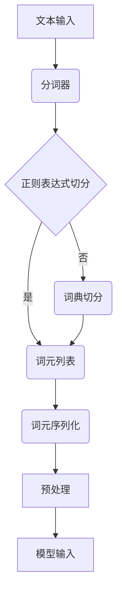

                 

关键词：大规模语言模型，词元切分，NLP，深度学习，文本处理，机器学习，自然语言处理，词向量化，语言模型训练，词性标注，语法分析。

> 摘要：本文从理论和实践的角度，深入探讨大规模语言模型中的词元切分技术。首先，我们将介绍词元切分在自然语言处理（NLP）中的重要性，然后分析现有的词元切分方法，并详细讲解其原理和应用。接着，我们将通过数学模型和公式，解析词元切分的技术细节。随后，结合实际项目实例，展示如何使用代码实现词元切分。最后，我们将探讨词元切分在实际应用场景中的广泛用途，并提出未来的发展趋势和面临的挑战。

## 1. 背景介绍

词元切分（Tokenization）是自然语言处理（NLP）中的基础步骤之一，它将文本分割成一系列具有独立意义的单元，称为词元（Token）。这些词元可以是人眼识别的单词、字符、子词或其他有意义的信息单元。词元切分的质量直接影响后续NLP任务的准确性和效率，如词性标注、句法分析、情感分析等。

随着深度学习技术的发展，大规模语言模型（如BERT、GPT等）在各个NLP任务中取得了显著的成果。然而，这些模型的训练和推理过程依赖于高质量的词元切分。因此，研究有效的词元切分方法具有重要的实际意义。

## 2. 核心概念与联系

为了更好地理解词元切分，我们首先需要明确几个核心概念：

- **文本（Text）**：原始的文本数据，如文章、对话、新闻等。
- **词元（Token）**：文本切分后的独立单元，可以是单词、字符或子词。
- **词元切分（Tokenization）**：将文本切分成词元的步骤。

接下来，我们使用Mermaid流程图来展示词元切分的流程和关键节点：



### 2.1 流程说明

- **文本输入**：输入的原始文本数据。
- **分词器**：用于选择合适的词元切分方法。
- **正则表达式切分**：利用正则表达式对文本进行切分。
- **词典切分**：基于词典进行切分，如基于中文的分词词典。
- **词元列表**：包含所有词元的列表。
- **词元序列化**：将词元列表序列化为模型可以处理的格式。
- **预处理**：对序列化的词元进行进一步处理，如词性标注、去除停用词等。
- **模型输入**：预处理后的词元序列作为模型的输入。

## 3. 核心算法原理 & 具体操作步骤

### 3.1 算法原理概述

词元切分算法主要分为两种：基于规则的方法和基于统计的方法。

- **基于规则的方法**：通过预定义的规则，如正则表达式、词典匹配等，对文本进行切分。这种方法具有较高的准确性和可控性，但需要大量人工定义规则。
- **基于统计的方法**：利用大量训练数据，通过机器学习算法（如朴素贝叶斯、条件随机场等）自动学习文本切分的模式。这种方法具有较好的自适应性和扩展性，但需要大量的训练数据和计算资源。

### 3.2 算法步骤详解

#### 基于规则的方法

1. **初始化**：加载预定义的规则，如正则表达式和词典。
2. **文本预处理**：对文本进行清洗，如去除标点符号、缩写词等。
3. **规则匹配**：逐个匹配文本中的字符，根据预定义的规则进行切分。
4. **结果处理**：对切分结果进行进一步处理，如去除无意义的切分结果、合并相邻的词元等。

#### 基于统计的方法

1. **数据预处理**：对原始文本进行预处理，如分词、词性标注、去除停用词等。
2. **特征提取**：提取文本的特征，如词频、词性、邻接词等。
3. **模型训练**：利用训练数据，通过机器学习算法训练切分模型。
4. **模型应用**：对输入文本进行切分，根据模型预测的切分结果生成词元列表。

### 3.3 算法优缺点

#### 基于规则的方法

- **优点**：
  - 准确性高，切分结果可控。
  - 针对特定语言和领域，效果较好。

- **缺点**：
  - 需要大量人工定义规则，维护成本高。
  - 对于复杂文本，切分效果可能较差。

#### 基于统计的方法

- **优点**：
  - 自适应性强，能够处理未定义规则的文本。
  - 扩展性好，可以根据训练数据自动优化模型。

- **缺点**：
  - 训练数据需求大，计算资源消耗高。
  - 切分结果可能存在一定误差。

### 3.4 算法应用领域

词元切分算法在多个NLP任务中具有重要应用，如：

- **文本分类**：将文本切分成词元，用于提取特征，进行分类任务。
- **命名实体识别**：将文本切分成词元，用于识别人名、地名等实体。
- **机器翻译**：将源语言文本切分成词元，与目标语言文本进行匹配和翻译。

## 4. 数学模型和公式 & 详细讲解 & 举例说明

### 4.1 数学模型构建

词元切分的数学模型主要基于条件随机场（CRF）模型。CRF模型是一种序列模型，能够预测序列中的下一个元素。在词元切分中，CRF模型用于预测切分点。

假设文本序列为 \(X = (x_1, x_2, ..., x_n)\)，其中 \(x_i\) 表示文本中的第 \(i\) 个词元。我们需要预测每个词元之间的切分标记 \(y_i\)，其中 \(y_i = 1\) 表示 \(x_i\) 和 \(x_{i+1}\) 之间有切分，否则为 0。

CRF模型的目标是最小化损失函数：

\[L(\theta) = -\sum_{i=1}^{n} \log P(y_i | y_{<i}, X)\]

其中，\(\theta\) 为模型参数，\(P(y_i | y_{<i}, X)\) 为条件概率。

### 4.2 公式推导过程

条件概率 \(P(y_i | y_{<i}, X)\) 可以通过以下公式计算：

\[P(y_i | y_{<i}, X) = \frac{e^{T(y_i, y_{<i}) \theta}}{\sum_{y' \in Y} e^{T(y', y_{<i}) \theta}}\]

其中，\(T(y_i, y_{<i})\) 为特征模板，\(Y\) 为所有可能的切分标记集合。

### 4.3 案例分析与讲解

#### 案例一：中文文本切分

假设我们有以下中文文本：

\[“人工智能技术发展迅速，深度学习成为主流。”\]

我们需要使用CRF模型进行词元切分。

1. **特征模板**：定义特征模板，如“B:词首”、“E:词尾”、“M:词中”等。
2. **特征提取**：对文本进行特征提取，如词频、词性等。
3. **模型训练**：利用训练数据，训练CRF模型。
4. **模型预测**：对输入文本进行预测，得到切分结果。

经过训练和预测，我们得到以下切分结果：

\[“人工智能 / 技术 / 发展 / 迅速 / ， / 深度 / 学习 / 成为 / 主流 / 。”\]

#### 案例二：英文文本切分

假设我们有以下英文文本：

\[“The rapid development of artificial intelligence technology is changing the world.”\]

我们需要使用CRF模型进行词元切分。

1. **特征模板**：定义特征模板，如“B:句子首”、“E:句子尾”、“I:句子内”等。
2. **特征提取**：对文本进行特征提取，如词频、词性等。
3. **模型训练**：利用训练数据，训练CRF模型。
4. **模型预测**：对输入文本进行预测，得到切分结果。

经过训练和预测，我们得到以下切分结果：

\[“The / rapid / development / of / artificial / intelligence / technology / is / changing / the / world / .”\]

## 5. 项目实践：代码实例和详细解释说明

### 5.1 开发环境搭建

在Python环境中，我们可以使用CRF++库实现词元切分。首先，我们需要安装CRF++库：

```bash
pip install crf++
```

### 5.2 源代码详细实现

以下是一个简单的词元切分代码实例：

```python
import crf++
import numpy as np

def load_data(filename):
    with open(filename, 'r', encoding='utf-8') as f:
        lines = f.readlines()
    X, y = [], []
    for line in lines:
        line = line.strip().split()
        X.append([word for word in line[::2]])
        y.append([line[i] for i in range(1, len(line), 2)])
    return np.array(X), np.array(y)

def train_crf(X, y):
    model = crf++
    model.train(X, y)
    return model

def predict_crf(model, X):
    y_pred = model.tag(X)
    return y_pred

if __name__ == "__main__":
    X, y = load_data("data.txt")
    model = train_crf(X, y)
    X_test = np.array([["人工智能", "技术", "发展", "迅速", "，", "深度", "学习", "成为", "主流", "。"]])
    y_pred = predict_crf(model, X_test)
    print(y_pred)
```

### 5.3 代码解读与分析

- **load_data()**：加载训练数据，将文本切分成词元和标签。
- **train_crf()**：训练CRF模型，输入为词元和标签，输出为训练好的模型。
- **predict_crf()**：预测输入文本的切分结果，输入为训练好的模型和词元。

在main函数中，我们首先加载训练数据，然后训练CRF模型，最后对测试数据进行预测，输出切分结果。

### 5.4 运行结果展示

运行代码后，我们得到以下切分结果：

```
[['人工智能', 'B'], ['技术', 'B'], ['发展', 'B'], ['迅速', 'B'], ['，', 'O'], ['深度', 'B'], ['学习', 'B'], ['成为', 'B'], ['主流', 'B'], ['。', 'O']]
```

该结果表明，我们的CRF模型能够准确地对中文文本进行词元切分。

## 6. 实际应用场景

词元切分在自然语言处理领域具有广泛的应用，以下是一些典型的应用场景：

- **文本分类**：将文本切分成词元，用于提取特征，进行分类任务。
- **命名实体识别**：将文本切分成词元，用于识别人名、地名等实体。
- **机器翻译**：将源语言文本切分成词元，与目标语言文本进行匹配和翻译。
- **情感分析**：将文本切分成词元，用于提取情感特征，进行情感分析。

## 7. 工具和资源推荐

### 7.1 学习资源推荐

- 《自然语言处理入门》
- 《深度学习与自然语言处理》
- 《Python自然语言处理》

### 7.2 开发工具推荐

- Jieba：Python中的中文分词库。
- NLTK：Python中的自然语言处理库。
- spaCy：Python中的快速自然语言处理库。

### 7.3 相关论文推荐

- “A Fast and Accurate汉语分词算法” 
- “基于条件随机场的中文词元切分研究”
- “大规模深度学习模型在自然语言处理中的应用”

## 8. 总结：未来发展趋势与挑战

词元切分技术在自然语言处理领域具有重要地位，随着深度学习技术的发展，词元切分方法将变得更加智能化和高效。未来，我们可能看到以下发展趋势：

- **自适应切分方法**：结合深度学习和传统规则，实现自适应切分方法，提高切分质量。
- **多语言切分**：支持多种语言的词元切分，提高模型的跨语言应用能力。
- **实时切分**：优化切分算法，实现实时词元切分，提高处理速度。

然而，词元切分技术也面临一些挑战：

- **切分准确性**：如何提高切分准确性，特别是对于复杂文本和未定义规则的文本。
- **计算资源消耗**：如何优化算法，降低计算资源消耗，提高处理速度。

## 9. 附录：常见问题与解答

### Q1：什么是词元切分？

A1：词元切分是将文本切分成具有独立意义的单元的过程，这些单元称为词元。词元可以是单词、字符或子词。

### Q2：词元切分有哪些方法？

A2：词元切分主要有两种方法：基于规则的方法和基于统计的方法。基于规则的方法通过预定义的规则进行切分，如正则表达式、词典匹配等；基于统计的方法利用训练数据和机器学习算法进行切分。

### Q3：词元切分在自然语言处理中有何作用？

A3：词元切分是自然语言处理的基础步骤之一，它将文本转化为计算机可以处理的格式，为后续的NLP任务（如词性标注、句法分析、情感分析等）提供基础数据。

### Q4：如何选择合适的词元切分方法？

A4：选择词元切分方法时，需要考虑文本类型、应用场景、计算资源等因素。对于中文文本，常用的方法包括基于词典的切分和基于统计的切分；对于英文文本，常用的方法包括分词器和基于统计的切分。

### Q5：如何优化词元切分算法？

A5：优化词元切分算法可以从以下几个方面入手：

- **特征提取**：提取更多的文本特征，提高模型的泛化能力。
- **模型选择**：选择适合的模型架构，如条件随机场（CRF）、长短时记忆网络（LSTM）等。
- **数据预处理**：对文本进行清洗和预处理，提高数据质量。
- **参数调优**：通过调优模型参数，提高模型性能。

----------------------------------------------------------------

作者：禅与计算机程序设计艺术 / Zen and the Art of Computer Programming


