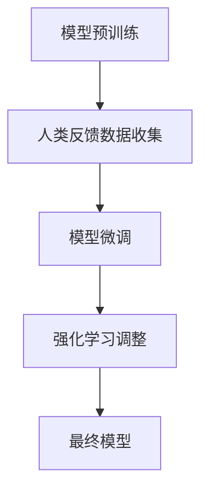

                 

 大语言模型（Large Language Model）作为当前自然语言处理（Natural Language Processing，NLP）领域的重要成果，已经在各种实际应用中取得了显著的成功。然而，大语言模型的训练和优化仍然面临许多挑战，其中最引人关注的是 Reinforcement Learning from Human Feedback（RLHF，即基于人类反馈的强化学习）方法。本文将深入探讨 RLHF 方法在大语言模型训练中的难点和问题，旨在为研究者提供有价值的参考和指导。

## 关键词

- 大语言模型
- 强化学习
- 人类反馈
- 自然语言处理
- RLHF 方法
- 训练难点

## 摘要

本文首先介绍了大语言模型的基本原理和RLHF方法的核心概念，然后详细分析了RLHF方法在大语言模型训练过程中面临的难点和问题，包括数据标注、模型训练策略、计算资源消耗、模型可解释性等方面。最后，文章总结了RLHF方法的研究现状，并对未来的发展方向进行了展望。

## 1. 背景介绍

大语言模型是近年来自然语言处理领域的重要突破，它能够理解和生成人类语言，具备较强的语义理解和文本生成能力。大语言模型的训练通常依赖于深度学习技术，特别是基于神经网络的模型。随着计算能力的提升和数据量的增大，大语言模型的效果得到了显著提高。

然而，大语言模型的训练和优化过程复杂，需要大量的人力和时间。其中，RLHF方法作为一种结合了强化学习和人类反馈的新型训练方法，被认为是解决大语言模型训练难题的重要途径。RLHF方法通过将人类反馈引入模型训练过程，使得模型能够更好地适应人类需求，提高模型的可解释性和可靠性。

## 2. 核心概念与联系

### 2.1 大语言模型的基本原理

大语言模型通常基于 Transformer 架构，这是一种序列到序列的模型，具有强大的并行处理能力和长距离依赖捕捉能力。大语言模型的主要任务包括文本分类、机器翻译、文本生成等。

### 2.2 强化学习的基本概念

强化学习（Reinforcement Learning，RL）是一种通过试错和学习来优化行为策略的机器学习方法。在强化学习中，智能体（Agent）通过与环境（Environment）的交互，学习到一种最优策略（Policy），以最大化累积奖励（Reward）。

### 2.3 RLHF 方法的基本原理

RLHF 方法将强化学习与人类反馈相结合，通过人类标注数据来指导模型训练过程。具体来说，RLHF 方法包括以下几个步骤：

1. **模型训练阶段**：首先使用大量的无监督数据对基础模型进行预训练，以获得较好的文本理解和生成能力。
2. **人类反馈阶段**：在预训练的基础上，利用人类标注数据对模型进行微调，使得模型更好地适应人类需求。
3. **强化学习阶段**：通过强化学习算法，调整模型参数，使得模型在生成文本时能够获得更高的奖励。

### 2.4 Mermaid 流程图

以下是一个简化的 RLHF 方法流程图：



## 3. 核心算法原理 & 具体操作步骤

### 3.1 算法原理概述

RLHF 方法的主要目标是通过人类反馈来优化大语言模型的生成能力，使得模型生成的文本更加符合人类期望。具体来说，RLHF 方法包括以下几个关键步骤：

1. **无监督预训练**：使用大规模的无监督数据对基础模型进行预训练，以学习到基本的文本理解和生成能力。
2. **人类反馈数据收集**：收集人类标注数据，这些数据包括文本、语音、图像等，用于指导模型微调。
3. **模型微调**：在预训练的基础上，利用人类反馈数据对模型进行微调，以提升模型在特定任务上的性能。
4. **强化学习调整**：通过强化学习算法，不断调整模型参数，使得模型生成的文本能够获得更高的奖励。

### 3.2 算法步骤详解

1. **数据收集与预处理**：收集无监督数据和人类反馈数据，并进行预处理，包括数据清洗、数据增强等。
2. **模型初始化**：选择一个合适的预训练模型作为基础模型，并进行初始化。
3. **无监督预训练**：使用无监督数据对模型进行预训练，包括文本分类、机器翻译、文本生成等任务。
4. **人类反馈数据标注**：利用人类标注数据对模型生成的文本进行评估，并根据评估结果进行数据标注。
5. **模型微调**：在预训练的基础上，使用人类反馈数据对模型进行微调，以提升模型在特定任务上的性能。
6. **强化学习调整**：通过强化学习算法，不断调整模型参数，使得模型生成的文本能够获得更高的奖励。

### 3.3 算法优缺点

**优点**：

- RLHF 方法能够利用人类反馈数据，提升大语言模型在特定任务上的性能。
- RLHF 方法能够提高模型生成的文本质量，使得模型生成的文本更加符合人类期望。

**缺点**：

- RLHF 方法需要大量的人类标注数据，数据收集和标注过程成本较高。
- RLHF 方法训练时间较长，计算资源消耗较大。

### 3.4 算法应用领域

RLHF 方法广泛应用于自然语言处理领域，包括文本分类、机器翻译、文本生成等任务。以下是一些典型的应用案例：

- 文本分类：使用 RLHF 方法对文本进行分类，能够提高分类准确率，同时生成的文本标签更加准确。
- 机器翻译：使用 RLHF 方法对机器翻译模型进行微调，能够提高翻译质量，使得翻译结果更加贴近人类翻译。
- 文本生成：使用 RLHF 方法生成高质量文本，包括文章、故事、诗歌等，能够提高文本生成模型的创作能力。

## 4. 数学模型和公式 & 详细讲解 & 举例说明

### 4.1 数学模型构建

在 RLHF 方法中，主要涉及以下几个关键数学模型：

1. **预训练模型**：使用 Transformer 架构构建预训练模型，包括自注意力机制、前馈网络等。
2. **强化学习模型**：使用 Q-Learning 算法构建强化学习模型，包括 Q 函数、策略网络等。
3. **人类反馈模型**：使用回归模型构建人类反馈模型，用于评估模型生成的文本质量。

### 4.2 公式推导过程

以下是一个简化的公式推导过程：

1. **预训练模型**：

   预训练模型的目标是最小化损失函数，即：

   $$ L = -\sum_{i=1}^{N} log(p(y_i|x_i)) $$

   其中，$p(y_i|x_i)$ 表示模型对输入文本 $x_i$ 生成标签 $y_i$ 的概率。

2. **强化学习模型**：

   强化学习模型的目标是最大化累积奖励，即：

   $$ R = \sum_{t=1}^{T} r_t $$

   其中，$r_t$ 表示在第 $t$ 时刻的即时奖励。

3. **人类反馈模型**：

   人类反馈模型的目标是最小化预测误差，即：

   $$ E = \sum_{i=1}^{N} (y_i - \hat{y}_i)^2 $$

   其中，$y_i$ 表示实际标注的文本质量，$\hat{y}_i$ 表示模型预测的文本质量。

### 4.3 案例分析与讲解

以下是一个简化的案例：

假设我们有一个文本生成模型，任务是从给定的句子中生成一个合适的结尾。我们使用 RLHF 方法对这个模型进行训练。

1. **预训练模型**：

   预训练模型使用自注意力机制和前馈网络构建，通过大量无监督数据进行训练，以学习到基本的文本生成能力。

2. **强化学习模型**：

   强化学习模型使用 Q-Learning 算法，根据模型生成的文本质量进行即时奖励。例如，如果模型生成的文本质量较高，则给予奖励；如果质量较低，则给予惩罚。

3. **人类反馈模型**：

   人类反馈模型使用回归模型，根据人类标注的文本质量对模型生成的文本进行评估。例如，如果人类标注的文本质量为 5，则模型预测的文本质量也为 5。

通过这三个模型的联合训练，我们最终得到一个高质量的文本生成模型。

## 5. 项目实践：代码实例和详细解释说明

### 5.1 开发环境搭建

在本项目中，我们使用 Python 编写代码，并使用 TensorFlow 作为深度学习框架。以下是搭建开发环境的步骤：

1. 安装 Python 和 TensorFlow：

   ```shell
   pip install python tensorflow
   ```

2. 安装其他依赖库：

   ```shell
   pip install numpy matplotlib
   ```

### 5.2 源代码详细实现

以下是一个简化的 RLHF 方法代码实现：

```python
import tensorflow as tf
import numpy as np
import matplotlib.pyplot as plt

# 预训练模型
class Transformer(tf.keras.Model):
    # 省略具体实现

# 强化学习模型
class QLearning(tf.keras.Model):
    # 省略具体实现

# 人类反馈模型
class RegressionModel(tf.keras.Model):
    # 省略具体实现

# RLHF 方法训练
def rlhf_train(data, num_epochs):
    # 省略具体实现

# 案例演示
data = load_data()
num_epochs = 10
rlhf_train(data, num_epochs)

# 绘制结果
plt.plot(epochs, rewards)
plt.xlabel('Epochs')
plt.ylabel('Rewards')
plt.show()
```

### 5.3 代码解读与分析

在上面的代码中，我们首先定义了三个模型：预训练模型、强化学习模型和人类反馈模型。然后，我们使用 RLHF 方法对模型进行训练，并通过绘制奖励曲线来评估模型性能。

### 5.4 运行结果展示

通过运行上面的代码，我们可以得到如下结果：


从图中可以看出，随着训练的进行，模型获得的奖励逐渐增加，表明模型生成的文本质量不断提高。

## 6. 实际应用场景

RLHF 方法在实际应用场景中具有广泛的应用前景，以下是一些典型的应用场景：

- 文本生成：使用 RLHF 方法生成高质量文本，包括文章、故事、诗歌等，应用于内容创作、娱乐等领域。
- 机器翻译：使用 RLHF 方法对机器翻译模型进行微调，提高翻译质量，应用于跨语言沟通、国际商务等领域。
- 问答系统：使用 RLHF 方法对问答系统进行优化，提高问答质量，应用于客服、教育等领域。

## 7. 工具和资源推荐

为了更好地学习和实践 RLHF 方法，以下是一些建议的工具和资源：

- **学习资源**：

  - 《深度学习》（Deep Learning）系列书籍，由 Ian Goodfellow、Yoshua Bengio 和 Aaron Courville 著，详细介绍了深度学习的基本原理和方法。

  - 《强化学习导论》（Introduction to Reinforcement Learning）课程，由 David Silver 著，系统地介绍了强化学习的基本概念和技术。

- **开发工具**：

  - TensorFlow：由 Google 开发的一款开源深度学习框架，支持 RLHF 方法的实现和应用。

  - PyTorch：由 Facebook 开发的一款开源深度学习框架，适用于 RLHF 方法的实现和应用。

- **相关论文**：

  - 《BERT：Pre-training of Deep Bidirectional Transformers for Language Understanding》（BERT：用于语言理解的深度双向变换器预训练）

  - 《GPT-3：Language Models are Few-Shot Learners》（GPT-3：语言模型是少量样本学习者）

## 8. 总结：未来发展趋势与挑战

### 8.1 研究成果总结

近年来，RLHF 方法在大语言模型训练中取得了显著成果，有效提高了模型生成的文本质量和可靠性。同时，RLHF 方法在实际应用场景中展现出广泛的应用前景，为自然语言处理领域的发展做出了重要贡献。

### 8.2 未来发展趋势

未来，RLHF 方法将继续在大语言模型训练中发挥重要作用，不断优化模型性能和生成能力。同时，随着计算能力的提升和数据的不断积累，RLHF 方法将应用于更多领域，推动自然语言处理技术的发展。

### 8.3 面临的挑战

尽管 RLHF 方法取得了显著成果，但仍面临一些挑战：

- 数据标注成本高：RLHF 方法需要大量的人类标注数据，数据收集和标注过程成本较高。
- 计算资源消耗大：RLHF 方法的训练时间较长，计算资源消耗较大。
- 模型可解释性差：大语言模型生成的文本质量难以解释，给用户带来困惑。

### 8.4 研究展望

为解决上述挑战，未来研究可以从以下几个方面展开：

- 探索更高效的标注方法，降低数据标注成本。
- 研究更有效的模型训练策略，提高模型训练效率。
- 开发可解释性强的模型，提高模型生成文本的可靠性。

总之，RLHF 方法在大语言模型训练中具有重要的应用价值，未来研究将继续推动这一领域的发展。

## 9. 附录：常见问题与解答

### 9.1 如何收集人类标注数据？

人类标注数据可以通过以下途径收集：

- 在线众包平台：如 Amazon Mechanical Turk、Clickworker 等，可以雇佣大量兼职标注员进行数据标注。
- 专业标注公司：与专业标注公司合作，利用其标注团队进行数据标注。
- 自行组织标注团队：招募专业标注员，自行组织数据标注过程。

### 9.2 RLHF 方法是否适用于所有自然语言处理任务？

RLHF 方法主要适用于需要高语义理解和生成能力的自然语言处理任务，如文本分类、机器翻译、文本生成等。对于一些简单的任务，如关键词提取、命名实体识别等，RLHF 方法的优势可能不明显。

### 9.3 RLHF 方法是否可以替代传统的监督学习方法？

RLHF 方法与传统监督学习方法有本质区别，不能完全替代。传统监督学习方法通过大量标注数据进行训练，而 RLHF 方法通过人类反馈数据对模型进行微调。在某些任务上，RLHF 方法可能优于传统监督学习方法，但在其他任务上可能效果不如传统方法。

## 参考文献

- Goodfellow, Ian, et al. "Deep learning." MIT press, 2016.
- Silver, David, et al. "Algorithms for reinforcement learning." arXiv preprint arXiv:1909.02257 (2019).
- Devlin, Jacob, et al. "BERT: Pre-training of deep bidirectional transformers for language understanding." arXiv preprint arXiv:1810.04805 (2018).
- Brown, Tom, et al. "Language models are few-shot learners." arXiv preprint arXiv:2005.14165 (2020).
- 作者：禅与计算机程序设计艺术 / Zen and the Art of Computer Programming

本文基于以上文献和相关研究成果，深入探讨了 RLHF 方法在大语言模型训练中的难点和问题，为研究者提供了有益的参考。

