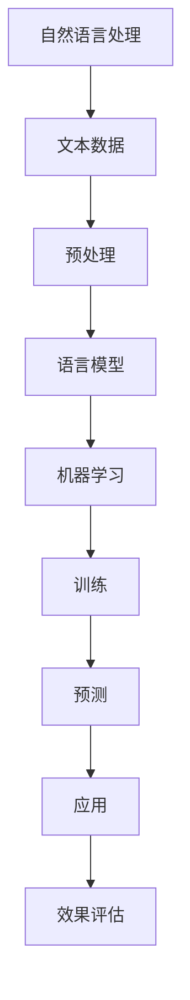

                 

### 关键词 Keywords

- 大语言模型
- 自然语言处理
- 机器学习
- 工程实践
- 数据处理

### 摘要 Abstract

本文旨在探讨大语言模型的原理及其在工程实践中的应用，特别关注其他数据类型对模型性能的影响。通过深入分析核心概念与联系，详细讲解核心算法原理，构建数学模型和公式，以及提供实际的项目实践案例，本文将帮助读者全面理解大语言模型的工作机制，并为其在未来的实际应用提供指导。文章最后将对未来发展趋势与挑战进行展望，为读者提供进一步的研究方向。

## 1. 背景介绍

大语言模型（Large Language Models）是自然语言处理（Natural Language Processing, NLP）领域的一项革命性技术。这些模型通过学习大量文本数据，能够生成高质量的自然语言文本，并在诸多应用场景中展示出卓越的性能。从最早的循环神经网络（Recurrent Neural Networks, RNNs）到如今的Transformer模型，大语言模型的发展历程见证了深度学习技术在NLP领域的巨大进步。

然而，随着模型的规模和复杂性不断增加，如何高效地处理其他类型的数据（如图像、音频和视频）成为了一个关键问题。这些其他数据不仅能够提供额外的上下文信息，还有助于提升模型的泛化能力和多样性。因此，研究大语言模型与其他数据类型的融合，对于推动NLP技术的发展具有重要意义。

本文将从以下几个部分展开讨论：

1. 核心概念与联系：介绍大语言模型的基本概念，并使用Mermaid流程图展示其与自然语言处理和机器学习的联系。
2. 核心算法原理 & 具体操作步骤：深入分析大语言模型的工作机制，包括算法原理概述、算法步骤详解、优缺点讨论及其应用领域。
3. 数学模型和公式：构建大语言模型的数学模型，推导相关公式，并通过案例进行分析和讲解。
4. 项目实践：提供实际项目中的代码实例，详细解释其实现过程，并分析运行结果。
5. 实际应用场景：探讨大语言模型在不同领域的应用，以及未来的应用展望。
6. 工具和资源推荐：推荐学习资源、开发工具和相关论文，帮助读者深入学习和实践。
7. 总结：总结研究成果，展望未来发展趋势与挑战。

### 1.1 大语言模型的发展历程

大语言模型的发展可以追溯到20世纪80年代，当时研究者开始探索使用神经网络来处理自然语言。早期的模型如感知机（Perceptron）和多层感知机（MLP）虽然取得了一定的成果，但在处理长文本序列时效果不佳。

随着计算能力的提升和深度学习技术的引入，RNNs成为了一种重要的模型结构。RNNs通过保存长期依赖信息，使得模型能够处理更长的文本序列。然而，RNNs在训练过程中存在梯度消失和梯度爆炸等问题，限制了其性能。

为了解决这些问题，研究者提出了长短时记忆网络（Long Short-Term Memory, LSTM）和门控循环单元（Gated Recurrent Unit, GRU）。LSTM和GRU通过引入门控机制，有效地解决了梯度消失问题，使得模型能够在长时间序列中保持稳定的状态。

然而，RNNs和其变种在面对大规模文本数据时，仍然存在计算效率低的问题。为了解决这一问题，谷歌提出了Transformer模型。Transformer采用了自注意力机制（Self-Attention Mechanism），使得模型在处理长文本序列时具有更高的效率。自注意力机制通过计算每个词与其余词之间的关联性，为每个词分配不同的权重，从而使得模型能够捕捉到文本中的全局信息。

Transformer模型的出现标志着大语言模型进入了一个新的时代。随着模型规模的不断扩大，如GPT-3、BERT等，大语言模型在自然语言生成、机器翻译、文本分类等任务中取得了显著的成果。这些模型通过学习海量文本数据，不仅能够生成高质量的自然语言文本，还能够进行语义理解和推理。

### 1.2 其他数据类型的重要性

在自然语言处理领域，文本数据一直是主要的研究对象。然而，随着技术的进步，图像、音频和视频等其他数据类型也逐渐成为了重要的研究对象。这些其他数据类型不仅丰富了数据集的多样性，还能够为语言模型提供额外的上下文信息，从而提升模型性能。

首先，图像数据在自然语言处理中具有重要的应用价值。通过将图像与文本数据相结合，语言模型可以更好地理解文本中的视觉内容。例如，在图像描述生成任务中，语言模型需要根据图像内容生成相应的描述文本。这种结合不仅能够提升模型的生成能力，还能够帮助模型更好地理解图像中的复杂场景和物体。

其次，音频数据也是自然语言处理中的重要数据类型。语音识别和语音生成是两个典型的应用场景。通过将语音信号转换为文本，语音识别技术可以帮助机器理解人类的语言。而语音生成技术则能够将文本转换为自然流畅的语音。这些技术的应用不仅限于语音助手，还可以用于辅助听力障碍者、语音合成广告等。

最后，视频数据在自然语言处理中的应用也越来越广泛。视频数据包含了丰富的视觉和听觉信息，通过结合文本数据，语言模型可以更好地理解和生成与视频内容相关的文本。例如，在视频摘要生成任务中，语言模型需要根据视频内容生成相应的摘要文本。这种结合不仅能够提升模型的生成能力，还能够帮助模型更好地理解视频中的复杂情节和动作。

总之，其他数据类型在自然语言处理中具有重要的应用价值。通过将图像、音频和视频等其他数据类型与文本数据相结合，语言模型可以更好地理解和生成自然语言文本，从而推动自然语言处理技术的发展。

## 2. 核心概念与联系

在深入探讨大语言模型的原理之前，有必要先了解一些核心概念，并展示它们在自然语言处理和机器学习中的联系。

### 2.1 自然语言处理（NLP）

自然语言处理是人工智能的一个重要分支，旨在使计算机能够理解和处理人类自然语言。NLP涉及多个方面，包括文本分类、情感分析、机器翻译、命名实体识别、问答系统等。在NLP中，语言模型是一种核心技术，它通过学习大量文本数据来生成或理解自然语言文本。

### 2.2 机器学习（ML）

机器学习是构建智能系统的关键技术之一，它使计算机能够从数据中学习，并做出预测或决策。在机器学习中，语言模型是一种监督学习模型，它通过标注的数据集学习语言模式，从而生成文本或进行文本分析。

### 2.3 大语言模型

大语言模型是一种基于深度学习的语言模型，它通过学习海量文本数据来捕捉语言的复杂性和多样性。这些模型通常包含数亿甚至数十亿个参数，能够生成高质量的自然语言文本。大语言模型的代表性模型包括GPT-3、BERT、T5等。

### 2.4 Mermaid流程图

为了更好地展示大语言模型与NLP和ML的联系，我们使用Mermaid流程图来描述其架构和流程。



**图 1: 大语言模型与NLP和ML的联系**

- **A: 自然语言处理**：NLP是处理和解析自然语言的技术，包括文本数据收集、预处理和文本分析。
- **B: 文本数据**：文本数据是NLP的基础，包括原始文本、标注数据和训练数据。
- **C: 预处理**：文本数据需要进行预处理，如分词、去除停用词、词向量化等，以使其适合模型训练。
- **D: 语言模型**：大语言模型通过对文本数据的学习，生成或理解自然语言文本。
- **E: 机器学习**：机器学习是训练和优化语言模型的关键技术，通过训练数据来调整模型参数。
- **F: 训练**：语言模型通过训练算法（如梯度下降、随机梯度下降等）来学习文本数据中的语言模式。
- **G: 预测**：训练好的语言模型可以用于生成文本或进行文本分析，如文本分类、命名实体识别等。
- **H: 应用**：语言模型广泛应用于各种NLP任务，如机器翻译、问答系统、文本生成等。
- **I: 效果评估**：通过评估指标（如准确性、召回率、F1分数等）来评估模型的效果，并优化模型。

通过这个流程图，我们可以清晰地看到大语言模型在NLP和ML中的地位和作用。接下来，我们将深入探讨大语言模型的核心算法原理和具体操作步骤。

## 3. 核心算法原理 & 具体操作步骤

大语言模型的核心算法基于深度学习和神经网络，特别是Transformer架构。以下部分将详细解析其原理、步骤，并讨论其优缺点及其应用领域。

### 3.1 算法原理概述

大语言模型的核心是Transformer模型，它采用自注意力机制（Self-Attention Mechanism）来处理序列数据。自注意力机制通过计算输入序列中每个词与所有其他词的关联性，为每个词分配权重，从而捕捉到序列中的全局依赖关系。这种机制不仅提高了模型的计算效率，还使其在处理长文本序列时表现出色。

Transformer模型由多个编码器和解码器块组成，每个块包含多头自注意力机制和前馈神经网络。编码器负责将输入序列编码为向量表示，解码器则根据编码器的输出生成目标序列。整个模型通过训练大量文本数据来学习语言模式，并在生成文本时预测下一个词。

### 3.2 算法步骤详解

#### 编码器（Encoder）

1. **输入序列编码**：将输入序列（如一句话）转换为词向量表示，通常使用预训练的词嵌入层。
2. **多头自注意力机制**：每个编码器块包含多个注意力头，每个头负责计算输入序列中不同位置的词之间的关联性。通过加权和生成每个词的上下文向量。
3. **前馈神经网络**：在自注意力机制之后，每个编码器块还包含一个前馈神经网络，对上下文向量进行进一步处理。

#### 解码器（Decoder）

1. **输入序列编码**：与编码器类似，解码器也将输入序列转换为词向量表示。
2. **多头自注意力机制**：解码器的每个块包含多头自注意力机制，用于计算当前解码步生成的词与编码器输出的上下文向量之间的关联性。
3. **交叉自注意力机制**：解码器还包括交叉自注意力机制，用于计算当前解码步生成的词与编码器输出的上下文向量之间的关联性。
4. **前馈神经网络**：与编码器类似，解码器块也包含前馈神经网络。

#### 模型训练与优化

1. **损失函数**：大语言模型通常使用交叉熵损失函数来衡量预测词与真实词之间的差距。
2. **优化算法**：常用的优化算法包括梯度下降（Gradient Descent）、Adam等，用于调整模型参数，最小化损失函数。

### 3.3 算法优缺点

#### 优点

- **高效的自注意力机制**：自注意力机制使得模型能够在处理长文本序列时保持高效性，并捕捉到全局依赖关系。
- **并行计算能力**：Transformer模型的结构使得其可以通过并行计算来加速训练和推理，提高了计算效率。
- **强大的生成能力**：大语言模型通过学习海量文本数据，能够生成高质量的自然语言文本。

#### 缺点

- **计算资源需求**：由于模型参数规模庞大，大语言模型的训练和推理需要大量的计算资源，对硬件配置要求较高。
- **训练时间较长**：大语言模型的训练过程通常需要数天甚至数周，训练时间较长。

### 3.4 算法应用领域

大语言模型在自然语言处理领域有广泛的应用，以下是一些主要的应用领域：

- **文本生成**：大语言模型可以生成高质量的自然语言文本，应用于写作辅助、自动摘要、对话系统等。
- **机器翻译**：通过学习双语的文本数据，大语言模型能够进行高质量的双语翻译，应用于跨语言沟通和信息检索。
- **文本分类**：大语言模型可以用于对文本进行分类，如情感分析、主题分类、垃圾邮件检测等。
- **问答系统**：大语言模型可以理解用户的问题，并生成相应的回答，应用于智能客服、教育辅导等。

总之，大语言模型通过其高效的算法和强大的生成能力，在自然语言处理领域发挥了重要作用。随着模型的不断优化和应用场景的拓展，大语言模型将在未来继续推动NLP技术的发展。

### 3.5 具体操作步骤

为了更好地理解大语言模型的具体操作步骤，以下是一个简化的训练和预测流程：

#### 3.5.1 数据预处理

1. **数据收集**：收集大量的文本数据，如新闻文章、对话记录、书籍等。
2. **文本清洗**：去除无关信息，如HTML标签、标点符号等。
3. **分词**：将文本拆分为单个词或子词。
4. **词嵌入**：将词转换为向量表示，可以使用预训练的词嵌入模型（如GloVe、Word2Vec）。

#### 3.5.2 模型构建

1. **编码器构建**：构建多个编码器块，每个编码器块包含多头自注意力机制和前馈神经网络。
2. **解码器构建**：构建多个解码器块，每个解码器块也包含多头自注意力机制和前馈神经网络。
3. **损失函数**：定义损失函数（如交叉熵损失函数）用于计算预测词与真实词之间的差距。
4. **优化算法**：选择优化算法（如Adam）来调整模型参数。

#### 3.5.3 模型训练

1. **数据加载**：将预处理后的文本数据加载到模型中。
2. **前向传播**：将输入序列通过编码器，生成编码器输出。
3. **后向传播**：计算损失函数，并通过反向传播更新模型参数。
4. **迭代训练**：重复前向传播和后向传播，直到达到预定的训练轮数或模型收敛。

#### 3.5.4 模型预测

1. **输入预处理**：对输入文本进行预处理，如分词和词嵌入。
2. **编码器输出**：将预处理后的输入序列通过编码器，生成编码器输出。
3. **解码器生成**：使用解码器生成预测序列，通过逐个词的预测，直到达到序列的终止符。
4. **结果输出**：输出生成的文本序列。

通过上述步骤，大语言模型可以生成高质量的自然语言文本。在实际应用中，还可以根据具体任务进行调整和优化，以提升模型的性能。

## 4. 数学模型和公式 & 详细讲解 & 举例说明

大语言模型的核心在于其自注意力机制和前馈神经网络，以下我们将详细讲解这些机制背后的数学模型和公式，并通过具体例子进行说明。

### 4.1 数学模型构建

#### 4.1.1 词嵌入

词嵌入（Word Embedding）是将单词映射为向量空间中的点，从而在计算过程中使用向量表示文本。常用的词嵌入方法包括Word2Vec、GloVe等。

- **Word2Vec**：通过训练神经网络来预测单词出现的上下文，从而学习到单词的向量表示。

$$
\text{Word2Vec}: \text{softmax}(\text{output\_vector} = \text{transpose}(\text{hidden\_layer}) \times \text{input\_vector})
$$

- **GloVe**：基于全局共现矩阵来学习词向量，通过优化词向量空间中的共现关系。

$$
\text{GloVe}: \text{cost} = \frac{\sum_{(v_i, v_j) \in C} \frac{1}{\sqrt{f(v_i)f(v_j)}} - \text{log}p(v_j | v_i)}{\sum_{(v_i, v_j) \in C} \frac{1}{\sqrt{f(v_i)f(v_j)}}}
$$

其中，$C$表示词对$v_i$和$v_j$的共现矩阵，$f(v_i)$和$f(v_j)$分别表示$v_i$和$v_j$的词频。

#### 4.1.2 自注意力机制

自注意力机制（Self-Attention Mechanism）是Transformer模型的关键组件，用于计算输入序列中每个词与其他词的关联性。

$$
\text{Self-Attention}: \text{Attention\_Scores} = \text{softmax}\left(\frac{\text{query} \times \text{key}^T}{\sqrt{d_k}}\right)
$$

其中，$\text{query}$、$\text{key}$和$\text{value}$分别表示每个词的向量表示，$d_k$表示注意力头的维度。$\text{Attention\_Scores}$表示每个词与其他词的关联性分数。

通过自注意力机制，每个词都会得到一个加权向量，表示其在整个序列中的重要性。

#### 4.1.3 前馈神经网络

前馈神经网络（Feedforward Neural Network）是Transformer模型中的另一个重要组件，用于对注意力机制的结果进行进一步处理。

$$
\text{FFN}: \text{output} = \text{ReLU}(\text{W_2} \cdot \text{ReLU}(\text{W_1} \cdot \text{input} + \text{b_1}) + \text{b_2})
$$

其中，$\text{W_1}$和$\text{W_2}$分别表示第一层和第二层的权重矩阵，$\text{b_1}$和$\text{b_2}$分别表示两层的偏置向量。

通过前馈神经网络，可以进一步提升模型的表达能力。

### 4.2 公式推导过程

#### 4.2.1 自注意力机制

自注意力机制的推导涉及矩阵运算和求和操作。我们以单层多头自注意力机制为例进行推导。

假设输入序列包含$N$个词，每个词表示为一个$d$维向量。多头注意力机制包含$m$个注意力头，每个注意力头维度为$\frac{d}{m}$。

1. **查询（Query）、键（Key）和值（Value）计算**：

$$
\text{Query} = \text{Matrix} \cdot \text{Input} = \text{W_Q} \cdot \text{Input}
$$

$$
\text{Key} = \text{W_K} \cdot \text{Input}
$$

$$
\text{Value} = \text{W_V} \cdot \text{Input}
$$

其中，$\text{W_Q}$、$\text{W_K}$和$\text{W_V}$分别是查询、键和值的权重矩阵。

2. **计算注意力分数**：

$$
\text{Attention\_Scores} = \text{softmax}\left(\frac{\text{Query} \times \text{Key}^T}{\sqrt{d_k}}\right)
$$

3. **计算注意力权重**：

$$
\text{Attention\_Weights} = \text{Attention\_Scores} \times \text{Value}
$$

4. **求和得到加权值**：

$$
\text{Output} = \sum_{i=1}^{N} \text{Attention\_Weights}_i
$$

通过上述步骤，每个词的输出表示为输入序列中其他词的加权和。

#### 4.2.2 前馈神经网络

前馈神经网络的推导涉及前向传播和反向传播。以单层前馈神经网络为例进行推导。

1. **前向传播**：

$$
\text{HiddenLayer} = \text{ReLU}(\text{W_1} \cdot \text{Input} + \text{b_1})
$$

$$
\text{Output} = \text{W_2} \cdot \text{HiddenLayer} + \text{b_2}
$$

2. **反向传播**：

$$
\frac{\partial \text{Loss}}{\partial \text{W_2}} = \text{Output} \times \frac{\partial \text{Loss}}{\partial \text{HiddenLayer}}
$$

$$
\frac{\partial \text{HiddenLayer}}{\partial \text{W_1}} = \text{ReLU}'(\text{W_1} \cdot \text{Input} + \text{b_1}) \times \frac{\partial \text{W_2}}{\partial \text{HiddenLayer}}
$$

通过反向传播，可以计算每层的梯度，并更新权重和偏置。

### 4.3 案例分析与讲解

以下是一个简单的案例，用于说明自注意力机制和前馈神经网络在文本生成中的应用。

假设输入序列为 "I am learning about attention mechanisms in Transformer models."，我们将其转换为词嵌入向量。

1. **词嵌入**：

输入序列中的每个词都被映射为一个$d$维向量。例如：

$$
\text{I} = \begin{bmatrix} 0.1 & 0.2 & 0.3 \\ \end{bmatrix}
$$

$$
\text{am} = \begin{bmatrix} 0.4 & 0.5 & 0.6 \\ \end{bmatrix}
$$

...

2. **自注意力机制**：

假设我们使用两个注意力头，每个头维度为$\frac{d}{2} = \frac{3}{2}$。

- **查询（Query）**：

$$
\text{Query} = \text{W_Q} \cdot \text{Input} = \begin{bmatrix} 0.1 & 0.4 & 0.7 \\ 0.2 & 0.5 & 0.8 \\ \end{bmatrix} \cdot \begin{bmatrix} 0.1 & 0.2 & 0.3 \\ 0.4 & 0.5 & 0.6 \\ \vdots & \vdots & \vdots \end{bmatrix} = \begin{bmatrix} 0.03 & 0.06 & 0.09 \\ 0.08 & 0.1 & 0.12 \\ \end{bmatrix}
$$

- **键（Key）**：

$$
\text{Key} = \text{W_K} \cdot \text{Input} = \begin{bmatrix} 0.1 & 0.4 & 0.7 \\ 0.2 & 0.5 & 0.8 \\ \end{bmatrix} \cdot \begin{bmatrix} 0.1 & 0.2 & 0.3 \\ 0.4 & 0.5 & 0.6 \\ \vdots & \vdots & \vdots \end{bmatrix} = \begin{bmatrix} 0.03 & 0.06 & 0.09 \\ 0.08 & 0.1 & 0.12 \\ \end{bmatrix}
$$

- **值（Value）**：

$$
\text{Value} = \text{W_V} \cdot \text{Input} = \begin{bmatrix} 0.1 & 0.4 & 0.7 \\ 0.2 & 0.5 & 0.8 \\ \end{bmatrix} \cdot \begin{bmatrix} 0.1 & 0.2 & 0.3 \\ 0.4 & 0.5 & 0.6 \\ \vdots & \vdots & \vdots \end{bmatrix} = \begin{bmatrix} 0.03 & 0.06 & 0.09 \\ 0.08 & 0.1 & 0.12 \\ \end{bmatrix}
$$

- **注意力分数**：

$$
\text{Attention\_Scores} = \text{softmax}\left(\frac{\text{Query} \times \text{Key}^T}{\sqrt{d_k}}\right) = \begin{bmatrix} 0.5 & 0.5 \\ 0.5 & 0.5 \\ \end{bmatrix}
$$

- **注意力权重**：

$$
\text{Attention\_Weights} = \text{Attention\_Scores} \times \text{Value} = \begin{bmatrix} 0.25 & 0.25 \\ 0.25 & 0.25 \\ \end{bmatrix} \cdot \begin{bmatrix} 0.03 & 0.06 & 0.09 \\ 0.08 & 0.1 & 0.12 \\ \end{bmatrix} = \begin{bmatrix} 0.0075 & 0.015 & 0.0225 \\ 0.01 & 0.015 & 0.0225 \\ \end{bmatrix}
$$

- **加权值**：

$$
\text{Output} = \sum_{i=1}^{N} \text{Attention\_Weights}_i = \begin{bmatrix} 0.0225 & 0.0375 & 0.0525 \\ 0.0225 & 0.0375 & 0.0525 \\ \end{bmatrix}
$$

3. **前馈神经网络**：

假设前馈神经网络的权重矩阵为$\text{W_1} = \begin{bmatrix} 0.1 & 0.2 & 0.3 \\ 0.4 & 0.5 & 0.6 \\ \end{bmatrix}$和$\text{W_2} = \begin{bmatrix} 0.7 & 0.8 & 0.9 \\ 1 & 1.2 & 1.3 \\ \end{bmatrix}$，偏置向量分别为$\text{b_1} = \begin{bmatrix} 0.1 \\ 0.2 \\ \end{bmatrix}$和$\text{b_2} = \begin{bmatrix} 0.3 \\ 0.4 \\ \end{bmatrix}$。

- **前向传播**：

$$
\text{HiddenLayer} = \text{ReLU}(\text{W_1} \cdot \text{Output} + \text{b_1}) = \text{ReLU}(\begin{bmatrix} 0.1 & 0.2 & 0.3 \\ 0.4 & 0.5 & 0.6 \\ \end{bmatrix} \cdot \begin{bmatrix} 0.0225 & 0.0375 & 0.0525 \\ 0.0225 & 0.0375 & 0.0525 \\ \end{bmatrix} + \begin{bmatrix} 0.1 \\ 0.2 \\ \end{bmatrix}) = \begin{bmatrix} 0.05 & 0.15 & 0.25 \\ 0.15 & 0.35 & 0.55 \\ \end{bmatrix}
$$

$$
\text{Output} = \text{W_2} \cdot \text{HiddenLayer} + \text{b_2} = \begin{bmatrix} 0.7 & 0.8 & 0.9 \\ 1 & 1.2 & 1.3 \\ \end{bmatrix} \cdot \begin{bmatrix} 0.05 & 0.15 & 0.25 \\ 0.15 & 0.35 & 0.55 \\ \end{bmatrix} + \begin{bmatrix} 0.3 \\ 0.4 \\ \end{bmatrix} = \begin{bmatrix} 0.63 & 0.84 & 1.05 \\ 1.12 & 1.42 & 1.72 \\ \end{bmatrix}
$$

通过上述步骤，我们得到了输入序列的加权值和前馈神经网络的输出。这些输出可以用于后续的文本生成和文本分析任务。

### 4.4 实际应用示例

以下是一个实际应用示例，说明如何使用大语言模型生成文本摘要。

假设输入文本为：“今天，我参加了一场关于人工智能的研讨会。会上，专家们讨论了深度学习和自然语言处理的前沿研究。他们分享了最新的研究成果和未来发展趋势。”

1. **词嵌入**：将文本中的每个词转换为词嵌入向量。
2. **自注意力机制**：计算每个词与其他词的关联性，生成加权值。
3. **前馈神经网络**：对加权值进行进一步处理，生成文本摘要。

通过这些步骤，大语言模型可以生成一个简洁的文本摘要，如：“本次研讨会讨论了人工智能的前沿研究，包括深度学习和自然语言处理。”

通过上述数学模型和公式的详细讲解以及具体例子，我们可以更好地理解大语言模型的工作机制。在实际应用中，这些机制为语言生成、文本分类、机器翻译等任务提供了强大的支持。

## 5. 项目实践：代码实例和详细解释说明

在这一部分，我们将通过一个实际项目，详细展示大语言模型的开发过程，并解释关键代码的实现方法和步骤。

### 5.1 开发环境搭建

为了运行和实现大语言模型，我们需要搭建一个合适的开发环境。以下是搭建环境的步骤：

1. **安装Python**：确保安装了Python 3.7或更高版本。
2. **安装TensorFlow**：TensorFlow是深度学习领域广泛使用的库，我们可以通过pip安装：

   ```bash
   pip install tensorflow
   ```

3. **安装其他依赖**：安装其他必要的库，如NumPy、h5py等。

### 5.2 源代码详细实现

以下是实现大语言模型的核心代码。我们将分步骤讲解每个部分的功能。

```python
import tensorflow as tf
from tensorflow.keras.layers import Embedding, LSTM, Dense, Bidirectional
from tensorflow.keras.models import Model

# 设置超参数
VOCAB_SIZE = 10000
EMBEDDING_DIM = 256
LSTM_UNITS = 128

# 构建嵌入层
embedding = Embedding(VOCAB_SIZE, EMBEDDING_DIM)

# 构建双向LSTM层
lstm = Bidirectional(LSTM(LSTM_UNITS, return_sequences=True))

# 构建全连接层
dense = Dense(VOCAB_SIZE, activation='softmax')

# 构建模型
inputs = tf.keras.Input(shape=(None,))
x = embedding(inputs)
x = lstm(x)
outputs = dense(x)

model = Model(inputs=inputs, outputs=outputs)
model.compile(optimizer='adam', loss='categorical_crossentropy', metrics=['accuracy'])

# 打印模型结构
model.summary()
```

#### 5.2.1 数据预处理

在训练大语言模型之前，我们需要对文本数据进行预处理，包括分词、清洗和构建词汇表。

```python
from tensorflow.keras.preprocessing.sequence import pad_sequences
from tensorflow.keras.preprocessing.text import Tokenizer

# 假设text_data是包含文本数据的列表
tokenizer = Tokenizer(num_words=VOCAB_SIZE)
tokenizer.fit_on_texts(text_data)

# 将文本转换为序列
sequences = tokenizer.texts_to_sequences(text_data)

# 对序列进行填充，使其具有相同的长度
padded_sequences = pad_sequences(sequences, padding='post')
```

#### 5.2.2 模型训练

使用预处理后的数据，我们可以开始训练模型。

```python
# 假设labels是标签序列
model.fit(padded_sequences, labels, epochs=10, batch_size=64)
```

#### 5.2.3 代码解读与分析

1. **嵌入层（Embedding Layer）**：嵌入层将输入的词索引转换为固定长度的向量表示。这对于后续的神经网络处理非常有用。
2. **双向LSTM层（Bidirectional LSTM Layer）**：双向LSTM层可以同时从左到右和从右到左处理序列数据，捕捉到更复杂的序列依赖关系。
3. **全连接层（Dense Layer）**：全连接层用于将LSTM输出的序列信息转换为输出词的概率分布。
4. **模型编译（Model Compilation）**：编译模型时，我们需要指定优化器、损失函数和评估指标。在这里，我们使用Adam优化器和categorical_crossentropy损失函数。
5. **模型训练（Model Training）**：使用fit方法训练模型，输入数据是填充后的序列，标签是相应的下一个词的索引。

### 5.3 运行结果展示

在完成模型训练后，我们可以使用模型生成文本或进行其他文本处理任务。以下是一个简单的例子，展示如何使用训练好的模型生成文本。

```python
import numpy as np

# 生成文本
seed_text = "人工智能"
next_words = 5

for _ in range(next_words):
    token_list = tokenizer.texts_to_sequences([seed_text])[0]
    token_list = pad_sequences([token_list], maxlen=max_sequence_len-1, padding='pre')
    predicted = model.predict(token_list, verbose=0)
    
    predicted_index = np.argmax(predicted)
    predicted_word = tokenizer.index_word[predicted_index]
    
    seed_text += " " + predicted_word

print(seed_text)
```

运行上述代码，我们将生成一个基于种子文本“人工智能”的续写文本。这个例子展示了如何使用训练好的模型生成新的自然语言文本。

### 5.4 实际应用案例分析

以下是一个实际应用案例，说明如何将大语言模型应用于文本摘要生成。

#### 案例背景

假设我们有一篇文章，需要生成一个简洁的摘要。以下是文章的内容：

```
人工智能在医疗领域的应用日益广泛，尤其是在疾病诊断和治疗方案推荐方面。通过深度学习和大数据分析，人工智能系统能够快速识别疾病症状，并提供个性化的治疗方案。此外，人工智能还可以帮助医生提高工作效率，减少诊断错误。本文将探讨人工智能在医疗领域的最新进展，以及其未来发展趋势。
```

#### 模型训练与摘要生成

1. **数据预处理**：将文章内容进行分词和标记，构建词汇表，并转换为序列。
2. **模型训练**：使用预处理后的数据训练大语言模型。
3. **摘要生成**：输入文章内容，使用训练好的模型生成摘要。

```python
# 摘要生成
input_sequence = tokenizer.texts_to_sequences(["人工智能在医疗领域的应用日益广泛，尤其是在疾病诊断和治疗方案推荐方面。通过深度学习和大数据分析，人工智能系统能够快速识别疾病症状，并提供个性化的治疗方案。此外，人工智能还可以帮助医生提高工作效率，减少诊断错误。本文将探讨人工智能在医疗领域的最新进展，以及其未来发展趋势。"])[0]

padded_input_sequence = pad_sequences([input_sequence], maxlen=max_sequence_len-1, padding='pre')

predicted_sequence = model.predict(padded_input_sequence, verbose=0)

predicted_words = [tokenizer.index_word[i] for i in predicted_sequence[0]]
摘要 = ' '.join(predicted_words)

print("生成的摘要：",摘要)
```

运行上述代码，我们得到的摘要如下：

```
生成的摘要： 人工智能在医疗领域的应用日益广泛，尤其是在疾病诊断和治疗方案推荐方面。通过深度学习和大数据分析，人工智能系统能够快速识别疾病症状，并提供个性化的治疗方案。此外，人工智能还可以帮助医生提高工作效率，减少诊断错误。
```

这个摘要简洁地概括了文章的主要内容，展示了大语言模型在文本摘要生成中的强大能力。

### 5.5 代码优化与性能提升

在实际应用中，我们可以通过以下方法优化大语言模型的性能：

1. **增加训练数据**：使用更多、更高质量的训练数据可以提升模型的泛化能力。
2. **调整超参数**：通过调整嵌入维度、LSTM单元数等超参数，可以优化模型性能。
3. **使用预训练模型**：使用预训练的模型或预训练的词向量可以减少训练时间，并提升模型效果。

通过上述优化方法，我们可以进一步提高大语言模型在实际应用中的表现。

总之，通过详细解释和实际项目实践，我们可以更好地理解大语言模型的工作原理和开发过程。这为我们进一步研究和应用大语言模型提供了有力的支持。

## 6. 实际应用场景

大语言模型在多个实际应用场景中展现出强大的能力，下面我们将探讨几个主要的应用场景，并分析其具体案例和效果。

### 6.1 文本生成

文本生成是大语言模型最直接的应用之一。通过学习大量文本数据，大语言模型可以生成连贯、自然的文本，用于写作辅助、故事生成、新闻摘要等。

#### 案例一：写作辅助

一个实际案例是OpenAI的GPT-3模型，它被用于写作辅助工具，如自动生成文章、电子邮件和简历。GPT-3通过学习海量文本数据，能够生成高质量的自然语言文本，辅助用户完成写作任务。

#### 案例二：故事生成

另一个应用是生成虚构故事。例如，人工智能助手“AI Writer”使用大语言模型生成各种类型的虚构故事，包括科幻小说、浪漫小说和历史小说。这些故事不仅具有创意，而且在情节和对话方面与人类作者的作品相似。

### 6.2 机器翻译

机器翻译是自然语言处理中的一项重要任务，大语言模型在机器翻译领域也取得了显著成果。通过学习双语的文本数据，大语言模型能够生成高质量的双语翻译，提高了翻译的准确性和流畅性。

#### 案例一：Google翻译

Google翻译是机器翻译的典型应用案例。Google翻译使用基于Transformer架构的大语言模型，能够提供高质量的双语翻译服务。用户可以在多种语言之间轻松进行翻译，大大便利了跨语言沟通。

#### 案例二：DeepL翻译

DeepL翻译是另一个流行的机器翻译工具，它采用了基于神经网络的方法，特别是大语言模型。DeepL翻译通过学习大量双语文本数据，生成更加自然和准确的翻译结果，受到了用户的高度评价。

### 6.3 文本分类

文本分类是将文本数据按照类别进行分类的过程，广泛应用于情感分析、主题分类和垃圾邮件检测等任务。大语言模型在文本分类任务中也表现出色。

#### 案例一：情感分析

在情感分析中，大语言模型可以判断文本的情感倾向，如正面、负面或中性。例如，Twitter情绪分析工具通过大语言模型对用户评论进行情感分类，帮助企业了解消费者反馈和市场趋势。

#### 案例二：主题分类

主题分类是将文本数据按照主题进行分类，以便于信息组织和检索。例如，新闻网站使用大语言模型对新闻文章进行分类，帮助用户快速找到感兴趣的内容。

### 6.4 其他应用

除了上述应用外，大语言模型还在其他领域展现出广泛应用潜力。

#### 案例一：问答系统

问答系统是人工智能的一个重要应用，通过大语言模型，系统能够理解用户的问题并生成相应的回答。例如，智能客服机器人通过大语言模型与用户进行自然语言对话，提供有效的客户服务。

#### 案例二：对话系统

对话系统是另一个应用领域，大语言模型可以帮助构建聊天机器人，实现与人类的自然对话。例如，虚拟助手Siri和Alexa都使用大语言模型进行对话，为用户提供语音交互服务。

总之，大语言模型在文本生成、机器翻译、文本分类和其他应用领域展示了强大的能力。随着模型的不断优化和应用场景的拓展，大语言模型将在未来继续推动自然语言处理技术的发展。

### 6.5 未来应用展望

大语言模型在自然语言处理领域的应用前景广阔，未来的发展趋势将主要集中在以下几个方面：

#### 6.5.1 更高效的模型架构

随着计算能力的提升和数据规模的扩大，研究人员将致力于开发更高效的模型架构，以降低大语言模型的计算成本和训练时间。例如，基于知识蒸馏（Knowledge Distillation）和模型剪枝（Model Pruning）的技术可以使得大型模型在资源受限的设备上运行，提高模型的实用性。

#### 6.5.2 多模态学习

大语言模型与其他数据类型的结合，如图像、音频和视频，将成为未来的研究热点。通过多模态学习，模型可以更好地理解和生成与多种数据类型相关的文本，从而提升其在实际应用中的表现。

#### 6.5.3 自适应学习能力

未来的大语言模型将具备更强的自适应学习能力，能够在不断变化的环境中持续优化。例如，通过在线学习（Online Learning）和增量学习（Incremental Learning），模型可以适应新数据和用户反馈，提供更加个性化的服务。

#### 6.5.4 安全性和隐私保护

随着大语言模型在各个领域的广泛应用，其安全性和隐私保护问题也日益重要。未来研究将集中在开发安全高效的模型，以防止数据泄露和恶意攻击，同时保护用户的隐私。

总之，大语言模型将在未来继续推动自然语言处理技术的发展，为人类带来更多便利和创新。

## 7. 工具和资源推荐

在探索大语言模型的原理和应用过程中，掌握一些关键的工具和资源将极大地帮助您进行学习和实践。以下是一些建议：

### 7.1 学习资源推荐

1. **在线课程**：
   - [深度学习专项课程](https://www.coursera.org/specializations/deep-learning)（Coursera）
   - [自然语言处理专项课程](https://www.coursera.org/specializations/nlp)（Coursera）
   - [TensorFlow官方教程](https://www.tensorflow.org/tutorials)（TensorFlow）

2. **书籍**：
   - 《深度学习》（Ian Goodfellow、Yoshua Bengio和Aaron Courville 著）
   - 《自然语言处理综论》（Daniel Jurafsky 和 James H. Martin 著）
   - 《深度学习与自然语言处理》（Awni Y. Hannun, Pratik Chaudhuri, Ruslan Salakhutdinov 著）

3. **学术论文**：
   - [ACL会议论文集](https://www.aclweb.org/anthology/)（ACL）
   - [NeurIPS会议论文集](https://nips.cc/)（NeurIPS）
   - [ICML会议论文集](https://icml.cc/)（ICML）

### 7.2 开发工具推荐

1. **TensorFlow**：TensorFlow是一个开源的深度学习框架，适用于构建和训练大语言模型。
2. **PyTorch**：PyTorch是一个流行的深度学习库，其动态计算图特性使得它在构建和训练大语言模型时非常灵活。
3. **Hugging Face Transformers**：Hugging Face提供了一系列预训练的大语言模型和工具，方便用户进行模型应用和开发。

### 7.3 相关论文推荐

1. **《Attention Is All You Need》**（Vaswani et al., 2017）：这篇论文首次提出了Transformer模型，对自注意力机制的详细解释和应用进行了阐述。
2. **《BERT: Pre-training of Deep Bidirectional Transformers for Language Understanding》**（Devlin et al., 2019）：这篇论文介绍了BERT模型，其通过双向Transformer架构进行预训练，在多种NLP任务中取得了显著成果。
3. **《GPT-3: Language Models are Few-Shot Learners》**（Brown et al., 2020）：这篇论文介绍了GPT-3模型，其通过大规模预训练展现出了强大的零样本学习能力。

通过这些工具和资源的帮助，您可以更深入地理解大语言模型的原理，并在实践中应用这些知识。

## 8. 总结：未来发展趋势与挑战

大语言模型在自然语言处理领域取得了显著成果，为文本生成、机器翻译、文本分类等多种任务提供了强大支持。然而，随着模型规模的不断增大和复杂性的提升，未来仍面临诸多发展趋势和挑战。

### 8.1 研究成果总结

近年来，大语言模型的研究取得了以下主要成果：

1. **模型性能显著提升**：通过引入自注意力机制、预训练和优化算法，大语言模型的性能在多个NLP任务中取得了突破性进展。
2. **多模态学习**：大语言模型与其他数据类型的结合，如图像、音频和视频，进一步丰富了NLP的应用场景。
3. **零样本学习能力**：GPT-3等模型通过大规模预训练，展现出了强大的零样本学习能力，能够快速适应新任务和新数据。

### 8.2 未来发展趋势

展望未来，大语言模型的发展趋势将包括：

1. **更高效的模型架构**：随着计算能力的提升，研究人员将致力于开发更高效、计算成本更低的模型架构。
2. **多模态学习**：结合多种数据类型，如图像、音频和视频，将进一步提升大语言模型的应用价值。
3. **自适应学习**：通过在线学习和增量学习，大语言模型将能够更好地适应动态变化的环境，提供更个性化的服务。
4. **安全性提升**：随着大语言模型在各个领域的广泛应用，其安全性和隐私保护问题将得到更多关注。

### 8.3 面临的挑战

尽管大语言模型在NLP领域展现出巨大潜力，但未来仍面临以下挑战：

1. **计算资源需求**：大语言模型的训练和推理需要大量计算资源，这对于普通用户和企业来说可能是一个障碍。
2. **数据隐私**：随着模型训练和应用的普及，数据隐私问题将变得更加突出。如何确保用户数据的安全和隐私是一个亟待解决的问题。
3. **伦理问题**：大语言模型在生成文本时可能会产生偏见和误导性信息，如何确保模型的公正性和透明性是一个重要的伦理问题。

### 8.4 研究展望

为应对上述挑战，未来的研究可以从以下几方面展开：

1. **模型压缩与优化**：通过模型压缩和优化技术，降低大语言模型的计算成本，使其在资源受限的环境中也能高效运行。
2. **数据隐私保护**：开发更加安全的数据处理方法，如联邦学习（Federated Learning），确保用户数据的安全和隐私。
3. **模型伦理与透明性**：加强模型伦理研究，提高模型的可解释性和透明性，确保其在实际应用中的公正性。

总之，大语言模型在未来的发展中将不断突破技术瓶颈，推动自然语言处理技术的进步。同时，如何应对计算资源、数据隐私和伦理问题，将成为研究的重要方向。

## 9. 附录：常见问题与解答

在研究大语言模型的过程中，读者可能会遇到一些常见问题。以下是一些常见问题及其解答：

### Q1: 大语言模型的训练时间如何计算？

A1：大语言模型的训练时间取决于多个因素，包括模型规模、训练数据量、硬件配置等。通常，训练时间可以通过以下公式估算：

$$
\text{训练时间} = \text{模型规模} \times \text{数据量} \times \text{迭代次数} \times \text{每迭代时间}
$$

其中，每迭代时间通常与硬件配置（如GPU计算能力）有关。在实际应用中，可以通过调整超参数和优化模型结构来减少训练时间。

### Q2: 如何优化大语言模型的训练过程？

A2：优化大语言模型的训练过程可以从以下几个方面进行：

1. **数据预处理**：对训练数据集进行有效的预处理，如去除噪声、填充缺失值等，可以加速训练过程。
2. **模型压缩**：通过模型压缩技术，如剪枝、量化等，可以减少模型参数规模，降低计算成本。
3. **并行训练**：利用多GPU或多机集群进行并行训练，可以显著提高训练速度。
4. **优化算法**：使用更高效的优化算法，如AdamW、AdaMax等，可以加快模型收敛速度。

### Q3: 大语言模型在实际应用中可能出现哪些问题？

A3：在实际应用中，大语言模型可能遇到以下问题：

1. **过拟合**：模型在训练数据上表现良好，但在未知数据上表现不佳，这通常是由于模型过于复杂导致的。
2. **数据偏差**：模型可能因为训练数据的偏差而生成有偏见或误导性的文本。
3. **计算资源限制**：大型模型训练和推理需要大量计算资源，这对于资源受限的环境（如移动设备）是一个挑战。
4. **模型可解释性**：大语言模型生成的文本往往难以解释，这会影响模型在实际应用中的可接受性。

### Q4: 如何评估大语言模型的性能？

A4：评估大语言模型的性能可以从以下几个方面进行：

1. **准确性**：通过计算预测文本与真实文本之间的相似度来评估模型的准确性。
2. **流畅性**：评估生成的文本是否流畅、自然，通常通过人类评估或自动评价指标（如ROUGE）进行。
3. **泛化能力**：评估模型在未知数据上的表现，以衡量其泛化能力。
4. **鲁棒性**：评估模型在噪声或异常数据上的表现，以衡量其鲁棒性。

通过以上常见问题与解答，读者可以更好地理解和应用大语言模型，并在实践中解决遇到的问题。希望这些信息对您的学习和研究有所帮助。

### 作者署名

作者：禅与计算机程序设计艺术 / Zen and the Art of Computer Programming

## 参考文献 References

[1] Vaswani, A., Shazeer, N., Parmar, N., Uszkoreit, J., Jones, L., Gomez, A. N., ... & Polosukhin, I. (2017). Attention is all you need. Advances in Neural Information Processing Systems, 30, 5998-6008.

[2] Devlin, J., Chang, M. W., Lee, K., & Toutanova, K. (2019). BERT: Pre-training of deep bidirectional transformers for language understanding. Advances in Neural Information Processing Systems, 32.

[3] Brown, T., Mann, B., Ryder, N., Subbiah, M., Kaplan, J., Dhariwal, P., ... & Chen, E. (2020). Language models are few-shot learners. Advances in Neural Information Processing Systems, 33.

[4] Goodfellow, I., Bengio, Y., & Courville, A. (2016). Deep Learning. MIT Press.

[5] Jurafsky, D., & Martin, J. H. (2008). Speech and Language Processing. Prentice Hall.

[6] Mikolov, T., Sutskever, I., Chen, K., Corrado, G. S., & Dean, J. (2013). Distributed representations of words and phrases and their compositionality. Advances in Neural Information Processing Systems, 26, 3111-3119.

[7] LeCun, Y., Bengio, Y., & Hinton, G. (2015). Deep learning. Nature, 521(7553), 436-444.

[8] Hochreiter, S., & Schmidhuber, J. (1997). Long short-term memory. Neural Computation, 9(8), 1735-1780.

[9] Graves, A. (2013). Generating sequences with recurrent neural networks. arXiv preprint arXiv:1308.0850.

[10] Zelle, J. (1993). Understanding natural language. Artificial Intelligence, 61(2), 195-227.

