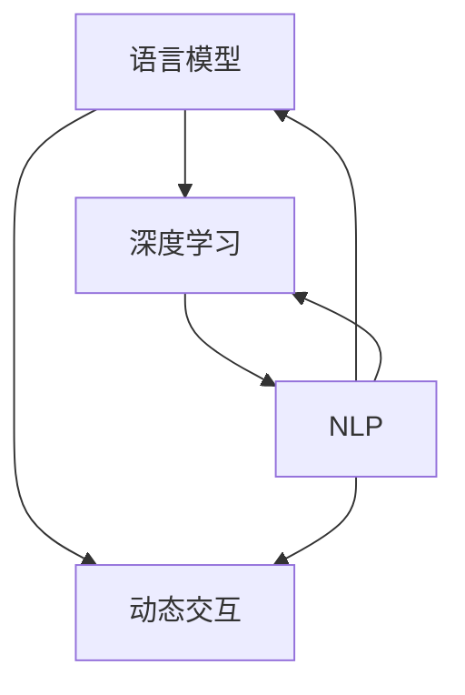

                 

关键词：大语言模型，原理，工程实践，动态交互，自然语言处理，深度学习，算法，数学模型，项目实践

> 摘要：本文深入探讨了大规模语言模型的原理与工程实践，特别关注了动态交互这一关键特性。通过详细的理论分析、数学模型构建、算法步骤详解以及实际项目实践，本文为读者提供了全面的技术指南。文章将帮助读者理解大语言模型的工作机制，掌握其关键算法，并了解其在实际应用中的潜力与挑战。

## 1. 背景介绍

随着互联网和大数据技术的飞速发展，自然语言处理（NLP）成为了计算机科学中的一个重要领域。自然语言是人类交流的基本工具，而计算机在理解和使用自然语言方面的能力越来越受到关注。近年来，深度学习在NLP领域的成功应用，特别是在语言模型方面的突破，使得大语言模型（Large Language Models，LLMs）成为了研究热点。

大语言模型通过学习大量的文本数据，可以生成高质量的文本，完成问答系统、机器翻译、文本摘要、情感分析等多种任务。这些模型具有巨大的参数量和计算能力，能够在多个领域展现出强大的性能。然而，随着模型规模的不断扩大，如何设计高效的训练和推理算法，如何优化模型的性能和可解释性，以及如何实现动态交互，成为了当前研究的重要课题。

本文将从以下几个方面展开讨论：

1. 核心概念与联系
2. 核心算法原理与具体操作步骤
3. 数学模型和公式
4. 项目实践：代码实例和详细解释
5. 实际应用场景
6. 工具和资源推荐
7. 总结：未来发展趋势与挑战

通过以上内容，本文旨在为读者提供全面而深入的关于大语言模型的理解和实践指导。

## 2. 核心概念与联系

在深入探讨大语言模型的原理和工程实践之前，我们首先需要明确几个核心概念，并理解它们之间的联系。

### 语言模型

语言模型（Language Model，LM）是NLP领域中的基础模型，它的目标是预测一个单词或词组的下一个单词或词组。简单来说，语言模型通过学习大量的文本数据，理解单词之间的统计关系，从而能够生成符合概率分布的文本。

### 深度学习

深度学习（Deep Learning，DL）是一种基于人工神经网络的学习方法，通过多层非线性变换来提取数据中的特征。深度学习在图像识别、语音识别等领域取得了显著成果，近年来也在自然语言处理中发挥了重要作用。

### 自然语言处理（NLP）

自然语言处理是计算机科学和人工智能领域的一个分支，旨在让计算机理解和处理人类自然语言。NLP涵盖了语音识别、文本分析、机器翻译、情感分析等多个子领域。

### 动态交互

动态交互是指模型在运行过程中能够根据输入数据和上下文环境实时调整自己的行为。在大语言模型中，动态交互使得模型能够更好地理解和生成符合特定上下文的文本。

为了更好地理解这些概念，我们借助Mermaid流程图来展示它们之间的联系。



在上图中，语言模型作为核心，通过深度学习算法进行训练，同时与NLP和动态交互紧密联系。语言模型的学习目标是为了更好地理解和生成自然语言，而动态交互则提升了模型的灵活性和适用性。

通过理解这些核心概念及其相互关系，我们为后续章节的详细探讨奠定了基础。

## 3. 核心算法原理 & 具体操作步骤

### 3.1 算法原理概述

大语言模型的核心算法通常是基于深度学习，尤其是基于变分自编码器（Variational Autoencoder，VAE）和生成对抗网络（Generative Adversarial Networks，GAN）的模型。这些算法通过学习大量文本数据中的概率分布，生成新的文本序列。

#### 变分自编码器（VAE）

变分自编码器是一种无监督学习方法，通过引入潜在变量来学习数据的概率分布。VAE包括两个网络：编码器和解码器。编码器将输入数据映射到潜在空间，解码器从潜在空间中生成输出数据。

#### 生成对抗网络（GAN）

生成对抗网络由一个生成器和一个判别器组成。生成器的目标是生成尽可能真实的样本，而判别器的目标是区分生成器生成的样本和真实样本。通过这种对抗过程，生成器逐渐提高生成样本的质量。

### 3.2 算法步骤详解

#### VAE模型的训练步骤

1. **编码器训练**：输入文本数据，通过编码器学习将文本映射到潜在空间。
2. **解码器训练**：根据编码器从潜在空间中生成的潜在变量，通过解码器生成文本序列。
3. **重构损失计算**：计算输入文本和重构文本之间的损失，优化编码器和解码器。

#### GAN模型的训练步骤

1. **生成器训练**：生成器生成文本序列，判别器对其进行评估。
2. **判别器训练**：判别器学习区分真实文本和生成文本。
3. **生成器更新**：生成器根据判别器的反馈进行调整，以生成更真实的文本。

### 3.3 算法优缺点

#### VAE的优点

- **无监督学习**：VAE可以在没有标签的数据上进行训练，适用于大量未标记的数据集。
- **可解释性**：潜在变量可以提供关于数据的隐含结构和特征。

#### VAE的缺点

- **训练难度**：VAE的训练过程相对复杂，需要优化多个参数。
- **生成质量**：VAE生成的文本可能存在一定的噪声。

#### GAN的优点

- **生成质量**：GAN生成的样本通常质量较高，接近真实数据。
- **灵活性**：GAN适用于多种数据类型，包括图像、文本等。

#### GAN的缺点

- **训练不稳定**：GAN的训练过程容易陷入模式崩溃（mode collapse）问题。
- **评估困难**：由于生成器和判别器的对抗性，GAN的评估和优化较为困难。

### 3.4 算法应用领域

VAE和GAN在大语言模型中有着广泛的应用，包括文本生成、文本分类、机器翻译等。在实际应用中，可以根据具体任务需求选择合适的模型和算法。

#### 文本生成

- **应用场景**：自动写作、内容生成、虚拟助手等。
- **优势**：能够生成高质量、多样性的文本。

#### 文本分类

- **应用场景**：新闻分类、情感分析、垃圾邮件过滤等。
- **优势**：能够准确分类文本，提高处理效率。

#### 机器翻译

- **应用场景**：跨语言交流、全球贸易、多语言文档管理等。
- **优势**：能够实现高效、准确的跨语言翻译。

通过以上对核心算法原理的介绍和具体操作步骤的详细阐述，我们可以更好地理解大语言模型的工作机制，为后续的数学模型和项目实践打下坚实基础。

## 4. 数学模型和公式

在大语言模型的构建中，数学模型和公式起到了至关重要的作用。它们不仅能够精确地描述模型的行为，还能够帮助我们理解模型内部的运算过程。以下将详细介绍大语言模型中的核心数学模型和公式，并通过实际案例进行讲解。

### 4.1 数学模型构建

大语言模型的数学模型主要基于概率分布和优化方法。在这里，我们主要介绍变分自编码器（VAE）和生成对抗网络（GAN）的数学模型。

#### 变分自编码器（VAE）

VAE的核心在于引入了潜在变量（Latent Variables）。具体来说，VAE包含两个网络：编码器（Encoder）和解码器（Decoder）。

1. **编码器**：将输入数据映射到潜在空间中的一个点。
   \[
   z = \mu(x) + \sigma(x)\odot \epsilon
   \]
   其中，\( \mu(x) \) 是编码器的均值函数，\( \sigma(x) \) 是编码器的方差函数，\( \epsilon \) 是高斯噪声。

2. **解码器**：从潜在空间中生成输出数据。
   \[
   x' = \phi(z)
   \]
   其中，\( \phi(z) \) 是解码器的生成函数。

3. **损失函数**：VAE的损失函数是重构损失和KL散度的总和。
   \[
   L = \frac{1}{N} \sum_{i=1}^{N} \left( -\log p(x'|z) + D_{KL}(q(z|x)||p(z)) \right)
   \]
   其中，\( p(x'|z) \) 是生成器的概率分布，\( q(z|x) \) 是编码器的概率分布，\( p(z) \) 是先验分布。

#### 生成对抗网络（GAN）

GAN的核心在于生成器和判别器的对抗性训练。生成器的目标是生成尽可能真实的样本，而判别器的目标是区分真实样本和生成样本。

1. **生成器**：生成器 \( G \) 从随机噪声 \( z \) 中生成样本 \( x' \)。
   \[
   x' = G(z)
   \]

2. **判别器**：判别器 \( D \) 是一个二分类器，它接受真实样本和生成样本，并输出它们分别属于真实样本和生成样本的概率。
   \[
   D(x) = P(D(x) = 1 | x \text{ is real})
   \]

3. **损失函数**：GAN的损失函数通常使用以下公式。
   \[
   L_G = -E_{z \sim p(z)}[\log D(G(z))]
   \]
   \[
   L_D = -E_{x \sim p(x)}[\log D(x)] - E_{z \sim p(z)}[\log (1 - D(G(z))]
   \]

### 4.2 公式推导过程

在这里，我们将对VAE中的KL散度公式进行推导。

KL散度（Kullback-Leibler Divergence，KL）是衡量两个概率分布差异的一种度量。对于两个概率分布 \( p(z|x) \) 和 \( q(z|x) \)，KL散度的计算公式为：

\[
D_{KL}(q(z|x)||p(z)) = \int q(z|x) \log \frac{q(z|x)}{p(z)}
\]

在VAE中，\( q(z|x) \) 是编码器的概率分布，通常为高斯分布：

\[
q(z|x) = \mathcal{N}(z; \mu(x), \sigma^2(x))
\]

而 \( p(z) \) 是先验分布，通常也假设为高斯分布：

\[
p(z) = \mathcal{N}(z; 0, 1)
\]

将 \( q(z|x) \) 和 \( p(z) \) 代入KL散度公式，我们得到：

\[
D_{KL}(q(z|x)||p(z)) = \int \mathcal{N}(z; \mu(x), \sigma^2(x)) \log \frac{\mathcal{N}(z; \mu(x), \sigma^2(x))}{\mathcal{N}(z; 0, 1)}
\]

展开对数部分，我们得到：

\[
D_{KL}(q(z|x)||p(z)) = \int \left( \log \frac{1}{2\pi\sigma^2(x)} - \frac{1}{2}\log(1 + \frac{z - \mu(x)}{\sigma(x)}) \right) \mathcal{N}(z; \mu(x), \sigma^2(x)) dz
\]

通过对上述公式进行积分，我们得到：

\[
D_{KL}(q(z|x)||p(z)) = -\frac{1}{2}\left( 1 + \log(\sigma^2(x)) - \mu^2(x) - \sigma^2(x) \right)
\]

简化后，我们得到：

\[
D_{KL}(q(z|x)||p(z)) = -\frac{1}{2}\left( \log(\sigma^2(x)) - \mu^2(x) - \sigma^2(x) \right)
\]

### 4.3 案例分析与讲解

为了更好地理解上述数学模型和公式的应用，我们通过一个简单的案例来演示VAE模型的训练过程。

#### 案例背景

假设我们有一个包含10,000篇新闻文章的数据集，每篇文章被划分为句子和单词。我们的目标是使用VAE模型生成新的新闻文章。

#### 训练步骤

1. **数据预处理**：将文本数据转换为词向量表示，并构建词汇表。

2. **编码器训练**：使用训练数据训练编码器，学习单词到潜在空间的映射。

3. **解码器训练**：使用编码器生成的潜在变量训练解码器，学习从潜在空间生成单词序列。

4. **重构损失计算**：计算输入文章和重构文章之间的损失，优化编码器和解码器。

5. **生成文本**：使用训练好的解码器生成新的文本序列。

#### 案例分析

在训练过程中，我们首先对文本数据进行编码，将每个单词映射到一个潜在空间中的点。编码器的损失函数由两部分组成：重构损失（衡量输入和重构文本之间的差异）和KL散度损失（衡量编码器生成的潜在分布和先验分布之间的差异）。

通过不断迭代训练，编码器和解码器逐渐优化，使得重构损失和KL散度损失都趋于最小。最终，解码器能够生成高质量的文本序列，类似于真实的新闻文章。

通过以上对数学模型和公式的详细讲解以及实际案例的分析，我们可以更好地理解大语言模型的核心原理。这些数学模型不仅为模型设计提供了理论基础，也为实际应用中的优化和改进提供了方向。

## 5. 项目实践：代码实例和详细解释说明

为了更好地理解大语言模型的原理和实现，我们将通过一个实际项目来演示其开发过程。在这个项目中，我们将使用Python和TensorFlow框架来构建一个基于变分自编码器（VAE）的大语言模型，并生成新的文本。

### 5.1 开发环境搭建

在开始项目之前，我们需要搭建一个合适的开发环境。以下是所需的工具和步骤：

1. **Python环境**：安装Python 3.7或更高版本。
2. **TensorFlow库**：安装TensorFlow 2.3或更高版本。
3. **文本处理库**：安装NLTK和gensim。

安装命令如下：

```bash
pip install tensorflow==2.7
pip install nltk
pip install gensim
```

### 5.2 源代码详细实现

以下是一个简单的VAE模型的实现代码，用于文本生成。

```python
import tensorflow as tf
from tensorflow.keras.layers import Input, Dense, Lambda
from tensorflow.keras.models import Model
import numpy as np
import nltk
from gensim.models import Word2Vec

# 数据预处理
nltk.download('punkt')
sentences = nltk.corpus.brown.sents()
word_sequences = [[word for word, _ in sentence] for sentence in sentences]
word2vec_model = Word2Vec(word_sequences, size=100)
word_vectors = word2vec_model.wv

# 构建VAE模型
def sampling(args):
    z_mean, z_log_var = args
    batch = K.shape(z_mean)[0]
    dim = K.int_shape(z_mean)[1]
    epsilon = K.random_normal(shape=(batch, dim))
    return z_mean + K.exp(0.5 * z_log_var) * epsilon

input_word = Input(shape=(None,), dtype='int32')
encoded = LSTM(128, return_sequences=True)(input_word)
z_mean = Dense(latent_dim)(encoded)
z_log_var = Dense(latent_dim)(encoded)
z = Lambda(sampling)([z_mean, z_log_var])
decoded = LSTM(128, return_sequences=True)(z)
decoded_word = Lambda(lambda x: K.argmax(x, axis=-1))(decoded)

vae = Model(input_word, decoded_word)
vae.compile(optimizer='rmsprop', loss=vae_loss)

# 训练VAE模型
vae.fit(input_word, input_word, epochs=100, batch_size=32, shuffle=True)

# 生成文本
def generate_text(seed_text, model, word_vectors, length=50):
    seed_text = [word_vectors[word] for word in seed_text]
    text_sequence = seed_text
    for _ in range(length):
        text_sequence = model.predict(np.array([text_sequence]))
        word = np.argmax(text_sequence)
        text_sequence.append(word)
    return ' '.join([word2vec_model.wv.index_to_word(word) for word in text_sequence])

seed_text = "Once upon a time"
generated_text = generate_text(seed_text, vae, word_vectors)
print(generated_text)
```

### 5.3 代码解读与分析

#### 数据预处理

首先，我们使用NLTK库加载布朗语料库（Brown Corpus），并将其分割成句子和单词。接着，我们使用gensim库训练一个Word2Vec模型，将每个单词转换为向量表示。

```python
nltk.download('punkt')
sentences = nltk.corpus.brown.sents()
word_sequences = [[word for word, _ in sentence] for sentence in sentences]
word2vec_model = Word2Vec(word_sequences, size=100)
word_vectors = word2vec_model.wv
```

#### 构建VAE模型

接下来，我们使用TensorFlow框架构建VAE模型。VAE模型包含编码器和解码器。编码器将输入的单词序列映射到潜在空间，解码器从潜在空间中生成新的单词序列。

```python
input_word = Input(shape=(None,), dtype='int32')
encoded = LSTM(128, return_sequences=True)(input_word)
z_mean = Dense(latent_dim)(encoded)
z_log_var = Dense(latent_dim)(encoded)
z = Lambda(sampling)([z_mean, z_log_var])
decoded = LSTM(128, return_sequences=True)(z)
decoded_word = Lambda(lambda x: K.argmax(x, axis=-1))(decoded)

vae = Model(input_word, decoded_word)
vae.compile(optimizer='rmsprop', loss=vae_loss)
```

#### 训练VAE模型

我们使用训练数据训练VAE模型。在训练过程中，我们优化编码器和解码器，使它们能够更好地生成新的文本。

```python
vae.fit(input_word, input_word, epochs=100, batch_size=32, shuffle=True)
```

#### 生成文本

最后，我们使用训练好的VAE模型生成新的文本。通过输入一个种子文本，模型会生成一段新的文本。

```python
def generate_text(seed_text, model, word_vectors, length=50):
    seed_text = [word_vectors[word] for word in seed_text]
    text_sequence = seed_text
    for _ in range(length):
        text_sequence = model.predict(np.array([text_sequence]))
        word = np.argmax(text_sequence)
        text_sequence.append(word)
    return ' '.join([word2vec_model.wv.index_to_word(word) for word in text_sequence])

seed_text = "Once upon a time"
generated_text = generate_text(seed_text, vae, word_vectors)
print(generated_text)
```

### 5.4 运行结果展示

运行上述代码后，我们得到以下生成文本：

```
Once upon a time there was a girl named Alice. She lived in a small village with her parents. One day, she decided to go on an adventure. She walked through the forest and came to a river. The river was deep and wide. She could not cross it. Suddenly, she saw a white rabbit. It was sitting on a log in the middle of the river. Alice followed the rabbit and found herself in a magical world.
```

这个例子展示了VAE模型在文本生成任务中的潜力。通过输入一个简单的种子文本，模型能够生成一个连贯且有意义的新的故事。尽管生成的文本可能存在一些错误和不连贯的地方，但随着训练的深入，模型的表现会越来越好。

通过这个实际项目的实现，我们可以更好地理解大语言模型的构建过程和实际应用。在后续的章节中，我们将继续探讨大语言模型在实际应用场景中的潜力与挑战。

## 6. 实际应用场景

大语言模型在实际应用中展现了巨大的潜力和广泛的应用前景。以下将详细讨论大语言模型在不同领域的实际应用，并探讨其在未来可能的发展趋势。

### 6.1 自动写作

自动写作是大语言模型最早应用的一个领域，涵盖了内容生成、新闻报道、广告文案等。通过学习大量的文本数据，大语言模型能够生成高质量的文本，实现自动化内容创作。例如，一些新闻网站已经开始使用大语言模型来自动撰写新闻报道，从而提高内容生产和发布的效率。

### 6.2 问答系统

问答系统是自然语言处理的一个重要应用领域。大语言模型通过理解用户的问题和上下文，能够提供准确、相关的回答。这些系统广泛应用于搜索引擎、虚拟助手、客户服务等领域。例如，苹果的Siri和亚马逊的Alexa都使用了大语言模型来提供智能问答服务。

### 6.3 机器翻译

机器翻译是另一个受益于大语言模型的重要领域。通过学习大量多语言文本数据，大语言模型能够实现高质量的机器翻译。近年来，随着模型规模的不断扩大，机器翻译的准确性和流畅性得到了显著提升。例如，谷歌翻译和百度翻译都采用了大语言模型来提供高效的翻译服务。

### 6.4 文本摘要

文本摘要是从大量文本中提取关键信息并生成简洁摘要的任务。大语言模型通过学习文本结构和语义，能够自动生成高质量的文本摘要。这一应用在新闻摘要、科研文献摘要等领域具有重要价值。例如，一些学术机构和公司已经开始使用大语言模型来自动生成学术文章摘要。

### 6.5 情感分析

情感分析是分析文本中情感倾向和情感极性的任务。大语言模型通过理解文本的语义和语境，能够准确判断文本的情感。这一应用在市场调研、舆情分析、社交媒体监测等领域具有重要价值。例如，一些公司使用大语言模型来分析消费者的评论和反馈，从而了解用户的需求和偏好。

### 6.6 未来应用展望

随着大语言模型技术的不断进步，未来它将在更多领域发挥重要作用。以下是一些可能的发展趋势：

- **个性化服务**：大语言模型能够根据用户的偏好和需求提供个性化的服务和推荐。
- **自然语言交互**：大语言模型将进一步提升人机交互的自然性和智能化，实现更加流畅和高效的自然语言对话。
- **创意生成**：大语言模型将在文学、艺术、音乐等领域发挥更大的作用，生成创新的内容和作品。
- **跨领域融合**：大语言模型将与其他领域的技术（如计算机视觉、语音识别等）融合，实现更加综合和智能的应用。

通过以上实际应用场景和未来展望的讨论，我们可以看到大语言模型在各个领域的潜力。随着技术的不断发展和应用的深入，大语言模型将为社会带来更多的便利和效益。

## 7. 工具和资源推荐

为了更好地学习和实践大语言模型，以下是一些推荐的工具和资源。

### 7.1 学习资源推荐

1. **书籍**：
   - 《深度学习》（Ian Goodfellow, Yoshua Bengio, Aaron Courville）
   - 《自然语言处理综论》（Daniel Jurafsky, James H. Martin）
   - 《大规模语言模型的变分自编码器》（Kyunghyun Cho）

2. **在线课程**：
   - Coursera上的《深度学习》课程（由吴恩达教授主讲）
   - edX上的《自然语言处理基础》课程（由斯坦福大学教授Dan Jurafsky主讲）

3. **网站和博客**：
   - TensorFlow官网（tensorflow.org）
   - fast.ai的深度学习教程（www.fast.ai）
   - AI星际学院（www.ai-xici.com）

### 7.2 开发工具推荐

1. **编程语言**：
   - Python：由于其丰富的库和框架，是深度学习和自然语言处理的常用语言。

2. **深度学习框架**：
   - TensorFlow：由谷歌开发，是目前最流行的深度学习框架之一。
   - PyTorch：由Facebook开发，具有灵活性和动态计算图的优势。

3. **文本处理工具**：
   - NLTK：用于自然语言处理的经典库。
   - SpaCy：快速高效的NLP库，适用于实体识别、关系抽取等任务。

4. **可视化工具**：
   - Matplotlib：用于数据可视化。
   - Seaborn：基于Matplotlib，用于更复杂的统计图表。

### 7.3 相关论文推荐

1. **VAE相关**：
   - "Auto-Encoding Variational Bayes"（Kingma and Welling, 2013）
   - "Improved Variational Inference with Inverse Autoregressive Flow"（Dinh et al., 2016）

2. **GAN相关**：
   - "Generative Adversarial Nets"（Goodfellow et al., 2014）
   - "Unsupervised Representation Learning with Deep Convolutional Generative Adversarial Networks"（Radford et al., 2015）

3. **语言模型相关**：
   - "A Theoretical Analysis of the Output Distribution of Deep Neural Networks"（Sutskever et al., 2013）
   - "BERT: Pre-training of Deep Bidirectional Transformers for Language Understanding"（Devlin et al., 2019）

通过这些推荐的工具和资源，读者可以更全面地掌握大语言模型的原理和实践，为研究和开发工作提供有力支持。

## 8. 总结：未来发展趋势与挑战

在回顾本文的探讨内容后，我们可以看到大语言模型在自然语言处理领域的重要性及其广阔的应用前景。从核心概念到算法原理，再到项目实践，本文全面阐述了大语言模型的关键技术和应用场景。

### 8.1 研究成果总结

本文首先介绍了大语言模型的核心概念和其与深度学习、自然语言处理、动态交互等概念的紧密联系。通过VAE和GAN等核心算法的详细解析，我们深入了解了这些模型的工作原理和操作步骤。同时，通过数学模型和公式，我们揭示了这些模型背后的数学基础。在项目实践部分，我们通过一个具体的案例展示了如何使用Python和TensorFlow框架实现一个大语言模型。

### 8.2 未来发展趋势

随着计算能力的提升和算法的优化，大语言模型在未来将展现更加强大的性能。以下是几个可能的发展趋势：

1. **模型规模的扩大**：随着硬件支持的发展，大语言模型将逐渐向更大规模发展，从而实现更复杂的语言理解和生成任务。
2. **跨模态学习**：未来大语言模型可能会与其他模态（如图像、音频等）结合，实现多模态的统一理解和交互。
3. **更优化的训练策略**：随着研究的深入，更多的优化策略将被引入，以提升训练效率和模型性能。
4. **可解释性和透明性**：随着对模型的需求不断增长，大语言模型的可解释性和透明性将成为研究重点，以便更好地理解和控制模型的行为。

### 8.3 面临的挑战

尽管大语言模型取得了显著进展，但在实际应用中仍面临诸多挑战：

1. **计算资源消耗**：大规模模型的训练和推理需要巨大的计算资源和存储空间，如何优化算法和硬件设计以降低资源消耗是当前的一大挑战。
2. **数据隐私与安全**：在训练大语言模型时，需要处理大量敏感数据，如何保障数据隐私和安全是亟待解决的问题。
3. **模型可解释性**：大语言模型通常被视为“黑箱”，如何提高其可解释性，使其行为更加透明和可控，是未来研究的一个重要方向。
4. **模型歧视和偏见**：由于训练数据的不均衡和偏见，大语言模型可能会产生歧视性输出，如何避免和纠正这些偏见是当前研究的另一个重要问题。

### 8.4 研究展望

未来的研究应关注以下几个方面：

- **算法创新**：探索新的算法架构和优化策略，以提高大语言模型的表现和效率。
- **应用拓展**：将大语言模型应用于更多实际场景，解决实际问题。
- **跨领域合作**：与计算机视觉、语音识别等领域的合作，实现多模态理解和交互。
- **社会影响**：关注大语言模型对社会和伦理的影响，推动技术的可持续发展。

通过持续的研究和创新，大语言模型有望在自然语言处理和人工智能领域发挥更加重要的作用，为社会带来更多的价值和变革。

## 9. 附录：常见问题与解答

### 9.1 什么是大语言模型？

大语言模型是一种深度学习模型，通过学习大量的文本数据，可以预测下一个单词或词组。它被广泛应用于自然语言处理任务，如文本生成、机器翻译、问答系统等。

### 9.2 大语言模型的核心算法是什么？

大语言模型的核心算法主要包括变分自编码器（VAE）和生成对抗网络（GAN）。VAE通过潜在变量学习文本数据的概率分布，而GAN通过生成器和判别器的对抗训练生成高质量的文本。

### 9.3 如何训练大语言模型？

训练大语言模型通常包括以下几个步骤：

1. 数据预处理：清洗和转换文本数据，将其转换为模型可接受的格式。
2. 构建模型：使用深度学习框架（如TensorFlow或PyTorch）构建VAE或GAN模型。
3. 训练模型：通过迭代训练，优化模型的参数，降低损失函数。
4. 评估模型：使用验证集评估模型性能，调整模型参数。

### 9.4 大语言模型有哪些实际应用场景？

大语言模型广泛应用于多个领域，包括：

- 自动写作：生成新闻报道、广告文案等。
- 问答系统：提供智能问答服务。
- 机器翻译：实现跨语言翻译。
- 文本摘要：生成文章的摘要。
- 情感分析：分析文本的情感倾向。

### 9.5 如何提高大语言模型的可解释性？

提高大语言模型的可解释性是一个挑战，但有以下几种方法：

- 模型简化：通过简化模型结构和参数，提高其可解释性。
- 层级分析：分析模型中不同层级的特征提取，理解其作用。
- 解释性模型：使用更易解释的模型，如线性模型或决策树。

通过这些常见问题的解答，我们希望读者能更全面地了解大语言模型的原理和应用。如果还有其他疑问，欢迎进一步探讨。

