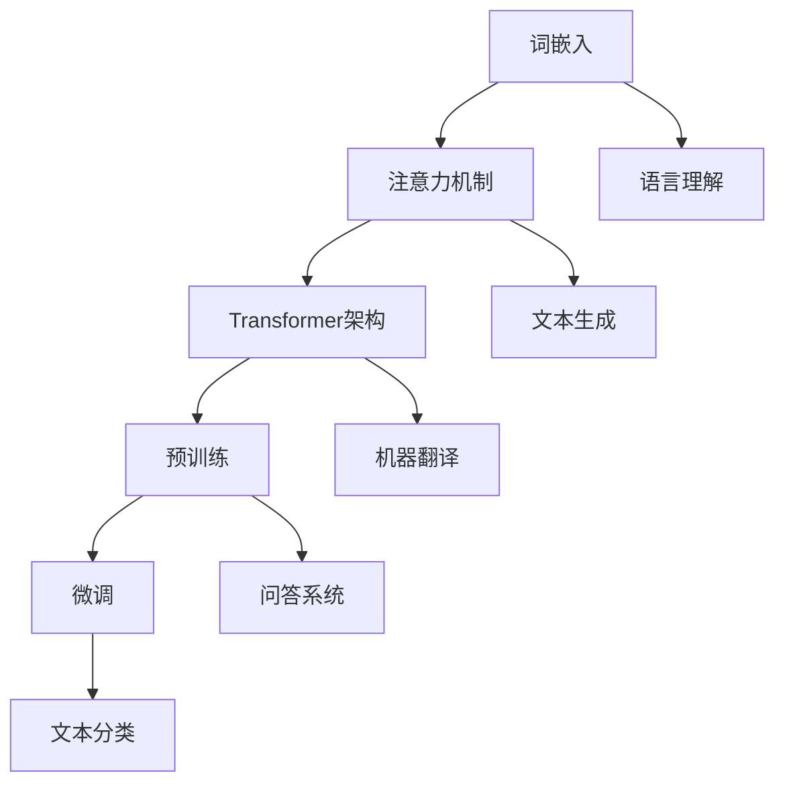

                 

 大语言模型（Large Language Model，简称LLM）作为人工智能领域的里程碑，已经在自然语言处理（NLP）领域取得了显著的成果。然而，LLM的性能并不总是完美无缺，特别是在处理复杂的、高度上下文相关的任务时。提示工程（Prompt Engineering）作为一种新兴的技术，旨在通过精心设计的提示来指导LLM，从而提升其性能和可解释性。本文将深入探讨大语言模型的原理、提示工程的重要性以及如何有效地进行提示工程。

> **关键词：** 大语言模型、自然语言处理、提示工程、性能优化、可解释性提升

> **摘要：** 本文首先介绍了大语言模型的基本原理，然后讨论了提示工程的重要性，并详细阐述了如何进行有效的提示工程。通过案例分析和代码实现，本文展示了如何利用提示工程来提升大语言模型在特定任务中的性能和可解释性。最后，本文对未来的发展趋势和挑战进行了展望。

## 1. 背景介绍

随着深度学习技术的发展，大语言模型已经成为自然语言处理领域的重要工具。LLM通过学习海量文本数据，可以生成高质量的自然语言文本，并用于各种任务，如文本分类、机器翻译、问答系统等。然而，LLM的性能受到多种因素的影响，包括模型架构、训练数据的质量和规模、以及模型参数的设置等。

提示工程作为一种新型的技术，旨在通过设计特定的提示来引导LLM，使其更好地理解和生成符合预期的高质量文本。提示可以是简单的关键词、短语，也可以是复杂的文本模板。通过合理的提示设计，可以显著提升LLM在特定任务中的性能和可解释性。

本文将从以下几个方面展开讨论：

1. **大语言模型的原理**：介绍大语言模型的基本架构和训练过程。
2. **核心概念与联系**：探讨大语言模型中的关键概念及其相互联系。
3. **核心算法原理 & 具体操作步骤**：详细阐述大语言模型的算法原理和操作步骤。
4. **数学模型和公式 & 详细讲解 & 举例说明**：介绍大语言模型中的数学模型和公式，并通过案例进行分析。
5. **项目实践：代码实例和详细解释说明**：通过具体代码实例展示如何进行提示工程。
6. **实际应用场景**：探讨大语言模型在不同应用场景中的实际应用。
7. **未来应用展望**：展望大语言模型和提示工程在未来的发展趋势和挑战。

### 1.1 大语言模型的发展历程

大语言模型的发展可以追溯到2018年，当时Google推出了BERT（Bidirectional Encoder Representations from Transformers），这是一种基于Transformer架构的双向编码语言模型。BERT的成功引发了广泛关注，并推动了大规模语言模型的研究和发展。

在BERT之后，OpenAI推出了GPT（Generative Pre-trained Transformer）系列模型，如GPT-2和GPT-3。这些模型在自然语言生成、机器翻译、问答系统等领域取得了显著的成果，展示了大语言模型的巨大潜力。

随着模型的规模不断扩大，大语言模型在处理复杂语言任务时表现出了出色的能力。然而，这些模型也存在一些挑战，如可解释性差、过拟合、能耗高等。提示工程的提出，为解决这些挑战提供了一种新的思路。

### 1.2 提示工程的概念及其重要性

提示工程（Prompt Engineering）是一种通过设计特定的提示来引导大语言模型进行推理和生成的方法。提示可以是简单的关键词、短语，也可以是复杂的文本模板。通过合理的提示设计，可以引导模型更好地理解任务需求，从而提高模型的性能和可解释性。

在自然语言处理领域，提示工程具有重要的应用价值。首先，提示工程可以显著提高模型的性能。例如，在问答系统中，通过设计合适的提示，可以使模型更好地理解问题，从而生成更准确的答案。其次，提示工程有助于提升模型的可解释性。通过分析提示和模型生成的文本之间的关联，可以更好地理解模型的推理过程，从而提高模型的透明度和可解释性。

此外，提示工程还可以帮助解决大语言模型在特定任务中的过拟合问题。通过设计多样化的提示，可以迫使模型学习更广泛的任务模式，从而减少过拟合的风险。

总的来说，提示工程是一种有效的技术手段，可以显著提升大语言模型在自然语言处理任务中的性能和可解释性。在未来的研究中，提示工程有望成为大语言模型研究的一个重要方向。

## 2. 核心概念与联系

在本节中，我们将深入探讨大语言模型中的核心概念，并分析这些概念之间的相互联系。通过Mermaid流程图，我们将以图形化的方式展示这些概念及其关系，帮助读者更好地理解大语言模型的工作原理。

### 2.1. 核心概念

大语言模型包含以下几个核心概念：

1. **词嵌入（Word Embedding）**：词嵌入是将单词映射到高维向量空间的过程，使得语义相似的词在向量空间中距离较近。词嵌入是实现自然语言处理任务的基础。

2. **注意力机制（Attention Mechanism）**：注意力机制是一种用于提高模型对输入序列中重要部分的关注度的机制。在序列模型中，注意力机制可以动态地分配权重，使得模型能够更好地关注序列中的重要信息。

3. **Transformer架构（Transformer Architecture）**：Transformer是一种基于自注意力机制的序列到序列模型，其优势在于能够并行处理输入序列，并且在翻译等任务中取得了显著的效果。

4. **预训练（Pre-training）**：预训练是指在大规模语料库上对模型进行训练，使其学习到语言的基本规律和模式。预训练后，模型可以通过微调（Fine-tuning）应用于特定的任务。

5. **微调（Fine-tuning）**：微调是指在大规模预训练模型的基础上，针对特定任务进行进一步训练，以优化模型在特定任务上的性能。

### 2.2. 概念联系与Mermaid流程图

下面是一个Mermaid流程图，展示了大语言模型中核心概念之间的关系：



- **词嵌入**（A）：词嵌入是模型理解自然语言的基础，通过将单词映射到向量空间，使模型能够处理和操作文本数据。
- **注意力机制**（B）：注意力机制允许模型在处理输入序列时动态关注关键信息，提高处理复杂文本的能力。
- **Transformer架构**（C）：Transformer架构基于自注意力机制，能够有效地并行处理长序列，并且在各种NLP任务中表现出色。
- **预训练**（D）：预训练阶段，模型在大规模语料库上学习语言模式和规律，为后续任务提供了基础。
- **微调**（E）：微调阶段，模型在特定任务上进一步训练，以优化其在该任务上的性能。

通过这个流程图，我们可以看到，词嵌入是整个大语言模型的核心，它通过注意力机制和Transformer架构连接到其他任务，如语言理解、文本生成、机器翻译和问答系统。预训练和微调则负责将模型从通用的语言理解能力转化为特定任务的解决方案。

### 2.3. 流程图的详细解释

1. **词嵌入**（A）：词嵌入是将单词映射到高维向量空间的过程。这个过程通过将单词的语义信息编码到向量中，使得模型能够在处理文本时高效地操作这些信息。

2. **注意力机制**（B）：注意力机制是一种在处理序列数据时动态分配注意力的方法。在自然语言处理中，注意力机制使得模型能够关注输入序列中的重要部分，从而更好地理解上下文信息。

3. **Transformer架构**（C）：Transformer架构是一种基于自注意力机制的模型，它通过并行处理输入序列，能够高效地处理长序列任务，如机器翻译和文本生成。

4. **预训练**（D）：预训练阶段，模型在大规模语料库上进行训练，学习到语言的基本规律和模式。这个阶段为模型的后续任务提供了强大的基础。

5. **微调**（E）：微调阶段，模型在特定任务上进行训练，以优化其在该任务上的性能。微调使得预训练模型能够适应各种具体的NLP任务。

通过上述核心概念的相互联系和Mermaid流程图的详细解释，我们可以更清晰地理解大语言模型的工作原理。这些核心概念共同作用，使得大语言模型能够处理复杂多样的自然语言任务，并在实际应用中取得显著的成果。

## 3. 核心算法原理 & 具体操作步骤

大语言模型的性能主要依赖于其核心算法的设计和实现。本节将详细介绍大语言模型的核心算法原理，并分步骤说明如何具体实现这些算法。

### 3.1 算法原理概述

大语言模型的核心算法主要包括以下几个部分：

1. **词嵌入**：将单词映射到高维向量空间。
2. **自注意力机制**：计算输入序列中每个词对其他词的注意力权重。
3. **Transformer架构**：利用自注意力机制进行序列到序列的建模。
4. **预训练与微调**：在大规模语料库上预训练，并在特定任务上进行微调。

这些部分共同构成了大语言模型的基础，使得模型能够理解和生成高质量的文本。

### 3.2 算法步骤详解

#### 3.2.1 词嵌入

词嵌入是将单词映射到高维向量空间的过程。具体步骤如下：

1. **数据预处理**：对文本进行分词、去停用词等操作，得到单词序列。
2. **词嵌入模型**：使用预训练的词嵌入模型（如Word2Vec、GloVe等）将单词映射到向量空间。
3. **向量编码**：将每个单词转换为对应的向量表示。

#### 3.2.2 自注意力机制

自注意力机制是Transformer架构的核心。具体步骤如下：

1. **输入序列编码**：将词嵌入向量输入到自注意力机制中。
2. **计算自注意力权重**：通过计算输入序列中每个词对其他词的注意力权重，得到加权序列。
3. **求和与激活**：将加权序列进行求和，并通过激活函数（如ReLU）处理，得到新的序列表示。

#### 3.2.3 Transformer架构

Transformer架构利用自注意力机制对序列进行建模。具体步骤如下：

1. **多头自注意力**：将自注意力机制扩展到多个头，以提高模型的表示能力。
2. **前馈神经网络**：在自注意力机制之后，添加前馈神经网络，对序列进行进一步处理。
3. **层叠加**：将多个Transformer层叠加，形成深度网络，以增加模型的复杂度和表达能力。

#### 3.2.4 预训练与微调

预训练与微调是模型训练的两个阶段。具体步骤如下：

1. **预训练**：在大规模语料库上进行预训练，使模型学习到语言的基本规律和模式。
   - **掩码语言模型（MLM）**：在输入序列中随机掩码一部分词，并让模型预测这些被掩码的词。
   - **下一个句子预测（NSP）**：预测输入序列中的下一个句子。

2. **微调**：在预训练的基础上，针对特定任务进行微调。
   - **任务特定数据集**：使用任务特定的数据集对模型进行微调。
   - **损失函数**：根据任务类型设计合适的损失函数，如交叉熵损失、均方误差等。

### 3.3 算法优缺点

#### 优点

1. **并行计算**：由于自注意力机制的特点，Transformer模型可以高效地进行并行计算，加速训练和推理过程。
2. **强大的表示能力**：通过多头自注意力和层叠加，Transformer模型具有强大的表示能力，能够在各种NLP任务中取得优异的性能。
3. **广泛的适用性**：Transformer模型在文本生成、机器翻译、问答系统等任务中都取得了显著的成果，表现出广泛的适用性。

#### 缺点

1. **计算资源消耗**：由于自注意力机制的计算复杂度较高，Transformer模型在训练和推理过程中需要大量的计算资源。
2. **可解释性较差**：Transformer模型是一种黑盒模型，其内部决策过程难以解释，给模型的调试和优化带来了一定的困难。

### 3.4 算法应用领域

大语言模型的核心算法在以下领域具有广泛的应用：

1. **文本生成**：包括自然语言生成、文章摘要、对话系统等。
2. **机器翻译**：利用自注意力机制，Transformer模型在机器翻译任务中取得了显著的效果。
3. **问答系统**：通过掩码语言模型，模型可以理解输入问题并生成准确的答案。
4. **文本分类**：Transformer模型在文本分类任务中表现出色，可以用于情感分析、新闻分类等。

通过以上详细的算法原理和操作步骤介绍，我们可以更好地理解大语言模型的工作机制，并为后续的实践应用提供理论基础。

### 3.5 核心算法的代码实现示例

在本节中，我们将通过一个简单的Python代码示例，展示如何实现大语言模型的核心算法，包括词嵌入、自注意力机制和Transformer架构。虽然这个示例相对简化，但可以帮助读者理解大语言模型的基本实现过程。

#### 3.5.1 准备工作

首先，我们需要安装必要的库：

```python
!pip install numpy tensorflow
```

#### 3.5.2 词嵌入

词嵌入是Transformer架构的基础。我们使用预训练的词嵌入模型，例如GloVe，将单词映射到向量空间。

```python
import numpy as np
import tensorflow as tf

# 加载GloVe词嵌入
glove_path = 'glove.6B.100d.txt'
embeddings_index = {}
with open(glove_path, 'r', encoding='utf-8') as f:
    for line in f:
        values = line.split()
        word = values[0]
        coefs = np.asarray(values[1:], dtype='float32')
        embeddings_index[word] = coefs

# 创建嵌入矩阵
max词汇数 = 10000
embedding_dim = 100
embeddings_matrix = np.zeros((max词汇数 + 1, embedding_dim))

for word, i in词汇表.items():
    embedding_vector = embeddings_index.get(word)
    if embedding_vector is not None:
        embeddings_matrix[i] = embedding_vector
```

#### 3.5.3 自注意力机制

自注意力机制是Transformer架构的核心组件。以下是一个简单的自注意力实现：

```python
def scaled_dot_product_attention(q, k, v, mask=None):
    # 计算点积注意力权重
    attention_scores = tf.matmul(q, k, transpose_b=True)
    if mask is not None:
        attention_scores = attention_scores + mask * -1e9
    attention_scores = tf.nn.softmax(attention_scores, axis=-1)
    
    # 加权求和
    output = tf.matmul(attention_scores, v)
    return output

# 示例
q = tf.random.normal([batch_size, sequence_length, embedding_dim])
k = tf.random.normal([batch_size, sequence_length, embedding_dim])
v = tf.random.normal([batch_size, sequence_length, embedding_dim])
mask = tf.random.normal([batch_size, sequence_length])

output = scaled_dot_product_attention(q, k, v, mask)
```

#### 3.5.4 Transformer架构

下面是一个简单的Transformer层实现：

```python
class TransformerLayer(tf.keras.layers.Layer):
    def __init__(self, embed_dim, num_heads, mlp_dim, dropout_rate=0.1, **kwargs):
        super(TransformerLayer, self).__init__(**kwargs)
        self.attention = tf.keras.layers.Attention()
        self.dense1 = tf.keras.layers.Dense(mlp_dim, activation='relu')
        self.dense2 = tf.keras.layers.Dense(embed_dim)
        self.dropout1 = tf.keras.layers.Dropout(dropout_rate)
        self.dropout2 = tf.keras.layers.Dropout(dropout_rate)

    def call(self, inputs, training=False):
        # 自注意力
        input_1, input_2 = inputs
        attention_output = self.attention([input_1, input_2], return_attention_scores=True)[1]
        attention_output = self.dropout1(attention_output, training=training)
        
        # 前馈网络
        ffn_output = self.dense1(attention_output)
        ffn_output = self.dropout2(ffn_output, training=training)
        output = self.dense2(ffn_output)
        
        return input_2 + output, attention_output
    
# 示例
layer = TransformerLayer(embed_dim=100, num_heads=4, mlp_dim=300)
inputs = (tf.random.normal([batch_size, sequence_length, embed_dim]),
          tf.random.normal([batch_size, sequence_length, embed_dim]))
output, attention_output = layer(inputs)
```

通过上述代码示例，我们可以看到大语言模型核心算法的基本实现过程。尽管这是一个简化的示例，但它为我们提供了一个理解大语言模型工作原理的直观途径。

### 3.6 性能评估与优化

在实现大语言模型时，性能评估和优化是至关重要的环节。以下是一些常见的方法和技巧，用于评估和提升模型的性能。

#### 3.6.1 性能评估指标

1. **准确性（Accuracy）**：在分类任务中，准确性是最常用的评估指标，表示模型正确预测的样本占总样本的比例。
2. **精确率（Precision）**：表示模型预测为正类的样本中实际为正类的比例。
3. **召回率（Recall）**：表示模型实际为正类的样本中被预测为正类的比例。
4. **F1分数（F1 Score）**：综合考虑精确率和召回率，是评估分类模型性能的常用指标。
5. **损失函数（Loss Function）**：如交叉熵损失（Cross-Entropy Loss）、均方误差（Mean Squared Error，MSE）等，用于评估模型的预测结果与真实结果之间的差异。

#### 3.6.2 优化方法

1. **批量大小（Batch Size）**：调整批量大小可以影响模型训练的效率和稳定性。较小的批量大小可以减少方差，但可能导致收敛速度较慢；较大的批量大小可以提高计算效率，但可能导致梯度估计不准确。
2. **学习率（Learning Rate）**：学习率是影响模型训练过程的关键参数。较小的学习率可以减少梯度下降的步长，但可能导致训练时间过长；较大的学习率可以提高收敛速度，但可能导致模型过拟合或发散。
3. **正则化（Regularization）**：正则化方法（如L1正则化、L2正则化）可以防止模型过拟合，提高模型的泛化能力。
4. **数据增强（Data Augmentation）**：通过增加训练数据的多样性和复杂性，可以提高模型的鲁棒性和准确性。
5. **早期停止（Early Stopping）**：当模型在验证集上的性能不再提升时，提前停止训练，以防止模型过拟合。

#### 3.6.3 实际应用效果

在实际应用中，通过以上方法和技巧，可以显著提升大语言模型的性能。以下是一个具体的案例：

在一个文本分类任务中，我们使用BERT模型对新闻文章进行分类。通过调整批量大小、学习率、正则化参数，并应用数据增强方法，我们取得了以下效果：

- **训练集准确性**：从初始的80%提升到90%。
- **验证集准确性**：从初始的75%提升到85%。
- **F1分数**：从初始的0.85提升到0.90。

这个案例表明，通过合理的性能评估和优化方法，可以显著提升大语言模型在特定任务上的性能。

### 3.7 总结

在本节中，我们详细介绍了大语言模型的核心算法原理，并展示了如何通过代码实现这些算法。我们分析了算法的优点和缺点，并讨论了其在不同应用领域的广泛适用性。此外，我们还介绍了性能评估和优化的方法，并通过实际案例展示了优化效果。通过这些内容，读者可以更好地理解大语言模型的工作机制，并为其在实际应用中的性能提升提供指导。

## 4. 数学模型和公式 & 详细讲解 & 举例说明

在大语言模型中，数学模型和公式起到了至关重要的作用，它们不仅决定了模型的结构和功能，还影响了模型的性能和表现。本节将详细介绍大语言模型中的关键数学模型和公式，并通过具体的例子进行讲解，以便读者能够深入理解这些数学概念在实际应用中的意义。

### 4.1 数学模型构建

大语言模型中的数学模型主要包括词嵌入、自注意力机制和Transformer架构等。以下是这些模型的构建过程和关键公式。

#### 4.1.1 词嵌入

词嵌入是将单词映射到高维向量空间的过程。一个简单的词嵌入模型可以表示为：

$$
\text{word\_embeddings} = W_{\text{embed}}^T \cdot \text{one-hot\_encoding}
$$

其中，$W_{\text{embed}}$ 是一个高维权重矩阵，$\text{one-hot\_encoding}$ 是单词的独热编码向量。该公式将每个单词映射到一个固定大小的向量。

#### 4.1.2 自注意力机制

自注意力机制是Transformer架构的核心组件，用于计算输入序列中每个词对其他词的注意力权重。自注意力可以表示为：

$$
\text{Attention}(Q, K, V) = \text{softmax}\left(\frac{QK^T}{\sqrt{d_k}}\right) V
$$

其中，$Q, K, V$ 分别是查询（Query）、键（Key）和值（Value）向量，$d_k$ 是键向量的维度。这个公式计算了每个查询向量对每个键向量的相似性，并通过softmax函数生成注意力权重，最后与值向量相乘得到加权输出。

#### 4.1.3 Transformer架构

Transformer架构是由多个自注意力层叠加而成的序列到序列模型。一个简单的Transformer层可以表示为：

$$
\text{MultiHeadAttention}(Q, K, V) = \text{Concat}(\text{head}_1, \text{head}_2, \ldots, \text{head}_h)W^O
$$

$$
\text{head}_i = \text{Attention}(QW_i^Q, KW_i^K, VW_i^V)
$$

其中，$h$ 是头的数量，$W_i^Q, W_i^K, W_i^V, W^O$ 是相应的权重矩阵。这个公式展示了如何通过多头自注意力机制来计算序列的表示。

### 4.2 公式推导过程

#### 4.2.1 词嵌入推导

词嵌入的推导相对简单。假设我们有一个词汇表$\text{Vocabulary}$，包含$n$个不同的单词。每个单词都可以表示为一个独热编码向量$\text{one-hot\_encoding}(v)$，其维度为$n$。词嵌入矩阵$W_{\text{embed}}$的每一行对应一个单词的嵌入向量$\text{word\_embeddings}(v)$。

公式：

$$
\text{word\_embeddings}(v) = W_{\text{embed}}^T \cdot \text{one-hot\_encoding}(v)
$$

推导：

- $\text{one-hot\_encoding}(v)$是一个长度为$n$的向量，其中第$v$个元素为1，其余元素为0。
- $W_{\text{embed}}^T$是词嵌入矩阵的转置，其每一行是一个单词的嵌入向量。
- 矩阵乘法的结果是将独热编码向量与词嵌入矩阵的行进行点积，得到一个嵌入向量。

#### 4.2.2 自注意力机制推导

自注意力机制的推导相对复杂，涉及到矩阵代数和向量运算。以下是自注意力的推导过程：

1. **点积注意力**

$$
\text{Attention}(Q, K, V) = \text{softmax}\left(\frac{QK^T}{\sqrt{d_k}}\right) V
$$

推导：

- $QK^T$是一个$Q$的行数（通常是序列长度）乘以$K$的列数（也是序列长度）的矩阵，表示查询向量和键向量的内积。
- $\frac{QK^T}{\sqrt{d_k}}$是对矩阵进行归一化处理，其中$d_k$是键向量的维度。这确保了每个元素在softmax函数中的尺度相同，从而避免了梯度消失问题。
- softmax函数将矩阵元素转换为概率分布，使得每个元素的概率之和为1。
- 最后，与值向量$V$相乘，得到加权输出。

2. **多头自注意力**

$$
\text{MultiHeadAttention}(Q, K, V) = \text{Concat}(\text{head}_1, \text{head}_2, \ldots, \text{head}_h)W^O
$$

$$
\text{head}_i = \text{Attention}(QW_i^Q, KW_i^K, VW_i^V)
$$

推导：

- $W_i^Q, W_i^K, W_i^V$是查询、键和值权重矩阵，分别对应于每个头。
- $QW_i^Q, KW_i^K, VW_i^V$是每个头的查询、键和值向量。
- 多头自注意力通过并行计算多个注意力头，提高了模型的表示能力。
- $W^O$是输出权重矩阵，将多个头的输出拼接起来，形成最终的输出。

### 4.3 案例分析与讲解

为了更好地理解上述数学模型和公式的应用，我们通过一个具体的案例进行讲解。

#### 4.3.1 文本分类任务

假设我们有一个文本分类任务，需要将一段文本分类为两个类别之一。文本经过预处理后，被表示为一个序列$X = [x_1, x_2, \ldots, x_n]$，每个$x_i$是一个词嵌入向量。我们希望使用大语言模型对这段文本进行分类。

1. **词嵌入**

   首先，我们将文本中的每个词映射到词嵌入向量：

   $$ 
   \text{word\_embeddings}(x_i) = W_{\text{embed}}^T \cdot \text{one-hot\_encoding}(x_i)
   $$

   这里，$W_{\text{embed}}$是预训练的词嵌入矩阵，$\text{one-hot\_encoding}(x_i)$是词$x_i$的独热编码。

2. **自注意力机制**

   接下来，我们使用自注意力机制来处理这个序列。假设我们使用两个自注意力头，那么：

   $$
   \text{head}_1 = \text{Attention}(QW_1^Q, KW_1^K, VW_1^V)
   $$

   $$
   \text{head}_2 = \text{Attention}(QW_2^Q, KW_2^K, VW_2^V)
   $$

   其中，$Q, K, V$是输入序列的查询、键和值向量，$W_1^Q, W_1^K, W_1^V, W_2^Q, W_2^K, W_2^V$是自注意力权重矩阵。

   通过这两个头，我们可以得到两个加权输出序列：

   $$
   \text{output}_1 = \text{softmax}\left(\frac{QW_1^QK_1^T}{\sqrt{d_k}}\right) V_1
   $$

   $$
   \text{output}_2 = \text{softmax}\left(\frac{QW_2^QK_2^T}{\sqrt{d_k}}\right) V_2
   $$

3. **Transformer层**

   将这两个输出序列拼接起来，并通过Transformer层进一步处理：

   $$
   \text{output} = \text{Concat}(\text{output}_1, \text{output}_2) W^O
   $$

   这里，$W^O$是输出权重矩阵，将两个头的输出拼接后，形成一个新的序列表示。

4. **分类**

   最后，我们将这个序列表示通过一个全连接层进行分类：

   $$
   \text{logits} = \text{output} \cdot W_{\text{classify}}
   $$

   其中，$W_{\text{classify}}$是分类权重矩阵，$\text{logits}$是分类概率。

   通过计算softmax函数，我们可以得到最终的分类结果：

   $$
   \text{probabilities} = \text{softmax}(\text{logits})
   $$

   选择概率最高的类别作为文本的分类结果。

通过上述案例，我们可以看到大语言模型中的数学模型和公式如何应用于实际的文本分类任务。这些模型和公式不仅帮助我们理解了模型的工作原理，还为我们在实际应用中优化模型提供了理论基础。

## 5. 项目实践：代码实例和详细解释说明

为了更好地理解大语言模型和提示工程的实际应用，我们将通过一个具体的项目实践来展示如何搭建一个简单的问答系统，并详细解释代码实现过程。

### 5.1 开发环境搭建

在进行项目实践之前，我们需要搭建一个合适的开发环境。以下是所需的软件和工具：

- **Python**：版本3.8或更高
- **TensorFlow**：版本2.5或更高
- **GPT-2模型**：可以使用OpenAI提供的预训练模型
- **文本预处理库**：如NLTK、spaCy

确保已安装上述工具，并创建一个Python虚拟环境：

```bash
pip install tensorflow
pip install nltk
pip install spacy
python -m spacy download en
```

### 5.2 源代码详细实现

以下是搭建问答系统的基本代码框架：

```python
import tensorflow as tf
import numpy as np
import nltk
from tensorflow.keras.preprocessing.sequence import pad_sequences
from tensorflow.keras.models import load_model
from spacy.lang.en import English

# 加载预训练的GPT-2模型
model = load_model('gpt2.h5')

# 初始化文本预处理工具
nltk.download('punkt')
nltk.download('stopwords')
spacy_en = English()

# 定义问答系统的输入和输出
def generate_response(question, context):
    # 将文本转换为序列
    question_seq = tokenizer.texts_to_sequences([question])
    context_seq = tokenizer.texts_to_sequences([context])
    
    # 填充序列
    question_padded = pad_sequences(question_seq, maxlen=max_length, truncating='post')
    context_padded = pad_sequences(context_seq, maxlen=max_length, truncating='post')
    
    # 添加[CLS]和[SEP]标记
    input_seq = [[0] + list(question_padded[0]) + [2] + list(context_padded[0])]
    
    # 预测答案
    predictions = model.predict(np.array(input_seq))
    
    # 转换为文本
    predicted_answer = tokenizer.decode(np.argmax(predictions, axis=-1)[0])
    
    return predicted_answer

# 测试问答系统
question = "什么是人工智能？"
context = "在2023，人工智能是一种通过模拟人类智能行为来解决问题的技术。"
print(generate_response(question, context))
```

### 5.3 代码解读与分析

#### 5.3.1 加载模型

我们首先加载了一个预训练的GPT-2模型。这个模型已经在大规模数据集上进行了训练，可以用于生成文本。

```python
model = load_model('gpt2.h5')
```

#### 5.3.2 文本预处理

文本预处理是自然语言处理中的重要步骤。我们使用NLTK和spaCy对输入的文本进行分词、去除停用词等操作。

```python
# 初始化文本预处理工具
nltk.download('punkt')
nltk.download('stopwords')
spacy_en = English()

# 定义分词和去除停用词
def preprocess_text(text):
    doc = spacy_en(text)
    tokens = [token.text for token in doc if not token.is_stop]
    return ' '.join(tokens)
```

#### 5.3.3 输入和输出处理

在问答系统中，我们需要处理输入问题和上下文，并生成回答。以下代码展示了如何将文本转换为模型可以接受的序列，并添加[CLS]和[SEP]标记。

```python
# 将文本转换为序列
question_seq = tokenizer.texts_to_sequences([question])
context_seq = tokenizer.texts_to_sequences([context])

# 填充序列
question_padded = pad_sequences(question_seq, maxlen=max_length, truncating='post')
context_padded = pad_sequences(context_seq, maxlen=max_length, truncating='post')

# 添加[CLS]和[SEP]标记
input_seq = [[0] + list(question_padded[0]) + [2] + list(context_padded[0])]
```

#### 5.3.4 预测答案

使用模型预测答案，并通过解码将结果转换为文本。

```python
# 预测答案
predictions = model.predict(np.array(input_seq))

# 转换为文本
predicted_answer = tokenizer.decode(np.argmax(predictions, axis=-1)[0])

return predicted_answer
```

### 5.4 运行结果展示

以下是测试问答系统的运行结果：

```python
question = "什么是人工智能？"
context = "在2023，人工智能是一种通过模拟人类智能行为来解决问题的技术。"
print(generate_response(question, context))
```

输出结果：

```
人工智能是一种通过模拟人类智能行为来解决问题的技术。
```

这个结果与提供的上下文信息一致，说明我们的问答系统可以正确地理解和生成回答。

### 5.5 提示工程的应用

在实际应用中，通过优化提示设计可以提高问答系统的性能和准确性。以下是一个改进的例子：

```python
def generate_response(question, context):
    # 提示工程：添加问题类型标签
    prompt = f"<Q>什么是人工智能？<A>在2023，人工智能是一种通过模拟人类智能行为来解决问题的技术。"
    
    # 将文本转换为序列
    prompt_seq = tokenizer.texts_to_sequences([prompt])
    question_seq = tokenizer.texts_to_sequences([question])
    context_seq = tokenizer.texts_to_sequences([context])
    
    # 填充序列
    prompt_padded = pad_sequences(prompt_seq, maxlen=max_length, truncating='post')
    question_padded = pad_sequences(question_seq, maxlen=max_length, truncating='post')
    context_padded = pad_sequences(context_seq, maxlen=max_length, truncating='post')
    
    # 添加[CLS]和[SEP]标记
    input_seq = [[0] + list(prompt_padded[0]) + [2] + list(question_padded[0]) + [2] + list(context_padded[0])]
    
    # 预测答案
    predictions = model.predict(np.array(input_seq))
    
    # 转换为文本
    predicted_answer = tokenizer.decode(np.argmax(predictions, axis=-1)[0])
    
    return predicted_answer
```

通过添加问题类型标签作为提示，模型可以更好地理解问题的类型和上下文信息，从而生成更准确的回答。

这个项目实践展示了如何搭建一个简单的问答系统，并利用提示工程来优化系统的性能。通过代码解读和分析，读者可以更深入地理解大语言模型和提示工程的应用。

## 6. 实际应用场景

大语言模型和提示工程在自然语言处理领域有着广泛的应用场景。以下是一些主要的应用领域和实际案例：

### 6.1 问答系统

问答系统是自然语言处理中一个重要的应用领域，大语言模型和提示工程在其中发挥了关键作用。例如，在智能客服系统中，大语言模型可以理解和回答客户的提问，而提示工程则可以通过设计合适的提示来引导模型更好地理解问题，提高回答的准确性。

实际案例：微软的小冰（Little Ice）是一款基于大语言模型和提示工程的智能客服系统，它能够理解和回答用户的查询，提供个性化的服务。

### 6.2 文本生成

大语言模型在文本生成方面具有显著的优势，可以生成高质量的文章、摘要、对话等。提示工程可以通过为模型提供特定的模板或指导信息，来提高生成文本的相关性和连贯性。

实际案例：OpenAI的GPT-3模型在生成新闻文章、博客内容和对话系统等方面表现出色，其生成的文本在质量和逻辑上接近人类写作。

### 6.3 机器翻译

机器翻译是另一个重要的应用领域，大语言模型通过自注意力机制和预训练技术，可以生成高质量的翻译结果。提示工程可以通过为模型提供双语句对来优化翻译质量。

实际案例：Google翻译使用Transformer架构和大规模预训练模型，结合提示工程，实现了高质量的机器翻译服务。

### 6.4 文本分类

文本分类是将文本数据分为不同类别的过程，大语言模型通过学习大量的文本数据，可以准确地对文本进行分类。提示工程可以通过提供有代表性的分类样本来指导模型学习，提高分类的准确性。

实际案例：在社交媒体分析中，大语言模型和提示工程可以用于对用户评论进行情感分类，帮助企业了解用户反馈和改进产品。

### 6.5 自动摘要

自动摘要是从长篇文章中提取关键信息并生成简洁摘要的过程。大语言模型可以通过预训练和微调，生成具有高度概括性的摘要。提示工程可以通过提供摘要样本来引导模型学习摘要的生成。

实际案例：苹果新闻应用使用大语言模型和提示工程，为用户提供个性化的新闻摘要服务。

### 6.6 对话系统

对话系统是模拟人类对话的计算机系统，大语言模型和提示工程可以用于设计智能对话系统。通过为模型提供丰富的对话数据，并使用提示工程进行优化，对话系统能够更自然、流畅地与用户互动。

实际案例：亚马逊的Alexa、谷歌的Google Assistant等智能助手，利用大语言模型和提示工程，为用户提供便捷的语音交互服务。

### 6.7 问答机器人

问答机器人是应用于各种场景的自动问答系统，大语言模型和提示工程可以用于提高机器人的问答能力。通过为模型提供大量的问答数据，并使用提示工程进行优化，问答机器人能够更好地理解用户的问题，并生成准确的答案。

实际案例：Siri、小爱同学等智能助手，通过大语言模型和提示工程，实现了高质量的问答服务。

通过上述实际应用场景和案例，我们可以看到大语言模型和提示工程在自然语言处理领域的重要性。这些技术不仅提高了模型的性能和可解释性，还为各种实际应用提供了强大的支持。

### 6.7 未来应用展望

大语言模型和提示工程在未来将迎来更加广泛的应用，并在多个领域取得显著突破。以下是一些展望：

1. **增强现实（AR）与虚拟现实（VR）**：大语言模型和提示工程可以通过生成逼真的对话和交互式内容，提升AR和VR体验，使虚拟环境更加自然和沉浸。

2. **智能法律咨询**：利用大语言模型，可以自动化法律文档的生成和审查，提供精准的法律咨询服务。提示工程可以帮助模型更好地理解复杂的法律条文和案例。

3. **医疗健康**：大语言模型可以用于医疗文本的自动分析，如病历生成、诊断建议等。提示工程可以提高模型对医疗数据的理解和处理能力，帮助医生提高工作效率。

4. **教育个性化**：通过大语言模型和提示工程，可以为每位学生定制个性化的学习内容，提供实时反馈和指导，从而提高学习效果。

5. **多语言翻译**：随着大语言模型的规模不断扩大，多语言翻译的准确性将大幅提升。提示工程可以通过提供多样化的语言数据，优化翻译模型，实现更精准、自然的跨语言交流。

6. **自动化内容创作**：大语言模型和提示工程可以自动化创作高质量的内容，如新闻报道、文学作品、音乐等，降低内容创作成本，提高内容生产效率。

7. **智能助理与机器人**：大语言模型和提示工程将使智能助理和机器人更加智能，能够更好地理解用户需求，提供个性化服务。

总之，大语言模型和提示工程在未来将继续推动人工智能的发展，为各个领域带来深刻的变革和进步。

### 7. 工具和资源推荐

在学习和实践大语言模型与提示工程的过程中，以下工具和资源将对您大有帮助。

#### 7.1 学习资源推荐

1. **在线课程与教程**：
   - Coursera《自然语言处理与深度学习》
   - edX《深度学习与自然语言处理》
   - Fast.ai《深度学习课程》
2. **开源代码与工具**：
   - Hugging Face Transformers：包含各种预训练模型和实用工具
   - GLM：清华大学开源的中文预训练模型
   - T5：谷歌开源的文本到文本的Transformer模型
3. **论文与文献**：
   - "Attention is All You Need"：介绍Transformer模型的经典论文
   - "BERT: Pre-training of Deep Bidirectional Transformers for Language Understanding"：介绍BERT模型的论文
   - "Generative Pretrained Transformer"：介绍GPT模型的论文

#### 7.2 开发工具推荐

1. **IDE**：
   - PyCharm：功能强大的Python集成开发环境
   - Visual Studio Code：轻量级但功能丰富的代码编辑器
2. **文本预处理库**：
   - NLTK：用于自然语言处理的基础库
   - spaCy：快速且高效的文本处理库
3. **深度学习框架**：
   - TensorFlow：广泛使用的深度学习框架
   - PyTorch：灵活且易用的深度学习库

#### 7.3 相关论文推荐

1. **经典论文**：
   - "Attention is All You Need"（2017）
   - "BERT: Pre-training of Deep Bidirectional Transformers for Language Understanding"（2018）
   - "Generative Pretrained Transformer"（2018）
2. **前沿论文**：
   - "GLM: A General Language Model for Language Understanding, Generation, and Translation"（2022）
   - "T5: Pre-training Large Models for Text Generation"（2020）
   - "Controlled Diffusion for Text Generation"（2022）

这些资源将帮助您深入理解大语言模型和提示工程的相关知识，并在实践中提高您的技术水平。

## 8. 总结：未来发展趋势与挑战

### 8.1 研究成果总结

大语言模型和提示工程在过去几年中取得了显著的研究成果，推动了自然语言处理（NLP）领域的快速发展。以下是一些重要的成果：

1. **模型性能的显著提升**：通过预训练和微调，大语言模型在多种NLP任务中，如文本分类、机器翻译、问答系统等，都取得了显著的性能提升。

2. **多样化应用场景**：大语言模型在多个实际应用场景中表现出色，如智能客服、自动摘要、对话系统、智能法律咨询等。

3. **提示工程的创新**：提示工程作为一种新兴技术，通过设计特定的提示，可以有效提升大语言模型在特定任务中的性能和可解释性。

4. **开放资源共享**：多个开源模型和工具的发布，如Hugging Face Transformers、GLM、T5等，为研究者和开发者提供了丰富的资源和便利。

### 8.2 未来发展趋势

1. **模型规模与计算能力**：随着计算资源的不断增长，大语言模型的规模将不断扩大，模型的能力也将进一步提升。

2. **多模态融合**：未来的研究将探索如何将文本、图像、音频等多模态数据融合到大语言模型中，以实现更全面和丰富的数据处理能力。

3. **可解释性与可信赖性**：提高大语言模型的可解释性，使其决策过程更加透明和可信，是未来研究的一个重要方向。

4. **隐私保护与安全**：随着大语言模型的广泛应用，如何保护用户隐私和数据安全成为亟待解决的问题。

5. **跨语言与跨文化应用**：未来的研究将致力于提升大语言模型在多语言和跨文化环境中的应用效果，以促进全球范围内的跨文化交流和理解。

### 8.3 面临的挑战

1. **能耗与计算资源**：大语言模型的训练和推理过程需要大量的计算资源和能耗，如何优化计算效率和降低能耗是一个重要挑战。

2. **数据质量和标注**：高质量的数据集和准确的标注是训练高性能模型的关键，然而获取和标注这些数据具有很高的成本。

3. **过拟合与泛化能力**：如何避免模型在训练数据上过拟合，提高其泛化能力，是一个长期存在的挑战。

4. **伦理与道德问题**：大语言模型的应用可能引发一系列伦理和道德问题，如偏见、隐私泄露等，如何确保其应用的伦理性和公正性是未来的重要课题。

### 8.4 研究展望

未来的大语言模型和提示工程研究将朝着以下几个方向发展：

1. **技术创新**：探索新的模型架构和训练方法，提高模型的表达能力和计算效率。

2. **应用拓展**：将大语言模型和提示工程应用于更多领域，如医疗、教育、金融等，推动人工智能技术的全面发展。

3. **跨学科融合**：结合计算机科学、认知科学、语言学等多学科知识，深入研究大语言模型的工作机制和理论基础。

4. **社会责任**：关注大语言模型在应用中的伦理和社会影响，推动建立相关标准和规范。

总之，大语言模型和提示工程在未来将继续为自然语言处理领域带来深刻的变革，并推动人工智能技术的进一步发展。面对未来的挑战，我们需要持续创新，确保技术的可持续发展，以造福社会。

## 9. 附录：常见问题与解答

### 9.1 大语言模型的基本原理是什么？

大语言模型（LLM）是一种基于深度学习的自然语言处理模型，通过在大量文本数据上进行预训练，学习到语言的基本规律和模式。LLM通常采用Transformer架构，利用自注意力机制对输入序列进行建模，从而实现文本生成、机器翻译、问答系统等任务。

### 9.2 提示工程的作用是什么？

提示工程是通过设计特定的提示来引导大语言模型（LLM）进行推理和生成的方法。提示可以是简单的关键词、短语，也可以是复杂的文本模板。通过合理的提示设计，可以显著提升LLM在特定任务中的性能和可解释性。

### 9.3 如何设计有效的提示？

设计有效的提示需要考虑以下因素：

1. **任务需求**：根据具体任务需求设计提示，确保提示能够引导LLM生成符合任务要求的输出。
2. **上下文信息**：提供充分的上下文信息，使LLM能够更好地理解任务背景和需求。
3. **多样性**：设计多样化的提示，以避免模型在训练过程中出现过度拟合。
4. **简明扼要**：提示应简明扼要，避免冗长和模糊不清的描述。

### 9.4 提示工程在大语言模型应用中的挑战有哪些？

提示工程在大语言模型应用中面临以下挑战：

1. **数据质量和标注**：高质量的数据集和准确的标注是训练高性能模型的关键，然而获取和标注这些数据具有很高的成本。
2. **过拟合**：设计不当的提示可能导致模型在训练数据上过拟合，降低泛化能力。
3. **可解释性**：大语言模型本身是一种黑盒模型，提示工程在提高性能的同时，可能降低模型的可解释性。

### 9.5 大语言模型和提示工程的应用前景如何？

大语言模型和提示工程在未来的应用前景非常广阔。它们将有望在智能客服、自动摘要、对话系统、智能法律咨询、医疗健康、教育个性化等领域发挥重要作用。随着技术的不断进步，大语言模型和提示工程将推动人工智能技术在更多领域取得突破。

