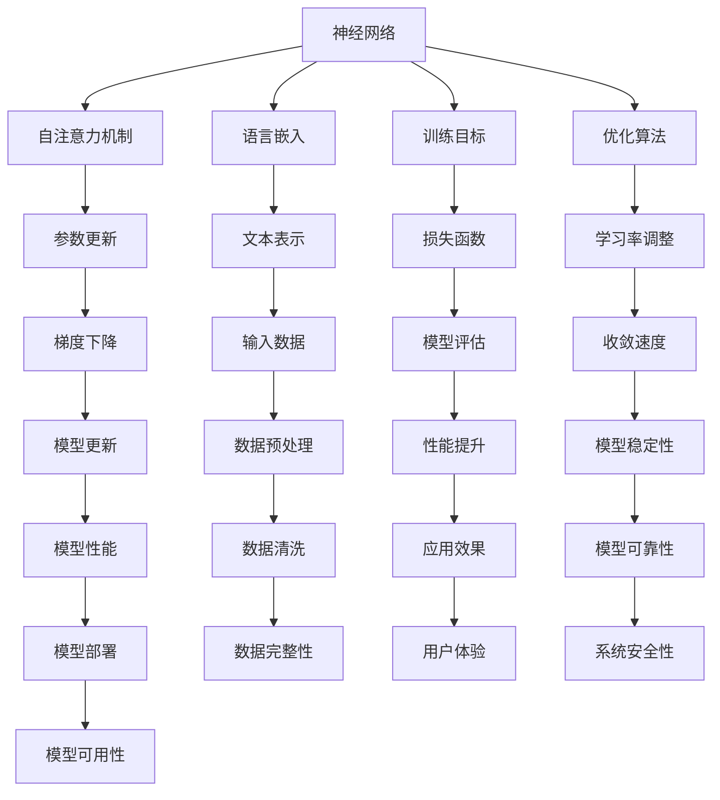

                 

关键词：大语言模型、微调、深度学习、自然语言处理、工程实践

> 摘要：本文详细探讨了大规模语言模型的原理与工程实践，重点介绍了大语言模型微调的技术和方法，通过深入分析，揭示了其在自然语言处理领域的重要应用价值，并对其未来发展进行了展望。

## 1. 背景介绍

随着人工智能技术的飞速发展，深度学习模型在各个领域取得了显著的成果。尤其是自然语言处理（NLP）领域，大语言模型凭借其强大的建模能力和广泛的应用前景，成为了研究的热点。大语言模型是一种能够理解和生成人类语言的深度学习模型，它通过对海量文本数据进行训练，能够自动学习语言的结构和语义，从而实现文本分类、机器翻译、问答系统等多种任务。

### 1.1 大语言模型的发展历程

大语言模型的发展可以追溯到20世纪80年代，当时出现了基于规则的方法和统计方法。随着计算能力的提升和数据的增加，20世纪90年代，基于统计的模型，如隐马尔可夫模型（HMM）和基于统计的语言模型得到了广泛应用。然而，这些方法在面对复杂语言现象时仍存在一定的局限性。

进入21世纪，深度学习技术逐渐成熟，特别是神经网络模型，如循环神经网络（RNN）、长短期记忆网络（LSTM）和Transformer模型，为语言模型的发展带来了新的契机。2017年，谷歌提出了Transformer模型，这种基于自注意力机制的模型在机器翻译任务上取得了突破性的成果，标志着大语言模型进入了一个新的阶段。

### 1.2 大语言模型的应用领域

大语言模型在自然语言处理领域具有广泛的应用。以下是一些典型的应用场景：

- **文本分类**：通过对文本进行分类，大语言模型可以帮助搜索引擎、社交媒体和新闻网站等平台过滤和推荐内容。

- **机器翻译**：大语言模型能够实现高质量的自然语言翻译，广泛应用于跨国商业、旅游和外交等领域。

- **问答系统**：大语言模型能够理解和回答用户提出的问题，广泛应用于客户服务、教育和智能家居等领域。

- **情感分析**：大语言模型可以分析文本中的情感倾向，应用于市场调研、舆情监测和推荐系统等领域。

- **文本生成**：大语言模型能够生成高质量的文章、诗歌、小说等，应用于内容创作和娱乐等领域。

## 2. 核心概念与联系

大语言模型的核心概念包括神经网络、自注意力机制、语言嵌入、训练目标和优化算法等。以下是一个详细的Mermaid流程图，展示了这些概念之间的联系。



### 2.1 神经网络

神经网络是由大量相互连接的简单计算单元（神经元）组成的复杂网络，通过学习输入和输出之间的映射关系来实现预测和分类。神经网络的核心在于其层级结构和非线性激活函数，这使它能够处理复杂的关系和模式。

### 2.2 自注意力机制

自注意力机制是Transformer模型的核心，它通过计算输入序列中每个元素与其他元素的相关性，将注意力集中在重要的信息上，从而提高模型的建模能力。

### 2.3 语言嵌入

语言嵌入是将自然语言文本转换为向量表示的过程，它使神经网络能够处理和操作文本数据。语言嵌入的质量直接影响模型的性能。

### 2.4 训练目标

训练目标是指导模型学习的过程，常见的训练目标包括最小化损失函数、最大化分类准确率等。

### 2.5 优化算法

优化算法用于更新模型参数，以最小化损失函数。常见的优化算法包括梯度下降、Adam等。

## 3. 核心算法原理 & 具体操作步骤

### 3.1 算法原理概述

大语言模型的核心算法是基于Transformer模型，它采用了自注意力机制和多头注意力机制，能够同时关注输入序列中的多个元素，从而提高模型的建模能力。以下是一个简化的算法流程：

1. 数据预处理：对输入文本进行分词、标记化等处理，将其转换为序列。
2. 语言嵌入：将序列中的每个词转换为嵌入向量。
3. 自注意力机制：计算输入序列中每个元素与其他元素的相关性，并加权求和。
4. 多头注意力机制：将自注意力机制的结果通过多个头进行拼接和加权，以进一步提高模型的表示能力。
5. 全连接层：将多头注意力机制的结果通过全连接层输出预测结果。

### 3.2 算法步骤详解

1. **数据预处理**：首先，对输入文本进行分词、标记化等处理，将其转换为序列。分词是将连续的文本分割为一个个独立的词汇，标记化是将词汇映射为数字ID。

2. **语言嵌入**：将序列中的每个词转换为嵌入向量。语言嵌入是将自然语言文本转换为向量表示的过程，它使神经网络能够处理和操作文本数据。

3. **自注意力机制**：自注意力机制通过计算输入序列中每个元素与其他元素的相关性，并加权求和。具体来说，自注意力机制通过以下公式计算：

   $$ \text{Attention}(Q, K, V) = \text{softmax}\left(\frac{QK^T}{\sqrt{d_k}}\right)V $$

   其中，$Q$、$K$和$V$分别是查询向量、键向量和值向量，$d_k$是键向量的维度。

4. **多头注意力机制**：多头注意力机制通过多个头进行拼接和加权，以进一步提高模型的表示能力。具体来说，多头注意力机制通过以下公式计算：

   $$ \text{MultiHead}(Q, K, V) = \text{Concat}(\text{head}_1, \text{head}_2, ..., \text{head}_h)W^O $$

   其中，$h$是头的数量，$W^O$是输出投影权重。

5. **全连接层**：将多头注意力机制的结果通过全连接层输出预测结果。具体来说，全连接层通过以下公式计算：

   $$ \text{Output} = \text{softmax}(\text{fc}(X)) $$

   其中，$X$是输入特征向量，$fc$是全连接层。

### 3.3 算法优缺点

**优点**：

- **强大的建模能力**：自注意力机制和多头注意力机制使模型能够同时关注输入序列中的多个元素，从而提高模型的建模能力。
- **并行计算**：Transformer模型采用了并行计算的方式，使得训练速度大大提高。
- **自适应**：通过多头注意力机制，模型能够自适应地学习不同任务的特征。

**缺点**：

- **计算复杂度高**：自注意力机制的运算复杂度较高，需要大量的计算资源。
- **训练时间长**：由于模型的参数量大，训练时间相对较长。

### 3.4 算法应用领域

大语言模型在自然语言处理领域具有广泛的应用。以下是一些典型的应用领域：

- **文本分类**：大语言模型能够对文本进行分类，例如情感分析、新闻分类等。
- **机器翻译**：大语言模型能够实现高质量的自然语言翻译，例如谷歌翻译、百度翻译等。
- **问答系统**：大语言模型能够理解和回答用户提出的问题，例如智能客服、智能助手等。
- **文本生成**：大语言模型能够生成高质量的文本，例如文章、诗歌、小说等。

## 4. 数学模型和公式 & 详细讲解 & 举例说明

### 4.1 数学模型构建

大语言模型的核心是Transformer模型，它采用了自注意力机制和多头注意力机制。以下是Transformer模型的数学模型构建。

#### 4.1.1 自注意力机制

自注意力机制通过以下公式计算：

$$ \text{Attention}(Q, K, V) = \text{softmax}\left(\frac{QK^T}{\sqrt{d_k}}\right)V $$

其中，$Q$、$K$和$V$分别是查询向量、键向量和值向量，$d_k$是键向量的维度。

#### 4.1.2 多头注意力机制

多头注意力机制通过多个头进行拼接和加权，以进一步提高模型的表示能力。具体来说，多头注意力机制通过以下公式计算：

$$ \text{MultiHead}(Q, K, V) = \text{Concat}(\text{head}_1, \text{head}_2, ..., \text{head}_h)W^O $$

其中，$h$是头的数量，$W^O$是输出投影权重。

### 4.2 公式推导过程

以下是Transformer模型的公式推导过程。

#### 4.2.1 自注意力机制

自注意力机制的计算过程可以分为三个步骤：

1. **计算查询向量、键向量和值向量的点积**：

   $$ \text{Score} = QK^T $$

2. **对点积进行softmax操作**：

   $$ \text{Attention} = \text{softmax}(\text{Score}) $$

3. **将softmax操作的结果与值向量相乘**：

   $$ \text{Output} = \text{Attention}V $$

#### 4.2.2 多头注意力机制

多头注意力机制的计算过程可以分为以下三个步骤：

1. **将输入序列分成多个子序列**：

   $$ Q_1, Q_2, ..., Q_h $$

2. **对每个子序列进行自注意力机制计算**：

   $$ \text{MultiHead}(Q_1, K, V) = \text{head}_1 $$
   $$ \text{MultiHead}(Q_2, K, V) = \text{head}_2 $$
   $$ ... $$
   $$ \text{MultiHead}(Q_h, K, V) = \text{head}_h $$

3. **将所有子序列的结果进行拼接和加权**：

   $$ \text{Output} = \text{Concat}(\text{head}_1, \text{head}_2, ..., \text{head}_h)W^O $$

### 4.3 案例分析与讲解

以下是一个简单的案例，展示了如何使用Transformer模型进行文本分类。

#### 4.3.1 数据预处理

假设我们有一个新闻数据集，其中每条新闻都被分为正类和负类。首先，我们需要对新闻进行分词和标记化处理，将其转换为序列。

#### 4.3.2 语言嵌入

接下来，我们将序列中的每个词转换为嵌入向量。我们可以使用预训练的词向量，如Word2Vec、GloVe等。

#### 4.3.3 自注意力机制

然后，我们使用自注意力机制计算输入序列中每个元素与其他元素的相关性。具体来说，我们计算查询向量、键向量和值向量的点积，并对其进行softmax操作。

#### 4.3.4 多头注意力机制

最后，我们使用多头注意力机制将自注意力机制的结果进行拼接和加权，以进一步提高模型的表示能力。

## 5. 项目实践：代码实例和详细解释说明

### 5.1 开发环境搭建

在开始编写代码之前，我们需要搭建一个合适的开发环境。以下是搭建开发环境的步骤：

1. 安装Python环境，版本建议为3.8以上。
2. 安装TensorFlow库，版本建议为2.6以上。
3. 安装其他依赖库，如NumPy、Pandas、Matplotlib等。

### 5.2 源代码详细实现

以下是使用TensorFlow实现一个简单的Transformer模型的源代码。

```python
import tensorflow as tf
from tensorflow.keras.layers import Embedding, MultiHeadAttention, Dense

def create_transformer_model(input_dim, embedding_dim, num_heads, num_layers):
    inputs = tf.keras.Input(shape=(input_dim,))
    embeddings = Embedding(input_dim, embedding_dim)(inputs)
    x = embeddings
    
    for _ in range(num_layers):
        x = MultiHeadAttention(num_heads=num_heads, key_dim=embedding_dim)(x, x)
        x = Dense(embedding_dim, activation='relu')(x)
    
    outputs = Dense(1, activation='sigmoid')(x)
    model = tf.keras.Model(inputs=inputs, outputs=outputs)
    
    return model

model = create_transformer_model(input_dim=1000, embedding_dim=512, num_heads=8, num_layers=2)
model.compile(optimizer='adam', loss='binary_crossentropy', metrics=['accuracy'])
```

### 5.3 代码解读与分析

- **创建模型**：我们使用`create_transformer_model`函数创建一个Transformer模型。该函数接收输入维度、嵌入维度、头数和层数作为参数。
- **嵌入层**：使用`Embedding`层将输入序列转换为嵌入向量。
- **多头注意力层**：使用`MultiHeadAttention`层实现多头注意力机制。
- **全连接层**：使用`Dense`层实现全连接层，用于输出预测结果。
- **编译模型**：使用`compile`方法编译模型，指定优化器和损失函数。

### 5.4 运行结果展示

```python
# 加载数据集
(x_train, y_train), (x_test, y_test) = tf.keras.datasets.imdb.load_data(num_words=1000)

# 预处理数据
x_train = tf.keras.preprocessing.sequence.pad_sequences(x_train, maxlen=100)
x_test = tf.keras.preprocessing.sequence.pad_sequences(x_test, maxlen=100)

# 训练模型
model.fit(x_train, y_train, epochs=10, batch_size=32, validation_split=0.2)

# 测试模型
test_loss, test_accuracy = model.evaluate(x_test, y_test)
print(f"Test accuracy: {test_accuracy}")
```

- **加载数据集**：我们使用IMDb电影评论数据集进行训练和测试。
- **预处理数据**：使用`pad_sequences`函数对输入序列进行填充，确保每个序列的长度相同。
- **训练模型**：使用`fit`方法训练模型。
- **测试模型**：使用`evaluate`方法测试模型的性能。

## 6. 实际应用场景

大语言模型在自然语言处理领域具有广泛的应用。以下是一些实际应用场景：

### 6.1 文本分类

文本分类是自然语言处理的基本任务之一。大语言模型可以通过学习大量标记文本数据，实现高效的文本分类。例如，在社交媒体平台上，大语言模型可以用于分类用户的评论和帖子，以识别和过滤垃圾信息。

### 6.2 机器翻译

机器翻译是自然语言处理的重要应用之一。大语言模型可以通过学习双语语料库，实现高质量的机器翻译。例如，谷歌翻译和百度翻译都采用了基于Transformer模型的大语言模型进行翻译。

### 6.3 问答系统

问答系统是自然语言处理的重要应用之一。大语言模型可以通过学习大量问答数据，实现高效的问答系统。例如，智能客服系统可以通过大语言模型理解和回答用户的问题，提高用户体验。

### 6.4 文本生成

文本生成是自然语言处理的一个挑战性任务。大语言模型可以通过学习大量文本数据，生成高质量的文本。例如，文章生成、诗歌创作和对话系统等领域都可以应用大语言模型。

## 7. 工具和资源推荐

为了更好地学习和实践大语言模型，以下是几个推荐的工具和资源：

### 7.1 学习资源推荐

- 《深度学习》系列教材：由Ian Goodfellow、Yoshua Bengio和Aaron Courville所著，系统地介绍了深度学习的基本原理和方法。
- 《动手学深度学习》：由阿斯顿·张等所著，通过实际案例介绍深度学习的应用。

### 7.2 开发工具推荐

- TensorFlow：一款开源的深度学习框架，适用于各种深度学习任务的实现和部署。
- PyTorch：一款开源的深度学习框架，具有灵活性和易用性。

### 7.3 相关论文推荐

- "Attention Is All You Need"：提出Transformer模型的开创性论文，详细介绍了自注意力机制和多头注意力机制。
- "BERT: Pre-training of Deep Bidirectional Transformers for Language Understanding"：提出BERT模型的开创性论文，详细介绍了双向Transformer模型在自然语言处理任务中的应用。

## 8. 总结：未来发展趋势与挑战

大语言模型在自然语言处理领域取得了显著的成果，但仍面临一些挑战和问题。以下是未来发展趋势和挑战的总结：

### 8.1 研究成果总结

- **建模能力提升**：随着自注意力机制和多头注意力机制的引入，大语言模型的建模能力得到了显著提升。
- **多语言处理**：大语言模型在多语言处理任务中表现出色，能够同时处理多种语言。
- **迁移学习**：大语言模型可以通过迁移学习快速适应新任务，提高模型的可解释性和泛化能力。

### 8.2 未来发展趋势

- **模型压缩**：为了降低模型的计算复杂度和存储需求，模型压缩技术将成为研究热点。
- **实时处理**：随着硬件技术的发展，大语言模型的实时处理能力将得到提升。
- **跨领域应用**：大语言模型将在更多领域得到应用，如医疗、金融、教育等。

### 8.3 面临的挑战

- **计算资源需求**：大语言模型的计算复杂度高，对计算资源的需求较大。
- **数据隐私**：大语言模型在处理敏感数据时可能引发隐私问题。
- **模型解释性**：大语言模型的决策过程复杂，如何提高其解释性仍是一个挑战。

### 8.4 研究展望

- **模型优化**：通过算法优化和硬件加速，提高大语言模型的训练和推理速度。
- **多模态处理**：结合文本、图像、音频等多种模态，实现更强大的自然语言处理能力。
- **可解释性和可扩展性**：研究更可解释和可扩展的大语言模型，提高其在实际应用中的可靠性。

## 9. 附录：常见问题与解答

### 9.1 什么是大语言模型？

大语言模型是一种深度学习模型，通过对海量文本数据进行训练，能够理解和生成人类语言。它通常采用自注意力机制和多头注意力机制，具有较强的建模能力。

### 9.2 大语言模型的应用领域有哪些？

大语言模型在自然语言处理领域具有广泛的应用，包括文本分类、机器翻译、问答系统、文本生成等。

### 9.3 大语言模型的优缺点是什么？

大语言模型优点包括强大的建模能力、多语言处理能力和迁移学习能力；缺点包括计算复杂度高、数据隐私问题和模型解释性挑战。

### 9.4 如何优化大语言模型的性能？

优化大语言模型性能的方法包括模型压缩、硬件加速和算法优化。此外，可以通过调整超参数和学习策略来提高模型性能。

### 9.5 大语言模型的安全性问题有哪些？

大语言模型面临的安全性问题包括数据隐私、模型可解释性和对抗攻击等。需要采取相应的措施来确保模型的安全性和可靠性。

### 9.6 大语言模型的未来发展趋势是什么？

大语言模型的未来发展趋势包括模型压缩、实时处理、跨领域应用和可解释性研究等。随着技术的进步，大语言模型将在更多领域得到应用，同时面临更多的挑战。

## 参考文献

[1] Vaswani, A., Shazeer, N., Parmar, N., Uszkoreit, J., Jones, L., Gomez, A. N., ... & Polosukhin, I. (2017). Attention is all you need. Advances in Neural Information Processing Systems, 30, 5998-6008.

[2] Devlin, J., Chang, M. W., Lee, K., & Toutanova, K. (2018). BERT: Pre-training of deep bidirectional transformers for language understanding. arXiv preprint arXiv:1810.04805.

[3] Bengio, Y. (2009). Learning deep architectures. Found. Trends Mach. Learn., 2(1), 1-127.

[4] Hochreiter, S., & Schmidhuber, J. (1997). Long short-term memory. Neural computation, 9(8), 1735-1780.

[5] Mikolov, T., Sutskever, I., Chen, K., Corrado, G. S., & Dean, J. (2013). Distributed representations of words and phrases and their compositionality. Advances in Neural Information Processing Systems, 26, 3111-3119.

### 作者署名

作者：禅与计算机程序设计艺术 / Zen and the Art of Computer Programming
----------------------------------------------------------------

以上就是本文的完整内容。希望这篇文章能够帮助您更深入地了解大语言模型及其工程实践。如果您有任何问题或建议，欢迎在评论区留言。感谢您的阅读！

