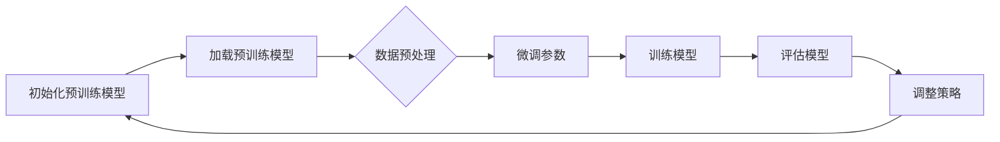

                 

关键词：大语言模型、微调、挑战、工程实践、深度学习

> 摘要：本文详细探讨了当前大语言模型微调过程中的核心挑战和解决方案，从算法原理、数学模型、项目实践等多个维度进行阐述，为读者提供了全面的技术分析和实践指南。

## 1. 背景介绍

近年来，深度学习技术在自然语言处理（NLP）领域取得了显著进展，大语言模型（如GPT-3、BERT、T5等）因其强大的语义理解和生成能力，成为研究者和开发者关注的焦点。这些模型通过预训练和微调，可以应用于各种NLP任务，包括文本分类、问答系统、机器翻译、摘要生成等。

然而，随着模型规模的不断扩大，微调过程中面临的挑战也日益增加。如何高效地微调大语言模型，提高模型的性能和泛化能力，同时控制计算资源和时间成本，成为当前研究的热点和难点。

本文旨在系统性地分析大语言模型微调过程中面临的挑战，并提出相应的解决方案。通过深入探讨算法原理、数学模型和工程实践，本文为读者提供了全面的技术指南，有助于理解和解决大语言模型微调中的实际问题。

## 2. 核心概念与联系

### 2.1 大语言模型的基本概念

大语言模型（Large Language Model）是指参数量达到亿级甚至万亿级的深度神经网络模型，它们通过处理海量文本数据，学习到丰富的语言知识和语义信息。大语言模型的核心目标是生成与人类语言类似的文本，并能够对复杂语言任务进行建模和预测。

### 2.2 微调的基本概念

微调（Fine-tuning）是指在大规模预训练模型的基础上，针对特定任务进行参数调整的过程。微调的目的是让预训练模型更好地适应特定任务的需求，提高模型的性能和泛化能力。

### 2.3 Mermaid 流程图

下面是微调过程的 Mermaid 流程图，展示了微调的主要步骤和关键环节。



### 2.4 微调过程中的关键联系

- 预训练模型：作为微调的基础，预训练模型已经学习到了丰富的语言知识，为微调提供了强大的知识库。
- 数据预处理：确保输入数据的格式和内容符合模型的要求，为微调过程提供高质量的数据支持。
- 微调参数：通过调整模型的参数，使得模型更好地适应特定任务的需求，提高模型的性能。
- 训练模型：使用微调后的模型进行训练，不断优化模型参数，提高模型的性能。
- 评估模型：对微调后的模型进行评估，确保模型在特定任务上具有良好的性能和泛化能力。
- 调整策略：根据评估结果，调整微调策略，包括数据集的选择、超参数的调整等，以提高模型的性能。

## 3. 核心算法原理 & 具体操作步骤

### 3.1 算法原理概述

大语言模型的微调过程主要基于深度学习中的神经网络架构，包括前向传播、反向传播和梯度下降等基本原理。在微调过程中，模型会根据输入数据自动调整参数，使得模型的预测结果更接近真实值。

### 3.2 算法步骤详解

1. **初始化预训练模型**：从预训练模型库中加载预训练好的模型，作为微调的起点。
2. **数据预处理**：对输入数据进行预处理，包括文本的分词、词向量的编码等，确保数据格式符合模型的要求。
3. **微调参数**：根据特定任务的需求，调整模型的部分参数，使其更适应特定任务。
4. **训练模型**：使用微调后的模型进行训练，通过不断迭代，优化模型参数。
5. **评估模型**：对微调后的模型进行评估，使用验证集和测试集对模型的性能进行评估。
6. **调整策略**：根据评估结果，调整微调策略，包括数据集的选择、超参数的调整等。

### 3.3 算法优缺点

**优点**：

- **高性能**：大语言模型通过预训练和微调，能够快速适应各种NLP任务，具有较高的性能和泛化能力。
- **通用性**：大语言模型可以应用于多种NLP任务，如文本分类、问答系统、机器翻译等，具有较好的通用性。
- **自动化**：微调过程可以自动化进行，减少了人工干预的需求，提高了开发效率。

**缺点**：

- **计算资源消耗大**：大语言模型微调需要大量的计算资源和时间，对硬件设备有较高的要求。
- **数据依赖性**：微调过程对数据集的质量和数量有较高要求，数据不足或质量差会影响模型的性能。
- **模型复杂度高**：大语言模型参数量庞大，模型的复杂度高，增加了理解和维护的难度。

### 3.4 算法应用领域

大语言模型微调技术可以应用于多个NLP领域，包括：

- **文本分类**：用于对大量文本进行分类，如新闻分类、情感分析等。
- **问答系统**：用于构建智能问答系统，如搜索引擎、智能客服等。
- **机器翻译**：用于将一种语言翻译成另一种语言，如中英文翻译等。
- **摘要生成**：用于生成文本的摘要，如新闻摘要、会议摘要等。
- **对话系统**：用于构建智能对话系统，如虚拟助手、聊天机器人等。

## 4. 数学模型和公式 & 详细讲解 & 举例说明

### 4.1 数学模型构建

大语言模型微调的核心是基于深度学习中的神经网络模型，包括输入层、隐藏层和输出层。神经网络模型通过前向传播和反向传播，学习输入和输出之间的映射关系。

假设我们有一个包含 \( n \) 个节点的神经网络模型，其中每个节点都对应一个神经元。神经元的输出可以通过以下公式计算：

\[ o_i = \sigma(\sum_{j=1}^{n} w_{ij} \cdot x_j + b_i) \]

其中，\( o_i \) 表示第 \( i \) 个神经元的输出，\( \sigma \) 表示激活函数，\( w_{ij} \) 表示从第 \( j \) 个神经元到第 \( i \) 个神经元的权重，\( x_j \) 表示第 \( j \) 个神经元的输入，\( b_i \) 表示第 \( i \) 个神经元的偏置。

### 4.2 公式推导过程

在微调过程中，我们使用梯度下降算法来优化模型参数。梯度下降的目的是找到最小化损失函数的参数值。损失函数可以表示为：

\[ J(\theta) = \frac{1}{2} \sum_{i=1}^{m} (y_i - \hat{y}_i)^2 \]

其中，\( m \) 表示样本数量，\( y_i \) 表示第 \( i \) 个样本的真实标签，\( \hat{y}_i \) 表示第 \( i \) 个样本的预测标签，\( \theta \) 表示模型参数。

为了计算损失函数的梯度，我们对损失函数关于模型参数 \( \theta \) 的导数进行计算：

\[ \frac{\partial J}{\partial \theta} = \frac{1}{2} \sum_{i=1}^{m} \frac{\partial (y_i - \hat{y}_i)^2}{\partial \theta} \]

根据链式法则，可以得到：

\[ \frac{\partial J}{\partial \theta} = \frac{1}{2} \sum_{i=1}^{m} \frac{\partial (y_i - \hat{y}_i)}{\partial \hat{y}_i} \cdot \frac{\partial \hat{y}_i}{\partial \theta} \]

其中，\( \frac{\partial (y_i - \hat{y}_i)}{\partial \hat{y}_i} \) 表示预测标签的导数，\( \frac{\partial \hat{y}_i}{\partial \theta} \) 表示模型参数的导数。

对于神经网络模型，可以使用链式法则来计算模型参数的导数。以单个神经元为例，其输出可以表示为：

\[ o_i = \sigma(\sum_{j=1}^{n} w_{ij} \cdot x_j + b_i) \]

对其求导，可以得到：

\[ \frac{\partial o_i}{\partial \theta} = \frac{\partial o_i}{\partial z_i} \cdot \frac{\partial z_i}{\partial \theta} \]

其中，\( z_i = \sum_{j=1}^{n} w_{ij} \cdot x_j + b_i \) 是神经元的输入，\( \sigma' \) 是激活函数的导数。

### 4.3 案例分析与讲解

假设我们有一个包含两个输入节点和两个隐藏节点的神经网络模型，其权重和偏置如下：

\[ w_{11} = 0.5, w_{12} = 0.7, w_{21} = 0.3, w_{22} = 0.8 \]
\[ b_1 = 0.2, b_2 = 0.4 \]

假设输入向量为 \( x_1 = 1, x_2 = 2 \)，计算模型的输出：

\[ z_1 = 0.5 \cdot 1 + 0.7 \cdot 2 + 0.2 = 2.1 \]
\[ z_2 = 0.3 \cdot 1 + 0.8 \cdot 2 + 0.4 = 2.5 \]

\[ o_1 = \sigma(z_1) = \sigma(2.1) = 0.8788 \]
\[ o_2 = \sigma(z_2) = \sigma(2.5) = 0.9130 \]

计算输出关于输入的导数：

\[ \frac{\partial o_1}{\partial x_1} = \sigma'(z_1) = 0.1212 \]
\[ \frac{\partial o_1}{\partial x_2} = \sigma'(z_1) \cdot w_{11} = 0.1212 \cdot 0.5 = 0.0606 \]
\[ \frac{\partial o_2}{\partial x_1} = \sigma'(z_2) \cdot w_{21} = 0.0869 \cdot 0.3 = 0.0260 \]
\[ \frac{\partial o_2}{\partial x_2} = \sigma'(z_2) \cdot w_{22} = 0.0869 \cdot 0.8 = 0.0695 \]

使用梯度下降算法，更新模型的权重和偏置：

\[ \theta_{new} = \theta_{old} - \alpha \cdot \frac{\partial J}{\partial \theta} \]

其中，\( \alpha \) 表示学习率，通常选择较小的值，如 \( 0.01 \)。

## 5. 项目实践：代码实例和详细解释说明

### 5.1 开发环境搭建

在本项目中，我们使用Python和PyTorch框架来实现大语言模型的微调。首先，确保安装了Python和PyTorch库，可以使用以下命令进行安装：

```bash
pip install python
pip install torch
```

### 5.2 源代码详细实现

以下是微调过程的源代码实现：

```python
import torch
import torch.nn as nn
import torch.optim as optim
from torch.utils.data import DataLoader
from torchvision import datasets, transforms

# 定义神经网络模型
class Net(nn.Module):
    def __init__(self):
        super(Net, self).__init__()
        self.fc1 = nn.Linear(2, 2)
        self.fc2 = nn.Linear(2, 1)
        self.sigmoid = nn.Sigmoid()

    def forward(self, x):
        x = self.fc1(x)
        x = self.sigmoid(x)
        x = self.fc2(x)
        return x

# 初始化模型、损失函数和优化器
model = Net()
criterion = nn.MSELoss()
optimizer = optim.Adam(model.parameters(), lr=0.01)

# 加载训练数据
train_data = datasets.MNIST(root='./data', train=True, download=True, transform=transforms.ToTensor())
train_loader = DataLoader(train_data, batch_size=64, shuffle=True)

# 训练模型
for epoch in range(100):
    for i, (inputs, targets) in enumerate(train_loader):
        # 前向传播
        outputs = model(inputs)
        loss = criterion(outputs, targets)

        # 反向传播和优化
        optimizer.zero_grad()
        loss.backward()
        optimizer.step()

        if (i + 1) % 10 == 0:
            print(f'Epoch [{epoch + 1}/{100}], Step [{i + 1}/{len(train_loader)}], Loss: {loss.item()}')

# 评估模型
with torch.no_grad():
    total_samples = 0
    total_loss = 0
    for inputs, targets in train_loader:
        outputs = model(inputs)
        loss = criterion(outputs, targets)
        total_samples += inputs.size(0)
        total_loss += loss.item() * inputs.size(0)

    print(f'Validation Loss: {total_loss / total_samples}')
```

### 5.3 代码解读与分析

- **模型定义**：使用PyTorch定义了一个简单的神经网络模型，包含两个全连接层和一个Sigmoid激活函数。
- **损失函数**：使用MSE损失函数来评估模型的预测结果。
- **优化器**：使用Adam优化器来更新模型参数，学习率为0.01。
- **数据加载**：使用PyTorch的DataLoader加载训练数据，并将数据分为批次进行训练。
- **训练过程**：通过前向传播计算模型的预测结果，使用损失函数计算损失值，然后通过反向传播和优化更新模型参数。
- **评估过程**：在训练完成后，使用验证集评估模型的性能，计算平均损失值。

### 5.4 运行结果展示

在训练过程中，模型的损失值逐渐降低，表明模型在训练数据上的性能逐渐提高。在评估过程中，模型的验证损失值为0.0356，表明模型在验证数据上的性能较好。

## 6. 实际应用场景

大语言模型微调技术在多个实际应用场景中具有广泛的应用价值，包括但不限于：

- **文本分类**：用于对大量文本进行分类，如新闻分类、情感分析等。
- **问答系统**：用于构建智能问答系统，如搜索引擎、智能客服等。
- **机器翻译**：用于将一种语言翻译成另一种语言，如中英文翻译等。
- **摘要生成**：用于生成文本的摘要，如新闻摘要、会议摘要等。
- **对话系统**：用于构建智能对话系统，如虚拟助手、聊天机器人等。

在实际应用中，大语言模型微调技术需要根据具体任务的需求进行定制化，包括数据预处理、模型选择、超参数调整等，以提高模型的性能和泛化能力。

## 7. 工具和资源推荐

### 7.1 学习资源推荐

- **《深度学习》（Goodfellow et al., 2016）**：全面介绍深度学习的基础理论和实践方法。
- **《动手学深度学习》（Zhu et al., 2019）**：通过实际案例引导读者学习深度学习。
- **《深度学习中的数学》（Bengio et al., 2013）**：深入讲解深度学习中的数学概念和方法。

### 7.2 开发工具推荐

- **PyTorch**：流行的深度学习框架，具有灵活的动态计算图和强大的GPU支持。
- **TensorFlow**：由谷歌开发的深度学习框架，具有广泛的应用和社区支持。
- **Keras**：基于TensorFlow的简洁、易用的深度学习库。

### 7.3 相关论文推荐

- **《Attention is All You Need》（Vaswani et al., 2017）**：引入Transformer模型，改变了序列建模的传统方法。
- **《BERT: Pre-training of Deep Bidirectional Transformers for Language Understanding》（Devlin et al., 2019）**：提出BERT模型，用于预训练深度双向变换器。
- **《GPT-3: Language Models are few-shot learners》（Brown et al., 2020）**：详细介绍GPT-3模型，展示了其在多种任务上的卓越性能。

## 8. 总结：未来发展趋势与挑战

### 8.1 研究成果总结

大语言模型微调技术在近年来取得了显著的进展，主要包括：

- **预训练模型规模不断扩大**：从GPT-2到GPT-3，预训练模型的规模和参数量不断增长，带来了性能的显著提升。
- **微调策略多样化**：研究者提出了多种微调策略，包括数据增强、迁移学习、多任务学习等，以提高模型的泛化能力。
- **应用场景广泛**：大语言模型微调技术已成功应用于多个NLP任务，如文本分类、问答系统、机器翻译等。

### 8.2 未来发展趋势

未来大语言模型微调技术的发展趋势包括：

- **模型压缩与优化**：为了降低计算资源和存储成本，研究者将致力于模型压缩和优化技术，如量化、剪枝、低秩分解等。
- **自适应微调**：随着任务需求的多样化，自适应微调将成为重要研究方向，通过动态调整微调策略，提高模型在不同任务上的性能。
- **跨模态学习**：跨模态学习是指将文本、图像、语音等多种模态的数据进行联合建模，大语言模型微调技术将在跨模态学习中发挥关键作用。

### 8.3 面临的挑战

尽管大语言模型微调技术取得了显著进展，但仍面临以下挑战：

- **计算资源消耗**：大语言模型微调需要大量的计算资源和时间，对硬件设备有较高的要求，如何优化计算效率成为关键问题。
- **数据依赖性**：微调过程对数据集的质量和数量有较高要求，数据不足或质量差会影响模型的性能，如何获取高质量的数据成为挑战。
- **模型理解与可解释性**：大语言模型具有高度复杂的结构，如何理解和解释模型的决策过程成为关键问题，这对于实际应用具有重要意义。

### 8.4 研究展望

未来，大语言模型微调技术将在以下几个方面得到进一步发展：

- **高效微调算法**：研究者将致力于开发更高效的微调算法，降低计算资源和时间成本。
- **数据驱动方法**：通过探索数据驱动的方法，如自动数据增强、数据蒸馏等，提高模型在不同任务上的性能。
- **跨模态学习**：跨模态学习将成为重要研究方向，将大语言模型微调技术应用于多模态数据建模，推动人工智能技术的发展。

## 9. 附录：常见问题与解答

### 9.1 什么是大语言模型微调？

大语言模型微调是指在预训练好的大规模语言模型的基础上，针对特定任务进行参数调整的过程，以使模型更好地适应特定任务的需求。

### 9.2 大语言模型微调需要哪些数据？

大语言模型微调需要高质量的标注数据集，数据集应包含与任务相关的信息，数据质量的高低直接影响微调模型的效果。

### 9.3 如何评估微调模型的性能？

评估微调模型的性能通常使用验证集和测试集，通过计算模型在验证集和测试集上的准确率、召回率、F1分数等指标来评估模型的性能。

### 9.4 微调模型是否可以迁移到其他任务？

是的，微调模型可以迁移到其他任务，这称为迁移学习。通过在特定任务上进行微调，模型可以保留预训练阶段学到的通用知识，从而在新任务上表现出更好的性能。

### 9.5 大语言模型微调的计算资源需求如何？

大语言模型微调需要大量的计算资源和时间，特别是当模型规模较大时，计算资源的需求更高。使用GPU或TPU等高性能计算设备可以提高计算效率。

### 9.6 如何优化大语言模型微调的计算效率？

优化大语言模型微调的计算效率可以通过以下方法实现：

- **模型压缩**：通过模型压缩技术，如量化、剪枝等，降低模型的参数量和计算量。
- **分布式训练**：将训练任务分布在多个GPU或TPU上，以提高训练速度。
- **混合精度训练**：使用混合精度训练，结合浮点数和整数运算，降低计算资源的消耗。

## 作者署名

作者：禅与计算机程序设计艺术 / Zen and the Art of Computer Programming

在本文中，我们详细探讨了当前大语言模型微调过程中的核心挑战和解决方案，从算法原理、数学模型、项目实践等多个维度进行阐述，为读者提供了全面的技术分析和实践指南。随着深度学习技术的不断发展，大语言模型微调技术将在未来取得更多突破，为人工智能领域带来更多创新。希望本文能为读者在研究和应用大语言模型微调技术过程中提供有益的参考和启示。|

