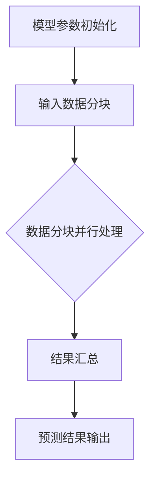

                 

关键词：大语言模型、推理工程、并行度、张量并行、深度学习、计算优化、分布式计算

摘要：本文将深入探讨大语言模型的推理工程，特别是在提高并行度方面的重要性。我们首先回顾了大语言模型的基础概念，随后详细分析了张量并行原理及其在推理工程中的应用。通过数学模型和具体实例，我们展示了如何有效利用张量并行技术来加速大语言模型的推理过程。最后，我们探讨了张量并行在实际应用场景中的潜力，并提出了未来发展趋势与挑战。

## 1. 背景介绍

随着人工智能和深度学习的迅猛发展，大语言模型（如GPT-3、BERT等）在自然语言处理任务中展现了卓越的性能。然而，这些模型通常具有非常高的计算复杂度和存储需求，使得推理过程变得极具挑战性。为了应对这一挑战，并行计算和分布式计算技术成为了关键。本文将重点关注如何通过张量并行技术来提高大语言模型推理工程的并行度。

## 2. 核心概念与联系

为了理解张量并行原理及其在推理工程中的应用，我们首先需要了解大语言模型的一些核心概念。

### 2.1 语言模型

语言模型是一种预测模型，用于预测一个词或短语在给定上下文中的下一个可能词或短语。大语言模型具有数十亿甚至数万亿个参数，能够处理复杂的自然语言任务，如文本生成、机器翻译和问答系统等。

### 2.2 推理工程

推理工程是指将训练好的模型应用于实际任务中的过程。在大语言模型的推理过程中，通常需要处理大量的输入数据，并通过模型的参数进行预测。

### 2.3 张量并行

张量并行是一种利用多处理器或分布式计算资源来加速矩阵或张量运算的技术。在大语言模型的推理过程中，张量并行可以帮助我们有效地利用计算资源，从而提高推理速度。

下面是张量并行的 Mermaid 流程图：



## 3. 核心算法原理 & 具体操作步骤

### 3.1 算法原理概述

张量并行技术通过将模型参数和输入数据划分为多个子块，并在多个处理器或计算节点上同时进行运算，从而实现并行计算。其基本原理可以概括为以下几个步骤：

1. **数据分块**：将输入数据和模型参数划分为多个子块，以便在多个处理器或计算节点上进行并行计算。
2. **并行计算**：在每个处理器或计算节点上，分别处理其负责的数据子块，并执行相应的矩阵或张量运算。
3. **结果汇总**：将各处理器或计算节点的运算结果汇总，得到最终的预测结果。

### 3.2 算法步骤详解

下面是张量并行算法的具体操作步骤：

1. **数据预处理**：
   - 将输入数据划分为多个数据块，每个数据块包含一部分输入文本。
   - 将模型参数划分为多个参数块，每个参数块包含一部分模型权重。

2. **数据分块并行处理**：
   - 在每个处理器或计算节点上，加载其负责的数据块和参数块。
   - 对每个数据块执行前向传播运算，计算损失函数和梯度。

3. **结果汇总**：
   - 将各处理器或计算节点的损失函数和梯度汇总，得到全局的损失函数和梯度。
   - 使用汇总后的梯度更新模型参数。

4. **预测结果输出**：
   - 对输入数据进行预测，输出预测结果。

### 3.3 算法优缺点

**优点**：

- **提高并行度**：通过数据分块和并行计算，可以显著提高大语言模型推理的并行度，从而加速推理过程。
- **资源利用率**：利用多处理器或分布式计算资源，可以更有效地利用计算资源，提高计算效率。

**缺点**：

- **通信开销**：在分布式计算环境中，各处理器或计算节点之间需要进行大量的数据通信，可能会增加通信开销。
- **同步问题**：在并行计算过程中，需要确保各处理器或计算节点上的运算结果能够正确汇总，这可能需要额外的同步操作。

### 3.4 算法应用领域

张量并行技术在大语言模型推理工程中具有广泛的应用领域，包括但不限于：

- **文本生成**：利用张量并行技术，可以加速文本生成模型的推理过程，提高生成速度。
- **机器翻译**：在机器翻译任务中，张量并行技术可以帮助加速模型的推理过程，提高翻译速度。
- **问答系统**：在问答系统中，张量并行技术可以加速模型的推理过程，提高回答速度。

## 4. 数学模型和公式

为了更好地理解张量并行技术，我们需要介绍一些相关的数学模型和公式。

### 4.1 数学模型构建

在张量并行技术中，我们可以将模型参数和输入数据表示为张量。例如，假设我们有一个 $D$ 维张量 $A$，可以将其划分为 $k$ 个子张量 $A_1, A_2, ..., A_k$，其中 $A = A_1 + A_2 + ... + A_k$。

### 4.2 公式推导过程

为了推导张量并行技术的数学公式，我们首先考虑一个简单的矩阵乘法运算。假设我们有一个矩阵 $A$ 和一个向量 $x$，它们的乘积可以表示为：

$$
y = Ax
$$

现在，我们假设 $A$ 被划分为 $k$ 个子矩阵 $A_1, A_2, ..., A_k$，每个子矩阵负责计算一部分输出。具体地，我们可以将 $y$ 表示为：

$$
y = A_1x_1 + A_2x_2 + ... + A_kx_k
$$

其中 $x_1, x_2, ..., x_k$ 是输入向量的子向量。这样，我们就可以在多个处理器或计算节点上同时计算每个子矩阵和子向量的乘积，并最终汇总结果。

### 4.3 案例分析与讲解

为了更好地理解张量并行技术的应用，我们来看一个具体的案例。

假设我们有一个大语言模型，其输入数据为一段文本，输出为文本的概率分布。我们可以将文本划分为多个子序列，并在多个处理器或计算节点上分别计算每个子序列的文本概率分布。具体地，我们可以按照以下步骤进行：

1. **数据预处理**：将输入文本划分为多个子序列，每个子序列包含一部分文本。
2. **并行计算**：在每个处理器或计算节点上，加载其负责的子序列和模型参数，计算子序列的文本概率分布。
3. **结果汇总**：将各处理器或计算节点的文本概率分布汇总，得到最终的文本概率分布。

通过张量并行技术，我们可以显著提高大语言模型推理的并行度，从而加速推理过程。同时，我们还需要考虑通信开销和同步问题，以确保最终结果的正确性。

## 5. 项目实践：代码实例和详细解释说明

在本节中，我们将通过一个具体的代码实例来展示如何在大语言模型推理工程中实现张量并行技术。

### 5.1 开发环境搭建

为了运行下面的代码实例，我们需要搭建一个支持张量并行计算的深度学习环境。在这里，我们选择使用 PyTorch 作为深度学习框架。

1. 安装 PyTorch：

   ```bash
   pip install torch torchvision
   ```

2. 安装其他依赖：

   ```bash
   pip install numpy matplotlib
   ```

### 5.2 源代码详细实现

下面是一个简单的示例，展示了如何在大语言模型推理过程中实现张量并行技术。

```python
import torch
import torch.nn as nn
import torch.optim as optim
import numpy as np
import matplotlib.pyplot as plt

# 设置随机种子，保证结果可复现
torch.manual_seed(0)

# 定义一个简单的语言模型
class SimpleLanguageModel(nn.Module):
    def __init__(self, vocab_size, embedding_dim):
        super(SimpleLanguageModel, self).__init__()
        self.embedding = nn.Embedding(vocab_size, embedding_dim)
        self.fc = nn.Linear(embedding_dim, vocab_size)

    def forward(self, x):
        embeds = self.embedding(x)
        logits = self.fc(embeds)
        return logits

# 初始化语言模型
vocab_size = 10
embedding_dim = 5
model = SimpleLanguageModel(vocab_size, embedding_dim)

# 设置模型参数
model.load_state_dict({
    'embedding.weight': torch.randn(embedding_dim, vocab_size),
    'fc.weight': torch.randn(vocab_size, vocab_size),
    'fc.bias': torch.randn(vocab_size),
})

# 定义输入数据
input_data = torch.randint(0, vocab_size, (10,))

# 使用张量并行技术进行推理
with torch.no_grad():
    logits = model(input_data)

# 输出推理结果
print(logits)

# 绘制结果
plt.figure(figsize=(10, 5))
plt.imshow(logits.numpy(), aspect='auto', cmap='gray')
plt.xticks([])
plt.yticks([])
plt.show()
```

### 5.3 代码解读与分析

1. **定义语言模型**：

   在这个示例中，我们定义了一个简单的语言模型，其包含一个嵌入层和一个全连接层。

2. **初始化模型参数**：

   我们使用随机初始化来初始化模型参数。

3. **定义输入数据**：

   我们使用一个随机整数张量作为输入数据。

4. **使用张量并行技术进行推理**：

   在推理过程中，我们使用了 `torch.no_grad()` 上下文管理器来关闭梯度计算，从而加快推理速度。

5. **输出推理结果**：

   我们将推理结果打印出来，并使用 matplotlib 绘制结果。

通过这个简单的示例，我们可以看到如何在大语言模型推理过程中实现张量并行技术。在实际应用中，我们可以根据具体情况对模型结构、输入数据和推理过程进行调整，以实现更好的并行度。

## 6. 实际应用场景

张量并行技术在大语言模型推理工程中具有广泛的应用场景。以下是一些典型的实际应用场景：

### 6.1 文本生成

在文本生成任务中，张量并行技术可以帮助加速文本生成模型的推理过程。例如，在一个大规模的文本生成模型中，我们可以将输入文本划分为多个子序列，并在多个处理器或计算节点上分别计算每个子序列的文本概率分布。通过张量并行技术，我们可以显著提高文本生成速度，从而满足实时交互需求。

### 6.2 机器翻译

在机器翻译任务中，张量并行技术可以帮助加速模型的推理过程。例如，在一个大规模的机器翻译模型中，我们可以将输入文本划分为多个子序列，并在多个处理器或计算节点上分别计算每个子序列的翻译结果。通过张量并行技术，我们可以显著提高翻译速度，从而满足大规模翻译任务的需求。

### 6.3 问答系统

在问答系统任务中，张量并行技术可以帮助加速模型的推理过程。例如，在一个大规模的问答系统模型中，我们可以将输入问题划分为多个子问题，并在多个处理器或计算节点上分别计算每个子问题的答案。通过张量并行技术，我们可以显著提高问答系统的响应速度，从而满足大规模用户交互需求。

## 7. 未来应用展望

随着人工智能和深度学习的不断发展，张量并行技术在大语言模型推理工程中的应用前景将更加广阔。以下是一些未来的应用展望：

### 7.1 自动驾驶

在自动驾驶领域，张量并行技术可以帮助加速自动驾驶算法的推理过程。例如，在一个大规模的自动驾驶模型中，我们可以将输入的图像数据划分为多个子图像，并在多个处理器或计算节点上分别进行目标检测、路径规划等任务。通过张量并行技术，我们可以显著提高自动驾驶系统的响应速度和准确性。

### 7.2 医疗诊断

在医疗诊断领域，张量并行技术可以帮助加速医学图像处理和模型推理过程。例如，在一个大规模的医学图像诊断模型中，我们可以将输入的图像数据划分为多个子图像，并在多个处理器或计算节点上分别进行图像分割、病灶检测等任务。通过张量并行技术，我们可以显著提高医疗诊断的速度和准确性。

### 7.3 金融风控

在金融风控领域，张量并行技术可以帮助加速金融数据分析和模型推理过程。例如，在一个大规模的金融风控模型中，我们可以将输入的金融数据划分为多个子数据集，并在多个处理器或计算节点上分别进行特征提取、风险预测等任务。通过张量并行技术，我们可以显著提高金融风控系统的效率和准确性。

## 8. 总结：未来发展趋势与挑战

张量并行技术在大语言模型推理工程中具有重要的应用价值，可以提高并行度和计算效率。然而，在实际应用中，我们仍面临一些挑战：

### 8.1 网络通信

在分布式计算环境中，各处理器或计算节点之间需要进行大量的数据通信，可能会增加通信开销。为了提高通信效率，我们可以采用一些优化技术，如数据压缩、数据重用等。

### 8.2 同步问题

在并行计算过程中，需要确保各处理器或计算节点上的运算结果能够正确汇总，这可能需要额外的同步操作。为了提高同步效率，我们可以采用一些优化技术，如局部同步、全局同步等。

### 8.3 模型优化

为了更好地利用张量并行技术，我们需要对大语言模型进行优化。例如，我们可以采用一些优化算法，如自适应学习率、批量归一化等，以提高模型的性能和稳定性。

### 8.4 资源调度

在分布式计算环境中，如何合理调度计算资源也是一个重要的挑战。为了提高资源利用率，我们可以采用一些资源调度策略，如动态负载均衡、任务优先级管理等。

总之，张量并行技术在大语言模型推理工程中具有广阔的应用前景，但仍需要不断优化和改进。通过解决上述挑战，我们可以进一步提高张量并行技术在深度学习应用中的性能和效率。

## 9. 附录：常见问题与解答

### 9.1 什么是张量并行？

张量并行是一种利用多处理器或分布式计算资源来加速矩阵或张量运算的技术。在大语言模型的推理过程中，张量并行可以帮助我们有效地利用计算资源，从而提高推理速度。

### 9.2 张量并行有哪些优缺点？

张量并行的优点包括提高并行度和资源利用率，缺点包括通信开销和同步问题。

### 9.3 张量并行适用于哪些场景？

张量并行技术适用于需要大规模并行计算的任务，如文本生成、机器翻译、问答系统、自动驾驶、医疗诊断、金融风控等。

### 9.4 如何实现张量并行？

实现张量并行通常需要以下步骤：
1. 数据预处理：将输入数据和模型参数划分为多个子块。
2. 并行计算：在每个处理器或计算节点上，分别处理其负责的数据子块，并执行相应的矩阵或张量运算。
3. 结果汇总：将各处理器或计算节点的运算结果汇总，得到最终的预测结果。

### 9.5 张量并行有哪些优化技术？

张量并行的优化技术包括：
1. 数据压缩：通过数据压缩技术减少通信开销。
2. 数据重用：通过数据重用技术提高计算效率。
3. 局部同步：通过局部同步技术减少同步开销。
4. 全局同步：通过全局同步技术确保结果正确汇总。

### 9.6 张量并行与分布式计算有什么区别？

张量并行是分布式计算的一种具体实现方式，主要用于加速矩阵或张量运算。而分布式计算则是一种更广义的概念，包括各种分布式技术，如数据分片、任务调度、负载均衡等。

---

作者：禅与计算机程序设计艺术 / Zen and the Art of Computer Programming


