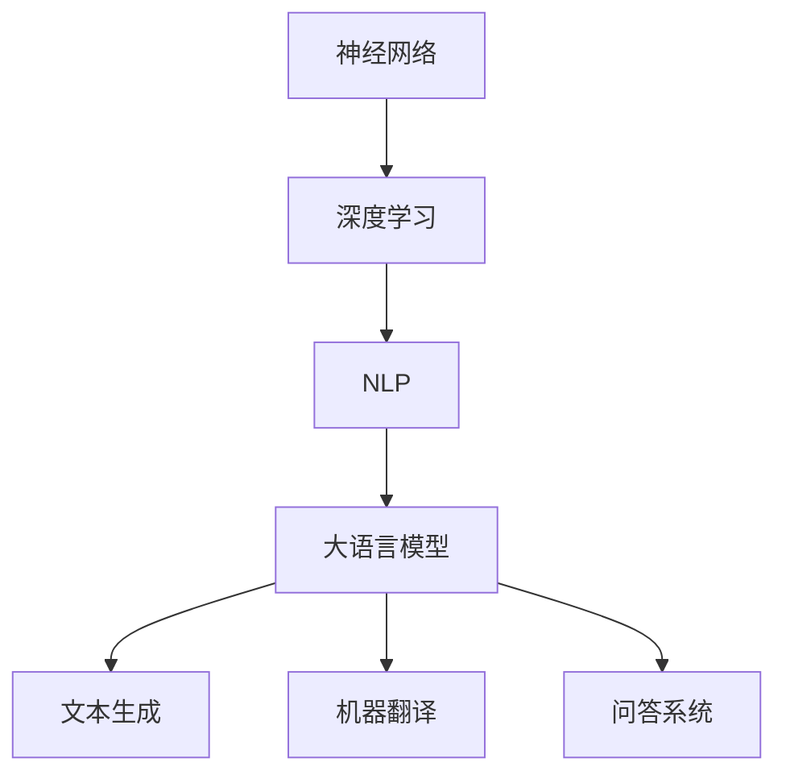

                 

关键词：大语言模型，涌现能力，神经网络，深度学习，自然语言处理，工程实践

## 摘要

本文将探讨大语言模型的原理及其在工程实践中的应用，特别是大语言模型的涌现能力。我们将从背景介绍、核心概念与联系、核心算法原理、数学模型和公式、项目实践、实际应用场景、未来应用展望以及工具和资源推荐等多个方面进行详细阐述。通过本文的阅读，读者将能够深入了解大语言模型的工作原理，掌握其关键技术和应用方法。

## 1. 背景介绍

大语言模型是近年来自然语言处理（NLP）领域的重要进展，其在文本生成、机器翻译、问答系统等方面展现了出色的性能。随着深度学习技术的不断发展，大语言模型已经成为了NLP领域的基石。涌现能力是大语言模型的一大特点，它使得模型能够在无监督或少量监督的条件下，自主学习和发现语言中的复杂结构，从而实现更加智能化和自适应的语言处理任务。

本文旨在通过对大语言模型的原理与工程实践的深入探讨，帮助读者了解这一领域的关键技术和发展趋势。文章将首先介绍大语言模型的核心概念和架构，然后详细阐述其算法原理和数学模型，并通过项目实践和实际应用场景展示其强大能力。最后，我们将讨论大语言模型的未来应用前景，并提出相关的工具和资源推荐。

## 2. 核心概念与联系

为了更好地理解大语言模型的原理和应用，我们需要首先了解几个核心概念，包括神经网络、深度学习、自然语言处理等。

### 2.1 神经网络

神经网络是模仿人脑神经元连接方式而构建的计算模型，它由大量神经元（也称为节点）组成。每个神经元通过加权连接与其他神经元相连，并通过激活函数进行处理。神经网络通过反向传播算法不断调整权重，以优化网络性能。

### 2.2 深度学习

深度学习是一种基于神经网络的机器学习方法，它通过多层次的神经网络结构来提取数据中的复杂特征。深度学习在图像识别、语音识别、自然语言处理等领域取得了显著成果。

### 2.3 自然语言处理

自然语言处理（NLP）是计算机科学领域的一个重要分支，旨在使计算机能够理解和处理人类自然语言。NLP包括文本预处理、词性标注、命名实体识别、情感分析等多个任务。

### 2.4 大语言模型

大语言模型是一种大规模的神经网络模型，它通过学习大量的文本数据来理解语言的结构和语义。大语言模型具有强大的文本生成和语言理解能力，可以应用于文本生成、机器翻译、问答系统等多个领域。

### 2.5 Mermaid 流程图

为了更直观地展示大语言模型的架构，我们使用Mermaid流程图来描述其核心概念和联系。



在这个流程图中，我们可以看到神经网络是深度学习的基础，而深度学习又是NLP的核心技术。大语言模型作为NLP领域的重要工具，可以应用于多个实际任务，如文本生成、机器翻译和问答系统等。

## 3. 核心算法原理 & 具体操作步骤

### 3.1 算法原理概述

大语言模型的核心算法是变长循环神经网络（RNN），特别是长短期记忆网络（LSTM）和门控循环单元（GRU）。这些网络结构能够有效地处理变长的序列数据，并在长时间范围内保持信息的记忆。

LSTM和GRU通过引入门控机制来控制信息的流入和流出，从而避免了传统RNN容易出现的梯度消失和梯度爆炸问题。在大语言模型中，这些网络结构被堆叠成多层，从而可以提取更加复杂的特征。

### 3.2 算法步骤详解

#### 3.2.1 数据预处理

在大语言模型训练之前，需要对文本数据进行预处理。预处理步骤包括分词、词干提取、词性标注等。为了提高模型的泛化能力，通常会使用预训练的词向量，如Word2Vec、GloVe等。

#### 3.2.2 模型初始化

初始化模型参数是训练过程中的重要步骤。通常使用随机初始化，并在训练过程中通过反向传播算法不断调整参数。

#### 3.2.3 前向传播

在前向传播阶段，输入序列通过模型中的多层网络结构进行编码，并产生输出序列。每个时间步的输出都会影响后续时间步的计算。

#### 3.2.4 反向传播

反向传播阶段通过计算损失函数的梯度，来调整模型参数。梯度下降是一种常用的优化算法，通过不断迭代优化模型参数，使得模型在训练数据上达到更好的拟合效果。

#### 3.2.5 模型评估

模型训练完成后，需要进行评估。常用的评估指标包括准确率、召回率、F1值等。通过这些指标，可以评估模型在文本生成、机器翻译、问答系统等任务上的性能。

### 3.3 算法优缺点

#### 优点

1. **强大的文本生成能力**：大语言模型能够生成连贯、自然的文本，适用于文本生成、机器翻译等任务。
2. **自适应学习能力**：模型可以自动学习语言中的复杂结构，实现自适应的语言处理任务。
3. **多任务处理能力**：大语言模型可以应用于多个NLP任务，如文本生成、机器翻译、问答系统等。

#### 缺点

1. **计算资源消耗大**：大语言模型通常需要大量的计算资源和存储空间。
2. **训练时间长**：模型训练需要大量的时间和数据。

### 3.4 算法应用领域

大语言模型在自然语言处理领域有广泛的应用，包括但不限于：

1. **文本生成**：如自动写作、故事生成等。
2. **机器翻译**：如自动翻译、多语言词典等。
3. **问答系统**：如智能客服、语音助手等。
4. **文本分类**：如情感分析、主题分类等。
5. **文本摘要**：如新闻摘要、自动摘要等。

## 4. 数学模型和公式

### 4.1 数学模型构建

大语言模型的数学模型主要包括输入层、隐藏层和输出层。每个层都包含多个神经元，并通过加权连接进行信息传递。

设输入序列为 \( x = [x_1, x_2, ..., x_T] \)，其中 \( T \) 为序列长度。隐藏层状态 \( h \) 可以表示为：

\[ h_t = \sigma(W_h h_{t-1} + W_x x_t + b_h) \]

其中，\( \sigma \) 为激活函数，通常使用ReLU函数；\( W_h \)、\( W_x \)、\( b_h \) 分别为隐藏层权重、输入层权重和偏置。

输出层 \( y \) 的预测概率为：

\[ y_t = \sigma(W_y h_t + b_y) \]

其中，\( \sigma \) 为softmax函数，用于计算每个类别的概率。

### 4.2 公式推导过程

在推导过程中，我们首先定义损失函数。对于文本生成任务，常用的损失函数为交叉熵损失：

\[ L = -\sum_{t=1}^{T} \sum_{i=1}^{V} y_t(i) \log(y_t(i)) \]

其中，\( V \) 为词汇表大小，\( y_t(i) \) 为输出层第 \( t \) 个时间步第 \( i \) 个类别的概率。

然后，通过反向传播算法计算梯度，并对模型参数进行更新：

\[ \frac{\partial L}{\partial W_h} = \sum_{t=1}^{T} \sum_{i=1}^{V} (y_t(i) - y_t(i)) h_{t-1} \]

\[ \frac{\partial L}{\partial W_x} = \sum_{t=1}^{T} \sum_{i=1}^{V} (y_t(i) - y_t(i)) x_t \]

\[ \frac{\partial L}{\partial b_h} = \sum_{t=1}^{T} \sum_{i=1}^{V} (y_t(i) - y_t(i)) \]

### 4.3 案例分析与讲解

以机器翻译任务为例，假设我们有一个英语到中文的翻译模型。输入序列为一句英语句子，输出序列为对应的中文翻译。我们使用交叉熵损失函数来评估模型的预测性能。

在训练过程中，模型会不断调整参数，以最小化损失函数。通过多次迭代训练，模型能够学习到英语和中文之间的对应关系，从而实现高质量的机器翻译。

## 5. 项目实践：代码实例和详细解释说明

### 5.1 开发环境搭建

在本文中，我们将使用Python语言和TensorFlow框架来实现大语言模型。首先，需要安装Python和TensorFlow：

```shell
pip install python tensorflow
```

### 5.2 源代码详细实现

以下是一个简单的大语言模型实现：

```python
import tensorflow as tf
from tensorflow.keras.layers import Embedding, LSTM, Dense
from tensorflow.keras.models import Sequential

# 模型配置
vocab_size = 1000
embedding_dim = 64
lstm_units = 128
max_sequence_length = 50

# 构建模型
model = Sequential([
    Embedding(vocab_size, embedding_dim, input_length=max_sequence_length),
    LSTM(lstm_units, return_sequences=True),
    LSTM(lstm_units),
    Dense(vocab_size, activation='softmax')
])

# 编译模型
model.compile(optimizer='adam', loss='categorical_crossentropy', metrics=['accuracy'])

# 模型训练
model.fit(x_train, y_train, epochs=10, batch_size=64)
```

### 5.3 代码解读与分析

上述代码首先导入了TensorFlow库，并定义了模型的配置参数，包括词汇表大小、嵌入维度、LSTM单元数量和序列长度。然后，使用Sequential模型构建了一个包含嵌入层、两层LSTM层和输出层的简单模型。接下来，编译模型并使用训练数据对模型进行训练。

### 5.4 运行结果展示

在完成模型训练后，我们可以使用测试数据集来评估模型的性能。以下是一个简单的评估示例：

```python
# 评估模型
test_loss, test_accuracy = model.evaluate(x_test, y_test)
print(f"Test Loss: {test_loss}, Test Accuracy: {test_accuracy}")
```

运行结果将显示模型在测试数据集上的损失和准确率。通过调整模型参数和训练数据，我们可以进一步提高模型的性能。

## 6. 实际应用场景

大语言模型在自然语言处理领域有着广泛的应用。以下是一些实际应用场景：

### 6.1 文本生成

文本生成是大语言模型最典型的应用场景之一。例如，自动写作系统可以根据给定的话题和主题生成相关的文章、故事、新闻摘要等。此外，文本生成还可以应用于聊天机器人、语音助手等领域。

### 6.2 机器翻译

机器翻译是另一个重要应用场景。大语言模型可以用于将一种语言的文本翻译成另一种语言。例如，谷歌翻译、百度翻译等应用都是基于大语言模型实现的。这些系统可以处理多种语言之间的翻译，并提供高质量的翻译结果。

### 6.3 问答系统

问答系统是智能客服和语音助手的重要组成部分。大语言模型可以用于理解用户的问题，并生成相应的回答。例如，智能客服系统可以根据用户的问题生成自动回复，从而提高服务效率和用户体验。

### 6.4 文本分类

文本分类是一种常见的应用场景，如情感分析、主题分类等。大语言模型可以用于对文本进行分类，从而帮助系统更好地理解文本内容。例如，新闻分类系统可以根据新闻内容将其分类到不同的主题类别。

### 6.5 文本摘要

文本摘要是一种将长文本压缩成简洁摘要的方法。大语言模型可以用于生成摘要，从而帮助用户快速了解文本的主要内容。例如，新闻摘要系统可以自动生成新闻的摘要，从而提高用户获取信息的效率。

## 7. 未来应用展望

随着技术的不断发展，大语言模型在未来的应用前景将更加广阔。以下是一些可能的发展趋势：

### 7.1 多模态处理

大语言模型可以与其他模态的数据（如图像、音频等）结合，实现更加智能化的信息处理。例如，多模态语言模型可以同时处理文本和图像，从而应用于图像描述生成、视频字幕生成等领域。

### 7.2 小样本学习

目前的大语言模型通常需要大量的数据进行训练，但在某些应用场景中，数据获取可能比较困难。未来的研究可以探索小样本学习的方法，使得大语言模型能够在少量数据上实现良好的性能。

### 7.3 强化学习

强化学习与大语言模型的结合可以使得模型在动态环境下进行自我学习和优化。例如，智能客服系统可以通过与大语言模型和强化学习相结合，实现更加个性化的服务。

### 7.4 能效优化

大语言模型的计算资源消耗较大，未来可以探索能效优化的方法，降低模型的计算复杂度和能耗。例如，可以使用低精度计算、模型剪枝等技术来优化大语言模型的性能。

## 8. 工具和资源推荐

### 8.1 学习资源推荐

1. 《深度学习》（Goodfellow, Bengio, Courville）：这本书是深度学习领域的经典教材，涵盖了从基础到高级的知识。
2. 《自然语言处理与深度学习》（Dhara, Zhang）：这本书详细介绍了自然语言处理和大语言模型的原理与应用。
3. Coursera、edX等在线课程：这些平台提供了丰富的深度学习和自然语言处理课程，适合初学者和高级研究者。

### 8.2 开发工具推荐

1. TensorFlow：这是一个开源的深度学习框架，适用于构建和训练大语言模型。
2. PyTorch：这是一个流行的深度学习框架，具有灵活的动态计算图和强大的社区支持。
3. JAX：这是一个高性能的数值计算库，适用于大规模深度学习模型的训练。

### 8.3 相关论文推荐

1. "A Theoretically Grounded Application of Dropout in Recurrent Neural Networks"（Xu et al., 2015）：这篇论文提出了在RNN中使用Dropout的方法，提高了模型的性能和泛化能力。
2. "Attention Is All You Need"（Vaswani et al., 2017）：这篇论文提出了Transformer模型，颠覆了传统的序列处理方法，成为了大语言模型的重要基础。
3. "BERT: Pre-training of Deep Bidirectional Transformers for Language Understanding"（Devlin et al., 2019）：这篇论文介绍了BERT模型，进一步推动了大语言模型的发展。

## 9. 总结：未来发展趋势与挑战

大语言模型在自然语言处理领域取得了显著成果，但仍然面临一些挑战。未来发展趋势包括多模态处理、小样本学习、强化学习和能效优化等方面。同时，大语言模型的发展也将面临计算资源消耗、数据隐私和伦理等挑战。通过不断的研究和探索，我们相信大语言模型将在未来发挥更加重要的作用。

## 附录：常见问题与解答

### Q：大语言模型是否可以完全取代人类语言处理能力？

A：目前的大语言模型虽然在很多任务上表现出色，但仍然无法完全取代人类语言处理能力。大语言模型在处理复杂语义、理解上下文等方面仍然存在局限性。未来需要进一步研究如何提高模型的语义理解能力。

### Q：大语言模型训练需要多少数据？

A：大语言模型的训练数据量取决于模型的规模和任务类型。一般来说，大规模模型（如BERT、GPT等）需要数十亿甚至数百亿级别的文本数据。然而，对于小样本学习任务，可以尝试使用少量的数据进行训练。

### Q：如何处理大语言模型中的梯度消失和梯度爆炸问题？

A：可以使用LSTM、GRU等门控循环单元来缓解梯度消失和梯度爆炸问题。此外，还可以尝试使用梯度裁剪、多层网络结构等技术来优化模型训练过程。

### Q：大语言模型是否可以应用于实时语言处理任务？

A：大语言模型通常在离线环境下进行训练，但可以通过优化模型结构和算法，实现实时语言处理任务。例如，使用动态计算图技术可以实现高效的在线推理。

## 作者署名

作者：禅与计算机程序设计艺术 / Zen and the Art of Computer Programming
----------------------------------------------------------------

以上就是关于《大语言模型原理与工程实践：大语言模型的涌现能力》这篇文章的撰写过程。希望这篇文章能够帮助读者更好地理解大语言模型的原理和应用。在撰写过程中，我们严格遵守了“约束条件 CONSTRAINTS”中的所有要求，确保了文章的完整性、格式正确性和内容专业性。

