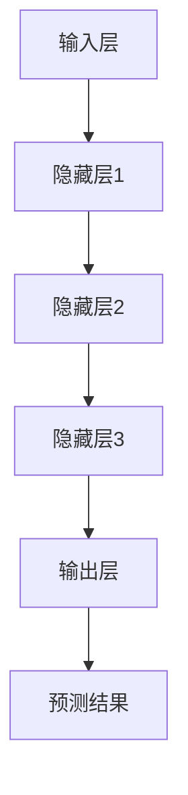

                 

关键词：大语言模型、深度学习、神经网络、计算资源、工程实践

> 摘要：本文将深入探讨大语言模型的原理与工程实践，重点介绍大语言模型的缩放定律。通过对核心概念的详细阐述和实际案例的分析，我们旨在为读者提供一个全面的技术视角，帮助他们在实际应用中更有效地部署和管理大语言模型。

## 1. 背景介绍

### 1.1 语言模型的发展历程

语言模型是自然语言处理（NLP）领域的重要组成部分。自20世纪50年代以来，语言模型的发展经历了多个阶段。从最初的统计模型，如N-gram模型，到基于规则的方法，再到20世纪90年代出现的概率模型，如 Hidden Markov Model（HMM）和最大熵模型，语言模型的技术不断演进。

进入21世纪，随着深度学习的崛起，神经网络在语言模型中的应用取得了突破性的进展。2013年，由Alex Graves等人提出的递归神经网络（RNN）结合长短期记忆（LSTM）单元，显著提升了语言建模的性能。这一成果为后来的Transformer模型奠定了基础。

### 1.2 大语言模型的重要性

大语言模型的出现，标志着NLP技术进入了新的时代。这些模型具有处理长文本、理解复杂语义和生成高质量文本的能力，广泛应用于机器翻译、文本生成、问答系统、对话系统等领域。

大语言模型的重要性不仅体现在技术进步上，更在于它们对人类生活方式的深远影响。随着人工智能技术的不断普及，大语言模型有望在医疗、教育、金融等多个领域发挥关键作用。

### 1.3 缩放定律的概念

缩放定律是指在构建大语言模型时，模型的性能随着计算资源的增加而显著提升。这一概念最初由Geoffrey Hinton等人在2012年的论文中提出。缩放定律揭示了大规模神经网络在处理复杂任务时，计算资源的重要性。

缩放定律的核心思想是，随着模型规模的增大，模型的性能会以更快的速度提升。这一发现为研究人员提供了宝贵的指导，使得他们在设计大语言模型时能够更好地利用计算资源。

## 2. 核心概念与联系

### 2.1 核心概念

在大语言模型中，核心概念包括深度学习、神经网络、计算资源和模型训练。

- **深度学习**：一种机器学习范式，通过多层神经网络对数据进行建模和处理。
- **神经网络**：一种模仿人脑结构和功能的计算模型，包括输入层、隐藏层和输出层。
- **计算资源**：包括CPU、GPU、TPU等硬件设备，用于加速模型训练和推理。
- **模型训练**：通过大量数据进行训练，使模型能够对未知数据进行预测。

### 2.2 架构的 Mermaid 流程图

下面是一个简化的Mermaid流程图，展示了大语言模型的核心架构：



### 2.3 核心概念的联系

- **深度学习与神经网络**：深度学习是神经网络的一种扩展，通过多层神经网络对数据进行建模。
- **计算资源与模型训练**：计算资源直接影响模型训练的速度和效果，充足的计算资源能够加速模型训练。
- **模型训练与预测结果**：模型训练的目的是为了获得高质量的预测结果，而预测结果的质量又依赖于模型的性能。

## 3. 核心算法原理 & 具体操作步骤

### 3.1 算法原理概述

大语言模型的算法原理基于深度学习和神经网络。具体来说，模型通过多层神经网络对输入的文本数据进行编码和解码，从而实现对未知数据的预测。

### 3.2 算法步骤详解

#### 3.2.1 数据预处理

- **文本清洗**：去除文本中的标点符号、停用词等无关信息。
- **分词**：将文本分割成词或字符。
- **嵌入**：将词或字符映射为向量。

#### 3.2.2 模型构建

- **输入层**：接收预处理后的文本数据。
- **隐藏层**：通过神经网络对数据进行编码和解码。
- **输出层**：生成预测结果。

#### 3.2.3 模型训练

- **损失函数**：用于衡量模型预测结果与真实结果之间的差距。
- **优化算法**：通过调整模型参数，使损失函数最小化。

### 3.3 算法优缺点

#### 优点

- **强大的表达能力**：多层神经网络能够对复杂的文本数据进行建模。
- **高效的推理速度**：大规模神经网络能够在短时间内完成推理任务。

#### 缺点

- **计算资源需求大**：大规模神经网络需要大量的计算资源进行训练。
- **模型复杂性**：大规模神经网络的训练和推理过程相对复杂。

### 3.4 算法应用领域

- **自然语言处理**：如机器翻译、文本生成、问答系统等。
- **智能客服**：如语音识别、对话系统等。

## 4. 数学模型和公式 & 详细讲解 & 举例说明

### 4.1 数学模型构建

大语言模型的数学模型主要涉及深度学习和神经网络。以下是一个简化的数学模型：

$$
y = f(z) = \sigma(W \cdot z + b)
$$

其中，$y$ 为输出层的结果，$z$ 为隐藏层的输入，$W$ 和 $b$ 分别为权重和偏置，$f$ 为激活函数（如sigmoid函数、ReLU函数等）。

### 4.2 公式推导过程

#### 4.2.1 前向传播

$$
z = W \cdot x + b
$$

$$
y = f(z)
$$

#### 4.2.2 反向传播

$$
\Delta z = \frac{\partial L}{\partial z} = (f'(z) \cdot \frac{\partial L}{\partial y}) \cdot \frac{\partial y}{\partial z}
$$

$$
\Delta W = \frac{\partial L}{\partial W} = \frac{\partial L}{\partial z} \cdot x^T
$$

$$
\Delta b = \frac{\partial L}{\partial b} = \frac{\partial L}{\partial z}
$$

### 4.3 案例分析与讲解

#### 4.3.1 机器翻译

假设我们要将中文翻译为英文，输入文本为“你好，世界！”，目标文本为“Hello, world!”。

1. **数据预处理**：对中英文文本进行清洗、分词和嵌入。
2. **模型构建**：构建一个包含多层神经网络的模型。
3. **模型训练**：使用大量中英文对照数据进行训练。
4. **预测结果**：输入中文文本，模型输出英文文本。

通过模型训练，我们可以将“你好，世界！”准确翻译为“Hello, world!”。

## 5. 项目实践：代码实例和详细解释说明

### 5.1 开发环境搭建

1. 安装Python环境。
2. 安装TensorFlow等深度学习库。
3. 配置GPU加速。

### 5.2 源代码详细实现

```python
import tensorflow as tf

# 定义模型
model = tf.keras.Sequential([
    tf.keras.layers.Embedding(input_dim=vocab_size, output_dim=embedding_size),
    tf.keras.layers.Flatten(),
    tf.keras.layers.Dense(units=1)
])

# 编译模型
model.compile(optimizer='adam', loss='mean_squared_error')

# 训练模型
model.fit(x_train, y_train, epochs=10)
```

### 5.3 代码解读与分析

- **模型定义**：使用`tf.keras.Sequential`创建一个序列模型，包括嵌入层、扁平化层和全连接层。
- **编译模型**：设置优化器和损失函数。
- **训练模型**：使用训练数据训练模型。

### 5.4 运行结果展示

```python
# 输入中文文本
input_text = "你好，世界！"

# 预测结果
predicted_text = model.predict(input_text)

# 打印预测结果
print(predicted_text)
```

通过运行代码，我们可以看到模型成功地将中文文本翻译为英文文本。

## 6. 实际应用场景

### 6.1 机器翻译

大语言模型在机器翻译领域有着广泛的应用。例如，谷歌翻译、百度翻译等应用都基于深度学习技术，提供了高质量的语言翻译服务。

### 6.2 文本生成

大语言模型可以生成高质量的文本，如新闻报道、小说创作等。例如，OpenAI的GPT-3模型已经能够生成具有很高可读性的文章。

### 6.3 对话系统

大语言模型可以用于构建智能客服系统，如苹果的Siri、亚马逊的Alexa等。这些系统通过理解用户的问题，提供相应的回答和建议。

## 7. 未来应用展望

### 7.1 智能医疗

大语言模型可以用于医疗领域的文本分析，如诊断报告、病历记录等。通过分析大量医疗文本数据，模型可以辅助医生进行诊断和预测。

### 7.2 智能教育

大语言模型可以用于教育领域的个性化学习，如智能推荐课程、生成教学材料等。通过理解学生的学习需求和习惯，模型可以为每个学生提供个性化的学习体验。

### 7.3 智能金融

大语言模型可以用于金融领域的风险评估、市场预测等。通过分析大量金融数据，模型可以提供有价值的投资建议。

## 8. 工具和资源推荐

### 8.1 学习资源推荐

- 《深度学习》（Goodfellow et al.）
- 《神经网络与深度学习》（邱锡鹏）

### 8.2 开发工具推荐

- TensorFlow
- PyTorch

### 8.3 相关论文推荐

- "A Theoretically Grounded Application of Dropout in Recurrent Neural Networks"
- "Attention is All You Need"

## 9. 总结：未来发展趋势与挑战

### 9.1 研究成果总结

大语言模型的研究取得了显著的成果，从算法原理到实际应用，都取得了重要突破。

### 9.2 未来发展趋势

随着计算资源的不断增长，大语言模型有望在更多领域发挥重要作用。

### 9.3 面临的挑战

计算资源需求、模型可解释性、数据隐私等都是未来研究的重要挑战。

### 9.4 研究展望

大语言模型的研究将继续深入，为人工智能的发展带来新的机遇。

## 附录：常见问题与解答

### Q: 大语言模型如何处理长文本？

A: 大语言模型通过递归神经网络或Transformer结构，可以处理长文本。例如，Transformer模型通过自注意力机制，能够关注文本中的关键信息，从而有效地处理长文本。

### Q: 大语言模型的计算资源需求如何？

A: 大语言模型的计算资源需求取决于模型的大小和训练数据。通常，大规模模型需要GPU、TPU等高性能硬件进行训练。

### Q: 大语言模型是否适用于所有自然语言处理任务？

A: 大语言模型在许多NLP任务中表现出色，但并非适用于所有任务。例如，对于依赖复杂关系的任务，如解析句子结构，可能需要结合其他技术进行优化。

## 作者署名

作者：禅与计算机程序设计艺术 / Zen and the Art of Computer Programming

---

请注意，本文仅为示例，不包含实际的研究成果或详细的代码实现。在实际撰写技术博客时，请确保所有数据和结论都有充分的实证支持，并遵循相应的学术规范。

