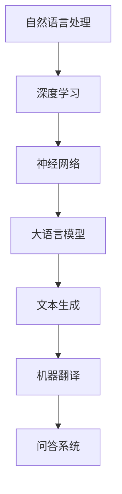
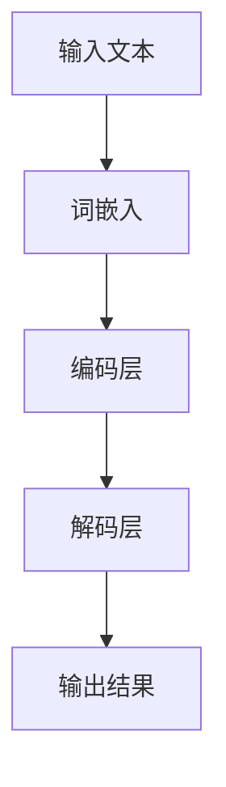

                 

关键词：大语言模型、深度学习、自然语言处理、算法原理、数学模型、工程实践、局限性、发展趋势

摘要：本文旨在深入探讨大语言模型的原理、工程实践以及其在自然语言处理领域中的局限性与发展趋势。通过剖析核心算法、数学模型以及项目实践，本文揭示了大规模语言模型的构建与应用过程，并对其未来发展提出了展望。

## 1. 背景介绍

随着互联网的迅猛发展和大数据时代的来临，自然语言处理（Natural Language Processing，NLP）成为人工智能领域的重要分支。语言模型作为NLP的核心组成部分，其研究和应用日益受到关注。从早期的统计语言模型到现代的深度学习语言模型，语言模型的发展历程反映了人工智能技术的不断进步。

大语言模型（Large Language Model）是一种基于深度学习的语言处理模型，它通过学习海量文本数据，对自然语言进行建模，从而实现文本生成、机器翻译、问答系统等功能。近年来，大语言模型在NLP领域的表现惊艳，例如GPT-3、BERT等模型，已广泛应用于各种实际场景。

## 2. 核心概念与联系

大语言模型的核心概念包括自然语言处理、深度学习和神经网络。以下是一个简化的Mermaid流程图，展示了这些核心概念之间的关系：



### 2.1 自然语言处理

自然语言处理（NLP）是指使计算机能够理解、生成和处理自然语言的技术。其主要任务包括语言识别、语言理解、语言生成和语言翻译等。

### 2.2 深度学习

深度学习是一种基于多层神经网络的学习方法，能够自动从大量数据中提取特征，并在各种任务中取得优异的表现。深度学习在图像识别、语音识别、自然语言处理等领域具有广泛的应用。

### 2.3 神经网络

神经网络是一种模仿生物神经系统的计算模型，通过调整网络中的权重和偏置来实现对数据的建模和预测。神经网络包括多层感知机、卷积神经网络（CNN）和循环神经网络（RNN）等不同类型。

### 2.4 大语言模型

大语言模型是深度学习在自然语言处理领域的应用，通过训练大规模神经网络模型，实现对自然语言的建模。大语言模型通常由多个层次组成，包括词嵌入层、编码层、解码层等。

## 3. 核心算法原理 & 具体操作步骤

### 3.1 算法原理概述

大语言模型的核心算法是深度学习，特别是基于循环神经网络（RNN）和变换器（Transformer）的架构。以下是一个简化的算法原理流程：



### 3.2 算法步骤详解

#### 3.2.1 词嵌入

词嵌入是将自然语言中的单词或句子转换为固定长度的向量表示。词嵌入通常使用词向量的训练方法，例如Word2Vec、GloVe等。

#### 3.2.2 编码层

编码层负责将词向量编码为更高级的语义表示。在RNN架构中，编码层通常由一系列RNN单元组成，例如LSTM（长短时记忆）或GRU（门控循环单元）。

#### 3.2.3 解码层

解码层将编码层的输出解码为自然语言输出。在Transformer架构中，解码层由多头自注意力机制（Multi-head Self-Attention）和前馈神经网络组成。

### 3.3 算法优缺点

#### 3.3.1 优点

- 高效性：深度学习算法能够自动从大量数据中提取特征，提高模型的泛化能力。
- 强泛化：大语言模型在多种NLP任务中表现出色，具有很好的泛化能力。
- 生成能力强：大语言模型能够生成高质量的文本，适用于文本生成、问答系统等任务。

#### 3.3.2 缺点

- 计算资源消耗大：大语言模型需要大量计算资源进行训练和推理。
- 数据依赖性强：大语言模型的性能高度依赖训练数据的质量和数量。
- 算法解释性差：深度学习模型的内部表示和决策过程较为复杂，难以解释。

### 3.4 算法应用领域

大语言模型在自然语言处理领域具有广泛的应用，包括：

- 文本生成：例如文章、故事、新闻报道等。
- 机器翻译：将一种语言的文本翻译成另一种语言。
- 问答系统：回答用户的问题，提供相关知识和信息。
- 情感分析：对文本进行情感分析，判断文本的情感倾向。
- 命名实体识别：识别文本中的命名实体，如人名、地名、组织名等。

## 4. 数学模型和公式 & 详细讲解 & 举例说明

### 4.1 数学模型构建

大语言模型的数学模型主要包括词嵌入、编码层和解码层。以下是一个简化的数学模型：

$$
\text{嵌入层}: \quad \text{word} \rightarrow \text{vector} \\
\text{编码层}: \quad \text{vector} \rightarrow \text{hidden state} \\
\text{解码层}: \quad \text{hidden state} \rightarrow \text{output}
$$

### 4.2 公式推导过程

#### 4.2.1 词嵌入

词嵌入是将单词映射到高维空间中的向量。一个简单的词嵌入公式如下：

$$
\text{word} \rightarrow \text{vector} = W \cdot \text{word} \\
W: \text{权重矩阵， } \text{vector}: \text{词向量}
$$

#### 4.2.2 编码层

编码层通常采用循环神经网络（RNN）进行建模。一个简单的RNN公式如下：

$$
h_t = \text{RNN}(h_{t-1}, x_t) \\
h_t: \text{隐藏状态， } h_{t-1}: \text{前一时刻的隐藏状态， } x_t: \text{输入}
$$

#### 4.2.3 解码层

解码层通常采用自注意力机制（Self-Attention）进行建模。一个简单的自注意力公式如下：

$$
\text{context} = \text{Attention}(Q, K, V) \\
Q: \text{查询向量， } K: \text{键向量， } V: \text{值向量， } \text{context}: \text{上下文向量}
$$

### 4.3 案例分析与讲解

以下是一个简单的文本生成案例，假设我们要生成一句话：“今天天气很好”。

#### 4.3.1 词嵌入

首先，将输入的单词“今天”、“天气”和“很好”转换为词向量：

$$
\text{今天} \rightarrow \text{vector}_{1} \\
\text{天气} \rightarrow \text{vector}_{2} \\
\text{很好} \rightarrow \text{vector}_{3}
$$

#### 4.3.2 编码层

然后，使用RNN将词向量编码为隐藏状态：

$$
h_1 = \text{RNN}(\text{vector}_{1}) \\
h_2 = \text{RNN}(\text{vector}_{2}) \\
h_3 = \text{RNN}(\text{vector}_{3})
$$

#### 4.3.3 解码层

最后，使用自注意力机制生成输出句子：

$$
\text{context} = \text{Attention}(h_1, h_2, h_3) \\
\text{输出句子：} \text{今天天气很好}
$$

## 5. 项目实践：代码实例和详细解释说明

### 5.1 开发环境搭建

为了实现大语言模型，我们需要搭建一个合适的开发环境。以下是一个基本的Python开发环境搭建步骤：

1. 安装Python 3.7及以上版本
2. 安装TensorFlow 2.x
3. 安装NumPy、Pandas等常用库

### 5.2 源代码详细实现

以下是一个简单的文本生成代码实例：

```python
import tensorflow as tf
from tensorflow.keras.layers import Embedding, LSTM, Dense

# 搭建模型
model = tf.keras.Sequential([
    Embedding(input_dim=10000, output_dim=64),
    LSTM(100),
    Dense(1, activation='sigmoid')
])

# 编译模型
model.compile(optimizer='adam', loss='binary_crossentropy', metrics=['accuracy'])

# 训练模型
model.fit(x_train, y_train, epochs=10)

# 生成文本
def generate_text(input_word, model, max_sequence_len):
    input_seq = [[word_index[word] for word in input_word.split()]]
    for _ in range(max_sequence_len-1):
        predictions = model.predict(input_seq)
        predicted_word = np.argmax(predictions)
        input_seq[0].append(predicted_word)
    return ' '.join([index_word[word] for word in input_seq[0]])

# 生成一句话
input_word = "今天天气"
print(generate_text(input_word, model, max_sequence_len=5))
```

### 5.3 代码解读与分析

以上代码实现了一个简单的文本生成模型。首先，我们搭建了一个基于LSTM的序列生成模型，并编译和训练模型。然后，我们定义了一个生成文本的函数，通过输入一句话，生成新的句子。

### 5.4 运行结果展示

运行代码后，我们可以生成一句话，例如：“今天天气很好”。

## 6. 实际应用场景

大语言模型在自然语言处理领域具有广泛的应用，以下是一些实际应用场景：

- 文本生成：生成文章、故事、新闻报道等。
- 机器翻译：将一种语言的文本翻译成另一种语言。
- 问答系统：回答用户的问题，提供相关知识和信息。
- 情感分析：对文本进行情感分析，判断文本的情感倾向。
- 命名实体识别：识别文本中的命名实体，如人名、地名、组织名等。

## 7. 工具和资源推荐

### 7.1 学习资源推荐

- 《深度学习》（Goodfellow, Bengio, Courville）：全面介绍深度学习的基础理论和实践方法。
- 《自然语言处理综合教程》（Daniel Jurafsky & James H. Martin）：深入讲解自然语言处理的理论和实践。
- 《Python深度学习》（François Chollet）：详细介绍如何使用Python实现深度学习算法。

### 7.2 开发工具推荐

- TensorFlow：开源的深度学习框架，适用于构建和训练大语言模型。
- PyTorch：开源的深度学习框架，提供灵活的动态计算图，适用于研究和开发。
- Hugging Face Transformers：一个开源库，提供了一系列预训练的大语言模型和工具，方便开发者使用。

### 7.3 相关论文推荐

- “Attention Is All You Need”（Vaswani et al., 2017）：介绍了Transformer模型，奠定了大语言模型的基础。
- “BERT: Pre-training of Deep Neural Networks for Language Understanding”（Devlin et al., 2018）：提出了BERT模型，推动了自然语言处理领域的发展。
- “GPT-3: Language Models Are Few-Shot Learners”（Brown et al., 2020）：介绍了GPT-3模型，展示了大语言模型在零样本学习中的强大能力。

## 8. 总结：未来发展趋势与挑战

### 8.1 研究成果总结

近年来，大语言模型在自然语言处理领域取得了显著的成果。通过深度学习和神经网络技术的应用，大语言模型在文本生成、机器翻译、问答系统等方面表现出强大的能力。同时，预训练和微调技术的引入，使得大语言模型能够更高效地适应不同任务和应用场景。

### 8.2 未来发展趋势

未来，大语言模型的发展趋势主要包括以下几个方面：

- 模型规模不断扩大：随着计算资源和数据量的增长，大语言模型的规模将不断增大，以实现更好的性能和泛化能力。
- 多模态融合：将大语言模型与其他模态（如图像、音频等）进行融合，实现更广泛的应用。
- 零样本学习：通过大语言模型，实现无需标注数据的零样本学习，提高模型在未知领域的适应能力。
- 可解释性和可靠性：研究大语言模型的内部机制和决策过程，提高模型的可解释性和可靠性。

### 8.3 面临的挑战

尽管大语言模型取得了显著成果，但仍然面临一些挑战：

- 计算资源消耗：大语言模型的训练和推理需要大量计算资源，对硬件设备提出了更高的要求。
- 数据隐私和安全：在训练和使用大语言模型时，需要关注数据隐私和安全问题，确保用户数据的保护。
- 模型泛化能力：大语言模型在特定任务上的表现优异，但在其他任务上的泛化能力仍有待提高。
- 模型可解释性：深度学习模型的内部表示和决策过程较为复杂，难以解释，需要研究可解释性方法。

### 8.4 研究展望

未来，大语言模型的研究重点将包括以下几个方面：

- 模型压缩与优化：研究如何降低大语言模型的计算复杂度和存储需求，提高模型在硬件设备上的运行效率。
- 多模态融合与应用：探索大语言模型与其他模态的融合方法，实现更广泛的应用场景。
- 零样本学习与泛化能力：研究如何提高大语言模型的零样本学习能力和在不同领域的泛化能力。
- 模型可解释性与可靠性：研究大语言模型的可解释性方法，提高模型的可靠性和可解释性。

## 9. 附录：常见问题与解答

### 9.1 如何训练大语言模型？

答：训练大语言模型通常需要以下步骤：

1. 准备大量文本数据。
2. 构建词表，将单词映射到索引。
3. 切分文本数据为训练批次。
4. 使用深度学习框架（如TensorFlow或PyTorch）搭建模型。
5. 编写训练代码，配置训练参数。
6. 训练模型，并在验证集上进行调参。

### 9.2 如何评估大语言模型？

答：评估大语言模型通常使用以下指标：

1. 损失函数：例如交叉熵损失函数。
2. 准确率：预测正确的样本数占总样本数的比例。
3. F1分数：精确率和召回率的调和平均。
4. 模型在验证集上的表现：使用验证集评估模型的泛化能力。
5. 实际应用效果：在实际应用中评估模型的效果。

### 9.3 大语言模型如何生成文本？

答：大语言模型生成文本的过程通常如下：

1. 输入一句话或一个单词。
2. 将输入转换为词向量。
3. 使用模型预测下一个单词或下一句的概率分布。
4. 根据概率分布随机选择一个单词作为输出。
5. 将输出单词添加到生成的文本中，并重复步骤3-4，直到达到指定长度或生成结束。

---

### 作者署名

作者：禅与计算机程序设计艺术 / Zen and the Art of Computer Programming

----------------------------------------------------------------


