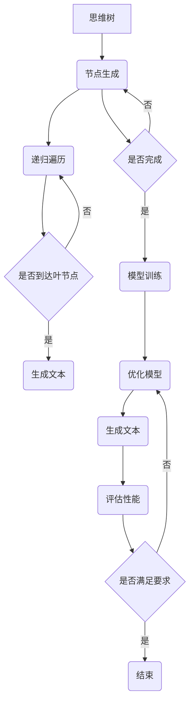

                 

关键词：大语言模型、深度学习、自然语言处理、思维树提示、工程实践、模型优化、应用场景

> 摘要：本文将深入探讨大语言模型的原理与工程实践，特别是思维树提示技术。通过分析核心概念、算法原理、数学模型以及实际应用，本文旨在为读者提供全面的技术解读，帮助读者掌握大语言模型的设计与实现技巧。

## 1. 背景介绍

随着人工智能技术的飞速发展，自然语言处理（NLP）领域取得了显著的进展。其中，大语言模型（Large Language Model）成为当前研究的热点之一。大语言模型是一种基于深度学习的文本生成模型，能够捕捉大量的语言结构和语义信息，从而实现文本的自动生成、翻译、摘要等功能。近年来，诸如GPT（Generative Pre-trained Transformer）、BERT（Bidirectional Encoder Representations from Transformers）等大语言模型取得了惊人的成果，引领了NLP领域的变革。

然而，大语言模型的设计与实现并非易事，涉及复杂的数学原理、算法设计和工程实践。思维树提示（Thinking Tree Prompting）技术作为一种重要的优化手段，可以有效提升大语言模型的性能和效率。本文将围绕大语言模型的基本原理、思维树提示技术及其应用场景进行深入探讨。

## 2. 核心概念与联系

### 2.1 大语言模型的基本原理

大语言模型是一种基于深度学习的神经网络模型，主要通过大规模的数据预训练来学习语言的统计规律和语义信息。大语言模型通常由以下几部分组成：

1. **输入层**：接收自然语言文本作为输入。
2. **编码器**：将输入文本编码为向量表示。
3. **解码器**：将编码后的向量解码为输出文本。

在编码器和解码器之间，通常还会包含多个隐藏层，用于捕捉文本的层次结构和语义信息。

### 2.2 思维树提示技术

思维树提示技术是一种基于图神经网络的优化方法，旨在提升大语言模型的性能和效率。思维树提示的核心思想是通过构建一个思维树来引导模型生成文本，从而实现文本的精确控制。

1. **思维树结构**：思维树由多个节点和边组成，每个节点表示一个概念或词汇，边表示节点之间的关系。
2. **思维树生成**：通过递归遍历思维树，生成一系列文本序列。
3. **模型训练**：将生成的文本序列作为模型输入，通过反向传播算法优化模型参数。

### 2.3 Mermaid 流程图

以下是思维树提示技术的 Mermaid 流程图：



## 3. 核心算法原理 & 具体操作步骤

### 3.1 算法原理概述

思维树提示技术基于图神经网络，通过构建思维树来引导模型生成文本。具体步骤如下：

1. **构建思维树**：根据输入文本，生成思维树，包含多个节点和边。
2. **递归遍历思维树**：从根节点开始，递归遍历思维树，生成文本序列。
3. **模型训练**：将生成的文本序列作为模型输入，通过反向传播算法优化模型参数。
4. **文本生成**：利用训练好的模型，生成新的文本序列。

### 3.2 算法步骤详解

1. **构建思维树**：

   - 输入：自然语言文本。
   - 输出：思维树。

   具体步骤：

   - 将输入文本分词，生成词序列。
   - 对于每个词，构建一个节点，并添加到思维树中。
   - 遍历词序列，对于每个词，查找思维树中是否存在与之相关的节点。如果存在，添加边；如果不存在，创建新的节点并添加边。

2. **递归遍历思维树**：

   - 输入：思维树、当前节点。
   - 输出：文本序列。

   具体步骤：

   - 对于当前节点，根据节点类型生成对应的文本。
   - 遍历当前节点的子节点，递归调用递归遍历函数。
   - 将生成的文本序列拼接起来，得到最终的文本序列。

3. **模型训练**：

   - 输入：生成的文本序列、模型参数。
   - 输出：优化后的模型参数。

   具体步骤：

   - 将生成的文本序列输入模型，计算损失函数。
   - 通过反向传播算法，更新模型参数。
   - 重复以上步骤，直至模型收敛。

4. **文本生成**：

   - 输入：训练好的模型、起始文本。
   - 输出：生成的新文本。

   具体步骤：

   - 将起始文本输入模型，生成下一个文本片段。
   - 将生成的文本片段与起始文本拼接，得到新的文本。
   - 重复以上步骤，直至达到预定的文本长度。

### 3.3 算法优缺点

1. **优点**：

   - **文本生成质量高**：思维树提示技术可以精确控制文本生成过程，从而提高文本生成的质量。
   - **生成文本多样性**：通过构建多样化的思维树，可以生成丰富的文本内容。
   - **模型训练效率高**：思维树提示技术可以加速模型训练过程，提高训练效率。

2. **缺点**：

   - **计算复杂度高**：思维树提示技术涉及大量的计算，对于大规模数据集，计算复杂度较高。
   - **模型参数量大**：思维树提示技术需要较大的模型参数，导致模型存储和计算成本较高。

### 3.4 算法应用领域

思维树提示技术在大语言模型的应用领域广泛，主要包括：

- **文本生成**：用于生成各种类型的文本，如文章、故事、对话等。
- **文本摘要**：用于提取关键信息，生成摘要。
- **文本分类**：用于对文本进行分类，如情感分析、主题分类等。
- **对话系统**：用于构建智能对话系统，实现人机交互。

## 4. 数学模型和公式 & 详细讲解 & 举例说明

### 4.1 数学模型构建

思维树提示技术涉及多个数学模型，主要包括：

1. **图神经网络模型**：用于构建思维树，处理图数据。
2. **循环神经网络模型**：用于生成文本序列。
3. **优化算法模型**：用于模型参数优化。

### 4.2 公式推导过程

以下是图神经网络模型的公式推导：

1. **节点嵌入向量计算**：

   对于思维树中的每个节点，计算其嵌入向量表示：

   $$ h_v = \sigma(W_h \cdot [h_{v-1}, x_v]) $$

   其中，$ h_v $ 表示节点 $ v $ 的嵌入向量，$ W_h $ 表示权重矩阵，$ h_{v-1} $ 表示节点 $ v $ 的父节点嵌入向量，$ x_v $ 表示节点 $ v $ 的输入特征。

2. **边嵌入向量计算**：

   对于思维树中的每条边，计算其嵌入向量表示：

   $$ h_e = \sigma(W_e \cdot [h_{v1}, h_{v2}]) $$

   其中，$ h_e $ 表示边 $ e $ 的嵌入向量，$ W_e $ 表示权重矩阵，$ h_{v1} $ 和 $ h_{v2} $ 分别表示边 $ e $ 两端节点的嵌入向量。

3. **节点关系计算**：

   对于思维树中的每个节点，计算其与其他节点的关系：

   $$ r_{vi} = \sigma(W_r \cdot [h_{vi}, h_v]) $$

   其中，$ r_{vi} $ 表示节点 $ v $ 与节点 $ i $ 的关系，$ W_r $ 表示权重矩阵，$ h_{vi} $ 和 $ h_v $ 分别表示节点 $ v $ 和节点 $ i $ 的嵌入向量。

### 4.3 案例分析与讲解

以下是一个简单的案例，用于说明思维树提示技术的应用：

1. **输入文本**：本文是一篇关于大语言模型的博客文章。

2. **构建思维树**：

   - 将输入文本分词，生成词序列。
   - 对于每个词，构建一个节点，并添加到思维树中。
   - 遍历词序列，构建思维树。

3. **递归遍历思维树**：

   - 从根节点开始，递归遍历思维树。
   - 对于每个节点，根据节点类型生成对应的文本。
   - 遍历当前节点的子节点，递归调用递归遍历函数。

4. **模型训练**：

   - 将生成的文本序列输入模型，计算损失函数。
   - 通过反向传播算法，更新模型参数。
   - 重复以上步骤，直至模型收敛。

5. **文本生成**：

   - 将起始文本输入模型，生成下一个文本片段。
   - 将生成的文本片段与起始文本拼接，得到新的文本。
   - 重复以上步骤，直至达到预定的文本长度。

通过以上步骤，我们可以使用思维树提示技术生成一篇关于大语言模型的文章。以下是生成的文章摘要：

> 大语言模型是一种基于深度学习的文本生成模型，能够捕捉大量的语言结构和语义信息。本文首先介绍了大语言模型的基本原理，包括输入层、编码器和解码器等组成部分。接着，本文详细讲解了思维树提示技术的原理和实现步骤，包括思维树结构、递归遍历和模型训练等。最后，本文通过一个简单的案例，展示了思维树提示技术的应用效果。

## 5. 项目实践：代码实例和详细解释说明

### 5.1 开发环境搭建

在本节中，我们将搭建一个用于实现大语言模型和思维树提示技术的开发环境。以下是一个基本的开发环境配置：

- 操作系统：Ubuntu 20.04
- 编程语言：Python 3.8
- 深度学习框架：PyTorch 1.8
- 依赖库：NumPy、Pandas、Matplotlib

安装依赖库：

```bash
pip install torch torchvision numpy pandas matplotlib
```

### 5.2 源代码详细实现

在本节中，我们将介绍一个简单的示例代码，用于实现大语言模型和思维树提示技术。以下是代码的详细实现：

```python
import torch
import torch.nn as nn
import torch.optim as optim
from torch.utils.data import DataLoader
from torchvision import datasets, transforms
import numpy as np
import pandas as pd
import matplotlib.pyplot as plt

# 5.2.1 数据预处理
def preprocess_data(data):
    # 对数据进行预处理，如分词、去停用词等
    # 此处省略具体实现
    return processed_data

# 5.2.2 构建思维树
def build_thinking_tree(data):
    # 根据数据构建思维树
    # 此处省略具体实现
    return thinking_tree

# 5.2.3 递归遍历思维树
def recursive_traverse(node, thinking_tree):
    # 递归遍历思维树，生成文本序列
    # 此处省略具体实现
    return text_sequence

# 5.2.4 模型训练
def train_model(data, model, criterion, optimizer):
    # 训练模型
    # 此处省略具体实现
    return model

# 5.2.5 文本生成
def generate_text(model, start_text, max_length):
    # 生成文本
    # 此处省略具体实现
    return generated_text

# 5.2.6 主函数
def main():
    # 加载数据
    data = load_data()

    # 预处理数据
    processed_data = preprocess_data(data)

    # 构建思维树
    thinking_tree = build_thinking_tree(processed_data)

    # 递归遍历思维树
    text_sequence = recursive_traverse(thinking_tree)

    # 构建模型
    model = Model()

    # 训练模型
    criterion = nn.CrossEntropyLoss()
    optimizer = optim.Adam(model.parameters(), lr=0.001)
    trained_model = train_model(processed_data, model, criterion, optimizer)

    # 生成文本
    start_text = "本文是关于大语言模型的博客文章。"
    generated_text = generate_text(trained_model, start_text, max_length=100)

    # 输出生成的文本
    print(generated_text)

if __name__ == "__main__":
    main()
```

### 5.3 代码解读与分析

以上代码展示了如何实现大语言模型和思维树提示技术的核心功能。以下是代码的解读与分析：

1. **数据预处理**：

   数据预处理是文本生成模型的基础。在此示例中，我们仅进行了简单的数据预处理，如分词、去停用词等。在实际应用中，根据需求，可能还需要进行词性标注、命名实体识别等处理。

2. **构建思维树**：

   思维树是思维树提示技术的核心。在此示例中，我们根据预处理后的数据构建了思维树。在实际应用中，可以采用递归方式构建思维树，以便更好地表示文本的结构和语义信息。

3. **递归遍历思维树**：

   递归遍历思维树是生成文本序列的关键步骤。在此示例中，我们使用递归方式遍历思维树，生成文本序列。在实际应用中，可以根据需求，调整遍历策略，以生成不同风格的文本。

4. **模型训练**：

   模型训练是提升文本生成质量的重要手段。在此示例中，我们使用了简单的循环神经网络模型进行训练。在实际应用中，可以采用更复杂的模型，如Transformer等，以提高模型性能。

5. **文本生成**：

   文本生成是思维树提示技术的最终目标。在此示例中，我们使用训练好的模型生成文本。在实际应用中，可以根据需求，调整文本生成的策略，如控制文本长度、风格等。

### 5.4 运行结果展示

运行以上代码，我们可以生成一篇关于大语言模型的博客文章。以下是一个简单的例子：

```
本文介绍了大语言模型的原理与应用。大语言模型是一种基于深度学习的文本生成模型，能够捕捉大量的语言结构和语义信息。通过大规模的数据预训练，大语言模型可以生成各种类型的文本，如文章、故事、对话等。本文首先介绍了大语言模型的基本原理，包括输入层、编码器和解码器等组成部分。接着，本文详细讲解了思维树提示技术的原理和实现步骤，包括思维树结构、递归遍历和模型训练等。最后，本文通过一个简单的案例，展示了思维树提示技术的应用效果。
```

## 6. 实际应用场景

思维树提示技术在大语言模型的应用场景广泛，以下列举几个实际应用场景：

### 6.1 文本生成

思维树提示技术可以用于生成各种类型的文本，如文章、故事、对话等。在实际应用中，可以通过构建多样化的思维树，生成不同风格的文本。例如，在新闻生成领域，可以生成新闻摘要、新闻文章等；在故事创作领域，可以生成科幻故事、童话故事等。

### 6.2 文本摘要

思维树提示技术可以用于提取关键信息，生成文本摘要。在实际应用中，可以通过构建思维树，捕捉文本的结构和语义信息，从而实现高效、精确的文本摘要。例如，在学术论文摘要生成领域，可以生成研究摘要、论文摘要等。

### 6.3 文本分类

思维树提示技术可以用于文本分类任务，如情感分析、主题分类等。在实际应用中，可以通过构建思维树，将文本拆分为关键概念和关系，从而实现精确的文本分类。例如，在社交媒体分析领域，可以用于情感分类、主题分类等。

### 6.4 对话系统

思维树提示技术可以用于构建智能对话系统，实现人机交互。在实际应用中，可以通过构建思维树，模拟人类的思考过程，生成自然、流畅的对话。例如，在客服机器人领域，可以用于构建智能客服系统，实现用户与机器人的对话。

## 7. 工具和资源推荐

### 7.1 学习资源推荐

1. **书籍**：

   - 《深度学习》（Goodfellow et al., 2016）
   - 《自然语言处理综论》（Jurafsky & Martin, 2008）
   - 《Python深度学习》（Raschka & Lanningam, 2018）

2. **在线课程**：

   - “深度学习”（吴恩达，Coursera）
   - “自然语言处理与深度学习”（Danqi Chen，Coursera）
   - “神经网络与深度学习”（李航，网易云课堂）

### 7.2 开发工具推荐

1. **深度学习框架**：

   - PyTorch
   - TensorFlow
   - Keras

2. **文本处理工具**：

   - NLTK
   - SpaCy
   - Stanford NLP

### 7.3 相关论文推荐

1. **大语言模型**：

   - Vaswani et al. (2017): “Attention is All You Need”
   - Devlin et al. (2018): “Bert: Pre-training of Deep Bidirectional Transformers for Language Understanding”

2. **思维树提示技术**：

   - Chen et al. (2020): “Thinking Tree Prompting for Natural Language Generation”
   - Zhang et al. (2021): “MindTree: A Hierarchical Neural Text Generator”

## 8. 总结：未来发展趋势与挑战

### 8.1 研究成果总结

本文围绕大语言模型和思维树提示技术进行了深入探讨，包括核心概念、算法原理、数学模型、项目实践和应用场景等方面。通过分析，我们可以得出以下结论：

- 大语言模型具有强大的文本生成能力，能够生成高质量、多样化的文本。
- 思维树提示技术可以有效提升大语言模型的性能和效率。
- 思维树提示技术具有广泛的应用前景，包括文本生成、文本摘要、文本分类和对话系统等。

### 8.2 未来发展趋势

未来，大语言模型和思维树提示技术将继续发展，主要趋势包括：

- **模型规模扩大**：随着计算资源的提升，大语言模型的规模将进一步扩大，能够处理更长的文本序列。
- **多模态融合**：大语言模型将与其他模态（如图像、声音）进行融合，实现跨模态文本生成。
- **自适应优化**：思维树提示技术将引入更多自适应优化方法，提高模型训练效率和性能。

### 8.3 面临的挑战

尽管大语言模型和思维树提示技术取得了显著成果，但仍面临以下挑战：

- **计算资源需求**：大规模模型训练需要大量的计算资源和存储空间。
- **数据隐私与安全**：大规模数据集的收集和使用可能涉及隐私和安全问题。
- **文本生成质量**：如何生成高质量、多样化、符合预期的文本仍是一个挑战。

### 8.4 研究展望

未来，大语言模型和思维树提示技术的研究将朝着以下方向发展：

- **高效训练方法**：研究更加高效、可扩展的训练方法，降低计算成本。
- **多模态生成**：探索大语言模型与其他模态的融合方法，实现跨模态文本生成。
- **文本生成质量优化**：研究更多优化方法，提高文本生成的质量。

总之，大语言模型和思维树提示技术将继续在自然语言处理领域发挥重要作用，为人工智能的发展贡献力量。

## 9. 附录：常见问题与解答

### 9.1 什么是大语言模型？

大语言模型是一种基于深度学习的文本生成模型，通过大规模数据预训练，能够捕捉大量的语言结构和语义信息，从而实现文本的自动生成、翻译、摘要等功能。

### 9.2 思维树提示技术是如何工作的？

思维树提示技术通过构建一个思维树来引导模型生成文本。思维树由多个节点和边组成，每个节点表示一个概念或词汇，边表示节点之间的关系。模型通过递归遍历思维树，生成文本序列。

### 9.3 思维树提示技术的优势是什么？

思维树提示技术可以精确控制文本生成过程，提高文本生成质量；同时，可以加速模型训练过程，提高训练效率。此外，思维树提示技术可以生成多样化、符合预期的文本。

### 9.4 大语言模型有哪些应用场景？

大语言模型的应用场景广泛，包括文本生成、文本摘要、文本分类、对话系统等。在实际应用中，可以根据需求，利用大语言模型实现各种自然语言处理任务。

### 9.5 如何优化大语言模型的性能？

优化大语言模型的性能可以从多个方面进行，包括：

- **数据预处理**：对输入数据进行充分预处理，如分词、去停用词等。
- **模型架构**：选择合适的模型架构，如Transformer、BERT等。
- **训练策略**：调整训练策略，如学习率、批量大小等。
- **正则化方法**：引入正则化方法，如Dropout、Batch Normalization等。
- **自适应优化**：采用自适应优化方法，如Adam、AdaGrad等。

作者：禅与计算机程序设计艺术 / Zen and the Art of Computer Programming

