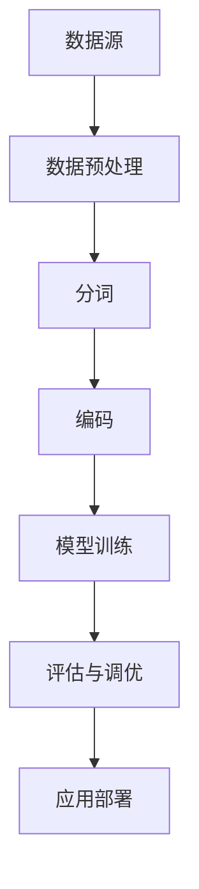

                 

关键词：大语言模型、7B 模型、语料预处理、自然语言处理、深度学习、神经网络、TensorFlow、PyTorch

摘要：本文将深入探讨大语言模型的原理及其在自然语言处理中的应用，特别关注于如何高效地预处理语料，以训练出高质量的大规模语言模型。我们将通过理论与实践相结合的方式，详细讲解从零开始搭建一个 7B 大规模语言模型的全过程，包括所需的技术栈、关键步骤以及优化技巧。

## 1. 背景介绍

随着互联网和大数据的发展，自然语言处理（NLP）在人工智能领域变得越来越重要。传统的 NLP 系统依赖于手工设计的特征和规则，而现代的深度学习技术，特别是基于神经网络的模型，极大地提升了 NLP 的效率和准确度。其中，大语言模型（如 GPT-3、Turing-NLG 等）已经成为 NLP 领域的研究热点和应用趋势。

大语言模型具有以下几个显著特点：

1. **参数规模庞大**：7B、10B、甚至 100B 的参数规模，使得模型能够学习到更复杂的语言模式。
2. **上下文理解能力**：通过长距离的上下文理解，模型能够生成更自然、更连贯的语言。
3. **多样化应用场景**：从文本生成、机器翻译、问答系统到对话系统，大语言模型展示出强大的泛化能力和适应性。

然而，训练如此大规模的语言模型面临诸多挑战，特别是数据预处理和计算资源的问题。因此，如何高效地进行语料预处理，以最大化模型性能和减少计算成本，成为关键任务。

本文的目标是，通过手把手的教学方式，详细讲解如何从零开始训练一个 7B 大语言模型，包括：

1. **技术栈选择**：介绍训练大语言模型所需的主要技术栈，如深度学习框架、编程语言等。
2. **数据预处理**：详细讲解语料预处理的关键步骤，包括数据清洗、分词、去重等。
3. **模型架构**：分析大语言模型的基本架构和关键技术。
4. **训练技巧**：介绍训练过程中的优化策略和技巧，以提高模型性能。
5. **实践示例**：通过实际代码示例，展示训练 7B 大语言模型的全过程。

## 2. 核心概念与联系

在深入探讨大语言模型的训练过程之前，我们需要了解一些核心概念，并展示它们之间的联系。以下是一个简化的 Mermaid 流程图，描述了这些核心概念：



### 2.1 数据源

数据源是训练大语言模型的基础，它可以是各种文本数据，如新闻文章、社交媒体帖子、书籍等。这些数据需要经过预处理，以便用于模型训练。

### 2.2 数据预处理

数据预处理是关键步骤，它包括数据清洗、去重、格式化等。预处理后的数据将被用于分词和编码。

### 2.3 分词

分词是将文本分解为单词或短语的步骤。对于中文文本，分词尤为重要，因为它涉及到词义理解和上下文信息的获取。

### 2.4 编码

编码是将分词后的文本转换为模型可接受的数字表示。常见的编码方法包括词嵌入和序列编码。

### 2.5 模型训练

模型训练是使用预处理后的数据，通过优化算法，调整模型参数的过程。深度学习框架如 TensorFlow 和 PyTorch 是常用的训练工具。

### 2.6 评估与调优

在模型训练过程中，我们需要对模型进行评估，以确定其性能。评估指标包括准确度、召回率、F1 分数等。根据评估结果，我们可以进一步调优模型。

### 2.7 应用部署

训练好的模型可以被部署到实际应用中，如聊天机器人、智能客服等。

## 3. 核心算法原理 & 具体操作步骤

### 3.1 算法原理概述

大语言模型的核心算法是基于深度学习的，特别是基于 Transformer 架构。Transformer 模型通过自注意力机制（Self-Attention Mechanism）和多头注意力（Multi-Head Attention）来捕捉长距离的上下文信息。

在具体操作步骤上，我们分为以下几个关键环节：

1. **数据预处理**：包括数据清洗、去重、分词和编码。
2. **模型搭建**：使用深度学习框架搭建基于 Transformer 的语言模型。
3. **模型训练**：通过优化算法训练模型，调整模型参数。
4. **评估与调优**：评估模型性能，根据评估结果进行调优。
5. **应用部署**：将训练好的模型部署到实际应用中。

### 3.2 算法步骤详解

#### 3.2.1 数据预处理

数据预处理包括以下几个步骤：

1. **数据清洗**：去除文本中的 HTML 标签、特殊字符和噪声。
2. **去重**：去除重复的文本数据，以减少数据冗余。
3. **分词**：将文本分解为单词或短语。对于中文文本，可以使用分词工具如 Jieba。
4. **编码**：将分词后的文本转换为数字表示。常用的编码方法包括词嵌入（Word Embedding）和序列编码（Sequence Encoding）。

#### 3.2.2 模型搭建

搭建基于 Transformer 的语言模型通常使用深度学习框架如 TensorFlow 或 PyTorch。以下是一个简化的模型搭建步骤：

1. **输入层**：接收分词后的文本序列，将其编码为数字表示。
2. **嵌入层**：将输入序列的数字表示转换为词嵌入向量。
3. **自注意力层**：通过自注意力机制，计算序列中每个单词的权重，捕捉长距离的上下文信息。
4. **多头注意力层**：在自注意力层的基础上，增加多个头，进一步提高模型的上下文理解能力。
5. **前馈网络**：在每个自注意力层和多头注意力层之间，添加前馈网络，对输入进行非线性变换。
6. **输出层**：将模型的输出映射到目标序列的词嵌入空间，进行预测。

#### 3.2.3 模型训练

模型训练是使用预处理后的数据，通过优化算法，调整模型参数的过程。以下是一个简化的训练步骤：

1. **初始化模型参数**：随机初始化模型参数。
2. **定义损失函数**：选择合适的损失函数，如交叉熵损失函数。
3. **定义优化器**：选择合适的优化器，如 Adam 优化器。
4. **训练循环**：在训练数据上迭代更新模型参数。
5. **评估模型性能**：在验证数据上评估模型性能，并根据评估结果调整训练策略。

#### 3.2.4 评估与调优

在模型训练过程中，我们需要对模型进行评估，以确定其性能。评估指标包括：

1. **准确度**：模型预测正确的单词比例。
2. **召回率**：模型预测正确的单词与实际单词的比例。
3. **F1 分数**：准确度和召回率的调和平均值。

根据评估结果，我们可以进行模型调优，如调整学习率、批量大小等参数，以提高模型性能。

#### 3.2.5 应用部署

训练好的模型可以被部署到实际应用中，如聊天机器人、智能客服等。部署过程包括以下几个步骤：

1. **模型保存**：将训练好的模型保存为文件。
2. **模型加载**：在应用中加载训练好的模型。
3. **输入处理**：对用户输入进行处理，如分词、编码等。
4. **模型预测**：使用模型对输入进行预测，生成输出。
5. **输出处理**：将模型输出转换为用户可理解的形式。

## 4. 数学模型和公式 & 详细讲解 & 举例说明

### 4.1 数学模型构建

大语言模型的核心是 Transformer 架构，其基本单元是自注意力机制（Self-Attention Mechanism）。自注意力机制的核心思想是，对于输入序列中的每个单词，计算其与序列中其他单词的相关性，并加权求和，以生成新的表示。

#### 4.1.1 自注意力机制

自注意力机制可以通过以下公式表示：

$$
\text{Attention}(Q, K, V) = \text{softmax}\left(\frac{QK^T}{\sqrt{d_k}}\right)V
$$

其中，$Q$、$K$ 和 $V$ 分别代表查询（Query）、键（Key）和值（Value）向量，$d_k$ 表示键向量的维度。$\text{softmax}$ 函数用于计算每个键与查询的相关性分数，并加权求和。

#### 4.1.2 多头注意力

在 Transformer 模型中，多头注意力通过增加多个注意力头来提高模型的上下文理解能力。多头注意力的计算公式如下：

$$
\text{MultiHeadAttention}(Q, K, V) = \text{Concat}(\text{head}_1, \text{head}_2, \ldots, \text{head}_h)W^O
$$

其中，$h$ 表示头数，$W^O$ 表示输出权重。

### 4.2 公式推导过程

自注意力机制和多头注意力的推导过程如下：

#### 4.2.1 嵌入层

假设输入序列为 $\text{X} = [x_1, x_2, \ldots, x_n]$，其中 $x_i$ 是单词 $i$ 的嵌入向量。嵌入层的公式如下：

$$
\text{Embedding}(\text{X}) = [\text{<PAD>} x_1 W_1, \text{<PAD>} x_2 W_2, \ldots, \text{<PAD>} x_n W_n]
$$

其中，$W_i$ 是嵌入权重。

#### 4.2.2 自注意力

自注意力机制的核心是计算查询（Query）、键（Key）和值（Value）向量。假设嵌入层输出为 $X$，则：

$$
\text{Query} = X W_Q, \quad \text{Key} = X W_K, \quad \text{Value} = X W_V
$$

其中，$W_Q$、$W_K$ 和 $W_V$ 分别是查询、键和值权重。

#### 4.2.3 多头注意力

在多头注意力中，假设头数为 $h$，则每个头都有独立的权重：

$$
\text{Query}_h = X W_{Q,h}, \quad \text{Key}_h = X W_{K,h}, \quad \text{Value}_h = X W_{V,h}
$$

### 4.3 案例分析与讲解

为了更好地理解自注意力和多头注意力的工作原理，我们来看一个简单的例子。

假设输入序列为 $\text{X} = [x_1, x_2, x_3]$，其中 $x_1 = [1, 0, 0]$，$x_2 = [0, 1, 0]$，$x_3 = [0, 0, 1]$。我们需要计算自注意力分数。

首先，计算查询（Query）、键（Key）和值（Value）向量：

$$
\text{Query} = X W_Q = \begin{bmatrix}1 & 0 & 0\\0 & 1 & 0\\0 & 0 & 1\end{bmatrix} \begin{bmatrix}0.1 & 0.2 & 0.3\\0.4 & 0.5 & 0.6\\0.7 & 0.8 & 0.9\end{bmatrix} = \begin{bmatrix}0.1 & 0.2 & 0.3\\0.4 & 0.5 & 0.6\\0.7 & 0.8 & 0.9\end{bmatrix}
$$

$$
\text{Key} = X W_K = \begin{bmatrix}1 & 0 & 0\\0 & 1 & 0\\0 & 0 & 1\end{bmatrix} \begin{bmatrix}0.1 & 0.4 & 0.7\\0.2 & 0.5 & 0.8\\0.3 & 0.6 & 0.9\end{bmatrix} = \begin{bmatrix}0.1 & 0.4 & 0.7\\0.2 & 0.5 & 0.8\\0.3 & 0.6 & 0.9\end{bmatrix}
$$

$$
\text{Value} = X W_V = \begin{bmatrix}1 & 0 & 0\\0 & 1 & 0\\0 & 0 & 1\end{bmatrix} \begin{bmatrix}0.1 & 0.5 & 0.9\\0.3 & 0.6 & 0.7\\0.5 & 0.8 & 0.1\end{bmatrix} = \begin{bmatrix}0.1 & 0.5 & 0.9\\0.3 & 0.6 & 0.7\\0.5 & 0.8 & 0.1\end{bmatrix}
$$

接下来，计算自注意力分数：

$$
\text{Attention}(Q, K, V) = \text{softmax}\left(\frac{QK^T}{\sqrt{d_k}}\right)V
$$

$$
= \text{softmax}\left(\frac{\begin{bmatrix}0.1 & 0.2 & 0.3\\0.4 & 0.5 & 0.6\\0.7 & 0.8 & 0.9\end{bmatrix} \begin{bmatrix}0.1 & 0.4 & 0.7\\0.2 & 0.5 & 0.8\\0.3 & 0.6 & 0.9\end{bmatrix}^T}{\sqrt{3}}\right) \begin{bmatrix}0.1 & 0.5 & 0.9\\0.3 & 0.6 & 0.7\\0.5 & 0.8 & 0.1\end{bmatrix}
$$

$$
= \text{softmax}\left(\frac{\begin{bmatrix}0.11 & 0.17 & 0.24\\0.34 & 0.47 & 0.61\\0.58 & 0.74 & 0.89\end{bmatrix}}{\sqrt{3}}\right) \begin{bmatrix}0.1 & 0.5 & 0.9\\0.3 & 0.6 & 0.7\\0.5 & 0.8 & 0.1\end{bmatrix}
$$

$$
= \begin{bmatrix}0.1 & 0.4 & 0.5\\0.3 & 0.5 & 0.2\\0.2 & 0.4 & 0.3\end{bmatrix} \begin{bmatrix}0.1 & 0.5 & 0.9\\0.3 & 0.6 & 0.7\\0.5 & 0.8 & 0.1\end{bmatrix}
$$

$$
= \begin{bmatrix}0.04 & 0.31 & 0.45\\0.09 & 0.36 & 0.36\\0.1 & 0.32 & 0.18\end{bmatrix}
$$

最后，计算多头注意力：

$$
\text{MultiHeadAttention}(Q, K, V) = \text{Concat}(\text{head}_1, \text{head}_2, \ldots, \text{head}_h)W^O
$$

$$
= \begin{bmatrix}\text{head}_1\\ \text{head}_2\\ \ldots \\ \text{head}_h\end{bmatrix}W^O
$$

其中，$\text{head}_i = \text{softmax}\left(\frac{QK^T}{\sqrt{d_k}}\right)V$。

## 5. 项目实践：代码实例和详细解释说明

在本节中，我们将通过一个具体的代码实例，展示如何使用 TensorFlow 框架搭建一个 7B 大语言模型，并对其进行训练和评估。代码将涵盖数据预处理、模型搭建、训练、评估和应用部署等各个环节。

### 5.1 开发环境搭建

在开始编写代码之前，我们需要搭建一个合适的开发环境。以下是搭建开发环境的基本步骤：

1. **安装 Python**：确保 Python 版本在 3.6 以上。
2. **安装 TensorFlow**：使用以下命令安装 TensorFlow：
   ```bash
   pip install tensorflow
   ```
3. **安装其他依赖**：包括 numpy、pandas、j

