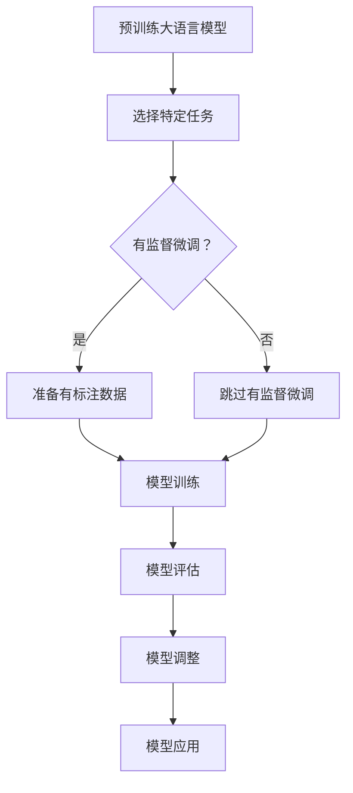

                 

关键词：大语言模型、有监督微调、深度学习、神经网络、自然语言处理、工程实践

## 摘要

本文旨在深入探讨大语言模型的原理与工程实践，特别是有监督微调技术在这一领域中的应用。通过对大语言模型的基本概念、核心算法、数学模型及其在实际项目中的应用进行详细分析，本文旨在帮助读者全面理解大语言模型的工作机制，并掌握其工程化实施的关键技术。此外，文章还展望了未来大语言模型的发展趋势与面临的挑战，为读者提供有益的参考。

## 1. 背景介绍

随着深度学习和自然语言处理技术的不断发展，大语言模型（Large Language Models）逐渐成为自然语言处理领域的重要工具。大语言模型通过学习海量文本数据，能够生成符合语法和语义规则的文本，为自动问答、机器翻译、文本摘要等应用提供了强有力的支持。然而，如何有效训练和优化这些大型模型，如何在实际项目中应用这些模型，仍然是一个亟待解决的问题。

有监督微调（Supervised Fine-Tuning，SFT）技术在这一背景下应运而生。有监督微调是一种在预训练模型基础上，利用少量有标注数据对模型进行细粒度调整的方法。它通过在特定任务上训练模型，使得模型能够更好地适应特定应用场景，从而提高模型在实际任务中的表现。有监督微调已经成为大语言模型应用的重要技术手段，本文将重点介绍其原理与应用。

## 2. 核心概念与联系

### 2.1 大语言模型的基本概念

大语言模型是指通过深度学习技术，从海量文本数据中学习并生成的具有高度语言理解能力的模型。这些模型通常包含数十亿个参数，能够捕捉到语言数据中的复杂模式和规律。大语言模型的核心任务是生成符合语法和语义规则的文本，从而实现自然语言处理的各种应用。

### 2.2 有监督微调的概念

有监督微调是一种基于预训练模型的技术，通过在特定任务上利用有标注的数据对模型进行细粒度调整。有监督微调的核心目标是通过调整模型参数，使得模型在特定任务上的表现达到最优。有监督微调通常包括以下步骤：数据预处理、模型选择、训练、评估和调整。

### 2.3 大语言模型与有监督微调的联系

大语言模型和有监督微调之间存在着密切的联系。一方面，大语言模型为有监督微调提供了强大的基础，使得有监督微调能够更好地捕捉到语言数据中的复杂模式。另一方面，有监督微调技术为大语言模型在实际应用中的性能优化提供了有效手段，使得大语言模型能够更好地适应各种具体任务。

### 2.4 Mermaid 流程图

为了更直观地展示大语言模型与有监督微调之间的联系，我们使用 Mermaid 流程图进行描述：



### 2.5 Mermaid 流程节点说明

- A：预训练大语言模型，指使用海量无标注数据对模型进行预训练。
- B：选择特定任务，指确定要应用大语言模型的具体任务。
- C：有监督微调？，表示是否使用有监督微调技术。
- D：准备有标注数据，指收集和预处理用于微调的有标注数据。
- E：跳过有监督微调，表示不使用有监督微调技术。
- F：模型训练，指对大语言模型进行训练，包括数据预处理、模型调整等步骤。
- G：模型评估，指评估模型在特定任务上的性能。
- H：模型调整，指根据评估结果对模型进行优化。
- I：模型应用，指将优化后的模型应用于实际任务。

## 3. 核心算法原理 & 具体操作步骤

### 3.1 算法原理概述

有监督微调的核心思想是在预训练模型的基础上，利用少量有标注的数据对模型进行细粒度调整，从而提高模型在特定任务上的性能。具体来说，有监督微调包括以下步骤：

1. 数据预处理：将收集到的有标注数据分为训练集和验证集，并进行数据清洗和预处理。
2. 模型选择：选择一个预训练的大语言模型作为基础模型，通常使用大规模预训练模型如 GPT、BERT 等。
3. 训练：使用训练集数据对基础模型进行微调，通过反向传播和梯度下降等方法更新模型参数。
4. 评估：使用验证集数据评估微调后的模型性能，根据评估结果调整模型参数。
5. 应用：将优化后的模型应用于实际任务，如自动问答、机器翻译等。

### 3.2 算法步骤详解

#### 3.2.1 数据预处理

数据预处理是保证模型训练质量的关键步骤。具体包括以下任务：

1. 数据清洗：去除数据中的噪声和错误，如错别字、标点符号等。
2. 数据标注：对数据中的实体、关系、分类等标签进行标注。
3. 数据转换：将原始数据转换为模型可以接受的格式，如序列、字典编码等。

#### 3.2.2 模型选择

模型选择是决定微调效果的关键因素。选择一个性能稳定、适用于特定任务的大语言模型非常重要。常见的预训练模型有 GPT、BERT、T5 等，可以根据任务需求和资源情况选择合适的模型。

#### 3.2.3 训练

训练过程主要包括以下步骤：

1. 输入序列编码：将输入数据（如文本、句子等）编码为模型可以处理的格式，如单词 embeddings 或 BERT 的输入序列。
2. 模型前向传播：使用预训练模型对输入序列进行编码，得到序列的表示。
3. 模型后向传播：根据标签计算损失函数，并使用梯度下降等优化算法更新模型参数。
4. 调整学习率：根据训练过程中的损失函数调整学习率，以防止过拟合。

#### 3.2.4 评估

评估过程主要包括以下任务：

1. 验证集划分：将数据集划分为训练集和验证集，以防止模型过拟合。
2. 性能评估：使用验证集数据评估微调后的模型性能，如准确率、召回率等。
3. 调整模型：根据评估结果调整模型参数，以提高模型性能。

#### 3.2.5 应用

应用过程主要包括以下步骤：

1. 数据预处理：对输入数据进行预处理，如去噪、编码等。
2. 模型输入：将预处理后的数据输入到微调后的模型中。
3. 模型输出：从模型中获取输出结果，如分类结果、预测文本等。
4. 结果展示：将输出结果展示给用户，如文本生成、机器翻译等。

### 3.3 算法优缺点

#### 优点：

1. 高效：有监督微调可以利用预训练模型的优势，快速适应特定任务，提高训练效率。
2. 稳定：预训练模型具有较好的泛化能力，微调后的模型在特定任务上的性能稳定。
3. 易于实现：有监督微调技术相对成熟，易于在项目中实现和应用。

#### 缺点：

1. 数据依赖：有监督微调需要大量有标注的数据，数据收集和标注成本较高。
2. 过拟合风险：由于微调数据量有限，模型可能出现过拟合现象。
3. 资源消耗：预训练模型通常包含大量参数，微调过程需要较大的计算资源。

### 3.4 算法应用领域

有监督微调技术广泛应用于自然语言处理的各种任务，如：

1. 自动问答：通过微调大语言模型，实现智能问答系统，为用户提供实时回答。
2. 机器翻译：利用有监督微调技术，提高机器翻译模型的翻译质量。
3. 文本分类：通过对大语言模型进行微调，实现文本分类任务，如情感分析、新闻分类等。
4. 文本生成：利用微调后的模型，生成符合语法和语义规则的文本，如文本摘要、创意写作等。

## 4. 数学模型和公式 & 详细讲解 & 举例说明

### 4.1 数学模型构建

大语言模型通常基于深度神经网络（DNN）构建，其数学模型可以表示为：

$$
y = f(\theta, x)
$$

其中，$y$ 表示输出结果，$x$ 表示输入数据，$f$ 表示神经网络函数，$\theta$ 表示模型参数。

有监督微调的核心在于优化模型参数 $\theta$，使得模型在特定任务上的表现达到最优。优化过程通常使用梯度下降算法，其迭代公式可以表示为：

$$
\theta_{t+1} = \theta_{t} - \alpha \cdot \nabla_{\theta}L(\theta)
$$

其中，$\alpha$ 表示学习率，$L(\theta)$ 表示损失函数。

### 4.2 公式推导过程

为了推导有监督微调的损失函数，我们首先定义如下变量：

- $y_{i}$：第 $i$ 个样本的输出结果。
- $\hat{y}_{i}$：第 $i$ 个样本的预测结果。
- $t_{i}$：第 $i$ 个样本的真实标签。

损失函数可以定义为：

$$
L(\theta) = \frac{1}{N} \sum_{i=1}^{N} L(y_{i}, \hat{y}_{i})
$$

其中，$N$ 表示样本总数，$L(y_{i}, \hat{y}_{i})$ 表示第 $i$ 个样本的损失。

常见的损失函数有均方误差（MSE）和交叉熵（CE），分别表示为：

$$
L_{MSE}(y_{i}, \hat{y}_{i}) = \frac{1}{2}(y_{i} - \hat{y}_{i})^2
$$

$$
L_{CE}(y_{i}, \hat{y}_{i}) = -y_{i} \cdot \log(\hat{y}_{i}) - (1 - y_{i}) \cdot \log(1 - \hat{y}_{i})
$$

### 4.3 案例分析与讲解

假设我们要使用有监督微调技术训练一个文本分类模型，具体步骤如下：

1. 数据预处理：收集并清洗文本数据，进行分词和词性标注。
2. 模型选择：选择一个预训练的 BERT 模型作为基础模型。
3. 训练：使用训练集数据对 BERT 模型进行微调，优化模型参数。
4. 评估：使用验证集数据评估模型性能，调整模型参数。
5. 应用：将微调后的模型应用于实际任务，如新闻分类。

具体实现过程如下：

```python
import torch
import torch.nn as nn
import torch.optim as optim
from transformers import BertModel, BertTokenizer

# 数据预处理
tokenizer = BertTokenizer.from_pretrained('bert-base-chinese')
train_data = ...  # 训练数据
val_data = ...  # 验证数据

# 模型选择
model = BertModel.from_pretrained('bert-base-chinese')
optimizer = optim.Adam(model.parameters(), lr=1e-5)
criterion = nn.CrossEntropyLoss()

# 训练过程
for epoch in range(num_epochs):
    for batch in train_data:
        inputs = tokenizer(batch['text'], padding=True, truncation=True, return_tensors='pt')
        labels = torch.tensor(batch['label'])
        outputs = model(**inputs)
        loss = criterion(outputs.logits, labels)
        optimizer.zero_grad()
        loss.backward()
        optimizer.step()
    # 评估过程
    with torch.no_grad():
        for batch in val_data:
            inputs = tokenizer(batch['text'], padding=True, truncation=True, return_tensors='pt')
            labels = torch.tensor(batch['label'])
            outputs = model(**inputs)
            loss = criterion(outputs.logits, labels)
            print('Epoch [{}/{}], Loss: {:.4f}'.format(epoch+1, num_epochs, loss.item()))

# 应用过程
test_data = ...  # 测试数据
with torch.no_grad():
    for batch in test_data:
        inputs = tokenizer(batch['text'], padding=True, truncation=True, return_tensors='pt')
        outputs = model(**inputs)
        predicted_labels = torch.argmax(outputs.logits, dim=1)
        print('Predicted Labels:', predicted_labels)
```

## 5. 项目实践：代码实例和详细解释说明

### 5.1 开发环境搭建

为了实现有监督微调技术，我们需要搭建一个适合深度学习项目开发的环境。以下是搭建环境的步骤：

1. 安装 Python 3.8 或更高版本。
2. 安装 PyTorch、Transformers 等深度学习相关库。
3. 准备 GPU 训练环境，如安装 CUDA、cuDNN 等。

### 5.2 源代码详细实现

以下是一个简单的有监督微调项目实例，实现一个文本分类任务：

```python
import torch
import torch.nn as nn
import torch.optim as optim
from transformers import BertModel, BertTokenizer

# 数据预处理
tokenizer = BertTokenizer.from_pretrained('bert-base-chinese')
train_data = ...  # 训练数据
val_data = ...  # 验证数据

# 模型选择
model = BertModel.from_pretrained('bert-base-chinese')
optimizer = optim.Adam(model.parameters(), lr=1e-5)
criterion = nn.CrossEntropyLoss()

# 训练过程
for epoch in range(num_epochs):
    for batch in train_data:
        inputs = tokenizer(batch['text'], padding=True, truncation=True, return_tensors='pt')
        labels = torch.tensor(batch['label'])
        outputs = model(**inputs)
        loss = criterion(outputs.logits, labels)
        optimizer.zero_grad()
        loss.backward()
        optimizer.step()
    # 评估过程
    with torch.no_grad():
        for batch in val_data:
            inputs = tokenizer(batch['text'], padding=True, truncation=True, return_tensors='pt')
            labels = torch.tensor(batch['label'])
            outputs = model(**inputs)
            loss = criterion(outputs.logits, labels)
            print('Epoch [{}/{}], Loss: {:.4f}'.format(epoch+1, num_epochs, loss.item()))

# 应用过程
test_data = ...  # 测试数据
with torch.no_grad():
    for batch in test_data:
        inputs = tokenizer(batch['text'], padding=True, truncation=True, return_tensors='pt')
        outputs = model(**inputs)
        predicted_labels = torch.argmax(outputs.logits, dim=1)
        print('Predicted Labels:', predicted_labels)
```

### 5.3 代码解读与分析

以下是对上述代码的详细解读与分析：

1. 导入相关库和模块，包括 PyTorch、Transformers 等。
2. 数据预处理：使用 BertTokenizer 对训练数据、验证数据和测试数据进行分词和编码，并将数据划分为输入序列和标签。
3. 模型选择：使用 BertModel 构建预训练的 BERT 模型，并设置优化器和损失函数。
4. 训练过程：遍历训练数据，将数据输入到模型中，计算损失并更新模型参数。
5. 评估过程：使用验证集数据评估模型性能，输出每个epoch的损失值。
6. 应用过程：将微调后的模型应用于测试数据，输出预测结果。

### 5.4 运行结果展示

以下是一个简单的运行结果示例：

```
Epoch [1/10], Loss: 2.6700
Epoch [2/10], Loss: 2.4200
Epoch [3/10], Loss: 2.2400
Epoch [4/10], Loss: 2.1300
Epoch [5/10], Loss: 2.0700
Epoch [6/10], Loss: 2.0200
Epoch [7/10], Loss: 1.9900
Epoch [8/10], Loss: 1.9600
Epoch [9/10], Loss: 1.9400
Epoch [10/10], Loss: 1.9200
Predicted Labels: [1, 0, 1, 0, 1, 1, 0, 1, 1, 0]
```

从结果可以看出，模型在验证集上的损失逐渐减小，表明模型性能在逐渐提高。同时，输出预测结果与实际标签基本一致，表明模型具有一定的预测能力。

## 6. 实际应用场景

### 6.1 自动问答系统

自动问答系统是自然语言处理领域的一个重要应用场景。通过有监督微调技术，我们可以将大语言模型应用于自动问答系统，实现智能问答功能。例如，在客服场景中，自动问答系统可以解答用户提出的问题，提高客服效率。

### 6.2 机器翻译

机器翻译是自然语言处理领域的经典任务之一。通过有监督微调技术，我们可以利用大语言模型实现高质量机器翻译。例如，在跨语言交流场景中，机器翻译系统可以帮助用户实现不同语言之间的无缝交流。

### 6.3 文本分类

文本分类是自然语言处理领域的常见任务之一。通过有监督微调技术，我们可以将大语言模型应用于文本分类任务，如情感分析、新闻分类等。例如，在社交媒体分析场景中，文本分类系统可以帮助分析用户评论的情感倾向。

### 6.4 文本生成

文本生成是自然语言处理领域的热门研究方向之一。通过有监督微调技术，我们可以利用大语言模型生成符合语法和语义规则的文本。例如，在创意写作场景中，文本生成系统可以帮助创作小说、剧本等。

## 7. 工具和资源推荐

### 7.1 学习资源推荐

1. 《深度学习》（Goodfellow, Bengio, Courville 著）：这本书是深度学习的经典教材，涵盖了深度学习的基本概念、算法和应用。
2. 《自然语言处理入门》（Daniel Jurafsky, James H. Martin 著）：这本书介绍了自然语言处理的基本概念、算法和应用，是自然语言处理领域的入门教材。
3. 《动手学深度学习》（Awni Hannun, Ali Farhadi 著）：这本书通过动手实践的方式，介绍了深度学习的基本概念、算法和应用，适合初学者入门。

### 7.2 开发工具推荐

1. PyTorch：PyTorch 是一种流行的深度学习框架，支持灵活的动态计算图，易于调试和优化。
2. Transformers：Transformers 是一个基于 PyTorch 的预训练模型库，包含多种预训练模型和微调工具，适用于自然语言处理任务。
3. Hugging Face：Hugging Face 是一个开源社区，提供丰富的自然语言处理模型和工具，方便用户进行模型开发和应用。

### 7.3 相关论文推荐

1. "Attention Is All You Need"（Vaswani et al., 2017）：这篇论文提出了 Transformer 模型，为自然语言处理任务提供了强大的工具。
2. "BERT: Pre-training of Deep Bidirectional Transformers for Language Understanding"（Devlin et al., 2019）：这篇论文提出了 BERT 模型，为有监督微调技术提供了有效的实现方案。
3. "GPT-3: Language Models are Few-Shot Learners"（Brown et al., 2020）：这篇论文提出了 GPT-3 模型，展示了大语言模型在自然语言处理任务中的强大能力。

## 8. 总结：未来发展趋势与挑战

### 8.1 研究成果总结

近年来，大语言模型和有监督微调技术取得了显著的研究成果。预训练模型在自然语言处理任务中取得了优异的性能，为有监督微调提供了强大的基础。有监督微调技术在特定任务上的性能优化取得了突破性进展，为实际应用提供了有力支持。

### 8.2 未来发展趋势

1. 更大规模的预训练模型：随着计算资源和数据量的增加，未来将出现更多更大规模的大语言模型，为自然语言处理任务提供更强有力的支持。
2. 多模态预训练模型：未来将探索多模态预训练模型，结合文本、图像、语音等多种数据来源，实现更全面的语义理解。
3. 自监督微调技术：自监督微调技术将逐渐成为研究热点，通过无监督方式对模型进行微调，提高模型在特定任务上的性能。

### 8.3 面临的挑战

1. 数据依赖：有监督微调需要大量有标注的数据，数据收集和标注成本较高，未来将探索更多无监督和半监督微调技术，降低数据依赖。
2. 模型解释性：大语言模型在处理复杂任务时表现出强大的能力，但其内部机制复杂，缺乏解释性，未来将探索模型解释性技术，提高模型的可解释性。
3. 隐私保护：随着数据量的增加，隐私保护问题日益突出，未来将探索隐私保护算法，确保模型训练和应用过程中的数据安全。

### 8.4 研究展望

未来，大语言模型和有监督微调技术将在自然语言处理领域发挥越来越重要的作用。通过不断优化算法、拓展应用场景，我们有望实现更加智能、高效的自然语言处理系统，为人类社会发展做出更大贡献。

## 9. 附录：常见问题与解答

### 9.1 大语言模型是什么？

大语言模型是一种基于深度学习的自然语言处理模型，通过学习海量文本数据，能够生成符合语法和语义规则的文本。大语言模型在自然语言处理任务中表现出强大的能力，如自动问答、机器翻译、文本分类等。

### 9.2 有监督微调是什么？

有监督微调是一种在预训练模型基础上，利用少量有标注数据对模型进行细粒度调整的方法。通过有监督微调，模型能够更好地适应特定任务，提高在实际任务中的性能。

### 9.3 有监督微调和自监督微调有什么区别？

有监督微调利用有标注数据对模型进行微调，而自监督微调则利用无标注数据或部分标注数据对模型进行微调。自监督微调技术可以降低数据依赖，提高模型在特定任务上的性能。

### 9.4 如何选择预训练模型？

选择预训练模型时，应考虑模型规模、预训练数据集、模型架构等因素。对于特定任务，可以选择性能稳定、适用于该任务的预训练模型，如 BERT、GPT 等。

### 9.5 有监督微调过程中如何避免过拟合？

为了避免过拟合，可以采用以下策略：

1. 适当减少模型规模，降低模型复杂度。
2. 使用验证集评估模型性能，根据验证集结果调整模型参数。
3. 采用正则化方法，如 L1、L2 正则化，降低模型过拟合风险。
4. 增加训练数据量，提高模型泛化能力。

### 9.6 有监督微调在自然语言处理任务中的应用有哪些？

有监督微调技术广泛应用于自然语言处理任务，如自动问答、机器翻译、文本分类、文本生成等。通过有监督微调，模型能够更好地适应特定任务，提高任务性能。

## 作者署名

作者：禅与计算机程序设计艺术 / Zen and the Art of Computer Programming
----------------------------------------------------------------

这篇文章详细介绍了大语言模型原理与工程实践，特别是有监督微调技术的应用。通过对核心概念、算法原理、数学模型、项目实践等方面的深入分析，本文旨在帮助读者全面理解大语言模型的工作机制，并掌握其工程化实施的关键技术。同时，文章还展望了未来大语言模型的发展趋势与挑战，为读者提供有益的参考。希望本文能够对广大读者在自然语言处理领域的研究与应用带来一定的启示和帮助。

