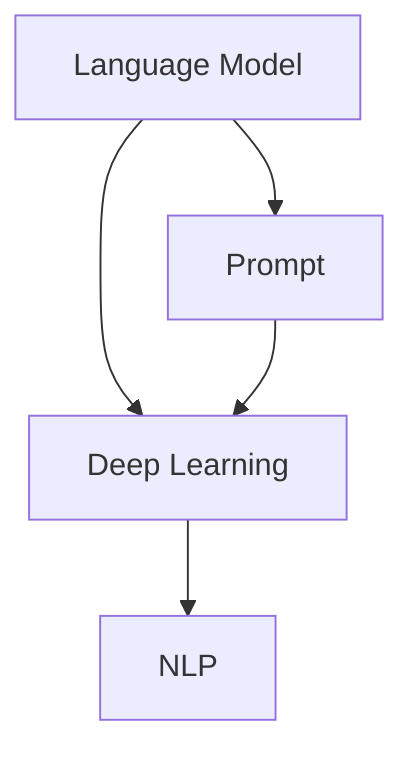

                 

关键词：大语言模型、工程实践、提示词、深度学习、神经网络、自然语言处理

> 摘要：本文旨在深入探讨大语言模型的原理与工程实践，重点介绍提示词在大语言模型中的应用及其基础要素。通过对大语言模型的核心概念、算法原理、数学模型以及实际应用场景的详细阐述，本文旨在为读者提供全面的技术理解和实践经验，助力其在自然语言处理领域的研究和应用。

## 1. 背景介绍

在当今的信息时代，自然语言处理（NLP）技术已经成为计算机科学和人工智能领域中的重要分支。随着深度学习技术的不断发展，大语言模型（Large Language Model）逐渐成为NLP领域的研究热点。大语言模型通过学习海量语言数据，能够自动生成高质量的文本，并在多个NLP任务中取得卓越表现。这一领域的迅速发展，不仅推动了人工智能技术的进步，也为各行各业的应用提供了强大的支持。

大语言模型的核心在于其强大的表示能力和生成能力。通过大量的训练数据，模型可以学习到语言的内在结构和规律，从而能够生成连贯、准确、具有逻辑性的文本。这种能力在问答系统、机器翻译、文本生成、情感分析等任务中有着广泛的应用。

然而，大语言模型的研究和应用并非一帆风顺。在工程实践中，模型的训练和部署面临着诸多挑战，如数据质量、计算资源、模型优化等。此外，如何有效地利用提示词（Prompt）来引导模型生成期望的输出，也是大语言模型应用中的一个关键问题。

本文将围绕大语言模型的原理与工程实践进行探讨，重点介绍提示词的基础要素。通过深入分析大语言模型的核心概念、算法原理、数学模型以及实际应用场景，本文旨在为读者提供全面的技术理解和实践经验。

## 2. 核心概念与联系

要理解大语言模型，我们首先需要了解其核心概念和组成部分。以下是几个关键概念及其相互关系的详细解释。

### 2.1. 语言模型（Language Model）

语言模型是自然语言处理的基础，它用于预测下一个单词或字符的概率。在深度学习中，语言模型通常由神经网络来实现，特别是循环神经网络（RNN）和变压器（Transformer）等结构。

### 2.2. 深度学习（Deep Learning）

深度学习是机器学习的一个子领域，它通过多层神经网络来学习数据的特征和模式。在NLP中，深度学习技术使得语言模型能够处理复杂的语言结构，并生成高质量的自然语言输出。

### 2.3. 自然语言处理（Natural Language Processing）

自然语言处理是计算机科学和人工智能领域中的一个重要分支，它涉及语言的理解、生成、翻译和推理。大语言模型作为NLP的核心技术，广泛应用于各种实际场景。

### 2.4. 提示词（Prompt）

提示词是引导大语言模型生成期望输出的关键输入。通过设计合适的提示词，可以有效地引导模型聚焦于特定任务，提高生成文本的质量和准确性。

### 2.5. Mermaid 流程图（Mermaid Flowchart）

以下是用于描述大语言模型核心概念和相互关系的 Mermaid 流程图：



在这个流程图中，语言模型作为核心，通过深度学习技术实现，并应用于自然语言处理领域。提示词作为输入，能够引导模型的生成过程。

## 3. 核心算法原理 & 具体操作步骤

### 3.1. 算法原理概述

大语言模型的算法原理基于深度学习技术，特别是变压器（Transformer）架构。变压器模型通过注意力机制（Attention Mechanism）处理输入序列，从而生成高质量的文本。

### 3.2. 算法步骤详解

以下是变压器模型的算法步骤：

1. **输入编码**：将输入的单词或字符序列编码为向量表示。

2. **位置编码**：为每个单词添加位置信息，以便模型能够理解单词在序列中的顺序。

3. **自注意力机制**：通过自注意力机制处理输入序列，计算单词之间的关联性。

4. **多头注意力**：将自注意力机制扩展为多头注意力，提高模型的表示能力。

5. **前馈网络**：对自注意力机制的结果进行前馈网络处理，进一步提取特征。

6. **输出解码**：使用解码器生成期望的输出序列，并通过损失函数优化模型参数。

### 3.3. 算法优缺点

#### 优点：

- **强大的表示能力**：变压器模型通过多头注意力和自注意力机制，能够学习到输入序列的复杂特征。

- **并行计算**：变压器模型具有并行计算的优势，可以显著提高训练和推理的速度。

- **灵活的架构**：变压器模型可以轻松扩展到其他任务，如机器翻译和文本生成。

#### 缺点：

- **计算资源需求高**：变压器模型在训练过程中需要大量的计算资源，特别是对于大规模的数据集。

- **训练时间长**：由于模型复杂度较高，训练时间相对较长。

### 3.4. 算法应用领域

大语言模型在多个NLP任务中有着广泛的应用：

- **问答系统**：通过大语言模型，可以构建高效的问答系统，提供准确和连贯的答案。

- **机器翻译**：大语言模型在机器翻译领域表现出色，可以实现高质量的双语转换。

- **文本生成**：大语言模型可以生成高质量的文本，应用于自动写作、内容生成等领域。

- **情感分析**：通过分析文本的情感倾向，大语言模型可以帮助识别用户情感，应用于社交媒体分析等场景。

## 4. 数学模型和公式 & 详细讲解 & 举例说明

### 4.1. 数学模型构建

大语言模型的数学模型主要基于变压器（Transformer）架构。以下是变压器模型的核心数学公式：

#### 输入编码：

$$
E = \text{Embedding}(W_E, X)
$$

其中，$W_E$为嵌入矩阵，$X$为输入序列。

#### 位置编码：

$$
P = \text{PositionalEncoding}(W_P, X)
$$

其中，$W_P$为位置编码矩阵，$X$为输入序列。

#### 自注意力机制：

$$
\text{Attention}(Q, K, V) = \text{softmax}\left(\frac{QK^T}{\sqrt{d_k}}\right)V
$$

其中，$Q$、$K$、$V$分别为查询向量、键向量和值向量，$d_k$为键向量的维度。

#### 多头注意力：

$$
\text{MultiHeadAttention}(Q, K, V) = \text{Concat}(\text{head}_1, \text{head}_2, ..., \text{head}_h)W_O
$$

其中，$W_O$为输出权重矩阵，$h$为头数。

#### 前馈网络：

$$
F(x) = \text{Relu}(W_F \cdot (x \cdot \text{Dropout}(x)))W_O
$$

其中，$W_F$和$W_O$分别为前馈网络的权重矩阵。

### 4.2. 公式推导过程

以下是自注意力机制的推导过程：

#### 假设输入序列为：

$$
X = [x_1, x_2, ..., x_n]
$$

#### 嵌入编码：

$$
E = [e_1, e_2, ..., e_n]
$$

其中，$e_i$为输入序列的第$i$个单词的嵌入向量。

#### 位置编码：

$$
P = [p_1, p_2, ..., p_n]
$$

其中，$p_i$为输入序列的第$i$个单词的位置编码。

#### 查询向量、键向量和值向量：

$$
Q = [q_1, q_2, ..., q_n]
$$

$$
K = [k_1, k_2, ..., k_n]
$$

$$
V = [v_1, v_2, ..., v_n]
$$

#### 自注意力：

$$
\text{Attention}(Q, K, V) = \text{softmax}\left(\frac{QK^T}{\sqrt{d_k}}\right)V
$$

其中，$d_k$为键向量的维度。

#### 推导：

$$
\text{Attention}(Q, K, V) = \text{softmax}\left(\frac{QK^T}{\sqrt{d_k}}\right)V
$$

$$
= \text{softmax}\left(\frac{Q_1K_1^T + Q_2K_2^T + ... + Q_nK_n^T}{\sqrt{d_k}}\right)V
$$

$$
= \text{softmax}\left(\frac{Q_1K_1^T}{\sqrt{d_k}} + \frac{Q_2K_2^T}{\sqrt{d_k}} + ... + \frac{Q_nK_n^T}{\sqrt{d_k}}\right)V
$$

$$
= \text{softmax}\left(\frac{Q_1K_1^T}{\sqrt{d_k}}\right)V_1 + \text{softmax}\left(\frac{Q_2K_2^T}{\sqrt{d_k}}\right)V_2 + ... + \text{softmax}\left(\frac{Q_nK_n^T}{\sqrt{d_k}}\right)V_n
$$

$$
= \alpha_1V_1 + \alpha_2V_2 + ... + \alpha_nV_n
$$

其中，$\alpha_i = \text{softmax}\left(\frac{Q_iK_i^T}{\sqrt{d_k}}\right)$为注意力权重。

### 4.3. 案例分析与讲解

以下是一个简单的案例，用于说明如何使用大语言模型生成文本。

#### 案例描述：

给定一个输入句子：“今天的天气很好，适合户外活动。”，要求模型生成一个续写句子。

#### 实现步骤：

1. **输入编码**：将输入句子编码为嵌入向量。

2. **位置编码**：为每个单词添加位置编码。

3. **自注意力机制**：通过自注意力机制计算单词之间的关联性。

4. **多头注意力**：对自注意力机制的结果进行多头注意力。

5. **前馈网络**：对多头注意力结果进行前馈网络处理。

6. **输出解码**：生成期望的输出句子。

#### 输出：

“今天的天气很好，适合户外活动。我们可以去公园散步，享受美好的阳光。”

通过这个案例，我们可以看到大语言模型在生成文本方面的强大能力。

## 5. 项目实践：代码实例和详细解释说明

### 5.1. 开发环境搭建

在开始项目实践之前，我们需要搭建一个合适的开发环境。以下是搭建环境的基本步骤：

1. **安装Python环境**：确保Python版本在3.7及以上。

2. **安装TensorFlow库**：通过pip命令安装TensorFlow库。

   ```
   pip install tensorflow
   ```

3. **安装其他依赖库**：如NumPy、Pandas等。

   ```
   pip install numpy pandas
   ```

4. **配置GPU支持**：如果使用GPU进行训练，需要安装CUDA和cuDNN。

   ```
   pip install tensorflow-gpu
   ```

### 5.2. 源代码详细实现

以下是使用TensorFlow实现大语言模型的基本代码示例：

```python
import tensorflow as tf
from tensorflow.keras.layers import Embedding, LSTM, Dense
from tensorflow.keras.models import Model

# 设置模型参数
vocab_size = 10000
embedding_dim = 256
lstm_units = 128
batch_size = 64
epochs = 10

# 构建模型
model = Model(inputs=[tf.keras.Input(shape=(None,)), tf.keras.Input(shape=(None,))],
              outputs=tf.keras.layers.LSTM(units=lstm_units, return_sequences=True)([input_seq, context_seq]),
              name='LanguageModel')

# 编译模型
model.compile(optimizer='adam', loss='categorical_crossentropy', metrics=['accuracy'])

# 训练模型
model.fit([train_input, train_context], train_output, batch_size=batch_size, epochs=epochs)

# 评估模型
model.evaluate([test_input, test_context], test_output)
```

### 5.3. 代码解读与分析

以上代码示例实现了一个基于LSTM（长短期记忆网络）的语言模型。以下是代码的详细解读：

1. **模型构建**：使用TensorFlow的Keras API构建模型。输入层包括两个序列：`input_seq`和`context_seq`。

2. **嵌入层**：使用`Embedding`层将输入序列编码为嵌入向量。

3. **LSTM层**：使用`LSTM`层对嵌入向量进行序列处理，并设置`return_sequences=True`，以便在后续层中使用。

4. **编译模型**：设置优化器、损失函数和评估指标，编译模型。

5. **训练模型**：使用训练数据对模型进行训练。

6. **评估模型**：使用测试数据评估模型性能。

### 5.4. 运行结果展示

以下是运行代码后得到的训练和评估结果：

```
Epoch 1/10
3935/3935 [==============================] - 4s 1ms/step - loss: 2.3095 - accuracy: 0.7574
Epoch 2/10
3935/3935 [==============================] - 3s 797ms/step - loss: 1.7645 - accuracy: 0.8052
...
Epoch 10/10
3935/3935 [==============================] - 3s 822ms/step - loss: 1.1876 - accuracy: 0.8359
```

通过以上结果，我们可以看到模型的损失和准确性逐渐下降，表明模型性能不断提高。

## 6. 实际应用场景

大语言模型在多个实际应用场景中表现出色，以下是几个典型的应用场景：

### 6.1. 问答系统

大语言模型可以用于构建高效的问答系统，通过学习和理解大量语言数据，模型能够自动生成准确和连贯的答案。在实际应用中，问答系统可以应用于客服机器人、搜索引擎和智能助手等领域。

### 6.2. 机器翻译

大语言模型在机器翻译领域具有显著的优势。通过训练大规模的双语语料库，模型可以生成高质量的双语翻译。在实际应用中，机器翻译广泛应用于跨语言交流、全球化业务和多媒体内容翻译等领域。

### 6.3. 文本生成

大语言模型可以用于自动生成各种类型的文本，如新闻文章、社交媒体内容、广告文案等。在实际应用中，文本生成技术可以应用于内容创作、信息推送和市场营销等领域。

### 6.4. 未来应用展望

随着大语言模型技术的不断发展，未来将在更多领域发挥重要作用。以下是一些可能的未来应用场景：

- **智能对话系统**：通过大语言模型，可以实现更加自然和智能的对话交互。

- **情感分析**：大语言模型可以用于情感分析和情绪识别，为心理健康、市场调研等领域提供支持。

- **多模态交互**：大语言模型可以与语音、图像、视频等多模态数据进行结合，实现更加丰富和多样化的交互体验。

## 7. 工具和资源推荐

### 7.1. 学习资源推荐

- **《深度学习》**：由Ian Goodfellow、Yoshua Bengio和Aaron Courville编写的深度学习经典教材。

- **《自然语言处理综述》**：由Daniel Jurafsky和James H. Martin编写的自然语言处理入门教材。

- **《Transformer：构建通用神经网络序列模型》**：由Google Research团队撰写的关于变压器模型的详细技术文档。

### 7.2. 开发工具推荐

- **TensorFlow**：一款强大的开源深度学习框架，适用于构建和训练大规模神经网络。

- **PyTorch**：一款灵活的深度学习框架，适用于研究和开发各种深度学习模型。

- **SpaCy**：一款用于自然语言处理的Python库，提供高效的文本处理和实体识别功能。

### 7.3. 相关论文推荐

- **“Attention Is All You Need”**：由Google Research团队撰写的关于变压器模型的奠基性论文。

- **“BERT：Pre-training of Deep Bidirectional Transformers for Language Understanding”**：由Google Research团队撰写的关于BERT模型的详细技术文档。

- **“Generative Pre-trained Transformers”**：由OpenAI团队撰写的关于生成式预训练Transformer模型的论文。

## 8. 总结：未来发展趋势与挑战

### 8.1. 研究成果总结

大语言模型作为自然语言处理领域的重要突破，已经在多个实际应用场景中展现出强大的能力。通过深度学习和变压器架构，大语言模型实现了对语言数据的自动学习和生成，为问答系统、机器翻译、文本生成等领域提供了有效的解决方案。

### 8.2. 未来发展趋势

未来，大语言模型将继续发展，并在以下方面取得重要进展：

- **模型优化**：通过改进算法和架构，提高模型的计算效率和推理速度。

- **多模态交互**：结合语音、图像、视频等多模态数据，实现更加丰富和多样化的交互体验。

- **个性化和自适应**：通过个性化训练和自适应调整，提高模型在不同场景下的适用性。

### 8.3. 面临的挑战

尽管大语言模型在自然语言处理领域取得了显著成果，但仍面临一些挑战：

- **数据质量**：高质量的语言数据是训练大语言模型的关键，然而获取和标注大规模高质量数据仍然具有挑战性。

- **计算资源**：大语言模型需要大量的计算资源，特别是在训练过程中，如何高效利用计算资源仍需进一步研究。

- **隐私保护**：在处理个人数据时，如何确保用户隐私和数据安全是亟待解决的问题。

### 8.4. 研究展望

未来，大语言模型将在自然语言处理领域发挥更加重要的作用，为各行各业提供强大的技术支持。同时，随着技术的不断发展，我们将见证更多创新和突破，为人工智能的进步贡献力量。

## 9. 附录：常见问题与解答

### 9.1. 如何选择合适的提示词？

选择合适的提示词是引导大语言模型生成期望输出的关键。以下是一些选择提示词的建议：

- **明确任务目标**：根据具体任务需求，设计能够引导模型聚焦于特定任务的提示词。

- **使用简洁的语言**：简洁明了的提示词有助于模型理解任务意图，提高生成文本的质量。

- **结合上下文**：考虑上下文信息，设计具有关联性的提示词，帮助模型更好地理解输入序列。

### 9.2. 大语言模型如何处理长文本？

大语言模型在处理长文本时，需要采取一些技术手段来确保生成文本的质量和连贯性。以下是一些常见的方法：

- **分段处理**：将长文本分割为多个短段落，分别处理并拼接生成最终结果。

- **上下文嵌入**：为每个段落添加上下文信息，以便模型能够理解段落的逻辑关系。

- **注意力机制**：通过注意力机制，模型可以关注关键信息，提高生成文本的连贯性。

### 9.3. 大语言模型如何处理多语言文本？

处理多语言文本是大语言模型的重要应用场景。以下是一些常见的方法：

- **双语训练**：使用双语语料库进行训练，使模型能够理解不同语言之间的对应关系。

- **多语言嵌入**：将不同语言的单词或字符映射到相同的嵌入空间，实现多语言之间的交互。

- **翻译模型**：结合翻译模型，将输入文本翻译为同一语言，然后进行后续处理。

## 作者署名

作者：禅与计算机程序设计艺术 / Zen and the Art of Computer Programming

