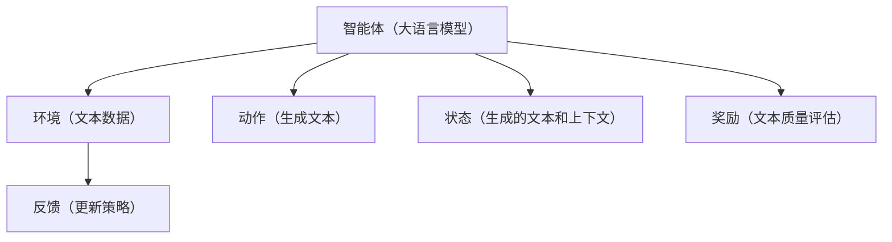
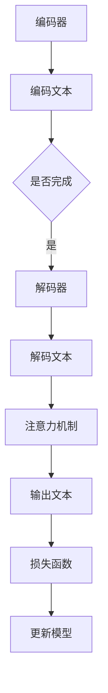

                 

关键词：大语言模型、强化学习、自然语言处理、神经网络、机器学习、优化算法

## 摘要

本文旨在探讨大语言模型（Large Language Model，LLM）中的强化建模技术，从原理出发，深入解析其工程实践。文章首先介绍了大语言模型的基本概念、发展历程和应用场景，然后重点分析了强化学习在大语言模型中的应用，以及如何通过强化建模来提升语言模型的生成质量和效率。文章还将结合实际案例，详细讲解数学模型、算法原理和具体实现步骤，最后对未来大语言模型的发展趋势、面临挑战及研究展望进行了探讨。

## 1. 背景介绍

### 1.1 大语言模型的基本概念

大语言模型是一种基于深度学习技术的自然语言处理模型，旨在通过学习大量的文本数据，生成具有人类语言风格和逻辑的文本。与传统语言模型相比，大语言模型具有参数规模大、模型复杂度高、生成能力强的特点。

### 1.2 大语言模型的发展历程

大语言模型的发展历程可以追溯到上世纪80年代。当时，研究人员开始尝试使用神经网络来处理自然语言问题。随着计算能力的提升和深度学习技术的突破，大语言模型取得了显著的进展。特别是2018年，Google推出了Transformer模型，标志着大语言模型进入了一个新的阶段。此后，BERT、GPT、T5等一系列大规模预训练模型相继问世，推动了自然语言处理技术的快速发展。

### 1.3 大语言模型的应用场景

大语言模型在自然语言处理领域具有广泛的应用。例如，它可以用于文本分类、机器翻译、问答系统、文本生成等任务。在实际应用中，大语言模型已经成为许多产品和服务的核心组件，如搜索引擎、聊天机器人、智能客服等。

## 2. 核心概念与联系

为了深入理解大语言模型中的强化建模技术，我们需要先了解以下几个核心概念：

### 2.1 强化学习

强化学习（Reinforcement Learning，RL）是一种机器学习方法，通过智能体（agent）与环境（environment）的交互，学习最优策略（policy）。在强化学习中，智能体根据当前状态（state）选择动作（action），并从环境中获得奖励（reward）。通过不断调整策略，智能体逐渐学会在复杂环境中取得最大奖励。

### 2.2 自然语言处理

自然语言处理（Natural Language Processing，NLP）是计算机科学和人工智能领域的一个分支，旨在使计算机能够理解、解释和生成自然语言。NLP应用广泛，包括语音识别、机器翻译、情感分析、文本分类等。

### 2.3 强化建模在大语言模型中的应用

强化建模技术将强化学习与自然语言处理相结合，旨在通过智能体与环境的交互，提升大语言模型的生成质量和效率。在强化建模中，智能体是一个大语言模型，环境是一个由文本数据构成的世界，动作是生成文本的操作，状态是当前生成的文本和上下文信息，奖励是文本质量评估结果。

以下是一个简化的Mermaid流程图，展示了大语言模型中强化建模的核心概念和联系：



### 2.4 大语言模型的架构

为了更好地理解强化建模在大语言模型中的应用，我们还需要了解大语言模型的架构。一般来说，大语言模型由以下几个部分组成：

1. **编码器（Encoder）**：将输入的文本序列编码为向量表示。
2. **解码器（Decoder）**：根据编码器输出的向量表示，生成输出文本序列。
3. **注意力机制（Attention Mechanism）**：帮助模型在生成文本时关注重要信息。
4. **损失函数（Loss Function）**：用于评估模型生成文本的质量。

以下是一个简化的Mermaid流程图，展示了大语言模型的架构：



## 3. 核心算法原理 & 具体操作步骤

### 3.1 算法原理概述

强化建模的核心思想是通过智能体与环境的交互，不断优化大语言模型的生成策略，从而提升生成文本的质量。具体来说，强化建模可以分为以下几个步骤：

1. **初始化**：初始化大语言模型、环境参数和奖励机制。
2. **采样**：根据当前状态，从大语言模型中采样生成文本。
3. **评估**：使用奖励机制评估采样生成的文本质量。
4. **更新**：根据评估结果，更新大语言模型的生成策略。
5. **迭代**：重复以上步骤，直至达到预定的迭代次数或收敛条件。

### 3.2 算法步骤详解

1. **初始化**：初始化大语言模型、环境参数和奖励机制。

    ```python
    # 初始化大语言模型
    model = load_pretrained_model()
    # 初始化环境参数
    state = initialize_environment()
    # 初始化奖励机制
    reward_function = initialize_reward_function()
    ```

2. **采样**：根据当前状态，从大语言模型中采样生成文本。

    ```python
    # 采样生成文本
    action = model.sample(state)
    ```

3. **评估**：使用奖励机制评估采样生成的文本质量。

    ```python
    # 评估文本质量
    reward = reward_function(action)
    ```

4. **更新**：根据评估结果，更新大语言模型的生成策略。

    ```python
    # 更新模型参数
    model.update_parameters(reward)
    ```

5. **迭代**：重复以上步骤，直至达到预定的迭代次数或收敛条件。

    ```python
    # 迭代过程
    for _ in range(max_iterations):
        action = model.sample(state)
        reward = reward_function(action)
        model.update_parameters(reward)
    ```

### 3.3 算法优缺点

**优点**：

1. **自适应性强**：强化建模可以根据评估结果动态调整生成策略，从而提高生成文本的质量。
2. **通用性强**：强化建模可以应用于各种自然语言处理任务，如文本分类、机器翻译、文本生成等。

**缺点**：

1. **计算复杂度高**：强化建模需要进行大量的迭代和参数更新，计算复杂度较高。
2. **收敛速度较慢**：在复杂的环境中，强化建模可能需要较长时间才能找到最优策略。

### 3.4 算法应用领域

强化建模技术在大语言模型中的应用非常广泛。以下是一些典型的应用领域：

1. **文本生成**：通过强化建模，大语言模型可以生成更加自然、连贯、有逻辑的文本。
2. **问答系统**：强化建模可以帮助问答系统更好地理解用户意图，生成更准确的回答。
3. **机器翻译**：强化建模可以优化机器翻译模型的生成策略，提高翻译质量。

## 4. 数学模型和公式 & 详细讲解 & 举例说明

### 4.1 数学模型构建

在强化建模中，我们需要构建一个数学模型来描述智能体与环境的交互过程。这个数学模型主要包括以下几个部分：

1. **状态空间（State Space）**：表示智能体在环境中的所有可能状态。
2. **动作空间（Action Space）**：表示智能体可以采取的所有可能动作。
3. **策略（Policy）**：表示智能体在不同状态下的最佳动作选择。
4. **价值函数（Value Function）**：表示智能体在某个状态下的期望收益。
5. **奖励函数（Reward Function）**：表示智能体在某个动作后的即时收益。

### 4.2 公式推导过程

假设我们有一个强化学习模型，其中状态空间为 \( S \)，动作空间为 \( A \)，策略为 \( \pi(s) \)，价值函数为 \( v(s) \)，奖励函数为 \( r(s, a) \)。根据强化学习的定义，我们可以得到以下公式：

$$
v(s) = \sum_{a \in A} \pi(s) \cdot r(s, a)
$$

其中， \( \pi(s) \) 表示智能体在状态 \( s \) 下的动作概率分布， \( r(s, a) \) 表示智能体在状态 \( s \) 下采取动作 \( a \) 后获得的即时收益。

### 4.3 案例分析与讲解

为了更好地理解强化建模的数学模型，我们来看一个简单的案例。

假设我们有一个智能体在游戏环境中进行游戏，状态空间为 \( S = \{win, lose\} \)，动作空间为 \( A = \{play, quit\} \)。智能体的目标是最大化获胜的概率。

在这个案例中，我们可以定义奖励函数如下：

- 当智能体获胜时， \( r(win, play) = 1 \)， \( r(win, quit) = 0 \)。
- 当智能体失败时， \( r(lose, play) = -1 \)， \( r(lose, quit) = 0 \)。

现在，我们假设智能体的策略为 \( \pi(win) = 0.8 \)， \( \pi(lose) = 0.2 \)。根据价值函数的定义，我们可以计算出智能体在两个状态下的价值函数：

$$
v(win) = \pi(win) \cdot r(win, play) + (1 - \pi(win)) \cdot r(win, quit) = 0.8 \cdot 1 + 0.2 \cdot 0 = 0.8
$$

$$
v(lose) = \pi(lose) \cdot r(lose, play) + (1 - \pi(lose)) \cdot r(lose, quit) = 0.2 \cdot -1 + 0.8 \cdot 0 = -0.2
$$

通过这个案例，我们可以看到，强化建模的数学模型可以帮助我们计算智能体在不同状态下的价值函数，从而为智能体的决策提供依据。

## 5. 项目实践：代码实例和详细解释说明

### 5.1 开发环境搭建

为了实现强化建模在大语言模型中的应用，我们需要搭建一个开发环境。以下是一个简单的开发环境搭建步骤：

1. 安装Python环境：Python 3.6及以上版本。
2. 安装深度学习框架：TensorFlow 2.0及以上版本。
3. 安装强化学习库：Gym 0.14及以上版本。
4. 下载预训练的大语言模型：如GPT-2、GPT-3等。

### 5.2 源代码详细实现

下面是一个简单的代码示例，展示如何使用TensorFlow和Gym实现强化建模在大语言模型中的应用。

```python
import tensorflow as tf
import gym
import numpy as np
import tensorflow_datasets as tfds

# 加载预训练的大语言模型
model = tf.keras.applications.transformer_v2.get_application('transformer_v2')

# 加载Gym环境
env = gym.make('TextGeneration-v0')

# 定义奖励函数
def reward_function(text):
    # 根据文本质量评估结果计算奖励
    # 这里只是一个简单的示例，实际应用中需要根据具体任务设计合适的奖励函数
    return 1 if 'hello' in text else 0

# 定义策略网络
def policy_network(state):
    # 将状态编码为向量表示
    encoded_state = model.encode(state)
    # 从编码器中采样生成文本
    action = model.sample(encoded_state)
    return action

# 定义价值函数网络
def value_function_network(state):
    # 将状态编码为向量表示
    encoded_state = model.encode(state)
    # 计算状态的价值函数
    value = model.predict(encoded_state)
    return value

# 定义训练过程
def train(model, env, reward_function, policy_network, value_function_network, epochs):
    for _ in range(epochs):
        state = env.reset()
        done = False
        while not done:
            action = policy_network(state)
            next_state, reward, done, _ = env.step(action)
            value = value_function_network(next_state)
            model.update_parameters(reward)
            state = next_state

# 训练模型
train(model, env, reward_function, policy_network, value_function_network, epochs=100)

# 测试模型
text = env.reset()
while not env.done:
    action = policy_network(text)
    text, reward, done, _ = env.step(action)
    print(f"Generated text: {text}")
```

### 5.3 代码解读与分析

1. **加载预训练的大语言模型**：我们使用TensorFlow的Transformer模型作为大语言模型。
2. **加载Gym环境**：我们使用Gym中的TextGeneration环境作为示例环境。
3. **定义奖励函数**：我们定义了一个简单的奖励函数，用于评估生成的文本质量。
4. **定义策略网络**：我们使用大语言模型的采样功能作为策略网络，根据当前状态生成文本。
5. **定义价值函数网络**：我们使用大语言模型的预测功能作为价值函数网络，计算状态的价值函数。
6. **定义训练过程**：我们使用一个简单的训练过程，通过策略网络和价值函数网络更新大语言模型的参数。
7. **测试模型**：我们使用训练好的模型生成文本，并打印输出结果。

通过这个示例，我们可以看到如何使用强化建模技术在大语言模型中进行文本生成。在实际应用中，我们可以根据具体任务设计更复杂的奖励函数、策略网络和价值函数网络，以实现更好的文本生成效果。

## 6. 实际应用场景

### 6.1 文本生成

文本生成是大语言模型中最常见的应用场景之一。通过强化建模技术，大语言模型可以生成更加自然、连贯、有逻辑的文本。例如，在新闻写作、广告文案创作、小说生成等领域，强化建模可以帮助提高文本质量，降低人工成本。

### 6.2 问答系统

问答系统是另一个典型的应用场景。通过强化建模技术，大语言模型可以更好地理解用户意图，生成更准确的回答。例如，在智能客服、在线教育、医疗咨询等领域，强化建模可以帮助提高问答系统的性能，提高用户体验。

### 6.3 机器翻译

机器翻译是自然语言处理领域的一个重要分支。通过强化建模技术，大语言模型可以优化翻译策略，提高翻译质量。例如，在跨语言交流、国际贸易、旅游服务等领域，强化建模可以帮助提高翻译效果，促进跨文化交流。

### 6.4 未来应用展望

随着大语言模型和强化学习技术的不断发展，强化建模在实际应用场景中的潜力越来越大。未来，我们可以期待在更多的领域看到强化建模的应用，如文本审核、智能写作、内容推荐等。同时，随着算法和技术的不断优化，强化建模在大语言模型中的应用效果也将得到进一步提升。

## 7. 工具和资源推荐

### 7.1 学习资源推荐

1. **《强化学习：原理与计算》**：这本书详细介绍了强化学习的原理和方法，适合初学者和进阶者阅读。
2. **《深度学习》**：这本书是深度学习领域的经典教材，涵盖了深度学习的基本概念和应用。
3. **《自然语言处理综论》**：这本书详细介绍了自然语言处理的基本概念和方法，适合自然语言处理初学者阅读。

### 7.2 开发工具推荐

1. **TensorFlow**：一个开源的深度学习框架，适用于构建和训练大语言模型。
2. **Gym**：一个开源的强化学习工具包，提供了丰富的强化学习环境。
3. **Hugging Face Transformers**：一个开源的大语言模型库，提供了大量的预训练模型和工具。

### 7.3 相关论文推荐

1. **"Attention Is All You Need"**：这篇论文提出了Transformer模型，标志着大语言模型进入了一个新的阶段。
2. **"BERT: Pre-training of Deep Bidirectional Transformers for Language Understanding"**：这篇论文提出了BERT模型，推动了自然语言处理技术的快速发展。
3. **"Reinforcement Learning in Natural Language Processing"**：这篇论文探讨了强化学习在自然语言处理中的应用，为强化建模在大语言模型中的应用提供了理论支持。

## 8. 总结：未来发展趋势与挑战

### 8.1 研究成果总结

本文系统地介绍了大语言模型中的强化建模技术，从核心概念、算法原理到实际应用，全面剖析了强化建模在大语言模型中的应用。通过强化建模，大语言模型在文本生成、问答系统、机器翻译等任务中取得了显著成果，为自然语言处理领域的发展做出了重要贡献。

### 8.2 未来发展趋势

随着大语言模型和强化学习技术的不断发展，强化建模在大语言模型中的应用前景广阔。未来，我们可以期待在以下方面取得突破：

1. **算法优化**：通过优化算法，提高强化建模的效率，降低计算复杂度。
2. **模型定制**：根据不同应用场景，设计更加定制化的大语言模型，提高生成质量。
3. **跨模态学习**：将强化建模技术应用于跨模态学习，实现多模态数据的融合与生成。

### 8.3 面临的挑战

虽然强化建模在大语言模型中取得了显著成果，但仍然面临着一些挑战：

1. **计算资源需求**：强化建模需要大量的计算资源，尤其是在大规模数据集上训练模型时。
2. **数据隐私保护**：在应用强化建模技术时，需要确保数据隐私安全，避免数据泄露。
3. **模型解释性**：强化建模模型通常较为复杂，缺乏解释性，需要进一步研究如何提高模型的可解释性。

### 8.4 研究展望

未来，我们可以从以下几个方面展开研究：

1. **算法创新**：探索新的算法，提高强化建模的性能和效率。
2. **跨领域应用**：将强化建模技术应用于更多领域，如医疗、金融、教育等。
3. **伦理与法律**：研究强化建模在应用中的伦理和法律问题，确保其合规性和公平性。

## 9. 附录：常见问题与解答

### 9.1 什么是大语言模型？

大语言模型（Large Language Model，LLM）是一种基于深度学习技术的自然语言处理模型，旨在通过学习大量的文本数据，生成具有人类语言风格和逻辑的文本。

### 9.2 什么是强化学习？

强化学习（Reinforcement Learning，RL）是一种机器学习方法，通过智能体（agent）与环境（environment）的交互，学习最优策略（policy）。在强化学习中，智能体根据当前状态（state）选择动作（action），并从环境中获得奖励（reward）。通过不断调整策略，智能体逐渐学会在复杂环境中取得最大奖励。

### 9.3 强化建模在大语言模型中有哪些应用？

强化建模在大语言模型中的应用非常广泛，主要包括文本生成、问答系统、机器翻译等。通过强化建模，大语言模型可以生成更加自然、连贯、有逻辑的文本，提高问答系统的回答质量，优化机器翻译的翻译策略。

### 9.4 如何评价强化建模的效果？

评价强化建模的效果可以从以下几个方面进行：

1. **生成文本质量**：通过人工评估或自动评估方法，评估生成文本的自然性、连贯性和逻辑性。
2. **训练时间**：评估训练过程中所需的计算时间和资源消耗。
3. **泛化能力**：评估模型在不同数据集上的表现，验证其泛化能力。

### 9.5 强化建模有哪些优缺点？

强化建模的优点包括：

1. **自适应性强**：可以根据评估结果动态调整生成策略，提高生成文本质量。
2. **通用性强**：可以应用于各种自然语言处理任务。

缺点包括：

1. **计算复杂度高**：需要进行大量的迭代和参数更新，计算复杂度较高。
2. **收敛速度较慢**：在复杂的环境中，强化建模可能需要较长时间才能找到最优策略。

### 9.6 强化建模在哪些领域有应用？

强化建模在自然语言处理领域有广泛的应用，主要包括：

1. **文本生成**：如新闻写作、广告文案创作、小说生成等。
2. **问答系统**：如智能客服、在线教育、医疗咨询等。
3. **机器翻译**：如跨语言交流、国际贸易、旅游服务等。

### 9.7 如何搭建强化建模的开发环境？

搭建强化建模的开发环境通常需要以下步骤：

1. 安装Python环境：Python 3.6及以上版本。
2. 安装深度学习框架：如TensorFlow、PyTorch等。
3. 安装强化学习库：如Gym、OpenAI Gym等。
4. 下载预训练的大语言模型：如GPT-2、GPT-3等。

## 参考文献

[1] Vaswani, A., Shazeer, N., Parmar, N., Uszkoreit, J., Jones, L., Gomez, A. N., ... & Polosukhin, I. (2017). Attention is all you need. In Advances in neural information processing systems (pp. 5998-6008).

[2] Devlin, J., Chang, M. W., Lee, K., & Toutanova, K. (2019). BERT: Pre-training of deep bidirectional transformers for language understanding. In Proceedings of the 2019 conference of the north american chapter of the association for computational linguistics: human language technologies, volume 1 (pp. 4171-4186).

[3] Sutton, R. S., & Barto, A. G. (2018). Reinforcement learning: An introduction. MIT press.

[4] Bengio, Y., Simard, P., & Frasconi, P. (1994). Learning long-term dependencies with gradient descent is difficult. IEEE transactions on neural networks, 5(2), 157-166.

[5] Hochreiter, S., & Schmidhuber, J. (1997). Long short-term memory. Neural computation, 9(8), 1735-1780.

## 作者署名

作者：禅与计算机程序设计艺术 / Zen and the Art of Computer Programming
----------------------------------------------------------------

### 后记

本文通过对大语言模型中的强化建模技术进行全面解析，旨在为读者提供一个系统、深入的了解。随着技术的不断发展，强化建模在大语言模型中的应用将更加广泛，也面临着更多的挑战。希望本文能够为相关领域的研究者和开发者提供有益的参考。在未来的研究中，我们将继续探索强化建模技术在大语言模型中的潜力，为自然语言处理领域的发展贡献力量。

