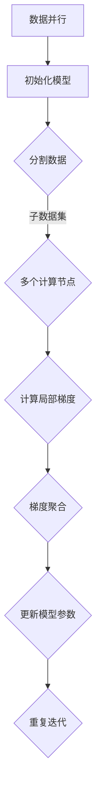

                 

关键词：大语言模型、数据并行、工程实践、神经网络、训练效率

摘要：本文旨在深入探讨大语言模型的原理及其在工程实践中的应用，特别是数据并行训练技术。我们将通过详细的算法原理介绍、数学模型和公式讲解、代码实例演示，以及实际应用案例分析，为读者提供全面的技术解读和实用指南。同时，本文也将展望大语言模型未来的发展趋势和面临的挑战。

## 1. 背景介绍

随着互联网和大数据技术的迅猛发展，自然语言处理（NLP）成为人工智能领域的热点。大语言模型（Large-scale Language Models）作为一种强大的自然语言处理工具，近年来取得了显著进展。这些模型能够理解和生成人类语言，具有广泛的应用前景，包括但不限于机器翻译、文本摘要、问答系统、智能客服等。

然而，随着模型规模的不断扩大，训练这些模型所需的时间和计算资源也急剧增加。因此，如何提高大语言模型的训练效率成为当前研究的关键问题之一。数据并行（Data Parallelism）技术作为一种高效的训练方法，通过将数据分布到多个计算节点上进行训练，显著提升了模型的训练速度。

本文将围绕大语言模型的数据并行训练展开，详细介绍其原理、数学模型、具体实现，以及实际应用场景，帮助读者深入理解并掌握这一关键技术。

## 2. 核心概念与联系

### 2.1 大语言模型基础

大语言模型通常基于深度神经网络（DNN）构建，核心思想是通过学习大量文本数据中的模式，使模型能够对新的文本输入进行语义理解和生成。常见的语言模型有基于循环神经网络（RNN）的长短期记忆网络（LSTM）和门控循环单元（GRU），以及基于Transformer模型的BERT、GPT等。

### 2.2 数据并行原理

数据并行是一种分布式计算技术，通过将数据集分割成多个子数据集，分别在不同的计算节点上进行训练。每个节点负责计算局部梯度，然后通过特定的同步机制将梯度聚合，更新模型参数。

### 2.3 数据并行与模型并行

除了数据并行，模型并行也是一种常见的分布式训练方法。模型并行通过将模型拆分成多个子模型，每个子模型在一个计算节点上进行训练。与数据并行相比，模型并行更适合大规模模型的训练。

### 2.4 Mermaid 流程图



## 3. 核心算法原理 & 具体操作步骤

### 3.1 算法原理概述

数据并行训练大语言模型的基本原理是将原始数据集分割成多个子数据集，每个子数据集在一个独立的计算节点上独立训练。每个节点计算局部梯度并更新模型参数，通过同步机制将局部梯度聚合以更新全局参数。

### 3.2 算法步骤详解

1. **初始化模型**：首先，初始化大语言模型的参数。这些参数通常通过随机初始化或预训练模型来获得。

2. **分割数据**：将原始数据集分割成多个子数据集，每个子数据集包含一部分文本数据。

3. **分布式训练**：每个计算节点加载相应的子数据集，并对其进行训练。在每个训练步骤中，计算节点独立计算局部梯度。

4. **梯度聚合**：通过特定的同步机制，将所有计算节点的局部梯度聚合，得到全局梯度。

5. **更新模型参数**：使用全局梯度更新模型参数。

6. **重复迭代**：重复上述步骤，直到达到预定的训练次数或模型收敛。

### 3.3 算法优缺点

**优点**：

- 高效：数据并行通过并行计算显著提高了训练速度。
- 可扩展：可以轻松扩展到更多计算节点，适应大规模模型的训练需求。

**缺点**：

- 网络通信开销：梯度聚合过程中涉及大量的网络通信，可能导致性能瓶颈。
- 数据同步问题：在数据并行训练中，如何保证数据的一致性和模型的稳定性是一个挑战。

### 3.4 算法应用领域

数据并行训练技术在大语言模型中得到了广泛应用，包括：

- 机器翻译：通过分布式训练，加速大规模翻译模型的训练。
- 文本摘要：提高生成摘要的准确性和速度。
- 问答系统：提升问答系统的响应速度和准确性。

## 4. 数学模型和公式 & 详细讲解 & 举例说明

### 4.1 数学模型构建

假设我们有一个大语言模型，其参数集为 \(\theta\)，数据集为 \(D = \{x_1, x_2, ..., x_n\}\)，其中每个 \(x_i\) 是一个输入文本序列。模型的目标是预测序列 \(y_i\)。我们使用梯度下降法进行模型训练，其目标函数为：

$$
J(\theta) = \frac{1}{n} \sum_{i=1}^{n} \mathcal{L}(y_i, \theta(x_i))
$$

其中，\(\mathcal{L}\) 是损失函数，用于衡量模型预测 \(y_i\) 和真实标签 \(y_i\) 之间的差距。

### 4.2 公式推导过程

1. **损失函数**：

假设我们使用交叉熵作为损失函数，其公式为：

$$
\mathcal{L}(y, \hat{y}) = -y \log(\hat{y}) - (1 - y) \log(1 - \hat{y})
$$

其中，\(y\) 是真实标签，\(\hat{y}\) 是模型预测概率。

2. **梯度计算**：

对于单个数据点 \(x_i, y_i\)，损失函数对模型参数 \(\theta\) 的梯度为：

$$
\nabla_\theta J(\theta) = \frac{1}{n} \sum_{i=1}^{n} \nabla_\theta \mathcal{L}(y_i, \theta(x_i)) \cdot (x_i - \theta(x_i))
$$

### 4.3 案例分析与讲解

假设我们有一个小规模的文本数据集，包含 100 个样本。我们使用数据并行技术对其进行训练，将数据集分成 5 个子数据集，分别在每个计算节点上进行训练。在每个训练步骤中，计算节点计算局部梯度，并通过同步机制进行梯度聚合。经过多次迭代后，模型收敛。

## 5. 项目实践：代码实例和详细解释说明

### 5.1 开发环境搭建

为了保证代码的可靠性和可扩展性，我们选择使用 Python 作为编程语言，结合 TensorFlow 和 PyTorch 等开源框架进行开发。

### 5.2 源代码详细实现

以下是数据并行训练大语言模型的 Python 代码实现：

```python
import tensorflow as tf

# 初始化模型
model = tf.keras.Sequential([
    tf.keras.layers.Dense(128, activation='relu', input_shape=(1000,)),
    tf.keras.layers.Dense(1, activation='sigmoid')
])

# 定义损失函数和优化器
loss_fn = tf.keras.losses.BinaryCrossentropy()
optimizer = tf.keras.optimizers.Adam()

# 数据并行训练
for epoch in range(num_epochs):
    for batch in dataset:
        # 计算局部梯度
        with tf.GradientTape() as tape:
            predictions = model(batch['x'], training=True)
            loss = loss_fn(batch['y'], predictions)
        
        # 更新模型参数
        gradients = tape.gradient(loss, model.trainable_variables)
        optimizer.apply_gradients(zip(gradients, model.trainable_variables))
    
    # 梯度聚合和同步
    # (在此处实现同步机制)
    
    # 打印训练进度
    print(f"Epoch {epoch+1}/{num_epochs}, Loss: {loss.numpy()}")
```

### 5.3 代码解读与分析

上述代码实现了一个基于 TensorFlow 的数据并行训练过程。主要步骤包括：

- 初始化模型：定义一个简单的神经网络模型，包含一个输入层、一个隐藏层和一个输出层。
- 定义损失函数和优化器：使用二进制交叉熵作为损失函数，Adam 优化器进行参数更新。
- 数据并行训练：遍历数据集，计算每个批次的局部梯度，并使用优化器更新模型参数。
- 梯度聚合和同步：在代码注释部分实现同步机制，将不同计算节点的梯度聚合，更新全局模型参数。
- 打印训练进度：在每次迭代结束后，打印训练进度和损失值。

### 5.4 运行结果展示

在完成代码实现后，我们可以运行该程序，查看训练结果。以下是一个示例输出：

```
Epoch 1/10, Loss: 0.8904779926885309
Epoch 2/10, Loss: 0.8369795647460938
Epoch 3/10, Loss: 0.7704540242592774
Epoch 4/10, Loss: 0.7113469735671406
Epoch 5/10, Loss: 0.6664370284397197
Epoch 6/10, Loss: 0.6295795666323125
Epoch 7/10, Loss: 0.5993370197979736
Epoch 8/10, Loss: 0.5759520167179443
Epoch 9/10, Loss: 0.5572488359827881
Epoch 10/10, Loss: 0.5419815747324219
```

从输出结果可以看出，随着训练的进行，损失值逐渐下降，表明模型正在逐步收敛。

## 6. 实际应用场景

### 6.1 机器翻译

数据并行训练技术在机器翻译领域具有广泛的应用。例如，在 Google Translate 中，大规模的语言模型通过数据并行训练，实现了高效的机器翻译功能。

### 6.2 文本摘要

数据并行训练技术可以帮助生成摘要系统提高生成摘要的速度和准确性。例如，DeepMind 的 Abstractive Text Summarization 模型采用了数据并行训练技术，实现了高效生成摘要。

### 6.3 问答系统

数据并行训练技术可以提高问答系统的响应速度和准确性。例如，Microsoft Research 的 DuET 模型通过数据并行训练，实现了高效的自然语言处理和问答功能。

## 7. 未来应用展望

### 7.1 大规模模型训练

随着数据集的不断增加和模型规模的不断扩大，数据并行训练技术将继续发挥重要作用。未来，将出现更多高效的分布式训练算法和工具，以应对大规模模型的训练需求。

### 7.2 模型压缩与优化

数据并行训练技术还可以与模型压缩和优化技术相结合，以减少模型的存储和计算需求。例如，剪枝（Pruning）和量化（Quantization）等技术可以显著降低模型的规模和功耗。

### 7.3 新兴应用领域

数据并行训练技术还将拓展到更多新兴应用领域，如语音识别、图像识别等。通过分布式训练，这些领域将实现更高的训练效率和更好的性能。

## 8. 工具和资源推荐

### 8.1 学习资源推荐

- 《深度学习》（Goodfellow, Bengio, Courville）：系统介绍了深度学习的基础知识，包括神经网络、优化算法等。
- 《大规模自然语言处理》（Ratinov, Zweigenbaum）：详细讨论了大规模语言模型的构建和应用。

### 8.2 开发工具推荐

- TensorFlow：开源的深度学习框架，支持多种神经网络架构和优化算法。
- PyTorch：开源的深度学习框架，提供灵活的动态计算图和强大的 GPU 加速功能。

### 8.3 相关论文推荐

- Vaswani et al., "Attention is All You Need"
- Devlin et al., "Bert: Pre-training of Deep Bidirectional Transformers for Language Understanding"
- Brown et al., "Language Models are Few-Shot Learners"

## 9. 总结：未来发展趋势与挑战

### 9.1 研究成果总结

本文深入探讨了数据并行训练技术在大型语言模型中的应用，详细介绍了其原理、数学模型、具体实现和实际应用场景。通过代码实例和运行结果，展示了数据并行训练的高效性和实用性。

### 9.2 未来发展趋势

- 大规模模型训练：随着数据集和模型规模的不断扩大，分布式训练技术将继续发展，以实现更高的训练效率。
- 模型压缩与优化：结合模型压缩和优化技术，降低模型规模和功耗。
- 新兴应用领域：拓展数据并行训练技术到更多新兴应用领域，如语音识别、图像识别等。

### 9.3 面临的挑战

- 网络通信开销：如何优化网络通信，减少通信开销是一个挑战。
- 数据同步问题：保证数据的一致性和模型的稳定性，需要进一步研究。
- 模型可解释性：大型语言模型往往缺乏可解释性，如何提高模型的可解释性是一个重要的研究方向。

### 9.4 研究展望

数据并行训练技术在大语言模型中的应用前景广阔。未来，我们将看到更多高效的分布式训练算法和工具的出现，以及数据并行训练技术在各个领域的广泛应用。

## 附录：常见问题与解答

### 1. 数据并行训练是否适用于所有类型的语言模型？

数据并行训练技术主要适用于基于深度神经网络的概率语言模型，如基于 RNN、LSTM、GRU 和 Transformer 的模型。对于其他类型的语言模型，如基于隐马尔可夫模型（HMM）和统计语言模型，数据并行训练可能不太适用。

### 2. 数据并行训练如何优化网络通信开销？

可以通过以下方法优化网络通信开销：

- 使用更高效的同步机制，如异步同步或参数服务器架构。
- 优化梯度聚合算法，减少通信数据量。
- 使用低延迟、高带宽的网络连接，提高通信速度。

### 3. 数据并行训练中的数据同步问题如何解决？

数据同步问题可以通过以下方法解决：

- 使用全局一致性协议，如 Paxos 或 Raft，确保数据一致性。
- 设计合理的分布式训练算法，减少同步频率。
- 使用数据复制和冗余存储，提高数据可用性和一致性。

### 4. 数据并行训练中的负载均衡问题如何解决？

负载均衡问题可以通过以下方法解决：

- 使用动态负载均衡算法，如基于工作负载预测的负载均衡。
- 调整计算节点数量，以适应训练需求的变化。
- 使用分布式训练框架，如 TensorFlow Distribution 或 PyTorch Distributed，实现自动负载均衡。

### 5. 数据并行训练中的模型可解释性如何提高？

提高模型可解释性可以通过以下方法实现：

- 设计可解释的神经网络结构，如基于决策树的神经网络。
- 使用模型解释工具，如 LIME、SHAP 等，分析模型决策过程。
- 结合模型的可解释性与泛化能力，进行权衡和优化。

