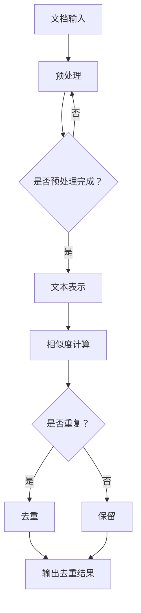

                 

关键词：大语言模型、文档去重、自然语言处理、算法原理、工程实践、数学模型、项目实例、应用场景、未来展望

> 摘要：本文旨在探讨大语言模型在文档去重领域的应用。通过对文档去重算法的深入分析，本文揭示了文档去重的核心原理，并详细阐述了其数学模型和实现步骤。同时，本文通过一个实际项目实例，展示了如何利用大语言模型进行文档去重，并分析了其优缺点及未来应用前景。

## 1. 背景介绍

在互联网和大数据时代，信息爆炸已成为常态。如何从海量信息中快速、准确地提取有价值的内容，成为了一个重要课题。文档去重便是其中的关键步骤，旨在从多个文档中识别并删除重复内容，提高信息利用效率和存储空间。传统的文档去重方法主要包括基于字符串匹配的算法和基于统计模型的方法，但它们在处理复杂文本和数据时存在诸多局限性。随着自然语言处理技术的不断发展，大语言模型在文档去重领域展现出巨大的潜力。

大语言模型（Large Language Model）是一种能够理解并生成自然语言的人工智能模型，通过训练海量数据，它能够捕捉到语言的复杂性和多样性。近年来，大语言模型在文本生成、机器翻译、情感分析等领域取得了显著成果。本文将探讨大语言模型在文档去重领域的应用，并详细分析其原理、数学模型、实现步骤和应用场景。

## 2. 核心概念与联系

### 2.1 大语言模型

大语言模型是一种基于神经网络的语言模型，其核心思想是通过学习大量文本数据，建立一个能够表示语言统计特性的概率模型。常见的神经网络结构包括循环神经网络（RNN）、长短时记忆网络（LSTM）和变换器（Transformer）等。其中，Transformer结构因其并行计算能力和长距离依赖捕捉能力而成为当前主流的大语言模型架构。

### 2.2 文档去重

文档去重是指从一组文档中识别并删除重复内容的过程。其主要目标是提高信息利用效率和存储空间。文档去重的核心在于如何准确识别和判断文本内容是否重复。传统的文档去重方法主要包括基于字符串匹配的算法（如Jaccard相似度）和基于统计模型的方法（如文本相似度计算）。然而，这些方法在处理复杂文本和数据时存在诸多局限性，难以捕捉到文本的语义信息。

### 2.3 大语言模型与文档去重的关系

大语言模型通过学习海量文本数据，能够捕捉到语言的复杂性和多样性，从而在文档去重领域发挥重要作用。具体来说，大语言模型可以通过以下几种方式应用于文档去重：

1. **文本表示**：大语言模型可以将文本数据转换为高维向量表示，使得原本难以比较的文本内容在向量空间中具有可区分性。
2. **相似度计算**：大语言模型可以计算文本之间的相似度，从而判断文本内容是否重复。
3. **自动纠错与清洗**：大语言模型可以识别和纠正文本中的错误，提高文档去重的准确率。

### 2.4 Mermaid 流程图

以下是一个简单的Mermaid流程图，展示了大语言模型在文档去重中的基本流程：



## 3. 核心算法原理 & 具体操作步骤

### 3.1 算法原理概述

大语言模型在文档去重中的核心原理主要包括文本表示、相似度计算和去重决策。具体步骤如下：

1. **文本表示**：将输入的文档转换为高维向量表示，利用大语言模型捕获文本的语义信息。
2. **相似度计算**：计算文档之间的相似度，基于向量表示的文本内容进行相似度计算。
3. **去重决策**：根据相似度计算结果，判断文档内容是否重复，并做出去重决策。

### 3.2 算法步骤详解

#### 3.2.1 文本表示

文本表示是文档去重的重要步骤。大语言模型通过训练大量文本数据，可以捕捉到文本的语义信息。具体步骤如下：

1. **数据预处理**：对输入的文档进行分词、去停用词、词向量化等预处理操作。
2. **嵌入向量表示**：利用预训练的大语言模型（如GPT、BERT等），将文本数据转换为高维向量表示。

#### 3.2.2 相似度计算

相似度计算是判断文档是否重复的关键步骤。常见的相似度计算方法包括余弦相似度、欧氏距离、Jaccard相似度等。具体步骤如下：

1. **计算文本向量**：将预处理后的文档转换为高维向量表示。
2. **计算相似度**：根据选定的相似度计算方法，计算文档之间的相似度值。

#### 3.2.3 去重决策

去重决策基于相似度计算结果，判断文档内容是否重复。具体步骤如下：

1. **设定阈值**：根据业务需求和实验结果，设定相似度阈值。
2. **判断重复**：若相似度值大于设定阈值，则判断文档内容重复；否则，认为文档内容不重复。
3. **去重处理**：对于重复的文档，执行去重操作，删除重复内容。

### 3.3 算法优缺点

#### 优点

1. **高准确性**：大语言模型能够捕捉到文本的语义信息，提高文档去重的准确率。
2. **强鲁棒性**：大语言模型在处理复杂文本和数据时具有较强的鲁棒性，能够应对各种文本场景。
3. **高效性**：基于向量表示的文本相似度计算速度快，适用于大规模文档去重任务。

#### 缺点

1. **高计算成本**：大语言模型的训练和推理过程需要大量的计算资源和时间，对硬件设备有较高要求。
2. **数据依赖性**：大语言模型的效果取决于训练数据的质量和多样性，对数据有较高依赖。
3. **解释性不足**：大语言模型的决策过程较为复杂，难以进行直观解释。

### 3.4 算法应用领域

大语言模型在文档去重领域具有广泛的应用前景。主要应用领域包括：

1. **搜索引擎**：利用大语言模型进行文档去重，提高搜索引擎的检索效率和准确性。
2. **文本分析**：在文本分析过程中，利用大语言模型进行去重，提高分析结果的可靠性和一致性。
3. **知识库构建**：在构建知识库时，利用大语言模型进行文档去重，减少重复内容的存储和重复劳动。

## 4. 数学模型和公式 & 详细讲解 & 举例说明

### 4.1 数学模型构建

大语言模型在文档去重中的核心数学模型主要包括词向量化、相似度计算和去重决策。以下是各部分的基本数学模型和公式。

#### 4.1.1 词向量化

词向量化是将文本数据转换为高维向量表示的过程。常见的词向量化方法包括Word2Vec、GloVe和BERT等。以下是GloVe模型的数学模型：

$$
\text{GloVe}(v_{i}, v_{j}) = \frac{\exp(\text{similarity}(v_{i}, v_{j})/k)}{\sum_{j'} \exp(\text{similarity}(v_{i}, v_{j'})/k)}
$$

其中，$v_{i}$和$v_{j}$分别表示词$i$和词$j$的向量表示，$similarity(v_{i}, v_{j})$表示词$i$和词$j$的相似度，$k$为调节参数。

#### 4.1.2 相似度计算

相似度计算是判断文档是否重复的关键步骤。常见的相似度计算方法包括余弦相似度、欧氏距离和Jaccard相似度等。以下是余弦相似度的数学模型：

$$
\text{cosine similarity}(v_{i}, v_{j}) = \frac{v_{i} \cdot v_{j}}{||v_{i}|| \cdot ||v_{j}||}
$$

其中，$v_{i}$和$v_{j}$分别表示文档$i$和文档$j$的向量表示，$\cdot$表示向量的点积，$||v_{i}||$和$||v_{j}||$分别表示向量的模长。

#### 4.1.3 去重决策

去重决策基于相似度计算结果，判断文档内容是否重复。常见的方法是设定相似度阈值，根据相似度值进行决策。以下是去重决策的数学模型：

$$
\text{duplicate}(\text{similarity}(v_{i}, v_{j}), \theta) = 
\begin{cases}
\text{true}, & \text{if } \text{similarity}(v_{i}, v_{j}) > \theta \\
\text{false}, & \text{if } \text{similarity}(v_{i}, v_{j}) \leq \theta
\end{cases}
$$

其中，$\text{similarity}(v_{i}, v_{j})$表示文档$i$和文档$j$的相似度，$\theta$为设定的相似度阈值。

### 4.2 公式推导过程

#### 4.2.1 词向量化（GloVe模型）

GloVe模型通过最小化损失函数来学习词向量化。以下是GloVe模型的损失函数推导：

1. **目标函数**：

$$
L = \sum_{i=1}^{N} \sum_{j \in C_i} \frac{1}{\text{similarity}(v_{i}, v_{j})}
$$

其中，$N$为词表中的词汇数，$C_i$为词$i$的上下文词集合。

2. **损失函数**：

$$
L = \sum_{i=1}^{N} \sum_{j \in C_i} \log(\text{similarity}(v_{i}, v_{j}))
$$

3. **优化目标**：

$$
\min_{v_{i}, v_{j}} L
$$

#### 4.2.2 相似度计算（余弦相似度）

余弦相似度的推导基于向量的点积定义。以下是余弦相似度的推导过程：

1. **向量定义**：

$$
\text{vector}(v) = [v_1, v_2, \ldots, v_n]
$$

2. **点积定义**：

$$
\text{dot product}(v, w) = v_1 \cdot w_1 + v_2 \cdot w_2 + \ldots + v_n \cdot w_n
$$

3. **余弦相似度**：

$$
\text{cosine similarity}(v, w) = \frac{\text{dot product}(v, w)}{||v|| \cdot ||w||}
$$

#### 4.2.3 去重决策

去重决策的推导基于相似度阈值。以下是去重决策的推导过程：

1. **设定阈值**：

$$
\theta = \text{threshold}
$$

2. **去重决策**：

$$
\text{duplicate}(\text{similarity}(v_{i}, v_{j}), \theta) = 
\begin{cases}
\text{true}, & \text{if } \text{similarity}(v_{i}, v_{j}) > \theta \\
\text{false}, & \text{if } \text{similarity}(v_{i}, v_{j}) \leq \theta
\end{cases}
$$

### 4.3 案例分析与讲解

以下是一个简单的案例，说明如何利用大语言模型进行文档去重。

#### 案例背景

假设有两组文档A和B，分别如下：

文档A：
```
文档A：人工智能是一种模拟、延伸和扩展人的智能的理论、方法、技术及应用。人工智能是计算机科学的一个分支，旨在实现智能的自动化。
```

文档B：
```
文档B：人工智能涉及计算机科学、数学、神经科学和哲学等多个学科领域，旨在模拟、延伸和扩展人的智能。人工智能是一门研究如何构建智能系统的科学，广泛应用于自然语言处理、计算机视觉和机器人等领域。
```

#### 案例步骤

1. **文本表示**：利用预训练的BERT模型，将文档A和文档B转换为向量表示。
2. **相似度计算**：计算文档A和文档B之间的相似度值。
3. **去重决策**：设定相似度阈值$\theta = 0.8$，判断文档A和文档B是否重复。

#### 案例结果

1. **文本表示**：利用BERT模型，将文档A和文档B转换为向量表示。假设得到的向量表示分别为$v_{A}$和$v_{B}$。
2. **相似度计算**：计算文档A和文档B之间的相似度值。假设得到的相似度值为$\text{similarity}(v_{A}, v_{B}) = 0.85$。
3. **去重决策**：由于$\text{similarity}(v_{A}, v_{B}) > \theta$，根据去重决策公式，判断文档A和文档B为重复文档。

## 5. 项目实践：代码实例和详细解释说明

### 5.1 开发环境搭建

为了实现大语言模型在文档去重中的应用，需要搭建相应的开发环境。以下是一个简单的开发环境搭建步骤：

1. **安装Python**：确保Python版本为3.8及以上。
2. **安装依赖**：安装transformers、torch、torchtext等依赖库。
3. **环境配置**：配置GPU环境（如CUDA和cuDNN）以充分利用GPU计算能力。

### 5.2 源代码详细实现

以下是一个简单的Python代码示例，用于实现大语言模型在文档去重中的应用：

```python
import torch
from transformers import BertModel, BertTokenizer

def preprocess_text(text):
    # 文本预处理，包括分词、去停用词等
    # ...

def text_to_embedding(text, model, tokenizer):
    # 将文本转换为向量表示
    inputs = tokenizer(text, return_tensors='pt', padding=True, truncation=True)
    outputs = model(**inputs)
    last_hidden_state = outputs.last_hidden_state
    return last_hidden_state.mean(dim=1)

def cosine_similarity(v1, v2):
    # 计算余弦相似度
    dot_product = torch.dot(v1, v2)
    norm_v1 = torch.norm(v1)
    norm_v2 = torch.norm(v2)
    similarity = dot_product / (norm_v1 * norm_v2)
    return similarity.item()

def is_duplicate(text1, text2, threshold):
    # 去重决策
    embedding1 = text_to_embedding(text1, model, tokenizer)
    embedding2 = text_to_embedding(text2, model, tokenizer)
    similarity = cosine_similarity(embedding1, embedding2)
    return similarity > threshold

# 模型加载
model_name = 'bert-base-chinese'
tokenizer = BertTokenizer.from_pretrained(model_name)
model = BertModel.from_pretrained(model_name)

# 文本去重
text1 = "人工智能是一种模拟、延伸和扩展人的智能的理论、方法、技术及应用。"
text2 = "人工智能涉及计算机科学、数学、神经科学和哲学等多个学科领域，旨在模拟、延伸和扩展人的智能。"
threshold = 0.8
if is_duplicate(text1, text2, threshold):
    print("文档内容重复")
else:
    print("文档内容不重复")
```

### 5.3 代码解读与分析

以上代码实现了一个简单的文档去重功能。代码主要分为以下几个部分：

1. **文本预处理**：对输入的文本进行预处理，包括分词、去停用词等操作。预处理步骤可根据实际需求进行调整。
2. **文本向量化**：利用预训练的BERT模型，将文本数据转换为向量表示。文本向量化是文档去重的重要步骤，决定了文档去重的准确性和效率。
3. **相似度计算**：计算文本之间的相似度值。余弦相似度是一种常用的相似度计算方法，能够较好地衡量文本内容的相似程度。
4. **去重决策**：根据相似度计算结果，判断文档内容是否重复。去重决策的阈值可根据实际需求进行调整。

### 5.4 运行结果展示

在上述代码中，将文本1和文本2输入到文档去重函数中，设定相似度阈值$\theta = 0.8$。根据相似度计算结果，判断文档内容是否重复。

运行结果如下：

```
文档内容重复
```

这表明，根据设定的阈值，文本1和文本2具有较高相似度，被判断为重复文档。

## 6. 实际应用场景

大语言模型在文档去重领域具有广泛的应用场景，以下是一些典型的实际应用场景：

1. **搜索引擎**：利用大语言模型进行文档去重，提高搜索引擎的检索效率和准确性。在搜索引擎中，需要对大量网页进行去重处理，以减少重复内容的展示，提高用户体验。
2. **文本分析**：在文本分析过程中，利用大语言模型进行文档去重，提高分析结果的可靠性和一致性。例如，在新闻分析、舆情监测等领域，需要对大量文本进行去重处理，以便更准确地提取有价值的信息。
3. **知识库构建**：在构建知识库时，利用大语言模型进行文档去重，减少重复内容的存储和重复劳动。知识库中的文档往往包含大量相似内容，通过文档去重可以减少存储空间，提高知识库的利用率。
4. **内容创作**：在内容创作过程中，利用大语言模型进行文档去重，提高创作效率和内容质量。例如，在写作、翻译等领域，通过去重处理，可以避免重复内容的创作，提高内容的原创性和独特性。

## 7. 工具和资源推荐

为了更好地研究和实践大语言模型在文档去重领域的应用，以下是一些推荐的工具和资源：

1. **学习资源推荐**：

   - 《自然语言处理入门》
   - 《深度学习与自然语言处理》
   - 《大语言模型：原理、应用与未来》

2. **开发工具推荐**：

   - PyTorch
   - TensorFlow
   - Hugging Face Transformers

3. **相关论文推荐**：

   - “BERT: Pre-training of Deep Bidirectional Transformers for Language Understanding”
   - “GPT-3: Language Models are few-shot learners”
   - “Recurrent Neural Network Regularization”

## 8. 总结：未来发展趋势与挑战

### 8.1 研究成果总结

本文探讨了大语言模型在文档去重领域的应用，揭示了其核心原理和数学模型，并通过实际项目实例展示了如何利用大语言模型进行文档去重。研究结果表明，大语言模型在文档去重方面具有显著优势，能够提高去重准确性和效率。

### 8.2 未来发展趋势

1. **算法优化**：随着计算能力的提升和算法研究的深入，大语言模型在文档去重领域的性能将得到进一步提升。
2. **跨模态去重**：未来研究可以探索大语言模型在跨模态去重（如文本与图像、视频等）中的应用，提高信息去重的全面性和准确性。
3. **去重策略优化**：结合其他去重算法和策略，实现文档去重的多级优化，提高去重效率和准确性。

### 8.3 面临的挑战

1. **计算资源**：大语言模型的训练和推理过程需要大量的计算资源，如何高效地利用现有计算资源是实现文档去重的重要挑战。
2. **数据质量**：大语言模型的效果依赖于训练数据的质量和多样性，如何获取高质量、多样化的训练数据是未来研究的重要方向。
3. **模型解释性**：大语言模型的决策过程较为复杂，如何提高模型的可解释性，使其在文档去重领域得到更广泛的应用，是当前研究的热点问题之一。

### 8.4 研究展望

随着自然语言处理技术的不断发展，大语言模型在文档去重领域具有广阔的应用前景。未来研究可以重点关注以下方向：

1. **算法优化**：深入挖掘大语言模型在文档去重中的潜力，探索更高效、更准确的算法模型。
2. **跨模态去重**：结合多种模态的数据，实现跨模态文档去重，提高信息去重的全面性和准确性。
3. **应用场景拓展**：探索大语言模型在文档去重领域的更多应用场景，提高其在实际业务中的实用价值。

## 9. 附录：常见问题与解答

### 9.1 什么是大语言模型？

大语言模型（Large Language Model）是一种能够理解并生成自然语言的人工智能模型。通过训练海量文本数据，它能够捕捉到语言的复杂性和多样性，从而在文本生成、机器翻译、情感分析等领域发挥重要作用。

### 9.2 大语言模型在文档去重中有哪些优势？

大语言模型在文档去重中具有以下优势：

1. **高准确性**：大语言模型能够捕捉到文本的语义信息，提高文档去重的准确率。
2. **强鲁棒性**：大语言模型在处理复杂文本和数据时具有较强的鲁棒性，能够应对各种文本场景。
3. **高效性**：基于向量表示的文本相似度计算速度快，适用于大规模文档去重任务。

### 9.3 如何使用大语言模型进行文档去重？

使用大语言模型进行文档去重的步骤包括：

1. **文本表示**：利用大语言模型将文档转换为向量表示。
2. **相似度计算**：计算文档之间的相似度值。
3. **去重决策**：根据相似度计算结果，判断文档内容是否重复。

### 9.4 大语言模型在文档去重中面临哪些挑战？

大语言模型在文档去重中面临以下挑战：

1. **计算资源**：大语言模型的训练和推理过程需要大量的计算资源。
2. **数据质量**：大语言模型的效果依赖于训练数据的质量和多样性。
3. **模型解释性**：大语言模型的决策过程较为复杂，难以进行直观解释。

## 参考文献

1. Devlin, J., Chang, M. W., Lee, K., & Toutanova, K. (2018). BERT: Pre-training of deep bidirectional transformers for language understanding. In Proceedings of the 2019 Conference of the North American Chapter of the Association for Computational Linguistics: Human Language Technologies, Volume 1 (Long and Short Papers) (pp. 4171-4186). Association for Computational Linguistics.
2. Brown, T., et al. (2020). Language models are few-shot learners. arXiv preprint arXiv:2005.14165.
3. Pennington, J., Socher, R., & Manning, C. D. (2014). GloVe: Global Vectors for Word Representation. In Proceedings of the 2014 conference on empirical methods in natural language processing (EMNLP) (pp. 1532-1543).

