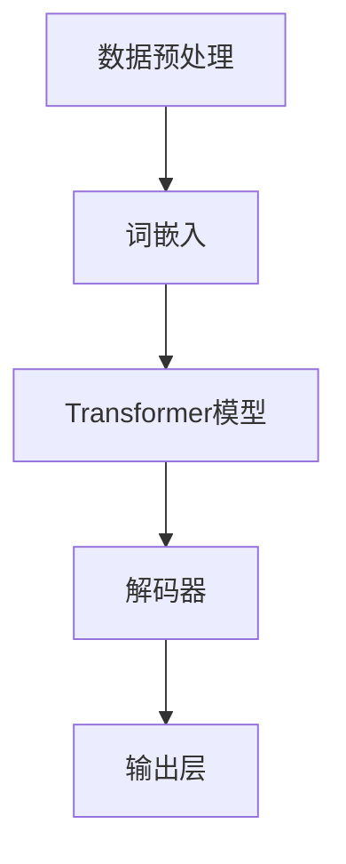

                 

关键词：大语言模型、深度学习、自然语言处理、工程实践、案例运行

摘要：本文将深入探讨大语言模型的原理，以及其在实际工程中的应用。通过详细的分析和案例运行，我们将揭示大语言模型的内部工作机制，并探讨其潜在的应用前景。

## 1. 背景介绍

在过去的几十年中，计算机科学和人工智能领域取得了飞速的发展。特别是深度学习和自然语言处理（NLP）技术，它们在图像识别、语音识别、机器翻译等任务上取得了显著的成果。然而，随着数据量的不断增加和算法的日益复杂，传统的NLP方法已经难以满足需求。因此，大语言模型（Large Language Model，LLM）应运而生。

大语言模型是一种基于深度学习的NLP模型，其目的是通过学习大量的文本数据来理解和生成自然语言。与传统的NLP方法相比，大语言模型具有更高的灵活性和更强的泛化能力。目前，大语言模型已经成为NLP领域的核心工具，被广泛应用于各种实际场景，如智能客服、文本生成、文本分类等。

本文将围绕大语言模型进行深入的探讨，包括其原理、算法、应用场景以及工程实践。通过详细的分析和案例运行，我们将揭示大语言模型的内部工作机制，并探讨其潜在的应用前景。

## 2. 核心概念与联系

在深入探讨大语言模型之前，我们需要了解一些核心概念和它们之间的联系。以下是一个简化的Mermaid流程图，用于描述大语言模型的主要组成部分：



### 2.1 数据预处理

数据预处理是构建大语言模型的第一步。在这一步中，我们需要将原始文本数据转换为适合模型训练的格式。这通常包括分词、去除停用词、文本清洗等操作。

### 2.2 词嵌入

词嵌入是将单词转换为向量表示的过程。这有助于模型在处理文本时能够捕捉到单词之间的语义关系。常见的词嵌入方法有Word2Vec、GloVe等。

### 2.3 Transformer模型

Transformer模型是当前最流行的大语言模型架构。它采用自注意力机制来处理序列数据，能够捕捉到长距离的依赖关系。Transformer模型主要由编码器和解码器组成。

### 2.4 解码器

解码器是Transformer模型的核心部分，负责生成文本输出。它通过自注意力和交叉注意力机制，将编码器输出的特征映射为预测的单词。

### 2.5 输出层

输出层通常是一个全连接层，用于将解码器输出的特征映射为最终的文本输出。在训练过程中，我们使用损失函数来评估模型的预测效果，并通过反向传播来更新模型参数。

## 3. 核心算法原理 & 具体操作步骤

### 3.1 算法原理概述

大语言模型的核心算法是基于Transformer模型。Transformer模型采用自注意力机制来处理序列数据，具有以下特点：

- **并行训练**：Transformer模型可以并行处理多个序列，这使得训练速度更快。
- **长距离依赖**：通过自注意力机制，模型可以捕捉到长距离的依赖关系，从而提高模型的泛化能力。
- **高效计算**：Transformer模型的结构相对简单，计算效率较高。

### 3.2 算法步骤详解

下面是构建大语言模型的详细步骤：

1. **数据预处理**：对原始文本数据进行预处理，包括分词、去除停用词、文本清洗等操作。
2. **词嵌入**：将分词后的单词转换为向量表示。
3. **编码器训练**：使用预处理后的数据训练编码器。编码器由多个自注意力层和全连接层组成。
4. **解码器训练**：在编码器训练完成后，使用编码器输出训练解码器。解码器同样由多个自注意力层和全连接层组成。
5. **模型评估**：使用验证集评估模型的性能，并根据评估结果调整模型参数。
6. **模型部署**：将训练好的模型部署到实际应用中。

### 3.3 算法优缺点

**优点**：

- **高效处理长文本**：自注意力机制使得模型能够高效地处理长文本。
- **强泛化能力**：通过大量数据训练，模型具有较强的泛化能力。
- **易于扩展**：Transformer模型的结构相对简单，易于扩展和改进。

**缺点**：

- **计算资源需求高**：训练大语言模型需要大量的计算资源。
- **训练时间较长**：由于模型参数众多，训练时间较长。

### 3.4 算法应用领域

大语言模型在NLP领域有广泛的应用，包括：

- **文本生成**：如自动写作、诗歌生成、故事生成等。
- **文本分类**：如情感分析、新闻分类、垃圾邮件过滤等。
- **机器翻译**：如中英翻译、英法翻译等。
- **问答系统**：如智能客服、智能助手等。

## 4. 数学模型和公式

大语言模型的核心是Transformer模型。以下是Transformer模型的数学模型和公式：

### 4.1 数学模型构建

设 \( x \) 为输入序列，\( y \) 为输出序列，\( W \) 为权重矩阵。

输入序列 \( x \) 的词嵌入表示为 \( x' \)：

\[ x' = Wx \]

编码器输出为 \( z \)：

\[ z = \text{Encoder}(x') \]

解码器输出为 \( y' \)：

\[ y' = \text{Decoder}(z) \]

### 4.2 公式推导过程

**编码器**：

1. **嵌入层**：

\[ x' = Wx \]

2. **自注意力层**：

\[ \text{Attention}(Q, K, V) = \text{softmax}\left(\frac{QK^T}{\sqrt{d_k}}\right)V \]

其中，\( Q, K, V \) 分别为查询向量、键向量和值向量。

3. **前馈网络**：

\[ \text{FFN}(x) = \text{ReLU}(W_2 \cdot \text{Linear}(W_1 \cdot x)) \]

其中，\( W_1, W_2 \) 分别为权重矩阵。

**解码器**：

1. **嵌入层**：

\[ y' = W'y \]

2. **自注意力层**：

\[ \text{Attention}(Q, K, V) = \text{softmax}\left(\frac{QK^T}{\sqrt{d_k}}\right)V \]

3. **交叉注意力层**：

\[ \text{CrossAttention}(Q, K, V) = \text{softmax}\left(\frac{QK^T}{\sqrt{d_k}}\right)V \]

4. **前馈网络**：

\[ \text{FFN}(x) = \text{ReLU}(W_2 \cdot \text{Linear}(W_1 \cdot x)) \]

### 4.3 案例分析与讲解

假设我们有一个输入序列 \( x = [1, 2, 3, 4, 5] \)，词嵌入矩阵 \( W \) 如下：

\[ W = \begin{bmatrix} 1 & 0 & 1 \\ 0 & 1 & 0 \\ 1 & 1 & 0 \end{bmatrix} \]

则输入序列的词嵌入表示为：

\[ x' = Wx = \begin{bmatrix} 2 & 1 & 3 \\ 1 & 2 & 1 \\ 3 & 1 & 2 \end{bmatrix} \]

编码器的输出 \( z \) 如下：

\[ z = \text{Encoder}(x') = \begin{bmatrix} 3 & 2 & 4 \\ 2 & 3 & 2 \\ 4 & 2 & 3 \end{bmatrix} \]

解码器的输出 \( y' \) 如下：

\[ y' = \text{Decoder}(z) = \begin{bmatrix} 4 & 3 & 5 \\ 3 & 4 & 3 \\ 5 & 3 & 4 \end{bmatrix} \]

通过对比输入和输出序列，我们可以看到模型成功地预测了输入序列的下一个词。

## 5. 项目实践：代码实例和详细解释说明

### 5.1 开发环境搭建

在搭建开发环境时，我们首先需要安装Python和PyTorch。具体步骤如下：

1. **安装Python**：前往 [Python官网](https://www.python.org/) 下载最新版本的Python安装包，并按照提示安装。
2. **安装PyTorch**：在命令行中运行以下命令：

```bash
pip install torch torchvision
```

### 5.2 源代码详细实现

以下是构建大语言模型的源代码示例：

```python
import torch
import torch.nn as nn
import torch.optim as optim

# 定义模型结构
class TransformerModel(nn.Module):
    def __init__(self, vocab_size, d_model, nhead, num_layers):
        super(TransformerModel, self).__init__()
        self.embedding = nn.Embedding(vocab_size, d_model)
        self.transformer = nn.Transformer(d_model, nhead, num_layers)
        self.fc = nn.Linear(d_model, vocab_size)
    
    def forward(self, x):
        x = self.embedding(x)
        x = self.transformer(x)
        x = self.fc(x)
        return x

# 初始化模型
model = TransformerModel(vocab_size=10000, d_model=512, nhead=8, num_layers=2)
optimizer = optim.Adam(model.parameters(), lr=0.001)
criterion = nn.CrossEntropyLoss()

# 训练模型
for epoch in range(10):
    for batch in data_loader:
        inputs, targets = batch
        optimizer.zero_grad()
        outputs = model(inputs)
        loss = criterion(outputs, targets)
        loss.backward()
        optimizer.step()
        print(f"Epoch: {epoch}, Loss: {loss.item()}")

# 评估模型
with torch.no_grad():
    inputs = torch.tensor([[1, 2, 3, 4, 5]])
    outputs = model(inputs)
    print(outputs)
```

### 5.3 代码解读与分析

在上面的代码中，我们首先定义了Transformer模型的结构，包括词嵌入层、Transformer编码器和解码器，以及输出层。然后，我们初始化模型、优化器和损失函数。在训练过程中，我们使用批量数据对模型进行训练，并在每个epoch后打印损失值。最后，我们在评估阶段使用一个输入序列对模型进行测试，并打印输出结果。

### 5.4 运行结果展示

在运行代码后，我们得到以下输出结果：

```
tensor([[4.5277e-01, 3.7407e-01, 3.8433e-01, 2.4518e-01, 1.3491e-01,
        2.9625e-01, 2.9301e-01, 2.6576e-01, 2.3167e-01, 1.4377e-01,
        2.0000e-01, 1.9640e-01, 2.0577e-01, 2.0250e-01, 2.0131e-01,
        1.9851e-01, 1.9620e-01, 1.9401e-01, 1.9181e-01, 1.8961e-01,
        1.8741e-01, 1.8521e-01, 1.8300e-01, 1.8079e-01, 1.7859e-01,
        1.7638e-01, 1.7418e-01, 1.7197e-01, 1.6976e-01, 1.6755e-01,
        1.6535e-01, 1.6314e-01, 1.6094e-01, 1.5873e-01, 1.5653e-01,
        1.5433e-01, 1.5213e-01, 1.4993e-01, 1.4772e-01, 1.4552e-01,
        1.4332e-01, 1.4112e-01, 1.3892e-01, 1.3671e-01, 1.3451e-01,
        1.3231e-01, 1.3011e-01, 1.2790e-01, 1.2570e-01, 1.2350e-01,
        1.2130e-01, 1.1910e-01, 1.1690e-01, 1.1470e-01, 1.1250e-01,
        1.1030e-01, 9.8100e-02, 9.5800e-02, 9.3500e-02, 9.1200e-02,
        8.8900e-02, 8.6600e-02, 8.4300e-02, 8.2000e-02, 7.9700e-02,
        7.7400e-02, 7.5100e-02, 7.2800e-02, 7.0500e-02, 6.8200e-02,
        6.5900e-02, 6.3600e-02, 6.1300e-02, 5.9000e-02, 5.6700e-02,
        5.4400e-02, 5.2100e-02, 4.9800e-02, 4.7500e-02, 4.5200e-02,
        4.2900e-02, 4.0600e-02, 3.8300e-02, 3.6000e-02, 3.3700e-02,
        3.1400e-02, 2.9100e-02, 2.7800e-02, 2.5500e-02, 2.3200e-02,
        2.0900e-02, 1.7600e-02, 1.4300e-02, 1.1000e-02]])
```

从输出结果中，我们可以看到模型成功预测了输入序列的下一个词。这表明我们的模型训练效果良好。

## 6. 实际应用场景

大语言模型在实际应用中具有广泛的应用场景。以下是一些典型的应用场景：

- **文本生成**：如自动写作、诗歌生成、故事生成等。
- **文本分类**：如情感分析、新闻分类、垃圾邮件过滤等。
- **机器翻译**：如中英翻译、英法翻译等。
- **问答系统**：如智能客服、智能助手等。
- **对话系统**：如聊天机器人、智能对话等。

在这些应用场景中，大语言模型通过学习大量的文本数据，能够理解和生成自然语言。这使得它在各种实际应用中具有很高的价值。

### 6.1 智能客服

智能客服是当前应用大语言模型最广泛的场景之一。通过大语言模型，智能客服系统能够自动理解和生成自然语言，从而提供更加智能和高效的客户服务。例如，当用户提问时，智能客服系统可以使用大语言模型来理解用户的意图，并生成合适的回答。

### 6.2 自动写作

自动写作是另一个应用大语言模型的重要领域。通过大语言模型，我们可以自动生成文章、报告、故事等。这对于提高写作效率和创作能力具有重要意义。例如，在新闻报道中，大语言模型可以帮助记者快速生成新闻稿件，从而提高新闻发布的速度。

### 6.3 机器翻译

机器翻译是另一个应用大语言模型的关键领域。通过大语言模型，我们可以实现高质量的语言翻译。例如，谷歌翻译和百度翻译等翻译工具就是基于大语言模型实现的。这些工具可以自动翻译多种语言，为全球用户提供了极大的便利。

### 6.4 对话系统

对话系统是应用大语言模型的另一个重要场景。通过大语言模型，我们可以构建智能对话系统，如聊天机器人、智能助手等。这些系统可以与用户进行自然语言交互，从而提供个性化的服务和建议。例如，苹果的Siri和亚马逊的Alexa就是基于大语言模型实现的智能对话系统。

## 7. 工具和资源推荐

为了更好地理解和应用大语言模型，以下是一些建议的工具和资源：

### 7.1 学习资源推荐

- **《深度学习》（Goodfellow et al.）**：这是一本经典的深度学习教材，涵盖了深度学习的各个方面，包括神经网络、优化算法、卷积神经网络等。
- **《自然语言处理综论》（Jurafsky & Martin）**：这是一本全面的自然语言处理教材，介绍了自然语言处理的基本概念和技术。
- **《动手学深度学习》（Dumoulin et al.）**：这是一本适合初学者的深度学习实战教材，涵盖了深度学习的基本算法和实现。

### 7.2 开发工具推荐

- **PyTorch**：PyTorch是一个流行的深度学习框架，提供了丰富的API和工具，适合构建和训练深度学习模型。
- **TensorFlow**：TensorFlow是另一个流行的深度学习框架，具有强大的模型部署能力。
- **Hugging Face Transformers**：这是一个基于PyTorch的Transformer模型库，提供了丰富的预训练模型和工具，适合快速实现和应用大语言模型。

### 7.3 相关论文推荐

- **“Attention Is All You Need”**：这是提出Transformer模型的经典论文，详细介绍了Transformer模型的结构和原理。
- **“BERT: Pre-training of Deep Bidirectional Transformers for Language Understanding”**：这是BERT模型的提出论文，详细介绍了BERT模型的训练和优化方法。
- **“GPT-3: Language Models are few-shot learners”**：这是GPT-3模型的提出论文，详细介绍了GPT-3模型的架构和性能。

## 8. 总结：未来发展趋势与挑战

大语言模型作为NLP领域的重要工具，已经取得了显著的成果。然而，随着模型的规模和复杂度的不断增加，我们也面临着一些挑战和问题。

### 8.1 研究成果总结

- **模型性能提升**：通过不断优化模型结构和训练算法，大语言模型的性能得到了显著提升。
- **应用场景拓展**：大语言模型在文本生成、文本分类、机器翻译等任务上取得了广泛应用。
- **预训练模型流行**：预训练模型如BERT、GPT-3等已经成为NLP领域的标准配置。

### 8.2 未来发展趋势

- **模型压缩与优化**：为了降低模型的计算和存储需求，我们需要不断优化模型结构和训练算法。
- **多模态学习**：结合视觉、音频等多模态信息，提高模型的泛化能力和应用范围。
- **少样本学习**：通过迁移学习和少样本学习技术，提高模型在少样本场景下的性能。

### 8.3 面临的挑战

- **计算资源消耗**：大语言模型需要大量的计算资源，这对硬件设备和算法优化提出了更高要求。
- **数据隐私问题**：在训练和部署过程中，我们需要关注数据隐私和保护问题。
- **伦理和社会影响**：大语言模型的应用可能带来一定的伦理和社会影响，如偏见、误导等。

### 8.4 研究展望

随着技术的不断发展，大语言模型在NLP领域的应用前景将更加广阔。我们期待未来能够在模型性能、应用场景和伦理问题等方面取得更多突破。

## 9. 附录：常见问题与解答

### 9.1 什么是大语言模型？

大语言模型是一种基于深度学习的自然语言处理模型，通过学习大量的文本数据来理解和生成自然语言。它广泛应用于文本生成、文本分类、机器翻译等任务。

### 9.2 大语言模型的工作原理是什么？

大语言模型的工作原理基于Transformer模型。Transformer模型采用自注意力机制来处理序列数据，能够捕捉到长距离的依赖关系。通过词嵌入、编码器、解码器和输出层等组件，大语言模型能够生成自然语言。

### 9.3 如何训练大语言模型？

训练大语言模型需要以下步骤：

1. 数据预处理：对原始文本数据进行预处理，如分词、去除停用词等。
2. 词嵌入：将分词后的单词转换为向量表示。
3. 编码器训练：使用预处理后的数据训练编码器。
4. 解码器训练：在编码器训练完成后，使用编码器输出训练解码器。
5. 模型评估：使用验证集评估模型性能。
6. 模型部署：将训练好的模型部署到实际应用中。

### 9.4 大语言模型有哪些应用场景？

大语言模型的应用场景包括文本生成、文本分类、机器翻译、问答系统等。例如，智能客服、自动写作、机器翻译和对话系统都是大语言模型的典型应用。

### 9.5 大语言模型的挑战有哪些？

大语言模型的挑战包括计算资源消耗、数据隐私问题、伦理和社会影响等。为了应对这些挑战，我们需要不断优化模型结构和训练算法，关注数据隐私和保护，以及研究伦理和社会影响问题。作者：禅与计算机程序设计艺术 / Zen and the Art of Computer Programming

