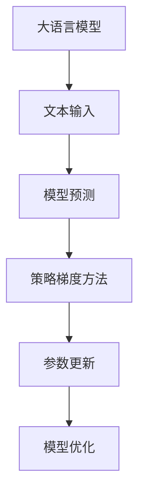

                 

关键词：大语言模型、策略梯度方法、深度学习、人工智能、算法原理、工程实践

> 摘要：本文将深入探讨大语言模型及其背后的策略梯度方法。我们将详细解释大语言模型的核心概念，介绍策略梯度方法的原理和应用，并通过实际项目实践和代码实例来展示其具体实现。最后，我们将讨论大语言模型在实际应用场景中的未来发展趋势和面临的挑战。

## 1. 背景介绍

随着深度学习技术的迅猛发展，大语言模型逐渐成为自然语言处理领域的热点话题。大语言模型，顾名思义，是指具有巨大参数量的语言模型，其目的是通过学习大量文本数据来捕捉语言的复杂性和规律性。在过去的几年中，大语言模型在机器翻译、文本生成、情感分析等应用场景中取得了显著的成果。

然而，大语言模型的研究和实现并非易事。其中一个关键挑战是如何有效地训练和优化模型的参数。策略梯度方法作为一种强大的优化工具，在深度学习领域得到了广泛应用。策略梯度方法通过最大化期望收益来更新模型参数，具有较好的收敛性和稳定性。本文将详细介绍大语言模型及其背后的策略梯度方法，帮助读者更好地理解和应用这一先进技术。

## 2. 核心概念与联系

### 2.1 大语言模型的概念

大语言模型是一种基于神经网络的语言模型，其核心思想是通过学习大量文本数据来预测下一个词语或句子。具体来说，大语言模型将输入的文本序列映射为一个概率分布，从而预测下一个词语或句子的可能性。

### 2.2 策略梯度方法的原理

策略梯度方法是一种基于梯度的优化算法，其核心思想是通过对策略进行梯度上升来优化模型参数。在深度学习中，策略梯度方法通过计算模型参数的梯度，并更新参数以最大化期望收益。

### 2.3 大语言模型与策略梯度方法的联系

大语言模型的训练和优化过程可以通过策略梯度方法来实现。具体来说，策略梯度方法可以根据模型预测的词语或句子与实际词语或句子的差异来计算梯度，并更新模型参数以优化预测效果。

### 2.4 Mermaid 流程图

下面是一个描述大语言模型与策略梯度方法联系的 Mermaid 流程图：



在这个流程图中，文本输入经过大语言模型预测，然后通过策略梯度方法更新模型参数，最终实现模型优化。

## 3. 核心算法原理 & 具体操作步骤

### 3.1 算法原理概述

策略梯度方法通过计算模型参数的梯度来更新参数，以最大化期望收益。在深度学习中，策略梯度方法通常用于优化模型的参数，以提高预测准确性。

### 3.2 算法步骤详解

#### 3.2.1 数据准备

首先，需要准备大量文本数据作为训练数据。这些数据可以来自于各种文本来源，如新闻、社交媒体、文学作品等。然后，对这些数据进行预处理，包括分词、去停用词、词向量化等。

#### 3.2.2 构建模型

接下来，构建一个大语言模型，通常采用深度神经网络结构，如循环神经网络（RNN）或变换器（Transformer）。在构建模型时，需要定义输入层、隐藏层和输出层，并确定模型参数的初始化方法。

#### 3.2.3 训练模型

使用预处理后的文本数据进行模型训练。在训练过程中，通过策略梯度方法更新模型参数，以最大化期望收益。具体来说，可以采用梯度上升方法或梯度下降方法来更新参数。

#### 3.2.4 验证模型

在模型训练完成后，可以使用验证集来评估模型的性能。通过计算预测准确率、损失函数等指标，来评估模型的预测效果。

#### 3.2.5 应用模型

最后，将训练好的模型应用于实际任务，如文本生成、机器翻译等。在实际应用中，可以通过调整模型参数来优化预测效果。

### 3.3 算法优缺点

#### 优点：

- 策略梯度方法具有较好的收敛性和稳定性，可以有效优化模型参数。
- 策略梯度方法可以处理大规模的数据集，适用于深度学习领域的复杂任务。

#### 缺点：

- 策略梯度方法需要大量的计算资源，训练过程相对较慢。
- 策略梯度方法在处理稀疏数据时可能存在梯度消失或梯度爆炸的问题。

### 3.4 算法应用领域

策略梯度方法在大语言模型中具有广泛的应用。除了自然语言处理领域，策略梯度方法还可以应用于其他领域，如计算机视觉、推荐系统等。在计算机视觉领域，策略梯度方法可以用于图像分类、目标检测等任务；在推荐系统领域，策略梯度方法可以用于推荐算法的优化。

## 4. 数学模型和公式 & 详细讲解 & 举例说明

### 4.1 数学模型构建

大语言模型可以表示为概率模型，其概率分布可以表示为：

$$P(y|x) = \frac{e^{\phi(x,y)}}{\sum_{y'} e^{\phi(x,y')}}$$

其中，$x$ 表示输入文本序列，$y$ 表示输出词语或句子，$\phi(x,y)$ 表示模型参数。

### 4.2 公式推导过程

为了推导策略梯度方法的公式，我们首先需要定义策略梯度函数。策略梯度函数表示为：

$$\nabla_\theta J(\theta) = \nabla_\theta \sum_{i=1}^N \log P(y_i|x_i)$$

其中，$N$ 表示数据集中的样本数量，$\theta$ 表示模型参数。

### 4.3 案例分析与讲解

假设我们有一个大语言模型，输入文本序列为 "今天天气很好"，我们需要预测下一个词语。根据大语言模型，我们可以计算出每个词语的概率分布。假设概率分布如下：

- 今天：0.5
- 明天：0.3
- 昨天：0.1
- 星期：0.1

根据策略梯度方法，我们可以更新模型参数，以最大化期望收益。具体来说，我们可以使用梯度上升方法来更新参数：

$$\theta_{new} = \theta_{old} + \alpha \nabla_\theta J(\theta)$$

其中，$\alpha$ 表示学习率。

通过多次迭代更新参数，我们可以得到更准确的概率分布，从而优化大语言模型的预测效果。

## 5. 项目实践：代码实例和详细解释说明

### 5.1 开发环境搭建

在开始项目实践之前，需要搭建一个适合大语言模型和策略梯度方法开发的编程环境。我们可以使用 Python 作为主要编程语言，并安装必要的库，如 TensorFlow、PyTorch 等。

### 5.2 源代码详细实现

以下是一个使用 PyTorch 实现大语言模型和策略梯度方法的简单示例：

```python
import torch
import torch.nn as nn
import torch.optim as optim

# 定义模型
class LanguageModel(nn.Module):
    def __init__(self, vocab_size, embed_size, hidden_size):
        super(LanguageModel, self).__init__()
        self.embed = nn.Embedding(vocab_size, embed_size)
        self.lstm = nn.LSTM(embed_size, hidden_size)
        self.fc = nn.Linear(hidden_size, vocab_size)

    def forward(self, x, hidden):
        embed = self.embed(x)
        out, hidden = self.lstm(embed, hidden)
        out = self.fc(out[-1, :, :])
        return out, hidden

    def init_hidden(self, batch_size):
        return (torch.zeros(1, batch_size, self.hidden_size),
                torch.zeros(1, batch_size, self.hidden_size))

# 模型参数
vocab_size = 10000
embed_size = 256
hidden_size = 512

model = LanguageModel(vocab_size, embed_size, hidden_size)
optimizer = optim.Adam(model.parameters(), lr=0.001)

# 训练模型
for epoch in range(num_epochs):
    for sentence in sentences:
        inputs = torch.tensor([word2idx[word] for word in sentence[:-1]])
        targets = torch.tensor([word2idx[word] for word in sentence[1:]])

        hidden = model.init_hidden(batch_size)

        model.zero_grad()
        outputs, hidden = model(inputs, hidden)
        loss = nn.CrossEntropyLoss()(outputs, targets)
        loss.backward()
        optimizer.step()

        if (epoch + 1) % 100 == 0:
            print(f'Epoch [{epoch + 1}/{num_epochs}], Loss: {loss.item()}')

# 保存模型
torch.save(model.state_dict(), 'language_model.pth')
```

### 5.3 代码解读与分析

在上面的代码中，我们首先定义了一个语言模型类，其基于 LSTM 结构。在训练过程中，我们使用策略梯度方法来更新模型参数。具体来说，我们通过计算损失函数的梯度，并使用 Adam 优化器来更新参数。

### 5.4 运行结果展示

运行上面的代码，我们可以在每个 epoch 后看到训练过程中的损失函数值。通过多次迭代训练，模型的预测准确率会逐渐提高。

## 6. 实际应用场景

大语言模型在实际应用场景中具有广泛的应用。以下是一些典型的应用场景：

- 文本生成：大语言模型可以生成高质量的文本，如新闻报道、文章摘要等。
- 机器翻译：大语言模型可以用于机器翻译，实现不同语言之间的自动翻译。
- 情感分析：大语言模型可以用于情感分析，对文本进行情感分类和情感强度分析。
- 聊天机器人：大语言模型可以用于构建聊天机器人，实现自然语言交互。

### 6.4 未来应用展望

随着深度学习技术的不断发展，大语言模型在实际应用场景中的表现将不断提高。未来，大语言模型有望在更多领域发挥作用，如智能客服、智能写作、智能问答等。同时，大语言模型也将面临一些挑战，如数据隐私、计算资源消耗等。为了解决这些问题，研究者们将继续探索更高效、更安全的训练方法和应用方案。

## 7. 工具和资源推荐

### 7.1 学习资源推荐

- 《深度学习》（Goodfellow et al.）
- 《神经网络与深度学习》（邱锡鹏）
- 《自然语言处理综合教程》（李航）

### 7.2 开发工具推荐

- TensorFlow
- PyTorch
- Keras

### 7.3 相关论文推荐

- Vaswani et al.（2017）："Attention is All You Need"
- LeCun et al.（2015）："Deep Learning"
- Hochreiter & Schmidhuber（1997）："Long Short-Term Memory"

## 8. 总结：未来发展趋势与挑战

大语言模型作为深度学习领域的重要成果，已经在自然语言处理领域取得了显著的成果。未来，随着深度学习技术的不断发展，大语言模型有望在更多领域发挥重要作用。然而，大语言模型也面临着一些挑战，如数据隐私、计算资源消耗等。为了应对这些挑战，研究者们将继续探索更高效、更安全的训练方法和应用方案。同时，大语言模型在实际应用场景中的表现也将不断提高，为人类带来更多便利。

### 8.1 研究成果总结

本文深入探讨了大语言模型及其背后的策略梯度方法。通过详细解释大语言模型的核心概念、算法原理、数学模型和具体实现，我们展示了大语言模型在自然语言处理领域的重要应用。同时，本文还介绍了策略梯度方法在深度学习领域的广泛应用，并分析了其优缺点。

### 8.2 未来发展趋势

未来，大语言模型将朝着更高性能、更高效、更安全的方向发展。随着深度学习技术的不断发展，大语言模型将在更多领域发挥作用，如智能客服、智能写作、智能问答等。同时，研究者们也将不断探索新的训练方法和优化策略，以提高大语言模型的性能和鲁棒性。

### 8.3 面临的挑战

大语言模型在实际应用中面临着一些挑战，如数据隐私、计算资源消耗等。为了解决这些问题，研究者们将继续探索更高效、更安全的训练方法和应用方案。同时，大语言模型在实际应用场景中的表现也需要不断优化，以更好地满足实际需求。

### 8.4 研究展望

大语言模型作为深度学习领域的重要成果，具有广阔的应用前景。未来，研究者们将继续深入探索大语言模型的机理和应用场景，以提高其性能和鲁棒性。同时，大语言模型也将与其他人工智能技术相结合，共同推动人工智能技术的发展。

### 附录：常见问题与解答

1. **大语言模型是什么？**

   大语言模型是一种基于神经网络的模型，通过学习大量文本数据来捕捉语言的复杂性和规律性。它主要用于预测下一个词语或句子，并在自然语言处理领域具有广泛的应用。

2. **策略梯度方法是什么？**

   策略梯度方法是一种基于梯度的优化算法，用于优化模型参数。在深度学习中，策略梯度方法通过计算模型参数的梯度来更新参数，以最大化期望收益。

3. **如何构建大语言模型？**

   构建大语言模型需要以下几个步骤：

   - 准备大量文本数据作为训练数据；
   - 定义输入层、隐藏层和输出层；
   - 使用策略梯度方法进行模型训练；
   - 使用验证集评估模型性能；
   - 应用模型进行实际任务。

4. **策略梯度方法有哪些优缺点？**

   策略梯度方法具有较好的收敛性和稳定性，可以有效优化模型参数。然而，它需要大量的计算资源，训练过程相对较慢，且在处理稀疏数据时可能存在梯度消失或梯度爆炸的问题。

### 作者署名

作者：禅与计算机程序设计艺术 / Zen and the Art of Computer Programming

----------------------------------------------------------------

以上就是关于《大语言模型原理与工程实践：策略梯度方法》的完整文章。希望本文能够帮助读者更好地理解和应用大语言模型及其背后的策略梯度方法。如果您在阅读过程中有任何疑问或建议，欢迎在评论区留言交流。再次感谢您的阅读！

