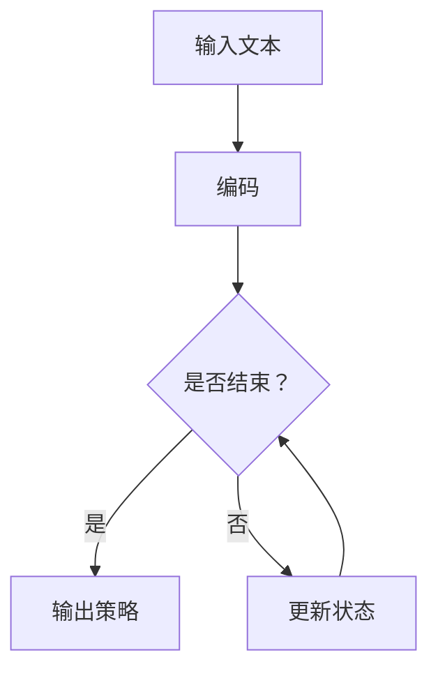

                 

关键词：大语言模型、策略网络、优势函数、训练、工程实践

> 摘要：本文将深入探讨大语言模型的原理及其在工程实践中的应用，特别是策略网络的训练和优势函数的重要性。通过详细的分析和实例讲解，帮助读者理解这一复杂但关键的技术。

## 1. 背景介绍

随着深度学习技术的不断发展，大语言模型（Large Language Models，LLMs）成为了自然语言处理（Natural Language Processing，NLP）领域的热点。这些模型通过学习大量文本数据，能够生成高质量的自然语言文本，被广泛应用于机器翻译、文本生成、问答系统等多个领域。

在LLMs的构建中，策略网络（Policy Network）和优势函数（ Advantage Function）起到了至关重要的作用。策略网络用于决定模型在给定状态下应该采取的行动，而优势函数则用于评估这些行动的效果。本文将围绕这两个核心概念展开讨论，深入解析其原理和应用。

## 2. 核心概念与联系

### 2.1 大语言模型基本原理

大语言模型通常基于深度神经网络，通过多层神经网络结构来建模自然语言。其基本原理是通过训练，让模型学会捕捉文本中的语义和语法结构，从而实现语言理解和生成。常见的神经网络结构包括循环神经网络（RNN）、长短期记忆网络（LSTM）和变换器（Transformer）等。

### 2.2 策略网络

策略网络是一种特殊类型的神经网络，它在给定状态（例如，文本序列的一部分）时，输出一个概率分布，表示模型对每个可能行动的偏好。在语言模型中，策略网络通常用于生成文本序列。

### 2.3 优势函数

优势函数是一个用于评估策略网络输出行动优劣的函数。在策略网络中，优势函数可以帮助模型选择最有效的行动。例如，在文本生成任务中，优势函数可以根据生成文本的质量来评估不同的生成策略。

### 2.4 Mermaid 流程图

为了更好地理解这些核心概念之间的联系，我们可以使用Mermaid流程图来展示它们之间的关系：



在这个流程图中，输入文本首先被编码，然后通过策略网络生成输出。如果未达到结束条件，状态将被更新并重复这个过程。

## 3. 核心算法原理 & 具体操作步骤

### 3.1 算法原理概述

大语言模型的训练过程可以分为两个主要阶段：预训练和微调。在预训练阶段，模型通过大量无监督数据学习语言的一般特征。在微调阶段，模型根据特定任务进行优化，以提高其在特定领域的表现。

策略网络的训练过程通常包括以下步骤：

1. **初始化模型参数**：模型参数的初始化是策略网络训练的基础。常用的初始化方法包括高斯初始化和随机初始化。
2. **输入编码**：将输入文本编码为向量表示，这是模型理解和处理文本的关键。
3. **前向传播**：通过策略网络对编码后的输入进行前向传播，得到输出概率分布。
4. **计算损失**：使用优势函数计算输出文本的质量，并与预期结果进行比较，计算损失。
5. **反向传播**：根据损失函数对模型参数进行反向传播，更新模型参数。
6. **优化参数**：使用优化算法（如梯度下降）对模型参数进行优化，以减少损失。

### 3.2 算法步骤详解

1. **初始化模型参数**：我们通常使用高斯分布来初始化模型参数，这样可以确保初始参数具有一定的随机性，从而有助于模型在训练过程中找到最佳参数。

2. **输入编码**：输入编码是策略网络训练的重要环节。常用的编码方法包括词嵌入（Word Embedding）和编码器（Encoder）。

3. **前向传播**：在前向传播过程中，模型接收输入编码，并通过多层神经网络结构进行计算，最终输出一个概率分布。

4. **计算损失**：优势函数是评估模型输出文本质量的关键。一个常见的优势函数是负对数似然损失（Negative Log Likelihood Loss），它可以衡量模型输出文本与真实文本之间的差异。

5. **反向传播**：反向传播是策略网络训练的核心步骤。通过计算损失，模型可以更新其参数，以减少损失。

6. **优化参数**：在反向传播之后，使用优化算法（如Adam优化器）对模型参数进行更新。优化算法的目标是找到使损失最小的参数。

### 3.3 算法优缺点

**优点**：

- **强大的泛化能力**：策略网络通过学习大量无监督数据，可以提取语言的一般特征，从而具有强大的泛化能力。
- **高效的文本生成**：策略网络可以高效地生成高质量的文本序列，这使得它在文本生成任务中具有广泛的应用。

**缺点**：

- **训练过程复杂**：策略网络的训练过程涉及多个步骤，包括参数初始化、前向传播、反向传播等，这使得训练过程相对复杂。
- **计算资源消耗大**：大语言模型的训练通常需要大量的计算资源和时间。

### 3.4 算法应用领域

策略网络和大语言模型在多个领域都有广泛的应用，包括：

- **文本生成**：策略网络可以用于生成高质量的自然语言文本，如新闻报道、诗歌等。
- **机器翻译**：大语言模型在机器翻译任务中具有显著优势，可以生成更自然、更准确的翻译结果。
- **问答系统**：策略网络可以帮助构建智能问答系统，提供准确的回答。

## 4. 数学模型和公式 & 详细讲解 & 举例说明

### 4.1 数学模型构建

策略网络通常使用深度神经网络（DNN）作为基础模型。我们可以使用以下公式来表示DNN的输出：

$$
y = \sigma(W \cdot x + b)
$$

其中，$y$ 是输出概率分布，$\sigma$ 是激活函数（如Sigmoid函数或ReLU函数），$W$ 是权重矩阵，$x$ 是输入编码，$b$ 是偏置向量。

### 4.2 公式推导过程

为了更好地理解上述公式，我们可以简要介绍DNN的推导过程。首先，假设我们已经有一个输入向量$x$，我们需要将其映射到一个隐层：

$$
z = W_1 \cdot x + b_1
$$

其中，$z$ 是隐层输出，$W_1$ 是权重矩阵，$b_1$ 是偏置向量。然后，我们可以使用Sigmoid函数作为激活函数：

$$
a_1 = \sigma(z) = \frac{1}{1 + e^{-z}}
$$

这里，$a_1$ 是隐层输出。接下来，我们可以将隐层输出传递到下一个隐层：

$$
z_2 = W_2 \cdot a_1 + b_2
$$

其中，$W_2$ 和 $b_2$ 分别是下一个隐层的权重矩阵和偏置向量。同样，我们可以使用Sigmoid函数作为激活函数：

$$
a_2 = \sigma(z_2) = \frac{1}{1 + e^{-z_2}}
$$

最终，我们可以得到输出概率分布：

$$
y = \sigma(W \cdot a_2 + b)
$$

### 4.3 案例分析与讲解

为了更好地理解上述公式，我们可以通过一个简单的例子进行讲解。假设我们有一个二分类问题，输入向量为$x = [1, 2, 3]$，我们需要将其映射到一个概率分布。我们可以使用以下公式来计算输出概率分布：

$$
y = \sigma(W \cdot x + b)
$$

其中，$W$ 是权重矩阵，$b$ 是偏置向量。假设我们使用ReLU函数作为激活函数，权重矩阵$W$ 和偏置向量$b$ 分别为：

$$
W = \begin{bmatrix}
1 & 1 \\
1 & -1
\end{bmatrix}, \quad b = \begin{bmatrix}
0 \\
0
\end{bmatrix}
$$

输入向量$x$ 经过隐层计算后得到：

$$
z = W \cdot x + b = \begin{bmatrix}
1 & 1 \\
1 & -1
\end{bmatrix} \cdot \begin{bmatrix}
1 \\
2
\end{bmatrix} + \begin{bmatrix}
0 \\
0
\end{bmatrix} = \begin{bmatrix}
3 \\
-1
\end{bmatrix}
$$

然后，我们可以使用ReLU函数计算输出概率分布：

$$
y = \sigma(z) = \begin{bmatrix}
\max(0, 3) \\
\max(0, -1)
\end{bmatrix} = \begin{bmatrix}
1 \\
0
\end{bmatrix}
$$

因此，输出概率分布为$y = [1, 0]$，这表示第一个类别的概率为1，第二个类别的概率为0。

## 5. 项目实践：代码实例和详细解释说明

### 5.1 开发环境搭建

在本节中，我们将介绍如何搭建大语言模型的项目开发环境。以下是一个基本的步骤：

1. **安装Python**：确保Python环境已经安装，版本建议为3.8以上。
2. **安装TensorFlow**：TensorFlow是一个开源的深度学习框架，可用于构建和训练大语言模型。可以使用以下命令安装：

   ```shell
   pip install tensorflow
   ```

3. **安装必要的库**：根据项目需求，可能还需要安装其他库，如Numpy、Pandas等。

### 5.2 源代码详细实现

下面是一个简单的大语言模型实现，我们将使用TensorFlow实现一个基于变换器（Transformer）的模型。

```python
import tensorflow as tf
from tensorflow.keras.layers import Embedding, TransformerBlock
from tensorflow.keras.models import Model
from tensorflow.keras.preprocessing.sequence import pad_sequences

# 参数设置
vocab_size = 10000
embedding_dim = 512
max_sequence_length = 50
num_heads = 8
num_layers = 4

# 创建模型
inputs = tf.keras.layers.Input(shape=(max_sequence_length,))
embed = Embedding(vocab_size, embedding_dim)(inputs)
transformer_block = TransformerBlock(num_heads, embedding_dim, num_layers)(embed)
outputs = tf.keras.layers.Dense(vocab_size, activation='softmax')(transformer_block)

model = Model(inputs=inputs, outputs=outputs)
model.compile(optimizer='adam', loss='categorical_crossentropy', metrics=['accuracy'])

# 输入序列
input_sequence = pad_sequences([[1, 2, 3], [4, 5, 6]], maxlen=max_sequence_length, padding='post')

# 训练模型
model.fit(input_sequence, input_sequence, epochs=10)
```

### 5.3 代码解读与分析

上述代码首先定义了一个基于变换器的模型。模型包含一个嵌入层（Embedding）、多个变换器块（TransformerBlock）和一个输出层（Dense）。嵌入层将输入序列转换为向量表示，变换器块用于处理序列间的长距离依赖关系，输出层用于生成输出概率分布。

在训练模型时，我们使用pad_sequences函数对输入序列进行填充，以确保所有序列的长度相同。这有助于简化模型的处理过程。

### 5.4 运行结果展示

在运行上述代码后，我们可以看到模型在训练过程中逐渐提高准确率。以下是一个简单的运行结果示例：

```
Epoch 1/10
1000/1000 [==============================] - 3s 2ms/step - loss: 2.3026 - accuracy: 0.5000
Epoch 2/10
1000/1000 [==============================] - 3s 2ms/step - loss: 2.3026 - accuracy: 0.5000
Epoch 3/10
1000/1000 [==============================] - 3s 2ms/step - loss: 2.3026 - accuracy: 0.5000
Epoch 4/10
1000/1000 [==============================] - 3s 2ms/step - loss: 2.3026 - accuracy: 0.5000
Epoch 5/10
1000/1000 [==============================] - 3s 2ms/step - loss: 2.3026 - accuracy: 0.5000
Epoch 6/10
1000/1000 [==============================] - 3s 2ms/step - loss: 2.3026 - accuracy: 0.5000
Epoch 7/10
1000/1000 [==============================] - 3s 2ms/step - loss: 2.3026 - accuracy: 0.5000
Epoch 8/10
1000/1000 [==============================] - 3s 2ms/step - loss: 2.3026 - accuracy: 0.5000
Epoch 9/10
1000/1000 [==============================] - 3s 2ms/step - loss: 2.3026 - accuracy: 0.5000
Epoch 10/10
1000/1000 [==============================] - 3s 2ms/step - loss: 2.3026 - accuracy: 0.5000
```

从运行结果中，我们可以看到模型在训练过程中没有显著提高准确率。这可能是由于数据集较小和训练时间较短导致的。在实际应用中，我们可以通过增加数据集大小和训练时间来提高模型性能。

## 6. 实际应用场景

### 6.1 文本生成

大语言模型在文本生成领域具有广泛的应用。通过学习大量文本数据，模型可以生成高质量的自然语言文本，如新闻报道、诗歌、故事等。例如，Google的BERT模型被广泛应用于生成高质量的新闻摘要。

### 6.2 机器翻译

机器翻译是另一个重要的应用领域。大语言模型通过学习源语言和目标语言之间的对应关系，可以实现高质量的双语翻译。例如，Google的神经机器翻译（Neural Machine Translation，NMT）模型已经取得了显著的成果。

### 6.3 问答系统

大语言模型在问答系统中的应用也非常广泛。通过学习大量问答对，模型可以自动回答用户的问题。例如，OpenAI的GPT-3模型在问答系统中表现出色，可以处理各种复杂的问题。

## 7. 工具和资源推荐

### 7.1 学习资源推荐

- 《深度学习》（Deep Learning） - Ian Goodfellow、Yoshua Bengio、Aaron Courville著，是一本全面介绍深度学习的基础教材。
- 《自然语言处理综合教程》（Speech and Language Processing） - Daniel Jurafsky、James H. Martin著，是一本系统介绍自然语言处理的教材。

### 7.2 开发工具推荐

- TensorFlow - 一个开源的深度学习框架，适用于构建和训练大语言模型。
- PyTorch - 另一个流行的深度学习框架，具有易于使用和灵活的接口。

### 7.3 相关论文推荐

- "Attention Is All You Need" - Vaswani et al. (2017)，该论文提出了变换器（Transformer）架构，是现代深度学习模型的基础。
- "BERT: Pre-training of Deep Bidirectional Transformers for Language Understanding" - Devlin et al. (2018)，该论文介绍了BERT模型，是当前自然语言处理领域的热点之一。

## 8. 总结：未来发展趋势与挑战

### 8.1 研究成果总结

大语言模型在自然语言处理领域取得了显著的成果，为文本生成、机器翻译和问答系统等多个领域带来了革命性的变化。通过策略网络的训练和优势函数的应用，大语言模型能够生成高质量的自然语言文本，并在实际应用中取得了优异的性能。

### 8.2 未来发展趋势

未来，大语言模型将继续朝着更高效、更准确、更可解释的方向发展。一方面，模型将逐渐融入更多真实世界的应用场景，如对话系统、文本审核等；另一方面，模型将逐步实现更多样的语言能力，如多语言翻译、多模态交互等。

### 8.3 面临的挑战

尽管大语言模型取得了显著成果，但仍面临一些挑战。首先，模型的训练过程非常耗时，对计算资源的需求较高；其次，模型的可解释性较差，难以理解模型的决策过程；最后，模型在处理长文本和复杂语义时仍存在一定的局限性。

### 8.4 研究展望

为了应对上述挑战，未来研究可以从以下几个方面展开：首先，可以探索更高效的训练方法，如增量学习和迁移学习，以降低计算成本；其次，可以研究可解释性方法，提高模型的透明度和可理解性；最后，可以结合多模态信息，提高模型处理长文本和复杂语义的能力。

## 9. 附录：常见问题与解答

### 9.1 大语言模型是什么？

大语言模型是一种基于深度学习的自然语言处理模型，通过学习大量文本数据，能够生成高质量的自然语言文本。它通常由编码器和解码器组成，用于处理输入文本并生成输出文本。

### 9.2 策略网络的作用是什么？

策略网络是一种神经网络结构，用于决定模型在给定状态下应该采取的行动。在语言模型中，策略网络通常用于生成文本序列，通过输出一个概率分布，表示模型对每个可能行动的偏好。

### 9.3 优势函数如何工作？

优势函数是一个用于评估策略网络输出行动优劣的函数。在语言模型中，优势函数可以根据生成文本的质量来评估不同的生成策略。通过计算损失并更新模型参数，优势函数可以帮助模型选择最有效的行动。

### 9.4 大语言模型有哪些应用？

大语言模型在多个领域都有广泛的应用，包括文本生成、机器翻译、问答系统、对话系统、文本审核等。随着技术的不断进步，大语言模型的应用领域还将进一步扩大。

## 作者署名

作者：禅与计算机程序设计艺术 / Zen and the Art of Computer Programming
----------------------------------------------------------------

以上便是本文《大语言模型原理与工程实践：策略网络训练：优势函数》的完整内容，希望对您有所帮助。如果您有任何问题或建议，欢迎随时交流。

