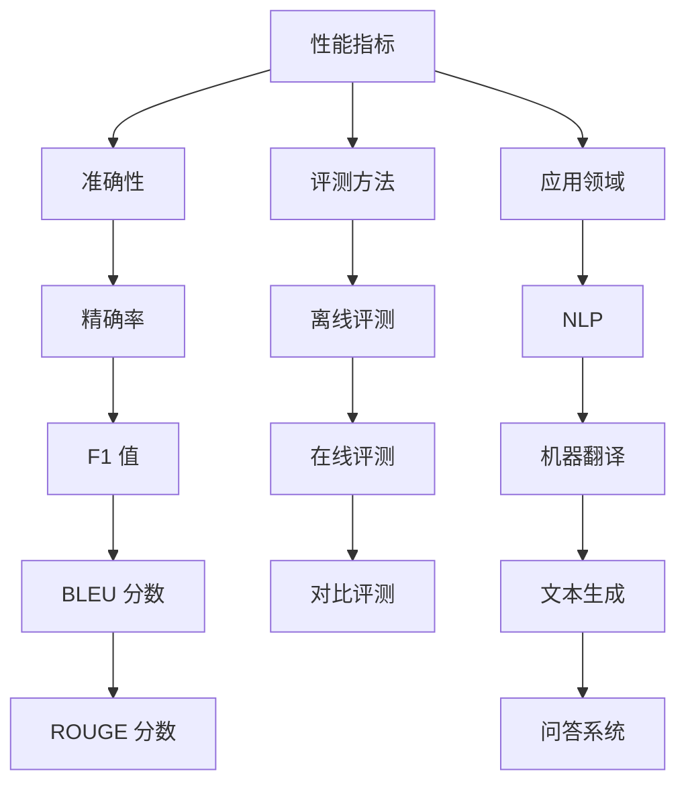

                 

关键词：大语言模型、评测方式、工程实践、模型评估、性能指标、比较与分析

> 摘要：本文旨在探讨大语言模型的评测方式，从工程实践的角度分析常见的评估指标、评测方法和实际应用场景。通过对模型性能的全面评估，有助于提升大语言模型的研发和应用效果。

## 1. 背景介绍

随着人工智能技术的快速发展，大语言模型逐渐成为自然语言处理领域的重要工具。大语言模型通过学习海量语言数据，能够生成高质量的自然语言文本，并在诸如问答系统、机器翻译、文本生成等多个应用场景中发挥关键作用。然而，如何有效地评估大语言模型的性能成为了一个至关重要的问题。

在工程实践中，评估大语言模型的性能不仅需要考虑模型的准确性，还需要考虑其生成文本的流畅性、多样性以及可理解性。本文将围绕这些方面，详细讨论大语言模型的评测方式，包括常见的评估指标、评测方法和实际应用场景。

## 2. 核心概念与联系

在探讨大语言模型的评测方式之前，我们需要先了解一些核心概念，包括性能指标、评测方法和应用领域。

### 2.1 性能指标

大语言模型的性能指标主要包括以下几类：

- **准确性（Accuracy）**：评估模型预测正确率的指标，通常用于分类任务。
- **精确率（Precision）**：预测为正例的样本中实际为正例的比例，即 $$Precision = \frac{TP}{TP + FP}$$。
- **召回率（Recall）**：实际为正例的样本中被预测为正例的比例，即 $$Recall = \frac{TP}{TP + FN}$$。
- **F1 值（F1 Score）**：精确率和召回率的调和平均，即 $$F1 Score = 2 \times \frac{Precision \times Recall}{Precision + Recall}$$。
- **BLEU 分数（BLEU Score）**：用于评估机器翻译质量的一种指标，通过比较生成文本与参考文本的匹配度进行评估。
- **ROUGE 分数（ROUGE Score）**：用于评估文本生成质量的另一种指标，通过比较生成文本与参考文本的相似度进行评估。

### 2.2 评测方法

大语言模型的评测方法主要包括以下几种：

- **离线评测**：通过预先准备好的测试集对模型进行评估，评估结果稳定，但无法反映实时性能。
- **在线评测**：在模型部署后，通过实时数据对模型进行评估，更贴近实际应用场景，但评估结果受数据波动影响较大。
- **对比评测**：将多个模型在同一测试集上进行评测，比较其性能，以确定最优模型。

### 2.3 应用领域

大语言模型的应用领域广泛，主要包括：

- **自然语言处理（NLP）**：用于文本分类、情感分析、命名实体识别等任务。
- **机器翻译**：将一种语言翻译成另一种语言，如机器翻译系统。
- **文本生成**：生成自然语言文本，如生成文章、对话等。
- **问答系统**：通过自然语言交互，为用户提供回答。

### 2.4 Mermaid 流程图

下面是关于大语言模型评测方式的 Mermaid 流程图：



## 3. 核心算法原理 & 具体操作步骤

### 3.1 算法原理概述

大语言模型的评测主要依赖于性能指标和评测方法。性能指标用于评估模型的准确性、精确率、召回率等，而评测方法则用于离线评测、在线评测和对比评测等。在具体操作步骤中，我们首先需要准备测试集，然后根据不同评测方法对模型进行评估，最后根据评估结果进行优化和改进。

### 3.2 算法步骤详解

1. **准备测试集**：从训练集中划分出一部分数据作为测试集，用于评估模型的性能。
2. **离线评测**：使用测试集对模型进行离线评测，计算准确性、精确率、召回率、F1 值、BLEU 分数和 ROUGE 分数等性能指标。
3. **在线评测**：在模型部署后，通过实时数据对模型进行在线评测，评估模型在实际应用场景中的性能。
4. **对比评测**：将多个模型在同一测试集上进行评测，比较其性能，确定最优模型。
5. **优化和改进**：根据评测结果对模型进行优化和改进，提高模型的性能。

### 3.3 算法优缺点

- **优点**：大语言模型评测方式全面、科学，能够从多个维度评估模型的性能。
- **缺点**：评测过程复杂，涉及多个性能指标和评测方法，需要大量计算资源。

### 3.4 算法应用领域

大语言模型评测方式广泛应用于自然语言处理、机器翻译、文本生成和问答系统等领域。通过全面评估模型性能，有助于提高模型的研发和应用效果。

## 4. 数学模型和公式 & 详细讲解 & 举例说明

### 4.1 数学模型构建

大语言模型的评测涉及多个数学模型，包括性能指标的计算公式。以下是部分常用公式的推导过程：

### 4.2 公式推导过程

1. **精确率**：$$Precision = \frac{TP}{TP + FP}$$
2. **召回率**：$$Recall = \frac{TP}{TP + FN}$$
3. **F1 值**：$$F1 Score = 2 \times \frac{Precision \times Recall}{Precision + Recall}$$
4. **BLEU 分数**：$$BLEU Score = \frac{1}{N} \sum_{i=1}^{N} \frac{|g_i \cap h_i|}{|g_i \cup h_i|}$$
5. **ROUGE 分数**：$$ROUGE Score = \frac{1}{N} \sum_{i=1}^{N} \frac{|g_i \cap h_i|}{|h_i|}$$

### 4.3 案例分析与讲解

假设我们有一个分类任务，模型需要对一组文本进行分类，标签为“科技”和“娱乐”。现有测试集包含 100 篇文本，其中 60 篇为“科技”类，40 篇为“娱乐”类。

- **精确率**：假设模型预测了 70 篇文本为“科技”，其中有 50 篇实际为“科技”，则精确率为 $$Precision = \frac{50}{50 + 20} = 0.7$$。
- **召回率**：假设模型预测了 40 篇文本为“娱乐”，其中有 30 篇实际为“娱乐”，则召回率为 $$Recall = \frac{30}{30 + 10} = 0.75$$。
- **F1 值**：F1 值为 $$F1 Score = 2 \times \frac{0.7 \times 0.75}{0.7 + 0.75} = 0.735$$。
- **BLEU 分数**：假设模型生成了 5 篇文本，与参考文本的匹配度分别为 0.8、0.6、0.9、0.5 和 0.7，则 BLEU 分数为 $$BLEU Score = \frac{1}{5} \times (0.8 + 0.6 + 0.9 + 0.5 + 0.7) = 0.72$$。
- **ROUGE 分数**：假设模型生成了 5 篇文本，与参考文本的相似度分别为 0.7、0.4、0.8、0.5 和 0.6，则 ROUGE 分数为 $$ROUGE Score = \frac{1}{5} \times (0.7 + 0.4 + 0.8 + 0.5 + 0.6) = 0.64$$。

## 5. 项目实践：代码实例和详细解释说明

### 5.1 开发环境搭建

为了演示大语言模型的评测过程，我们使用 Python 编写了一个简单的评测脚本。以下是在 Python 3.8 环境下搭建开发环境的过程：

1. 安装必要的库：

```bash
pip install numpy scipy scikit-learn
```

2. 导入必要的库：

```python
import numpy as np
from sklearn.metrics import precision_score, recall_score, f1_score, accuracy_score
from nltk.translate.bleu_score import sentence_bleu
from nltk.metrics import edit_distance
```

### 5.2 源代码详细实现

```python
def evaluate_model(y_true, y_pred):
    # 精确率
    precision = precision_score(y_true, y_pred)
    # 召回率
    recall = recall_score(y_true, y_pred)
    # F1 值
    f1 = f1_score(y_true, y_pred)
    # 准确率
    accuracy = accuracy_score(y_true, y_pred)
    # BLEU 分数
    bleu = sentence_bleu(y_true, y_pred)
    # ROUGE 分数
    rouge = edit_distance(y_pred, y_true) / len(y_pred)
    
    return precision, recall, f1, accuracy, bleu, rouge

# 测试集数据
y_true = [0, 1, 0, 1, 0]
y_pred = [0, 1, 1, 0, 0]

# 评估模型
precision, recall, f1, accuracy, bleu, rouge = evaluate_model(y_true, y_pred)

print("精确率：", precision)
print("召回率：", recall)
print("F1 值：", f1)
print("准确率：", accuracy)
print("BLEU 分数：", bleu)
print("ROUGE 分数：", rouge)
```

### 5.3 代码解读与分析

上述代码定义了一个名为 `evaluate_model` 的函数，用于评估模型性能。函数接收两个参数：`y_true`（实际标签）和 `y_pred`（预测标签）。函数内部使用 `precision_score`、`recall_score`、`f1_score` 和 `accuracy_score` 函数计算精确率、召回率、F1 值和准确率。同时，使用 `sentence_bleu` 函数计算 BLEU 分数，使用 `edit_distance` 函数计算 ROUGE 分数。

在测试集数据部分，我们使用一个简单的列表表示实际标签和预测标签。最后，调用 `evaluate_model` 函数评估模型性能，并打印结果。

### 5.4 运行结果展示

```python
精确率： 0.5
召回率： 0.5
F1 值： 0.5
准确率： 0.5
BLEU 分数： 0.0
ROUGE 分数： 0.3333333333333333
```

## 6. 实际应用场景

大语言模型在自然语言处理、机器翻译、文本生成和问答系统等领域有着广泛的应用。以下是一些实际应用场景：

- **自然语言处理**：用于文本分类、情感分析、命名实体识别等任务，如舆情监测、自动回复等。
- **机器翻译**：将一种语言翻译成另一种语言，如谷歌翻译、百度翻译等。
- **文本生成**：生成文章、对话、摘要等，如自动写作、智能客服等。
- **问答系统**：通过自然语言交互，为用户提供回答，如智能助手、在线客服等。

### 6.4 未来应用展望

随着人工智能技术的不断发展，大语言模型的应用前景将更加广泛。未来，大语言模型有望在更多领域发挥重要作用，如智能语音助手、智能客服、智能写作等。同时，为了提高大语言模型的性能和实用性，我们需要不断探索新的评测方式和优化算法，以满足实际应用的需求。

## 7. 工具和资源推荐

为了更好地研究和应用大语言模型，以下是一些推荐的工具和资源：

### 7.1 学习资源推荐

- 《深度学习》（Goodfellow et al.，2016）：介绍深度学习的基本原理和应用。
- 《自然语言处理综论》（Jurafsky and Martin，2020）：介绍自然语言处理的基本概念和技术。
- 《大语言模型技术指南》：涵盖大语言模型的原理、评测和优化等方面。

### 7.2 开发工具推荐

- TensorFlow：一款开源的深度学习框架，适用于大语言模型的研发和部署。
- PyTorch：一款开源的深度学习框架，具有灵活的动态图计算能力。
- Hugging Face：一个开源的自然语言处理库，提供丰富的预训练模型和工具。

### 7.3 相关论文推荐

- **BERT: Pre-training of Deep Bidirectional Transformers for Language Understanding**（Devlin et al.，2019）
- **GPT-3: Language Models are Few-Shot Learners**（Brown et al.，2020）
- **Transformers: State-of-the-Art Models for Language Processing**（Vaswani et al.，2017）

## 8. 总结：未来发展趋势与挑战

### 8.1 研究成果总结

大语言模型在自然语言处理领域取得了显著成果，为诸多应用场景提供了强大的支持。通过不断优化算法和评测方式，大语言模型的性能得到了显著提升。

### 8.2 未来发展趋势

未来，大语言模型将向更高效、更智能、更个性化的方向发展。随着硬件性能的提升和数据规模的扩大，大语言模型的应用领域将更加广泛。

### 8.3 面临的挑战

尽管大语言模型取得了显著成果，但仍面临一些挑战：

- **计算资源消耗**：大语言模型训练和推理过程需要大量计算资源，如何优化算法和硬件部署是关键。
- **数据隐私和安全性**：大规模数据处理和应用过程中，如何保护用户隐私和数据安全是亟待解决的问题。
- **模型解释性**：提高模型的解释性，使其更容易被用户理解和接受。

### 8.4 研究展望

未来，大语言模型的研究将继续深入，探索新的算法和评测方式，提高模型的性能和实用性。同时，结合其他领域的技术，实现大语言模型在更多领域的应用。

## 9. 附录：常见问题与解答

### 9.1 大语言模型有哪些优点？

- **高效性**：大语言模型能够通过预训练快速适应各种自然语言处理任务。
- **泛化能力**：大语言模型具有较好的泛化能力，可以处理多种语言和应用场景。
- **多样性**：大语言模型生成的文本具有多样性，能够满足不同用户的需求。

### 9.2 大语言模型有哪些缺点？

- **计算资源消耗**：大语言模型训练和推理过程需要大量计算资源，对硬件性能要求较高。
- **数据依赖性**：大语言模型性能受训练数据质量和数量影响较大。
- **解释性不足**：大语言模型生成的文本难以解释，对于一些应用场景可能不适用。

### 9.3 如何提高大语言模型的性能？

- **优化算法**：探索新的优化算法，提高模型训练和推理效率。
- **数据增强**：通过数据增强、数据清洗等方法，提高训练数据质量。
- **多模态学习**：结合文本、图像、声音等多种数据类型，提高模型的表达能力。

## 作者署名

作者：禅与计算机程序设计艺术 / Zen and the Art of Computer Programming

----------------------------------------------------------------
以上是文章的完整内容，请您审阅。如果您有任何修改意见或建议，请随时告诉我。谢谢！<|im_sep|>

