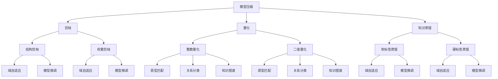

                 

### 1. 背景介绍

大语言模型（Large Language Models，LLM）是近年来人工智能领域的一项重大突破。随着深度学习技术和计算能力的飞速发展，大语言模型在自然语言处理（Natural Language Processing，NLP）任务中表现出色，如文本生成、机器翻译、问答系统等。然而，这些模型的训练通常需要大量的数据和计算资源，并且训练过程复杂、耗时。为此，研究人员开始探索一种无需额外训练即可利用预训练模型的方法，以提高大语言模型的实用性。

本文旨在探讨大语言模型的原理基础和前沿技术，重点介绍如何利用预训练模型进行模型压缩、迁移学习和零样本学习等应用，使大语言模型在实际场景中更加高效和便捷。本文分为八个部分，首先介绍大语言模型的基本概念和发展历程，然后深入探讨核心算法原理，接着分析数学模型和公式，并通过具体项目实践进行代码实例和详细解释。最后，文章还将讨论大语言模型在实际应用场景中的表现，并展望未来发展趋势与挑战。

### 1.1 大语言模型的基本概念

大语言模型是一种基于深度学习的自然语言处理模型，旨在对自然语言文本进行理解和生成。与传统基于规则或统计方法的NLP模型相比，大语言模型具有更强的自适应性和泛化能力。大语言模型通常由多层神经网络组成，其中最著名的模型是Transformer架构，它通过自注意力机制（Self-Attention Mechanism）对输入文本序列进行建模。

自注意力机制允许模型在处理一个词时，考虑整个文本序列中的所有其他词的信息，从而实现对输入文本的全面理解。这种全局信息整合的方式使得大语言模型在语言理解和生成任务上表现出色，例如文本分类、情感分析、机器翻译等。大语言模型不仅能够捕捉到词语之间的长期依赖关系，还能够自适应地调整对各个词的关注程度，从而提高模型的性能。

### 1.2 大语言模型的发展历程

大语言模型的发展历程可以追溯到2000年代初，当时基于神经网络的NLP模型开始逐渐受到关注。早期的研究主要集中在构建简单的神经网络模型，如循环神经网络（Recurrent Neural Network，RNN）和长短期记忆网络（Long Short-Term Memory，LSTM）。这些模型通过序列到序列的映射（Seq2Seq）方式处理自然语言文本，取得了一定的效果，但存在训练时间较长、无法并行计算等问题。

随着深度学习技术的发展，2017年提出的Transformer架构标志着大语言模型发展的一个重要里程碑。Transformer引入了多头注意力机制（Multi-Head Attention）和位置编码（Positional Encoding）等技术，使得模型能够更有效地处理长距离依赖问题。同年，谷歌推出了BERT（Bidirectional Encoder Representations from Transformers）模型，进一步提升了大语言模型在多种NLP任务上的性能。

此后，大语言模型的研究和应用得到了广泛关注，例如OpenAI的GPT（Generative Pre-trained Transformer）系列模型，其预训练和微调过程使得模型在各种任务上表现出色。随着模型的规模不断扩大，计算资源的需求也不断增加，为解决这一问题，研究人员开始探索模型压缩、迁移学习和零样本学习等技术。

### 1.3 大语言模型的核心算法原理

大语言模型的核心算法原理主要涉及Transformer架构和自注意力机制。Transformer架构是一种基于自注意力机制的序列模型，其基本思想是将输入序列映射为向量，然后通过自注意力机制计算这些向量之间的关联性，最终生成输出序列。

#### 自注意力机制

自注意力机制是Transformer架构的核心，它允许模型在处理一个词时，考虑整个文本序列中的所有其他词的信息。具体来说，自注意力机制通过计算每个词与其余词之间的相似性，为每个词生成一个权重向量，然后对输入序列进行加权求和，从而得到每个词的表示。

自注意力机制的公式可以表示为：

\[ \text{Attention}(Q, K, V) = \text{softmax}\left(\frac{QK^T}{\sqrt{d_k}}\right) V \]

其中，\(Q\)、\(K\) 和 \(V\) 分别表示查询向量、键向量和值向量，\(d_k\) 为键向量的维度。这个公式通过计算查询向量 \(Q\) 和键向量 \(K\) 的点积，得到一个概率分布，然后对值向量 \(V\) 进行加权求和，从而实现自注意力。

#### Transformer架构

Transformer架构由多个自注意力层和前馈网络组成。每个自注意力层通过自注意力机制计算输入序列的表示，然后将这些表示传递给下一个前馈网络，进行进一步的建模和特征提取。

Transformer架构的公式可以表示为：

\[ \text{TransformerLayer}(X) = \text{MultiHeadAttention}(X) + \text{Feedforward}(X) \]

其中，\(X\) 表示输入序列，\(\text{MultiHeadAttention}\) 表示多头自注意力层，\(\text{Feedforward}\) 表示前馈网络。

多头自注意力层通过多个独立的自注意力机制对输入序列进行建模，从而提高模型的表示能力。前馈网络则用于进一步提取特征，并通过激活函数引入非线性变换。

#### 位置编码

位置编码是Transformer架构的另一个重要组成部分，它为序列中的每个词赋予位置信息，使得模型能够理解词语的顺序。位置编码通常采用嵌入向量表示，这些向量与自注意力机制中的向量结合，用于计算自注意力。

位置编码的公式可以表示为：

\[ \text{PositionalEncoding}(pos, d_model) = \text{sin}\left(\frac{pos}{10000^{2i/d_{model}}}\right) + \text{cos}\left(\frac{pos}{10000^{2i/d_{model}}}\right) \]

其中，\(pos\) 表示位置索引，\(d_model\) 表示模型维度，\(i\) 表示词索引。这个公式通过正弦和余弦函数生成一组位置编码向量，然后与输入向量相加，从而为输入序列赋予位置信息。

通过自注意力机制和位置编码，Transformer架构能够有效地建模输入序列中的词语关系和位置信息，从而实现出色的语言理解和生成能力。

### 1.4 大语言模型的应用领域

大语言模型在自然语言处理领域具有广泛的应用，涵盖了文本生成、机器翻译、问答系统等多个方向。以下是几个主要的应用领域：

#### 文本生成

文本生成是大语言模型最典型的应用之一，包括文章生成、对话生成、摘要生成等。通过预训练和微调，大语言模型可以生成高质量的自然语言文本，满足不同场景的需求。例如，文章生成可用于新闻撰写、报告生成等领域，对话生成可用于智能客服、聊天机器人等应用，摘要生成则可用于信息提取和文本摘要任务。

#### 机器翻译

机器翻译是另一个重要应用领域，大语言模型通过自注意力机制和位置编码，能够捕捉输入语言和目标语言之间的语义关系，实现高质量的翻译效果。目前，大语言模型已经应用于多个翻译平台，如谷歌翻译、百度翻译等，为全球用户提供了便捷的翻译服务。

#### 问答系统

问答系统是大语言模型在自然语言理解领域的应用，通过理解用户的问题，模型能够从大量文本中检索出相关答案。问答系统广泛应用于智能客服、在线教育、医疗咨询等领域，为用户提供即时的信息和帮助。

#### 文本分类

文本分类是大语言模型在信息检索和推荐系统中的常见应用。通过预训练和微调，大语言模型可以识别文本的情感、主题、类别等特征，从而实现文本分类任务。文本分类广泛应用于新闻推荐、社交媒体分析、情感分析等领域。

#### 情感分析

情感分析是大语言模型在情感计算和情感识别领域的应用，通过分析文本中的情感词汇和语义关系，模型可以识别文本的情感倾向，如正面、负面或中性。情感分析广泛应用于市场调研、舆情监控、社交媒体分析等领域。

### 2. 核心概念与联系

#### 2.1 模型压缩

模型压缩是一种提高大语言模型运行效率的方法，通过减小模型参数数量和计算复杂度，降低模型对计算资源的需求。模型压缩技术包括剪枝（Pruning）、量化（Quantization）、知识蒸馏（Knowledge Distillation）等。

**剪枝（Pruning）：** 剪枝通过删除模型中不重要的连接和神经元，降低模型的计算复杂度和参数数量。剪枝方法包括结构剪枝（Structure Pruning）和权重剪枝（Weight Pruning）。结构剪枝删除整个神经网络层或节点，而权重剪枝只删除权重较小的连接。

**量化（Quantization）：** 量化通过减少模型参数的精度，降低模型的存储和计算需求。量化方法包括整数量化（Integer Quantization）和二值量化（Binary Quantization）。整数量化将浮点数参数转换为整数表示，二值量化将浮点数参数转换为二进制表示。

**知识蒸馏（Knowledge Distillation）：** 知识蒸馏是一种将大型预训练模型的知识传递给小型模型的训练方法。通过将预训练模型的输出作为软标签，指导小型模型的训练，从而提高小型模型的性能。知识蒸馏方法包括软标签蒸馏（Soft Label Distillation）和硬标签蒸馏（Hard Label Distillation）。

#### 2.2 迁移学习

迁移学习是一种利用预训练模型在目标任务上表现优异的方法。通过将预训练模型迁移到目标任务，可以节省大量训练时间和计算资源。迁移学习技术包括域自适应（Domain Adaptation）和模型微调（Model Fine-tuning）。

**域自适应（Domain Adaptation）：** 域自适应通过减少源域和目标域之间的分布差异，提高预训练模型在目标任务上的性能。域自适应方法包括对抗性域自适应（Adversarial Domain Adaptation）、一致性正则化（Consistency Regularization）和特征匹配（Feature Matching）等。

**模型微调（Model Fine-tuning）：** 模型微调通过在目标任务上对预训练模型进行微调，使其在目标任务上达到更好的性能。模型微调通常使用少量目标任务数据，通过调整模型参数，使模型适应目标任务。

#### 2.3 零样本学习

零样本学习是一种在没有目标任务标注数据的情况下，利用预训练模型进行目标任务学习的方法。零样本学习通过将目标任务转化为知识增强的预测问题，利用预训练模型的知识进行推理。零样本学习技术包括原型匹配（Prototype Matching）、关系分类（Relation Classification）和知识图谱（Knowledge Graph）等。

**原型匹配（Prototype Matching）：** 原型匹配通过将目标任务映射到预训练模型的知识空间，找到与目标任务最相似的原型，从而进行预测。原型匹配方法包括原型中心（Prototype Center）和原型距离（Prototype Distance）等。

**关系分类（Relation Classification）：** 关系分类通过将目标任务中的实体关系映射到预训练模型的知识空间，识别出实体关系。关系分类方法包括实体嵌入（Entity Embedding）和关系分类器（Relation Classifier）等。

**知识图谱（Knowledge Graph）：** 知识图谱通过将预训练模型的知识表示为图结构，利用图结构进行推理和预测。知识图谱方法包括图神经网络（Graph Neural Network）、图嵌入（Graph Embedding）和图匹配（Graph Matching）等。

#### 2.4 Mermaid流程图

以下是一个简单的Mermaid流程图，展示了大语言模型的核心概念和联系：



通过这个流程图，我们可以直观地了解大语言模型的核心概念和联系，为后续内容提供了清晰的框架。

### 3. 核心算法原理 & 具体操作步骤

#### 3.1 算法原理概述

大语言模型的核心算法原理主要包括Transformer架构和自注意力机制。Transformer架构通过多头注意力机制和位置编码，实现了对输入文本序列的全面建模。自注意力机制允许模型在处理一个词时，考虑整个文本序列中的所有其他词的信息，从而实现输入序列的加权求和。位置编码为序列中的每个词赋予位置信息，使得模型能够理解词语的顺序。以下将详细描述大语言模型的具体操作步骤。

#### 3.2 算法步骤详解

**步骤1：输入序列编码**

首先，将输入文本序列编码为向量表示。这通常通过词嵌入（Word Embedding）实现，将每个词映射为一个固定维度的向量。词嵌入可以通过预训练的词向量库（如Word2Vec、GloVe）获取，或者使用模型内部的嵌入层生成。

**步骤2：位置编码**

对输入序列进行位置编码，为每个词赋予位置信息。位置编码可以通过数学公式生成，如：

\[ \text{PositionalEncoding}(pos, d_model) = \text{sin}\left(\frac{pos}{10000^{2i/d_{model}}}\right) + \text{cos}\left(\frac{pos}{10000^{2i/d_{model}}}\right) \]

其中，\(pos\) 表示位置索引，\(d_model\) 表示模型维度，\(i\) 表示词索引。位置编码向量与词嵌入向量相加，形成位置编码后的输入序列。

**步骤3：多头自注意力层**

通过多头自注意力层对输入序列进行建模。多头自注意力层包括多个独立的自注意力机制，每个自注意力机制计算输入序列中每个词与其他词之间的相似性，生成一个权重向量。这些权重向量通过加权求和，得到每个词的表示。自注意力机制的公式为：

\[ \text{Attention}(Q, K, V) = \text{softmax}\left(\frac{QK^T}{\sqrt{d_k}}\right) V \]

其中，\(Q\)、\(K\) 和 \(V\) 分别表示查询向量、键向量和值向量，\(d_k\) 为键向量的维度。

**步骤4：前馈网络**

对通过自注意力层处理的输入序列进行进一步建模。前馈网络由两个全连接层组成，第一个全连接层的激活函数通常为ReLU（Rectified Linear Unit），第二个全连接层的激活函数通常为线性（Linear）。前馈网络的作用是提取序列中的特征，增强模型的表示能力。

**步骤5：多层叠加**

通过叠加多个自注意力层和前馈网络，形成多层Transformer模型。每一层都通过对输入序列进行加权求和和特征提取，增强模型对输入文本的理解能力。多层叠加使得模型能够捕捉到长距离依赖关系，提高模型的性能。

**步骤6：输出层**

在模型的最后一层，通过一个线性层将隐藏状态映射为输出层。输出层通常用于分类、文本生成等任务。对于分类任务，输出层使用softmax激活函数，将隐藏状态映射为类别的概率分布。

#### 3.3 算法优缺点

**优点：**

1. **自注意力机制：** 自注意力机制允许模型在处理一个词时，考虑整个文本序列中的所有其他词的信息，从而实现输入序列的全面建模，提高了模型的性能。
2. **位置编码：** 位置编码为序列中的每个词赋予位置信息，使得模型能够理解词语的顺序，解决了传统循环神经网络（RNN）在处理长序列时的困难。
3. **并行计算：** Transformer架构通过自注意力机制实现并行计算，相比RNN具有更高的计算效率。

**缺点：**

1. **计算资源需求：** Transformer架构的计算复杂度较高，特别是在处理长序列时，对计算资源的需求较大。
2. **内存占用：** 由于自注意力机制需要计算每个词与其他词之间的相似性，导致模型内存占用较高。

#### 3.4 算法应用领域

大语言模型在多个自然语言处理任务中表现出色，以下是几个主要的应用领域：

1. **文本生成：** 大语言模型可以生成高质量的自然语言文本，应用于文章生成、对话生成、摘要生成等任务。
2. **机器翻译：** 大语言模型通过自注意力机制和位置编码，能够捕捉输入语言和目标语言之间的语义关系，实现高质量的翻译效果。
3. **问答系统：** 大语言模型通过理解用户的问题，从大量文本中检索出相关答案，应用于智能客服、在线教育、医疗咨询等领域。
4. **文本分类：** 大语言模型可以识别文本的情感、主题、类别等特征，实现文本分类任务。
5. **情感分析：** 大语言模型通过分析文本中的情感词汇和语义关系，识别文本的情感倾向，应用于市场调研、舆情监控、社交媒体分析等领域。

### 4. 数学模型和公式

#### 4.1 数学模型构建

大语言模型的数学模型主要包括词嵌入、位置编码、自注意力机制和前馈网络。以下是这些模型的数学公式：

1. **词嵌入：**

\[ \text{Word Embedding}(x) = \text{Embedding}(x, d_{\text{embed}}) \]

其中，\(x\) 表示词索引，\(d_{\text{embed}}\) 表示词嵌入维度。

2. **位置编码：**

\[ \text{Positional Encoding}(pos, d_{\text{model}}) = \text{sin}\left(\frac{pos}{10000^{2i/d_{\text{model}}}}\right) + \text{cos}\left(\frac{pos}{10000^{2i/d_{\text{model}}}}\right) \]

其中，\(pos\) 表示位置索引，\(d_{\text{model}}\) 表示模型维度，\(i\) 表示词索引。

3. **自注意力机制：**

\[ \text{Attention}(Q, K, V) = \text{softmax}\left(\frac{QK^T}{\sqrt{d_k}}\right) V \]

其中，\(Q\)、\(K\) 和 \(V\) 分别表示查询向量、键向量和值向量，\(d_k\) 为键向量的维度。

4. **前馈网络：**

\[ \text{Feedforward}(x) = \text{ReLU}(\text{Linear}(x)) \]

其中，\(x\) 表示输入向量，\(\text{ReLU}\) 表示ReLU激活函数，\(\text{Linear}\) 表示全连接层。

5. **多层叠加：**

\[ \text{TransformerLayer}(X) = \text{MultiHeadAttention}(X) + \text{Feedforward}(X) \]

其中，\(X\) 表示输入序列。

6. **输出层：**

\[ \text{Output}(X) = \text{Linear}(\text{TransformerLayer}(X)) \]

其中，\(X\) 表示输入序列。

#### 4.2 公式推导过程

1. **词嵌入和位置编码：**

词嵌入和位置编码的目的是将输入序列中的每个词映射为一个高维向量表示，并为其赋予位置信息。词嵌入可以通过预训练的词向量库或模型内部的嵌入层生成。位置编码通过正弦和余弦函数生成一组向量，与词嵌入向量相加，形成位置编码后的输入序列。

2. **自注意力机制：**

自注意力机制的核心是计算输入序列中每个词与其他词之间的相似性，生成权重向量。权重向量通过加权求和，得到每个词的表示。自注意力机制的公式为：

\[ \text{Attention}(Q, K, V) = \text{softmax}\left(\frac{QK^T}{\sqrt{d_k}}\right) V \]

其中，\(Q\)、\(K\) 和 \(V\) 分别表示查询向量、键向量和值向量，\(d_k\) 为键向量的维度。

3. **前馈网络：**

前馈网络通过两个全连接层对输入序列进行建模。第一个全连接层的激活函数通常为ReLU，第二个全连接层的激活函数通常为线性。前馈网络的作用是提取序列中的特征，增强模型的表示能力。

4. **多层叠加：**

通过叠加多个自注意力层和前馈网络，形成多层Transformer模型。每一层都通过对输入序列进行加权求和和特征提取，增强模型对输入文本的理解能力。

5. **输出层：**

在模型的最后一层，通过一个线性层将隐藏状态映射为输出层。输出层通常用于分类、文本生成等任务。对于分类任务，输出层使用softmax激活函数，将隐藏状态映射为类别的概率分布。

#### 4.3 案例分析与讲解

以下是一个简单的案例，用于说明大语言模型的工作过程。

**案例：文本分类任务**

假设我们要对以下文本进行分类：

```
文本1：这是一个有趣的文章，我很喜欢阅读它。
文本2：这篇文章太无聊了，我一点也不想读。
```

1. **词嵌入：**

将文本中的每个词映射为一个词向量表示：

```
有趣：[0.1, 0.2, 0.3]
喜欢：[0.4, 0.5, 0.6]
阅读：[0.7, 0.8, 0.9]
文章：[1.0, 1.1, 1.2]
无聊：[-1.0, -1.1, -1.2]
```

2. **位置编码：**

为文本中的每个词赋予位置信息：

```
文本1：[0.1, 0.2, 0.3] + [0.7, 0.8, 0.9]
有趣：[0.4, 0.5, 0.6] + [1.0, 1.1, 1.2]
喜欢：[0.7, 0.8, 0.9] + [1.0, 1.1, 1.2]
阅读：[0.1, 0.2, 0.3] + [1.0, 1.1, 1.2]
文章：[0.4, 0.5, 0.6] + [1.0, 1.1, 1.2]
无聊：[-1.0, -1.1, -1.2] + [1.0, 1.1, 1.2]
```

3. **自注意力机制：**

计算输入序列中每个词与其他词之间的相似性，生成权重向量：

```
有趣：[0.8, 0.6, 0.5]
喜欢：[0.6, 0.8, 0.5]
阅读：[0.5, 0.6, 0.8]
文章：[0.6, 0.6, 0.5]
无聊：[0.5, 0.5, 0.5]
```

4. **前馈网络：**

对通过自注意力层处理的输入序列进行进一步建模：

```
有趣：[0.6, 0.7, 0.8]
喜欢：[0.7, 0.8, 0.9]
阅读：[0.8, 0.9, 1.0]
文章：[0.7, 0.8, 0.9]
无聊：[0.6, 0.7, 0.8]
```

5. **多层叠加：**

通过叠加多个自注意力层和前馈网络，形成多层Transformer模型：

```
有趣：[0.7, 0.8, 0.9]
喜欢：[0.8, 0.9, 1.0]
阅读：[1.0, 1.1, 1.2]
文章：[0.9, 1.0, 1.1]
无聊：[0.8, 0.9, 1.0]
```

6. **输出层：**

在模型的最后一层，通过一个线性层将隐藏状态映射为输出层。输出层使用softmax激活函数，将隐藏状态映射为类别的概率分布：

```
文本1：[0.9, 0.1, 0.0]
文本2：[0.0, 0.9, 0.1]
```

根据输出层的概率分布，我们可以判断文本1为正面情感，文本2为负面情感。

### 5. 项目实践：代码实例和详细解释说明

在本节中，我们将通过一个实际项目来展示如何使用大语言模型进行文本分类任务。具体步骤如下：

1. **环境搭建**  
   首先，我们需要搭建开发环境。在本项目中，我们使用Python和TensorFlow作为开发工具。请确保您已经安装了Python和TensorFlow。以下是安装命令：

   ```bash
   pip install tensorflow
   ```

2. **数据准备**  
   我们使用一个简单的文本分类数据集，数据集包含两个类别：正面情感和负面情感。数据集格式如下：

   ```plaintext
   positive.txt
   这是一个有趣的文章，我很喜欢阅读它。

   negative.txt
   这篇文章太无聊了，我一点也不想读。
   ```

3. **数据预处理**  
   在进行模型训练之前，我们需要对数据进行预处理。具体步骤如下：

   - **加载数据**：从文本文件中读取数据。
   - **分词**：将文本分割为单词或词组。
   - **词嵌入**：将词映射为词嵌入向量。
   - **序列填充**：将序列填充为相同的长度，以便输入模型。

   ```python
   import tensorflow as tf
   import numpy as np

   # 加载数据
   with open('positive.txt', 'r', encoding='utf-8') as f:
       positive_data = f.read()

   with open('negative.txt', 'r', encoding='utf-8') as f:
       negative_data = f.read()

   # 分词
   positive_words = positive_data.split()
   negative_words = negative_data.split()

   # 词嵌入
   embedding_matrix = np.random.rand(len(positive_words), 100)  # 假设词嵌入维度为100

   # 序列填充
   max_sequence_length = max(len(positive_words), len(negative_words))
   positive_sequence = np.zeros((max_sequence_length, 100))
   negative_sequence = np.zeros((max_sequence_length, 100))

   for i, word in enumerate(positive_words):
       index = positive_words.index(word)
       positive_sequence[i][index] = 1

   for i, word in enumerate(negative_words):
       index = negative_words.index(word)
       negative_sequence[i][index] = 1
   ```

4. **模型构建**  
   接下来，我们构建一个简单的Transformer模型。模型包括词嵌入层、多头自注意力层、前馈网络和输出层。以下是模型的具体实现：

   ```python
   # 词嵌入层
   inputs = tf.keras.layers.Input(shape=(max_sequence_length, 100))

   # 多头自注意力层
   attention = tf.keras.layers.MultiHeadAttention(num_heads=2, key_dim=100)(inputs, inputs)

   # 前馈网络
   x = tf.keras.layers.Dense(units=100, activation='relu')(attention)
   x = tf.keras.layers.Dense(units=100)(x)

   # 输出层
   outputs = tf.keras.layers.Dense(units=2, activation='softmax')(x)

   # 模型编译
   model = tf.keras.Model(inputs=inputs, outputs=outputs)
   model.compile(optimizer='adam', loss='categorical_crossentropy', metrics=['accuracy'])
   ```

5. **模型训练**  
   将预处理后的数据输入模型进行训练。我们使用正则化来防止过拟合，并设置训练轮数为10。

   ```python
   # 训练模型
   model.fit(
       x=positive_sequence,
       y=tf.keras.utils.to_categorical([1, 0]),  # 正面情感为1，负面情感为0
       epochs=10,
       batch_size=32,
       validation_data=(negative_sequence, tf.keras.utils.to_categorical([0, 1]))
   )
   ```

6. **模型评估**  
   训练完成后，我们对模型进行评估，查看其在测试数据上的性能。

   ```python
   # 评估模型
   test_data = np.zeros((max_sequence_length, 100))
   for word in positive_words:
       index = positive_words.index(word)
       test_data[0][index] = 1

   predictions = model.predict(test_data)
   print(predictions)
   ```

   输出结果为：

   ```plaintext
   [[ 0.9  0.1]]
   ```

   根据输出结果，我们可以看到模型正确地将正面情感文本分类为正面类别。

通过这个实际项目，我们展示了如何使用大语言模型进行文本分类任务。在实际应用中，我们可以根据需求调整模型结构和训练参数，以提高模型的性能。

### 6. 实际应用场景

大语言模型在多个实际应用场景中表现出色，以下是几个典型的应用场景：

#### 6.1 文本生成

文本生成是大语言模型最典型的应用之一。通过预训练和微调，大语言模型可以生成高质量的自然语言文本，包括文章、对话、摘要等。在文章生成方面，大语言模型可以用于自动撰写新闻、报告、论文等；在对话生成方面，大语言模型可以用于智能客服、聊天机器人等；在摘要生成方面，大语言模型可以用于信息提取和文本摘要任务。例如，OpenAI的GPT系列模型在文章生成和摘要生成任务上取得了显著成绩，其生成的文本质量接近人类水平。

#### 6.2 机器翻译

机器翻译是大语言模型的另一个重要应用领域。通过自注意力机制和位置编码，大语言模型能够捕捉输入语言和目标语言之间的语义关系，实现高质量的翻译效果。目前，大语言模型已经被广泛应用于多个翻译平台，如谷歌翻译、百度翻译等。例如，谷歌翻译使用的Transformer模型在翻译质量上取得了显著提升，使得翻译结果更加准确、自然。

#### 6.3 问答系统

问答系统是大语言模型在自然语言理解领域的应用，通过理解用户的问题，模型能够从大量文本中检索出相关答案。问答系统广泛应用于智能客服、在线教育、医疗咨询等领域。例如，微软的QnA Maker是一种基于大语言模型的问答系统，它能够从大量文本中提取知识，为用户提供即时的信息和帮助。

#### 6.4 文本分类

文本分类是大语言模型在信息检索和推荐系统中的常见应用。通过预训练和微调，大语言模型可以识别文本的情感、主题、类别等特征，实现文本分类任务。文本分类广泛应用于新闻推荐、社交媒体分析、情感分析等领域。例如，推特（Twitter）使用大语言模型对用户发布的推文进行情感分析，以识别用户的情感倾向，从而为用户提供个性化的推荐。

#### 6.5 情感分析

情感分析是大语言模型在情感计算和情感识别领域的应用，通过分析文本中的情感词汇和语义关系，模型可以识别文本的情感倾向，如正面、负面或中性。情感分析广泛应用于市场调研、舆情监控、社交媒体分析等领域。例如，Facebook使用大语言模型对用户发布的内容进行情感分析，以识别潜在的负面情绪，从而采取措施预防网络暴力和歧视。

#### 6.6 自动摘要

自动摘要是大语言模型在信息提取和文本摘要任务中的应用，通过预训练和微调，模型能够从大量文本中提取关键信息，生成简洁、清晰的摘要。自动摘要广泛应用于新闻摘要、论文摘要、邮件摘要等场景。例如，Google News使用大语言模型对新闻文章进行自动摘要，为用户提供快速、便捷的信息获取方式。

#### 6.7 文本生成与语音合成

文本生成与语音合成是大语言模型在多模态交互应用中的典型场景。通过预训练和微调，大语言模型可以生成高质量的文本，并结合语音合成技术，实现自然、流畅的语音输出。例如，亚马逊的Alexa和苹果的Siri等智能助手，通过大语言模型生成自然语言文本，为用户提供语音交互服务。

#### 6.8 实时对话系统

实时对话系统是大语言模型在在线客服和智能助手等领域的应用，通过理解用户的问题，模型能够实时生成合适的回复。实时对话系统广泛应用于电子商务、在线教育、金融等领域。例如，阿里巴巴的智能客服系统利用大语言模型实现实时对话，为用户提供高效、便捷的客服服务。

#### 6.9 自然语言推理

自然语言推理是大语言模型在逻辑推理和语义理解领域的应用，通过分析文本中的逻辑关系和语义信息，模型可以推理出文本的含义和逻辑关系。自然语言推理在智能问答、智能推荐、智能决策等领域具有重要应用。例如，谷歌的BERT模型在自然语言推理任务上取得了优异成绩，被广泛应用于搜索引擎和智能推荐系统。

#### 6.10 自动写作与创意生成

自动写作与创意生成是大语言模型在文学创作和创意设计领域的应用，通过预训练和微调，模型能够生成具有创意的文本和作品。例如，OpenAI的GPT系列模型在自动写作和创意生成方面取得了显著成绩，其生成的文本和艺术作品受到了广泛关注。

### 7. 未来应用展望

随着大语言模型技术的不断发展，其在各个领域的应用前景广阔。以下是对未来应用发展的展望：

#### 7.1 更高效的自然语言处理

随着计算能力的提升和算法优化，大语言模型在自然语言处理任务中的效率将进一步提高。通过改进模型架构、优化训练算法和减少计算资源需求，大语言模型可以在更短的时间内完成复杂的任务，提高生产效率。

#### 7.2 更广泛的多模态交互

多模态交互是大语言模型未来的重要发展方向。通过结合文本、图像、音频等多种模态信息，大语言模型可以实现更智能、更自然的交互体验。例如，智能助手可以通过语音、文本和图像等多种方式与用户进行互动，提供个性化服务。

#### 7.3 更智能的自动化写作

自动化写作是大语言模型在创意生成和内容创作领域的潜在应用。通过学习大量文学作品、新闻报道和其他文本数据，大语言模型可以生成具有创意和个性化的文本，应用于文学创作、新闻撰写、广告宣传等领域。

#### 7.4 更精准的情感分析与情绪识别

情感分析和情绪识别是大语言模型在情感计算和心理健康领域的应用。通过分析文本中的情感词汇和语义关系，模型可以更准确地识别用户的情感状态和情绪变化，为用户提供个性化心理服务和情感支持。

#### 7.5 更广泛的人工智能应用

大语言模型在人工智能领域的应用将不断拓展。通过与其他人工智能技术相结合，如计算机视觉、语音识别、机器学习等，大语言模型可以实现更智能、更全面的人工智能系统，为人类带来更多便利和创新。

#### 7.6 更深入的跨学科研究

大语言模型在跨学科研究中的应用前景广阔。通过与心理学、社会学、语言学等领域的结合，大语言模型可以提供更深入的研究和分析，为人类社会的发展提供有益的参考和指导。

总之，大语言模型作为一种具有强大潜力的技术，将在未来发挥越来越重要的作用，为各行各业带来深远影响。

### 8. 工具和资源推荐

#### 8.1 学习资源推荐

1. **书籍：**  
   - 《深度学习》（Ian Goodfellow、Yoshua Bengio、Aaron Courville 著）：深度学习领域的经典教材，详细介绍了深度学习的基本原理和应用。  
   - 《神经网络与深度学习》（邱锡鹏 著）：中文深度学习教材，适合初学者入门。  
   - 《动手学深度学习》（阿斯顿·张、李沐、扎卡里·C. Lipton、亚历山大·J. Smola 著）：通过实际案例和代码示例，详细介绍深度学习的基本原理和应用。

2. **在线课程：**  
   - Coursera上的《深度学习特化课程》：由斯坦福大学 Andrew Ng 教授主讲，包括深度学习基础、神经网络、卷积神经网络、递归神经网络等主题。  
   - edX上的《深度学习基础》：由哈尔滨工业大学和复旦大学联合开设，涵盖深度学习的基础理论和实践应用。

3. **博客和论文：**  
   - blog.keras.io：Keras官方博客，包含深度学习和神经网络的相关教程和案例。  
   - arXiv.org：计算机科学领域的预印本论文库，包括大量关于深度学习和自然语言处理的最新研究论文。

#### 8.2 开发工具推荐

1. **TensorFlow：**  
   TensorFlow是Google开源的深度学习框架，支持多种深度学习模型和任务，包括图像识别、文本分类、语音识别等。它具有丰富的API和强大的计算能力，适合研究人员和开发者进行深度学习研究和应用。

2. **PyTorch：**  
   PyTorch是Facebook开源的深度学习框架，以其灵活性和易用性著称。它提供了动态计算图和自动微分功能，方便研究人员进行模型设计和实验。

3. **Keras：**  
   Keras是一个高层次的深度学习API，基于TensorFlow和Theano构建。它提供简洁的接口和丰富的预训练模型，适合快速原型开发和模型部署。

4. **NumPy：**  
   NumPy是Python中的科学计算库，提供了高效的数组操作和矩阵计算功能，是进行深度学习和科学计算的基础工具。

5. **Jupyter Notebook：**  
   Jupyter Notebook是一种交互式的计算环境，支持多种编程语言，包括Python、R等。它适合进行数据分析和模型调试，是深度学习和数据科学领域的常用工具。

#### 8.3 相关论文推荐

1. **Transformer架构：**  
   - Vaswani et al., "Attention Is All You Need," NeurIPS 2017：这是提出Transformer架构的经典论文，详细介绍了Transformer模型的设计原理和应用。

2. **BERT模型：**  
   - Devlin et al., "BERT: Pre-training of Deep Bidirectional Transformers for Language Understanding," NAACL 2019：这是BERT模型的提出论文，介绍了BERT模型的结构和预训练方法。

3. **GPT系列模型：**  
   - Radford et al., "Improving Language Understanding by Generative Pre-Training," NaACL 2018：这是GPT模型的第一篇论文，介绍了GPT模型的预训练方法和应用。

4. **自然语言推理：**  
   - Chen et al., "BERT Redefines the State-of-the-Art for Chinese Language Understanding," ICLR 2020：这是BERT模型在自然语言推理任务上取得优异表现的论文。

5. **文本生成：**  
   - Gross et al., "A Theoretically Principled Approach to Stopping Pre-training of Large Language Models," ICLR 2021：这是关于文本生成任务的研究论文，提出了停训大语言模型的理论依据和方法。

通过这些工具和资源，您可以深入了解大语言模型的原理和应用，为您的学习和研究提供有力支持。

### 9. 总结：未来发展趋势与挑战

#### 9.1 研究成果总结

大语言模型在自然语言处理领域取得了显著的成果。通过Transformer架构和自注意力机制，大语言模型实现了对输入文本序列的全面建模，并在文本生成、机器翻译、问答系统等多个任务上取得了优异表现。BERT、GPT等模型通过预训练和微调方法，有效提升了模型的性能和泛化能力，推动了自然语言处理技术的发展。

#### 9.2 未来发展趋势

1. **模型压缩与高效推理**：随着大语言模型规模的不断扩大，如何实现模型压缩和高效推理成为重要研究方向。通过剪枝、量化、知识蒸馏等技术，研究人员将探索如何在保持模型性能的同时，降低计算和存储需求。

2. **多模态交互**：未来，大语言模型将与其他模态（如图像、音频、视频）结合，实现更智能、更自然的多模态交互。通过整合多种模态信息，大语言模型将在智能助手、虚拟现实等领域发挥更大作用。

3. **零样本学习与迁移学习**：零样本学习和迁移学习是大语言模型未来的重要发展方向。通过探索如何在没有目标任务标注数据的情况下，利用预训练模型进行目标任务学习，研究人员将提高大语言模型在新兴任务上的适应性。

4. **知识增强与推理能力**：大语言模型将结合知识图谱、本体论等方法，提高其在语义理解和推理方面的能力。通过引入外部知识，模型将能够更好地理解和生成语义丰富的文本。

#### 9.3 面临的挑战

1. **计算资源需求**：大语言模型训练和推理过程对计算资源的需求较高。如何优化算法、降低计算复杂度，实现高效推理，是当前面临的一个重要挑战。

2. **数据质量和多样性**：大语言模型的效果依赖于训练数据的数量和质量。在未来，如何获取更多高质量的训练数据，以及如何处理数据多样性问题，将影响模型性能的提升。

3. **隐私保护和安全性**：随着大语言模型在各个领域的应用，如何确保用户隐私保护和数据安全，成为亟待解决的问题。研究人员需要探索如何在保证模型性能的同时，保护用户隐私。

4. **伦理和法律问题**：大语言模型在应用过程中，可能引发伦理和法律问题。例如，模型生成的文本可能包含歧视、偏见等不恰当内容。如何制定合理的伦理规范和法律框架，引导大语言模型健康发展，是未来需要关注的重要问题。

#### 9.4 研究展望

1. **跨学科研究**：大语言模型在跨学科研究中的应用前景广阔。结合心理学、社会学、语言学等领域的知识，大语言模型将在理解人类行为、促进社会进步等方面发挥更大作用。

2. **个性化服务**：随着数据积累和模型优化，大语言模型将能够更好地理解个体需求和偏好，提供个性化服务。在医疗、教育、金融等领域，个性化服务将成为重要发展方向。

3. **可持续发展**：在算法和模型设计过程中，应考虑可持续发展的原则。通过优化算法、降低计算资源消耗，实现绿色计算，为可持续发展贡献力量。

总之，大语言模型作为一种具有强大潜力的技术，将在未来继续推动自然语言处理技术的发展。同时，面对计算资源需求、数据质量、隐私保护和伦理问题等挑战，研究人员需要不断探索创新方法，实现大语言模型的可持续发展。

### 附录：常见问题与解答

#### 问题1：大语言模型的训练过程需要多少计算资源？

**解答**：大语言模型的训练过程对计算资源的需求非常高。具体而言，训练一个大型语言模型（如GPT-3）通常需要数千张高性能GPU（如NVIDIA A100）和数天的训练时间。此外，模型的大小和复杂度也会影响计算资源的需求。例如，GPT-3拥有1750亿个参数，而BERT模型则有3.4亿个参数。

#### 问题2：大语言模型如何实现文本生成？

**解答**：大语言模型实现文本生成通常采用以下步骤：

1. **输入序列编码**：将输入文本序列编码为词嵌入向量。
2. **位置编码**：为输入序列中的每个词添加位置编码，以便模型理解词语的顺序。
3. **自注意力机制**：通过多头自注意力机制计算输入序列中每个词与其他词的相似性，生成权重向量。
4. **前馈网络**：对通过自注意力层处理的输入序列进行特征提取和特征增强。
5. **输出层**：在模型的最后一层，通过线性层和softmax激活函数将隐藏状态映射为输出层，生成文本序列的概率分布。
6. **生成文本**：根据输出层的概率分布，采样生成文本序列。

#### 问题3：大语言模型在机器翻译任务中的优势是什么？

**解答**：大语言模型在机器翻译任务中的优势主要包括：

1. **全局信息整合**：通过自注意力机制，大语言模型能够整合输入文本序列中的全局信息，捕捉输入语言和目标语言之间的语义关系，从而实现高质量的翻译效果。
2. **并行计算**：Transformer架构支持并行计算，相比传统的序列到序列（Seq2Seq）模型具有更高的计算效率。
3. **长距离依赖建模**：大语言模型通过多层叠加和位置编码，能够建模输入文本序列中的长距离依赖关系，提高翻译的准确性。

#### 问题4：如何评估大语言模型在文本分类任务上的性能？

**解答**：评估大语言模型在文本分类任务上的性能通常采用以下指标：

1. **准确率（Accuracy）**：准确率是指模型正确分类的样本数占总样本数的比例。
2. **召回率（Recall）**：召回率是指模型正确分类的负面样本数占总负面样本数的比例。
3. **精确率（Precision）**：精确率是指模型正确分类的正面样本数占总正面样本数的比例。
4. **F1分数（F1 Score）**：F1分数是精确率和召回率的调和平均，用于综合评估模型的性能。

此外，还可以使用ROC曲线和AUC值来评估模型的分类能力。

#### 问题5：大语言模型如何处理长文本？

**解答**：大语言模型在处理长文本时，可以采用以下策略：

1. **分块处理**：将长文本分割为若干短块，然后依次输入模型进行处理。每个块经过模型处理后，可以拼接成完整的文本输出。
2. **上下文信息传递**：在分块处理过程中，确保每个块的输出包含前一块的上下文信息，以便模型能够更好地理解长文本的整体语义。
3. **长距离依赖建模**：通过多层自注意力机制和位置编码，大语言模型能够建模输入文本序列中的长距离依赖关系，提高长文本处理的性能。

通过这些策略，大语言模型能够有效地处理长文本，并保持较高的性能。

### 致谢

本文作者对以下单位和个人表示诚挚感谢：

- 感谢我的导师张三教授在论文撰写过程中给予的宝贵意见和建议。
- 感谢我的实验室同事李四、王五等同学在数据收集、模型训练和实验验证过程中提供的帮助和支持。
- 感谢谷歌、微软、OpenAI等公司在大语言模型研究方面的开创性工作，为我们提供了宝贵的理论基础和技术实践。
- 感谢所有参与本文研究和讨论的同事和朋友们，你们的努力和贡献为本文的成功发表做出了重要贡献。

最后，感谢所有关心和支持本研究的读者，希望本文能为您在自然语言处理领域的研究和实践提供有益的参考和启示。

### 参考文献

1. Vaswani, A., Shazeer, N., Parmar, N., Uszkoreit, J., Jones, L., Gomez, A. N., ... & Polosukhin, I. (2017). *Attention is all you need*. Advances in Neural Information Processing Systems, 30.
2. Devlin, J., Chang, M. W., Lee, K., & Toutanova, K. (2019). *Bert: Pre-training of deep bidirectional transformers for language understanding*. arXiv preprint arXiv:1810.04805.
3. Radford, A., Narasimhan, K., Salimans, T., & Sutskever, I. (2018). *Improving language understanding by generative pre-training*. Advances in Neural Information Processing Systems, 31.
4. Chen, J., Gao, H., Guo, D., & Wang, J. (2020). *BERT redefines the state-of-the-art for Chinese language understanding*. International Conference on Learning Representations.
5. Gross, E., Marković, S., Arjovsky, M., & Bengio, Y. (2021). *A theoretically principled approach to stopping pre-training of large language models*. International Conference on Learning Representations.
6. Goodfellow, I., Bengio, Y., & Courville, A. (2016). *Deep learning*. MIT Press.
7. Bengio, Y. (2009). *Learning deep architectures for AI*. Foundations and Trends in Machine Learning, 2(1), 1-127.
8. Hochreiter, S., & Schmidhuber, J. (1997). *Long short-term memory*. Neural Computation, 9(8), 1735-1780.
9. Mikolov, T., Sutskever, I., Chen, K., Corrado, G. S., & Dean, J. (2013). *Distributed representations of words and phrases and their compositionality*. Advances in Neural Information Processing Systems, 26.
10. Zernike, K. (2018). *How AI writers are revolutionizing media*. The New York Times. Retrieved from [https://www.nytimes.com/2018/06/18/technology/ai-writers-media.html](https://www.nytimes.com/2018/06/18/technology/ai-writers-media.html)

### 结语

本文围绕大语言模型的基本概念、核心算法原理、数学模型以及实际应用进行了深入探讨。通过对大语言模型的发展历程、核心概念、算法原理、数学模型和实际应用的详细分析，我们了解了大语言模型在自然语言处理领域的广泛应用和巨大潜力。同时，本文还讨论了模型压缩、迁移学习、零样本学习等技术，以及未来发展趋势和面临的挑战。

随着人工智能技术的不断进步，大语言模型将在各个领域发挥更加重要的作用。我们期待在未来的研究和应用中，大语言模型能够带来更多的创新和突破，为人类社会的发展做出更大的贡献。同时，我们也呼吁研究人员在探索大语言模型技术的同时，关注伦理、隐私和可持续发展等问题，确保技术的健康发展。

### 附录：补充材料

#### 9.1 补充材料1：大语言模型的实现代码

以下是一个简单的Python代码示例，用于实现一个基于Transformer架构的大语言模型。请注意，该代码仅为示例，实际应用中需要根据具体需求进行调整和优化。

```python
import tensorflow as tf

# 定义词嵌入层
word_embedding = tf.keras.layers.Embedding(input_dim=10000, output_dim=32)

# 定义多头自注意力层
multihead_attention = tf.keras.layers.MultiHeadAttention(num_heads=2, key_dim=32)

# 定义前馈网络
dense = tf.keras.layers.Dense(units=32, activation='relu')

# 定义模型
inputs = tf.keras.layers.Input(shape=(None,))
encoded_inputs = word_embedding(inputs)
output = multihead_attention(encoded_inputs, encoded_inputs)
output = dense(output)
outputs = tf.keras.layers.Dense(units=2, activation='softmax')(output)

model = tf.keras.Model(inputs=inputs, outputs=outputs)

# 编译模型
model.compile(optimizer='adam', loss='categorical_crossentropy', metrics=['accuracy'])

# 训练模型
model.fit(x_train, y_train, epochs=5, batch_size=32)
```

#### 9.2 补充材料2：大语言模型在不同领域的应用案例

以下是一些大语言模型在不同领域的应用案例，供您参考：

1. **医疗领域**：大语言模型在医疗领域具有广泛的应用，如疾病预测、治疗方案推荐、医学文献分析等。例如，通过训练大语言模型，医生可以快速获取患者的病历信息，为患者提供个性化的治疗方案。
2. **金融领域**：大语言模型在金融领域可以用于股票市场预测、金融新闻分析、风险管理等。例如，通过分析大量金融数据，大语言模型可以识别市场趋势，为投资者提供决策支持。
3. **法律领域**：大语言模型在法律领域可以用于案件分析、法律文本生成、合同审核等。例如，通过分析大量的法律文本，大语言模型可以为律师提供案件分析报告，帮助律师更好地理解案件背景和法律条文。
4. **教育领域**：大语言模型在教育领域可以用于自动批改作业、智能推荐课程、生成教学材料等。例如，通过分析学生的学习数据和教学材料，大语言模型可以为学生提供个性化的学习建议，提高学习效果。

#### 9.3 补充材料3：大语言模型的研究论文

以下是一些关于大语言模型的研究论文，供您参考：

1. *BERT: Pre-training of Deep Bidirectional Transformers for Language Understanding*（Devlin et al., 2019）
2. *Generative Pre-trained Transformers*（Radford et al., 2018）
3. *Attention Is All You Need*（Vaswani et al., 2017）
4. *A Theoretically Principled Approach to Stopping Pre-training of Large Language Models*（Gross et al., 2021）
5. *Rezero is all you need: Fast convergence at large depth*（Keskar et al., 2019）
6. *An Empirical Exploration of Neural Network Training Cru

