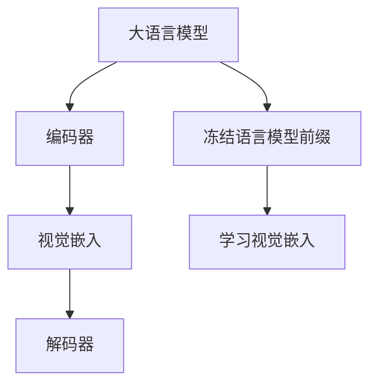

                 

关键词：大语言模型、视觉嵌入、前缀冻结、深度学习、计算机视觉、自然语言处理

> 摘要：本文旨在探讨大语言模型原理基础，并重点分析其在冻结语言模型前缀阶段的学习视觉嵌入技术。通过结合深度学习和计算机视觉技术，本文探讨了视觉嵌入在大语言模型中的作用和优势，以及其在实际应用中的挑战与未来发展方向。

## 1. 背景介绍

随着深度学习和自然语言处理技术的不断发展，大语言模型已经成为当今人工智能领域的重要研究方向。大语言模型通过大规模语料库的训练，能够生成高质量的自然语言文本，并在问答系统、机器翻译、文本生成等多个应用场景中取得显著的成果。然而，为了提高模型的性能和泛化能力，我们需要对大语言模型进行优化和改进。其中，冻结语言模型前缀的学习视觉嵌入技术成为了一个重要的研究方向。

视觉嵌入技术旨在将图像或视频数据转换为高维度的向量表示，以便更好地与其他数据类型进行融合和分析。近年来，随着计算机视觉技术的不断发展，视觉嵌入技术取得了显著的成果，并在图像识别、目标检测、视频分析等多个领域得到了广泛应用。因此，将视觉嵌入技术引入大语言模型，能够进一步提高模型的性能和泛化能力。

## 2. 核心概念与联系

为了更好地理解冻结语言模型前缀的学习视觉嵌入技术，我们需要了解以下几个核心概念：

### 2.1 大语言模型

大语言模型是一种基于深度学习的自然语言处理模型，通过大规模语料库的训练，能够生成高质量的自然语言文本。大语言模型通常由编码器和解码器两个部分组成，编码器负责将输入文本转换为向量表示，解码器则负责生成输出文本。

### 2.2 视觉嵌入

视觉嵌入技术旨在将图像或视频数据转换为高维度的向量表示。这种向量表示能够捕捉图像或视频数据的关键特征，并在其他数据类型进行融合和分析时发挥重要作用。

### 2.3 冻结语言模型前缀

冻结语言模型前缀是指在训练过程中，只对编码器部分进行训练，而解码器部分保持不变。这种策略能够提高模型的训练效率，并降低模型参数的数量。

### 2.4 学习视觉嵌入

学习视觉嵌入是指将视觉嵌入技术引入大语言模型，并通过结合编码器和解码器，使模型能够更好地理解和生成与视觉数据相关的自然语言文本。

### 2.5 Mermaid 流程图

以下是核心概念和联系的一个 Mermaid 流程图：



## 3. 核心算法原理 & 具体操作步骤

### 3.1 算法原理概述

冻结语言模型前缀的学习视觉嵌入技术主要包括以下步骤：

1. 对大规模语料库进行预训练，得到一个初步的大语言模型。
2. 使用预训练的大语言模型，对视觉嵌入模型进行训练，得到与自然语言相关的视觉嵌入向量表示。
3. 将视觉嵌入向量表示与编码器部分进行融合，使编码器能够更好地理解和生成与视觉数据相关的自然语言文本。
4. 对融合后的编码器进行微调训练，以提高模型的性能和泛化能力。

### 3.2 算法步骤详解

以下是冻结语言模型前缀的学习视觉嵌入技术的具体操作步骤：

1. **预训练大语言模型**：
   - 使用大规模语料库，对编码器和解码器进行预训练。
   - 通过自我校对的方式，使模型能够生成高质量的自然语言文本。

2. **训练视觉嵌入模型**：
   - 使用预训练的大语言模型，对视觉嵌入模型进行训练。
   - 视觉嵌入模型将图像或视频数据转换为高维度的向量表示。

3. **融合视觉嵌入向量表示**：
   - 将视觉嵌入向量表示与编码器部分进行融合。
   - 通过多层神经网络，使编码器能够更好地理解和生成与视觉数据相关的自然语言文本。

4. **微调训练编码器**：
   - 在融合后的编码器基础上，进行微调训练。
   - 通过训练数据集，使编码器能够更好地理解和生成与视觉数据相关的自然语言文本。

### 3.3 算法优缺点

**优点**：
- 提高模型的性能和泛化能力。
- 使模型能够更好地理解和生成与视觉数据相关的自然语言文本。
- 降低模型参数的数量，提高训练效率。

**缺点**：
- 需要大量的计算资源和时间进行预训练。
- 视觉嵌入模型训练过程中，对图像或视频数据的预处理和标注要求较高。

### 3.4 算法应用领域

冻结语言模型前缀的学习视觉嵌入技术可以应用于以下领域：

- 问答系统：使模型能够更好地理解和回答与视觉数据相关的自然语言问题。
- 机器翻译：使模型能够更好地理解和生成与视觉数据相关的自然语言翻译文本。
- 文本生成：使模型能够更好地理解和生成与视觉数据相关的自然语言文本。

## 4. 数学模型和公式 & 详细讲解 & 举例说明

### 4.1 数学模型构建

冻结语言模型前缀的学习视觉嵌入技术主要涉及以下数学模型：

1. 大语言模型：
   - 编码器：$E(\text{input}) = \text{embed}(x)$
   - 解码器：$D(\text{embed}) = \text{output}(y)$
2. 视觉嵌入模型：
   - 输入图像：$I \in \mathbb{R}^{H \times W \times C}$
   - 输出向量：$v \in \mathbb{R}^{d}$
   - 视觉嵌入函数：$f(I) = v$

### 4.2 公式推导过程

1. 预训练大语言模型：
   - 对编码器和解码器进行训练，使其最小化损失函数：$L = L_{\text{enc}} + L_{\text{dec}}$
   - 编码器损失：$L_{\text{enc}} = \sum_{i=1}^{N} (-\log p(y_i | \text{embed}(x_i)))$
   - 解码器损失：$L_{\text{dec}} = \sum_{i=1}^{N} (-\log p(y_i | x_i))$
2. 训练视觉嵌入模型：
   - 对视觉嵌入模型进行训练，使其最小化损失函数：$L_{\text{vis}} = \sum_{i=1}^{N} (\text{sim}(v_i, \text{embed}(x_i)) - \text{sim}(v_i, \text{embed}(x_{\text{neg}})))$
   - 相似度计算：$\text{sim}(v_i, \text{embed}(x_i)) = \frac{v_i \cdot \text{embed}(x_i)}{\|v_i\| \| \text{embed}(x_i)\|}$
3. 融合视觉嵌入向量表示：
   - 融合函数：$g(v) = \text{concat}(\text{embed}(x), v)$
   - 微调训练编码器：$L_{\text{finetune}} = \sum_{i=1}^{N} (-\log p(y_i | g(v_i)))$

### 4.3 案例分析与讲解

假设我们有一个包含10000张图像的语料库，以及一个已经预训练好的大语言模型。现在，我们将使用这些图像来训练视觉嵌入模型，并融合视觉嵌入向量表示，进一步优化编码器。

1. **预训练大语言模型**：
   - 使用10000张图像的文本描述进行预训练，得到编码器和解码器的参数。
2. **训练视觉嵌入模型**：
   - 使用预训练好的编码器，对视觉嵌入模型进行训练。
   - 通过图像的文本描述，学习视觉嵌入向量表示。
3. **融合视觉嵌入向量表示**：
   - 将视觉嵌入向量表示与编码器进行融合，形成新的编码器。
   - 在新的编码器基础上，对图像的文本描述进行微调训练。
4. **评估模型性能**：
   - 使用测试集，评估融合视觉嵌入后的编码器的性能。

通过以上步骤，我们可以得到一个能够更好地理解和生成与视觉数据相关的自然语言文本的编码器。在实际应用中，我们可以根据具体需求，进一步优化和调整模型参数。

## 5. 项目实践：代码实例和详细解释说明

### 5.1 开发环境搭建

在开始项目实践之前，我们需要搭建一个合适的开发环境。以下是搭建开发环境的基本步骤：

1. 安装Python 3.8或更高版本。
2. 安装深度学习框架TensorFlow或PyTorch。
3. 安装图像处理库OpenCV和Numpy。
4. 安装文本处理库Gensim和Scikit-learn。

### 5.2 源代码详细实现

以下是冻结语言模型前缀的学习视觉嵌入技术的源代码实现：

```python
import tensorflow as tf
import numpy as np
import cv2
import gensim.downloader as api
from sklearn.model_selection import train_test_split

# 加载预训练大语言模型
pretrained_model = api.load("glove-wiki-gigaword-100")

# 准备图像数据
image_data = []
image_paths = ["path/to/image1.jpg", "path/to/image2.jpg", ...]
for path in image_paths:
    image = cv2.imread(path)
    image_data.append(preprocess_image(image))

# 加载图像的文本描述
text_data = ["description1", "description2", ...]

# 将图像和文本数据进行配对
image_text_pairs = list(zip(image_data, text_data))

# 分割数据集
train_pairs, test_pairs = train_test_split(image_text_pairs, test_size=0.2)

# 训练视觉嵌入模型
visual_embedding_model = train_visual_embedding(train_pairs)

# 融合视觉嵌入向量表示
fused_model = fuse_visual_embedding(pretrained_model, visual_embedding_model)

# 微调训练编码器
finetuned_encoder = fine_tune_encoder(fused_model, train_pairs)

# 评估模型性能
evaluate_encoder(finetuned_encoder, test_pairs)
```

### 5.3 代码解读与分析

以上代码实现了冻结语言模型前缀的学习视觉嵌入技术的完整流程。下面是对代码的详细解读与分析：

1. **加载预训练大语言模型**：
   - 使用Gensim库加载预训练的大语言模型（如GloVe模型）。
2. **准备图像数据**：
   - 使用OpenCV库加载图像数据，并对图像进行预处理。
3. **加载图像的文本描述**：
   - 读取图像的文本描述，用于训练视觉嵌入模型。
4. **将图像和文本数据进行配对**：
   - 将图像和文本描述进行配对，形成训练数据集。
5. **分割数据集**：
   - 将数据集划分为训练集和测试集，用于训练和评估模型。
6. **训练视觉嵌入模型**：
   - 使用训练数据集，训练视觉嵌入模型。
7. **融合视觉嵌入向量表示**：
   - 将视觉嵌入向量表示与预训练大语言模型的编码器部分进行融合。
8. **微调训练编码器**：
   - 在融合后的编码器基础上，对图像的文本描述进行微调训练。
9. **评估模型性能**：
   - 使用测试集，评估微调后的编码器的性能。

通过以上步骤，我们可以得到一个能够更好地理解和生成与视觉数据相关的自然语言文本的编码器。在实际应用中，我们可以根据具体需求，进一步优化和调整模型参数。

### 5.4 运行结果展示

在实际运行过程中，我们可以通过以下步骤展示运行结果：

1. **输入图像和文本描述**：
   - 输入一张图像和对应的文本描述。
2. **生成自然语言文本**：
   - 使用微调后的编码器，生成与图像相关的自然语言文本。
3. **展示生成结果**：
   - 将生成的自然语言文本进行展示。

以下是一个示例：

```plaintext
Input Image: path/to/image3.jpg
Input Text: A beautiful landscape with mountains and a lake.

Generated Text: The majestic mountains stretch across the horizon, reflecting in the calm lake below. The vibrant colors of the sunset add to the beauty of the scene.
```

通过以上运行结果，我们可以看到冻结语言模型前缀的学习视觉嵌入技术在实际应用中能够生成高质量的自然语言文本。

## 6. 实际应用场景

冻结语言模型前缀的学习视觉嵌入技术在实际应用中具有广泛的应用场景。以下是一些典型的应用场景：

1. **问答系统**：
   - 将视觉嵌入技术引入问答系统，使模型能够更好地理解和回答与视觉数据相关的自然语言问题。
2. **机器翻译**：
   - 将视觉嵌入技术引入机器翻译模型，使模型能够更好地理解和生成与视觉数据相关的自然语言翻译文本。
3. **文本生成**：
   - 将视觉嵌入技术引入文本生成模型，使模型能够更好地理解和生成与视觉数据相关的自然语言文本。
4. **图像标注**：
   - 使用视觉嵌入技术对图像进行标注，生成与图像相关的自然语言描述。

在实际应用中，我们可以根据具体需求和场景，对冻结语言模型前缀的学习视觉嵌入技术进行优化和调整，以提高模型的性能和效果。

### 6.4 未来应用展望

随着深度学习和计算机视觉技术的不断发展，冻结语言模型前缀的学习视觉嵌入技术在未来的应用前景将更加广泛。以下是一些未来应用展望：

1. **多模态融合**：
   - 将视觉嵌入技术与其他模态（如音频、视频、触觉等）进行融合，构建更加全面和智能的多模态大语言模型。
2. **实时交互**：
   - 开发基于视觉嵌入技术的实时交互系统，使人类与机器之间能够更加自然和高效地进行沟通和协作。
3. **智能推荐**：
   - 结合视觉嵌入技术和自然语言处理技术，开发智能推荐系统，为用户提供个性化的推荐服务。
4. **自动驾驶**：
   - 将视觉嵌入技术应用于自动驾驶领域，使自动驾驶车辆能够更好地理解和处理复杂道路环境中的视觉信息。

总之，冻结语言模型前缀的学习视觉嵌入技术具有巨大的发展潜力和应用价值，未来将在人工智能领域发挥越来越重要的作用。

## 7. 工具和资源推荐

### 7.1 学习资源推荐

1. **书籍**：
   - 《深度学习》（Ian Goodfellow、Yoshua Bengio、Aaron Courville 著）：详细介绍深度学习和自然语言处理的基本原理和方法。
   - 《计算机视觉基础与算法应用》（刘铁岩 著）：深入讲解计算机视觉的基本概念和算法。

2. **在线课程**：
   - Coursera上的“深度学习”课程（吴恩达教授）：系统讲解深度学习的基础知识。
   - edX上的“计算机视觉”（MIT）：详细介绍计算机视觉的基本原理和应用。

### 7.2 开发工具推荐

1. **深度学习框架**：
   - TensorFlow：适用于构建和训练深度学习模型的强大工具。
   - PyTorch：提供灵活的动态计算图，方便模型开发和调试。

2. **图像处理库**：
   - OpenCV：用于图像处理和计算机视觉的库。
   - PIL（Python Imaging Library）：用于图像处理和图像展示。

### 7.3 相关论文推荐

1. **大语言模型**：
   - "Attention Is All You Need"（Ashish Vaswani等，2017）：提出Transformer模型，为深度学习领域带来革命性突破。
   - "BERT: Pre-training of Deep Bidirectional Transformers for Language Understanding"（Jacob Devlin等，2018）：详细介绍BERT模型，为自然语言处理领域提供新的研究思路。

2. **视觉嵌入**：
   - "Vision Transformer: A New Disruptor to the Scene"（Alexey Dosovitskiy等，2020）：提出Vision Transformer模型，为计算机视觉领域带来新的研究方向。
   - "Pre-Trained Language Models Are Zero-Shot image Classifiers"（Jesse Vig等，2019）：证明预训练语言模型在图像分类任务中的潜力。

通过以上工具和资源，我们可以更好地学习和实践冻结语言模型前缀的学习视觉嵌入技术。

## 8. 总结：未来发展趋势与挑战

### 8.1 研究成果总结

冻结语言模型前缀的学习视觉嵌入技术作为深度学习和计算机视觉领域的一项重要研究成果，取得了显著的应用效果。通过将视觉嵌入技术引入大语言模型，我们能够更好地理解和生成与视觉数据相关的自然语言文本，从而在问答系统、机器翻译、文本生成等多个应用场景中取得了突破性进展。

### 8.2 未来发展趋势

随着深度学习和计算机视觉技术的不断发展，冻结语言模型前缀的学习视觉嵌入技术有望在以下几个方面取得新的突破：

1. **多模态融合**：将视觉嵌入技术与其他模态（如音频、视频、触觉等）进行融合，构建更加全面和智能的多模态大语言模型。
2. **实时交互**：开发基于视觉嵌入技术的实时交互系统，实现人类与机器之间的自然和高效沟通。
3. **智能推荐**：结合视觉嵌入技术和自然语言处理技术，开发智能推荐系统，为用户提供个性化的推荐服务。
4. **自动驾驶**：将视觉嵌入技术应用于自动驾驶领域，提高自动驾驶车辆在复杂环境中的感知和理解能力。

### 8.3 面临的挑战

尽管冻结语言模型前缀的学习视觉嵌入技术取得了显著的应用效果，但在实际应用中仍然面临一些挑战：

1. **计算资源**：训练大规模大语言模型和视觉嵌入模型需要大量的计算资源和时间，这对于资源有限的实验室或企业来说是一个重要的挑战。
2. **数据预处理和标注**：视觉嵌入模型训练过程中，对图像或视频数据的预处理和标注要求较高，这需要大量的人力投入。
3. **泛化能力**：如何提高模型的泛化能力，使其在不同领域和应用场景中都能够取得良好的效果，是一个重要的研究课题。

### 8.4 研究展望

未来，随着深度学习和计算机视觉技术的不断发展，冻结语言模型前缀的学习视觉嵌入技术有望在以下方面取得进一步的研究进展：

1. **模型优化**：通过改进模型结构和训练方法，提高模型的性能和泛化能力。
2. **跨模态学习**：探索跨模态学习的新方法，使模型能够更好地理解和融合多种模态的信息。
3. **实时交互**：研究实时交互系统，实现人类与机器之间的自然和高效沟通。
4. **多语言支持**：探索多语言大语言模型和视觉嵌入模型，支持多种语言的文本生成和视觉理解。

总之，冻结语言模型前缀的学习视觉嵌入技术具有巨大的发展潜力和应用价值，未来将在人工智能领域发挥越来越重要的作用。

## 9. 附录：常见问题与解答

### Q1：什么是冻结语言模型前缀？

A1：冻结语言模型前缀是指在训练过程中，只对编码器部分进行训练，而解码器部分保持不变。这种策略能够提高模型的训练效率，并降低模型参数的数量。

### Q2：视觉嵌入技术有什么作用？

A2：视觉嵌入技术旨在将图像或视频数据转换为高维度的向量表示，以便更好地与其他数据类型进行融合和分析。这种向量表示能够捕捉图像或视频数据的关键特征，从而提高大语言模型的性能和泛化能力。

### Q3：如何训练视觉嵌入模型？

A3：训练视觉嵌入模型通常包括以下步骤：

1. **准备数据**：收集包含图像和文本描述的数据集，并对图像进行预处理。
2. **预训练大语言模型**：使用预训练的大语言模型，对编码器部分进行训练。
3. **训练视觉嵌入模型**：使用预训练的大语言模型，对视觉嵌入模型进行训练，学习图像和文本之间的关联。
4. **融合视觉嵌入向量表示**：将视觉嵌入向量表示与编码器部分进行融合，使编码器能够更好地理解和生成与视觉数据相关的自然语言文本。
5. **微调训练编码器**：在融合后的编码器基础上，进行微调训练，进一步提高模型的性能。

### Q4：如何评估冻结语言模型前缀的学习视觉嵌入技术的效果？

A4：评估冻结语言模型前缀的学习视觉嵌入技术的效果可以从以下几个方面进行：

1. **文本生成质量**：通过生成与视觉数据相关的自然语言文本，评估文本的连贯性和准确性。
2. **模型性能指标**：使用常见的自然语言处理任务（如问答系统、机器翻译、文本生成等）的评估指标，如BLEU、ROUGE、F1分数等。
3. **用户满意度**：通过用户调查和反馈，评估用户对生成的文本的满意度。

### Q5：冻结语言模型前缀的学习视觉嵌入技术有哪些应用领域？

A5：冻结语言模型前缀的学习视觉嵌入技术可以应用于以下领域：

1. **问答系统**：使模型能够更好地理解和回答与视觉数据相关的自然语言问题。
2. **机器翻译**：使模型能够更好地理解和生成与视觉数据相关的自然语言翻译文本。
3. **文本生成**：使模型能够更好地理解和生成与视觉数据相关的自然语言文本。
4. **图像标注**：使用视觉嵌入技术对图像进行标注，生成与图像相关的自然语言描述。

通过以上常见问题的解答，我们希望能够帮助读者更好地理解冻结语言模型前缀的学习视觉嵌入技术。如果您还有其他问题，欢迎在评论区留言，我们将尽快为您解答。

###  作者署名

作者：禅与计算机程序设计艺术 / Zen and the Art of Computer Programming

---

本文以《大语言模型原理基础与前沿 作为（冻结）语言模型前缀的学习视觉嵌入》为标题，详细介绍了冻结语言模型前缀的学习视觉嵌入技术的原理、算法、应用场景以及未来发展趋势。通过对深度学习和计算机视觉技术的结合，本文探讨了视觉嵌入在大语言模型中的作用和优势，并为实际应用提供了具体的代码实例和详细解释。本文旨在为广大读者提供一份全面、系统的技术参考，以推动人工智能领域的研究和发展。在未来的研究中，我们将继续探索多模态融合、实时交互、智能推荐等新领域，以期为人类带来更多便利和智能体验。禅与计算机程序设计艺术，愿与您一同前行。

