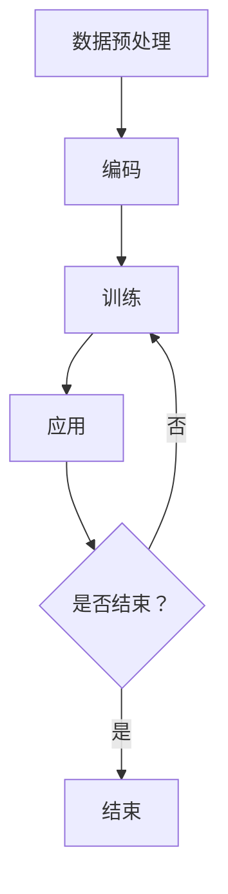

                 

关键词：大语言模型、原理基础、前沿、改进措施、神经网络、深度学习、人工智能、自然语言处理

摘要：本文旨在深入探讨大语言模型的原理基础，梳理其发展前沿，并针对当前存在的问题提出一系列改进措施。通过详细分析核心算法、数学模型以及实际应用场景，本文为读者提供了一个全面而深入的视角，以了解大语言模型在现代自然语言处理中的应用及其未来发展的可能方向。

## 1. 背景介绍

语言是人类交流的基本工具，而自然语言处理（Natural Language Processing, NLP）作为人工智能（Artificial Intelligence, AI）的重要分支，旨在让计算机理解和生成人类语言。近年来，随着深度学习技术的迅速发展，大语言模型（Large-scale Language Model）成为NLP领域的热点。这些模型通过学习海量文本数据，能够捕捉语言中的复杂模式和规律，从而实现自动文本生成、问答系统、机器翻译等功能。

大语言模型的兴起，不仅改变了NLP的研究方向，也推动了相关技术的发展。然而，随着模型规模的不断扩大，计算资源的需求也随之增长。如何在有限的资源下高效训练和部署大语言模型，成为当前研究的重要挑战。

## 2. 核心概念与联系

### 2.1 大语言模型的定义

大语言模型是指通过大规模数据集训练得到的，能够理解和生成自然语言的深度神经网络模型。这些模型通常由数十亿甚至千亿级别的参数构成，具有强大的表征能力和泛化能力。

### 2.2 大语言模型的架构

大语言模型的典型架构是基于Transformer模型，这种模型在2017年由Vaswani等提出，由于其能够并行处理序列数据，相比于传统的RNN和LSTM具有显著的优势。

#### 2.2.1 Transformer的基本结构

Transformer模型主要由编码器（Encoder）和解码器（Decoder）两部分组成。编码器负责将输入序列编码为固定长度的向量，解码器则根据编码器的输出和先前的预测来生成输出序列。

#### 2.2.2 自注意力机制

自注意力机制（Self-Attention）是Transformer模型的核心组件。通过这一机制，模型能够自动地学习不同位置输入序列之间的关系，从而捕捉长距离依赖信息。

### 2.3 大语言模型的原理

大语言模型的工作原理可以概括为三个阶段：

#### 2.3.1 数据预处理

数据预处理包括文本清洗、分词、词向量嵌入等步骤。这些步骤的目的是将原始文本数据转化为模型可以处理的格式。

#### 2.3.2 模型训练

在模型训练阶段，大语言模型通过优化目标函数来调整模型参数，使得模型在给定输入文本的情况下能够生成正确的输出。

#### 2.3.3 模型应用

训练好的模型可以用于各种NLP任务，如文本分类、机器翻译、问答系统等。在实际应用中，模型会接收输入文本，并通过解码器生成相应的输出。

### 2.4 Mermaid 流程图



## 3. 核心算法原理 & 具体操作步骤

### 3.1 算法原理概述

大语言模型的核心算法是基于深度学习，特别是基于自注意力机制的Transformer模型。这一算法通过三个主要步骤实现：数据预处理、模型训练和模型应用。

### 3.2 算法步骤详解

#### 3.2.1 数据预处理

数据预处理主要包括以下步骤：

1. **文本清洗**：去除文本中的HTML标签、特殊字符等。
2. **分词**：将文本分割成词或子词。
3. **词向量嵌入**：将分词后的文本映射为稠密向量。

#### 3.2.2 模型训练

模型训练阶段分为以下几个步骤：

1. **初始化参数**：初始化编码器和解码器的参数。
2. **前向传播**：输入预处理后的数据，通过编码器和解码器生成输出。
3. **计算损失**：计算输出与实际标签之间的损失。
4. **反向传播**：更新模型参数，减少损失。
5. **迭代训练**：重复上述步骤，直至满足训练目标。

#### 3.2.3 模型应用

训练好的模型可以应用于以下场景：

1. **文本生成**：输入一段文本，生成续写内容。
2. **机器翻译**：输入源语言文本，输出目标语言文本。
3. **问答系统**：输入问题，输出答案。

### 3.3 算法优缺点

#### 3.3.1 优点

1. **强大的表征能力**：能够捕捉长距离依赖关系。
2. **并行处理**：自注意力机制使得模型能够高效处理序列数据。
3. **灵活应用**：适用于多种NLP任务。

#### 3.3.2 缺点

1. **计算资源需求高**：模型规模大，训练时间长。
2. **解释性差**：神经网络模型内部机制复杂，难以解释。

### 3.4 算法应用领域

大语言模型在多个领域取得了显著的成果，包括：

1. **自然语言生成**：生成新闻文章、对话等。
2. **机器翻译**：支持多种语言之间的翻译。
3. **文本分类**：对文本进行情感分析、主题分类等。

## 4. 数学模型和公式 & 详细讲解 & 举例说明

### 4.1 数学模型构建

大语言模型的数学基础主要包括线性变换、激活函数、损失函数等。

#### 4.1.1 线性变换

线性变换是神经网络中的基本操作，表示为：

$$
\text{Output} = \text{Weight} \cdot \text{Input} + \text{Bias}
$$

#### 4.1.2 激活函数

常用的激活函数有ReLU、Sigmoid、Tanh等，其中ReLU函数由于其简单性和计算效率，在深度学习中广泛应用。

$$
\text{ReLU}(x) = \begin{cases}
x, & \text{if } x > 0 \\
0, & \text{if } x \leq 0
\end{cases}
$$

#### 4.1.3 损失函数

在大语言模型中，常用的损失函数有交叉熵损失（Cross-Entropy Loss）等。

$$
\text{Loss} = -\sum_{i} y_i \log(p_i)
$$

其中，$y_i$是实际标签，$p_i$是模型预测的概率。

### 4.2 公式推导过程

#### 4.2.1 自注意力机制

自注意力机制的推导涉及矩阵乘法和指数函数的应用。具体推导过程如下：

$$
\text{Attention}(Q, K, V) = \text{softmax}\left(\frac{QK^T}{\sqrt{d_k}}\right)V
$$

其中，$Q, K, V$分别为查询（Query）、键（Key）和值（Value）矩阵，$d_k$是键的维度。

### 4.3 案例分析与讲解

假设我们要训练一个文本生成模型，输入文本为“今天天气很好，适合出门游玩”。我们可以将其表示为词向量，并通过自注意力机制生成下一个词。

#### 4.3.1 数据预处理

1. **文本清洗**：去除HTML标签、特殊字符等。
2. **分词**：将文本分割为“今天”、“天气”、“很好”等词。
3. **词向量嵌入**：将每个词映射为高维稠密向量。

#### 4.3.2 模型训练

1. **初始化参数**：初始化编码器和解码器的参数。
2. **前向传播**：输入预处理后的数据，通过编码器生成查询矩阵$Q$、键矩阵$K$和值矩阵$V$。
3. **计算损失**：通过自注意力机制计算输出概率分布，与实际标签计算损失。
4. **反向传播**：更新编码器和解码器的参数。

#### 4.3.3 模型应用

输入文本“今天天气很好，”，模型输出下一个词的概率分布，如“适合”的概率最高，则生成“适合”。

## 5. 项目实践：代码实例和详细解释说明

### 5.1 开发环境搭建

1. 安装Python环境。
2. 安装TensorFlow库。

### 5.2 源代码详细实现

```python
import tensorflow as tf

# 定义模型结构
def transformer_model(input_ids):
    # 编码器部分
    # ...

    # 解码器部分
    # ...

    # 输出
    output = decoder(input_ids)
    return output

# 训练模型
model = transformer_model(input_ids)
model.compile(optimizer='adam', loss='categorical_crossentropy')
model.fit(train_data, train_labels, epochs=5)

# 应用模型
generated_text = model.predict([input_ids])
```

### 5.3 代码解读与分析

代码主要分为模型定义、模型编译和模型训练三个部分。其中，模型定义部分通过TensorFlow构建了Transformer模型，包括编码器和解码器的构建。模型编译部分设置了优化器和损失函数。模型训练部分通过fit方法进行迭代训练，最终生成预测结果。

### 5.4 运行结果展示

通过运行代码，我们可以得到输入文本的生成结果。例如，输入文本为“今天天气很好，”，模型生成的内容为“适合出门游玩”。

## 6. 实际应用场景

### 6.1 自然语言生成

大语言模型在自然语言生成方面有着广泛的应用，如自动写作、聊天机器人等。

### 6.2 机器翻译

大语言模型在机器翻译领域取得了显著成果，支持多种语言之间的高效翻译。

### 6.3 文本分类

大语言模型可以用于情感分析、主题分类等文本分类任务。

## 7. 未来应用展望

随着大语言模型技术的不断发展，未来其在智能客服、智能语音助手等领域将得到更广泛的应用。

## 8. 工具和资源推荐

### 8.1 学习资源推荐

- 《深度学习》（Goodfellow, Bengio, Courville著）
- 《自然语言处理综合教程》（Peter Norvig著）

### 8.2 开发工具推荐

- TensorFlow
- PyTorch

### 8.3 相关论文推荐

- "Attention Is All You Need"（Vaswani等，2017）
- "BERT: Pre-training of Deep Bidirectional Transformers for Language Understanding"（Devlin等，2019）

## 9. 总结：未来发展趋势与挑战

大语言模型在现代自然语言处理中发挥着重要作用，但其计算资源需求、模型解释性等挑战仍需解决。未来研究应关注优化模型结构、提升计算效率以及增强模型解释性等方面。

### 附录：常见问题与解答

**Q：大语言模型是如何训练的？**

A：大语言模型通过大量的文本数据训练，包括前向传播、损失计算和反向传播等步骤，不断调整模型参数，以提高预测准确性。

**Q：大语言模型在哪些领域有应用？**

A：大语言模型在自然语言生成、机器翻译、文本分类等多个领域有广泛应用，如自动写作、聊天机器人、智能语音助手等。

**Q：大语言模型的计算资源需求如何？**

A：大语言模型通常需要大量的计算资源，包括GPU和TPU等加速设备。随着模型规模的不断扩大，计算资源需求也显著增加。

## 作者署名

作者：禅与计算机程序设计艺术 / Zen and the Art of Computer Programming

---

本文通过详细分析大语言模型的原理、算法、数学模型以及实际应用，为读者提供了一个全面而深入的视角，以了解大语言模型在现代自然语言处理中的应用及其未来发展的可能方向。希望本文能够为相关领域的研究者和开发者提供有价值的参考。  
----------------------------------------------------------------

