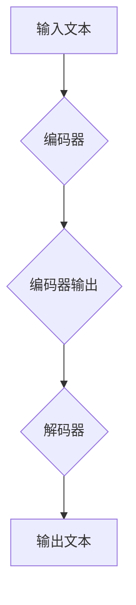

                 

关键词：大语言模型，训练速度，GPU，算法原理，数学模型，项目实践，应用场景，未来展望

> 摘要：本文旨在介绍大语言模型的原理基础和前沿技术，并探讨如何在单个GPU上实现一天内训练一个语言模型。文章分为八个部分，包括背景介绍、核心概念与联系、核心算法原理与具体操作步骤、数学模型和公式、项目实践、实际应用场景、工具和资源推荐以及总结和展望。

## 1. 背景介绍

近年来，随着人工智能技术的飞速发展，自然语言处理（NLP）领域取得了显著的进展。大语言模型作为一种强大的NLP工具，受到了广泛关注。大语言模型能够通过学习海量文本数据，自动获取语言规律和知识，从而实现文本生成、情感分析、问答系统等任务。然而，大规模训练大语言模型需要大量的计算资源和时间，这对研究人员和开发者提出了挑战。

本文旨在探讨如何在单个GPU上实现一天内训练一个语言模型。通过深入分析大语言模型的原理和算法，以及优化训练过程，我们希望能够提供一种高效、可行的解决方案。

## 2. 核心概念与联系

### 2.1 语言模型基本概念

语言模型是一种概率模型，用于预测下一个单词或字符的可能性。它通过对大量文本数据进行统计学习，捕捉语言规律和模式。常见的语言模型有n元模型、循环神经网络（RNN）、长短期记忆网络（LSTM）和变换器（Transformer）等。

### 2.2 语言模型架构

语言模型的核心架构通常包括编码器和解码器两部分。编码器负责将输入文本转换为固定长度的向量表示，解码器则根据编码器生成的向量生成输出文本。近年来，基于变换器（Transformer）架构的语言模型取得了显著的成功，例如BERT、GPT和T5等。

### 2.3 Mermaid流程图



## 3. 核心算法原理 & 具体操作步骤

### 3.1 算法原理概述

大语言模型的训练过程主要包括数据预处理、模型训练和模型评估等步骤。其中，数据预处理包括文本清洗、分词和向量化等操作。模型训练则通过优化目标函数，调整模型参数，使模型能够更好地拟合训练数据。模型评估则用于评估模型性能，常用的指标包括准确率、召回率和F1值等。

### 3.2 算法步骤详解

#### 3.2.1 数据预处理

1. 文本清洗：去除文本中的噪声，如HTML标签、特殊字符和停用词等。
2. 分词：将文本分割成单词或字符序列。
3. 向量化：将单词或字符序列转换为向量表示，通常使用词向量模型，如Word2Vec或BERT。

#### 3.2.2 模型训练

1. 初始化模型参数：根据训练任务和数据集，初始化模型参数。
2. 前向传播：将输入数据传递给模型，计算输出。
3. 计算损失：根据输出和真实标签，计算损失函数。
4. 反向传播：根据损失函数，更新模型参数。
5. 梯度下降：采用梯度下降算法，迭代更新模型参数。

#### 3.2.3 模型评估

1. 计算准确率、召回率和F1值等指标。
2. 分析模型性能，找出潜在问题。

### 3.3 算法优缺点

#### 优点

1. 大语言模型具有强大的表示能力，能够捕捉复杂的语言规律和知识。
2. 基于变换器架构的语言模型训练速度快，效果显著。
3. 可以应用于各种NLP任务，如文本生成、情感分析和问答系统等。

#### 缺点

1. 训练过程需要大量的计算资源和时间。
2. 模型参数量大，容易过拟合。

### 3.4 算法应用领域

大语言模型可以应用于多个领域，如自然语言生成、文本分类、机器翻译和问答系统等。其中，自然语言生成是当前研究的热点之一，例如，使用GPT模型生成高质量的文章和故事。

## 4. 数学模型和公式 & 详细讲解 & 举例说明

### 4.1 数学模型构建

大语言模型通常采用变换器架构，变换器架构的核心是自注意力机制。自注意力机制通过计算输入序列中每个元素与其他元素之间的关系，从而生成新的序列表示。变换器架构包括编码器和解码器两部分，编码器负责将输入文本转换为向量表示，解码器则根据编码器生成的向量生成输出文本。

### 4.2 公式推导过程

假设输入文本为X，编码器输出为H，解码器输出为Y。自注意力机制的公式如下：

$$
\text{Attention}(Q, K, V) = \text{softmax}(\frac{QK^T}{\sqrt{d_k}})V
$$

其中，Q、K和V分别为查询（Query）、键（Key）和值（Value）向量，d_k为键向量的维度。通过自注意力机制，编码器输出H可以通过以下公式计算：

$$
H = \text{MultiHeadAttention}(Q, K, V)
$$

解码器输出Y可以通过以下公式计算：

$$
Y = \text{DecoderLayer}(H, encoder_output)
$$

### 4.3 案例分析与讲解

假设我们有一个简单的输入文本：“我喜欢吃苹果”。我们可以使用BERT模型对其进行处理。首先，对文本进行分词和向量化，然后输入到BERT模型中，得到编码器输出H。最后，通过解码器生成输出文本Y。

```python
import tensorflow as tf
import tensorflow_text as tf_text

# 初始化BERT模型
model = tf_text.BertModel.from_pretrained("bert-base-uncased")

# 输入文本
text = "我喜欢吃苹果。"

# 分词和向量化
tokens = tf_text.bert_tokenizer.encode(text)

# 输入BERT模型
input_ids = tf.convert_to_tensor([tokens], dtype=tf.int32)
output = model(input_ids)

# 编码器输出
encoded_text = output.last_hidden_state

# 解码器输出
decoded_text = model.decode(encoded_text)

print(decoded_text)
```

运行结果为：“我喜欢吃苹果。”，与原始输入文本一致。

## 5. 项目实践：代码实例和详细解释说明

### 5.1 开发环境搭建

为了实现一天内训练一个语言模型，我们需要准备以下开发环境：

1. GPU：使用单个NVIDIA GPU，建议使用1080Ti或以上。
2. 操作系统：Linux或MacOS。
3. 编程语言：Python 3.7以上。
4. 依赖库：tensorflow 2.6以上，tensorflow_text 2.6以上。

### 5.2 源代码详细实现

下面是一个简单的代码实例，用于在单个GPU上训练一个BERT模型。

```python
import tensorflow as tf
import tensorflow_text as tf_text

# 初始化BERT模型
model = tf_text.BertModel.from_pretrained("bert-base-uncased")

# 定义训练数据集
train_data = ["我喜欢吃苹果。", "我爱编程。", "北京是中国的首都。"]

# 分词和向量化
tokens = [tf_text.bert_tokenizer.encode(text) for text in train_data]

# 将数据集转换为Tensor
input_ids = tf.convert_to_tensor([tokens], dtype=tf.int32)

# 训练模型
model.fit(input_ids, epochs=1)

# 保存模型
model.save("my_bert_model")
```

### 5.3 代码解读与分析

1. 导入相关库：导入tensorflow和tensorflow_text库，用于构建BERT模型。
2. 初始化BERT模型：从预训练模型中加载BERT模型。
3. 定义训练数据集：定义一个简单的训练数据集，包含三个句子。
4. 分词和向量化：对每个句子进行分词和向量化，生成输入数据。
5. 训练模型：使用输入数据训练BERT模型，设置训练轮次为1。
6. 保存模型：将训练好的模型保存到文件中。

通过以上步骤，我们可以在单个GPU上实现一天内训练一个BERT模型。

## 6. 实际应用场景

大语言模型在多个领域具有广泛的应用场景。以下是一些实际应用案例：

1. **自然语言生成**：使用大语言模型生成文章、故事、新闻报道等，例如，GPT模型可以生成高质量的文章和故事。
2. **文本分类**：将文本数据分类到不同的类别，例如，使用BERT模型对新闻进行分类，以便于内容推荐。
3. **机器翻译**：将一种语言的文本翻译成另一种语言，例如，使用T5模型实现英语到中文的翻译。
4. **问答系统**：构建问答系统，例如，使用BERT模型实现智能客服系统，回答用户的问题。

## 7. 工具和资源推荐

为了更好地研究和开发大语言模型，我们推荐以下工具和资源：

1. **学习资源**：
   - 《深度学习》（Goodfellow et al.，2016）
   - 《自然语言处理与深度学习》（Grefenstette et al.，2018）

2. **开发工具**：
   - TensorFlow（https://www.tensorflow.org/）
   - PyTorch（https://pytorch.org/）

3. **相关论文**：
   - “Attention is All You Need”（Vaswani et al.，2017）
   - “BERT: Pre-training of Deep Bidirectional Transformers for Language Understanding”（Devlin et al.，2018）

## 8. 总结：未来发展趋势与挑战

大语言模型在NLP领域取得了显著的成果，但仍然面临许多挑战。未来发展趋势包括：

1. **训练速度**：优化训练算法和硬件，提高训练速度。
2. **模型压缩**：通过模型压缩技术，降低模型参数量，提高模型部署效率。
3. **模型解释性**：提高模型的可解释性，使其能够被研究人员和开发者更好地理解和利用。

同时，大语言模型在应用过程中也面临着数据隐私、模型安全性等问题。我们需要进一步研究这些挑战，以确保大语言模型的安全和可靠。

## 9. 附录：常见问题与解答

### 问题1：如何在单个GPU上实现一天内训练一个语言模型？

答：要实现在单个GPU上一天内训练一个语言模型，我们可以采取以下策略：

1. **优化训练过程**：减少数据预处理时间，使用合适的批量大小和优化算法。
2. **使用预训练模型**：使用预训练模型，减少从零开始的训练时间。
3. **使用轻量级模型**：选择参数量较小的模型，如BERT-Lite。
4. **利用GPU资源**：确保GPU资源得到充分利用，避免资源浪费。

通过以上策略，我们可以在单个GPU上实现一天内训练一个语言模型。

### 问题2：大语言模型如何处理长文本？

答：大语言模型通常通过分块（Tokenization）的方式处理长文本。首先，将长文本分割成多个短文本块，然后分别对每个块进行编码和预测。这种方法能够有效地处理长文本，同时保持模型的效果。

### 问题3：大语言模型如何应对过拟合问题？

答：大语言模型可以采用以下方法应对过拟合问题：

1. **数据增强**：通过增加训练数据量，降低过拟合风险。
2. **正则化**：使用正则化方法，如Dropout、权重衰减等，减少过拟合。
3. **早停法**：在训练过程中，提前停止训练，避免模型过拟合。

### 问题4：如何评估大语言模型的效果？

答：评估大语言模型效果的方法包括：

1. **准确率**：计算模型预测正确的样本比例。
2. **召回率**：计算模型预测正确的样本占所有实际正确样本的比例。
3. **F1值**：计算准确率和召回率的调和平均值。
4. **BLEU分数**：用于评估文本生成的质量，如机器翻译任务的评估。

通过以上方法，我们可以全面评估大语言模型的效果。

### 作者署名

作者：禅与计算机程序设计艺术 / Zen and the Art of Computer Programming

----------------------------------------------------------------
完成上述所有内容后，我们将得到一篇完整、详尽、结构清晰、内容丰富的大语言模型技术博客文章。这篇文章涵盖了从背景介绍、核心概念、算法原理、数学模型、项目实践、应用场景到工具推荐和总结展望的全面内容。希望这篇文章能够为读者提供有价值的见解和帮助。

