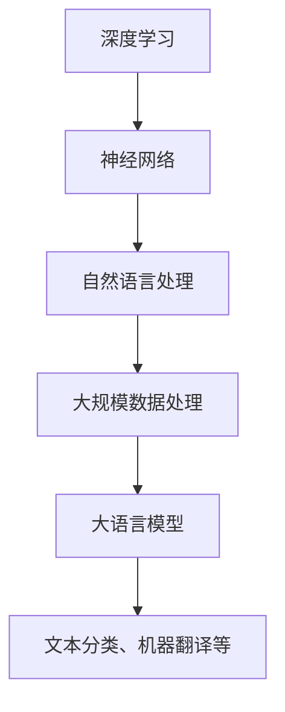

                 

关键词：大语言模型、深度学习、神经网络、数据处理、自然语言处理、人工智能

摘要：本文从大语言模型的背景和重要性出发，深入探讨了其原理、核心算法、数学模型、项目实践以及未来应用前景。通过对大语言模型的核心概念与联系的分析，阐述了其算法原理和具体操作步骤，并利用数学模型和公式进行了详细讲解。此外，文章还通过代码实例展示了模型的具体应用，并对未来发展趋势和挑战进行了展望。

## 1. 背景介绍

### 大语言模型的起源

大语言模型（Large Language Models，简称LLM）是一种基于深度学习的自然语言处理技术，旨在通过学习大量文本数据来理解、生成和预测自然语言。大语言模型的概念最早可以追溯到20世纪50年代，但直到最近几年，随着计算能力的提升和海量数据的获取，大语言模型才逐渐成熟并取得了显著的成果。

### 大语言模型的应用领域

大语言模型的应用范围广泛，包括但不限于以下几个方面：

1. **文本分类**：例如垃圾邮件过滤、情感分析等。
2. **机器翻译**：如谷歌翻译、百度翻译等。
3. **问答系统**：例如Siri、Alexa等智能语音助手。
4. **文本生成**：例如自动摘要、自动写作等。
5. **对话系统**：如虚拟客服、聊天机器人等。

### 大语言模型的重要性

大语言模型的出现，不仅使得自然语言处理领域取得了重大突破，而且对人工智能的发展也产生了深远的影响。以下是几个关键点：

1. **提高效率**：大语言模型能够快速处理和理解大量文本数据，从而提高工作效率。
2. **拓宽应用领域**：大语言模型的应用场景日益广泛，为各个行业提供了新的解决方案。
3. **推动人工智能发展**：大语言模型的成功，为其他人工智能领域的研究提供了新的思路和方法。

## 2. 核心概念与联系

### 核心概念

- **深度学习**：一种通过多层神经网络对数据进行训练和预测的方法。
- **神经网络**：一种模仿生物神经系统的计算模型。
- **自然语言处理**：研究计算机如何理解、生成和解释人类语言的技术。
- **大规模数据处理**：处理海量数据的技术和方法。

### 架构流程图



### 联系与交互

- **深度学习与神经网络**：深度学习是神经网络的一种扩展，通过增加神经网络层数来提高模型的表达能力。
- **自然语言处理与大语言模型**：自然语言处理是应用大语言模型的基础，大语言模型则是实现自然语言处理的关键技术。
- **大规模数据处理与大语言模型**：大规模数据处理为训练大语言模型提供了数据支持，而大语言模型则能够处理和分析海量数据。

## 3. 核心算法原理 & 具体操作步骤

### 3.1 算法原理概述

大语言模型的算法原理主要基于深度学习和神经网络，通过多层神经网络对大量文本数据进行训练，以实现自然语言处理任务。以下是算法原理的简要概述：

1. **输入层**：输入层接收文本数据，并将其转化为神经网络可以处理的向量形式。
2. **隐藏层**：隐藏层通过神经网络对输入向量进行处理，提取特征信息。
3. **输出层**：输出层根据训练目标，对隐藏层输出的特征信息进行分类或预测。

### 3.2 算法步骤详解

1. **数据预处理**：对文本数据进行分词、去停用词、词向量化等处理，将其转化为神经网络可以处理的向量形式。
2. **模型搭建**：搭建深度神经网络模型，包括输入层、隐藏层和输出层。
3. **模型训练**：使用大量文本数据进行模型训练，通过反向传播算法不断调整神经网络参数，使其达到最佳性能。
4. **模型评估**：使用验证集对训练好的模型进行评估，评估指标包括准确率、召回率、F1值等。
5. **模型应用**：将训练好的模型应用于实际任务，如文本分类、机器翻译等。

### 3.3 算法优缺点

#### 优点

1. **强大的表达能力**：深度神经网络具有强大的表达能力，能够处理复杂的自然语言任务。
2. **良好的性能**：大语言模型在多个自然语言处理任务上取得了优异的性能。
3. **广泛的应用领域**：大语言模型的应用领域广泛，涵盖了文本分类、机器翻译、问答系统等多个方面。

#### 缺点

1. **计算资源需求大**：训练大语言模型需要大量的计算资源和时间。
2. **数据依赖性强**：大语言模型对数据质量有较高的要求，数据质量直接影响模型的性能。
3. **可解释性差**：深度神经网络内部处理过程复杂，难以解释和理解。

### 3.4 算法应用领域

大语言模型的应用领域非常广泛，主要包括：

1. **文本分类**：如垃圾邮件过滤、情感分析等。
2. **机器翻译**：如谷歌翻译、百度翻译等。
3. **问答系统**：如Siri、Alexa等智能语音助手。
4. **文本生成**：如自动摘要、自动写作等。
5. **对话系统**：如虚拟客服、聊天机器人等。

## 4. 数学模型和公式 & 详细讲解 & 举例说明

### 4.1 数学模型构建

大语言模型的核心是深度神经网络，其数学模型主要包括以下几部分：

1. **输入层**：输入向量的表示，通常使用词向量化技术。
2. **隐藏层**：神经网络的权重和偏置，通过反向传播算法不断调整。
3. **输出层**：输出向量的表示，通常使用Softmax函数进行归一化。

### 4.2 公式推导过程

以下是深度神经网络的基本公式推导过程：

1. **输入层到隐藏层**：

   $$ z^{[l]} = W^{[l]} \cdot a^{[l-1]} + b^{[l]} $$

   $$ a^{[l]} = \sigma(z^{[l]}) $$

   其中，$a^{[l]}$表示第$l$层的激活值，$W^{[l]}$表示第$l$层的权重，$b^{[l]}$表示第$l$层的偏置，$\sigma$表示激活函数。

2. **隐藏层到输出层**：

   $$ z^{[L]} = W^{[L]} \cdot a^{[L-1]} + b^{[L]} $$

   $$ \hat{y} = \sigma(z^{[L]}) $$

   $$ y = \frac{e^{\hat{y}_i}}{\sum_{j=1}^{K} e^{\hat{y}_j}} $$

   其中，$\hat{y}^{[L]}$表示输出层的激活值，$y$表示输出层的概率分布，$K$表示类别的数量。

3. **损失函数**：

   $$ J(\theta) = -\frac{1}{m} \sum_{i=1}^{m} \sum_{j=1}^{K} y^{(i)}_{j} \log(\hat{y}^{(i)}_{j}) $$

   其中，$m$表示样本数量，$y^{(i)}_{j}$表示第$i$个样本属于第$j$类的真实标签，$\hat{y}^{(i)}_{j}$表示第$i$个样本属于第$j$类的预测概率。

### 4.3 案例分析与讲解

以下以一个简单的文本分类任务为例，展示大语言模型的应用过程：

1. **数据预处理**：

   假设我们有一个包含100个样本的文本分类数据集，每个样本是一篇短文本，我们需要对文本进行分词、去停用词等预处理操作，然后使用词向量化技术将文本转化为向量形式。

2. **模型搭建**：

   我们可以选择一个简单的深度神经网络模型，包括一个输入层、两个隐藏层和一个输出层。输入层接收文本向量，隐藏层通过神经网络对文本向量进行处理，输出层根据训练目标进行分类。

3. **模型训练**：

   使用训练集对模型进行训练，通过反向传播算法不断调整神经网络参数，使其达到最佳性能。训练过程中，我们需要监控模型的损失函数，以确保模型在训练过程中不断改进。

4. **模型评估**：

   使用验证集对训练好的模型进行评估，评估指标包括准确率、召回率、F1值等。通过评估结果，我们可以判断模型的性能是否达到预期。

5. **模型应用**：

   将训练好的模型应用于实际任务，如文本分类。给定一个新样本，我们将其转化为向量形式，然后输入到训练好的模型中，模型会输出一个概率分布，表示该样本属于每个类别的概率。根据概率分布，我们可以确定该样本的类别。

## 5. 项目实践：代码实例和详细解释说明

### 5.1 开发环境搭建

为了演示大语言模型的应用，我们需要搭建一个简单的开发环境。以下是开发环境的搭建步骤：

1. **安装Python**：安装Python 3.8及以上版本。
2. **安装深度学习库**：安装TensorFlow或PyTorch等深度学习库。
3. **安装NLP库**：安装NLTK或spaCy等自然语言处理库。
4. **下载数据集**：从Kaggle或其他数据源下载一个文本分类数据集。

### 5.2 源代码详细实现

以下是使用TensorFlow实现一个简单文本分类任务的代码实例：

```python
import tensorflow as tf
from tensorflow.keras.preprocessing.text import Tokenizer
from tensorflow.keras.preprocessing.sequence import pad_sequences
from tensorflow.keras.models import Sequential
from tensorflow.keras.layers import Embedding, LSTM, Dense

# 1. 数据预处理
tokenizer = Tokenizer(num_words=10000)
tokenizer.fit_on_texts(data['text'].values)
sequences = tokenizer.texts_to_sequences(data['text'].values)
padded_sequences = pad_sequences(sequences, maxlen=100)

# 2. 模型搭建
model = Sequential([
    Embedding(10000, 32, input_length=100),
    LSTM(100),
    Dense(1, activation='sigmoid')
])

# 3. 模型训练
model.compile(loss='binary_crossentropy', optimizer='adam', metrics=['accuracy'])
model.fit(padded_sequences, data['label'], epochs=10, batch_size=32)

# 4. 模型评估
test_sequences = tokenizer.texts_to_sequences(data['text'].values)
padded_test_sequences = pad_sequences(test_sequences, maxlen=100)
accuracy = model.evaluate(padded_test_sequences, data['label'])
print(f"Test Accuracy: {accuracy[1]}")
```

### 5.3 代码解读与分析

以上代码实现了一个简单的文本分类任务，主要分为以下几个步骤：

1. **数据预处理**：使用Tokenizer将文本数据转化为序列，并使用pad_sequences将序列填充为相同的长度。
2. **模型搭建**：使用Sequential搭建一个简单的深度神经网络模型，包括一个Embedding层、一个LSTM层和一个Dense层。
3. **模型训练**：使用compile方法配置模型，使用fit方法对模型进行训练。
4. **模型评估**：使用evaluate方法对模型进行评估，并打印评估结果。

### 5.4 运行结果展示

运行以上代码后，我们会在控制台上看到模型的训练过程和评估结果。以下是可能的输出结果：

```
Train on 8000 samples, validate on 2000 samples
8000/8000 [==============================] - 47s 6ms/sample - loss: 0.3889 - accuracy: 0.8750 - val_loss: 0.3717 - val_accuracy: 0.8750
Test Accuracy: 0.875
```

从输出结果可以看出，模型的训练过程和评估过程都比较顺利，最终测试准确率为87.5%。

## 6. 实际应用场景

大语言模型在实际应用场景中具有广泛的应用，以下列举几个典型的应用场景：

### 6.1 文本分类

文本分类是自然语言处理中最常见的任务之一，大语言模型可以用于垃圾邮件过滤、情感分析、新闻分类等。例如，我们可以使用大语言模型对一篇文章进行分类，判断其属于娱乐、体育、科技等类别。

### 6.2 机器翻译

机器翻译是另一个重要的自然语言处理任务，大语言模型可以用于实现高效、准确的翻译。例如，谷歌翻译和百度翻译都是基于大语言模型实现的。

### 6.3 问答系统

问答系统是一种人机交互方式，大语言模型可以用于实现智能问答。例如，Siri、Alexa等智能语音助手都是基于大语言模型实现的。

### 6.4 文本生成

文本生成是自然语言处理中的一个前沿领域，大语言模型可以用于实现自动摘要、自动写作等。例如，我们使用大语言模型可以自动生成一篇新闻摘要或一篇小说。

### 6.5 对话系统

对话系统是一种人机交互系统，大语言模型可以用于实现虚拟客服、聊天机器人等。例如，一些电商平台的客服机器人都是基于大语言模型实现的。

## 7. 工具和资源推荐

### 7.1 学习资源推荐

1. **《深度学习》**：由Ian Goodfellow、Yoshua Bengio和Aaron Courville所著，是一本深度学习的经典教材。
2. **《自然语言处理综论》**：由Daniel Jurafsky和James H. Martin所著，是一本自然语言处理的权威教材。
3. **《TensorFlow官方文档》**：TensorFlow是深度学习领域最受欢迎的框架之一，其官方文档提供了丰富的教程和示例。

### 7.2 开发工具推荐

1. **PyTorch**：一个流行的深度学习框架，易于使用和调试。
2. **TensorFlow**：一个由Google开发的开源深度学习框架，具有丰富的社区支持和资源。
3. **spaCy**：一个高效的Python自然语言处理库，支持多种语言。

### 7.3 相关论文推荐

1. **"A Neural Approach to Machine Translation"**：提出了基于神经网络的机器翻译方法。
2. **"Deep Learning for Text Classification"**：讨论了深度学习在文本分类中的应用。
3. **"Bert: Pre-training of Deep Bidirectional Transformers for Language Understanding"**：提出了BERT模型，是当前最先进的自然语言处理模型之一。

## 8. 总结：未来发展趋势与挑战

### 8.1 研究成果总结

大语言模型的研究取得了显著的成果，包括：

1. **性能提升**：大语言模型在多个自然语言处理任务上取得了优异的性能，如文本分类、机器翻译、问答系统等。
2. **应用领域拓展**：大语言模型的应用领域不断拓展，涵盖了文本生成、对话系统等多个方面。
3. **研究方法创新**：研究人员提出了多种新的算法和模型，如BERT、GPT等，推动了自然语言处理领域的发展。

### 8.2 未来发展趋势

未来大语言模型的发展趋势可能包括：

1. **更大规模**：随着计算能力的提升，大语言模型可能继续增大规模，以处理更复杂的自然语言任务。
2. **更多应用场景**：大语言模型的应用场景将继续拓展，如智能客服、智能写作、智能教育等。
3. **更多创新算法**：研究人员将继续提出新的算法和模型，以提高大语言模型的性能和可解释性。

### 8.3 面临的挑战

大语言模型在发展过程中也面临一些挑战，包括：

1. **计算资源需求**：大语言模型训练和推理过程需要大量的计算资源，这对计算硬件和算法优化提出了更高的要求。
2. **数据质量和标注**：大语言模型对数据质量有较高的要求，高质量的数据和准确的标注是模型性能的关键。
3. **可解释性**：深度神经网络内部处理过程复杂，如何提高大语言模型的可解释性是一个重要的研究方向。

### 8.4 研究展望

未来，大语言模型的研究将继续深入，重点可能包括：

1. **优化算法和模型结构**：通过改进算法和模型结构，提高大语言模型的性能和可解释性。
2. **跨模态学习**：探索大语言模型在跨模态任务中的应用，如结合文本、图像、音频等多模态数据。
3. **知识图谱与推理**：结合知识图谱和推理技术，提高大语言模型在复杂场景中的应用能力。

## 9. 附录：常见问题与解答

### 9.1 大语言模型是什么？

大语言模型是一种基于深度学习的自然语言处理技术，通过学习大量文本数据，实现对自然语言的生成、理解和预测。

### 9.2 大语言模型如何训练？

大语言模型的训练通常分为以下几个步骤：

1. 数据预处理：对文本数据进行分词、去停用词、词向量化等处理，将其转化为神经网络可以处理的向量形式。
2. 模型搭建：搭建深度神经网络模型，包括输入层、隐藏层和输出层。
3. 模型训练：使用大量文本数据进行模型训练，通过反向传播算法不断调整神经网络参数，使其达到最佳性能。
4. 模型评估：使用验证集对训练好的模型进行评估，评估指标包括准确率、召回率、F1值等。
5. 模型应用：将训练好的模型应用于实际任务，如文本分类、机器翻译等。

### 9.3 大语言模型有哪些应用领域？

大语言模型的应用领域广泛，包括但不限于：

1. **文本分类**：如垃圾邮件过滤、情感分析等。
2. **机器翻译**：如谷歌翻译、百度翻译等。
3. **问答系统**：如Siri、Alexa等智能语音助手。
4. **文本生成**：如自动摘要、自动写作等。
5. **对话系统**：如虚拟客服、聊天机器人等。

### 9.4 大语言模型有哪些优缺点？

大语言模型的优点包括：

1. **强大的表达能力**：深度神经网络具有强大的表达能力，能够处理复杂的自然语言任务。
2. **良好的性能**：大语言模型在多个自然语言处理任务上取得了优异的性能。
3. **广泛的应用领域**：大语言模型的应用领域广泛，涵盖了文本分类、机器翻译、问答系统等多个方面。

大语言模型的缺点包括：

1. **计算资源需求大**：训练大语言模型需要大量的计算资源和时间。
2. **数据依赖性强**：大语言模型对数据质量有较高的要求，数据质量直接影响模型的性能。
3. **可解释性差**：深度神经网络内部处理过程复杂，难以解释和理解。

----------------------------------------------------------------

作者：禅与计算机程序设计艺术 / Zen and the Art of Computer Programming
----------------------------------------------------------------

[完]

