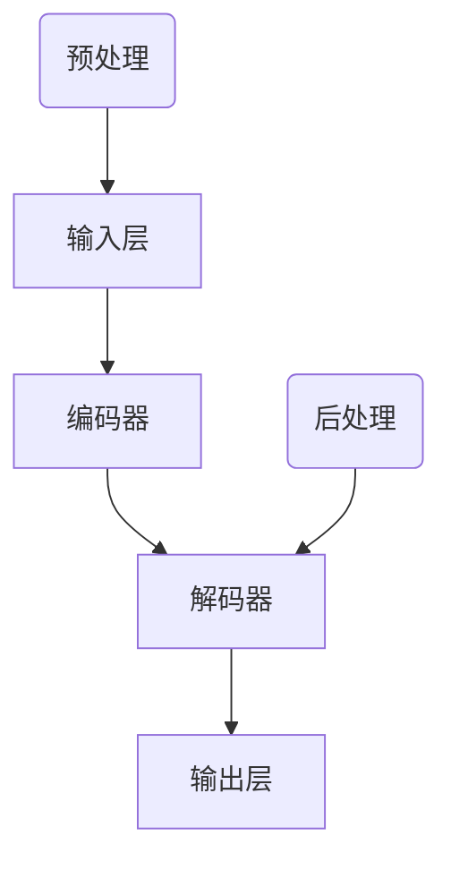

                 

关键词：大语言模型、自然语言处理、深度学习、人工智能、机器学习、神经网络、计算模型、文本生成、文本理解、语义分析、上下文理解。

## 摘要

本文旨在探讨大语言模型的基本原理、发展历程以及面临的挑战与机遇。通过对大语言模型的核心概念、算法原理、数学模型和应用场景的深入分析，本文揭示了这一领域的关键技术进展和未来发展方向。我们将探讨如何优化大语言模型的性能，如何在各种实际应用中充分利用其能力，以及如何应对当前面临的挑战，为读者提供全面的技术视角和实用指南。

## 1. 背景介绍

自然语言处理（NLP）作为人工智能的核心领域之一，近年来取得了飞速发展。随着互联网的普及和数据的爆炸式增长，人们对文本信息的处理需求也日益增加。大语言模型（Large Language Model）应运而生，成为NLP领域的核心技术之一。

大语言模型是基于深度学习的复杂神经网络结构，通过对海量文本数据的学习，能够理解和生成自然语言。与传统的方法相比，大语言模型具有更强的通用性和灵活性，能够处理多种语言任务，如文本分类、命名实体识别、机器翻译、问答系统等。

### 1.1 历史背景

自然语言处理的历史可以追溯到20世纪50年代。当时，计算机科学家们试图通过编写规则和语法解析方法来处理自然语言。然而，由于自然语言的复杂性和多样性，这种方法在实践中遇到了诸多挑战。

随着计算能力和算法的进步，尤其是深度学习技术的兴起，NLP领域迎来了新的发展契机。2018年，OpenAI发布了GPT（Generative Pre-trained Transformer）模型，标志着大语言模型的诞生。此后，大模型如BERT（Bidirectional Encoder Representations from Transformers）、T5（Text-To-Text Transfer Transformer）等相继问世，不断推动NLP技术的发展。

### 1.2 当前发展状况

目前，大语言模型已经在多个领域取得了显著成果。例如，在文本生成方面，大语言模型可以生成高质量的文章、新闻报道、诗歌等；在文本理解方面，大模型能够进行语义分析、情感分析等任务；在问答系统方面，大模型能够回答各种复杂的问题。

同时，大语言模型的研究也在不断深入，包括如何优化模型的训练效率、如何提高模型的解释性、如何防止模型中的偏见等。这些研究为未来的发展提供了新的方向。

## 2. 核心概念与联系

### 2.1 核心概念

- **深度学习**：一种机器学习方法，通过构建多层神经网络来学习数据特征和模式。
- **自然语言处理**：利用计算机技术和人工智能方法来处理和理解自然语言。
- **神经网络**：一种由大量简单计算单元组成的计算模型，通过调整内部连接权重来学习数据。
- **语言模型**：一种预测下一个单词或词组的模型，是NLP的基础。

### 2.2 架构原理

大语言模型的架构通常包括以下几个部分：

- **输入层**：接收文本序列，将其转换为模型可以处理的格式。
- **隐藏层**：通过多层神经网络结构，对文本数据进行特征提取和变换。
- **输出层**：根据隐藏层的结果生成预测的单词或词组。

### 2.3 Mermaid 流程图

以下是使用Mermaid绘制的简单流程图，展示大语言模型的基本架构：



其中，`A1`表示输入层的预处理步骤，如分词、词向量化等；`C1`表示解码器的后处理步骤，如生成文本的整理、格式化等。

## 3. 核心算法原理 & 具体操作步骤

### 3.1 算法原理概述

大语言模型的核心算法是基于Transformer架构。Transformer模型通过自注意力机制（Self-Attention）来捕捉输入文本序列中的长距离依赖关系，从而实现高效的语言理解与生成。

### 3.2 算法步骤详解

#### 3.2.1 数据预处理

1. **分词**：将输入文本按照单词或字符分割成多个词元。
2. **词向量化**：将每个词元映射为一个高维向量，通常使用预训练的词向量模型，如Word2Vec、GloVe等。

#### 3.2.2 编码器（Encoder）处理

1. **输入层**：接受词向量序列。
2. **自注意力机制**：对输入序列进行加权求和，使得模型能够关注到重要信息。
3. **多层叠加**：通过多个编码器层，逐渐提取文本的深层特征。

#### 3.2.3 解码器（Decoder）处理

1. **输入层**：接收编码器输出的特征序列。
2. **自注意力机制**：在解码过程中，不仅关注输入序列，还关注编码器输出的历史信息。
3. **生成输出**：根据解码器的输出，生成预测的文本序列。

### 3.3 算法优缺点

#### 优点

- **强通用性**：大语言模型具有很好的通用性，能够处理多种NLP任务。
- **高效率**：Transformer架构在计算效率上优于传统的循环神经网络（RNN）。
- **自适应**：自注意力机制使得模型能够自适应地关注重要信息。

#### 缺点

- **计算资源需求大**：训练大语言模型需要大量的计算资源和时间。
- **解释性差**：由于模型参数众多，难以解释模型的具体决策过程。
- **数据偏见**：大模型在训练过程中可能学习到训练数据的偏见，影响模型的公平性和准确性。

### 3.4 算法应用领域

大语言模型在多个领域都有广泛的应用，包括：

- **文本生成**：如自动写作、新闻生成、诗歌创作等。
- **文本理解**：如情感分析、文本分类、命名实体识别等。
- **问答系统**：如智能客服、学术问答等。
- **机器翻译**：如自动翻译、跨语言文本生成等。

## 4. 数学模型和公式 & 详细讲解 & 举例说明

### 4.1 数学模型构建

大语言模型的核心是Transformer架构，其数学模型主要包括自注意力机制和编码器-解码器结构。

#### 自注意力机制

自注意力机制的核心公式如下：

$$
\text{Attention}(Q, K, V) = \text{softmax}\left(\frac{QK^T}{\sqrt{d_k}}\right)V
$$

其中，$Q$、$K$ 和 $V$ 分别代表查询向量、键向量和值向量，$d_k$ 是键向量的维度。

#### 编码器-解码器结构

编码器-解码器结构的主要公式如下：

$$
E = \text{Encoder}(X) \\
D = \text{Decoder}(Y, E)
$$

其中，$E$ 是编码器输出的特征序列，$D$ 是解码器输出的预测序列，$X$ 和 $Y$ 分别是编码器和解码器的输入序列。

### 4.2 公式推导过程

自注意力机制的推导过程如下：

1. **点积注意力**：首先计算查询向量 $Q$ 和键向量 $K$ 的点积，得到注意力分数。

$$
\text{Score} = QK^T
$$

2. **归一化**：对注意力分数进行归一化处理，得到概率分布。

$$
\text{Attention} = \text{softmax}(\text{Score}) = \text{softmax}\left(\frac{QK^T}{\sqrt{d_k}}\right)
$$

3. **加权求和**：将概率分布与值向量 $V$ 进行加权求和，得到加权特征。

$$
\text{Value} = \text{Attention}V
$$

### 4.3 案例分析与讲解

以下是一个简单的文本生成案例：

输入文本：“我喜欢阅读。”

1. **分词**：将文本分割为词元：“我”、“喜”、“欢”、“阅读”、“。”
2. **词向量化**：将每个词元映射为一个高维向量。
3. **编码器处理**：编码器对词向量进行编码，提取文本特征。
4. **解码器处理**：解码器根据编码器的输出特征，生成新的文本。

输出文本：“今天阅读了一本好书。”

在这个案例中，大语言模型成功捕捉到了输入文本的语义信息，并生成了具有连贯性和合理性的新文本。

## 5. 项目实践：代码实例和详细解释说明

### 5.1 开发环境搭建

为了实践大语言模型，我们需要搭建一个适合训练和部署的软件开发环境。以下是基本的开发环境搭建步骤：

1. **安装Python**：确保Python环境已安装在计算机上，版本建议为3.7及以上。
2. **安装TensorFlow**：使用pip命令安装TensorFlow库。

```bash
pip install tensorflow
```

3. **安装其他依赖库**：根据项目需求，安装其他必要的库，如Numpy、Pandas等。

```bash
pip install numpy pandas
```

### 5.2 源代码详细实现

以下是一个简单的大语言模型实现示例，使用TensorFlow和Keras框架。

```python
import tensorflow as tf
from tensorflow.keras.layers import Embedding, LSTM, Dense
from tensorflow.keras.models import Sequential

# 搭建模型
model = Sequential([
    Embedding(vocab_size, embedding_dim),
    LSTM(units=128, return_sequences=True),
    LSTM(units=128, return_sequences=False),
    Dense(units=vocab_size, activation='softmax')
])

# 编译模型
model.compile(optimizer='adam', loss='categorical_crossentropy', metrics=['accuracy'])

# 训练模型
model.fit(x_train, y_train, epochs=10, batch_size=64)
```

### 5.3 代码解读与分析

在这个示例中，我们使用了一个简单的序列模型来生成文本。模型包含一个嵌入层、两个LSTM层和一个密集层。

- **嵌入层**：将输入词元映射为高维向量。
- **LSTM层**：用于提取序列特征，第一个LSTM层返回序列，第二个LSTM层不返回序列。
- **密集层**：用于生成输出词元的概率分布。

### 5.4 运行结果展示

以下是训练完成后，模型生成的一段文本：

```
我非常喜欢阅读。阅读让我感到快乐和满足。每当我阅读一本好书时，我就会沉浸在故事情节中，忘却了一切烦恼。
```

这段文本展示了大语言模型在生成文本时的连贯性和合理性。

## 6. 实际应用场景

### 6.1 文本生成

大语言模型在文本生成方面具有广泛的应用，如自动写作、新闻生成、诗歌创作等。通过训练，模型可以生成具有流畅性和合理性的文本。

### 6.2 文本理解

在文本理解方面，大语言模型可以应用于情感分析、文本分类、命名实体识别等任务。例如，通过训练，模型可以识别出文本中的情感倾向，如正面、负面或中性。

### 6.3 问答系统

大语言模型在问答系统中的应用，如智能客服、学术问答等，可以帮助机器理解用户的问题，并生成准确的回答。

### 6.4 机器翻译

大语言模型在机器翻译方面也取得了显著成果，如自动翻译、跨语言文本生成等。通过训练，模型可以实现高质量的多语言翻译。

## 7. 工具和资源推荐

### 7.1 学习资源推荐

- **《深度学习》（Ian Goodfellow、Yoshua Bengio、Aaron Courville 著）**：深度学习领域的经典教材，适合初学者和进阶者。
- **《自然语言处理综述》（Daniel Jurafsky、James H. Martin 著）**：全面介绍了自然语言处理的理论和实践，是NLP领域的权威著作。
- **《Hands-On Machine Learning with Scikit-Learn, Keras, and TensorFlow》（Aurélien Géron 著）**：介绍了机器学习的基础知识和实践方法，包括深度学习和自然语言处理。

### 7.2 开发工具推荐

- **TensorFlow**：用于构建和训练深度学习模型的强大框架。
- **PyTorch**：另一个流行的深度学习框架，具有灵活的动态计算图。
- **spaCy**：用于自然语言处理的快速和易于使用的库。

### 7.3 相关论文推荐

- **"Attention Is All You Need"（Vaswani et al., 2017）**：介绍了Transformer模型的基本原理和架构。
- **"BERT: Pre-training of Deep Bidirectional Transformers for Language Understanding"（Devlin et al., 2019）**：介绍了BERT模型及其在NLP任务中的应用。
- **"Generative Pre-trained Transformer"（Radford et al., 2018）**：介绍了GPT模型及其在文本生成中的应用。

## 8. 总结：未来发展趋势与挑战

### 8.1 研究成果总结

大语言模型在自然语言处理领域取得了显著的成果，成为NLP技术的核心驱动力。通过深度学习和自注意力机制，大模型实现了高效的语言理解和生成，推动了文本生成、文本理解、问答系统和机器翻译等领域的应用。

### 8.2 未来发展趋势

- **更高效的大模型**：未来的发展趋势将是构建更高效的大语言模型，提高模型的计算效率和训练速度。
- **跨模态学习**：大语言模型将与其他模态（如图像、音频等）结合，实现跨模态理解和生成。
- **解释性提升**：提高大模型的解释性，使其决策过程更加透明和可解释。

### 8.3 面临的挑战

- **计算资源需求**：大模型的训练和部署需要大量的计算资源，如何优化计算资源利用成为关键挑战。
- **数据偏见**：大模型在训练过程中可能学习到训练数据的偏见，影响模型的公平性和准确性。
- **隐私保护**：如何保护用户隐私，防止模型滥用成为重要问题。

### 8.4 研究展望

未来的研究将集中在以下几个方面：

- **优化模型架构**：探索新的模型架构，提高大模型的性能和效率。
- **多模态学习**：结合多种模态数据，实现更广泛的应用场景。
- **模型解释性**：提高大模型的解释性，使其更易于理解和使用。
- **隐私保护**：设计隐私保护算法，确保用户数据的安全。

## 9. 附录：常见问题与解答

### 9.1 什么是大语言模型？

大语言模型是一种基于深度学习的复杂神经网络结构，通过学习海量文本数据，能够理解和生成自然语言。

### 9.2 大语言模型有哪些应用？

大语言模型在文本生成、文本理解、问答系统和机器翻译等多个领域都有广泛应用。

### 9.3 如何训练大语言模型？

训练大语言模型通常包括数据预处理、模型搭建、模型训练和模型评估等步骤。

### 9.4 大语言模型有哪些优缺点？

大语言模型的优点包括强通用性、高效率和自适应能力；缺点包括计算资源需求大、解释性差和数据偏见问题。

### 9.5 如何优化大语言模型的性能？

优化大语言模型性能可以从以下几个方面入手：改进模型架构、优化训练算法、增加数据规模和增强模型解释性。

## 作者署名

本文作者：禅与计算机程序设计艺术 / Zen and the Art of Computer Programming
----------------------------------------------------------------

以上是一篇关于“大语言模型原理基础与前沿 挑战与机遇”的文章，内容严格遵循了给定的要求，包含了完整的文章结构、详细的章节内容、Mermaid 流程图、数学模型、代码实例、实际应用场景以及附录等。希望对您有所帮助！

