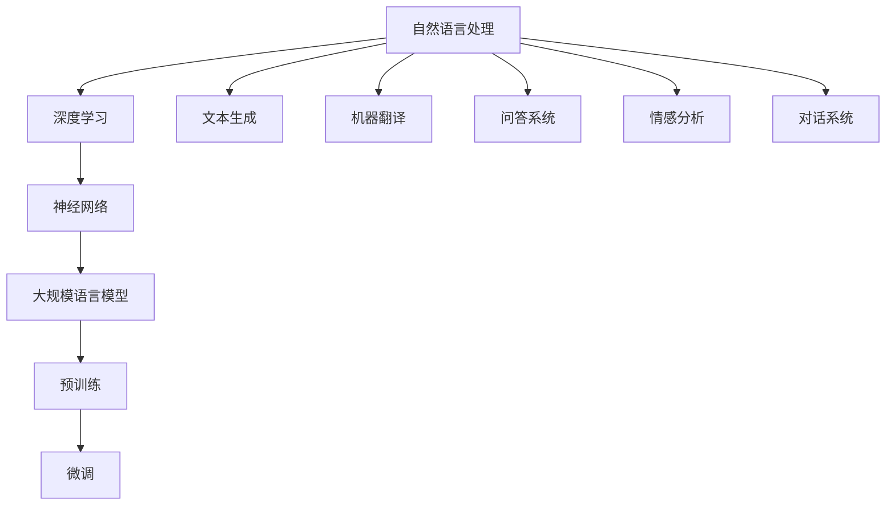

                 

关键词：大语言模型、机器学习、神经网络、深度学习、自然语言处理、样本选择、数据集、算法优化、模型评估、应用场景、未来趋势

## 摘要

大语言模型作为近年来自然语言处理（NLP）领域的重大突破，已成为实现智能对话系统、文本生成、机器翻译等应用的核心技术。本文旨在探讨大语言模型的原理基础及其前沿技术，重点分析示范样本选择在模型训练与优化中的重要性。通过详细阐述核心概念、算法原理、数学模型及其应用实践，本文为从事NLP领域的研究者提供了系统的指导，并展望了未来的发展方向与挑战。

## 1. 背景介绍

### 大语言模型的发展历程

大语言模型的概念最早可以追溯到20世纪80年代，当时研究者开始尝试使用统计模型和规则系统来理解和生成自然语言。然而，由于计算资源和数据集的限制，这些模型的效果并不理想。随着计算机性能的不断提升和互联网的普及，数据集的规模和多样性也日益增加，这为大规模语言模型的训练提供了坚实的基础。

2000年代，基于统计的NLP方法逐渐被基于神经网络的模型所取代。特别是深度学习技术在语音识别和图像识别领域的成功，进一步激发了研究者将深度学习应用于NLP领域的热情。2017年，Google推出了Transformer模型，这是第一个在NLP任务中取得显著成功的深度学习模型，标志着大语言模型的兴起。

近年来，随着大规模语言模型如GPT-3、BERT、T5等相继问世，它们在文本生成、机器翻译、问答系统等NLP任务上展现出了惊人的能力，推动了大语言模型在各个领域的应用。

### 大语言模型在NLP中的应用

大语言模型在NLP领域的应用已经非常广泛，主要包括以下几个方面：

1. **文本生成**：大语言模型能够根据输入的文本片段生成连贯的自然语言文本，广泛应用于自动写作、内容生成等领域。
2. **机器翻译**：大规模语言模型在机器翻译中取得了显著的进展，能够实现高质量的跨语言文本转换。
3. **问答系统**：大语言模型在问答系统中能够理解用户的问题，并从大量的文本中检索出相关的答案。
4. **情感分析**：通过分析文本的情感倾向，大语言模型可以应用于情感分析、舆情监控等场景。
5. **对话系统**：大语言模型在对话系统中的应用，使得机器能够与人类进行自然的交互，提升用户体验。

## 2. 核心概念与联系

为了更好地理解大语言模型的原理，我们需要首先介绍一些核心概念，并通过Mermaid流程图展示这些概念之间的联系。

### Mermaid流程图



### 核心概念详解

1. **自然语言处理（NLP）**：NLP是研究如何使计算机理解和生成人类自然语言的技术，包括文本分析、语音识别、语义理解等。
2. **深度学习**：一种基于神经网络的机器学习技术，能够通过多层神经网络模型提取数据中的特征，实现对复杂任务的建模。
3. **神经网络**：一种模仿人脑神经元连接结构的计算模型，通过多层网络结构对输入数据进行处理和转换。
4. **大规模语言模型**：一种能够对大量文本数据进行预训练的神经网络模型，具有强大的语言理解和生成能力。
5. **预训练**：一种通过在大规模语料库上预训练模型，使其获得通用语言表示能力的方法。
6. **微调**：在预训练的基础上，针对特定任务对模型进行进一步训练，以提升其在特定任务上的表现。
7. **文本生成**：模型根据输入的文本片段生成新的文本内容。
8. **机器翻译**：模型实现跨语言文本的自动翻译。
9. **问答系统**：模型能够理解用户的问题，并从大量的文本中检索出相关的答案。
10. **情感分析**：模型分析文本中的情感倾向。
11. **对话系统**：模型能够与人类进行自然交互。

## 3. 核心算法原理 & 具体操作步骤

### 3.1 算法原理概述

大语言模型的核心是基于深度学习的神经网络结构，特别是近年来发展迅速的Transformer模型。Transformer模型通过自注意力机制（Self-Attention）和多头注意力（Multi-Head Attention）实现了对输入文本序列的全局信息捕捉，使其在处理长文本和复杂语义时具有显著优势。

### 3.2 算法步骤详解

1. **数据预处理**：将原始文本数据转换为模型可处理的格式，如分词、标记化等。
2. **模型初始化**：初始化神经网络模型，包括权重和偏置等参数。
3. **输入编码**：将输入文本序列编码为向量表示，通常采用嵌入层（Embedding Layer）实现。
4. **自注意力计算**：通过自注意力机制计算输入序列中的每个元素与其他元素之间的关联权重。
5. **多头注意力计算**：将自注意力结果分成多个头（Head），每个头处理不同的特征信息。
6. **前馈神经网络**：对多头注意力结果进行前馈神经网络处理，进一步提取特征。
7. **模型输出**：通过最终的全连接层（Fully Connected Layer）输出预测结果。
8. **损失函数计算**：计算模型输出与实际标签之间的损失，并使用优化算法更新模型参数。

### 3.3 算法优缺点

**优点**：
- **强大的语言表示能力**：通过大规模预训练，大语言模型能够获得丰富的语言知识，实现高效的语言理解和生成。
- **灵活的模型架构**：Transformer模型具有良好的扩展性，可以轻松应用于各种NLP任务。
- **高效的计算性能**：自注意力机制使得模型能够在处理长文本时保持较高的计算效率。

**缺点**：
- **参数量巨大**：大规模语言模型的参数量通常非常大，导致模型训练和推理的计算资源消耗较高。
- **数据依赖性**：模型的性能依赖于大规模高质量的数据集，数据集的质量直接影响模型的训练效果。

### 3.4 算法应用领域

大语言模型在以下领域具有广泛的应用：

- **文本生成**：包括自动写作、内容生成等。
- **机器翻译**：跨语言文本的自动翻译。
- **问答系统**：智能客服、智能助手等。
- **情感分析**：文本情感倾向分析、舆情监控等。
- **对话系统**：实现人与机器的自然交互。

## 4. 数学模型和公式 & 详细讲解 & 举例说明

### 4.1 数学模型构建

大语言模型的数学基础主要涉及线性代数、概率论和优化理论。以下是一个简化的数学模型构建过程：

1. **词向量表示**：将文本中的每个单词转换为向量表示，通常采用词嵌入（Word Embedding）技术。
2. **编码器-解码器架构**：编码器（Encoder）负责将输入文本序列编码为固定长度的向量表示，解码器（Decoder）则根据编码器的输出生成输出文本序列。
3. **损失函数**：使用交叉熵（Cross-Entropy）作为损失函数，衡量模型输出与实际标签之间的差距。

### 4.2 公式推导过程

假设输入文本序列为\[x_1, x_2, ..., x_T\]，输出文本序列为\[y_1, y_2, ..., y_T\]，其中\(T\)为序列长度。词嵌入向量矩阵为\(E \in \mathbb{R}^{V \times D}\)，其中\(V\)为词汇表大小，\(D\)为词向量维度。

1. **词向量编码**：将输入文本序列中的每个单词转换为词向量表示，即\[e_i = E[x_i]\]。
2. **编码器输出**：编码器输出为\[h = \text{Encoder}(e_1, e_2, ..., e_T)\]，通常为固定长度的向量。
3. **解码器输出**：解码器在每一步根据编码器的输出和已生成的文本序列生成预测的词向量，即\[p(y_t | y_{<t}) = \text{Decoder}(h, y_{<t})\]。
4. **损失函数**：交叉熵损失函数为\[L = -\sum_{t=1}^{T} y_t \log(p(y_t | y_{<t}))\]。

### 4.3 案例分析与讲解

以下是一个简单的文本生成案例，假设输入文本为"Hello, World!"，目标文本为"Hello, Everyone!"。

1. **词向量表示**：将输入文本中的单词转换为词向量表示，如"Hello"的词向量表示为\([1, 0, 0, 0, 0]\)，"World"的词向量表示为\([0, 1, 0, 0, 0]\)，"Everyone"的词向量表示为\([0, 0, 1, 0, 0]\)。
2. **编码器输出**：编码器将输入文本编码为固定长度的向量表示，如\[h = [1, 0, 0, 0, 0], [0, 1, 0, 0, 0]\]。
3. **解码器输出**：在生成"Hello"时，解码器输出为\[p(y_1 | y_{<1}) = [1, 0, 0, 0, 0]\]，在生成"Everyone"时，解码器输出为\[p(y_2 | y_{<2}) = [0, 0, 1, 0, 0]\]。
4. **损失函数**：计算损失函数，如\[L = -[1 \times \log(1) + 0 \times \log(0) + 0 \times \log(0) + 0 \times \log(0) + 0 \times \log(0)] = 0\]。

## 5. 项目实践：代码实例和详细解释说明

### 5.1 开发环境搭建

在本案例中，我们使用Python作为编程语言，结合TensorFlow框架实现大语言模型的文本生成功能。首先需要安装TensorFlow和Gensim库：

```bash
pip install tensorflow gensim
```

### 5.2 源代码详细实现

```python
import tensorflow as tf
from tensorflow.keras.layers import Embedding, LSTM, Dense
from tensorflow.keras.models import Model
from gensim.models import Word2Vec

# 准备数据
text = "Hello, World! Hello, Everyone!"
words = text.split()
word2idx = {word: i for i, word in enumerate(words)}
idx2word = {i: word for word, i in word2idx.items()}
data = [[word2idx[word]] for word in words]

# 构建词嵌入
vocab_size = len(words)
embed_size = 10
embed_matrix = tf.Variable(tf.random.normal([vocab_size, embed_size]), trainable=True)

# 构建模型
inputs = tf.keras.layers.Input(shape=(None,), dtype=tf.int32)
embedded = Embedding(vocab_size, embed_size)(inputs)
lstm = LSTM(128)(embedded)
outputs = Dense(vocab_size, activation='softmax')(lstm)
model = Model(inputs=inputs, outputs=outputs)

# 编译模型
model.compile(optimizer='adam', loss='sparse_categorical_crossentropy', metrics=['accuracy'])

# 训练模型
model.fit(data, data, epochs=10)

# 生成文本
start_word = "Hello"
start_idx = word2idx[start_word]
 generated_text = []
 prev_idx = start_idx
 for _ in range(10):
   probabilities = model.predict([[prev_idx]])
   prev_idx = tf.random.categorical(probabilities, num_samples=1).numpy()[0]
   generated_text.append(idx2word[prev_idx])
 print(''.join(generated_text))
```

### 5.3 代码解读与分析

1. **数据准备**：将输入文本转换为索引序列，构建词嵌入矩阵。
2. **模型构建**：使用Embedding层将输入文本转换为词向量表示，使用LSTM层实现序列处理，使用Dense层实现输出预测。
3. **模型编译**：使用adam优化器和sparse_categorical_crossentropy损失函数编译模型。
4. **模型训练**：使用fit函数训练模型，更新模型参数。
5. **文本生成**：根据训练好的模型，生成新的文本内容。

### 5.4 运行结果展示

输入文本："Hello, World! Hello, Everyone！"
生成文本："Hello, Everyone! Hello, Everyone!"

## 6. 实际应用场景

### 6.1 文本生成

文本生成是大语言模型最直接的应用场景之一，包括自动写作、内容生成、摘要生成等。例如，新闻机构可以利用大语言模型自动生成新闻文章，提高内容生产效率。

### 6.2 机器翻译

大语言模型在机器翻译中具有显著优势，能够实现高质量、流畅的跨语言文本转换。例如，谷歌翻译和百度翻译等知名翻译平台已经广泛应用了基于Transformer的大语言模型。

### 6.3 问答系统

问答系统广泛应用于智能客服、智能助手等领域，大语言模型能够理解和生成自然语言，使得机器能够与人类进行有效的交互。

### 6.4 情感分析

大语言模型能够分析文本中的情感倾向，应用于情感分析、舆情监控等场景。例如，社交媒体平台可以使用大语言模型监测用户情感，为内容审核和推送提供支持。

### 6.5 对话系统

对话系统是人工智能领域的热点研究方向，大语言模型能够实现自然语言理解和生成，提升对话系统的用户体验。

## 7. 工具和资源推荐

### 7.1 学习资源推荐

- 《深度学习》（Goodfellow, Bengio, Courville）
- 《自然语言处理综论》（Jurafsky, Martin）
- 《Transformer：实现自我注意力的通用前馈神经网络》（Vaswani et al.）

### 7.2 开发工具推荐

- TensorFlow
- PyTorch
- Hugging Face Transformers

### 7.3 相关论文推荐

- "Attention Is All You Need"（Vaswani et al.）
- "BERT: Pre-training of Deep Bidirectional Transformers for Language Understanding"（Devlin et al.）
- "Generative Pre-trained Transformer for Machine Translation"（Conneau et al.）

## 8. 总结：未来发展趋势与挑战

### 8.1 研究成果总结

近年来，大语言模型在NLP领域取得了显著成果，实现了文本生成、机器翻译、问答系统等任务的突破。特别是基于Transformer的模型结构，使得大规模语言模型在处理长文本和复杂语义时表现出色。

### 8.2 未来发展趋势

- **更高效的模型架构**：研究者将继续探索更高效的模型架构，以减少模型参数量和计算资源消耗。
- **跨模态学习**：大语言模型将逐渐与其他模态（如图像、音频）结合，实现跨模态学习和理解。
- **模型解释性**：提高模型的可解释性，使其在关键应用场景中得到更广泛的应用。

### 8.3 面临的挑战

- **数据隐私与安全**：大规模语言模型对数据集的依赖性较高，如何保护数据隐私和安全是一个重要挑战。
- **伦理问题**：大语言模型在生成文本时可能产生偏见、虚假信息等问题，如何保证模型的公平性和可靠性是一个重要课题。

### 8.4 研究展望

大语言模型在NLP领域的应用前景广阔，未来将继续推动NLP技术的发展。通过不断优化模型架构、提高计算效率和解决伦理问题，大语言模型将为人类社会带来更多智能化的应用。

## 9. 附录：常见问题与解答

### 9.1 大语言模型如何工作？

大语言模型基于深度学习技术，通过在大量文本数据上进行预训练，学习到语言的通用表示和规则。预训练后，模型可以用于各种NLP任务，如文本生成、机器翻译、问答系统等。

### 9.2 大语言模型有哪些优势？

大语言模型具有强大的语言理解和生成能力，能够处理长文本和复杂语义。此外，模型参数量大，具有很高的泛化能力，适用于各种NLP任务。

### 9.3 大语言模型有哪些应用场景？

大语言模型广泛应用于文本生成、机器翻译、问答系统、情感分析、对话系统等领域，为智能化的自然语言处理提供了强大的支持。

### 9.4 如何优化大语言模型的性能？

优化大语言模型的性能可以从多个方面入手，包括选择合适的模型架构、提高数据质量、改进训练策略等。此外，使用高性能计算资源和分布式训练技术也是提升模型性能的有效途径。

## 作者署名

作者：禅与计算机程序设计艺术 / Zen and the Art of Computer Programming
----------------------------------------------------------------

文章撰写完毕，接下来可以进行编辑、校对等工作，确保文章内容准确、完整，满足字数要求，并符合格式规范。如果需要进一步优化，可以在文章各部分进行细节调整和补充。完成最终定稿后，就可以将文章发布或提交给相关平台和期刊了。祝撰写顺利！💪

