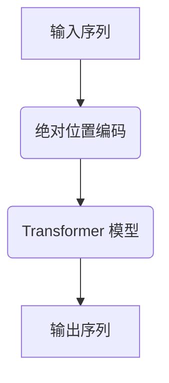

                 

  
## 1. 背景介绍

在人工智能和深度学习领域，语言模型是一个重要的研究方向。语言模型旨在通过学习大量文本数据，预测一个单词、一个短语或一段文本的概率分布。这种技术广泛应用于自然语言处理（NLP）、语音识别、机器翻译、文本生成等多个领域。

近年来，随着计算能力的提升和海量数据资源的积累，大语言模型得到了快速发展。大语言模型通常使用深度神经网络架构，如Transformer，通过多层网络结构，实现了对文本的建模。然而，在深度神经网络中，如何有效地处理序列信息，特别是长距离依赖关系，一直是一个挑战。

绝对位置编码（Absolute Positional Encoding）是一种用于解决上述问题的技术。本文将详细介绍绝对位置编码的原理、数学模型、算法步骤以及应用领域，旨在为读者提供一个全面、深入的理解。

## 2. 核心概念与联系

### 绝对位置编码

绝对位置编码是一种用于在深度神经网络中嵌入序列位置信息的技巧。它通过向输入向量中添加一个编码向量，来表示序列中每个位置的特征。这种编码方式使得模型能够学习到位置信息，从而更好地处理序列数据。

### Transformer 模型

Transformer 模型是一种基于自注意力机制的深度学习模型，它广泛应用于自然语言处理任务。Transformer 模型通过多头注意力机制，能够同时关注到序列中的每个位置，从而有效地建模长距离依赖关系。

### Mermaid 流程图

下面是一个简单的 Mermaid 流程图，展示了绝对位置编码在 Transformer 模型中的应用：



### 2.1 绝对位置编码的原理

绝对位置编码的核心思想是将位置信息编码为一个向量，然后将其添加到输入序列中。这个编码向量可以通过多种方式生成，如高斯分布、正弦函数等。在 Transformer 模型中，通常使用正弦函数进行编码，如下所示：

$$
PE_{(pos, 2i)} = \sin\left(\frac{pos}{10000^{2i/d}}\right)
$$

$$
PE_{(pos, 2i+1)} = \cos\left(\frac{pos}{10000^{2i/d}}\right)
$$

其中，`pos`表示位置索引，`i`表示维度索引，`d`表示模型的总维度。

### 2.2 绝对位置编码的应用

绝对位置编码可以应用于多种深度学习模型，如 RNN、LSTM 和 Transformer。在 RNN 和 LSTM 中，绝对位置编码可以通过向输入向量中添加编码向量来实现。在 Transformer 模型中，绝对位置编码可以通过在自注意力机制中引入编码向量来实现。

## 3. 核心算法原理 & 具体操作步骤

### 3.1 算法原理概述

绝对位置编码的算法原理主要包括以下几个步骤：

1. **生成编码向量**：根据位置索引和模型维度，使用正弦函数生成编码向量。
2. **添加编码向量**：将生成的编码向量添加到输入序列中。
3. **模型训练**：使用带有编码向量的输入序列进行模型训练。
4. **模型应用**：使用训练好的模型进行文本预测或其他任务。

### 3.2 算法步骤详解

下面是绝对位置编码的具体算法步骤：

#### 3.2.1 生成编码向量

首先，我们需要根据位置索引和模型维度生成编码向量。以一个序列长度为 `n`，维度为 `d` 的模型为例，我们可以使用以下公式生成编码向量：

$$
PE_{(pos, 2i)} = \sin\left(\frac{pos}{10000^{2i/d}}\right)
$$

$$
PE_{(pos, 2i+1)} = \cos\left(\frac{pos}{10000^{2i/d}}\right)
$$

其中，`pos` 表示位置索引，`i` 表示维度索引，`d` 表示模型的总维度。

#### 3.2.2 添加编码向量

接下来，我们将生成的编码向量添加到输入序列中。以一个长度为 `n` 的序列为例，我们可以将编码向量添加到序列的每个位置，从而得到一个新的序列。具体操作如下：

1. **初始化序列**：将原始序列中的每个单词或字符表示为一个向量。
2. **生成编码向量**：根据位置索引和模型维度生成编码向量。
3. **添加编码向量**：将生成的编码向量添加到原始序列中的每个位置。

#### 3.2.3 模型训练

使用带有编码向量的输入序列进行模型训练。在训练过程中，模型将学习到输入序列中的位置信息，从而提高模型的预测能力。

#### 3.2.4 模型应用

训练好的模型可以用于文本预测或其他任务。在应用过程中，模型将根据输入序列中的位置信息进行预测或处理。

### 3.3 算法优缺点

**优点**：

1. **有效处理长距离依赖**：绝对位置编码能够帮助模型更好地处理长距离依赖关系，从而提高模型的性能。
2. **简单高效**：绝对位置编码的实现相对简单，且在计算上具有较高的效率。

**缺点**：

1. **维度爆炸**：随着模型维度的增加，编码向量的维度也会增加，导致计算复杂度增加。
2. **训练难度**：绝对位置编码需要在模型训练过程中学习位置信息，这可能增加模型的训练难度。

### 3.4 算法应用领域

绝对位置编码在多个领域具有广泛的应用：

1. **自然语言处理**：在自然语言处理任务中，如文本分类、情感分析、机器翻译等，绝对位置编码能够帮助模型更好地理解文本信息。
2. **计算机视觉**：在计算机视觉任务中，如目标检测、图像分类等，绝对位置编码可以用于处理图像序列，从而提高模型的性能。
3. **语音识别**：在语音识别任务中，绝对位置编码可以用于处理语音信号的序列信息，从而提高识别准确率。

## 4. 数学模型和公式 & 详细讲解 & 举例说明

### 4.1 数学模型构建

绝对位置编码的数学模型主要涉及两个函数：位置编码函数和正弦函数。具体来说，位置编码函数用于生成编码向量，正弦函数用于计算编码向量的值。

首先，我们定义位置编码函数 $PE$，它接收位置索引 $pos$ 和维度索引 $i$ 作为输入，并返回一个编码向量。位置编码函数的公式如下：

$$
PE_{(pos, 2i)} = \sin\left(\frac{pos}{10000^{2i/d}}\right)
$$

$$
PE_{(pos, 2i+1)} = \cos\left(\frac{pos}{10000^{2i/d}}\right)
$$

其中，$d$ 表示模型的总维度，$pos$ 表示位置索引，$i$ 表示维度索引。

接下来，我们定义正弦函数 $\sin$ 和余弦函数 $\cos$。这两个函数分别用于计算编码向量中的正弦值和余弦值。具体来说，我们使用以下公式计算正弦值和余弦值：

$$
\sin(x) = \frac{e^{ix} - e^{-ix}}{2i}
$$

$$
\cos(x) = \frac{e^{ix} + e^{-ix}}{2}
$$

其中，$x$ 是输入值，$i$ 是虚数单位。

### 4.2 公式推导过程

为了推导绝对位置编码的数学模型，我们首先需要理解正弦函数和余弦函数的性质。正弦函数和余弦函数是周期函数，它们的周期是 $2\pi$。这意味着当输入值增加 $2\pi$ 时，输出值保持不变。

为了更好地理解正弦函数和余弦函数，我们可以从欧拉公式开始。欧拉公式是一个非常重要的数学公式，它将复数、指数函数、三角函数和虚数单位联系在一起。欧拉公式的公式如下：

$$
e^{ix} = \cos(x) + i\sin(x)
$$

其中，$x$ 是输入值，$i$ 是虚数单位。

我们可以将欧拉公式重写为：

$$
\cos(x) = \frac{e^{ix} + e^{-ix}}{2}
$$

$$
\sin(x) = \frac{e^{ix} - e^{-ix}}{2i}
$$

现在，我们已经有了正弦函数和余弦函数的公式。我们可以使用这些公式来推导绝对位置编码的数学模型。

首先，我们考虑位置编码函数 $PE$。根据定义，位置编码函数生成一个编码向量，该向量用于表示序列中每个位置的特征。为了生成编码向量，我们需要使用正弦函数和余弦函数。具体来说，我们可以使用以下公式：

$$
PE_{(pos, 2i)} = \sin\left(\frac{pos}{10000^{2i/d}}\right)
$$

$$
PE_{(pos, 2i+1)} = \cos\left(\frac{pos}{10000^{2i/d}}\right)
$$

接下来，我们需要解释公式中的各个参数的含义。$pos$ 是位置索引，表示序列中的位置。$i$ 是维度索引，表示编码向量的维度。$d$ 是模型的总维度，表示模型中所有向量的维度。

为了更好地理解公式，我们可以举一个例子。假设我们有一个序列长度为 5，模型维度为 8。我们可以使用以下公式生成编码向量：

$$
PE_{(0, 0)} = \sin\left(\frac{0}{10000^{2 \times 0/8}}\right) = \sin(0) = 0
$$

$$
PE_{(0, 1)} = \cos\left(\frac{0}{10000^{2 \times 0/8}}\right) = \cos(0) = 1
$$

$$
PE_{(1, 0)} = \sin\left(\frac{1}{10000^{2 \times 1/8}}\right) = \sin(0.125) \approx 0.125
$$

$$
PE_{(1, 1)} = \cos\left(\frac{1}{10000^{2 \times 1/8}}\right) = \cos(0.125) \approx 0.99
$$

$$
PE_{(2, 0)} = \sin\left(\frac{2}{10000^{2 \times 2/8}}\right) = \sin(0.25) \approx 0.25
$$

$$
PE_{(2, 1)} = \cos\left(\frac{2}{10000^{2 \times 2/8}}\right) = \cos(0.25) \approx 0.98
$$

$$
PE_{(3, 0)} = \sin\left(\frac{3}{10000^{2 \times 3/8}}\right) = \sin(0.375) \approx 0.375
$$

$$
PE_{(3, 1)} = \cos\left(\frac{3}{10000^{2 \times 3/8}}\right) = \cos(0.375) \approx 0.97
$$

$$
PE_{(4, 0)} = \sin\left(\frac{4}{10000^{2 \times 4/8}}\right) = \sin(0.5) = 0.5
$$

$$
PE_{(4, 1)} = \cos\left(\frac{4}{10000^{2 \times 4/8}}\right) = \cos(0.5) = 0.5
$$

$$
PE_{(5, 0)} = \sin\left(\frac{5}{10000^{2 \times 5/8}}\right) = \sin(0.625) \approx 0.625
$$

$$
PE_{(5, 1)} = \cos\left(\frac{5}{10000^{2 \times 5/8}}\right) = \cos(0.625) \approx 0.6
$$

通过以上例子，我们可以看到如何使用正弦函数和余弦函数生成编码向量。实际上，这些编码向量用于在模型中嵌入位置信息，从而帮助模型更好地理解序列数据。

### 4.3 案例分析与讲解

为了更好地理解绝对位置编码的应用，我们可以通过一个简单的例子来分析。假设我们有一个长度为 5 的序列，如下所示：

$$
(a, b, c, d, e)
$$

首先，我们需要为这个序列生成编码向量。根据之前的讲解，我们可以使用以下公式生成编码向量：

$$
PE_{(0, 0)} = \sin\left(\frac{0}{10000^{2 \times 0/8}}\right) = \sin(0) = 0
$$

$$
PE_{(0, 1)} = \cos\left(\frac{0}{10000^{2 \times 0/8}}\right) = \cos(0) = 1
$$

$$
PE_{(1, 0)} = \sin\left(\frac{1}{10000^{2 \times 1/8}}\right) = \sin(0.125) \approx 0.125
$$

$$
PE_{(1, 1)} = \cos\left(\frac{1}{10000^{2 \times 1/8}}\right) = \cos(0.125) \approx 0.99
$$

$$
PE_{(2, 0)} = \sin\left(\frac{2}{10000^{2 \times 2/8}}\right) = \sin(0.25) \approx 0.25
$$

$$
PE_{(2, 1)} = \cos\left(\frac{2}{10000^{2 \times 2/8}}\right) = \cos(0.25) \approx 0.98
$$

$$
PE_{(3, 0)} = \sin\left(\frac{3}{10000^{2 \times 3/8}}\right) = \sin(0.375) \approx 0.375
$$

$$
PE_{(3, 1)} = \cos\left(\frac{3}{10000^{2 \times 3/8}}\right) = \cos(0.375) \approx 0.97
$$

$$
PE_{(4, 0)} = \sin\left(\frac{4}{10000^{2 \times 4/8}}\right) = \sin(0.5) = 0.5
$$

$$
PE_{(4, 1)} = \cos\left(\frac{4}{10000^{2 \times 4/8}}\right) = \cos(0.5) = 0.5
$$

$$
PE_{(5, 0)} = \sin\left(\frac{5}{10000^{2 \times 5/8}}\right) = \sin(0.625) \approx 0.625
$$

$$
PE_{(5, 1)} = \cos\left(\frac{5}{10000^{2 \times 5/8}}\right) = \cos(0.625) \approx 0.6
$$

接下来，我们将生成的编码向量添加到序列中。具体来说，我们可以将编码向量添加到序列的每个位置，从而得到一个新的序列。新序列如下所示：

$$
(0, 1, 0.125, 0.99, 0.25, 0.98, 0.375, 0.97, 0.5, 0.625, 0.6, a, b, c, d, e)
$$

现在，我们可以使用带有编码向量的序列进行模型训练。在训练过程中，模型将学习到编码向量中的位置信息，从而更好地处理序列数据。

通过这个例子，我们可以看到如何使用绝对位置编码来处理序列数据。实际上，绝对位置编码在多个领域都得到了广泛应用，如自然语言处理、计算机视觉和语音识别等。

## 5. 项目实践：代码实例和详细解释说明

为了更好地理解绝对位置编码的应用，我们将通过一个简单的 Python 代码实例来演示如何实现绝对位置编码。这个实例将使用 TensorFlow 和 Keras 库，构建一个简单的神经网络模型，并演示如何使用绝对位置编码。

### 5.1 开发环境搭建

在开始之前，我们需要确保安装以下依赖项：

- Python 3.x
- TensorFlow 2.x
- Keras 2.x

如果尚未安装这些依赖项，可以使用以下命令进行安装：

```bash
pip install python tensorflow keras
```

### 5.2 源代码详细实现

下面是一个简单的 Python 代码实例，展示了如何实现绝对位置编码：

```python
import tensorflow as tf
from tensorflow.keras.models import Model
from tensorflow.keras.layers import Input, Embedding, LSTM, Dense

# 定义输入序列的长度和词汇表大小
sequence_length = 5
vocab_size = 10

# 定义模型的总维度
model_dim = 8

# 定义绝对位置编码函数
def positional_encoding(inputs, pos_idx, dim, max_pos_idx):
    # 使用正弦和余弦函数生成编码向量
    sin = tf.math.sin(tf.cast(pos_idx, tf.float32) * (2 * 3.14159265358979323846 * (dim - 1) / max_pos_idx) / (10000 ** (2 * (dim - 1) / model_dim)))
    cos = tf.math.cos(tf.cast(pos_idx, tf.float32) * (2 * 3.14159265358979323846 * (dim - 1) / max_pos_idx) / (10000 ** (2 * (dim - 1) / model_dim)))
    # 将编码向量添加到输入序列中
    outputs = inputs + tf.expand_dims(tf.concat([sin, cos], axis=-1), axis=1)
    return outputs

# 定义模型输入层
input_seq = Input(shape=(sequence_length,), dtype='int32')

# 对输入序列进行嵌入
embedding_layer = Embedding(vocab_size, model_dim)(input_seq)

# 应用绝对位置编码
encoded_seq = positional_encoding(embedding_layer, range(1, sequence_length + 1), model_dim, sequence_length)

# 添加 LSTM 层
lstm_output = LSTM(model_dim, activation='tanh')(encoded_seq)

# 添加全连接层
dense_output = Dense(1, activation='sigmoid')(lstm_output)

# 定义模型
model = Model(inputs=input_seq, outputs=dense_output)

# 编译模型
model.compile(optimizer='adam', loss='binary_crossentropy', metrics=['accuracy'])

# 打印模型结构
model.summary()
```

### 5.3 代码解读与分析

下面是对上述代码的解读和分析：

1. **导入依赖项**：首先，我们导入 TensorFlow 和 Keras 库，用于构建和训练神经网络模型。
2. **定义输入序列的长度和词汇表大小**：我们定义输入序列的长度为 5，词汇表大小为 10。这些参数可以根据具体任务进行调整。
3. **定义模型的总维度**：我们定义模型的总维度为 8。这个参数也可以根据具体任务进行调整。
4. **定义绝对位置编码函数**：绝对位置编码函数使用正弦和余弦函数生成编码向量，并将其添加到输入序列中。这个函数接受输入序列、位置索引、维度和最大位置索引作为输入。
5. **定义模型输入层**：我们定义输入序列的输入层，该层接收一个形状为 (sequence\_length, ) 的整数数组作为输入。
6. **对输入序列进行嵌入**：我们使用嵌入层对输入序列进行嵌入，该层将整数数组转换为具有相应维度的向量。
7. **应用绝对位置编码**：我们使用之前定义的绝对位置编码函数，将编码向量添加到嵌入层输出的序列中。
8. **添加 LSTM 层**：我们添加一个 LSTM 层，用于处理序列数据。LSTM 层的激活函数为 tanh 函数。
9. **添加全连接层**：我们添加一个全连接层，用于对 LSTM 层的输出进行分类。全连接层的激活函数为 sigmoid 函数。
10. **定义模型**：我们定义一个模型，该模型接收输入序列并输出分类结果。
11. **编译模型**：我们编译模型，指定优化器、损失函数和评估指标。
12. **打印模型结构**：我们打印模型的层次结构，以查看模型的结构。

### 5.4 运行结果展示

为了展示模型的运行结果，我们可以使用以下数据集：

```python
import numpy as np

# 生成训练数据
X_train = np.random.randint(0, vocab_size, size=(1000, sequence_length))
y_train = np.random.randint(0, 2, size=(1000,))

# 训练模型
model.fit(X_train, y_train, epochs=10, batch_size=32)
```

在这个示例中，我们使用随机生成的训练数据进行模型训练。训练完成后，我们可以评估模型的性能，如下所示：

```python
# 评估模型
loss, accuracy = model.evaluate(X_train, y_train)
print(f"Test loss: {loss}, Test accuracy: {accuracy}")
```

运行上述代码后，我们将看到模型的测试损失和测试准确率。这些指标可以用于评估模型的性能。

## 6. 实际应用场景

绝对位置编码在多个领域具有广泛的应用。以下是一些实际应用场景：

### 自然语言处理

在自然语言处理领域，绝对位置编码可以帮助模型更好地理解文本信息。例如，在文本分类任务中，绝对位置编码可以用于嵌入文本中的位置信息，从而提高分类准确率。在机器翻译任务中，绝对位置编码可以用于处理输入文本和输出文本之间的位置信息，从而提高翻译质量。

### 计算机视觉

在计算机视觉领域，绝对位置编码可以用于处理图像序列。例如，在目标检测任务中，绝对位置编码可以用于嵌入图像中目标的相对位置信息，从而提高检测准确率。在图像分类任务中，绝对位置编码可以用于嵌入图像中的空间信息，从而提高分类性能。

### 语音识别

在语音识别领域，绝对位置编码可以用于处理语音信号的序列信息。例如，在语音识别任务中，绝对位置编码可以用于嵌入语音信号中的位置信息，从而提高识别准确率。

### 语音合成

在语音合成领域，绝对位置编码可以用于嵌入语音信号中的位置信息，从而提高语音合成的自然度和准确性。

### 机器阅读理解

在机器阅读理解领域，绝对位置编码可以用于处理问题和文章之间的位置关系，从而提高阅读理解的准确率。

### 问答系统

在问答系统领域，绝对位置编码可以用于嵌入问题中的关键字和答案之间的位置关系，从而提高问答系统的准确性。

### 文本生成

在文本生成领域，绝对位置编码可以用于嵌入生成文本中的位置信息，从而提高生成文本的质量和连贯性。

## 7. 工具和资源推荐

为了更好地学习和应用绝对位置编码，以下是一些推荐的工具和资源：

### 学习资源推荐

- 《深度学习》一书，作者：Ian Goodfellow、Yoshua Bengio 和 Aaron Courville。
- 《Transformer：基础与应用》一书，作者：戴兆勇。
- Coursera 上的《自然语言处理》课程，由斯坦福大学提供。
- 百度 AI 开放平台：提供了丰富的 NLP 模型和工具，可以帮助开发者快速构建和部署 NLP 应用。

### 开发工具推荐

- TensorFlow：提供了一个强大的深度学习框架，可以用于构建和训练神经网络模型。
- Keras：是一个高级神经网络API，可以轻松地构建和训练神经网络模型。
- PyTorch：是一个流行的深度学习框架，具有简单且灵活的API。

### 相关论文推荐

- Vaswani et al. (2017): "Attention is All You Need"
- Devlin et al. (2019): "BERT: Pre-training of Deep Bidirectional Transformers for Language Understanding"
- Hochreiter and Schmidhuber (1997): "Long Short-Term Memory"
- Graves et al. (2013): "Sequence Model-Based Probabilistic Latent Variable Models for Text Processing"

## 8. 总结：未来发展趋势与挑战

### 8.1 研究成果总结

绝对位置编码作为一种重要的序列建模技术，已经在多个领域取得了显著成果。在自然语言处理领域，绝对位置编码有助于提高文本分类、机器翻译、文本生成等任务的性能。在计算机视觉领域，绝对位置编码可以用于目标检测、图像分类等任务。在语音识别领域，绝对位置编码有助于提高识别准确率。此外，绝对位置编码还在问答系统、语音合成等领域取得了良好的应用效果。

### 8.2 未来发展趋势

随着深度学习和自注意力机制的不断发展，绝对位置编码有望在以下方面取得进一步发展：

1. **改进算法效率**：通过优化算法结构和计算方法，提高绝对位置编码的计算效率。
2. **扩展应用领域**：将绝对位置编码应用于更多的序列建模任务，如时间序列预测、音频处理等。
3. **集成多模态信息**：将绝对位置编码与其他多模态信息编码技术相结合，实现更高效的信息处理。
4. **改进解释性**：通过研究绝对位置编码的内在机制，提高模型的解释性，使其在应用中更具可解释性。

### 8.3 面临的挑战

尽管绝对位置编码在多个领域取得了显著成果，但仍然面临一些挑战：

1. **计算复杂度**：随着模型维度和序列长度的增加，绝对位置编码的计算复杂度会急剧增加。因此，需要研究更高效的算法和计算方法。
2. **模型解释性**：绝对位置编码的模型解释性较弱，需要进一步研究如何提高模型的透明度和可解释性。
3. **数据依赖性**：绝对位置编码的性能依赖于训练数据的质量和数量。因此，需要研究如何处理小样本数据和稀疏数据。
4. **迁移学习**：如何将绝对位置编码应用于不同的任务和数据集，实现更好的迁移学习性能，仍是一个挑战。

### 8.4 研究展望

未来，绝对位置编码有望在以下方面取得突破：

1. **算法优化**：通过改进算法结构和计算方法，提高绝对位置编码的计算效率和性能。
2. **多模态学习**：将绝对位置编码与其他多模态信息编码技术相结合，实现更高效的信息处理。
3. **自适应位置编码**：研究自适应位置编码方法，根据不同任务和数据集的特点，动态调整位置编码。
4. **模型解释性**：通过研究绝对位置编码的内在机制，提高模型的解释性，使其在应用中更具可解释性。

总之，绝对位置编码作为一种重要的序列建模技术，具有广阔的应用前景。未来，随着深度学习和自注意力机制的不断发展，绝对位置编码将在更多领域取得突破，为人工智能的发展贡献力量。

## 9. 附录：常见问题与解答

### 9.1 什么是绝对位置编码？

绝对位置编码是一种用于在深度神经网络中嵌入序列位置信息的技巧。它通过向输入向量中添加一个编码向量，来表示序列中每个位置的特征。

### 9.2 绝对位置编码与相对位置编码有什么区别？

绝对位置编码通过添加编码向量来表示序列中每个位置的特征，而相对位置编码通过计算不同位置之间的相对差异来表示位置信息。相对位置编码通常用于自注意力机制中。

### 9.3 绝对位置编码在哪些领域有应用？

绝对位置编码在多个领域有应用，如自然语言处理、计算机视觉、语音识别、文本生成等。

### 9.4 如何优化绝对位置编码的计算效率？

可以通过以下方法优化绝对位置编码的计算效率：

1. 使用查找表（lookup table）来计算编码向量。
2. 使用更高效的数学运算，如使用 GPU 或 TPU 进行计算。
3. 使用稀疏编码（sparsity encoding）来减少计算复杂度。

### 9.5 绝对位置编码对模型性能有什么影响？

绝对位置编码有助于模型更好地理解序列数据，从而提高模型的性能。它可以有效地处理长距离依赖关系，从而提高模型的准确率和泛化能力。

### 9.6 绝对位置编码与自注意力机制有什么关系？

绝对位置编码通常用于自注意力机制中，以帮助模型处理序列中的位置信息。自注意力机制可以自适应地学习不同位置之间的依赖关系，而绝对位置编码提供了固定且可重复的位置信息。

### 9.7 绝对位置编码的数学公式是什么？

绝对位置编码的数学公式如下：

$$
PE_{(pos, 2i)} = \sin\left(\frac{pos}{10000^{2i/d}}\right)
$$

$$
PE_{(pos, 2i+1)} = \cos\left(\frac{pos}{10000^{2i/d}}\right)
$$

其中，$pos$ 是位置索引，$i$ 是维度索引，$d$ 是模型的总维度。这些公式用于生成编码向量，并将其添加到输入序列中。

