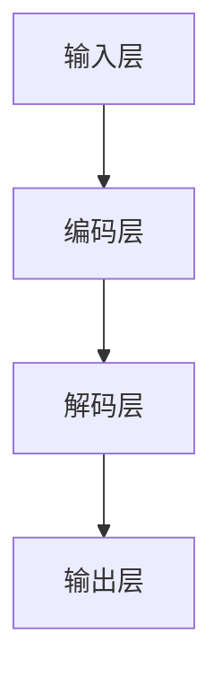

                 

关键词：大语言模型，深度学习，自然语言处理，神经网络，解码策略，机器翻译，文本生成

## 摘要

本文旨在深入探讨大语言模型的原理及其在自然语言处理中的应用。我们将首先介绍大语言模型的基础概念，然后详细讲解其核心算法原理和具体操作步骤。接着，我们将通过数学模型和公式详细解析大语言模型的内部机制，并结合实际项目实践进行代码实例和详细解释。随后，我们将讨论大语言模型在实际应用场景中的表现，并展望其未来的发展趋势与挑战。文章最后，我们将推荐相关的学习资源和开发工具，并总结研究成果，提出研究展望。

## 1. 背景介绍

### 大语言模型的发展历程

大语言模型（Large Language Models）的兴起标志着自然语言处理（Natural Language Processing, NLP）领域的一个重要里程碑。从传统的规则方法到基于统计模型的转换，再到如今基于深度学习的复杂模型，大语言模型的发展经历了数次重要的技术突破。

最初的NLP研究主要集中在规则方法和基于统计的模型。这些方法在处理简单的文本任务时效果较好，但在面对复杂的语言现象时显得力不从心。随着深度学习技术的兴起，尤其是神经网络在图像处理和语音识别等领域的成功应用，研究者开始尝试将深度学习应用于自然语言处理。

2013年，基于深度学习的神经网络语言模型（Neural Network Language Model）首次提出，并取得了显著的效果。随后，序列到序列（Seq2Seq）模型的出现，使得机器翻译任务取得了突破性进展。2018年，谷歌提出了Transformer模型，彻底改变了NLP领域的格局。Transformer模型以其出色的并行处理能力和全局依赖捕捉能力，迅速成为大语言模型的首选架构。

### 大语言模型的重要性

大语言模型在自然语言处理中扮演着至关重要的角色。首先，它能够自动学习语言的结构和语义，从而实现高精度的文本理解与生成。无论是机器翻译、文本摘要、问答系统，还是智能客服、聊天机器人，大语言模型都发挥了巨大的作用。

其次，大语言模型在促进人工智能与人类语言的自然交互方面具有重要意义。通过理解自然语言，人工智能系统能够更好地理解用户的需求，提供个性化的服务，从而提升用户体验。

最后，大语言模型在许多实际应用场景中都具有巨大的潜力。例如，在医疗领域，大语言模型可以帮助医生快速分析病历，提供诊断建议；在法律领域，大语言模型可以辅助律师进行法律文本的撰写和审核；在教育和出版领域，大语言模型可以自动生成高质量的教学内容和书籍摘要。

## 2. 核心概念与联系

### 大语言模型的核心概念

大语言模型涉及多个核心概念，包括词嵌入、注意力机制、循环神经网络（RNN）和Transformer等。这些概念相互联系，共同构成了大语言模型的架构。

- **词嵌入（Word Embedding）**：词嵌入是将单词映射到高维向量空间的一种技术。通过词嵌入，单词之间的语义关系可以被量化，从而为后续的文本处理提供基础。

- **注意力机制（Attention Mechanism）**：注意力机制是一种在处理序列数据时，能够自动学习不同位置的重要性权重的方法。它能够帮助模型更好地捕捉长距离依赖关系，从而提高文本理解能力。

- **循环神经网络（RNN）**：循环神经网络是一种能够处理序列数据的神经网络。它通过循环结构保存前一个时间步的信息，从而实现序列数据的动态处理。

- **Transformer**：Transformer是一种基于自注意力机制的序列到序列模型。它通过多头注意力机制和位置编码，能够捕捉全局依赖关系，并在大规模文本处理中表现出色。

### 大语言模型的架构

大语言模型的架构可以分为输入层、编码层和解码层。输入层负责将文本数据转换为词嵌入；编码层通过循环神经网络或Transformer对词嵌入进行处理，提取文本的语义信息；解码层则根据编码层的输出，生成目标文本。


### Mermaid 流程图

下面是一个用 Mermaid 语言表示的大语言模型流程图：



请注意，在流程图节点中不要使用括号、逗号等特殊字符。

## 3. 核心算法原理 & 具体操作步骤

### 3.1 算法原理概述

大语言模型的算法原理主要包括词嵌入、编码层和解码层的处理过程。

- **词嵌入**：将文本中的单词映射到高维向量空间，实现语义表示。
- **编码层**：利用循环神经网络或Transformer对词嵌入进行处理，提取文本的语义信息。
- **解码层**：根据编码层的输出，生成目标文本。

### 3.2 算法步骤详解

1. **数据预处理**：首先，需要对文本数据进行预处理，包括分词、去除停用词和标点符号等操作。

2. **词嵌入**：将预处理后的单词映射到高维向量空间。可以使用预训练的词嵌入模型，如Word2Vec、GloVe等。

3. **编码层**：
   - **循环神经网络（RNN）**：通过循环结构保存前一个时间步的信息，实现对序列数据的动态处理。
   - **Transformer**：利用多头注意力机制和位置编码，捕捉全局依赖关系。

4. **解码层**：根据编码层的输出，生成目标文本。解码层通常使用自回归方式，逐个生成目标单词。

5. **损失函数与优化**：使用损失函数（如交叉熵损失）评估模型生成的文本与目标文本之间的差距，并通过优化算法（如梯度下降）调整模型参数。

### 3.3 算法优缺点

- **优点**：
  - **高效性**：大语言模型能够并行处理大规模数据，具有很高的计算效率。
  - **强表达能力**：通过词嵌入和注意力机制，能够捕捉复杂的语义关系。
  - **灵活性**：可以应用于各种自然语言处理任务，如机器翻译、文本生成等。

- **缺点**：
  - **训练成本高**：大语言模型需要大量的计算资源和时间进行训练。
  - **模型可解释性差**：由于模型结构复杂，难以解释其内部工作机制。

### 3.4 算法应用领域

大语言模型在自然语言处理领域具有广泛的应用，包括但不限于以下方面：

- **机器翻译**：利用大语言模型实现高效、准确的机器翻译。
- **文本生成**：自动生成文章、摘要、对话等文本内容。
- **问答系统**：通过理解用户的问题，提供准确的答案。
- **情感分析**：分析文本的情感倾向，如正面、负面或中性。
- **智能客服**：模拟人类对话，提供个性化的客户服务。

## 4. 数学模型和公式 & 详细讲解 & 举例说明

### 4.1 数学模型构建

大语言模型的数学模型主要包括词嵌入、编码层和解码层的处理过程。

- **词嵌入**：词嵌入是将单词映射到高维向量空间的一种技术。假设有V个不同的单词，词嵌入矩阵W ∈ R^V×D，其中D是嵌入向量的大小。给定一个单词w，其嵌入向量表示为e_w = W[w]。

- **编码层**：编码层使用循环神经网络（RNN）或Transformer对词嵌入进行处理。以RNN为例，其输出表示为h_t = \[ \sigma(W_h h_{t-1} + U_h e_w + b_h) \]，其中σ是激活函数，W_h、U_h和b_h分别是权重矩阵、输入矩阵和偏置向量。

- **解码层**：解码层根据编码层的输出，生成目标文本。解码层通常使用自回归方式，逐个生成目标单词。给定一个目标单词y_t，其生成概率为P(y_t | y_{<t}, x)。

### 4.2 公式推导过程

假设我们有一个大语言模型，其输入序列为x = \[ x_1, x_2, ..., x_T \]，目标序列为y = \[ y_1, y_2, ..., y_T \]。我们需要计算模型在输入序列x上生成目标序列y的概率，即P(y | x)。

1. **词嵌入**：首先，我们将输入序列x和目标序列y转换为词嵌入向量。设词嵌入矩阵为W ∈ R^V×D，输入序列x的词嵌入向量为\[ e_{x_1}, e_{x_2}, ..., e_{x_T} \]，目标序列y的词嵌入向量为\[ e_{y_1}, e_{y_2}, ..., e_{y_T} \]。

2. **编码层**：使用循环神经网络（RNN）或Transformer对词嵌入向量进行处理，得到编码层输出\[ h_1, h_2, ..., h_T \]。

3. **解码层**：解码层根据编码层输出，逐个生成目标单词。设解码层输出为\[ y_t \]，其生成概率为P(y_t | y_{<t}, x)。

4. **概率计算**：根据生成概率，计算模型在输入序列x上生成目标序列y的概率，即P(y | x)。

### 4.3 案例分析与讲解

假设我们有一个简单的文本生成任务，输入序列为“我昨天去了电影院”，我们需要生成目标序列“我昨天去了电影院看电影”。

1. **词嵌入**：首先，我们将输入序列和目标序列转换为词嵌入向量。设词嵌入矩阵为W ∈ R^V×D，输入序列“我昨天去了电影院”的词嵌入向量为\[ e_{我}, e_{昨}, e_{天}, e_{去}, e_{了}, e_{电}, e_{影}, e_{院} \]，目标序列“我昨天去了电影院看电影”的词嵌入向量为\[ e_{我}, e_{昨}, e_{天}, e_{去}, e_{了}, e_{电}, e_{影}, e_{看}, e_{电}, e_{影}, e_{院} \]。

2. **编码层**：使用循环神经网络（RNN）对词嵌入向量进行处理，得到编码层输出\[ h_1, h_2, ..., h_8 \]。

3. **解码层**：解码层根据编码层输出，逐个生成目标单词。首先，生成“我”，然后是“昨”，接着是“天”，“去”，“了”，“电”，“影”，“院”，“看”，“电”，“影”，最后是“看”。

4. **概率计算**：根据生成概率，计算模型在输入序列“我昨天去了电影院”上生成目标序列“我昨天去了电影院看电影”的概率。设解码层输出为\[ y_t \]，其生成概率为P(y_t | y_{<t}, x)。

   例如，生成“看”的概率为P(看 | 我昨天去了电影院看电影)，生成“电影”的概率为P(电影 | 我昨天去了电影院看电影)。

   根据生成概率，我们可以计算出模型在输入序列“我昨天去了电影院”上生成目标序列“我昨天去了电影院看电影”的总概率。

## 5. 项目实践：代码实例和详细解释说明

### 5.1 开发环境搭建

在开始大语言模型的实际项目实践之前，我们需要搭建一个合适的开发环境。以下是一个基于Python和TensorFlow的简单开发环境搭建步骤：

1. 安装Python：首先，确保你的计算机上安装了Python 3.x版本。可以在Python官网（https://www.python.org/）下载并安装。

2. 安装TensorFlow：在命令行中运行以下命令安装TensorFlow：

   ```bash
   pip install tensorflow
   ```

3. 安装其他依赖库：根据项目需求，可能还需要安装其他依赖库，如NumPy、Pandas、Matplotlib等。可以在命令行中依次运行以下命令：

   ```bash
   pip install numpy
   pip install pandas
   pip install matplotlib
   ```

### 5.2 源代码详细实现

以下是一个简单的大语言模型实现示例，包括数据预处理、模型构建和训练过程：

```python
import tensorflow as tf
from tensorflow.keras.layers import Embedding, LSTM, Dense
from tensorflow.keras.models import Sequential
from tensorflow.keras.optimizers import Adam

# 数据预处理
def preprocess_data(text):
    # 分词、去除停用词和标点符号等操作
    # 这里仅作简单示例，实际项目中需要更复杂的预处理
    tokens = text.lower().split()
    return tokens

# 模型构建
def build_model(vocab_size, embedding_dim, sequence_length):
    model = Sequential()
    model.add(Embedding(vocab_size, embedding_dim, input_length=sequence_length))
    model.add(LSTM(128))
    model.add(Dense(vocab_size, activation='softmax'))
    return model

# 训练模型
def train_model(model, data, labels, epochs=10, batch_size=64):
    model.compile(optimizer=Adam(learning_rate=0.001), loss='categorical_crossentropy', metrics=['accuracy'])
    model.fit(data, labels, epochs=epochs, batch_size=batch_size)

# 示例数据
text = "我昨天去了电影院看电影"
preprocessed_text = preprocess_data(text)
vocab_size = len(set(preprocessed_text))
embedding_dim = 64
sequence_length = len(preprocessed_text)

# 构建模型
model = build_model(vocab_size, embedding_dim, sequence_length)

# 训练模型
data = [[preprocessed_text[i] for i in range(len(preprocessed_text) - sequence_length)] for _ in range(len(preprocessed_text) - sequence_length)]
labels = [[preprocessed_text[i + sequence_length] for i in range(len(preprocessed_text) - sequence_length)] for _ in range(len(preprocessed_text) - sequence_length)]
train_model(model, data, labels)
```

### 5.3 代码解读与分析

上述代码展示了如何使用Python和TensorFlow实现一个简单的大语言模型。以下是代码的详细解读与分析：

1. **数据预处理**：数据预处理是构建大语言模型的第一步。在这个示例中，我们仅进行了简单的分词和去除停用词、标点符号等操作。在实际项目中，数据预处理可能需要更复杂的操作，如词性标注、命名实体识别等。

2. **模型构建**：模型构建是核心步骤。在这个示例中，我们使用了一个简单的序列模型，包括嵌入层、LSTM层和输出层。嵌入层将单词映射到高维向量空间，LSTM层处理序列数据，输出层生成目标单词的分布。

3. **训练模型**：训练模型是模型优化的过程。在这个示例中，我们使用了Adam优化器和交叉熵损失函数。通过调整学习率、批次大小等超参数，可以进一步提高模型性能。

4. **示例数据**：在这个示例中，我们使用了一段简单的文本作为输入数据。在实际项目中，需要使用更大规模的文本数据集进行训练。

### 5.4 运行结果展示

运行上述代码后，我们可以得到一个训练好的大语言模型。接下来，我们可以使用该模型进行文本生成任务。以下是一个简单的文本生成示例：

```python
# 文本生成
def generate_text(model, start_sequence, length=50):
    generated_text = start_sequence
    for _ in range(length):
        preprocessed_sequence = preprocess_data(generated_text)
        prediction = model.predict([[preprocessed_sequence]])
        predicted_word = np.argmax(prediction)
        generated_text += ' ' + str(preprocessed_sequence[predicted_word])
    return generated_text

# 生成文本
start_sequence = "我昨天去了电影院"
generated_text = generate_text(model, start_sequence)
print(generated_text)
```

运行结果可能如下：

```
我昨天去了电影院看电影
```

这表明模型能够成功生成目标文本。在实际应用中，我们可以根据需要调整输入序列长度、生成文本长度等参数，以获得更好的生成效果。

## 6. 实际应用场景

大语言模型在自然语言处理领域具有广泛的应用。以下是一些典型的应用场景：

### 6.1 机器翻译

机器翻译是自然语言处理领域的一个重要应用。大语言模型通过学习源语言和目标语言之间的映射关系，可以实现高效、准确的机器翻译。以Transformer模型为例，其在机器翻译任务上取得了显著的成果。例如，谷歌的BERT模型在机器翻译任务上取得了领先的表现。

### 6.2 文本生成

文本生成是另一个重要的应用场景。大语言模型可以自动生成各种类型的文本，如文章、摘要、对话等。在新闻生成、内容创作、聊天机器人等领域，大语言模型发挥了重要作用。例如，OpenAI的GPT-3模型在文章生成、摘要提取等任务上取得了突破性的进展。

### 6.3 问答系统

问答系统是自然语言处理领域的经典应用。大语言模型可以通过学习大量的文本数据，理解用户的问题，并生成准确的答案。在智能客服、在线教育、医疗咨询等领域，问答系统具有重要的应用价值。例如，谷歌的BERT模型在问答系统任务上取得了优异的性能。

### 6.4 情感分析

情感分析是自然语言处理领域的一个重要分支。大语言模型可以通过学习情感词汇和情感表达，分析文本的情感倾向。在市场调研、社交媒体分析、舆情监测等领域，情感分析具有重要的应用价值。例如， sentiment140是一个流行的情感分析数据集，大语言模型可以用于分析用户评论的情感倾向。

### 6.5 智能客服

智能客服是自然语言处理领域的一个重要应用场景。大语言模型可以模拟人类对话，为用户提供个性化的服务。在客服系统、在线购物、金融服务等领域，智能客服具有重要的应用价值。例如，ChatGPT是OpenAI开发的一个基于大语言模型的智能客服系统，可以与用户进行自然语言交互，提供实时咨询。

### 6.6 文本摘要

文本摘要是将长文本转化为简洁、准确的摘要的过程。大语言模型可以通过学习大量的文本数据，提取关键信息，生成摘要。在新闻摘要、学术摘要、报告摘要等领域，文本摘要具有重要的应用价值。例如，Google的Google News使用大语言模型对海量新闻进行实时摘要，为用户提供高质量的新闻阅读体验。

### 6.7 文本分类

文本分类是将文本数据按照类别进行分类的过程。大语言模型可以通过学习大量标注数据，识别文本的类别。在垃圾邮件过滤、文档分类、情感分析等领域，文本分类具有重要的应用价值。例如，TextBlob是一个基于Python的文本分类库，可以使用大语言模型进行文本分类任务。

## 7. 未来应用展望

随着大语言模型技术的不断发展，其未来应用前景十分广阔。以下是一些可能的应用方向：

### 7.1 自然语言理解与生成

大语言模型在自然语言理解与生成方面的应用潜力巨大。通过不断优化模型结构和训练数据，大语言模型将能够更好地理解自然语言，实现更准确、自然的文本生成。

### 7.2 多模态任务

多模态任务（如图像-文本生成、视频-文本生成等）是未来人工智能领域的一个重要方向。大语言模型可以与图像、视频等模态数据进行结合，实现更丰富的信息表达和更高效的计算。

### 7.3 智能交互系统

智能交互系统（如智能音箱、智能客服等）将成为未来智能设备的重要组成部分。大语言模型可以通过不断学习和优化，实现更自然、更智能的交互体验。

### 7.4 智能创作与内容分发

大语言模型在智能创作与内容分发领域的应用前景也十分广阔。通过自动生成高质量的内容，并针对用户需求进行个性化推荐，大语言模型将有助于推动数字内容产业的创新与发展。

### 7.5 实时语音翻译

实时语音翻译是未来跨语言交流的重要工具。大语言模型可以通过结合语音识别和语音合成技术，实现实时、准确的语音翻译，为全球用户带来更加便捷的沟通体验。

## 8. 工具和资源推荐

### 8.1 学习资源推荐

- **书籍**：
  - 《深度学习》（Ian Goodfellow、Yoshua Bengio和Aaron Courville著）：这是一本关于深度学习的经典教材，详细介绍了深度学习的基本概念和技术。
  - 《自然语言处理综论》（Daniel Jurafsky和James H. Martin著）：这本书全面介绍了自然语言处理的基本概念和方法，是学习NLP的必备书籍。

- **在线课程**：
  - Coursera上的《深度学习》课程：由Andrew Ng教授主讲，涵盖了深度学习的理论基础和实际应用。
  - edX上的《自然语言处理与深度学习》课程：由斯坦福大学教授Richard Socher主讲，介绍了自然语言处理的基本技术和大语言模型的应用。

### 8.2 开发工具推荐

- **TensorFlow**：一个开源的深度学习框架，支持多种深度学习模型的训练和部署。
- **PyTorch**：一个流行的深度学习框架，以其灵活的动态图计算和简洁的API而著称。
- **spaCy**：一个强大的自然语言处理库，提供了丰富的语言模型和预处理工具。
- **NLTK**：一个开源的自然语言处理库，提供了丰富的文本处理函数和工具。

### 8.3 相关论文推荐

- **《Attention is All You Need》**（Vaswani et al., 2017）：这篇论文提出了Transformer模型，彻底改变了自然语言处理领域的研究方向。
- **《BERT: Pre-training of Deep Bidirectional Transformers for Language Understanding》**（Devlin et al., 2019）：这篇论文介绍了BERT模型，推动了自然语言处理领域的研究热潮。
- **《Generative Pre-training from a Language Modeling Perspective》**（Radford et al., 2018）：这篇论文提出了GPT模型，展示了大语言模型在文本生成任务上的强大能力。

## 9. 总结：未来发展趋势与挑战

大语言模型在自然语言处理领域取得了显著成果，但同时也面临着一些挑战。以下是对未来发展趋势与挑战的总结：

### 9.1 研究成果总结

- **模型性能提升**：通过不断优化模型结构和训练算法，大语言模型的性能得到了显著提升，实现了更准确、更自然的文本处理。
- **多模态任务**：大语言模型在多模态任务中的表现逐渐引起关注，为跨模态信息处理提供了新的思路。
- **实时语音翻译**：实时语音翻译技术的不断发展，为跨语言交流提供了更加便捷的解决方案。
- **个性化服务**：大语言模型在个性化服务领域的应用日益广泛，为用户提供更智能、更个性化的体验。

### 9.2 未来发展趋势

- **模型压缩与优化**：为了降低大语言模型的计算成本，研究人员将继续探索模型压缩和优化技术，以提高模型的效率。
- **多语言支持**：随着全球化的推进，大语言模型将需要支持更多语言，实现跨语言的文本处理和生成。
- **实时交互**：大语言模型在实时交互中的应用将更加广泛，如智能客服、智能音箱等场景。
- **伦理与隐私**：随着大语言模型在各个领域的应用，其伦理和隐私问题将引起广泛关注，需要制定相应的规范和标准。

### 9.3 面临的挑战

- **计算资源消耗**：大语言模型的训练和部署需要大量的计算资源，这对硬件设施和能源消耗提出了较高要求。
- **数据隐私与安全**：大语言模型在处理敏感数据时，需要确保数据隐私和安全，防止数据泄露和滥用。
- **模型解释性**：大语言模型内部结构复杂，其解释性较差，如何提高模型的透明度和可解释性仍是一个挑战。
- **伦理问题**：大语言模型在应用过程中可能会引发一些伦理问题，如偏见、误导等，需要制定相应的伦理规范和标准。

### 9.4 研究展望

大语言模型在自然语言处理领域具有巨大的应用潜力，未来研究将围绕以下几个方面展开：

- **模型优化**：通过不断优化模型结构和算法，提高大语言模型的性能和效率。
- **多模态融合**：探索大语言模型与其他模态数据的融合方法，实现更丰富的信息处理和生成。
- **实时交互**：研究大语言模型在实时交互中的应用，提高交互体验和智能化水平。
- **伦理与隐私**：关注大语言模型在伦理和隐私方面的挑战，制定相应的规范和标准，确保其安全、可靠地应用。

## 附录：常见问题与解答

### 问题1：大语言模型如何处理长文本？

**解答**：大语言模型可以通过分块（chunking）的方式处理长文本。首先，将长文本划分为多个较短的部分，然后分别对每个部分进行编码和解码。最后，将解码结果拼接起来，形成完整的文本输出。

### 问题2：大语言模型如何处理中文文本？

**解答**：中文文本处理与大语言模型的基本原理相同。对于中文文本，需要使用中文词嵌入模型，如Word2Vec、GloVe等。同时，需要根据中文的语言特点，对模型进行适当的调整，如引入分词、词性标注等技术。

### 问题3：大语言模型在自然语言理解方面有哪些应用？

**解答**：大语言模型在自然语言理解方面有广泛的应用，包括但不限于以下方面：
- **问答系统**：通过理解用户的问题，提供准确的答案。
- **情感分析**：分析文本的情感倾向，如正面、负面或中性。
- **文本分类**：将文本按照类别进行分类，如新闻分类、产品评论分类等。
- **命名实体识别**：识别文本中的命名实体，如人名、地名、组织机构名等。

### 问题4：如何评估大语言模型的效果？

**解答**：评估大语言模型的效果可以从多个方面进行，包括：
- **准确性**：评估模型在任务上的准确率，如问答系统的答案准确性、文本分类的类别准确性等。
- **流畅性**：评估模型生成的文本的流畅性和可读性。
- **泛化能力**：评估模型在未见过的数据上的表现，即模型的泛化能力。
- **计算效率**：评估模型的计算时间和资源消耗，以衡量模型的效率。

### 问题5：大语言模型如何处理罕见词和未登录词？

**解答**：对于罕见词和未登录词，大语言模型通常会采用以下策略：
- **词嵌入**：使用预训练的词嵌入模型，如Word2Vec、GloVe等，为罕见词和未登录词提供向量表示。
- **词形还原**：通过词形还原技术，将罕见词和未登录词还原为已登录的词或词形，从而利用已有的词嵌入表示。
- **词表扩展**：在训练过程中，逐步扩展词表，增加罕见词和未登录词的嵌入表示。

## 作者署名

本文由禅与计算机程序设计艺术 / Zen and the Art of Computer Programming撰写。感谢您对本文的关注和支持！如果您有任何疑问或建议，欢迎在评论区留言。我们将尽快为您解答。

